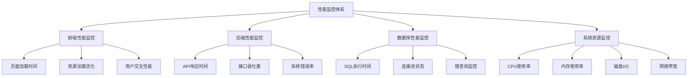

# IOE-DREAM系统性能优化指南

> **版本**: v1.0
> **更新时间**: 2025-11-13
> **适用系统**: IOE-DREAM智慧园区一卡通管理平台

## 1. 性能优化概述

IOE-DREAM智慧园区一卡通管理平台是一个复杂的企业级应用，涉及多个子系统和高并发访问。本指南从架构设计、代码实现、数据库优化、缓存策略等多个维度，提供全面的性能优化解决方案。

### 1.1 性能目标

- **响应时间**: API接口响应时间 < 200ms (P95)
- **并发能力**: 支持并发用户数 > 5000
- **吞吐量**: 系统TPS > 1000
- **可用性**: 系统可用性 > 99.9%
- **资源利用率**: CPU利用率 < 70%, 内存利用率 < 80%

### 1.2 性能监控体系



## 2. 前端性能优化

### 2.1 应用性能优化

#### 2.1.1 代码分割和懒加载

```javascript
// 路由懒加载配置
const routes = [
  {
    path: '/consumption',
    component: () => import('@/views/business/consumption/index.vue'),
    meta: { title: '消费管理' }
  },
  {
    path: '/attendance',
    component: () => import('@/views/business/attendance/index.vue'),
    meta: { title: '考勤管理' }
  }
]

// 组件懒加载
export default {
  components: {
    HeavyChart: () => import('@/components/HeavyChart.vue'),
    DataTable: () => import('@/components/DataTable.vue')
  }
}
```

#### 2.1.2 虚拟滚动优化

```vue
<template>
  <div class="virtual-list-container">
    <virtual-list
      :size="itemHeight"
      :remain="visibleCount"
      :bench="bufferSize"
      :start="startIndex"
      :offset="scrollTop"
      @scroll="handleScroll"
    >
      <div v-for="item in visibleItems" :key="item.id" class="list-item">
        <slot :item="item" :index="item.index" />
      </div>
    </virtual-list>
  </div>
</template>

<script>
import { VirtualList } from 'vue-virtual-scroll-list'

export default {
  components: { VirtualList },
  data() {
    return {
      itemHeight: 50,
      visibleCount: 20,
      bufferSize: 10,
      startIndex: 0,
      scrollTop: 0
    }
  },
  computed: {
    visibleItems() {
      return this.items.slice(
        this.startIndex,
        this.startIndex + this.visibleCount
      )
    }
  }
}
</script>
```

#### 2.1.3 防抖和节流

```javascript
// utils/performance.js
export const debounce = (fn, delay = 300) => {
  let timer = null
  return function (...args) {
    if (timer) clearTimeout(timer)
    timer = setTimeout(() => {
      fn.apply(this, args)
    }, delay)
  }
}

export const throttle = (fn, delay = 100) => {
  let lastTime = 0
  return function (...args) {
    const now = Date.now()
    if (now - lastTime > delay) {
      lastTime = now
      fn.apply(this, args)
    }
  }
}

// 使用示例
export default {
  methods: {
    handleSearch: debounce(function(query) {
      this.searchData(query)
    }),
    handleScroll: throttle(function(event) {
      this.updateScrollPosition(event)
    })
  }
}
```

### 2.2 资源优化

#### 2.2.1 图片优化

```javascript
// 图片懒加载组件
<template>
  
</template>

<script>
export default {
  directives: {
    lazy: {
      mounted(el, binding) {
        const observer = new IntersectionObserver((entries) => {
          entries.forEach(entry => {
            if (entry.isIntersecting) {
              el.src = binding.value
              observer.unobserve(el)
            }
          })
        })
        observer.observe(el)
      }
    }
  }
}
</script>
```

#### 2.2.2 CSS优化

```css
/* 使用硬件加速 */
.performance-optimized {
  transform: translateZ(0);
  will-change: transform, opacity;
}

/* 避免重排重绘 */
.layout-optimized {
  position: absolute;
  top: 0;
  left: 0;
}

/* CSS Sprites */
.icon-sprite {
  background-image: url(/images/sprite.png);
  background-repeat: no-repeat;
}

.icon-home {
  background-position: 0 0;
  width: 16px;
  height: 16px;
}
```

## 3. 后端性能优化

### 3.1 数据库优化

#### 3.1.1 索引优化策略

```sql
-- 用户表索引优化
CREATE INDEX idx_employee_department_id ON t_employee(department_id);
CREATE INDEX idx_employee_status ON t_employee(deleted_flag, status);
CREATE INDEX idx_employee_name ON t_employee(employee_name);

-- 考勤记录表索引优化
CREATE INDEX idx_attendance_employee_time ON t_attendance_record(employee_id, clock_time);
CREATE INDEX idx_attendance_device_time ON t_attendance_record(device_id, clock_time);
CREATE INDEX idx_attendance_date ON t_attendance_record(DATE(clock_time));

-- 消费记录表索引优化
CREATE INDEX idx_consumption_employee_time ON t_consumption_record(employee_id, consume_time);
CREATE INDEX idx_consumption_device_time ON t_consumption_record(device_id, consume_time);
CREATE INDEX idx_consumption_amount_time ON t_consumption_record(consume_amount, consume_time);

-- 复合索引示例
CREATE INDEX idx_composite_employee_month ON t_attendance_summary(employee_id, summary_month);
```

#### 3.1.2 查询优化

```java
@Service
public class AttendanceQueryService {

    /**
     * 分页查询优化 - 使用索引字段过滤
     */
    public PageResult<AttendanceRecordVO> queryAttendanceRecords(
            AttendanceQueryRequest request) {

        // 使用覆盖索引
        return attendanceDao.selectPage(
            new Page<>(request.getPageNum(), request.getPageSize()),
            new LambdaQueryWrapper<AttendanceRecordEntity>()
                .eq(StringUtils.isNotBlank(request.getEmployeeId()),
                   AttendanceRecordEntity::getEmployeeId, request.getEmployeeId())
                .between(request.getStartTime(), request.getEndTime(),
                   AttendanceRecordEntity::getClockTime)
                .orderByDesc(AttendanceRecordEntity::getClockTime)
        ).convert(this::convertToVO);
    }

    /**
     * 批量查询优化
     */
    @Cacheable(value = "attendance:batch", key = "#request.hashCode()", unless = "#result == null")
    public List<AttendanceRecordVO> batchQueryAttendanceRecords(
            BatchQueryRequest request) {

        // 分批次查询，避免内存溢出
        List<AttendanceRecordVO> results = new ArrayList<>();
        int batchSize = 1000;
        int offset = 0;

        while (true) {
            List<AttendanceRecordEntity> batch = attendanceDao.selectList(
                new LambdaQueryWrapper<AttendanceRecordEntity>()
                    .eq(request.getEmployeeId() != null,
                       AttendanceRecordEntity::getEmployeeId, request.getEmployeeId())
                    .ge(request.getStartTime(),
                       AttendanceRecordEntity::getClockTime, request.getStartTime())
                    .le(request.getEndTime(),
                       AttendanceRecordEntity::getClockTime, request.getEndTime())
                    .orderByDesc(AttendanceRecordEntity::getClockTime)
                    .last(offset, batchSize)
            );

            if (batch.isEmpty()) {
                break;
            }

            results.addAll(batch.stream()
                .map(this::convertToVO)
                .collect(Collectors.toList()));

            offset += batchSize;
        }

        return results;
    }
}
```

#### 3.1.3 连接池优化

```yaml
# application-dev.yml
spring:
  datasource:
    druid:
      initial-size: 5
      min-idle: 5
      max-active: 20
      max-wait: 60000
      time-between-eviction-runs-millis: 60000
      min-evictable-idle-time-millis: 300000
      validation-query: SELECT 1 FROM DUAL
      test-while-idle: true
      test-on-borrow: false
      test-on-return: false
      pool-prepared-statements: true
      max-pool-prepared-statement-per-connection-size: 20
      filters: stat,wall,log4j2
      connection-properties:
        druid.stat.mergeSql: true
        druid.stat.slowSqlMillis: 2000
        druid.stat.logSlowSql: true
```

### 3.2 缓存策略

#### 3.2.1 Redis缓存配置

```java
@Configuration
@EnableCaching
public class CacheConfig {

    @Bean
    public CacheManager cacheManager(RedisConnectionFactory connectionFactory) {
        RedisCacheConfiguration config = RedisCacheConfiguration.defaultCacheConfig()
            .entryTtl(Duration.ofMinutes(30))
            .serializeKeysWith(RedisSerializationContext.SerializationPair.fromSerializer(
                new StringRedisSerializer()))
            .serializeValuesWith(RedisSerializationContext.SerializationPair.fromSerializer(
                new GenericJackson2JsonRedisSerializer()));

        return RedisCacheManager.builder(connectionFactory)
            .cacheDefaults(config)
            .transactionAware()
            .build();
    }

    @Bean
    @Primary
    public RedisTemplate<String, Object> redisTemplate(
            RedisConnectionFactory connectionFactory) {
        RedisTemplate<String, Object> template = new RedisTemplate<>();
        template.setConnectionFactory(connectionFactory);
        template.setKeySerializer(new StringRedisSerializer());
        template.setValueSerializer(new GenericJackson2JsonRedisSerializer());
        template.setHashKeySerializer(new StringRedisSerializer());
        template.setHashValueSerializer(new GenericJackson2JsonRedisSerializer());
        return template;
    }
}
```

#### 3.2.2 多级缓存策略

```java
@Service
public class MultiLevelCacheService {

    @Resource
    private RedisTemplate<String, Object> redisTemplate;

    @Resource
    private CacheManager localCacheManager;

    /**
     * 多级缓存查询
     */
    @Cacheable(value = "attendance:detail", key = "#recordId", unless = "#result == null")
    public AttendanceDetailVO getAttendanceDetail(Long recordId) {
        // 一级缓存：本地缓存
        Cache localCache = localCacheManager.getCache("attendanceDetail");
        Cache.ValueWrapper wrapper = localCache.get(recordId);
        if (wrapper != null) {
            return (AttendanceDetailVO) wrapper.get();
        }

        // 二级缓存：Redis缓存
        String redisKey = "attendance:detail:" + recordId;
        Object cachedValue = redisTemplate.opsForValue().get(redisKey);
        if (cachedValue != null) {
            AttendanceDetailVO result = (AttendanceDetailVO) cachedValue;
            // 写入本地缓存
            localCache.put(recordId, result);
            return result;
        }

        // 数据库查询
        AttendanceDetailVO result = attendanceDao.selectDetailById(recordId);
        if (result != null) {
            // 写入二级缓存
            redisTemplate.opsForValue().set(redisKey, result, Duration.ofMinutes(30));
            // 写入一级缓存
            localCache.put(recordId, result);
        }

        return result;
    }
}
```

### 3.3 异步处理

#### 3.3.1 异步服务配置

```java
@Configuration
@EnableAsync
public class AsyncConfig {

    @Bean("taskExecutor")
    public ThreadPoolTaskExecutor taskExecutor() {
        ThreadPoolTaskExecutor executor = new ThreadPoolTaskExecutor();
        executor.setCorePoolSize(10);
        executor.setMaxPoolSize(50);
        executor.setQueueCapacity(1000);
        executor.setKeepAliveSeconds(60);
        executor.setThreadNamePrefix("async-task-");
        executor.setRejectedExecutionHandler(new ThreadPoolExecutor.CallerRunsPolicy());
        executor.initialize();
        return executor;
    }

    @Bean("businessExecutor")
    public ThreadPoolTaskExecutor businessExecutor() {
        ThreadPoolTaskExecutor executor = new ThreadPoolTaskExecutor();
        executor.setCorePoolSize(5);
        executor.setMaxPoolSize(20);
        executor.setQueueCapacity(500);
        executor.setKeepAliveSeconds(30);
        executor.setThreadNamePrefix("business-async-");
        executor.setRejectedExecutionHandler(new ThreadPoolExecutor.AbortPolicy());
        executor.initialize();
        return executor;
    }
}
```

#### 3.3.2 异步业务处理

```java
@Service
public class AsyncAttendanceService {

    @Resource
    private AttendanceRecordDao attendanceRecordDao;

    @Resource
    private NotificationService notificationService;

    /**
     * 异步处理考勤记录
     */
    @Async("businessExecutor")
    @EventListener
    public void handleAttendanceRecord(AttendanceEvent event) {
        try {
            // 保存考勤记录
            AttendanceRecordEntity record = convertToEntity(event);
            attendanceRecordDao.insert(record);

            // 异步发送通知
            notificationService.sendAttendanceNotification(event);

            // 更新统计数据
            updateAttendanceStatistics(event);

        } catch (Exception e) {
            log.error("异步处理考勤记录失败", e);
            // 错误处理和重试机制
            handleAsyncError(event, e);
        }
    }

    /**
     * 异步批量处理
     */
    @Async("taskExecutor")
    public CompletableFuture<Void> batchProcessRecords(List<AttendanceEvent> events) {
        return CompletableFuture.runAsync(() -> {
            List<CompletableFuture<Void>> futures = events.stream()
                .map(event -> CompletableFuture.runAsync(() -> handleAttendanceRecord(event)))
                .collect(Collectors.toList());

            // 等待所有任务完成
            CompletableFuture.allOf(futures).join();
        });
    }
}
```

## 4. 数据库性能优化

### 4.1 SQL优化

#### 4.1.1 分页查询优化

```sql
-- 传统分页（性能较差）
SELECT * FROM t_attendance_record
WHERE employee_id = 1001
ORDER BY clock_time DESC
LIMIT 20 OFFSET 10000;

-- 优化后的分页（使用游标）
SELECT * FROM t_attendance_record
WHERE employee_id = 1001
  AND clock_time < '2025-11-13 10:00:00'
ORDER BY clock_time DESC
LIMIT 20;

-- 使用索引覆盖的查询优化
SELECT t1.* FROM t_attendance_record t1
INNER JOIN (
    SELECT id FROM t_attendance_record
    WHERE employee_id = 1001
    ORDER BY clock_time DESC
    LIMIT 20 OFFSET 10000
) t2 ON t1.id = t2.id
ORDER BY t1.clock_time DESC;
```

#### 4.1.2 统计查询优化

```java
@Service
public class AttendanceStatisticsService {

    /**
     * 使用索引优化的统计查询
     */
    public AttendanceStatisticsVO getDailyStatistics(LocalDate date, Long departmentId) {

        // 使用日期范围索引
        LocalDate startTime = date.atStartOfDay().toLocalDate();
        LocalDate endTime = date.atTime(23, 59, 59).toLocalDate();

        // 单次查询获取所有统计数据
        return attendanceMapper.selectDailyStatistics(startTime, endTime, departmentId);
    }
}

<!-- Mapper XML -->
<select id="selectDailyStatistics" resultType="AttendanceStatisticsVO">
    SELECT
        COUNT(*) as totalCount,
        COUNT(CASE WHEN verification_method = 'FACE' THEN 1 END) as faceCount,
        COUNT(CASE WHEN verification_method = 'FINGERPRINT' THEN 1 END) as fingerprintCount,
        COUNT(CASE WHEN late_flag = 1 THEN 1 END) as lateCount,
        COUNT(CASE WHEN abnormal_flag = 1 THEN 1 END) as abnormalCount,
        SUM(CASE WHEN overtime_hours > 0 THEN overtime_hours ELSE 0 END) as totalOvertimeHours
    FROM t_attendance_record
    WHERE clock_time BETWEEN #{startTime} AND #{endTime}
    <if test="departmentId != null">
        AND employee_id IN (
            SELECT employee_id FROM t_employee WHERE department_id = #{departmentId}
        )
    </if>
</select>
```

### 4.2 数据库连接优化

#### 4.2.1 读写分离配置

```java
@Configuration
public class DatabaseConfig {

    @Bean
    @ConfigurationProperties(prefix = "spring.datasource.master")
    public DataSource masterDataSource() {
        return DataSourceBuilder.create().build();
    }

    @Bean
    @ConfigurationProperties(prefix = "spring.datasource.slave")
    public DataSource slaveDataSource() {
        return DataSourceBuilder.create().build();
    }

    @Bean
    public DataSource routingDataSource() {
        RoutingDataSource routingDataSource = new RoutingDataSource();
        Map<Object, Object> dataSourceMap = new HashMap<>();
        dataSourceMap.put("master", masterDataSource());
        dataSourceMap.put("slave", slaveDataSource());
        routingDataSource.setTargetDataSources(dataSourceMap);
        routingDataSource.setDefaultTargetDataSource(masterDataSource());
        return routingDataSource;
    }

    @Bean
    public DataSourceTransactionManager transactionManager(
            @Qualifier("routingDataSource") DataSource dataSource) {
        return new DataSourceTransactionManager(dataSource);
    }
}

// 读写分离注解
@Target({ElementType.METHOD, ElementType.TYPE})
@Retention(RetentionPolicy.RUNTIME)
public @interface ReadOnly {
}
```

## 5. 系统架构优化

### 5.1 微服务优化

#### 5.1.1 服务熔断机制

```java
@Component
public class AttendanceServiceCircuitBreaker {

    @Resource
    private CircuitBreaker circuitBreaker;

    @Resource
    private AttendanceRemoteService attendanceRemoteService;

    /**
     * 熔断保护的考勤查询
     */
    public AttendanceRecordVO getAttendanceRecord(Long recordId) {
        Supplier<AttendanceRecordVO> supplier = CircuitBreaker
            .decorateSupplier(() -> attendanceRemoteService.getRecord(recordId))
            .withCircuitBreaker(circuitBreaker)
            .withFallback(this::getFallbackRecord);

        return supplier.get();
    }

    private AttendanceRecordVO getFallbackRecord(Long recordId) {
        // 降级处理：从缓存或备用数据源获取
        log.warn("考勤服务熔断，使用降级策略 recordId: {}", recordId);
        return getFromCache(recordId);
    }
}
```

#### 5.1.2 限流策略

```java
@Configuration
public class RateLimitConfig {

    @Bean
    public RateLimiter attendanceRateLimiter() {
        return RateLimiter.create(100); // 每秒100个请求
    }

    @Bean
    public RateLimiter reportRateLimiter() {
        return RateLimiter.create(20); // 每秒20个请求
    }
}

@Service
public class AttendanceService {

    @Resource
    private RateLimiter attendanceRateLimiter;

    /**
     * 限流保护的查询接口
     */
    public PageResult<AttendanceRecordVO> queryAttendanceRecords(
            AttendanceQueryRequest request) {

        // 尝试获取许可，等待最多1秒
        if (!attendanceRateLimiter.tryAcquire(1, TimeUnit.SECONDS)) {
            throw new BusinessException("系统繁忙，请稍后再试");
        }

        return performQuery(request);
    }
}
```

### 5.2 监控和诊断

#### 5.2.1 性能指标收集

```java
@Component
public class PerformanceMetrics {

    private final MeterRegistry meterRegistry;
    private final Timer queryTimer;
    private final Counter errorCounter;

    public PerformanceMetrics(MeterRegistry meterRegistry) {
        this.meterRegistry = meterRegistry;
        this.queryTimer = Timer.builder("attendance.query.time")
            .description("考勤查询响应时间")
            .register(meterRegistry);
        this.errorCounter = Counter.builder("attendance.error.count")
            .description("考勤系统错误次数")
            .register(meterRegistry);
    }

    public void recordQueryTime(Duration duration) {
        queryTimer.record(duration);
    }

    public void recordError(String operation) {
        errorCounter.increment(Tags.of("operation", operation));
    }

    public void recordConcurrentUsers(int count) {
        Metrics.gauge("attendance.concurrent.users", count);
    }
}
```

#### 5.2.2 健康检查

```java
@Component
public class PerformanceHealthIndicator implements HealthIndicator {

    @Resource
    private PerformanceService performanceService;

    @Override
    public Health health() {
        Health.Builder builder = Health.up();

        // 检查查询响应时间
        Duration avgQueryTime = performanceService.getAverageQueryTime();
        if (avgQueryTime.toMillis() > 500) {
            builder.down()
                .withDetail("query_performance", "查询响应时间过长")
                .withDetail("avg_query_time_ms", avgQueryTime.toMillis());
        }

        // 检查错误率
        double errorRate = performanceService.getErrorRate();
        if (errorRate > 0.01) {
            builder.status(Status.WARNING)
                .withDetail("error_rate", errorRate)
                .withDetail("description", "错误率偏高");
        }

        // 检查并发用户数
        int concurrentUsers = performanceService.getCurrentConcurrentUsers();
        if (concurrentUsers > 1000) {
            builder.status(Status.WARNING)
                .withDetail("concurrent_users", concurrentUsers)
                .withDetail("description", "并发用户数较高");
        }

        return builder
            .withDetail("avg_query_time_ms", avgQueryTime.toMillis())
            .withDetail("error_rate", errorRate)
            .withDetail("concurrent_users", concurrentUsers)
            .build();
    }
}
```

## 6. 部署优化

### 6.1 JVM优化

```bash
# 生产环境JVM参数
-Xms2g -Xmx4g
-XX:+UseG1GC
-XX:MaxGCPauseMillis=200
-XX:G1HeapRegionSize=16m
-XX:+UseStringDeduplication
-XX:+OptimizeStringConcat
-XX:+UseCompressedOops
-XX:+CompressedClassSpaceSize=256m
-XX:MetaspaceSize=256m
-XX:MaxDirectMemorySize=512m
-XX:ReservedCodeCacheSize=64m
-Dspring.profiles.active=prod
```

### 6.2 Nginx配置优化

```nginx
# nginx.conf
upstream backend {
    server 192.168.1.100:8080 weight=1 max_fails=3 fail_timeout=30s;
    server 192.168.1.101:8080 weight=1 max_fails=3 fail_timeout=30s;
}

server {
    listen 80;

    # 启用gzip压缩
    gzip on;
    gzip_min_length 1024;
    gzip_types text/plain text/css application/json application/javascript text/xml application/xml application/xml+rss text/javascript;

    # 静态资源缓存
    location ~* \.(jpg|jpeg|png|gif|ico|css|js)$ {
        expires 30d;
        add_header Cache-Control "public";
    }

    # API代理
    location /api/ {
        proxy_pass http://backend;
        proxy_set_header Host $host;
        proxy_set_header X-Real-IP $remote_addr;
        proxy_set_header X-Forwarded-For $proxy_add_x_forwarded_for;

        # 连接池优化
        proxy_http_version 1.1;
        proxy_set_header Connection "";
        proxy_buffering on;
        proxy_buffer_size 64k;
        proxy_buffers 32 64k;
        proxy_busy_buffers_size 128k;
    }
}
```

## 7. 性能测试

### 7.1 压力测试方案

```yaml
# jmeter测试计划
test_plan:
  name: "IOE-DREAM性能测试"
  threads:
    - thread_group: "用户并发测试"
      num_threads: 500
      ramp_time: 60
      duration: 300
    - thread_group: "API压力测试"
      num_threads: 1000
      ramp_time: 30
      duration: 180

  targets:
    - url: "http://localhost:8080/api/attendance/records"
      method: GET
      headers:
        Content-Type: application/json
        Authorization: Bearer ${token}
      think_time: 1000
```

### 7.2 性能基准

```bash
# Apache Bench基准测试
ab -n 10000 -c 100 -H "Authorization: Bearer ${token}" \
   http://localhost:8080/api/attendance/records

# curl 简单性能测试
time curl -X GET -H "Authorization: Bearer ${token}" \
  http://localhost:8080/api/attendance/records?pageNum=1&pageSize=20
```

## 8. 监控和告警

### 8.1 Prometheus指标

```yaml
# prometheus.yml
global:
  scrape_interval: 15s

scrape_configs:
  - job_name: 'ioe-dream'
    static_configs:
      - targets: ['localhost:8080/actuator/prometheus']
    metrics_path: '/actuator/prometheus'
    scrape_interval: 10s

rule_files:
  - "alert_rules.yml"
```

### 8.2 Grafana仪表板

```json
{
  "dashboard": {
    "title": "IOE-DREAM性能监控",
    "panels": [
      {
        "title": "API响应时间",
        "type": "graph",
        "targets": [
          {
            "expr": "histogram_quantile(0.95, http_server_requests_seconds_bucket)"
          }
        ]
      },
      {
        "title": "系统负载",
        "type": "graph",
        "targets": [
          {
            "expr": "system_load_average"
          }
        ]
      },
      {
        "title": "内存使用率",
        "type": "graph",
        "targets": [
          {
            "expr": "process_resident_memory_bytes / jvm_memory_max_bytes * 100"
          }
        ]
      }
    ]
  }
}
```

通过以上全面的性能优化措施，IOE-DREAM智慧园区一卡通管理平台可以实现高性能、高可用性的运行，为用户提供优秀的使用体验。