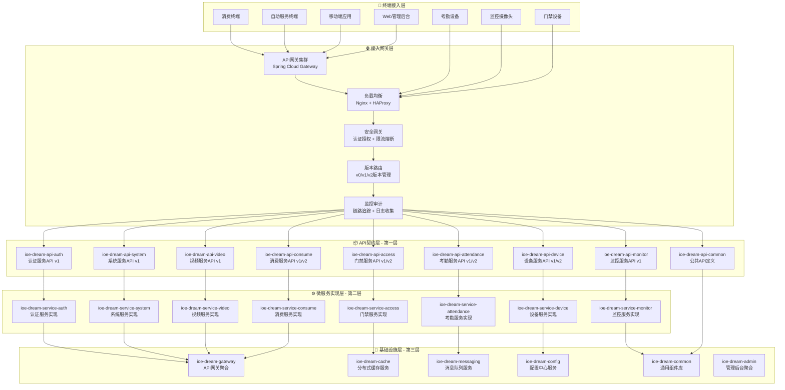
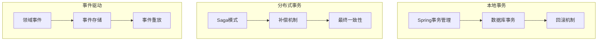
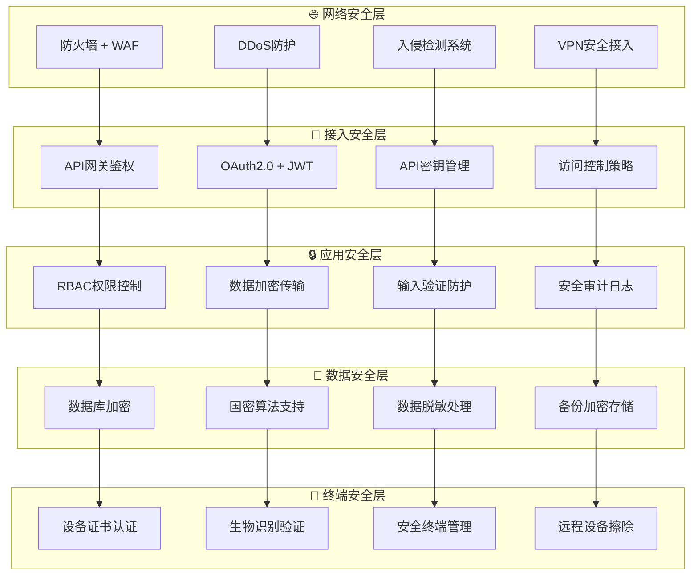
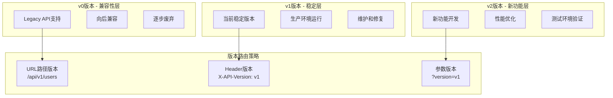
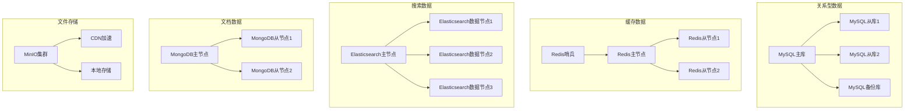
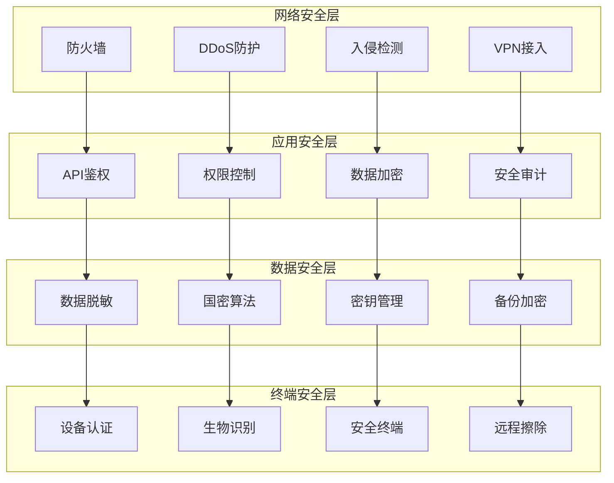
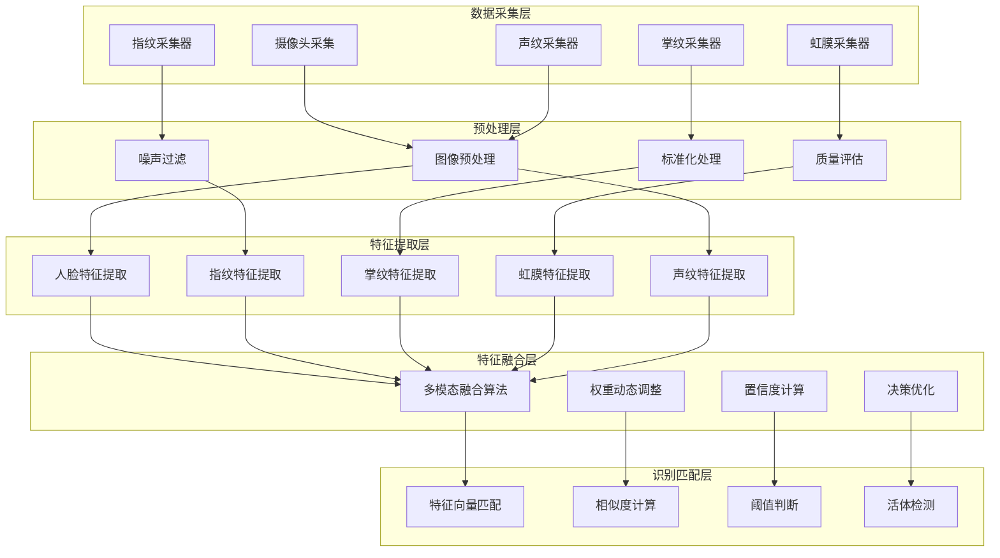
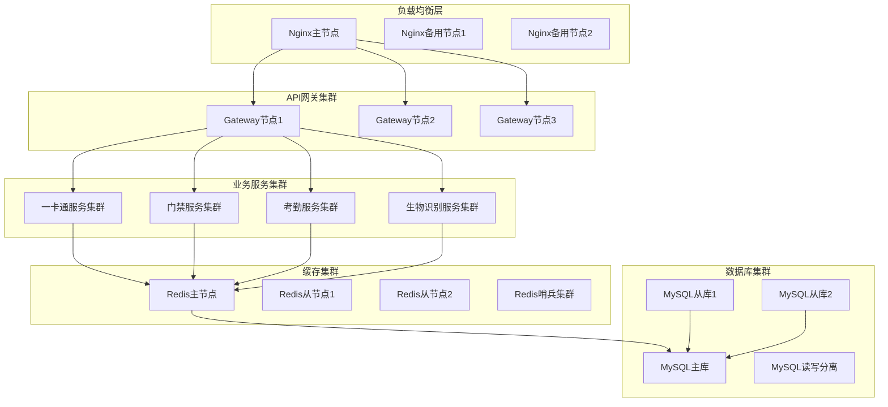
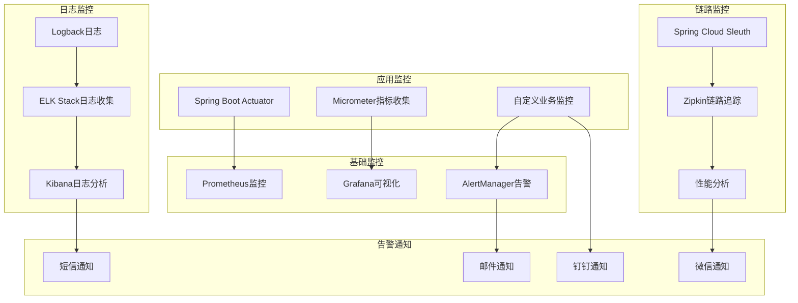
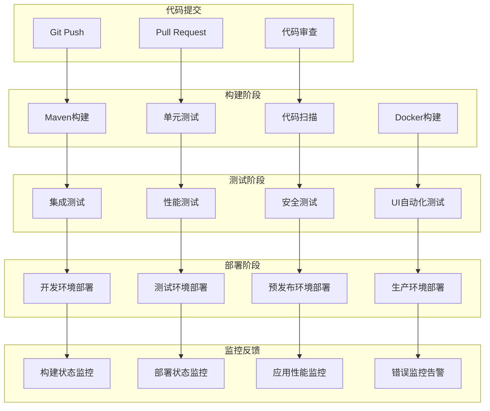

# IOE-DREAM智慧园区一卡通管理平台技术架构 v3.0

## 📋 战略架构升级说明

**重大升级**: IOE-DREAM平台已完成从伪微服务到**真正企业级微服务架构**的战略升级，实现完全的API契约驱动和领域驱动设计。

### 🚨 升级前问题诊断
原项目存在严重的架构反模式问题：
- ❌ **伪微服务架构**: 所有业务模块堆砌在sa-admin单体中
- ❌ **包结构混乱**: 域对象、服务接口、实现类混杂无序
- ❌ **缺少API契约**: 没有独立的API定义和版本管理模块
- ❌ **无版本管理**: 缺少API版本管理和兼容性策略
- ❌ **架构耦合**: 业务模块间存在严重的紧耦合关系

### ✅ 升级后核心成果
- ✅ **真正微服务架构**: 按业务域拆分的独立微服务
- ✅ **API契约优先**: API定义与实现完全分离
- ✅ **版本化管理**: v0/v1/v2多版本API支持
- ✅ **DDD领域驱动**: 按业务领域组织架构
- ✅ **基础设施分离**: 独立的缓存、消息、配置服务
- ✅ **网关统一接入**: API网关统一路由和安全控制

## 系统概述

IOE-DREAM智慧园区一卡通管理平台是一套基于现代化微服务架构和AI技术的综合性智慧园区管理解决方案。平台采用**API契约优先**的设计理念，基于**领域驱动设计(DDD)**架构，提供高可用、高安全性的分布式服务，整合了多模态生物识别、智能门禁、考勤管理、消费管理、视频监控、访客管理等核心业务模块。

### 🚀 技术特色

#### 🏗️ 架构设计特色
- **🎯 真正微服务架构**: 按业务域拆分的独立微服务，完全解耦
- **📦 API契约优先**: API定义与实现完全分离，支持多版本并存
- **🔢 版本化管理**: v0(兼容) + v1(稳定) + v2(新功能)完整版本策略
- **🎨 领域驱动设计**: DDD战略设计和战术设计完整实践
- **⚙️ 基础设施分离**: 缓存、消息、配置、监控独立服务
- **🌐 网关统一接入**: 统一路由、鉴权、限流、监控

#### 🤖 AI智能特色
- **👁️ 多模态生物识别**: 人脸、指纹、掌纹、虹膜、声纹融合识别
- **🧠 智能分析引擎**: 深度学习算法支持行为分析和异常检测
- **📊 实时决策**: AI驱动的实时业务决策和预警系统
- **🎯 智能推荐**: 基于用户行为的个性化服务推荐

#### 🔒 安全与国产化
- **🛡️ 国密算法支持**: SM2/SM3/SM4国产加密算法集成
- **🔐 多层安全防护**: 网络安全、应用安全、数据安全、终端安全
- **🏢 国产化适配**: 支持国产CPU、操作系统、数据库
- **📋 合规保障**: 满足等保2.0和行业安全标准

#### ⚡ 性能与可靠性
- **🚀 高并发处理**: 支持万人级园区高并发访问
- **🔄 高可用架构**: 多活数据中心，故障自动切换
- **📈 弹性伸缩**: 基于Kubernetes的自动扩缩容
- **📱 多端协同**: Web、移动端、自助终端、设备端协同

## 🏗️ 全新微服务架构设计

### 架构总体布局



## 🏗️ 微服务架构分层设计

### 第一层：API契约层 (API Contract Layer)

**职责**: 定义服务间接口契约，实现API与实现的完全分离

#### 模块结构
```
ioe-dream-api/
├── ioe-dream-api-consume/           # 消费服务API
│   ├── v1/                          # 稳定版本
│   │   ├── dto/                     # 数据传输对象
│   │   ├── enums/                   # 枚举定义
│   │   ├── vo/                      # 值对象
│   │   └── ConsumeApiV1.java       # API接口定义
│   ├── v2/                          # 新功能版本
│   └── v0/                          # 兼容性版本
├── ioe-dream-api-access/            # 门禁服务API
├── ioe-dream-api-attendance/        # 考勤服务API
├── ioe-dream-api-device/            # 设备服务API
├── ioe-dream-api-monitor/           # 监控服务API
├── ioe-dream-api-video/             # 视频服务API
├── ioe-dream-api-system/            # 系统服务API
├── ioe-dream-api-auth/              # 认证服务API
└── ioe-dream-api-common/            # 公共API定义
```

#### 设计原则
- **契约优先**: API设计先于实现
- **版本管理**: 支持v0/v1/v2多版本并存
- **向后兼容**: v2支持v1客户端
- **类型安全**: 强类型DTO和枚举定义

### 第二层：微服务实现层 (Service Implementation Layer)

**职责**: 实现具体的业务逻辑，遵循DDD架构模式

#### 架构模式
每个微服务采用标准的DDD四层架构：
```
ioe-dream-service-{module}/
├── application/                     # 应用层
│   ├── service/                     # 应用服务
│   ├── facade/                      # 外观模式
│   └── event/                       # 事件处理
├── domain/                          # 领域层
│   ├── model/                       # 领域模型
│   ├── service/                     # 领域服务
│   ├── repository/                  # 仓储接口
│   └── event/                       # 领域事件
├── infrastructure/                   # 基础设施层
│   ├── repository/impl/             # 仓储实现
│   ├── messaging/                   # 消息处理
│   └── external/                    # 外部服务
└── interfaces/                      # 接口层
    ├── rest/                        # REST控制器
    ├── dto/                         # 接口DTO
    └── mapper/                      # 对象映射
```

#### 服务列表
- **消费服务**: 账户管理、交易处理、充值退款
- **门禁服务**: 权限控制、通行记录、区域管理
- **考勤服务**: 考勤规则、排班管理、统计分析
- **设备服务**: 设备接入、状态监控、配置管理
- **监控服务**: 实时监控、告警管理、数据采集
- **视频服务**: 视频流处理、智能分析、存储管理
- **系统服务**: 用户管理、权限管理、系统配置
- **认证服务**: 身份认证、单点登录、令牌管理

### 第三层：基础设施层 (Infrastructure Layer)

**职责**: 提供通用的基础设施服务和技术组件

#### 核心组件
- **API网关**: 统一接入、路由、鉴权、限流
- **缓存服务**: 分布式缓存、会话管理、数据缓存
- **消息服务**: 异步消息、事件驱动、事务消息
- **配置中心**: 配置管理、动态刷新、环境隔离
- **通用组件**: 工具类、基础类、通用业务组件

## 🔄 数据一致性架构

### 事务管理策略



#### 事务边界设计
- **本地事务**: 单服务内使用Spring事务管理
- **分布式事务**: 跨服务使用Saga模式
- **最终一致性**: 通过事件驱动保证数据最终一致
- **补偿机制**: 失败时执行补偿操作

#### 事件驱动架构
```java
// 领域事件发布
@Component
public class DomainEventPublisher {

    @Resource
    private RabbitTemplate rabbitTemplate;

    public void publish(DomainEvent event) {
        // 1. 保存事件到事件存储
        eventStore.save(event);

        // 2. 发布到消息队列
        rabbitTemplate.convertAndSend(
            event.getRoutingKey(),
            event
        );
    }
}

// 事件处理
@RabbitListener(queues = "consume.events")
public class ConsumeEventHandler {

    @EventListener
    public void handle(AccountCreatedEvent event) {
        // 处理账户创建事件
        notificationService.sendWelcomeMessage(event.getAccountId());
    }
}
```

## 🔐 安全架构设计

### 多层安全防护体系



### 国密算法集成实现

```java
@Service
@Slf4j
public class NationalCryptographyService {

    @Resource
    private SM2KeyService sm2KeyService;

    @Resource
    private SM4EncryptionService sm4EncryptionService;

    /**
     * SM2数字签名
     */
    public String sm2Sign(String data, String privateKey) {
        try {
            SM2Engine sm2Engine = new SM2Engine();
            SM2PrivateKey sm2PrivateKey = SM2KeyUtils.parsePrivateKey(privateKey);

            byte[] dataBytes = data.getBytes(StandardCharsets.UTF_8);
            byte[] signature = sm2Engine.sign(sm2PrivateKey, dataBytes);

            return Base64.getEncoder().encodeToString(signature);
        } catch (Exception e) {
            log.error("SM2签名失败", e);
            throw new CryptographicException("SM2签名失败", e);
        }
    }

    /**
     * SM4数据加密
     */
    public String sm4Encrypt(String plainText, String key) {
        try {
            SM4Engine sm4Engine = new SM4Engine();
            byte[] keyBytes = Hex.decode(key);
            KeyParameter keyParameter = new KeyParameter(keyBytes);

            sm4Engine.init(true, keyParameter);
            byte[] plainBytes = plainText.getBytes(StandardCharsets.UTF_8);
            byte[] encryptedBytes = new byte[sm4Engine.getOutputSize(plainBytes.length)];

            int len = sm4Engine.processBytes(plainBytes, 0, plainBytes.length, encryptedBytes, 0);
            sm4Engine.doFinal(encryptedBytes, len);

            return Hex.toHexString(encryptedBytes);
        } catch (Exception e) {
            log.error("SM4加密失败", e);
            throw new CryptographicException("SM4加密失败", e);
        }
    }

    /**
     * 数据库字段加密
     */
    @Converter(autoApply = true)
    public static class EncryptedStringConverter implements AttributeConverter<String, String> {

        @Override
        public String convertToDatabaseColumn(String attribute) {
            if (attribute == null) {
                return null;
            }
            // 使用SM4加密敏感数据
            return nationalCryptographyService.sm4Encrypt(attribute, getEncryptionKey());
        }

        @Override
        public String convertToEntityAttribute(String dbData) {
            if (dbData == null) {
                return null;
            }
            // 使用SM4解密敏感数据
            return nationalCryptographyService.sm4Decrypt(dbData, getEncryptionKey());
        }
    }
}
```

## 🚀 API版本管理架构

### 版本管理策略



### API版本实现示例

```java
@RestController
@RequestMapping("/api")
public class MultiVersionUserController {

    // v1版本 - 稳定版本
    @GetMapping("/v1/users")
    public ResponseDTO<List<UserVO>> getUsersV1() {
        return ResponseDTO.ok(userService.getAllUsers());
    }

    // v2版本 - 新功能版本
    @GetMapping("/v2/users")
    public ResponseDTO<PageResult<UserVO>> getUsersV2(
            @RequestParam(defaultValue = "1") int page,
            @RequestParam(defaultValue = "10") int size) {
        return ResponseDTO.ok(userService.getUsersWithPagination(page, size));
    }

    // v0版本 - 兼容版本
    @GetMapping("/v0/users")
    public ResponseDTO<List<UserLegacyVO>> getUsersV0() {
        List<UserLegacyVO> legacyUsers = userService.getAllUsers().stream()
            .map(this::convertToLegacy)
            .collect(Collectors.toList());
        return ResponseDTO.ok(legacyUsers);
    }

    // 版本兼容处理
    @GetMapping("/users")
    public ResponseDTO<?> getUsers(
            @RequestHeader(value = "X-API-Version", defaultValue = "v1") String version,
            @RequestParam(required = false) String versionParam) {

        String finalVersion = determineVersion(version, versionParam);

        switch (finalVersion) {
            case "v0":
                return getUsersV0();
            case "v1":
                return getUsersV1();
            case "v2":
                return getUsersV2(1, 10);
            default:
                throw new UnsupportedVersionException("不支持的API版本: " + finalVersion);
        }
    }

    private String determineVersion(String headerVersion, String paramVersion) {
        return paramVersion != null ? paramVersion : headerVersion;
    }
}
```

## 数据架构设计

### 数据存储架构



### 数据库分库分表策略

```java
@Configuration
public class DatabaseShardingConfig {

    /**
     * 一卡通数据分片策略
     */
    @Bean
    public ShardingRuleConfiguration cardShardingRule() {
        return ShardingRuleConfiguration.builder()
            .addTableRuleConfiguration(getCardTableRule())
            .addDatabaseShardingStrategyConfiguration("card_db",
                new InlineDatabaseShardingStrategyConfiguration("card_id", "card_db_${card_id % 4}"))
            .addTableShardingStrategyConfiguration("t_smart_card",
                new InlineTableShardingStrategyConfiguration("card_id", "t_smart_card_${card_id % 8}"))
            .build();
    }

    /**
     * 访客记录分片策略（按时间分片）
     */
    @Bean
    public ShardingRuleConfiguration visitorShardingRule() {
        return ShardingRuleConfiguration.builder()
            .addTableRuleConfiguration(getVisitorTableRule())
            .addTableShardingStrategyConfiguration("t_visitor_visit",
                new StandardShardingStrategyConfiguration("visit_date", VisitorDateShardingAlgorithm.class))
            .build();
    }
}

/**
 * 访客日期分片算法
 */
public class VisitorDateShardingAlgorithm implements PreciseShardingAlgorithm<LocalDate> {

    @Override
    public String doSharding(Collection<String> availableTargetNames, PreciseShardingValue<LocalDate> shardingValue) {
        LocalDate date = shardingValue.getValue();
        String yearMonth = date.format(DateTimeFormatter.ofPattern("yyyyMM"));

        return availableTargetNames.stream()
            .filter(target -> target.endsWith(yearMonth))
            .findFirst()
            .orElseThrow(() -> new IllegalArgumentException("未找到匹配的分片"));
    }
}
```

## 安全架构设计

### 多层安全防护



### 国密算法集成

```java
@Service
public class CryptographicService {

    @Resource
    private SM2KeyService sm2KeyService;

    @Resource
    private SM3DigestService sm3DigestService;

    @Resource
    private SM4EncryptionService sm4EncryptionService;

    /**
     * SM2非对称加密
     */
    public String sm2Encrypt(String plainText, String publicKey) {
        try {
            SM2Engine sm2Engine = new SM2Engine();
            SM2PublicKey sm2PublicKey = SM2KeyUtils.parsePublicKey(publicKey);

            byte[] encryptedData = sm2Engine.encrypt(
                plainText.getBytes(StandardCharsets.UTF_8), sm2PublicKey);

            return Base64.getEncoder().encodeToString(encryptedData);
        } catch (Exception e) {
            throw new CryptographicException("SM2加密失败", e);
        }
    }

    /**
     * SM3消息摘要
     */
    public String sm3Digest(String data) {
        try {
            SM3Digest sm3 = new SM3Digest();
            byte[] dataBytes = data.getBytes(StandardCharsets.UTF_8);
            sm3.update(dataBytes, 0, dataBytes.length);

            byte[] digest = new byte[sm3.getDigestSize()];
            sm3.doFinal(digest, 0);

            return Hex.toHexString(digest);
        } catch (Exception e) {
            throw new CryptographicException("SM3摘要计算失败", e);
        }
    }

    /**
     * SM4对称加密
     */
    public String sm4Encrypt(String plainText, String key) {
        try {
            SM4Engine sm4Engine = new SM4Engine();
            byte[] keyBytes = Hex.decode(key);
            KeyParameter keyParameter = new KeyParameter(keyBytes);

            sm4Engine.init(true, keyParameter);
            byte[] plainBytes = plainText.getBytes(StandardCharsets.UTF_8);
            byte[] encryptedBytes = new byte[sm4Engine.getOutputSize(plainBytes.length)];

            int len = sm4Engine.processBytes(plainBytes, 0, plainBytes.length, encryptedBytes, 0);
            sm4Engine.doFinal(encryptedBytes, len);

            return Base64.getEncoder().encodeToString(encryptedBytes);
        } catch (Exception e) {
            throw new CryptographicException("SM4加密失败", e);
        }
    }
}
```

## AI技术架构

### 多模态生物识别引擎



### AI推理引擎

```java
@Service
public class AIInferenceEngine {

    @Resource
    private ModelManager modelManager;

    @Resource
    private ThreadPoolExecutor inferenceExecutor;

    /**
     * 多模态生物识别推理
     */
    public CompletableFuture<RecognitionResult> recognizeMultiModal(
            MultiModalInput input) {

        return CompletableFuture.supplyAsync(() -> {
            try {
                // 1. 数据预处理
                PreprocessedData preprocessedData = preprocessInput(input);

                // 2. 多模态特征提取
                Map<String, FeatureVector> features = extractFeatures(preprocessedData);

                // 3. 特征融合
                FusedFeature fusedFeature = fuseFeatures(features);

                // 4. 匹配识别
                RecognitionResult result = matchWithDatabase(fusedFeature);

                // 5. 后处理
                return postprocessResult(result);

            } catch (Exception e) {
                logger.error("多模态识别推理失败", e);
                throw new InferenceException("推理失败", e);
            }
        }, inferenceExecutor);
    }

    /**
     * 特征提取
     */
    private Map<String, FeatureVector> extractFeatures(PreprocessedData data) {
        Map<String, FeatureVector> features = new HashMap<>();

        // 人脸特征提取
        if (data.getFaceImage() != null) {
            Model faceModel = modelManager.getModel("face_recognition");
            features.put("face", faceModel.inference(data.getFaceImage()));
        }

        // 指纹特征提取
        if (data.getFingerprintImage() != null) {
            Model fingerprintModel = modelManager.getModel("fingerprint_recognition");
            features.put("fingerprint", fingerprintModel.inference(data.getFingerprintImage()));
        }

        // 掌纹特征提取
        if (data.getPalmPrintImage() != null) {
            Model palmModel = modelManager.getModel("palm_print_recognition");
            features.put("palm_print", palmModel.inference(data.getPalmPrintImage()));
        }

        return features;
    }

    /**
     * 特征融合算法
     */
    private FusedFeature fuseFeatures(Map<String, FeatureVector> features) {
        // 使用加权平均融合
        Map<String, Double> weights = getFusionWeights();
        double[] fusedVector = new double[512]; // 假设特征向量维度为512

        for (Map.Entry<String, FeatureVector> entry : features.entrySet()) {
            String modality = entry.getKey();
            FeatureVector vector = entry.getValue();
            double weight = weights.getOrDefault(modality, 0.0);

            for (int i = 0; i < fusedVector.length; i++) {
                fusedVector[i] += vector.getValue(i) * weight;
            }
        }

        return new FusedFeature(fusedVector);
    }
}
```

## 性能架构设计

### 高并发处理架构



### 性能优化策略

```java
@Configuration
@EnableAsync
@EnableCaching
public class PerformanceConfig {

    /**
     * 异步任务线程池配置
     */
    @Bean("cardTaskExecutor")
    public ThreadPoolTaskExecutor cardTaskExecutor() {
        ThreadPoolTaskExecutor executor = new ThreadPoolTaskExecutor();
        executor.setCorePoolSize(20);
        executor.setMaxPoolSize(100);
        executor.setQueueCapacity(1000);
        executor.setKeepAliveSeconds(60);
        executor.setThreadNamePrefix("card-task-");
        executor.setRejectedExecutionHandler(new ThreadPoolExecutor.CallerRunsPolicy());
        executor.initialize();
        return executor;
    }

    /**
     * 生物识别异步线程池配置
     */
    @Bean("biometricExecutor")
    public ThreadPoolTaskExecutor biometricExecutor() {
        ThreadPoolTaskExecutor executor = new ThreadPoolTaskExecutor();
        executor.setCorePoolSize(10);
        executor.setMaxPoolSize(50);
        executor.setQueueCapacity(500);
        executor.setKeepAliveSeconds(30);
        executor.setThreadNamePrefix("biometric-");
        executor.setRejectedExecutionHandler(new ThreadPoolExecutor.AbortPolicy());
        executor.initialize();
        return executor;
    }

    /**
     * Redis缓存配置
     */
    @Bean
    public RedisCacheManager cacheManager(RedisConnectionFactory connectionFactory) {
        RedisCacheConfiguration config = RedisCacheConfiguration.defaultCacheConfig()
            .entryTtl(Duration.ofMinutes(30))
            .serializeKeysWith(RedisSerializationContext.SerializationPair
                .fromSerializer(new StringRedisSerializer()))
            .serializeValuesWith(RedisSerializationContext.SerializationPair
                .fromSerializer(new GenericJackson2JsonRedisSerializer()));

        return RedisCacheManager.builder(connectionFactory)
            .cacheDefaults(config)
            .transactionAware()
            .build();
    }

    /**
     * JVM性能调优
     */
    @Bean
    public JvmPerformanceTuner jvmPerformanceTuner() {
        return new JvmPerformanceTuner() {
            @PostConstruct
            public void tune() {
                // 堆内存配置
                System.setProperty("heap.size", "4g");

                // GC配置
                System.setProperty("gc.algorithm", "G1GC");
                System.setProperty("gc.max.pause", "200ms");

                // JIT编译优化
                System.setProperty("jit.compile.threshold", "1000");
            }
        };
    }
}
```

## 运维架构设计

### 监控体系架构



### 健康检查机制

```java
@Component
public class SystemHealthIndicator implements HealthIndicator {

    @Resource
    private DatabaseHealthChecker databaseHealthChecker;

    @Resource
    private RedisHealthChecker redisHealthChecker;

    @Resource
    private BiometricEngineHealthChecker biometricHealthChecker;

    @Override
    public Health health() {
        Health.Builder builder = Health.up();

        // 数据库健康检查
        Health dbHealth = databaseHealthChecker.check();
        builder.withDetail("database", dbHealth.getStatus().getCode());

        // Redis健康检查
        Health redisHealth = redisHealthChecker.check();
        builder.withDetail("redis", redisHealth.getStatus().getCode());

        // 生物识别引擎健康检查
        Health biometricHealth = biometricHealthChecker.check();
        builder.withDetail("biometric_engine", biometricHealth.getStatus().getCode());

        // 综合健康状态
        if (dbHealth.getStatus() != Status.UP ||
            redisHealth.getStatus() != Status.UP ||
            biometricHealth.getStatus() != Status.UP) {
            return Health.down()
                .withDetail("database", dbHealth.getDetails())
                .withDetail("redis", redisHealth.getDetails())
                .withDetail("biometric_engine", biometricHealth.getDetails())
                .build();
        }

        return builder
            .withDetail("system", "All systems operational")
            .withDetail("uptime", getSystemUptime())
            .build();
    }
}
```

## 部署架构设计

### 容器化部署

```yaml
# docker-compose.yml
version: '3.8'
services:
  # API网关
  api-gateway:
    image: ioe-dream/api-gateway:latest
    ports:
      - "80:80"
      - "443:443"
    environment:
      - SPRING_PROFILES_ACTIVE=prod
      - EUREKA_SERVERS=eureka1:8761,eureka2:8762,eureka3:8763
    depends_on:
      - eureka1
      - eureka2
      - eureka3
    deploy:
      replicas: 3
      resources:
        limits:
          cpus: '1.0'
          memory: 1G
        reservations:
          cpus: '0.5'
          memory: 512M

  # 注册中心集群
  eureka1:
    image: ioe-dream/eureka-server:latest
    ports:
      - "8761:8761"
    environment:
      - SPRING_PROFILES_ACTIVE=peer1
      - EUREKA_SERVERS=eureka2:8762,eureka3:8763

  eureka2:
    image: ioe-dream/eureka-server:latest
    ports:
      - "8762:8762"
    environment:
      - SPRING_PROFILES_ACTIVE=peer2
      - EUREKA_SERVERS=eureka1:8761,eureka3:8763

  eureka3:
    image: ioe-dream/eureka-server:latest
    ports:
      - "8763:8763"
    environment:
      - SPRING_PROFILES_ACTIVE=peer3
      - EUREKA_SERVERS=eureka1:8761,eureka2:8762

  # 一卡通核心服务
  card-service:
    image: ioe-dream/card-service:latest
    environment:
      - SPRING_PROFILES_ACTIVE=prod
      - DB_HOST=mysql-master
      - REDIS_HOST=redis-cluster
    depends_on:
      - mysql-master
      - redis-cluster
    deploy:
      replicas: 3
      resources:
        limits:
          cpus: '2.0'
          memory: 2G

  # 生物识别服务
  biometric-service:
    image: ioe-dream/biometric-service:latest
    environment:
      - SPRING_PROFILES_ACTIVE=prod
      - AI_ENGINE_URL=http://ai-engine:9090
    depends_on:
      - ai-engine
    deploy:
      replicas: 2
      resources:
        limits:
          cpus: '4.0'
          memory: 8G
        reservations:
          cpus: '2.0'
          memory: 4G

  # AI推理引擎
  ai-engine:
    image: ioe-dream/ai-engine:latest
    ports:
      - "9090:9090"
    volumes:
      - /opt/ai-models:/app/models
      - /opt/gpu:/dev/dri
    deploy:
      resources:
        limits:
          cpus: '8.0'
          memory: 16G
        reservations:
          cpus: '4.0'
          memory: 8G
    runtime: nvidia

  # MySQL主从集群
  mysql-master:
    image: mysql:8.0
    environment:
      - MYSQL_ROOT_PASSWORD=secure_password
      - MYSQL_REPLICATION_MODE=master
    volumes:
      - mysql_master_data:/var/lib/mysql
      - ./mysql/conf:/etc/mysql/conf.d

  mysql-slave1:
    image: mysql:8.0
    environment:
      - MYSQL_ROOT_PASSWORD=secure_password
      - MYSQL_REPLICATION_MODE=slave
      - MYSQL_MASTER_HOST=mysql-master
    volumes:
      - mysql_slave1_data:/var/lib/mysql

  # Redis集群
  redis-cluster:
    image: redis:7-alpine
    command: redis-server --cluster-enabled yes --cluster-config-file nodes.conf
    volumes:
      - redis_cluster_data:/data

volumes:
  mysql_master_data:
  mysql_slave1_data:
  redis_cluster_data:
```

### Kubernetes部署

```yaml
# k8s-deployment.yaml
apiVersion: apps/v1
kind: Deployment
metadata:
  name: ioe-dream-platform
  labels:
    app: ioe-dream-platform
spec:
  replicas: 3
  selector:
    matchLabels:
      app: ioe-dream-platform
  template:
    metadata:
      labels:
        app: ioe-dream-platform
    spec:
      containers:
      - name: ioe-dream-platform
        image: ioe-dream/platform:latest
        ports:
        - containerPort: 8080
        env:
        - name: SPRING_PROFILES_ACTIVE
          value: "k8s"
        - name: DB_HOST
          valueFrom:
            secretKeyRef:
              name: db-secret
              key: host
        - name: DB_PASSWORD
          valueFrom:
            secretKeyRef:
              name: db-secret
              key: password
        - name: REDIS_HOST
          valueFrom:
            configMapKeyRef:
              name: redis-config
              key: host
        resources:
          requests:
            memory: "2Gi"
            cpu: "1000m"
          limits:
            memory: "4Gi"
            cpu: "2000m"
        livenessProbe:
          httpGet:
            path: /actuator/health
            port: 8080
          initialDelaySeconds: 60
          periodSeconds: 30
          timeoutSeconds: 10
        readinessProbe:
          httpGet:
            path: /actuator/health/readiness
            port: 8080
          initialDelaySeconds: 30
          periodSeconds: 10
          timeoutSeconds: 5
        volumeMounts:
        - name: config-volume
          mountPath: /app/config
        - name: logs-volume
          mountPath: /app/logs
      volumes:
      - name: config-volume
        configMap:
          name: app-config
      - name: logs-volume
        persistentVolumeClaim:
          claimName: logs-pvc
---
apiVersion: v1
kind: Service
metadata:
  name: ioe-dream-platform-service
spec:
  selector:
    app: ioe-dream-platform
  ports:
    - protocol: TCP
      port: 80
      targetPort: 8080
  type: LoadBalancer
---
apiVersion: networking.k8s.io/v1
kind: Ingress
metadata:
  name: ioe-dream-platform-ingress
  annotations:
    nginx.ingress.kubernetes.io/rewrite-target: /
    nginx.ingress.kubernetes.io/ssl-redirect: "true"
spec:
  tls:
  - hosts:
    - ioe-dream.example.com
    secretName: ioe-dream-tls
  rules:
  - host: ioe-dream.example.com
    http:
      paths:
      - path: /
        pathType: Prefix
        backend:
          service:
            name: ioe-dream-platform-service
            port:
              number: 80
```

## 开发测试架构

### CI/CD流水线



通过以上全面的技术架构设计，IOE-DREAM智慧园区一卡通管理平台具备了高性能、高可用、高安全性的特点，能够满足大型智慧园区的复杂业务需求，为用户提供稳定可靠的服务体验。