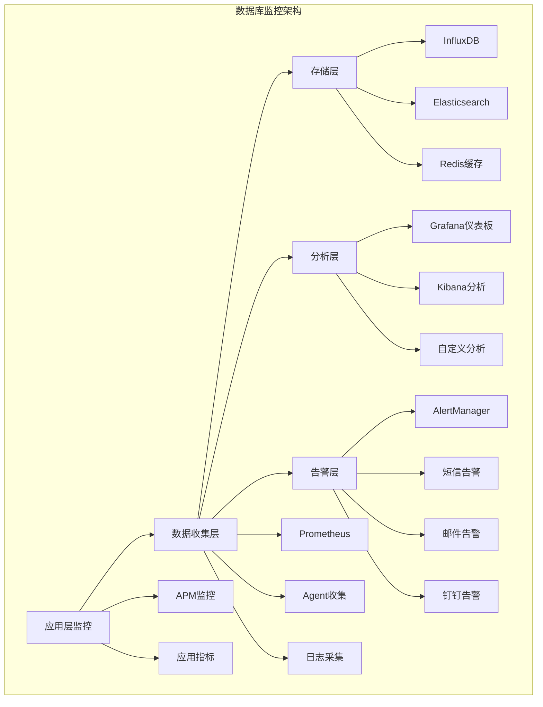
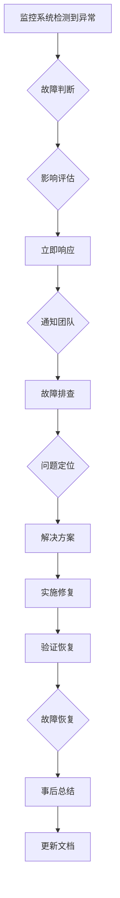

# 数据库监控与运维指南

> **版本**: v1.0
> **更新时间**: 2025-11-13
> **适用数据库**: MySQL 8.0+, Redis 7.0+
> **适用系统**: IOE-DREAM智慧园区一卡通管理平台

## 1. 数据库监控概述

### 1.1 监控目标

数据库监控是保障IOE-DREAM系统稳定运行的关键环节。通过全面的监控体系，可以及时发现性能问题、预防故障发生、优化数据库性能，确保系统的高可用性。

**核心监控指标**：
- **可用性监控**: 数据库连接状态、服务可用性
- **性能监控**: 查询响应时间、吞吐量、并发连接数
- **资源监控**: CPU、内存、磁盘、网络使用率
- **业务监控**: 慢查询、死锁、事务状态
- **安全监控**: 异常访问、数据备份状态

### 1.2 监控架构



## 2. MySQL监控配置

### 2.1 MySQL性能监控

#### 2.1.1 启用性能监控

```sql
-- 查看当前MySQL版本信息
SELECT VERSION();

-- 启用性能监控
SET GLOBAL performance_schema = ON;
SET GLOBAL performance_schema_max_table_instances = 200;
SET GLOBAL performance_schema_max_table_handles = 400;

-- 验证监控是否启用
SELECT * FROM performance_schema.setup_instruments
WHERE NAME = 'statement/execution/timer';
```

#### 2.1.2 关键监控指标

```sql
-- 创建监控视图
CREATE VIEW v_mysql_status AS
SELECT
    VARIABLE_NAME,
    VARIABLE_VALUE
FROM information_schema.GLOBAL_STATUS
WHERE VARIABLE_NAME IN (
    'Aborted_clients', 'Aborted_connects', 'Bytes_received', 'Bytes_sent',
    'Connections', 'Max_used_connections', 'Questions',
    'Slow_queries', 'Threads_connected', 'Threads_running', 'Threads_created',
    'Uptime', 'Innodb_row_lock_waits', 'Innodb_deadlocks'
);

-- 查询当前连接状态
SELECT
    THREAD_ID,
    USER,
    HOST,
    DB,
    COMMAND,
    TIME,
    STATE,
    INFO
FROM information_schema.PROCESSLIST
WHERE COMMAND != 'Sleep';

-- 查询InnoDB状态
SELECT
    NAME,
    COUNT,
    MIN_COUNT,
    MAX_COUNT
FROM information_schema.INNODB_METRICS
WHERE NAME IN (
    'buffer_pool_reads', 'buffer_pool_read_requests',
    'buffer_pool_wait_free', 'buffer_pool_pages_total',
    'buffer_pool_pages_dirty', 'buffer_pool_pages_flushed'
)
GROUP BY NAME;
```

### 2.2 慢查询监控

#### 2.2.1 慢查询日志配置

```sql
-- 慢查询日志配置
SET GLOBAL slow_query_log = 'ON';
SET GLOBAL long_query_time = 2; -- 超过2秒的查询
SET GLOBAL slow_query_log_file = '/var/log/mysql/slow.log';
SET GLOBAL log_queries_not_using_indexes = 'ON';
SET GLOBAL log_throttle_queries_not_using_indexes = 5;

-- 查看慢查询配置
SHOW VARIABLES LIKE 'slow_query%';
SHOW VARIABLES LIKE 'log_queries_not_using_indexes';
```

#### 2.2.2 慢查询分析工具

```bash
# pt-query-digest 分析慢查询日志
pt-query-digest /var/log/mysql/slow.log > slow_report.txt

# mysqldumpslow 格式化输出
mysqldumpslow -s t -t 5 /var/log/mysql/slow.log

# 查看慢查询统计
SELECT
    DIGEST_TEXT as sql_statement,
    COUNT_STAR as execution_count,
    AVG_TIMER_WAIT/1000000000 as avg_time_seconds,
    MAX_TIMER_WAIT/1000000 as max_time_seconds
FROM performance_schema.events_statements_summary
WHERE COUNT_STAR > 0
    AND TIMER_WAIT > 1000000
    AND DIGEST_TEXT NOT LIKE '%SHOW WARNINGS%'
    AND DIGEST_TEXT NOT LIKE '%SHOW VARIABLES%'
ORDER BY AVG_TIMER_WAIT DESC
LIMIT 10;
```

### 2.3 存储引擎监控

#### 2.3.1 InnoDB存储引擎监控

```sql
-- InnoDB缓冲池监控
SELECT
    POOL_SIZE as buffer_pool_size_mb,
    POOL_DATA/POOL_SIZE*100 as data_usage_percent,
    POOL_DIRTY/POOL_SIZE*100 as dirty_usage_percent,
    POOL_BYTES_DATA/POOL_SIZE*100 as bytes_data_percent,
    POOL_BYTES_DIRTY/POOL_SIZE*100 as bytes_dirty_percent
FROM (
    SELECT
        VARIABLE_VALUE POOL_SIZE
    FROM information_schema.GLOBAL_STATUS
    WHERE VARIABLE_NAME = 'Innodb_buffer_pool_pages'
) AS pool_size
JOIN (
    SELECT
        SUM(IF(VARIABLE_NAME = 'Innodb_buffer_pool_pages_data',
                  CAST(VARIABLE_VALUE AS UNSIGNED), 0)) AS POOL_DATA,
        SUM(IF(VARIABLE_NAME = 'Innodb_buffer_pool_pages_dirty',
                  CAST(VARIABLE_VALUE AS UNSIGNED), 0)) AS POOL_DIRTY
    FROM information_schema.GLOBAL_STATUS
    WHERE VARIABLE_NAME IN ('Innodb_buffer_pool_pages_data', 'Innodb_pool_pages_dirty')
) AS pool_metrics;
```

## 3. Redis监控配置

### 3.1 Redis性能监控

#### 3.1.1 Redis监控配置

```conf
# redis.conf
# 启用慢查询日志
slowlog-log /var/log/redis/redis-slow.log
slowlog-log-slower-than 10000
slowlog-max-len 1024

# 启用监控
latency-monitor-threshold 100

# 内存使用监控
maxmemory-policy allkeys-lru
maxmemory 2gb

# 持久化配置
save 900 1
save 300 10
save 60 10000
```

#### 3.1.2 Redis监控工具

```bash
# redis-cli info 命令
redis-cli --latency-history
redis-cli --bigkeys
redis-cli --memkeys
redis-cli --stat

# redis-monitor 实时监控
redis-monitor -h localhost -p 6379 -i 5

# redis-rdb-tools 内存分析
redis-rdb-tools /var/lib/redis/dump.rdb --command memory
```

### 3.2 Redis集群监控

#### 3.2.1 Sentinel监控

```java
@Component
public class RedisMonitorService {

    @Resource
    private RedisTemplate<String, Object> redisTemplate;

    /**
     * 检查Redis连接状态
     */
    public RedisStatus checkRedisStatus() {
        try {
            String pong = redisTemplate.opsForValue().get("health_check");
            return RedisStatus.UP;
        } catch (Exception e) {
            log.error("Redis连接检查失败", e);
            return RedisStatus.DOWN;
        }
    }

    /**
     * 获取Redis信息
     */
    public RedisInfo getRedisInfo() {
        Properties properties = redisTemplate.getConnectionFactory()
            .getConnection().info();

        return RedisInfo.builder()
            .version(properties.getProperty("redis_version"))
            .usedMemory(properties.getProperty("used_memory"))
            .maxMemory(properties.getProperty("maxmemory"))
            .connectedClients(properties.getProperty("connected_clients"))
            .totalCommands(properties.getProperty("total_commands"))
            .keyspaceHits(properties.getProperty("keyspace_hits"))
            .keyspaceMisses(properties.getProperty("keyspace_misses"))
            .build();
    }
}
```

## 4. 监控系统集成

### 4.1 Prometheus数据采集

#### 4.1.1 MySQL Exporter配置

```yaml
# prometheus.yml
global:
  scrape_interval: 15s

scrape_configs:
  - job_name: 'mysql'
    static_configs:
      - targets: ['localhost:3306']
    metrics_path: /metrics
    relabel_configs:
      - source_labels: [__address__]
        target_label: instance
        regex: (__address__)(.*)
        replacement: $2

  - job_name: 'redis'
    static_configs:
      - targets: ['localhost:9121']
    metrics_path: /metrics
```

#### 4.1.2 数据库Exporter安装

```bash
# MySQL Exporter
docker run -d \
  --name mysql-exporter \
  -p 9104:9104 \
  -e DATA_SOURCE_NAME="jdbc:mysql://localhost:3306/smart_admin_v3" \
  -e DATA_SOURCE_USER="root" \
  -e DATA_SOURCE_PASSWORD="password" \
  prom/mysqld-exporter

# Redis Exporter
docker run -d \
  --name redis-exporter \
  -p 9121:9121 \
  -e REDIS_ADDR="redis://localhost:6379" \
  oliver006/redis_exporter
```

### 4.2 Grafana仪表板

#### 4.2.1 MySQL仪表板配置

```json
{
  "dashboard": {
    "id": null,
    "title": "MySQL监控仪表板",
    "tags": ["mysql", "database", "monitoring"],
    "style": "dark",
    "timezone": "browser",
    "panels": [
      {
        "type": "graph",
        "title": "查询响应时间",
        "span": 12,
        "height": 8,
        "targets": [
          {
            "expr": "mysql_global_status_queries / mysql_global_status_uptime",
            "refId": "A"
          },
          {
            "expr": "mysql_global_status_slow_queries",
            "refId": "B"
          },
          {
            "expr": "mysql_global_status_threads_connected",
            "refId": "C"
          }
        ]
      },
      {
        "type": "graph",
        "title": "InnoDB缓冲池",
        "span": 12,
        "height": 8,
        "targets": [
          {
            "expr": "mysql_global_status_innodb_buffer_pool_pages_data / mysql_global_status_innodb_buffer_pool_pages_total * 100",
            "refId": "D"
          },
          {
            "expr": "mysql_global_status_innodb_buffer_pool_pages_dirty / mysql_global_status_innodb_buffer_pool_pages_total * 100",
            "refId": "E"
          }
        ]
      },
      {
        "type": "table",
        "title": "Top 5 慢查询",
        "span": 12,
        "height": 8,
        "targets": [
          {
            "expr": "top_slow_queries",
            "format": "table",
            "instant": true,
            "refId": "F"
          }
        ]
      }
    ]
  }
}
```

#### 4.2.2 Redis仪表板配置

```json
{
  "dashboard": {
    "id": null,
    "title": "Redis监控仪表板",
    "tags": ["redis", "cache", "monitoring"],
    "panels": [
      {
        "type": "graph",
        "title": "内存使用率",
        "span": 12,
        "height": 8,
        "targets": [
          {
            "expr": "redis_memory_used_bytes / redis_memory_max_bytes * 100",
            "refId": "A"
          },
          {
            "expr": "redis_mem_fragmentation_ratio",
            "refId": "B"
          }
        ]
      },
      {
        "type": "graph",
        "title": "连接数",
        "span": 12,
        "height": 8,
        "targets": [
          {
            "expr": "redis_connected_clients",
            "refId": "C"
          },
          {
            "expr": "redis_blocked_clients",
            "refId": "D"
          }
        ]
      },
      {
        "type": "singlestat",
        "title": "命中率",
        "span": 6,
        "height": 4,
        "targets": [
          {
            "expr": "redis_keyspace_hits / (redis_keyspace_hits + redis_keyspace_misses) * 100",
            "refId": "E"
          }
        ]
      },
      {
        "type": "singlestat",
        "title": "过期键数量",
        "span": 6,
        "height": 4,
        "targets": [
          {
            "expr": "redis_keyspace_expired_keys",
            "refId": "F"
          }
        ]
      }
    ]
  }
}
```

## 5. 告警系统配置

### 5.1 AlertManager配置

#### 5.1.1 基础告警规则

```yaml
# alert_rules.yml
groups:
  - name: database_alerts
    rules:
      - alert: DatabaseConnectionFailure
        expr: up{job=~"mysql"} == 0
        for: 1m
        labels:
          severity: critical
          service: database
        annotations:
          summary: "数据库连接失败"
          description: "MySQL数据库无法连接"

      - alert: HighSlowQueryRate
        expr: rate(mysql_global_status_slow_queries[5m]) > 10
        for: 2m
        labels:
          severity: warning
          service: database
        annotations:
          summary: "慢查询率过高"
          description: "5分钟内慢查询数量超过10个"

      - alert: RedisHighMemoryUsage
        expr: redis_memory_used_bytes / redis_memory_max_bytes > 0.9
        for: 3m
        labels:
          severity: warning
          service: redis
        annotations:
          summary: "Redis内存使用率过高"
          description: "Redis内存使用率超过90%"

      - alert: HighErrorRate
        expr: rate(http_server_requests_seconds_count{status=~"5.."}[5m]) / rate(http_server_requests_seconds_count[5m]) > 0.1
        for: 1m
        labels:
          severity: critical
          service: application
        annotations:
          summary: "应用错误率过高"
          description: "应用HTTP 5xx错误率超过10%"
```

### 5.2 告警通知配置

#### 5.2.1 邮件告警配置

```yaml
# alertmanager.yml
global:
  smtp_smarthost: 'localhost'
  smtp_from: 'ioe-dream-alert@example.com'
  smtp_require_tls: false

route:
  group_by: ['alertname', 'cluster', 'service']
  group_wait: 10s
  group_interval: 10s
  repeat_interval: 1h
  receiver: 'default'

receivers:
  - name: 'default'
    email_configs:
      - to: 'admin@example.com'
        from: 'ioe-dream-alert@example.com'
        smarthost: 'localhost'
        auth_username: 'alertmanager'
        auth_password: 'password'
        send_resolved: true
        text: '{{ .CommonAnnotations.summary }}'
        html: '{{ .CommonAnnotations.summary }}'

  - name: 'critical-alerts'
    email_configs:
      - to: 'critical@example.com'
        from: 'critical-alert@example.com'
        subject: 'CRITICAL: {{ .GroupLabels.alertname }}'
    route:
      group_by: ['alertname']
      group_wait: 0s
      receiver: 'critical-alerts'
      repeat_interval: 5m
    match:
      severity: critical

  - name: 'slack-webhook'
    webhook_configs:
      - url: 'https://hooks.slack.com/services/YOUR/SLACK/WEBHOOK'
        send_resolved: true
        channel: '#monitoring'
        icon_emoji: ':warning:'
        title: 'Database Alert'
```

## 6. 自动化运维

### 6.1 数据库备份自动化

#### 6.1.1 备份脚本

```bash
#!/bin/bash
# mysql_backup.sh
BACKUP_DIR="/backup/mysql"
DB_NAME="smart_admin_v3"
DB_USER="backup_user"
DB_PASS="backup_password"
DATE=$(date +%Y%m%d_%H%M%S)
BACKUP_FILE="$BACKUP_DIR/${DB_NAME}_${DATE}.sql"

# 创建备份目录
mkdir -p $BACKUP_DIR

# 执行备份
mysqldump -u $DB_USER -p$DB_PASS \
  --single-transaction \
  --routines \
  --triggers \
  --events=false \
  --hex-blob \
  --default-character-set=utf8mb4 \
  --databases $DB_NAME \
  > $BACKUP_FILE

# 压缩备份文件
gzip $BACKUP_FILE

# 清理7天前的备份
find $BACKUP_DIR -name "*.sql.gz" -mtime +7 -delete

echo "数据库备份完成: $BACKUP_FILE.gz"
```

#### 6.1.2 备份验证脚本

```bash
#!/bin/bash
# backup_verify.sh
BACKUP_DIR="/backup/mysql"
LATEST_BACKUP=$(ls -t $BACKUP_DIR/*.sql.gz | head -n1)

if [ -f "$LATEST_BACKUP" ]; then
    echo "验证备份: $LATEST_BACKUP"
    # 解压到临时文件
    TEMP_FILE="${LATEST_BACKUP%.gz}"
    gunzip -c "$LATEST_BACKUP" > "$TEMP_FILE"

    # 验证备份文件完整性
    if [ -s "$TEMP_FILE" ]; then
        echo "备份文件验证通过"
        rm -f "$TEMP_FILE"
        exit 0
    else
        echo "备份文件验证失败"
        rm -f "$TEMP_FILE"
        exit 1
    fi
else
    echo "没有找到备份文件"
    exit 1
fi
```

### 6.2 数据库维护自动化

#### 6.2.1 定时任务配置

```sql
-- MySQL事件调度器
SET GLOBAL event_scheduler = ON;

-- 创建数据清理事件
CREATE EVENT IF NOT EXISTS cleanup_old_logs
ON SCHEDULE EVERY 1 DAY
STARTS '2025-01-01 02:00:00'
DO
    CALL cleanup_old_logs();

-- 创建索引维护事件
CREATE EVENT IF NOT EXISTS optimize_tables
ON SCHEDULE EVERY 1 WEEK
STARTS '2025-01-01 03:00:00'
DO
    CALL optimize_tables();

-- 创建统计信息更新事件
CREATE EVENT IF NOT EXISTS update_statistics
ON SCHEDULE EVERY 1 HOUR
STARTS '2025-01-01 00:00:00'
DO
    CALL update_database_statistics();
```

#### 6.2.2 存储过程

```sql
-- 数据清理存储过程
DELIMITER //
CREATE PROCEDURE cleanup_old_logs()
BEGIN
    -- 清理30天前的操作日志
    DELETE FROM t_operation_log
    WHERE create_time < DATE_SUB(NOW(), INTERVAL 30 DAY);

    -- 清理审计日志
    DELETE FROM t_audit_log
    WHERE create_time < DATE_SUB(NOW(), INTERVAL 90 DAY)
    AND action_type IN ('READ', 'SUCCESS');

    -- 清理临时数据
    DELETE FROM t_temp_data
    WHERE create_time < DATE_SUB(NOW(), INTERVAL 7 DAY);

    COMMIT;
END //

DELIMITER ;

-- 表优化存储过程
DELIMITER //
CREATE PROCEDURE optimize_tables()
BEGIN
    -- 分析常用表
    ANALYZE TABLE t_employee;
    ANALYZE TABLE t_attendance_record;
    ANALYZE TABLE t_consumption_record;

    -- 优化表碎片
    OPTIMIZE TABLE t_attendance_record;
    OPTIMIZE TABLE t_consumption_record;

    COMMIT;
END //

DELIMITER ;

-- 统计信息更新存储过程
DELIMITER //
CREATE PROCEDURE update_database_statistics()
BEGIN
    -- 更新表统计信息
    ANALYZE TABLE t_employee;
    ANALYZE TABLE t_department;
    ANALYZE TABLE t_attendance_record;
    ANALYZE TABLE t_consumption_record;

    -- 更新索引统计信息
    SHOW INDEX FROM t_employee;
    SHOW INDEX FROM t_attendance_record;
    SHOW INDEX FROM t_consumption_record;

    -- 刷新查询缓存
    FLUSH TABLES;

    COMMIT;
END //

DELIMITER ;
```

## 7. 故障排查

### 7.1 常见问题诊断

#### 7.1.1 连接问题

```bash
# 检查MySQL连接数
mysqladmin processlist

# 检查端口监听
netstat -tlnp | grep :3306

# 检查防火墙状态
iptables -L -n | grep 3306

# 检查磁盘空间
df -h /var/lib/mysql

# 检查日志文件
tail -100 /var/log/mysql/error.log
```

#### 7.1.2 性能问题

```sql
-- 查看当前连接数
SHOW PROCESSLIST;

-- 查看锁等待情况
SELECT * FROM sys.innodb_lock_waits;

-- 查看最近死锁
SHOW ENGINE INNODB STATUS;

-- 查看慢查询
SELECT * FROM mysql.slow_log ORDER BY start_time DESC LIMIT 10;
```

### 7.2 故障处理流程

#### 7.2.1 故障响应流程



#### 7.2.2 应急预案

```bash
#!/bin/bash
# emergency_response.sh
# 数据库连接失败应急响应

echo "开始应急响应流程..."

# 1. 检查基础服务状态
systemctl status mysql
systemctl status redis

# 2. 检查网络连接
ping -c 4 8.8.8.8
telnet localhost 3306
telnet localhost 6379

# 3. 检查磁盘空间
df -h

# 4. 检查内存使用
free -h

# 5. 重启服务（如果需要）
systemctl restart mysql
systemctl restart redis

# 6. 验证服务恢复
mysqladmin ping -h localhost
redis-cli ping

# 7. 记录故障信息
echo "$(date): 系统应急响应完成" >> /var/log/emergency_response.log
```

通过全面的数据库监控和运维体系，可以确保IOE-DREAM系统的数据库稳定运行，及时发现和解决潜在问题，为业务连续性提供坚实保障。