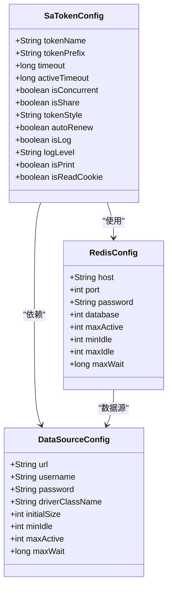
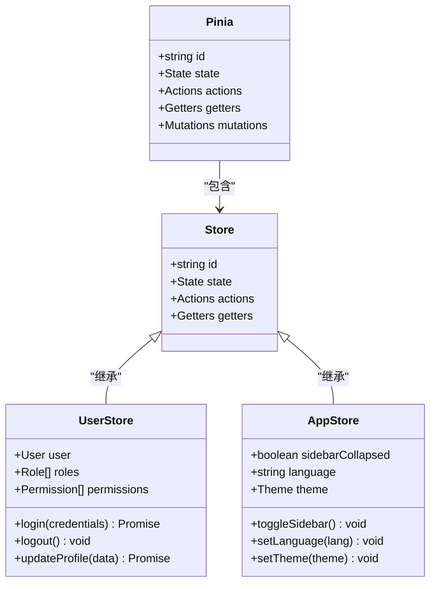
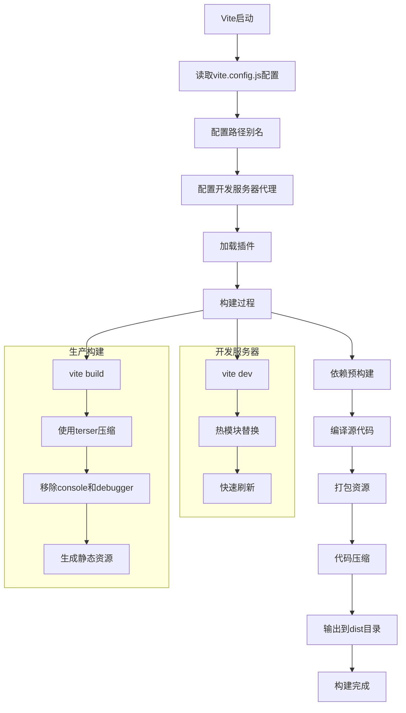
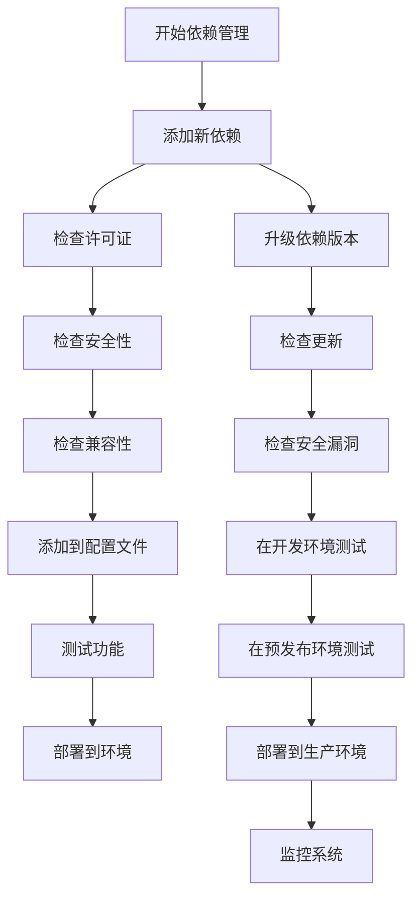

# 技术栈与依赖

<cite>
**本文档引用的文件**
- [sa-base/pom.xml](file://smart-admin-api-java17-springboot3/sa-base/pom.xml)
- [pom.xml](file://smart-admin-api-java17-springboot3/pom.xml)
- [package.json](file://smart-admin-web-javascript/package.json)
- [vite.config.js](file://smart-admin-web-javascript/vite.config.js)
- [smart-app/package.json](file://smart-app/package.json)
- [smart-app/vite.config.js](file://smart-app/vite.config.js)
- [sa-base.yaml](file://smart-admin-api-java17-springboot3/sa-base/src/main/resources/dev/sa-base.yaml)
- [sa-base.yaml](file://smart-admin-api-java17-springboot3/sa-base/src/main/resources/prod/sa-base.yaml)
- [.env.development](file://smart-admin-web-javascript/.env.development)
- [.env.production](file://smart-admin-web-javascript/.env.production)
</cite>

## 目录
1. [技术栈概览](#技术栈概览)
2. [后端技术栈](#后端技术栈)
3. [前端技术栈](#前端技术栈)
4. [移动端技术栈](#移动端技术栈)
5. [关键第三方依赖](#关键第三方依赖)
6. [依赖管理最佳实践](#依赖管理最佳实践)
7. [技术选型决策依据](#技术选型决策依据)
8. [环境搭建指南](#环境搭建指南)

## 技术栈概览

IOE-DREAM项目采用现代化的技术栈，构建了一个完整的全栈应用系统。项目分为三个主要部分：后端服务、前端Web应用和移动端应用。后端采用Java 17与Spring Boot 3框架，结合MyBatis-Plus和Sa-Token安全框架，提供了稳定高效的API服务。前端基于Vue3和Ant Design Vue构建现代化的管理界面，使用Pinia进行状态管理，并通过Vite实现快速的开发构建体验。移动端采用uni-app框架，实现跨平台的移动应用开发。

**Section sources**
- [pom.xml](file://smart-admin-api-java17-springboot3/pom.xml#L21-L22)
- [package.json](file://smart-admin-web-javascript/package.json#L43)
- [package.json](file://smart-app/package.json#L70)

## 后端技术栈

### Java 17与Spring Boot 3

IOE-DREAM项目的后端基于Java 17和Spring Boot 3构建。在`pom.xml`文件中，项目明确指定了Java版本为17，并使用Spring Boot 3.5.4版本。Spring Boot 3带来了对Jakarta EE 9+的支持，提供了更好的性能和现代化的API。项目通过Maven进行依赖管理，利用Spring Boot的自动配置特性简化了开发过程。

**Section sources**
- [pom.xml](file://smart-admin-api-java17-springboot3/pom.xml#L21-L22)
- [pom.xml](file://smart-admin-api-java17-springboot3/pom.xml#L373-L374)

### MyBatis-Plus

项目使用MyBatis-Plus作为持久层框架，版本为3.5.12。MyBatis-Plus在MyBatis的基础上提供了丰富的增强功能，如通用CRUD操作、条件构造器、分页插件等，大大简化了数据库操作代码。在`sa-base/pom.xml`中，项目引入了`mybatis-plus-spring-boot3-starter`依赖，确保与Spring Boot 3的兼容性。

**Section sources**
- [pom.xml](file://smart-admin-api-java17-springboot3/pom.xml#L24)
- [sa-base/pom.xml](file://smart-admin-api-java17-springboot3/sa-base/pom.xml#L117)

### Sa-Token安全框架

项目采用Sa-Token作为安全认证框架，版本为1.44.0。Sa-Token是一个轻量级Java权限认证框架，提供了登录认证、权限验证、Session会话、单点登录、OAuth2.0、微服务网关鉴权等一系列功能。在`sa-base/pom.xml`中，项目引入了`sa-token-spring-boot3-starter`和`sa-token-redis-jackson`依赖，实现了与Spring Boot 3和Redis的集成。

Sa-Token的配置在`sa-base.yaml`文件中，包括token名称、有效期、是否允许同一账号多地登录等。开发环境和生产环境的配置有所不同，生产环境的日志级别设置为warn，以减少日志输出。



**Diagram sources**
- [sa-base.yaml](file://smart-admin-api-java17-springboot3/sa-base/src/main/resources/dev/sa-base.yaml#L149-L175)
- [sa-base.yaml](file://smart-admin-api-java17-springboot3/sa-base/src/main/resources/prod/sa-base.yaml#L147-L172)
- [sa-base/pom.xml](file://smart-admin-api-java17-springboot3/sa-base/pom.xml#L59-L66)

## 前端技术栈

### Vue3与Ant Design Vue

前端项目基于Vue3构建，使用Ant Design Vue 4.2.5作为UI组件库。Vue3带来了Composition API、Teleport、Suspense等新特性，提高了代码的可维护性和开发效率。Ant Design Vue提供了丰富的UI组件，遵循Ant Design设计规范，确保了界面的一致性和美观性。

在`package.json`文件中，项目明确指定了Vue版本为3.4.27，Ant Design Vue版本为4.2.5。项目还引入了`@ant-design/icons-vue`用于图标显示，`nprogress`用于页面加载进度条，`v-viewer`用于图片预览等功能。

**Section sources**
- [package.json](file://smart-admin-web-javascript/package.json#L43)
- [package.json](file://smart-admin-web-javascript/package.json#L23)

### Pinia状态管理

项目使用Pinia作为状态管理工具，版本为2.1.7。Pinia是Vue官方推荐的状态管理库，相比Vuex更加简洁和类型安全。在`package.json`中，项目引入了`pinia`依赖，用于管理应用的全局状态，如用户信息、权限数据等。



**Diagram sources**
- [package.json](file://smart-admin-web-javascript/package.json#L37)
- [src/store/modules/system/user.js](file://smart-admin-web-javascript/src/store/modules/system/user.js)
- [src/store/modules/system/app-config.js](file://smart-admin-web-javascript/src/store/modules/system/app-config.js)

### Vite构建工具

项目使用Vite作为构建工具，版本为5.2.12。Vite利用浏览器原生ES模块导入，提供了极快的冷启动和热更新速度。在`vite.config.js`中，项目配置了Vite的别名、代理、构建优化等选项。

Vite配置了开发服务器代理，将API请求代理到后端服务。构建时，Vite会清除console和debugger语句，优化代码体积。项目还配置了静态资源分拆打包，将不同类型的文件放在不同的目录中，便于管理和缓存。



**Diagram sources**
- [vite.config.js](file://smart-admin-web-javascript/vite.config.js)
- [package.json](file://smart-admin-web-javascript/package.json#L64)

## 移动端技术栈

### uni-app框架

移动端项目基于uni-app框架构建，版本为3.0.0。uni-app是一个使用Vue.js开发跨平台应用的框架，支持编译到iOS、Android、H5、小程序等多个平台。在`package.json`中，项目引入了`@dcloudio/uni-app`和各个平台的适配包，如`@dcloudio/uni-mp-weixin`（微信小程序）、`@dcloudio/uni-mp-alipay`（支付宝小程序）等。

uni-app提供了丰富的API和组件，如`uni.request`用于网络请求，`uni.uploadFile`用于文件上传，`uni.showToast`用于消息提示等。项目还使用了`@dcloudio/uni-ui`组件库，提供了移动端常用的UI组件。

**Section sources**
- [package.json](file://smart-app/package.json#L50-L64)
- [package.json](file://smart-app/package.json#L64)

### uni-app相关组件库

项目使用了多个uni-app官方组件库，包括：
- `uni-icons`：图标组件
- `uni-load-more`：上拉加载更多组件
- `uni-mescroll`：滚动加载组件
- `uni-scss`：SCSS样式库
- `y-tabs`：标签页组件

这些组件库位于`uni_modules`目录下，通过uni-app的插件机制集成到项目中。每个组件库都有独立的`package.json`文件，定义了组件的元数据和依赖关系。

```mermaid
classDiagram
class UniApp {
+string version
+Platform[] platforms
+Plugin[] plugins
+Component[] components
+API[] apis
}
class Platform {
+string name
+string type
+string version
}
class Plugin {
+string name
+string version
+string description
}
class Component {
+string name
+string description
+Prop[] props
+Event[] events
}
class API {
+string name
+string description
+Parameter[] parameters
+ReturnType returnType
}
UniApp --> Platform : "支持"
UniApp --> Plugin : "使用"
UniApp --> Component : "包含"
UniApp --> API : "提供"
Platform --> "iOS"
Platform --> "Android"
Platform --> "H5"
Platform --> "微信小程序"
Platform --> "支付宝小程序"
Plugin --> "uni-icons"
Plugin --> "uni-load-more"
Plugin --> "uni-mescroll"
Plugin --> "uni-scss"
Plugin --> "y-tabs"
```

**Diagram sources**
- [package.json](file://smart-app/package.json#L50-L64)
- [smart-app/uni_modules](file://smart-app/uni_modules)

## 关键第三方依赖

### 后端关键依赖

| 依赖名称 | 版本 | 用途 | 兼容性信息 |
|--------|------|------|----------|
| Spring Boot | 3.5.4 | 基础框架 | Java 17+ |
| MyBatis-Plus | 3.5.12 | ORM框架 | Spring Boot 3 |
| Sa-Token | 1.44.0 | 安全认证 | Spring Boot 3 |
| Druid | 1.2.25 | 数据库连接池 | Java 17+ |
| Redisson | 3.50.0 | Redis客户端 | Redis 6+ |
| Fastjson | 2.0.57 | JSON处理 | Java 17+ |
| Apache POI | 5.4.1 | Excel处理 | Java 17+ |

### 前端关键依赖

| 依赖名称 | 版本 | 用途 | 兼容性信息 |
|--------|------|------|----------|
| Vue | 3.4.27 | 前端框架 | Vite 5+ |
| Ant Design Vue | 4.2.5 | UI组件库 | Vue 3 |
| Pinia | 2.1.7 | 状态管理 | Vue 3 |
| Vite | 5.2.12 | 构建工具 | Node.js 18+ |
| Axios | 1.6.8 | HTTP客户端 | Vue 3 |
| ECharts | 5.4.3 | 数据可视化 | Vue 3 |
| Highlight.js | 11.8.0 | 代码高亮 | Vue 3 |

### 移动端关键依赖

| 依赖名称 | 版本 | 用途 | 兼容性信息 |
|--------|------|------|----------|
| uni-app | 3.0.0 | 跨平台框架 | Vue 3 |
| @dcloudio/uni-ui | 1.5.0 | UI组件库 | uni-app 3 |
| Pinia | 2.0.36 | 状态管理 | Vue 3 |
| Vite | 4.0.3 | 构建工具 | Node.js 18+ |

**Section sources**
- [pom.xml](file://smart-admin-api-java17-springboot3/pom.xml)
- [package.json](file://smart-admin-web-javascript/package.json)
- [smart-app/package.json](file://smart-app/package.json)

## 依赖管理最佳实践

### 添加新依赖

添加新依赖时，应遵循以下步骤：
1. 确定依赖的用途和必要性
2. 检查依赖的许可证和安全性
3. 确认依赖与现有技术栈的兼容性
4. 在`pom.xml`或`package.json`中添加依赖
5. 在代码中使用依赖并进行测试

对于后端项目，在`pom.xml`中添加依赖时，应使用统一的版本管理。在`sa-parent/pom.xml`的`<properties>`部分定义版本号，在`<dependencyManagement>`部分管理依赖版本，确保整个项目使用一致的版本。

对于前端项目，在`package.json`中添加依赖时，应区分`dependencies`和`devDependencies`。生产环境需要的依赖放在`dependencies`中，开发环境需要的依赖放在`devDependencies`中。

### 版本升级策略

版本升级应遵循以下策略：
1. 定期检查依赖的安全漏洞和更新
2. 优先升级有安全漏洞的依赖
3. 在测试环境中验证新版本的兼容性
4. 逐步在预发布环境和生产环境部署
5. 监控升级后的系统稳定性

对于关键依赖如Spring Boot、Vue等，应谨慎升级，确保新版本与现有代码的兼容性。可以使用`npm outdated`或`mvn versions:display-dependency-updates`命令检查过期的依赖。



**Diagram sources**
- [pom.xml](file://smart-admin-api-java17-springboot3/pom.xml)
- [package.json](file://smart-admin-web-javascript/package.json)

## 技术选型决策依据

### 后端技术选型

选择Java 17和Spring Boot 3作为后端技术栈，主要基于以下考虑：
1. **稳定性**：Java和Spring生态系统成熟稳定，适合企业级应用
2. **性能**：Java 17带来了性能改进和新特性，如密封类、模式匹配等
3. **生态**：Spring Boot 3提供了丰富的功能和良好的社区支持
4. **安全性**：Java平台有完善的安全机制，适合处理敏感数据

选择MyBatis-Plus而非JPA，因为：
1. **灵活性**：MyBatis-Plus允许编写原生SQL，对复杂查询有更好的支持
2. **性能**：直接操作SQL，避免了JPA的性能开销
3. **学习成本**：团队成员对MyBatis更熟悉，降低了学习成本

选择Sa-Token而非Spring Security，因为：
1. **轻量级**：Sa-Token更轻量，配置更简单
2. **功能丰富**：提供了单点登录、二级认证等企业级功能
3. **文档完善**：中文文档详细，易于理解和使用

### 前端技术选型

选择Vue3而非React，主要基于：
1. **团队熟悉度**：团队成员对Vue技术栈更熟悉
2. **开发效率**：Vue的模板语法更直观，开发效率更高
3. **生态完善**：Vue生态系统丰富，有大量成熟的UI组件库

选择Ant Design Vue而非Element Plus，因为：
1. **设计规范**：Ant Design的设计更符合企业级应用的需求
2. **组件丰富**：提供了更多高级组件，如表格、图表等
3. **国际化支持**：对多语言支持更好

选择Vite而非Webpack，因为：
1. **构建速度**：Vite利用浏览器原生ES模块，启动和热更新速度极快
2. **配置简单**：默认配置合理，减少了复杂的配置工作
3. **现代特性**：原生支持TypeScript、JSX等现代JavaScript特性

### 移动端技术选型

选择uni-app而非原生开发或多端框架，因为：
1. **跨平台**：一套代码可以编译到多个平台，节省开发成本
2. **开发效率**：使用Vue语法，开发效率高
3. **生态完善**：有大量的插件和组件可用
4. **性能**：接近原生应用的性能表现

**Section sources**
- [pom.xml](file://smart-admin-api-java17-springboot3/pom.xml)
- [package.json](file://smart-admin-web-javascript/package.json)
- [smart-app/package.json](file://smart-app/package.json)

## 环境搭建指南

### 后端环境搭建

1. **安装JDK 17**
   - 下载并安装OpenJDK 17
   - 配置JAVA_HOME环境变量

2. **安装Maven**
   - 下载并安装Maven 3.8+
   - 配置MAVEN_HOME环境变量

3. **安装数据库**
   - 安装MySQL 8.0+
   - 创建数据库`smart_admin_v3`
   - 执行数据库SQL脚本

4. **安装Redis**
   - 安装Redis 6.0+
   - 配置Redis密码和端口

5. **配置项目**
   - 修改`sa-base.yaml`中的数据库连接信息
   - 修改Redis连接信息
   - 配置邮件服务器（可选）

6. **运行项目**
   - 使用Maven命令`mvn spring-boot:run`启动
   - 或使用IDE导入项目并运行

### 前端环境搭建

1. **安装Node.js**
   - 安装Node.js 18+
   - 验证安装：`node -v`和`npm -v`

2. **安装依赖**
   - 进入`smart-admin-web-javascript`目录
   - 运行`npm install`安装依赖

3. **配置环境变量**
   - 修改`.env.development`中的API地址
   - 修改`.env.production`中的生产环境配置

4. **运行项目**
   - 开发环境：`npm run dev`
   - 生产构建：`npm run build:prod`

### 移动端环境搭建

1. **安装HBuilderX**
   - 下载并安装HBuilderX
   - 这是uni-app官方推荐的开发工具

2. **安装依赖**
   - 进入`smart-app`目录
   - 运行`npm install`安装依赖

3. **运行项目**
   - 在HBuilderX中打开项目
   - 选择运行到浏览器或真机调试

**Section sources**
- [pom.xml](file://smart-admin-api-java17-springboot3/pom.xml)
- [package.json](file://smart-admin-web-javascript/package.json)
- [smart-app/package.json](file://smart-app/package.json)
- [sa-base.yaml](file://smart-admin-api-java17-springboot3/sa-base/src/main/resources/dev/sa-base.yaml)
- [.env.development](file://smart-admin-web-javascript/.env.development)