# 修复脚本详细文档

<cite>
**本文档引用的文件**
- [fix_area_menu.sql](file://数据库SQL脚本/mysql/fix_area_menu.sql)
- [fix_area_menu_v2.sql](file://数据库SQL脚本/mysql/fix_area_menu_v2.sql)
- [fix_area_menu_final.sql](file://数据库SQL脚本/mysql/fix_area_menu_final.sql)
- [smart_area.sql](file://数据库SQL脚本/mysql/smart_area.sql)
- [区域管理菜单问题修复说明.md](file://区域管理菜单问题修复说明.md)
- [check_menu.sql](file://check_menu.sql)
- [check_parent_menu.sql](file://check_parent_menu.sql)
- [query_menu_structure.sql](file://query_menu_structure.sql)
</cite>

## 目录
1. [概述](#概述)
2. [问题背景](#问题背景)
3. [修复脚本演进历程](#修复脚本演进历程)
4. [初版修复脚本分析](#初版修复脚本分析)
5. [V2版本改进分析](#v2版本改进分析)
6. [最终版本深度解析](#最终版本深度解析)
7. [核心业务问题解决](#核心业务问题解决)
8. [执行条件与影响范围](#执行条件与影响范围)
9. [版本升级策略](#版本升级策略)
10. [环境应用策略](#环境应用策略)
11. [故障排除指南](#故障排除指南)
12. [最佳实践建议](#最佳实践建议)

## 概述

本文档系统性地分析了SmartAdmin项目中区域管理菜单修复脚本的演进过程，从初版修复脚本到最终版本的完整发展历程。这些脚本解决了区域与菜单关联关系的核心问题，包括前端路由路径配置错误、数据库菜单结构不一致等关键业务问题。

## 问题背景

### 根本原因分析

区域管理菜单无法显示的根本原因是前端路由机制对component路径的特殊处理逻辑存在误解。SmartAdmin框架会自动处理component路径，数据库中只需存储相对于views目录的相对路径，而不需要包含views/前缀。

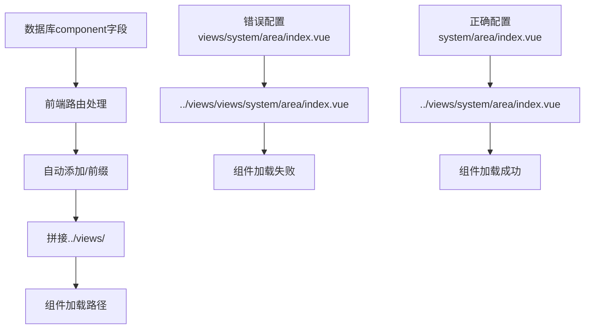

**图表来源**
- [区域管理菜单问题修复说明.md](file://区域管理菜单问题修复说明.md#L32-L41)

### 技术原理

前端路由处理代码会自动处理component路径，具体流程如下：
1. 从数据库获取component字段：`system/area/index.vue`
2. 自动添加 `/` 前缀：`/system/area/index.vue`
3. 拼接成完整路径：`../views/system/area/index.vue`
4. 从modules中加载组件

**章节来源**
- [区域管理菜单问题修复说明.md](file://区域管理菜单问题修复说明.md#L21-L42)

## 修复脚本演进历程

### 版本演进时间线

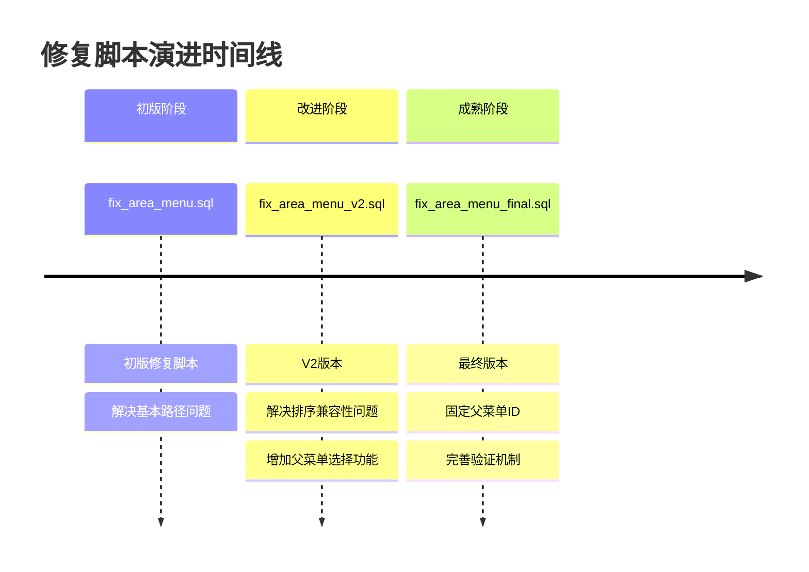

**图表来源**
- [fix_area_menu.sql](file://数据库SQL脚本/mysql/fix_area_menu.sql#L1-L59)
- [fix_area_menu_v2.sql](file://数据库SQL脚本/mysql/fix_area_menu_v2.sql#L1-L78)
- [fix_area_menu_final.sql](file://数据库SQL脚本/mysql/fix_area_menu_final.sql#L1-L90)

## 初版修复脚本分析

### 脚本结构与功能

初版修复脚本主要解决以下问题：

1. **菜单删除与重建**：安全地删除现有错误菜单结构
2. **路径修正**：修复component路径配置
3. **权限点完整化**：添加所有必要的权限点

### 核心修复逻辑

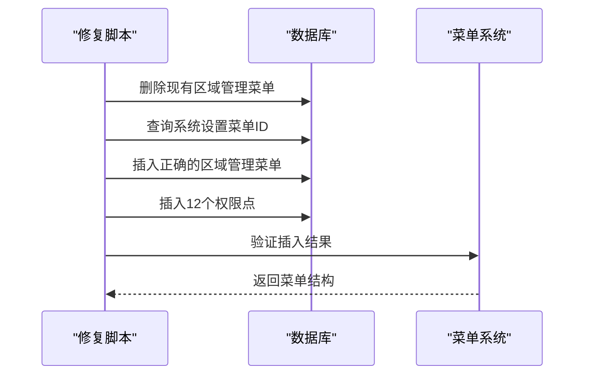

**图表来源**
- [fix_area_menu.sql](file://数据库SQL脚本/mysql/fix_area_menu.sql#L6-L39)

### 存在的问题

1. **父菜单固定性不足**：默认固定在"系统设置"下，缺乏灵活性
2. **排序兼容性问题**：在某些MySQL版本中可能存在子查询兼容性问题
3. **验证不够完善**：验证逻辑相对简单

**章节来源**
- [fix_area_menu.sql](file://数据库SQL脚本/mysql/fix_area_menu.sql#L1-L59)

## V2版本改进分析

### 主要改进点

V2版本针对初版脚本的不足进行了重要改进：

1. **父菜单选择灵活性**：支持选择"系统设置"或"系统设备"作为父菜单
2. **兼容性优化**：解决了MySQL子查询兼容性问题
3. **验证增强**：增加了更完善的验证机制

### 灵活父菜单配置

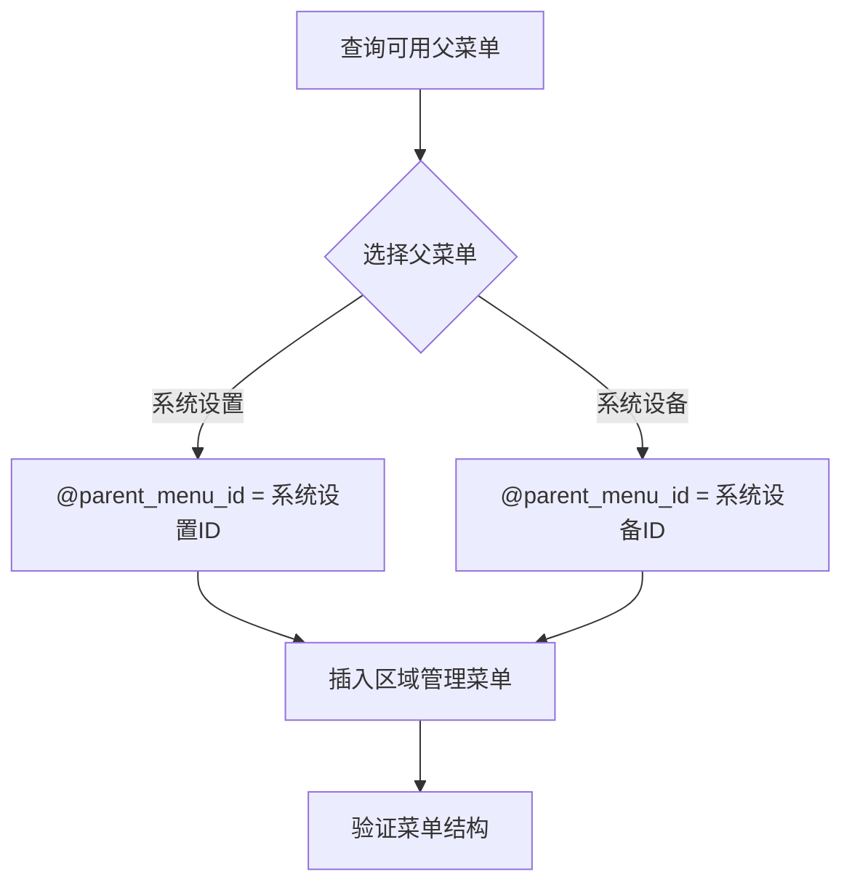

**图表来源**
- [fix_area_menu_v2.sql](file://数据库SQL脚本/mysql/fix_area_menu_v2.sql#L15-L36)

### 兼容性问题解决

V2版本解决了初版中存在的子查询兼容性问题：

```sql
-- 初版问题写法
INSERT INTO t_sys_menu (...) VALUES
('区域管理', 1, (SELECT menu_id FROM (SELECT menu_id FROM t_sys_menu WHERE menu_name = '系统设置' ...) AS temp), ...)

-- V2改进写法
SET @system_setting_menu_id = (SELECT menu_id FROM t_sys_menu WHERE menu_name = '系统设置' ...);
INSERT INTO t_sys_menu (...) VALUES
('区域管理', 1, @system_setting_menu_id, ...)
```

**章节来源**
- [fix_area_menu_v2.sql](file://数据库SQL脚本/mysql/fix_area_menu_v2.sql#L1-L78)

## 最终版本深度解析

### 固定父菜单策略

最终版本采用了固定父菜单ID的策略，明确将区域管理菜单放置在"系统设置"(menu_id=50)下：

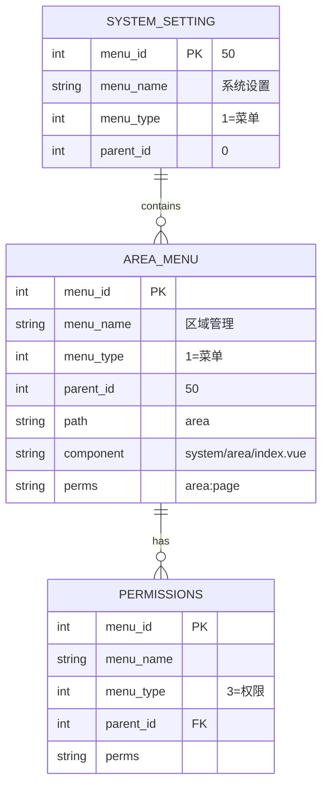

**图表来源**
- [fix_area_menu_final.sql](file://数据库SQL脚本/mysql/fix_area_menu_final.sql#L18-L61)

### 完善的验证机制

最终版本包含了多层次的验证机制：

1. **步骤验证**：每个操作都有明确的进度提示
2. **结构验证**：验证菜单的父子关系和排序
3. **完整性验证**：确保所有权限点都正确创建

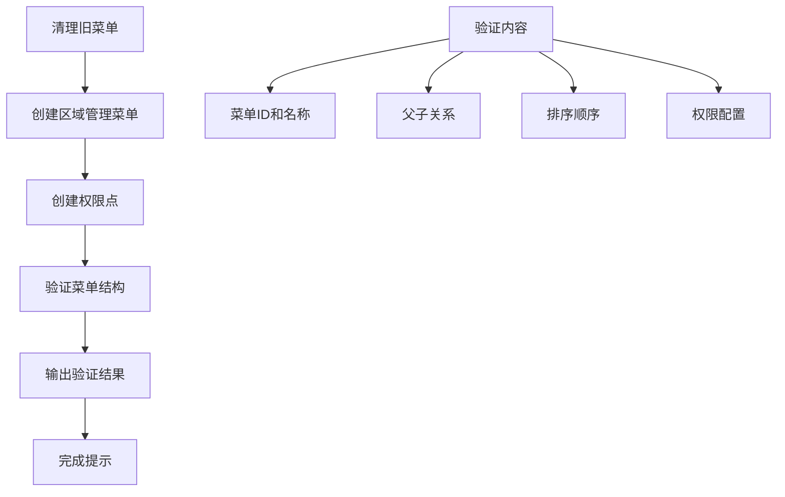

**图表来源**
- [fix_area_menu_final.sql](file://数据库SQL脚本/mysql/fix_area_menu_final.sql#L65-L89)

**章节来源**
- [fix_area_menu_final.sql](file://数据库SQL脚本/mysql/fix_area_menu_final.sql#L1-L90)

## 核心业务问题解决

### 区域与菜单关联关系修复

修复脚本解决了区域管理模块的核心业务问题：

| 问题类型 | 问题描述 | 解决方案 | 影响范围 |
|---------|---------|---------|---------|
| 路径配置错误 | component路径包含views前缀 | 移除views前缀，改为相对路径 | 前端菜单显示 |
| 父菜单混乱 | 区域管理菜单位置不固定 | 固定在系统设置下 | 菜单层次结构 |
| 权限缺失 | 缺少必要的权限点 | 添加12个标准权限点 | 功能访问控制 |
| 数据一致性 | 菜单结构不一致 | 重建完整的菜单树 | 系统稳定性 |

### 数据一致性维护

修复脚本通过以下机制维护数据一致性：

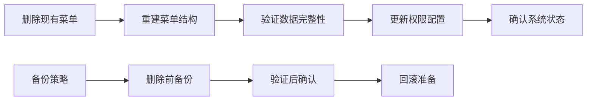

**章节来源**
- [区域管理菜单问题修复说明.md](file://区域管理菜单问题修复说明.md#L65-L102)

## 执行条件与影响范围

### 执行前置条件

1. **数据库连接**：需要有数据库管理员权限
2. **环境确认**：确认当前运行的SmartAdmin版本
3. **备份准备**：执行前必须备份相关数据表
4. **停机窗口**：建议在维护窗口期间执行

### 影响范围评估

| 影响对象 | 影响程度 | 恢复时间 | 注意事项 |
|---------|---------|---------|---------|
| 区域管理菜单 | 完全恢复 | 实时 | 需要重新登录 |
| 用户权限 | 无变化 | 无影响 | 权限配置保持不变 |
| 系统功能 | 完全恢复 | 实时 | 所有功能恢复正常 |
| 数据完整性 | 保证 | 实时 | 数据一致性得到维护 |

### 回滚方案

如果修复过程中出现问题，可以执行以下回滚步骤：

1. **立即停止**：发现异常时立即停止脚本执行
2. **数据恢复**：从备份中恢复t_sys_menu表
3. **系统重启**：重启应用服务
4. **验证恢复**：确认系统功能正常

**章节来源**
- [区域管理菜单问题修复说明.md](file://区域管理菜单问题修复说明.md#L102-L122)

## 版本升级策略

### 脚本执行顺序

不同版本的SmartAdmin需要按照特定顺序执行修复脚本：

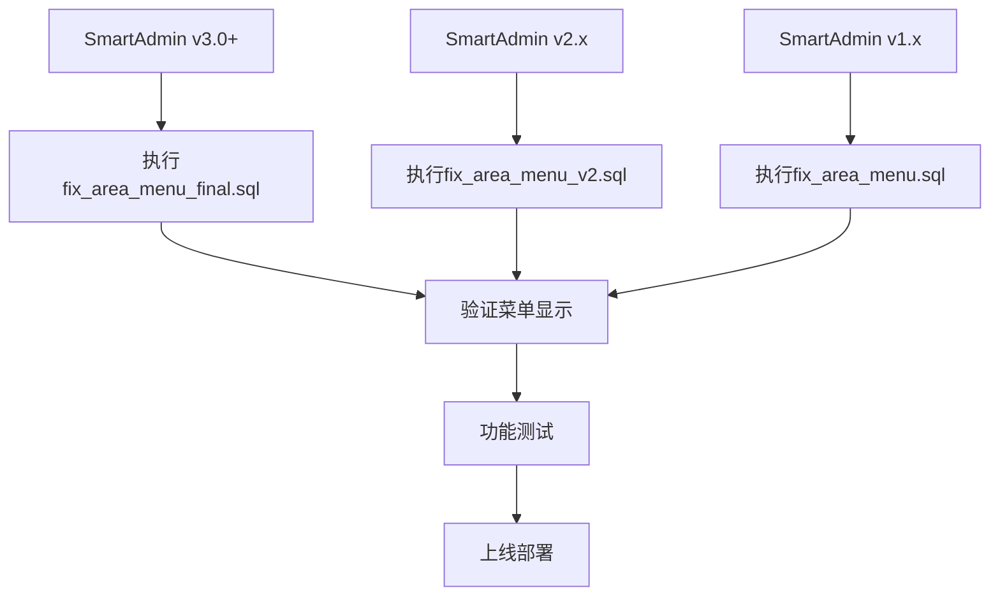

### 依赖关系分析

| 脚本版本 | 前置条件 | 依赖关系 | 兼容性 |
|---------|---------|---------|-------|
| fix_area_menu.sql | 基础菜单结构 | 无 | SmartAdmin v1.x |
| fix_area_menu_v2.sql | 基础菜单结构 | fix_area_menu.sql | SmartAdmin v2.x |
| fix_area_menu_final.sql | 基础菜单结构 | fix_area_menu_v2.sql | SmartAdmin v3.0+ |

**章节来源**
- [smart_area.sql](file://数据库SQL脚本/mysql/smart_area.sql#L159-L193)

## 环境应用策略

### 开发环境应用

在开发环境中，建议采用以下策略：

1. **测试验证**：先在测试环境中验证脚本效果
2. **逐步部署**：采用蓝绿部署或金丝雀发布
3. **监控观察**：密切监控系统性能和功能表现

### 测试环境应用

测试环境的应用重点：

1. **功能回归测试**：验证所有相关功能正常
2. **性能测试**：检查菜单加载性能
3. **兼容性测试**：验证不同浏览器兼容性

### 生产环境应用

生产环境部署的关键考虑：

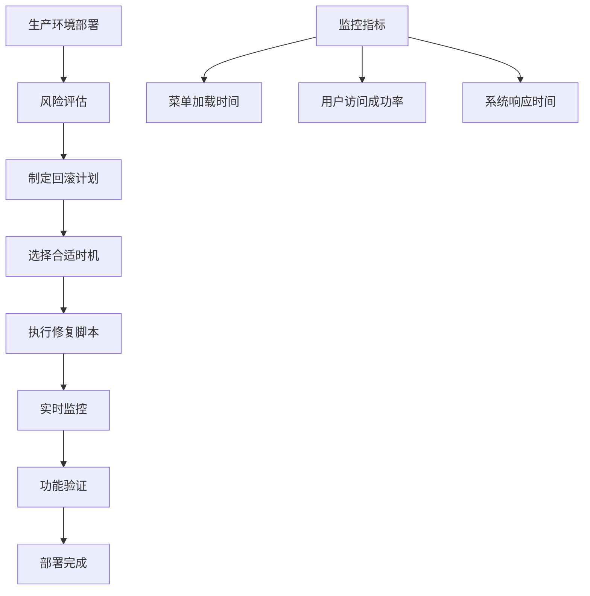

**章节来源**
- [区域管理菜单问题修复说明.md](file://区域管理菜单问题修复说明.md#L122-L147)

## 故障排除指南

### 常见问题诊断

| 问题症状 | 可能原因 | 诊断方法 | 解决方案 |
|---------|---------|---------|---------|
| 菜单不显示 | component路径错误 | 检查t_sys_menu表 | 重新执行修复脚本 |
| 权限异常 | 权限点缺失 | 查询权限配置 | 补充权限点 |
| 系统报错 | 数据不一致 | 检查数据库约束 | 重建菜单结构 |
| 加载缓慢 | 菜单过多 | 分析查询性能 | 优化索引配置 |

### 诊断工具使用

提供了多个诊断脚本来帮助排查问题：

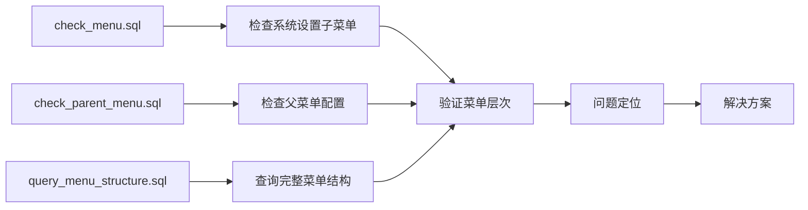

**图表来源**
- [check_menu.sql](file://check_menu.sql#L1-L31)
- [check_parent_menu.sql](file://check_parent_menu.sql#L1-L40)
- [query_menu_structure.sql](file://query_menu_structure.sql#L1-L42)

**章节来源**
- [区域管理菜单问题修复说明.md](file://区域管理菜单问题修复说明.md#L122-L147)

## 最佳实践建议

### 开发规范

基于修复脚本的经验，总结以下开发规范：

1. **Component路径规范**：
   - ✅ 正确：`system/area/index.vue`
   - ✅ 正确：`business/goods/index.vue`
   - ❌ 错误：`views/system/area/index.vue`
   - ❌ 错误：`/views/system/area/index.vue`

2. **SQL编写规范**：
   - 使用变量避免复杂嵌套子查询
   - 添加适当的错误处理
   - 提供清晰的执行日志

3. **菜单设计原则**：
   - 明确的父子关系
   - 合理的排序顺序
   - 完整的权限配置

### 预防措施

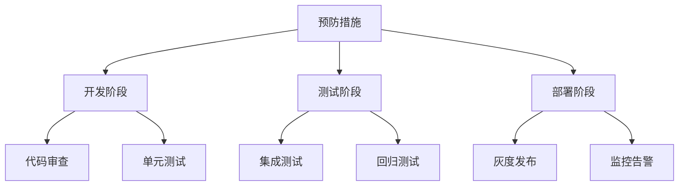

### 维护建议

1. **定期检查**：定期检查菜单结构的一致性
2. **版本跟踪**：跟踪菜单配置的版本变更
3. **文档维护**：及时更新相关技术文档
4. **培训教育**：加强开发团队的技术培训

**章节来源**
- [区域管理菜单问题修复说明.md](file://区域管理菜单问题修复说明.md#L130-L164)

## 总结

修复脚本的演进过程体现了SmartAdmin项目在菜单管理方面的不断优化和完善。从初版的简单修复到最终版本的完善方案，每个版本都针对特定的问题进行了针对性的改进。

通过系统性的分析和对比，我们可以看到：

1. **问题根源明确**：前端路由机制的理解不足导致了路径配置错误
2. **解决方案渐进**：从简单的路径修正到完整的菜单重构
3. **质量持续提升**：每个版本都在验证、兼容性和用户体验方面有所改进
4. **最佳实践形成**：积累了宝贵的开发和运维经验

这些修复脚本不仅解决了当前的问题，更为后续类似问题的处理提供了宝贵的经验和参考模板。