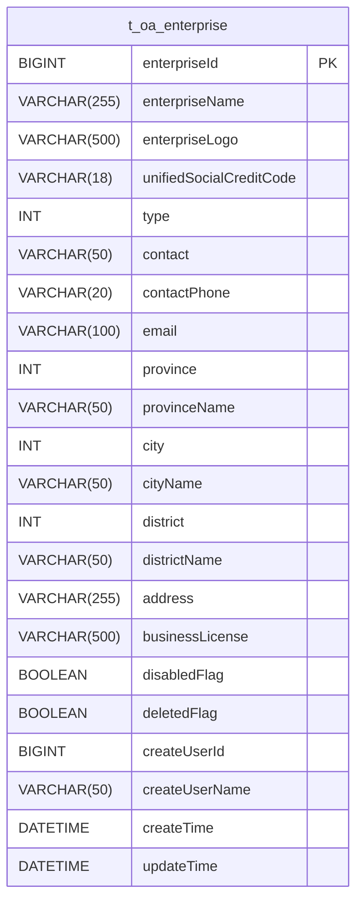
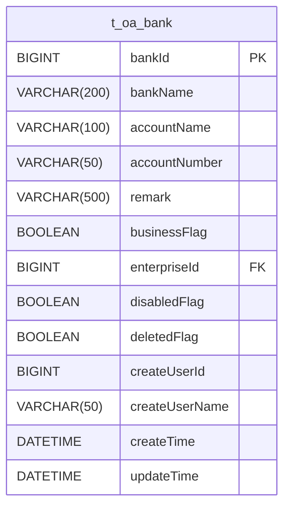
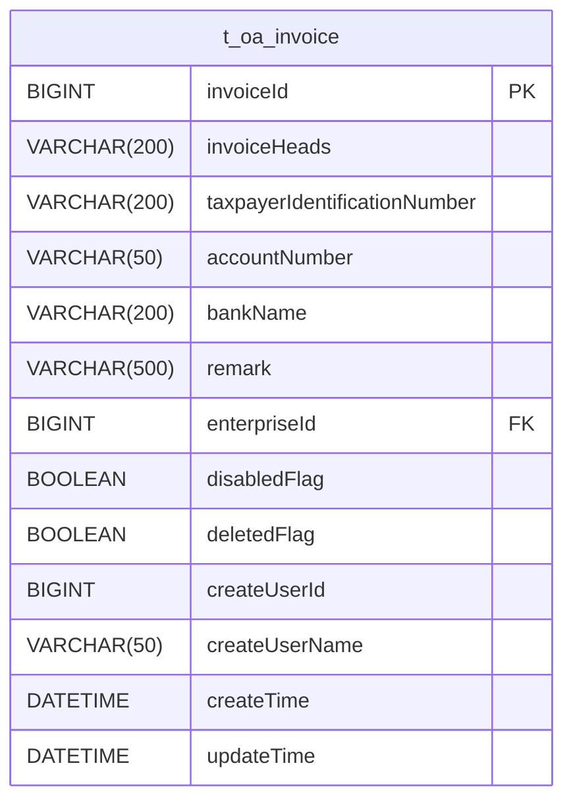
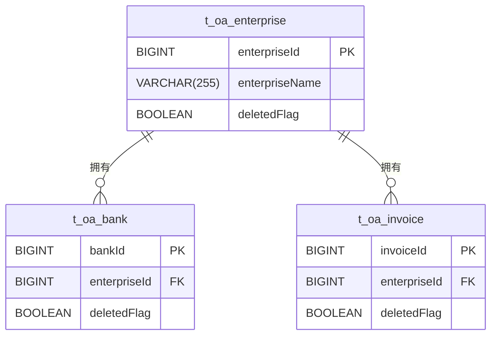
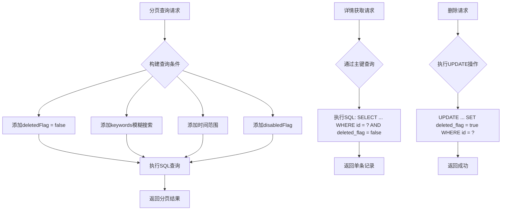
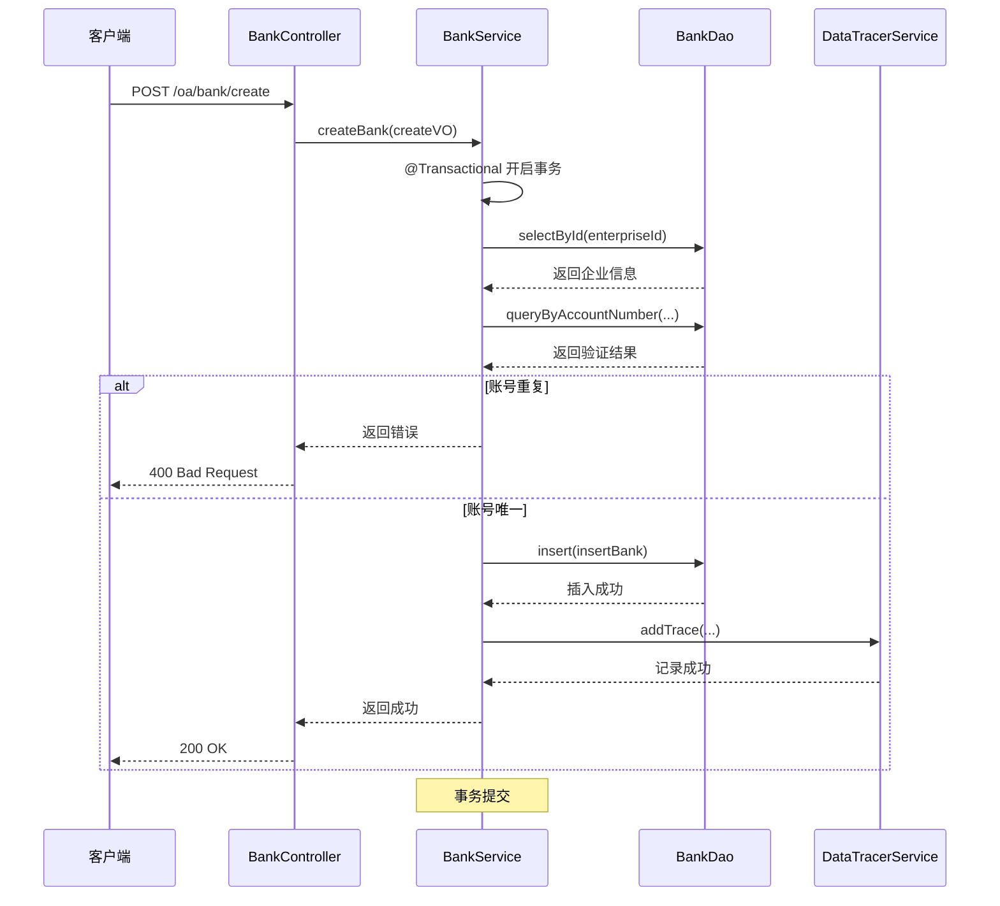

# 企业OA模块表结构

<cite>
**本文档引用的文件**   
- [EnterpriseEntity.java](file://smart-admin-api-java17-springboot3/sa-admin/src/main/java/net/lab1024/sa/admin/module/business/oa/enterprise/domain/entity/EnterpriseEntity.java)
- [BankEntity.java](file://smart-admin-api-java17-springboot3/sa-admin/src/main/java/net/lab1024/sa/admin/module/business/oa/bank/domain/BankEntity.java)
- [InvoiceEntity.java](file://smart-admin-api-java17-springboot3/sa-admin/src/main/java/net/lab1024/sa/admin/module/business/oa/invoice/domain/InvoiceEntity.java)
- [EnterpriseMapper.xml](file://smart-admin-api-java17-springboot3/sa-admin/src/main/resources/mapper/business/oa/enterprise/EnterpriseMapper.xml)
- [BankMapper.xml](file://smart-admin-api-java17-springboot3/sa-admin/src/main/resources/mapper/business/oa/bank/BankMapper.xml)
- [InvoiceMapper.xml](file://smart-admin-api-java17-springboot3/sa-admin/src/main/resources/mapper/business/oa/invoice/InvoiceMapper.xml)
- [BankService.java](file://smart-admin-api-java17-springboot3/sa-admin/src/main/java/net/lab1024/sa/admin/module/business/oa/bank/service/BankService.java)
- [InvoiceService.java](file://smart-admin-api-java17-springboot3/sa-admin/src/main/java/net/lab1024/sa/admin/module/business/oa/invoice/service/InvoiceService.java)
</cite>

## 目录
1. [引言](#引言)
2. [核心表结构设计](#核心表结构设计)
3. [企业与关联实体的关系实现](#企业与关联实体的关系实现)
4. [软删除与禁用状态机制](#软删除与禁用状态机制)
5. [DAO层查询与优化](#dao层查询与优化)
6. [级联处理与事务管理](#级联处理与事务管理)

## 引言
本文档详细阐述了企业OA模块中三张核心数据库表的设计：企业(t_enterprise)、银行账户(t_bank)和发票(t_invoice)。文档涵盖了各表的字段设计、数据类型、约束条件及索引策略，重点分析了企业与银行账户、发票之间的多对多关系实现方式。同时，文档解释了企业信息的软删除机制（deletedFlag）和禁用状态（disabledFlag）的区别与应用场景，结合DAO层的分页查询、详情获取和删除操作方法，说明了复杂查询的SQL优化技巧，并提供了企业信息变更时，关联银行账户和发票数据的级联处理逻辑和事务管理方案。

## 核心表结构设计

### 企业表 (t_oa_enterprise)
企业表是整个OA模块的核心，存储企业的基本信息。

**字段说明：**
| 字段名 | 数据类型 | 约束 | 说明 |
| :--- | :--- | :--- | :--- |
| enterpriseId | BIGINT | PRIMARY KEY, AUTO_INCREMENT | 企业ID，主键，自增 |
| enterpriseName | VARCHAR(255) | NOT NULL | 企业名称 |
| enterpriseLogo | VARCHAR(500) | NULL | 企业logo |
| unifiedSocialCreditCode | VARCHAR(18) | NULL | 统一社会信用代码 |
| type | INT | NULL | 企业类型，关联EnterpriseTypeEnum |
| contact | VARCHAR(50) | NULL | 联系人 |
| contactPhone | VARCHAR(20) | NULL | 联系人电话 |
| email | VARCHAR(100) | NULL | 邮箱 |
| province | INT | NULL | 省份编码 |
| provinceName | VARCHAR(50) | NULL | 省份名称 |
| city | INT | NULL | 城市编码 |
| cityName | VARCHAR(50) | NULL | 城市名称 |
| district | INT | NULL | 区县编码 |
| districtName | VARCHAR(50) | NULL | 区县名称 |
| address | VARCHAR(255) | NULL | 详细地址 |
| businessLicense | VARCHAR(500) | NULL | 营业执照文件路径 |
| disabledFlag | BOOLEAN | DEFAULT FALSE | 禁用状态，true为禁用 |
| deletedFlag | BOOLEAN | DEFAULT FALSE | 删除状态，true为已删除 |
| createUserId | BIGINT | NULL | 创建人ID |
| createUserName | VARCHAR(50) | NULL | 创建人名称 |
| createTime | DATETIME | DEFAULT CURRENT_TIMESTAMP | 创建时间 |
| updateTime | DATETIME | DEFAULT CURRENT_TIMESTAMP ON UPDATE CURRENT_TIMESTAMP | 更新时间 |

**索引设计：**
- 主键索引：`PRIMARY KEY (enterpriseId)`
- 唯一性约束：`UNIQUE INDEX idx_enterprise_name (enterpriseName)` (通过业务逻辑保证，代码中通过`queryByEnterpriseName`方法实现)
- 状态索引：`INDEX idx_status (deletedFlag, disabledFlag)` (用于高效过滤已删除和禁用的记录)

**图表来源**
- [EnterpriseEntity.java](file://smart-admin-api-java17-springboot3/sa-admin/src/main/java/net/lab1024/sa/admin/module/business/oa/enterprise/domain/entity/EnterpriseEntity.java)

**本节来源**
- [EnterpriseEntity.java](file://smart-admin-api-java17-springboot3/sa-admin/src/main/java/net/lab1024/sa/admin/module/business/oa/enterprise/domain/entity/EnterpriseEntity.java)

### 银行账户表 (t_oa_bank)
银行账户表存储与企业关联的银行账户信息。

**字段说明：**
| 字段名 | 数据类型 | 约束 | 说明 |
| :--- | :--- | :--- | :--- |
| bankId | BIGINT | PRIMARY KEY, AUTO_INCREMENT | 银行信息ID，主键，自增 |
| bankName | VARCHAR(200) | NOT NULL | 开户银行 |
| accountName | VARCHAR(100) | NOT NULL | 账户名称 |
| accountNumber | VARCHAR(50) | NOT NULL | 账号 |
| remark | VARCHAR(500) | NULL | 备注 |
| businessFlag | BOOLEAN | NULL | 是否对公 |
| enterpriseId | BIGINT | NOT NULL | 企业ID，外键 |
| disabledFlag | BOOLEAN | DEFAULT FALSE | 禁用状态，true为禁用 |
| deletedFlag | BOOLEAN | DEFAULT FALSE | 删除状态，true为已删除 |
| createUserId | BIGINT | NULL | 创建人ID |
| createUserName | VARCHAR(50) | NULL | 创建人名称 |
| createTime | DATETIME | DEFAULT CURRENT_TIMESTAMP | 创建时间 |
| updateTime | DATETIME | DEFAULT CURRENT_TIMESTAMP ON UPDATE CURRENT_TIMESTAMP | 更新时间 |

**索引设计：**
- 主键索引：`PRIMARY KEY (bankId)`
- 外键索引：`INDEX idx_enterprise_id (enterpriseId)` (用于高效关联查询企业信息)
- 唯一性约束：`UNIQUE INDEX idx_account_unique (enterpriseId, accountNumber, deletedFlag)` (通过业务逻辑保证，代码中通过`queryByAccountNumber`方法实现，确保同一企业下账号不重复)
- 状态索引：`INDEX idx_status (deletedFlag, disabledFlag)` (用于高效过滤已删除和禁用的记录)

**图表来源**
- [BankEntity.java](file://smart-admin-api-java17-springboot3/sa-admin/src/main/java/net/lab1024/sa/admin/module/business/oa/bank/domain/BankEntity.java)

**本节来源**
- [BankEntity.java](file://smart-admin-api-java17-springboot3/sa-admin/src/main/java/net/lab1024/sa/admin/module/business/oa/bank/domain/BankEntity.java)

### 发票表 (t_oa_invoice)
发票表存储与企业关联的发票信息。

**字段说明：**
| 字段名 | 数据类型 | 约束 | 说明 |
| :--- | :--- | :--- | :--- |
| invoiceId | BIGINT | PRIMARY KEY, AUTO_INCREMENT | 发票信息ID，主键，自增 |
| invoiceHeads | VARCHAR(200) | NOT NULL | 开票抬头 |
| taxpayerIdentificationNumber | VARCHAR(200) | NOT NULL | 纳税人识别号 |
| accountNumber | VARCHAR(50) | NOT NULL | 银行账户 |
| bankName | VARCHAR(200) | NOT NULL | 开户行 |
| remark | VARCHAR(500) | NULL | 备注 |
| enterpriseId | BIGINT | NOT NULL | 企业ID，外键 |
| disabledFlag | BOOLEAN | DEFAULT FALSE | 禁用状态，true为禁用 |
| deletedFlag | BOOLEAN | DEFAULT FALSE | 删除状态，true为已删除 |
| createUserId | BIGINT | NULL | 创建人ID |
| createUserName | VARCHAR(50) | NULL | 创建人名称 |
| createTime | DATETIME | DEFAULT CURRENT_TIMESTAMP | 创建时间 |
| updateTime | DATETIME | DEFAULT CURRENT_TIMESTAMP ON UPDATE CURRENT_TIMESTAMP | 更新时间 |

**索引设计：**
- 主键索引：`PRIMARY KEY (invoiceId)`
- 外键索引：`INDEX idx_enterprise_id (enterpriseId)` (用于高效关联查询企业信息)
- 唯一性约束：`UNIQUE INDEX idx_invoice_unique (enterpriseId, accountNumber, deletedFlag)` (通过业务逻辑保证，代码中通过`queryByAccountNumber`方法实现，确保同一企业下银行账号不重复)
- 状态索引：`INDEX idx_status (deletedFlag, disabledFlag)` (用于高效过滤已删除和禁用的记录)

**图表来源**
- [InvoiceEntity.java](file://smart-admin-api-java17-springboot3/sa-admin/src/main/java/net/lab1024/sa/admin/module/business/oa/invoice/domain/InvoiceEntity.java)

**本节来源**
- [InvoiceEntity.java](file://smart-admin-api-java17-springboot3/sa-admin/src/main/java/net/lab1024/sa/admin/module/business/oa/invoice/domain/InvoiceEntity.java)

## 企业与关联实体的关系实现
企业与银行账户、发票之间是典型的“一对多”关系，即一个企业可以拥有多个银行账户和多个发票信息。这种关系通过外键（Foreign Key）在数据库层面实现。

### 外键关联
- **银行账户表 (t_oa_bank)**：包含 `enterpriseId` 字段作为外键，引用 `t_oa_enterprise` 表的 `enterpriseId`。这确保了每条银行账户记录都必须关联到一个存在的企业。
- **发票表 (t_oa_invoice)**：同样包含 `enterpriseId` 字段作为外键，引用 `t_oa_enterprise` 表的 `enterpriseId`。这确保了每条发票记录都必须关联到一个存在的企业。

### 数据一致性维护策略
系统通过以下策略维护数据的一致性：
1.  **业务逻辑校验**：在创建银行账户或发票时，服务层（Service）会首先调用 `enterpriseDao.selectById(enterpriseId)` 检查企业是否存在且未被删除。如果企业不存在或已被删除，则拒绝创建操作。
2.  **唯一性约束**：通过 `queryByAccountNumber` 方法在创建或更新时检查同一企业下银行账号或发票账号的唯一性，防止数据重复。
3.  **级联查询**：在查询银行账户或发票的详情时，通过 `LEFT JOIN` 语句关联 `t_oa_enterprise` 表，直接获取企业名称等信息，保证了数据展示的完整性。

**图表来源**
- [EnterpriseEntity.java](file://smart-admin-api-java17-springboot3/sa-admin/src/main/java/net/lab1024/sa/admin/module/business/oa/enterprise/domain/entity/EnterpriseEntity.java)
- [BankEntity.java](file://smart-admin-api-java17-springboot3/sa-admin/src/main/java/net/lab1024/sa/admin/module/business/oa/bank/domain/BankEntity.java)
- [InvoiceEntity.java](file://smart-admin-api-java17-springboot3/sa-admin/src/main/java/net/lab1024/sa/admin/module/business/oa/invoice/domain/InvoiceEntity.java)

**本节来源**
- [BankService.java](file://smart-admin-api-java17-springboot3/sa-admin/src/main/java/net/lab1024/sa/admin/module/business/oa/bank/service/BankService.java#L71-L98)
- [InvoiceService.java](file://smart-admin-api-java17-springboot3/sa-admin/src/main/java/net/lab1024/sa/admin/module/business/oa/invoice/service/InvoiceService.java#L94-L119)

## 软删除与禁用状态机制
系统采用了“软删除”和“禁用”两种状态来管理数据的生命周期，它们在应用场景和实现上有所不同。

### 软删除 (deletedFlag)
- **定义**：`deletedFlag` 是一个逻辑删除标志。当其值为 `true` 时，表示该记录在业务上已被删除，但在数据库中物理上仍然存在。
- **应用场景**：
  - **数据恢复**：当用户误删数据时，管理员可以将其 `deletedFlag` 重新设为 `false` 来恢复数据。
  - **数据审计**：保留历史数据，便于进行数据追踪和审计。
  - **关联完整性**：避免因物理删除父表记录而导致子表记录成为“孤儿”。
- **实现方式**：在所有查询操作（如 `queryPage`, `getDetail`）的SQL语句中，都会添加 `AND deleted_flag = false` 的条件，确保只返回未被删除的记录。删除操作实际上是执行 `UPDATE` 语句，将 `deletedFlag` 设为 `true`。

### 禁用状态 (disabledFlag)
- **定义**：`disabledFlag` 是一个业务状态标志。当其值为 `true` 时，表示该记录当前处于禁用状态，不能被正常使用，但数据本身是完整且可见的。
- **应用场景**：
  - **临时停用**：例如，一个企业的银行账户因故被银行冻结，可以将其状态设为“禁用”，待问题解决后再“启用”。
  - **权限控制**：禁用的记录在某些业务流程中会被跳过或忽略。
  - **数据展示**：在列表中，禁用的记录通常会以灰色或其他方式显示，表明其不可用。
- **实现方式**：在需要区分启用/禁用状态的查询中，会根据业务需求添加 `AND disabled_flag = ?` 的条件。例如，查询可用的企业列表时，会筛选 `disabledFlag = false` 的记录。

**核心区别**：
- `deletedFlag` 关注的是**数据的存在性**，`true` 表示“已删除”。
- `disabledFlag` 关注的是**数据的可用性**，`true` 表示“已禁用”。

**本节来源**
- [EnterpriseEntity.java](file://smart-admin-api-java17-springboot3/sa-admin/src/main/java/net/lab1024/sa/admin/module/business/oa/enterprise/domain/entity/EnterpriseEntity.java#L122-L132)
- [BankEntity.java](file://smart-admin-api-java17-springboot3/sa-admin/src/main/java/net/lab1024/sa/admin/module/business/oa/bank/domain/BankEntity.java#L66-L75)
- [InvoiceEntity.java](file://smart-admin-api-java17-springboot3/sa-admin/src/main/java/net/lab1024/sa/admin/module/business/oa/invoice/domain/InvoiceEntity.java#L64-L75)

## DAO层查询与优化
DAO层提供了对数据库的访问接口，其查询方法经过了精心设计和优化。

### 分页查询
- **方法**：`queryPage(Page page, @Param("queryForm") QueryForm queryForm)`
- **优化技巧**：
  1.  **条件索引**：查询条件中的 `enterpriseId`, `deletedFlag`, `disabledFlag` 都有对应的索引，确保WHERE子句能高效执行。
  2.  **模糊搜索优化**：使用 `INSTR()` 函数进行模糊匹配，避免了低效的 `LIKE '%...%'` 操作。
  3.  **时间范围查询**：使用 `DATE_FORMAT()` 函数将时间字段格式化后与字符串进行比较，适用于按天查询的场景。
  4.  **默认排序**：当未指定排序规则时，按 `createTime` 降序排列，保证最新的记录优先显示。

### 详情获取
- **方法**：`getDetail(@Param("id") Long id, @Param("deletedFlag") Boolean deletedFlag)`
- **优化技巧**：
  1.  **精确查询**：通过主键 `id` 进行查询，这是最快的查询方式。
  2.  **关联查询**：使用 `LEFT JOIN` 一次性获取关联的企业名称，避免了N+1查询问题。

### 删除操作
- **方法**：`deleteBank(@Param("bankId") Long bankId, @Param("deletedFlag") Boolean deletedFlag)`
- **实现**：这是一个典型的软删除操作，通过 `UPDATE` 语句修改 `deletedFlag` 字段的值，而不是执行 `DELETE` 语句，保证了数据的可追溯性。

**图表来源**
- [BankMapper.xml](file://smart-admin-api-java17-springboot3/sa-admin/src/main/resources/mapper/business/oa/bank/BankMapper.xml)
- [InvoiceMapper.xml](file://smart-admin-api-java17-springboot3/sa-admin/src/main/resources/mapper/business/oa/invoice/InvoiceMapper.xml)
- [EnterpriseMapper.xml](file://smart-admin-api-java17-springboot3/sa-admin/src/main/resources/mapper/business/oa/enterprise/EnterpriseMapper.xml)

**本节来源**
- [BankMapper.xml](file://smart-admin-api-java17-springboot3/sa-admin/src/main/resources/mapper/business/oa/bank/BankMapper.xml#L20-L58)
- [InvoiceMapper.xml](file://smart-admin-api-java17-springboot3/sa-admin/src/main/resources/mapper/business/oa/invoice/InvoiceMapper.xml#L20-L56)
- [EnterpriseMapper.xml](file://smart-admin-api-java17-springboot3/sa-admin/src/main/resources/mapper/business/oa/enterprise/EnterpriseMapper.xml#L20-L43)

## 级联处理与事务管理
当企业信息发生变更或删除时，需要确保关联的银行账户和发票数据得到妥善处理。

### 级联处理逻辑
- **企业删除**：当一个企业被删除时（`deletedFlag` 设为 `true`），其关联的所有银行账户和发票记录的 `deletedFlag` 也会被自动设为 `true`。这通常在服务层通过一个事务来完成。
- **企业信息变更**：当企业信息（如名称、联系方式）更新时，关联的银行账户和发票记录中的企业信息（如企业名称）也会被同步更新，以保持数据一致性。

### 事务管理方案
系统使用 `@Transactional(rollbackFor = Exception.class)` 注解来管理事务，确保数据操作的原子性。

**示例流程（创建银行账户）：**
1.  **开启事务**：`BankService.createBank()` 方法被 `@Transactional` 注解标记。
2.  **校验企业**：查询企业是否存在且未被删除。
3.  **校验唯一性**：检查银行账号在该企业下是否已存在。
4.  **插入数据**：将新的银行账户记录插入 `t_oa_bank` 表。
5.  **记录追踪**：调用 `dataTracerService.addTrace()` 记录操作日志。
6.  **提交或回滚**：如果以上步骤全部成功，则提交事务；如果任何一步失败（如企业不存在、账号重复），则整个事务回滚，数据库状态保持不变。

**图表来源**
- [BankService.java](file://smart-admin-api-java17-springboot3/sa-admin/src/main/java/net/lab1024/sa/admin/module/business/oa/bank/service/BankService.java#L71-L98)
- [InvoiceService.java](file://smart-admin-api-java17-springboot3/sa-admin/src/main/java/net/lab1024/sa/admin/module/business/oa/invoice/service/InvoiceService.java#L94-L119)

**本节来源**
- [BankService.java](file://smart-admin-api-java17-springboot3/sa-admin/src/main/java/net/lab1024/sa/admin/module/business/oa/bank/service/BankService.java#L71-L98)
- [InvoiceService.java](file://smart-admin-api-java17-springboot3/sa-admin/src/main/java/net/lab1024/sa/admin/module/business/oa/invoice/service/InvoiceService.java#L94-L119)