# 员工表结构

<cite>
**本文档中引用的文件**
- [EmployeeEntity.java](file://smart-admin-api-java17-springboot3/sa-admin/src/main/java/net/lab1024/sa/admin/module/system/employee/domain/entity/EmployeeEntity.java)
- [EmployeeMapper.xml](file://smart-admin-api-java17-springboot3/sa-admin/src/main/resources/mapper/system/employee/EmployeeMapper.xml)
- [EmployeeDao.java](file://smart-admin-api-java17-springboot3/sa-admin/src/main/java/net/lab1024/sa/admin/module/system/employee/dao/EmployeeDao.java)
- [EmployeeManager.java](file://smart-admin-api-java17-springboot3/sa-admin/src/main/java/net/lab1024/sa/admin/module/system/employee/manager/EmployeeManager.java)
- [EmployeeVO.java](file://smart-admin-api-java17-springboot3/sa-admin/src/main/java/net/lab1024/sa/admin/module/system/employee/domain/vo/EmployeeVO.java)
- [DepartmentEntity.java](file://smart-admin-api-java17-springboot3/sa-admin/src/main/java/net/lab1024/sa/admin/module/system/department/domain/entity/DepartmentEntity.java)
- [PositionEntity.java](file://smart-admin-api-java17-springboot3/sa-admin/src/main/java/net/lab1024/sa/admin/module/system/position/domain/entity/PositionEntity.java)
- [LoginForm.java](file://smart-admin-api-java17-springboot3/sa-admin/src/main/java/net/lab1024/sa/admin/module/system/login/domain/LoginForm.java)
</cite>

## 目录
1. [简介](#简介)
2. [数据库表结构](#数据库表结构)
3. [核心实体类分析](#核心实体类分析)
4. [字段定义与约束](#字段定义与约束)
5. [外键关联关系](#外键关联关系)
6. [员工管理逻辑](#员工管理逻辑)
7. [SQL查询实现](#sql查询实现)
8. [登录认证机制](#登录认证机制)
9. [权限管理体系](#权限管理体系)
10. [数据流分析](#数据流分析)
11. [总结](#总结)

## 简介

员工表（t_employee）是Smart Admin系统的核心数据模型之一，负责存储和管理企业的员工基本信息。该表不仅包含基本的员工信息，还与部门、岗位、角色等多个模块存在复杂的关联关系，在整个系统的权限管理和业务流程中发挥着关键作用。

## 数据库表结构

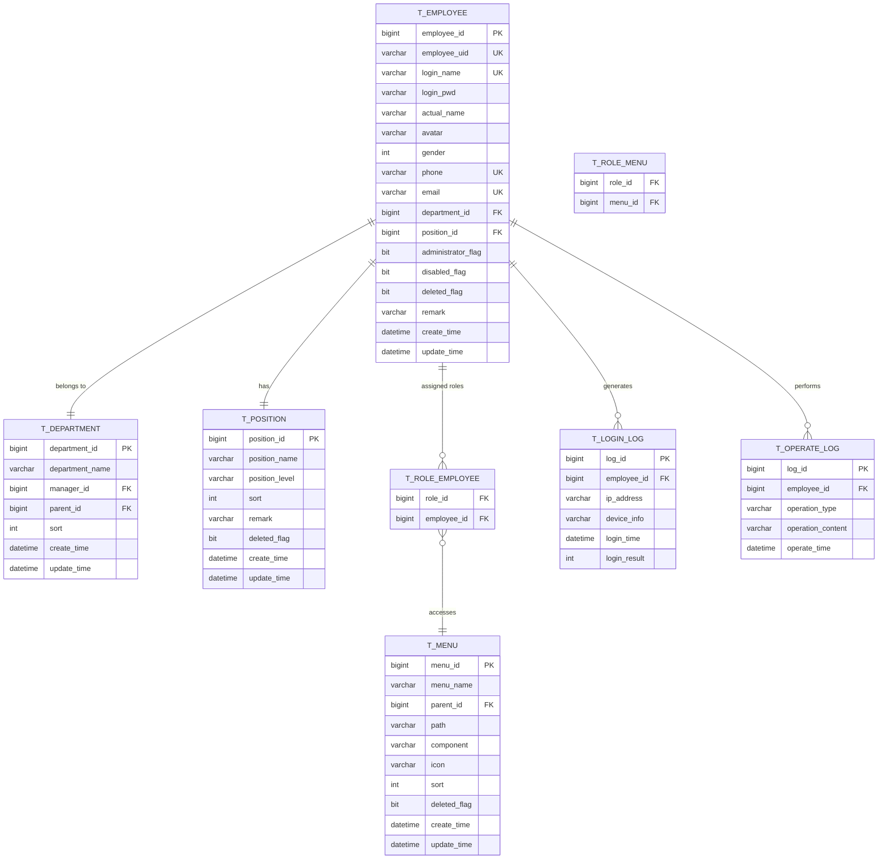

**图表来源**
- [EmployeeEntity.java](file://smart-admin-api-java17-springboot3/sa-admin/src/main/java/net/lab1024/sa/admin/module/system/employee/domain/entity/EmployeeEntity.java#L21-L102)
- [DepartmentEntity.java](file://smart-admin-api-java17-springboot3/sa-admin/src/main/java/net/lab1024/sa/admin/module/system/department/domain/entity/DepartmentEntity.java#L25-L64)
- [PositionEntity.java](file://smart-admin-api-java17-springboot3/sa-admin/src/main/java/net/lab1024/sa/admin/module/system/position/domain/entity/PositionEntity.java#L25-L60)

## 核心实体类分析

### EmployeeEntity实体类

EmployeeEntity是员工表在Java中的ORM映射实体类，使用MyBatis-Plus框架进行数据库操作。

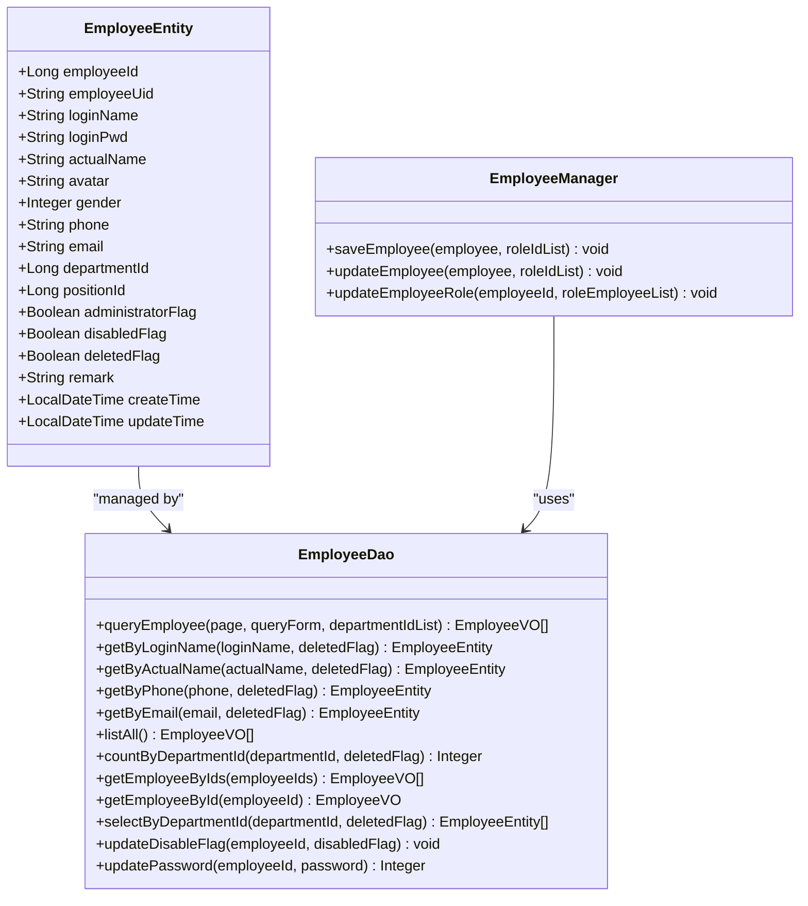

**图表来源**
- [EmployeeEntity.java](file://smart-admin-api-java17-springboot3/sa-admin/src/main/java/net/lab1024/sa/admin/module/system/employee/domain/entity/EmployeeEntity.java#L21-L102)
- [EmployeeDao.java](file://smart-admin-api-java17-springboot3/sa-admin/src/main/java/net/lab1024/sa/admin/module/system/employee/dao/EmployeeDao.java#L24-L110)
- [EmployeeManager.java](file://smart-admin-api-java17-springboot3/sa-admin/src/main/java/net/lab1024/sa/admin/module/system/employee/manager/EmployeeManager.java#L27-L86)

**节来源**
- [EmployeeEntity.java](file://smart-admin-api-java17-springboot3/sa-admin/src/main/java/net/lab1024/sa/admin/module/system/employee/domain/entity/EmployeeEntity.java#L1-L103)
- [EmployeeDao.java](file://smart-admin-api-java17-springboot3/sa-admin/src/main/java/net/lab1024/sa/admin/module/system/employee/dao/EmployeeDao.java#L1-L111)
- [EmployeeManager.java](file://smart-admin-api-java17-springboot3/sa-admin/src/main/java/net/lab1024/sa/admin/module/system/employee/manager/EmployeeManager.java#L1-L87)

## 字段定义与约束

### 核心字段详细说明

| 字段名 | 类型 | 约束 | 描述 | 用途 |
|--------|------|------|------|------|
| employee_id | BIGINT | PRIMARY KEY, AUTO_INCREMENT | 员工唯一标识符 | 主键，自增 |
| employee_uid | VARCHAR(32) | UNIQUE | 员工唯一ID | 全局唯一标识 |
| login_name | VARCHAR(30) | UNIQUE, NOT NULL | 登录账号 | 用户登录凭证 |
| login_pwd | VARCHAR(100) | NOT NULL | 登录密码 | 密码存储 |
| actual_name | VARCHAR(20) | NOT NULL | 员工真实姓名 | 显示名称 |
| phone | VARCHAR(15) | UNIQUE, NOT NULL | 手机号码 | 联系方式 |
| email | VARCHAR(50) | UNIQUE, NOT NULL | 邮箱地址 | 联系方式 |
| department_id | BIGINT | FOREIGN KEY | 部门ID | 关联部门表 |
| position_id | BIGINT | FOREIGN KEY | 岗位ID | 关联岗位表 |
| administrator_flag | BIT | DEFAULT 0 | 超级管理员标志 | 权限控制 |
| disabled_flag | BIT | DEFAULT 0 | 禁用标志 | 账号状态 |
| deleted_flag | BIT | DEFAULT 0 | 删除标志 | 逻辑删除 |

### 字段约束分析

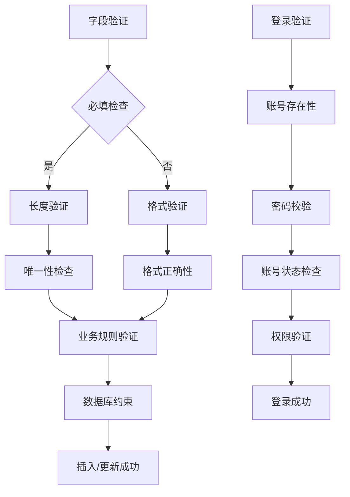

**节来源**
- [EmployeeEntity.java](file://smart-admin-api-java17-springboot3/sa-admin/src/main/java/net/lab1024/sa/admin/module/system/employee/domain/entity/EmployeeEntity.java#L23-L102)

## 外键关联关系

### 部门关联（department_id）

员工与部门之间存在一对多的关系，每个员工属于一个部门，一个部门可以有多个员工。

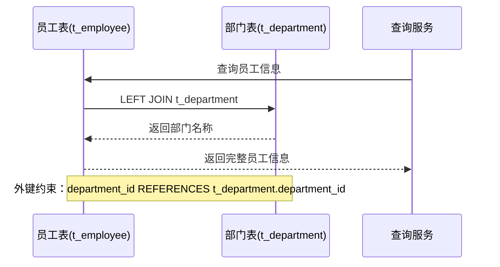

**图表来源**
- [EmployeeMapper.xml](file://smart-admin-api-java17-springboot3/sa-admin/src/main/resources/mapper/system/employee/EmployeeMapper.xml#L7-L11)
- [EmployeeMapper.xml](file://smart-admin-api-java17-springboot3/sa-admin/src/main/resources/mapper/system/employee/EmployeeMapper.xml#L170-L176)

### 岗位关联（position_id）

员工与岗位之间存在一对一的关系，每个员工有一个具体的岗位。

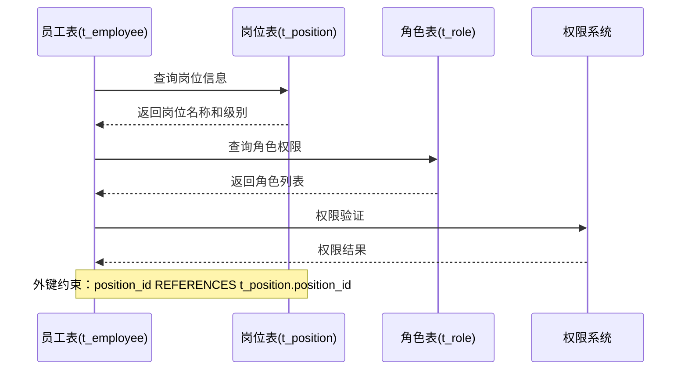

**图表来源**
- [EmployeeVO.java](file://smart-admin-api-java17-springboot3/sa-admin/src/main/java/net/lab1024/sa/admin/module/system/employee/domain/vo/EmployeeVO.java#L59-L63)

**节来源**
- [EmployeeMapper.xml](file://smart-admin-api-java17-springboot3/sa-admin/src/main/resources/mapper/system/employee/EmployeeMapper.xml#L1-L200)
- [EmployeeVO.java](file://smart-admin-api-java17-springboot3/sa-admin/src/main/java/net/lab1024/sa/admin/module/system/employee/domain/vo/EmployeeVO.java#L1-L69)

## 员工管理逻辑

### EmployeeManager管理器

EmployeeManager负责员工数据的高级业务逻辑处理，包括员工的创建、更新和角色分配。

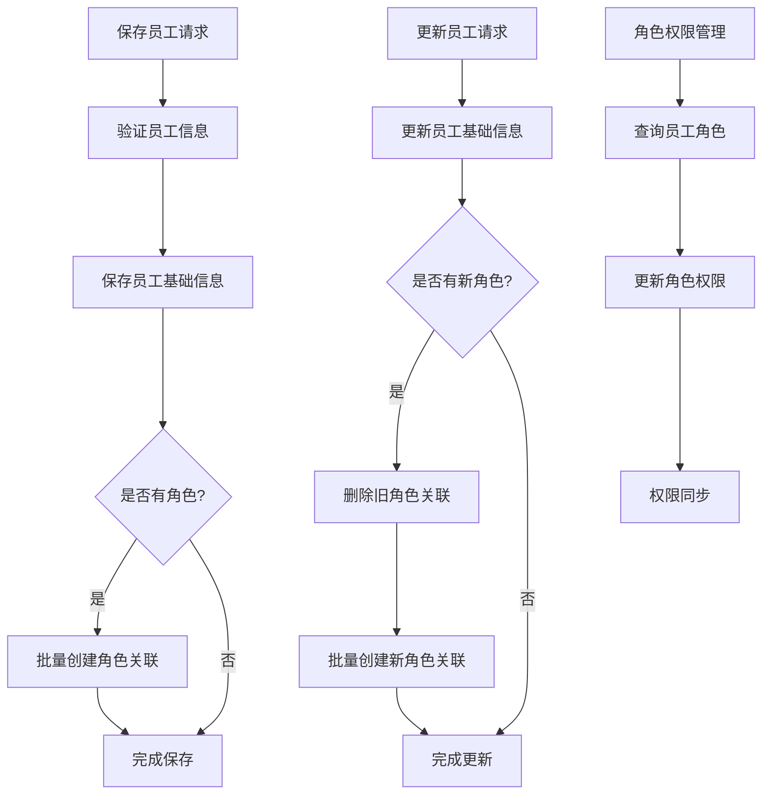

**图表来源**
- [EmployeeManager.java](file://smart-admin-api-java17-springboot3/sa-admin/src/main/java/net/lab1024/sa/admin/module/system/employee/manager/EmployeeManager.java#L43-L86)

### 状态管理机制

系统采用软删除和状态标志来管理员工数据的生命周期：

- **deleted_flag**: 逻辑删除标记，0表示未删除，1表示已删除
- **disabled_flag**: 账号禁用标记，0表示正常，1表示禁用
- **administrator_flag**: 超级管理员标记，0表示普通用户，1表示超级管理员

**节来源**
- [EmployeeManager.java](file://smart-admin-api-java17-springboot3/sa-admin/src/main/java/net/lab1024/sa/admin/module/system/employee/manager/EmployeeManager.java#L1-L87)

## SQL查询实现

### 核心查询语句分析

#### 员工信息查询

系统提供了多种员工信息查询方式，满足不同的业务场景需求：

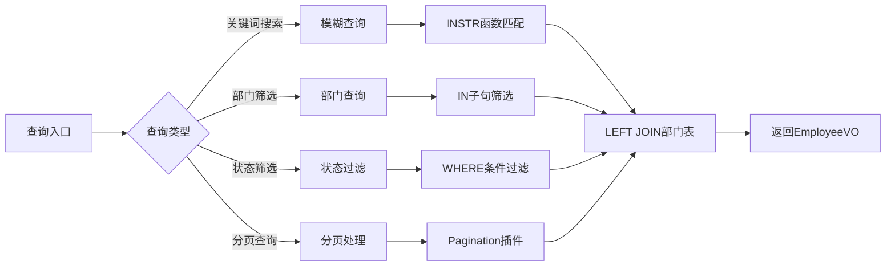

**图表来源**
- [EmployeeMapper.xml](file://smart-admin-api-java17-springboot3/sa-admin/src/main/resources/mapper/system/employee/EmployeeMapper.xml#L5-L34)

#### 部门员工查询

系统支持按部门查询员工信息，包括部门员工列表和员工数量统计。

#### 登录凭据查询

系统提供多种登录凭据的查询方式：
- 按登录名查询：`getByLoginName`
- 按手机号查询：`getByPhone`
- 按邮箱查询：`getByEmail`
- 按真实姓名查询：`getByActualName`

**节来源**
- [EmployeeMapper.xml](file://smart-admin-api-java17-springboot3/sa-admin/src/main/resources/mapper/system/employee/EmployeeMapper.xml#L1-L200)
- [EmployeeDao.java](file://smart-admin-api-java17-springboot3/sa-admin/src/main/java/net/lab1024/sa/admin/module/system/employee/dao/EmployeeDao.java#L24-L110)

## 登录认证机制

### 登录流程设计

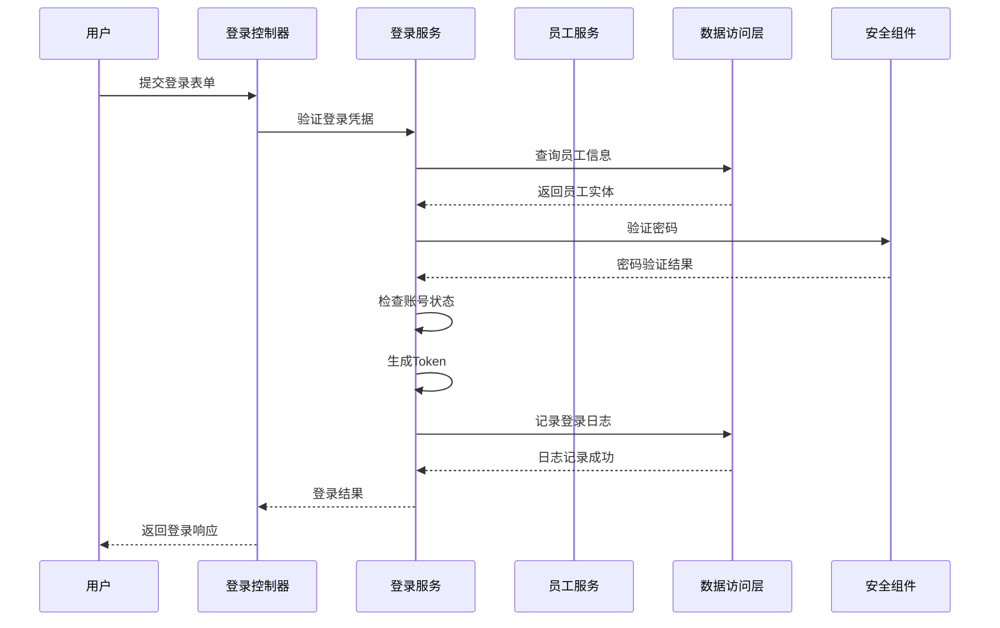

**图表来源**
- [LoginForm.java](file://smart-admin-api-java17-springboot3/sa-admin/src/main/java/net/lab1024/sa/admin/module/system/login/domain/LoginForm.java#L21-L39)

### 认证要素

登录系统支持多种认证要素：

1. **账号密码认证**：传统的用户名密码组合
2. **手机号认证**：通过手机号和验证码登录
3. **邮箱认证**：通过邮箱和验证码登录
4. **超级管理员认证**：具有特殊权限的管理员账户

**节来源**
- [LoginForm.java](file://smart-admin-api-java17-springboot3/sa-admin/src/main/java/net/lab1024/sa/admin/module/system/login/domain/LoginForm.java#L1-L40)

## 权限管理体系

### 角色-员工-菜单关联

员工表在角色-员工-菜单权限体系中处于核心地位，形成了完整的权限控制链：

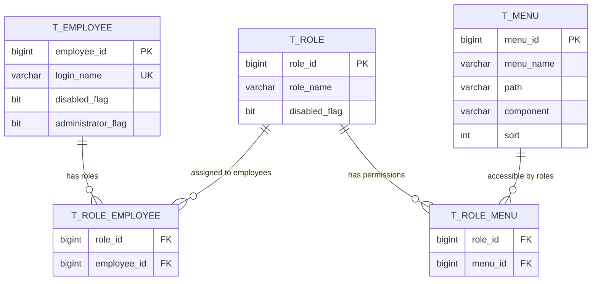

### 权限获取流程

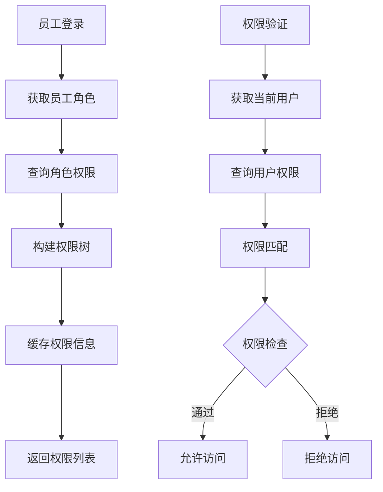

**节来源**
- [EmployeeVO.java](file://smart-admin-api-java17-springboot3/sa-admin/src/main/java/net/lab1024/sa/admin/module/system/employee/domain/vo/EmployeeVO.java#L53-L57)

## 数据流分析

### 员工数据流转

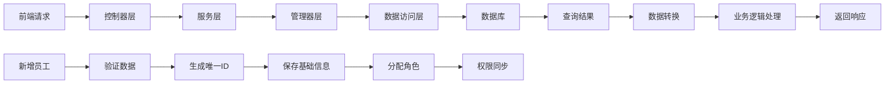

### 关联模块影响

员工表与其他模块存在密切关联：

1. **登录日志模块**：记录员工的登录行为
2. **操作日志模块**：记录员工的操作轨迹
3. **部门管理模块**：维护员工的部门归属
4. **岗位管理模块**：维护员工的岗位信息
5. **角色管理模块**：维护员工的角色权限

**节来源**
- [EmployeeEntity.java](file://smart-admin-api-java17-springboot3/sa-admin/src/main/java/net/lab1024/sa/admin/module/system/employee/domain/entity/EmployeeEntity.java#L1-L103)

## 总结

员工表（t_employee）作为Smart Admin系统的核心数据模型，具有以下特点：

### 核心特性
1. **完整性**：包含员工的基本信息、联系方式、状态管理等完整信息
2. **关联性**：与部门、岗位、角色等多个模块存在复杂关联关系
3. **安全性**：支持软删除、状态控制、密码加密等安全机制
4. **扩展性**：支持超级管理员、多角色等灵活的权限设计

### 设计优势
1. **规范化**：遵循数据库设计范式，避免数据冗余
2. **性能优化**：合理设置索引，支持高效的查询操作
3. **业务适配**：满足企业级应用的各种业务需求
4. **可维护性**：清晰的代码结构和完善的注释

### 应用价值
员工表不仅是系统的基础数据表，更是整个权限管理体系的基石，在企业信息化建设中发挥着不可替代的作用。通过合理的数据设计和完善的业务逻辑，确保了系统的稳定性、安全性和可扩展性。