# 菜单表结构详细数据模型文档

<cite>
**本文档引用的文件**
- [MenuEntity.java](file://smart-admin-api-java17-springboot3/sa-admin/src/main/java/net/lab1024.sa.admin/module/system/menu/domain/entity/MenuEntity.java)
- [MenuMapper.xml](file://smart-admin-api-java17-springboot3/sa-admin/src/main/resources/mapper/system/menu/MenuMapper.xml)
- [MenuTypeEnum.java](file://smart-admin-api-java17-springboot3/sa-admin/src/main/java/net/lab1024.sa.admin/module/system/menu/constant/MenuTypeEnum.java)
- [MenuPermsTypeEnum.java](file://smart-admin-api-java17-springboot3/sa-admin/src/main/java/net/lab1024.sa.admin/module/system/menu/constant/MenuPermsTypeEnum.java)
- [MenuService.java](file://smart-admin-api-java17-springboot3/sa-admin/src/main/java/net/lab1024.sa.admin/module/system/menu/service/MenuService.java)
- [RoleMenuEntity.java](file://smart-admin-api-java17-springboot3/sa-admin/src/main/java/net/lab1024.sa.admin/module/system/role/domain/entity/RoleMenuEntity.java)
- [menu-api.js](file://smart-admin-web-javascript/src/api/system/menu-api.js)
- [menu-data-handler.js](file://smart-admin-web-javascript/src/views/system/menu/menu-data-handler.js)
- [user.js](file://smart-admin-web-javascript/src/store/modules/system/user.js)
- [check_menu.sql](file://check_menu.sql)
- [query_menu_structure.sql](file://query_menu_structure.sql)
</cite>

## 目录
1. [简介](#简介)
2. [数据库表结构](#数据库表结构)
3. [MenuEntity实体类详解](#menuentity实体类详解)
4. [菜单类型枚举](#菜单类型枚举)
5. [权限类型枚举](#权限类型枚举)
6. [菜单树形结构构建](#菜单树形结构构建)
7. [数据库映射关系](#数据库映射关系)
8. [核心查询功能](#核心查询功能)
9. [前端路由生成机制](#前端路由生成机制)
10. [角色权限关联](#角色权限关联)
11. [总结](#总结)

## 简介

菜单表（t_menu）是Smart Admin系统的核心数据模型之一，负责管理系统的所有导航菜单结构。该表采用树形结构设计，通过parent_id字段实现多级菜单的层级关系，支持目录、菜单和功能点三种类型的菜单元素，为系统提供了灵活的权限控制和动态路由生成功能。

## 数据库表结构

### 表基本信息

| 字段名 | 类型 | 长度 | 允许NULL | 默认值 | 注释 |
|--------|------|------|----------|--------|------|
| menu_id | BIGINT | - | 否 | - | 菜单ID，主键，自增 |
| menu_name | VARCHAR | 30 | 否 | - | 菜单名称 |
| menu_type | INT | - | 否 | - | 菜单类型：1-目录，2-菜单，3-功能点 |
| parent_id | BIGINT | - | 否 | 0 | 父菜单ID，顶级菜单为0 |
| sort | INT | - | 是 | NULL | 显示顺序 |
| path | VARCHAR | 100 | 是 | NULL | 路由地址 |
| component | VARCHAR | 200 | 是 | NULL | 组件路径 |
| frame_flag | TINYINT | - | 否 | 0 | 是否为外链 |
| frame_url | VARCHAR | 200 | 是 | NULL | 外链地址 |
| cache_flag | TINYINT | - | 否 | 0 | 是否缓存 |
| visible_flag | TINYINT | - | 否 | 0 | 显示状态 |
| disabled_flag | TINYINT | - | 否 | 0 | 禁用状态 |
| perms_type | INT | - | 是 | NULL | 权限类型 |
| web_perms | VARCHAR | 100 | 是 | NULL | 前端权限字符串 |
| api_perms | VARCHAR | 100 | 是 | NULL | 后端权限字符串 |
| icon | VARCHAR | 50 | 是 | NULL | 菜单图标 |
| context_menu_id | BIGINT | - | 是 | NULL | 功能点关联菜单ID |
| deleted_flag | TINYINT | - | 否 | 0 | 删除状态 |
| create_time | DATETIME | - | 是 | NULL | 创建时间 |
| create_user_id | BIGINT | - | 是 | NULL | 创建人 |
| update_time | DATETIME | - | 是 | NULL | 更新时间 |
| update_user_id | BIGINT | - | 是 | NULL | 更新人 |

**节来源**
- [MenuEntity.java](file://smart-admin-api-java17-springboot3/sa-admin/src/main/java/net/lab1024.sa.admin/module/system/menu/domain/entity/MenuEntity.java#L20-L137)

## MenuEntity实体类详解

### 核心字段定义

MenuEntity类是菜单表在Java中的ORM映射实体，包含了菜单表的所有字段定义和注解配置。

#### 主键字段
- **menuId**: 菜单唯一标识符，使用MyBatis-Plus的@TableId注解配置为主键，采用AUTO自增策略

#### 基础信息字段
- **menuName**: 菜单名称，最大长度30字符，必填项
- **menuType**: 菜单类型，关联MenuTypeEnum枚举，决定菜单的显示行为
- **parentId**: 父菜单ID，通过parent_id建立树形层级关系，顶级菜单parentId为0

#### 路由配置字段
- **path**: 路由地址，用于前端路由匹配
- **component**: 组件路径，指定Vue组件位置
- **frameFlag**: 外链标志，布尔值，决定是否为外部链接
- **frameUrl**: 外链地址，当frameFlag为true时有效

#### 显示控制字段
- **sort**: 排序字段，数值越小优先级越高
- **visibleFlag**: 显示状态，控制菜单在界面中的可见性
- **disabledFlag**: 禁用状态，控制菜单的功能可用性
- **cacheFlag**: 缓存标志，决定组件是否缓存

#### 权限控制字段
- **permsType**: 权限类型，目前支持Sa-Token模式
- **webPerms**: 前端权限字符串，用于前端权限验证
- **apiPerms**: 后端权限字符串，用于API接口权限验证
- **icon**: 菜单图标，支持图标库名称

#### 关联字段
- **contextMenuId**: 功能点关联菜单ID，用于功能点与菜单的关联关系
- **deletedFlag**: 逻辑删除标志，软删除实现

**节来源**
- [MenuEntity.java](file://smart-admin-api-java17-springboot3/sa-admin/src/main/java/net/lab1024.sa.admin/module/system/menu/domain/entity/MenuEntity.java#L27-L115)

## 菜单类型枚举

### MenuTypeEnum枚举定义

菜单类型枚举定义了三种基本的菜单类型，每种类型在系统中具有不同的显示和功能特性：

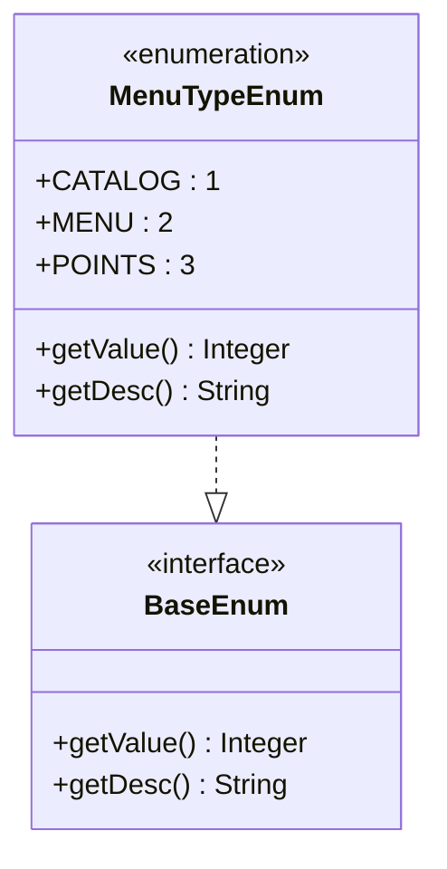

**图表来源**
- [MenuTypeEnum.java](file://smart-admin-api-java17-springboot3/sa-admin/src/main/java/net/lab1024.sa.admin/module/system/menu/constant/MenuTypeEnum.java#L15-L48)

#### 枚举常量说明

| 常量名 | 值 | 描述 | 用途 |
|--------|----|----- |------|
| CATALOG | 1 | 目录 | 用于组织菜单的容器，不可直接访问，只显示为分组标题 |
| MENU | 2 | 菜单 | 可访问的具体页面，具有完整的路由和组件配置 |
| POINTS | 3 | 功能点 | 最小粒度的权限单元，通常用于按钮级别的权限控制 |

### 类型特性对比

| 特性 | 目录(CATALOG) | 菜单(MENU) | 功能点(POINTS) |
|------|---------------|------------|----------------|
| 是否可访问 | 否 | 是 | 是 |
| 是否有路由 | 否 | 是 | 是 |
| 是否有组件 | 否 | 是 | 否 |
| 子菜单限制 | 无 | 无 | 无 |
| 权限控制 | 间接 | 直接 | 直接 |

**节来源**
- [MenuTypeEnum.java](file://smart-admin-api-java17-springboot3/sa-admin/src/main/java/net/lab1024.sa.admin/module/system/menu/constant/MenuTypeEnum.java#L15-L48)

## 权限类型枚举

### MenuPermsTypeEnum枚举定义

权限类型枚举目前仅支持Sa-Token权限验证模式，为系统的权限控制提供基础支持。

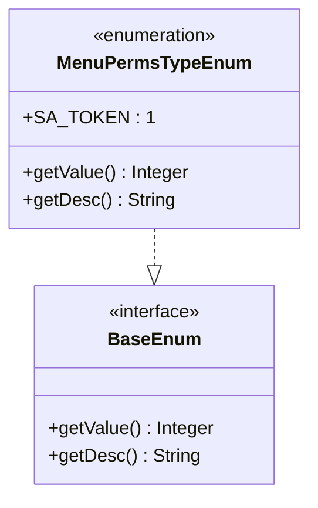

**图表来源**
- [MenuPermsTypeEnum.java](file://smart-admin-api-java17-springboot3/sa-admin/src/main/java/net/lab1024.sa.admin/module/system/menu/constant/MenuPermsTypeEnum.java#L15-L42)

#### 当前支持的权限模式

| 常量名 | 值 | 描述 | 应用场景 |
|--------|----|----- |----------|
| SA_TOKEN | 1 | Sa-Token模式 | 基于Token的身份认证和权限验证 |

**节来源**
- [MenuPermsTypeEnum.java](file://smart-admin-api-java17-springboot3/sa-admin/src/main/java/net/lab1024.sa.admin/module/system/menu/constant/MenuPermsTypeEnum.java#L15-L42)

## 菜单树形结构构建

### 树形结构原理

菜单表通过parent_id字段实现了标准的树形数据结构，每个节点可以有多个子节点，形成层次化的菜单体系。

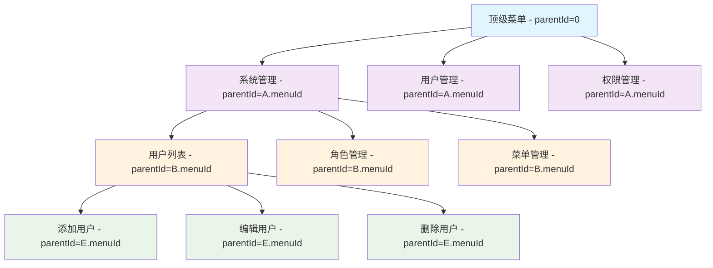

### 后端树形构建算法

MenuService中的buildMenuTree方法实现了高效的树形结构构建：

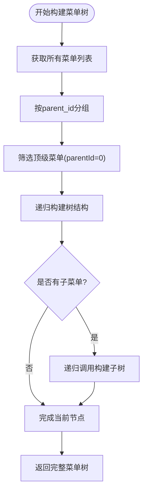

**图表来源**
- [MenuService.java](file://smart-admin-api-java17-springboot3/sa-admin/src/main/java/net/lab1024.sa.admin/module/system/menu/service/MenuService.java#L198-L211)

### 前端树形构建

前端通过JavaScript实现了类似的树形结构构建逻辑：

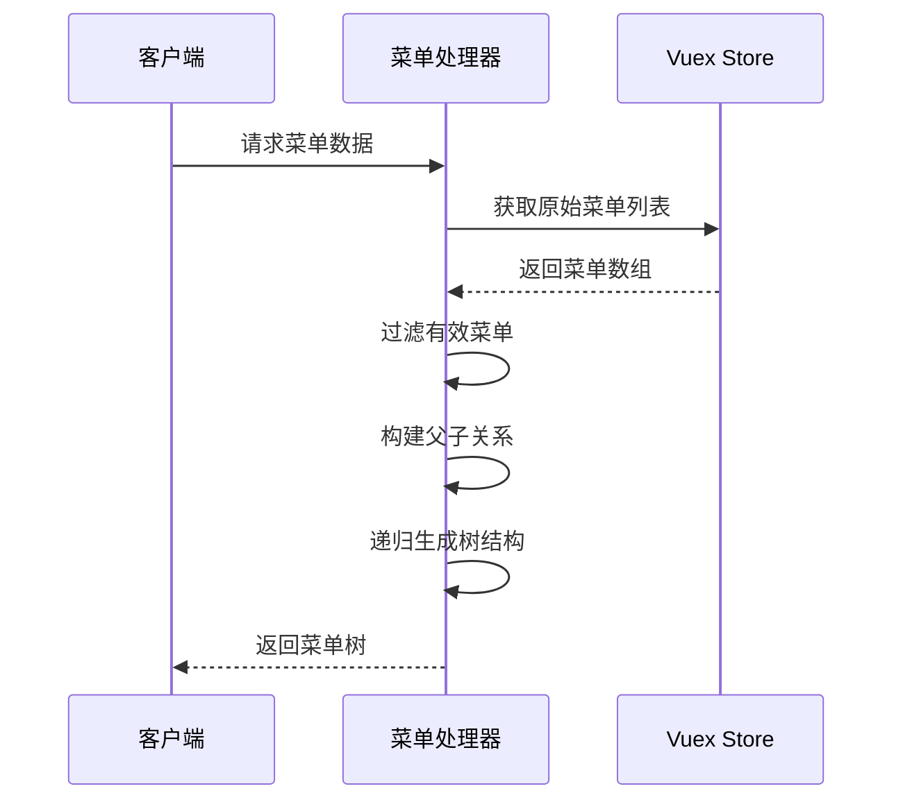

**图表来源**
- [menu-data-handler.js](file://smart-admin-web-javascript/src/views/system/menu/menu-data-handler.js#L48-L99)
- [user.js](file://smart-admin-web-javascript/src/store/modules/system/user.js#L322-L363)

**节来源**
- [MenuService.java](file://smart-admin-api-java17-springboot3/sa-admin/src/main/java/net/lab1024.sa.admin/module/system/menu/service/MenuService.java#L186-L211)
- [menu-data-handler.js](file://smart-admin-web-javascript/src/views/system/menu/menu-data-handler.js#L48-L99)

## 数据库映射关系

### MyBatis-Plus映射配置

MenuEntity通过@Table注解与数据库表建立了完整的映射关系：

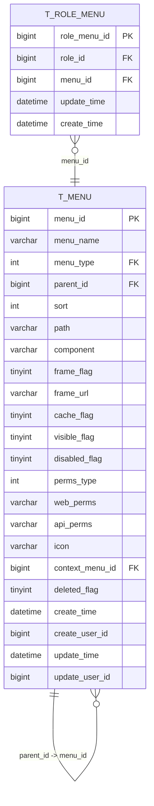

**图表来源**
- [MenuEntity.java](file://smart-admin-api-java17-springboot3/sa-admin/src/main/java/net/lab1024.sa.admin/module/system/menu/domain/entity/MenuEntity.java#L21)
- [RoleMenuEntity.java](file://smart-admin-api-java17-springboot3/sa-admin/src/main/java/net/lab1024.sa.admin/module/system/role/domain/entity/RoleMenuEntity.java#L20)

### 核心查询语句分析

MenuMapper.xml中包含了多种核心查询功能：

#### 菜单查询功能

| 查询方法 | 功能描述 | 关键参数 | 返回类型 |
|----------|----------|----------|----------|
| queryMenuList | 查询菜单列表 | deletedFlag, disabledFlag, menuTypeList | List<MenuVO> |
| getByMenuName | 根据菜单名称查询 | menuName, parentId, deletedFlag | MenuEntity |
| queryMenuByEmployeeId | 根据员工查询菜单 | employeeId, disabledFlag, deletedFlag | List<MenuVO> |
| getByWebPerms | 根据权限字符串查询 | webPerms, deletedFlag | MenuEntity |

#### 权限过滤查询

系统通过多维度的权限过滤实现精细化的菜单控制：

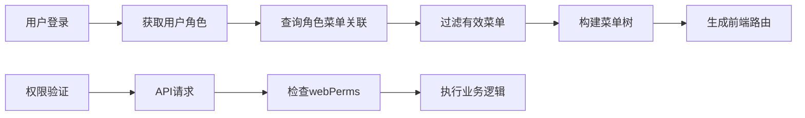

**图表来源**
- [MenuMapper.xml](file://smart-admin-api-java17-springboot3/sa-admin/src/main/resources/mapper/system/menu/MenuMapper.xml#L24-L78)

**节来源**
- [MenuMapper.xml](file://smart-admin-api-java17-springboot3/sa-admin/src/main/resources/mapper/system/menu/MenuMapper.xml#L1-L78)

## 核心查询功能

### 菜单权限过滤机制

系统实现了多层次的菜单权限过滤机制，确保用户只能看到和访问被授权的菜单内容。

#### 后端权限过滤

MenuService提供了多种权限过滤方法：

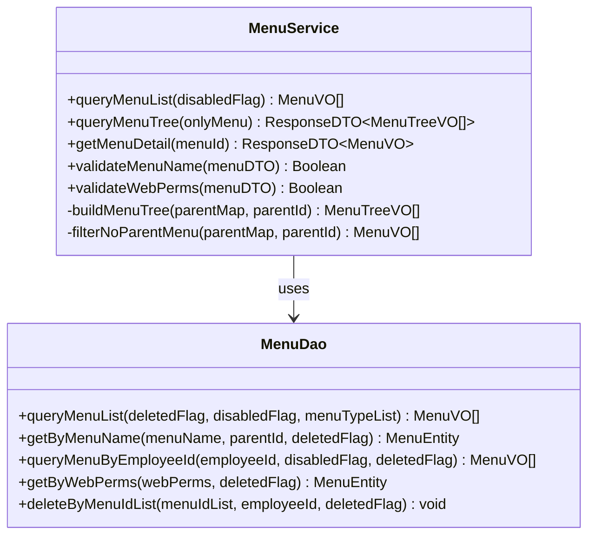

**图表来源**
- [MenuService.java](file://smart-admin-api-java17-springboot3/sa-admin/src/main/java/net/lab1024.sa.admin/module/system/menu/service/MenuService.java#L36-L238)

#### 前端权限过滤

前端通过菜单处理器实现了客户端的权限过滤：

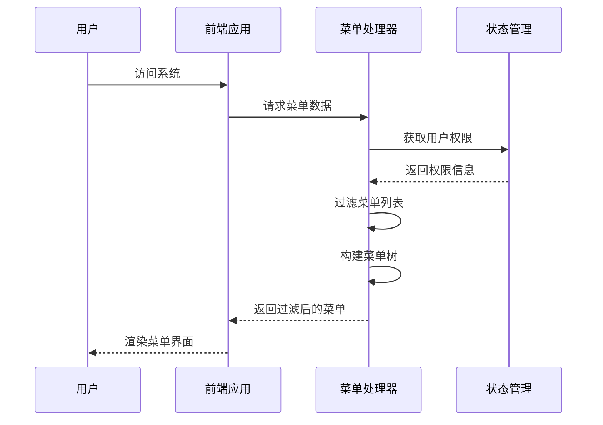

**图表来源**
- [menu-data-handler.js](file://smart-admin-web-javascript/src/views/system/menu/menu-data-handler.js#L1-L54)

### 菜单查询优化

系统通过多种查询优化策略提升性能：

| 优化策略 | 实现方式 | 性能提升 |
|----------|----------|----------|
| 分组查询 | 按parent_id分组减少循环次数 | O(n) → O(log n) |
| 条件过滤 | 多维度条件过滤减少数据传输 | 减少网络开销 |
| 缓存机制 | Vuex状态缓存菜单数据 | 避免重复请求 |
| 懒加载 | 按需加载子菜单数据 | 提升初始加载速度 |

**节来源**
- [MenuService.java](file://smart-admin-api-java17-springboot3/sa-admin/src/main/java/net/lab1024.sa.admin/module/system/menu/service/MenuService.java#L157-L211)
- [menu-data-handler.js](file://smart-admin-web-javascript/src/views/system/menu/menu-data-handler.js#L1-L54)

## 前端路由生成机制

### 动态路由架构

Smart Admin系统采用动态路由架构，菜单数据驱动前端路由生成：

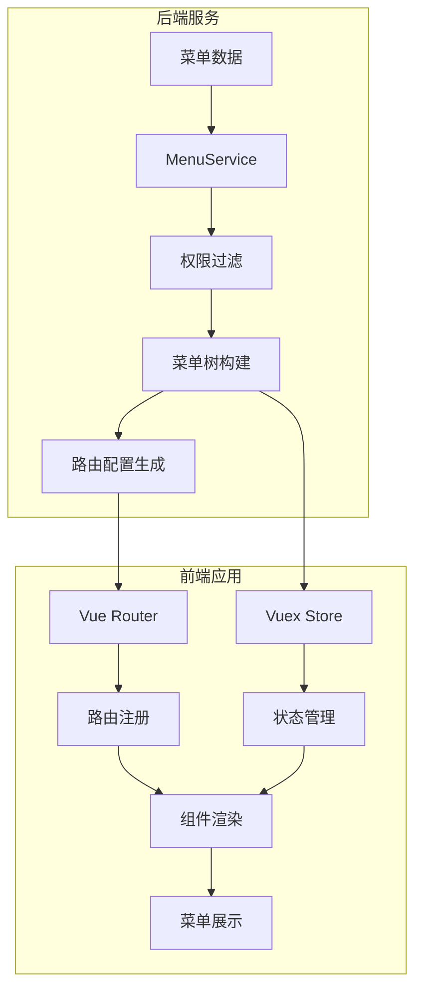

**图表来源**
- [menu-api.js](file://smart-admin-web-javascript/src/api/system/menu-api.js#L1-L55)

### 路由生成流程

前端路由生成遵循以下流程：

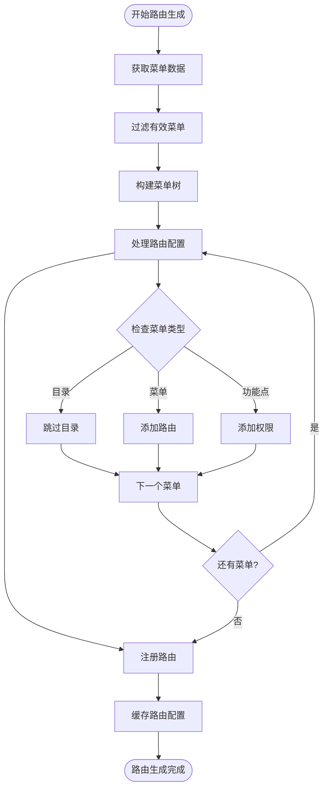

**图表来源**
- [user.js](file://smart-admin-web-javascript/src/store/modules/system/user.js#L322-L363)

### 路由配置示例

系统会根据菜单配置自动生成对应的路由规则：

| 菜单类型 | 路由配置 | 示例 |
|----------|----------|------|
| 目录 | 无路由配置 | 仅作为菜单分组 |
| 菜单 | 完整路由配置 | path: "/system/user", component: "System/User/index.vue" |
| 功能点 | 权限字符串 | webPerms: "system:user:add" |

**节来源**
- [menu-api.js](file://smart-admin-web-javascript/src/api/system/menu-api.js#L1-L55)
- [user.js](file://smart-admin-web-javascript/src/store/modules/system/user.js#L322-L363)

## 角色权限关联

### 多对多关系设计

菜单系统与角色系统通过中间表t_role_menu建立了多对多的权限关联关系：

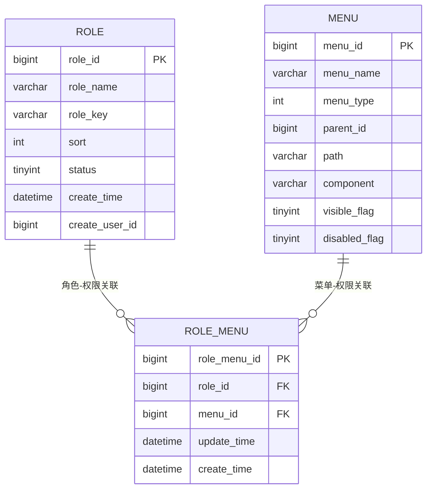

**图表来源**
- [RoleMenuEntity.java](file://smart-admin-api-java17-springboot3/sa-admin/src/main/java/net/lab1024.sa.admin/module/system/role/domain/entity/RoleMenuEntity.java#L19-L50)

### 权限继承机制

角色菜单关联实现了基于角色的权限继承：

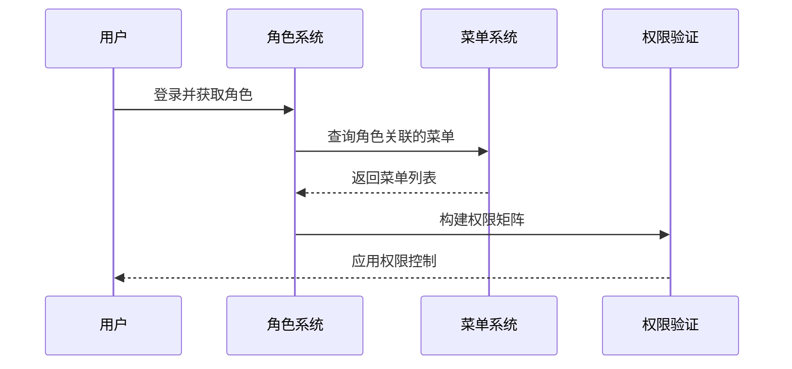

### 权限验证流程

系统实现了多层次的权限验证机制：

| 验证层级 | 验证内容 | 实现方式 |
|----------|----------|----------|
| 菜单级别 | 菜单可见性 | visibleFlag, disabledFlag |
| 路由级别 | 路由访问权限 | webPerms权限字符串 |
| API级别 | 接口访问权限 | apiPerms权限字符串 |
| 功能级别 | 按钮操作权限 | 功能点权限验证 |

**节来源**
- [RoleMenuEntity.java](file://smart-admin-api-java17-springboot3/sa-admin/src/main/java/net/lab1024.sa.admin/module/system/role/domain/entity/RoleMenuEntity.java#L19-L50)

## 总结

Smart Admin的菜单表结构设计体现了现代Web应用权限管理的最佳实践：

### 核心优势

1. **灵活的树形结构**：通过parent_id字段实现标准的树形数据结构，支持无限层级的菜单组织
2. **清晰的权限分离**：菜单类型区分目录、菜单和功能点，实现不同粒度的权限控制
3. **前后端协同**：数据库权限过滤与前端路由生成紧密结合，确保权限控制的一致性
4. **高性能查询**：通过分组查询、条件过滤等优化策略，提升大数据量下的查询性能
5. **扩展性强**：基于枚举的设计便于功能扩展，支持多种权限验证模式

### 应用价值

该菜单系统为Smart Admin提供了完整的权限管理体系，支撑了复杂业务场景下的权限控制需求，同时保持了良好的开发体验和维护性。通过标准化的数据模型和清晰的职责分工，为系统的稳定运行和功能扩展奠定了坚实的基础。