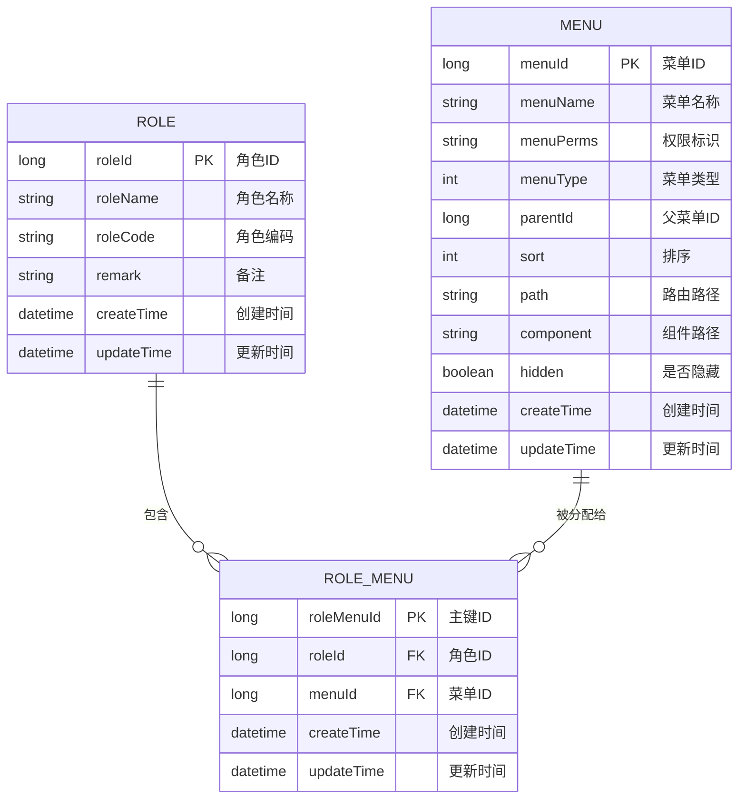
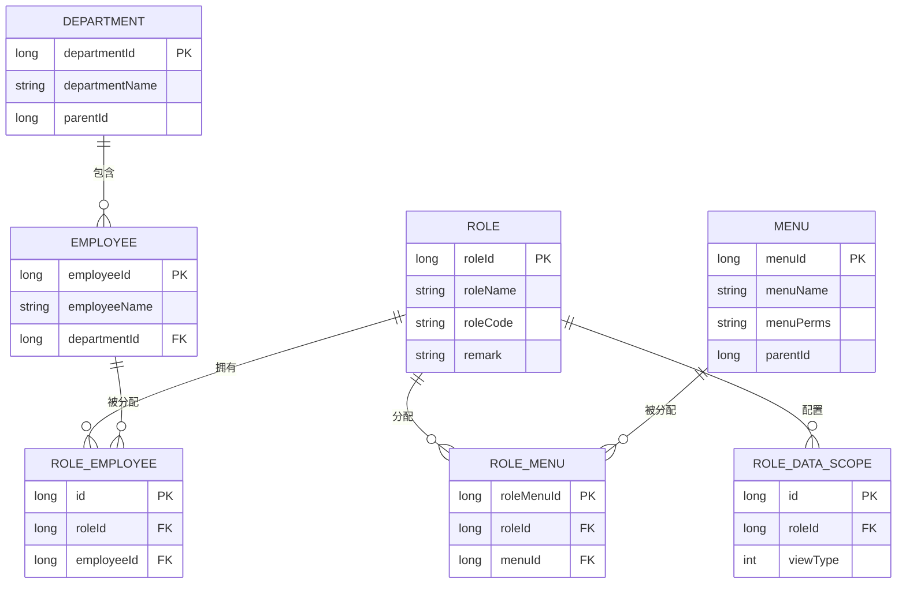

# 角色表结构

<cite>
**本文档引用的文件**
- [RoleEntity.java](file://smart-admin-api-java17-springboot3\sa-admin\src\main\java\net\lab1024\sa\admin\module\system\role\domain\entity\RoleEntity.java)
- [RoleMapper.xml](file://smart-admin-api-java17-springboot3\sa-admin\src\main\resources\mapper\system\role\RoleMapper.xml)
- [RoleMenuEntity.java](file://smart-admin-api-java17-springboot3\sa-admin\src\main\java\net\lab1024\sa\admin\module\system\role\domain\entity\RoleMenuEntity.java)
- [RoleMenuMapper.xml](file://smart-admin-api-java17-springboot3\sa-admin\src\main\resources\mapper\system\role\RoleMenuMapper.xml)
- [RoleDataScopeEntity.java](file://smart-admin-api-java17-springboot3\sa-admin\src\main\java\net\lab1024\sa\admin\module\system\role\domain\entity\RoleDataScopeEntity.java)
- [DataScopeTypeEnum.java](file://smart-admin-api-java17-springboot3\sa-admin\src\main\java\net\lab1024\sa\admin\module\system\datascope\constant\DataScopeTypeEnum.java)
- [DataScopeViewTypeEnum.java](file://smart-admin-api-java17-springboot3\sa-admin\src\main\java\net\lab1024\sa\admin\module\system\datascope\constant\DataScopeViewTypeEnum.java)
- [RoleEmployeeEntity.java](file://smart-admin-api-java17-springboot3\sa-admin\src\main\java\net\lab1024\sa\admin\module\system\role\domain\entity\RoleEmployeeEntity.java)
- [MenuEntity.java](file://smart-admin-api-java17-springboot3\sa-admin\src\main\java\net\lab1024\sa\admin\module\system\menu\domain\entity\MenuEntity.java)
</cite>

## 目录
1. [引言](#引言)
2. [角色表核心实体与字段](#角色表核心实体与字段)
3. [角色与菜单的多对多关系](#角色与菜单的多对多关系)
4. [角色与员工的关联机制](#角色与员工的关联机制)
5. [数据权限(data_scope)实现原理](#数据权限data_scope实现原理)
6. [关键SQL操作分析](#关键sql操作分析)
7. [角色表ER图](#角色表er图)
8. [总结](#总结)

## 引言
本文档详细阐述了智能管理系统中角色表（t_role）的数据模型设计，重点分析了RoleEntity实体类与数据库表的映射关系。文档深入探讨了角色在权限控制体系中的核心作用，包括其与菜单、员工、部门等模块的复杂关联。通过分析核心字段定义、多对多关系实现机制以及数据权限的处理逻辑，全面展示了该权限系统的架构设计与实现细节。

## 角色表核心实体与字段

角色表（t_role）是权限控制系统的核心，其对应的Java实体类为RoleEntity。该实体类通过MyBatis-Plus的注解与数据库表进行映射。

**核心字段定义与业务含义：**

- **role_id (roleId)**: 主键ID，由数据库自动生成（`@TableId(type = IdType.AUTO)`）。这是角色的唯一标识符，所有与角色相关的关联关系（如角色-菜单、角色-员工）都以此ID作为外键。
- **role_name (roleName)**: 角色名称，用于在系统中显示和区分不同角色（如"系统管理员"、"部门经理"）。此字段是业务上识别角色的主要依据。
- **role_key (roleCode)**: 角色编码，在代码中用于权限校验的唯一标识符。它通常是一个简洁的英文字符串（如"ADMIN"、"MANAGER"），便于在代码逻辑中进行判断。
- **sort**: 在提供的RoleEntity.java文件中，未直接包含`sort`字段。根据项目命名惯例和权限系统设计，排序字段可能存在于其他相关实体或数据库表中，用于控制角色在列表中的显示顺序。
- **data_scope**: 在提供的RoleEntity.java文件中，未直接包含`data_scope`字段。数据范围的配置是通过独立的`t_role_data_scope`表来实现的，实现了数据权限与角色基本信息的解耦，提供了更高的灵活性。

**Section sources**
- [RoleEntity.java](file://smart-admin-api-java17-springboot3\sa-admin\src\main\java\net\lab1024\sa\admin\module\system\role\domain\entity\RoleEntity.java#L21-L52)

## 角色与菜单的多对多关系

系统中角色与菜单的权限分配通过一个中间表`t_role_menu`来实现，这是一种标准的多对多关系设计模式。

**实现机制：**

1.  **中间表 (t_role_menu)**: 该表记录了每一个“角色-菜单”的权限分配关系。其对应的实体类为`RoleMenuEntity`。
2.  **实体类 (RoleMenuEntity)**:
    - `roleId`: 外键，关联到`t_role`表的`role_id`。
    - `menuId`: 外键，关联到`t_menu`表的`menu_id`。
    - 每一条记录代表一个角色对一个菜单的访问权限。
3.  **权限分配**: 当为某个角色分配菜单权限时，系统会先删除该角色在`t_role_menu`表中的所有旧记录，然后将新选中的菜单ID列表与该角色ID组合，批量插入到`t_role_menu`表中。
4.  **权限查询**: 当需要获取某个角色的菜单权限时，系统会执行查询，从`t_role_menu`表中找出所有`role_id`匹配的记录，并获取其对应的`menu_id`列表。



**Diagram sources**
- [RoleMenuEntity.java](file://smart-admin-api-java17-springboot3\sa-admin\src\main\java\net\lab1024\sa\admin\module\system\role\domain\entity\RoleMenuEntity.java#L21-L48)
- [MenuEntity.java](file://smart-admin-api-java17-springboot3\sa-admin\src\main\java\net\lab1024\sa\admin\module\system\menu\domain\entity\MenuEntity.java)

**Section sources**
- [RoleMenuEntity.java](file://smart-admin-api-java17-springboot3\sa-admin\src\main\java\net\lab1024\sa\admin\module\system\role\domain\entity\RoleMenuEntity.java#L21-L48)

## 角色与员工的关联机制

角色与员工之间的关系同样通过一个中间表`t_role_employee`来维护，这允许一个员工拥有多个角色，一个角色也可以被分配给多个员工。

**实现机制：**

1.  **中间表 (t_role_employee)**: 该表记录了每一个“员工-角色”的分配关系。其对应的实体类为`RoleEmployeeEntity`。
2.  **实体类 (RoleEmployeeEntity)**:
    - `roleId`: 外键，关联到`t_role`表的`role_id`。
    - `employeeId`: 外键，关联到`t_employee`表的`employee_id`。
    - 每一条记录代表一个员工被赋予了一个特定的角色。
3.  **权限继承**: 员工所拥有的权限是其所有被分配角色的权限的并集。当系统进行权限校验时，会先查询该员工关联的所有角色ID，再通过这些角色ID去查询其对应的菜单权限和数据权限。

**Section sources**
- [RoleEmployeeEntity.java](file://smart-admin-api-java17-springboot3\sa-admin\src\main\java\net\lab1024\sa\admin\module\system\role\domain\entity\RoleEmployeeEntity.java#L19-L41)

## 数据权限(data_scope)实现原理

系统的数据权限控制是通过`DataScopeViewTypeEnum`枚举和`t_role_data_scope`表来实现的，它定义了角色可以访问哪些范围的数据。

**实现原理：**

1.  **数据范围类型 (DataScopeViewTypeEnum)**: 该枚举定义了四种数据可见范围：
    - **ME (0)**: 仅限本人。用户只能查看和操作自己的数据。
    - **DEPARTMENT (1)**: 本部门。用户可以查看和操作其所在部门的所有数据。
    - **DEPARTMENT_AND_SUB (2)**: 本部门及下属子部门。用户可以查看和操作其所在部门及其所有下级部门的数据。
    - **ALL (10)**: 全部。用户可以查看和操作系统中的所有数据。
2.  **数据范围配置表 (t_role_data_scope)**: 该表将角色与数据范围类型关联起来。其对应的实体类为`RoleDataScopeEntity`。
    - `roleId`: 外键，关联到`t_role`表。
    - `viewType`: 存储`DataScopeViewTypeEnum`的值（0, 1, 2, 10），表示该角色的数据范围。
3.  **处理逻辑**: 当一个用户发起数据查询请求时，系统会：
    - 获取该用户的所有角色。
    - 查询这些角色对应的数据范围类型（`viewType`）。
    - 根据最高的数据范围级别（通过`level`字段比较）来确定最终的数据过滤策略。
    - 在生成的SQL查询中动态添加`WHERE`子句，例如，如果范围是"本部门"，则添加`WHERE department_id = ?`；如果是"本人"，则添加`WHERE employee_id = ?`。

**Section sources**
- [RoleDataScopeEntity.java](file://smart-admin-api-java17-springboot3\sa-admin\src\main\java\net\lab1024\sa\admin\module\system\role\domain\entity\RoleDataScopeEntity.java#L21-L53)
- [DataScopeViewTypeEnum.java](file://smart-admin-api-java17-springboot3\sa-admin\src\main\java\net\lab1024\sa\admin\module\system\datascope\constant\DataScopeViewTypeEnum.java#L16-L36)

## 关键SQL操作分析

通过分析`RoleMapper.xml`和`RoleMenuMapper.xml`中的SQL语句，可以了解关键操作的实现。

**角色权限分配 (RoleMenuMapper.xml)**:
```xml
<delete id="deleteByRoleId">
    delete from t_role_menu where role_id = #{roleId}
</delete>
```
此SQL在分配新权限前，先清空该角色原有的所有菜单权限，确保权限的准确性。

**权限校验与查询 (RoleMapper.xml)**:
```xml
<select id="getByRoleName" resultMap="RoleEntity">
    SELECT * FROM t_role WHERE role_name = #{roleName}
</select>
```
此SQL用于根据角色名称查询角色信息，常用于权限校验或角色管理界面的数据加载。

**Section sources**
- [RoleMapper.xml](file://smart-admin-api-java17-springboot3\sa-admin\src\main\resources\mapper\system\role\RoleMapper.xml#L9-L13)
- [RoleMenuMapper.xml](file://smart-admin-api-java17-springboot3\sa-admin\src\main\resources\mapper\system\role\RoleMenuMapper.xml#L4-L7)

## 角色表ER图

以下ER图展示了角色表在整体权限控制体系中的核心作用及其与相关模块的复杂关联。



**Diagram sources**
- [RoleEntity.java](file://smart-admin-api-java17-springboot3\sa-admin\src\main\java\net\lab1024\sa\admin\module\system\role\domain\entity\RoleEntity.java)
- [RoleMenuEntity.java](file://smart-admin-api-java17-springboot3\sa-admin\src\main\java\net\lab1024\sa\admin\module\system\role\domain\entity\RoleMenuEntity.java)
- [RoleDataScopeEntity.java](file://smart-admin-api-java17-springboot3\sa-admin\src\main\java\net\lab1024\sa\admin\module\system\role\domain\entity\RoleDataScopeEntity.java)
- [RoleEmployeeEntity.java](file://smart-admin-api-java17-springboot3\sa-admin\src\main\java\net\lab1024\sa\admin\module\system\role\domain\entity\RoleEmployeeEntity.java)
- [MenuEntity.java](file://smart-admin-api-java17-springboot3\sa-admin\src\main\java\net\lab1024\sa\admin\module\system\menu\domain\entity\MenuEntity.java)

## 总结
角色表（t_role）作为权限控制系统的核心，通过与`t_role_menu`、`t_role_employee`和`t_role_data_scope`等中间表的关联，构建了一个灵活、可扩展的权限管理模型。该设计实现了功能权限（菜单）与数据权限的分离，支持复杂的多对多关系，为系统的安全性和可维护性提供了坚实的基础。