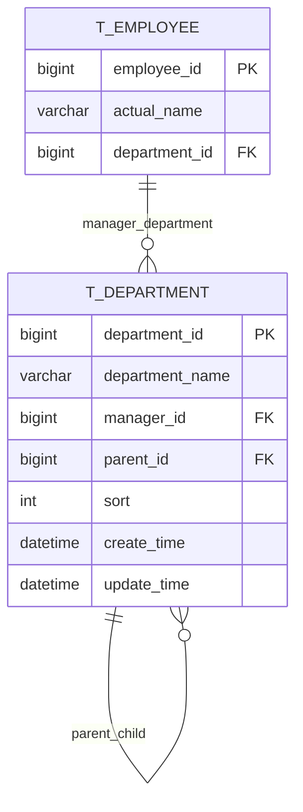
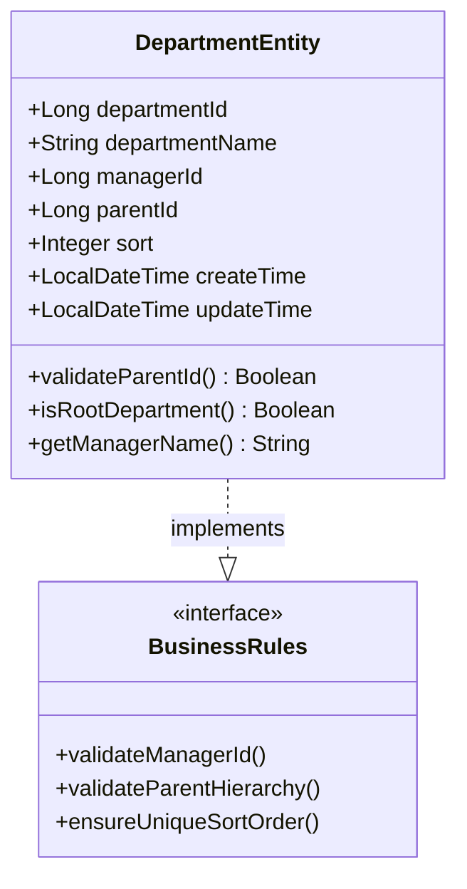
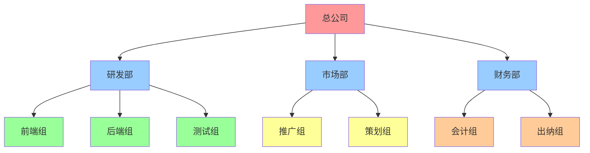
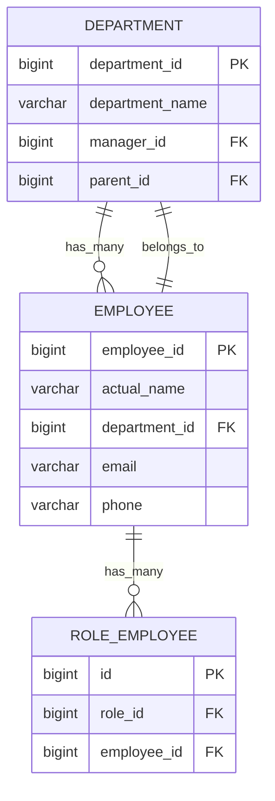
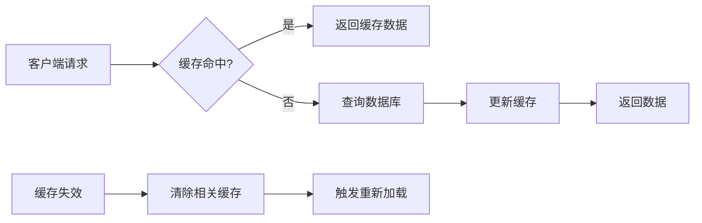
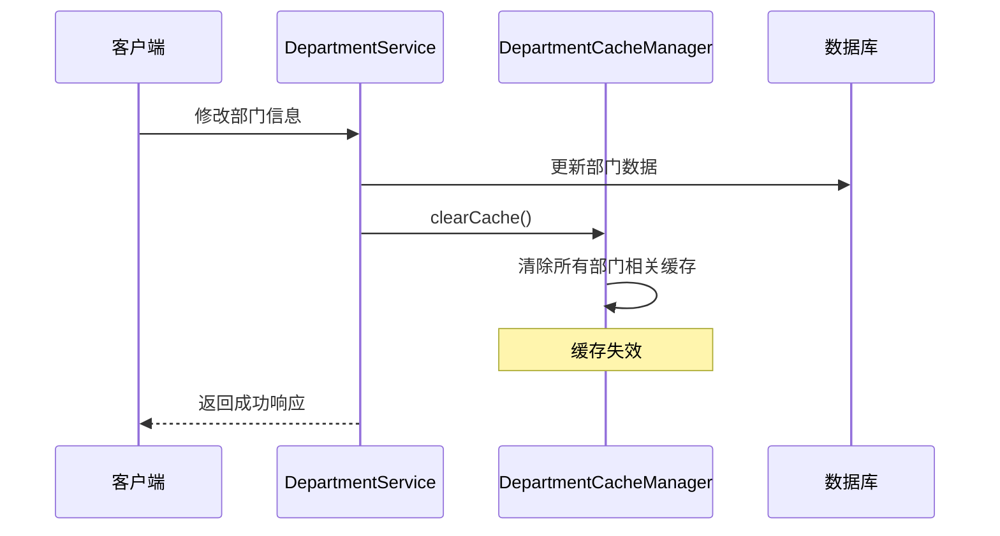
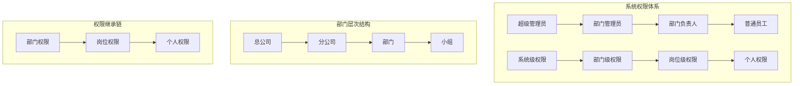
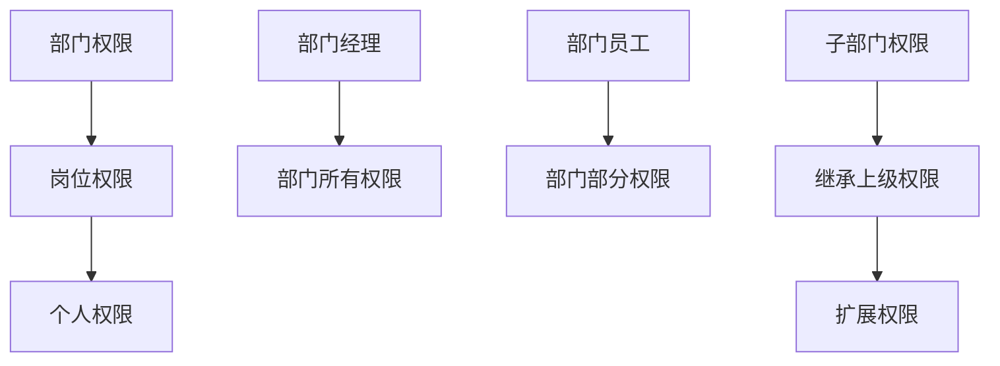

# 部门表结构详细数据模型文档

<cite>
**本文档引用的文件**
- [DepartmentEntity.java](file://smart-admin-api-java17-springboot3/sa-admin/src/main/java/net/lab1024.sa.admin/module/system/department/domain/entity/DepartmentEntity.java)
- [DepartmentMapper.xml](file://smart-admin-api-java17-springboot3/sa-admin/src/main/resources/mapper/system/department/DepartmentMapper.xml)
- [DepartmentCacheManager.java](file://smart-admin-api-java17-springboot3/sa-admin/src/main/java/net/lab1024.sa.admin/module/system/department/manager/DepartmentCacheManager.java)
- [DepartmentDao.java](file://smart-admin-api-java17-springboot3/sa-admin/src/main/java/net/lab1024.sa.admin/module/system/department/dao/DepartmentDao.java)
- [DepartmentTreeVO.java](file://smart-admin-api-java17-springboot3/sa-admin/src/main/java/net/lab1024.sa.admin/module/system/department/domain/vo/DepartmentTreeVO.java)
- [DepartmentVO.java](file://smart-admin-api-java17-springboot3/sa-admin/src/main/java/net/lab1024.sa.admin/module/system/department/domain/vo/DepartmentVO.java)
- [AdminCacheConst.java](file://smart-admin-api-java17-springboot3/sa-admin/src/main/java/net/lab1024.sa.admin/constant/AdminCacheConst.java)
</cite>

## 目录
1. [简介](#简介)
2. [数据库表结构设计](#数据库表结构设计)
3. [DepartmentEntity实体类详解](#departmententity实体类详解)
4. [部门树形结构实现机制](#部门树形结构实现机制)
5. [部门与员工关系映射](#部门与员工关系映射)
6. [DepartmentMapper查询语句分析](#departmentmapper查询语句分析)
7. [DepartmentCacheManager缓存策略](#departmentcachemanager缓存策略)
8. [部门表在系统权限体系中的位置](#部门表在系统权限体系中的位置)
9. [性能优化与最佳实践](#性能优化与最佳实践)
10. [总结](#总结)

## 简介

部门表（t_department）是Smart Admin系统的核心基础数据表之一，采用标准的树形结构设计，支持无限层级的部门组织架构。该表不仅存储部门的基本信息，还通过parent_id字段构建了完整的部门层次关系，并与员工表建立了负责人的关联关系，为系统的权限管理体系提供了基础支撑。

## 数据库表结构设计

### 表名与字段定义

部门表采用MySQL数据库设计，包含以下核心字段：

| 字段名 | 类型 | 约束 | 业务含义 |
|--------|------|------|----------|
| department_id | BIGINT | PRIMARY KEY, AUTO_INCREMENT | 部门主键ID，自增标识 |
| department_name | VARCHAR(50) | NOT NULL | 部门名称，最大50字符 |
| manager_id | BIGINT | NULLABLE | 部门负责人ID，外键关联员工表 |
| parent_id | BIGINT | NULLABLE | 父部门ID，NULL表示顶级部门 |
| sort | INT | DEFAULT 0 | 排序权重，数值越大越靠前 |
| create_time | DATETIME | DEFAULT CURRENT_TIMESTAMP | 创建时间 |
| update_time | DATETIME | DEFAULT CURRENT_TIMESTAMP ON UPDATE CURRENT_TIMESTAMP | 更新时间 |

### 约束与索引设计



**图表来源**
- [DepartmentEntity.java](file://smart-admin-api-java17-springboot3/sa-admin/src/main/java/net/lab1024.sa.admin/module/system/department/domain/entity/DepartmentEntity.java#L22-L65)

**节来源**
- [DepartmentEntity.java](file://smart-admin-api-java17-springboot3/sa-admin/src/main/java/net/lab1024.sa.admin/module/system/department/domain/entity/DepartmentEntity.java#L1-L66)

## DepartmentEntity实体类详解

### 核心字段定义

DepartmentEntity作为MyBatis的实体类，通过注解实现了与数据库表的完整映射：

#### 主键字段
- **departmentId**: 使用`@TableId(type = IdType.AUTO)`注解，自动增长的主键字段

#### 必填字段
- **departmentName**: 部门名称，用于显示和识别
- **parentId**: 父部门ID，null表示顶级部门，形成树形结构的基础

#### 关键业务字段
- **managerId**: 负责人ID，使用`@TableField(updateStrategy = FieldStrategy.NEVER)`确保该字段只能在创建时设置，不能被更新

#### 排序字段
- **sort**: 整数类型的排序字段，默认值为0，数值越大排序越靠前

#### 时间戳字段
- **createTime** 和 **updateTime**: 自动维护的时间戳字段

### 字段业务含义详解



**图表来源**
- [DepartmentEntity.java](file://smart-admin-api-java17-springboot3/sa-admin/src/main/java/net/lab1024.sa.admin/module/system/department/domain/entity/DepartmentEntity.java#L28-L61)

**节来源**
- [DepartmentEntity.java](file://smart-admin-api-java17-springboot3/sa-admin/src/main/java/net/lab1024.sa.admin/module/system/department/domain/entity/DepartmentEntity.java#L1-L66)

## 部门树形结构实现机制

### 树形结构原理

部门表通过parent_id字段构建了标准的树形结构，支持无限层级的组织架构：



### 层级关系构建算法

DepartmentCacheManager中的`buildTree()`方法实现了部门树的构建：

#### 根节点识别
```java
// 识别根节点：parent_id为null或0的部门
List<DepartmentVO> rootList = voList.stream()
    .filter(e -> e.getParentId() == null || Objects.equals(e.getParentId(), NumberUtils.LONG_ZERO))
    .collect(Collectors.toList());
```

#### 递归构建过程
树构建采用递归算法，逐层构建子部门关系：

1. **第一层**: 找到所有根节点
2. **第二层**: 为每个根节点查找直接子部门
3. **第三层及以上**: 对每个子部门递归执行相同操作
4. **叶子节点**: 没有子部门的节点

### 遍历顺序优化

系统采用特殊的遍历顺序优化：
- **排序依据**: 按照sort字段降序排列
- **同层优先级**: Sort值较大的部门优先显示
- **层序遍历**: 确保树结构的正确性和一致性

**节来源**
- [DepartmentCacheManager.java](file://smart-admin-api-java17-springboot3/sa-admin/src/main/java/net/lab1024.sa.admin/module/system/department/manager/DepartmentCacheManager.java#L116-L127)
- [DepartmentCacheManager.java](file://smart-admin-api-java17-springboot3/sa-admin/src/main/java/net/lab1024.sa.admin/module/system/department/manager/DepartmentCacheManager.java#L134-L176)

## 部门与员工关系映射

### 一对多关系设计

部门与员工之间建立了一对多的关系，每个部门可以有多个员工，但每个员工只能属于一个部门：



### 负责人关联机制

#### manager_id字段的作用
- **唯一性**: 每个部门只能有一个负责人
- **不可变性**: 通过`FieldStrategy.NEVER`确保负责人不能被随意更改
- **完整性**: 负责人必须存在于员工表中

#### 查询关联关系
DepartmentMapper中的SQL语句展示了如何关联查询部门和负责人信息：

```sql
SELECT t_department.*,
       t_employee.actual_name   as managerName,
       parent_department.department_name   as parentName
FROM t_department
LEFT JOIN t_employee ON t_department.manager_id = t_employee.employee_id
LEFT JOIN t_department parent_department ON t_department.parent_id = parent_department.department_id
ORDER BY sort DESC
```

### 权限继承机制

部门负责人在权限体系中具有特殊地位：
- **直接权限**: 负责人拥有其所在部门的所有权限
- **间接权限**: 通过部门层级关系获得上级部门的部分权限
- **审批权限**: 在OA流程中担任审批角色

**节来源**
- [DepartmentMapper.xml](file://smart-admin-api-java17-springboot3/sa-admin/src/main/resources/mapper/system/department/DepartmentMapper.xml#L6-L14)
- [DepartmentEntity.java](file://smart-admin-api-java17-springboot3/sa-admin/src/main/java/net/lab1024.sa.admin/module/system/department/domain/entity/DepartmentEntity.java#L39-L41)

## DepartmentMapper查询语句分析

### 核心查询语句

DepartmentMapper.xml定义了三个主要的查询方法，每个都针对不同的业务场景进行了优化：

#### 1. listAll - 全量部门查询

```xml
<select id="listAll" resultType="net.lab1024.sa.admin.module.system.department.domain.vo.DepartmentVO">
    SELECT t_department.*,
           t_employee.actual_name   as managerName,
           parent_department.department_name   as parentName
    FROM t_department
             LEFT JOIN t_employee ON t_department.manager_id = t_employee.employee_id
             LEFT JOIN t_department parent_department ON t_department.parent_id = parent_department.department_id
    ORDER BY sort DESC
</select>
```

**查询特点**:
- **关联查询**: 同时查询部门、负责人和父部门信息
- **排序优化**: 按sort字段降序排列，确保显示顺序
- **性能考虑**: 使用LEFT JOIN避免数据丢失

#### 2. countSubDepartment - 子部门计数

```xml
<select id="countSubDepartment" resultType="java.lang.Integer">
    SELECT count(*)
    FROM t_department
    WHERE parent_id = #{departmentId}
</select>
```

**应用场景**:
- 验证部门是否可以被删除
- 统计部门下的员工数量
- 判断部门是否有子部门

#### 3. selectDepartmentVO - 单部门详情查询

```xml
<select id="selectDepartmentVO" resultType="net.lab1024.sa.admin.module.system.department.domain.vo.DepartmentVO">
    SELECT t_department.*,
           t_employee.actual_name   as managerName,
           parent_department.department_name   as parentName
    FROM t_department
             LEFT JOIN t_employee ON t_department.manager_id = t_employee.employee_id
             LEFT JOIN t_department parent_department ON t_department.parent_id = parent_department.department_id
    WHERE t_department.department_id = #{departmentId}
</select>
```

### 查询性能优化策略

#### 索引设计建议
- **主键索引**: department_id上的主键索引
- **外键索引**: manager_id和parent_id字段的索引
- **复合索引**: (parent_id, sort)组合索引优化树形查询

#### 查询优化技巧
- **延迟加载**: 只在需要时加载子部门数据
- **批量查询**: 一次性加载整个部门树
- **缓存利用**: 结合DepartmentCacheManager实现缓存优化

**节来源**
- [DepartmentMapper.xml](file://smart-admin-api-java17-springboot3/sa-admin/src/main/resources/mapper/system/department/DepartmentMapper.xml#L6-L31)

## DepartmentCacheManager缓存策略

### 缓存架构设计

DepartmentCacheManager采用了多层缓存策略，针对不同的查询需求提供最优的性能表现：



### 缓存策略详解

#### 1. 部门列表缓存 (DEPARTMENT_LIST_CACHE)
- **缓存键**: `department_list_cache`
- **缓存内容**: 所有部门的基本信息
- **更新时机**: 部门信息变更时清除
- **适用场景**: 部门选择器、部门列表展示

#### 2. 部门树结构缓存 (DEPARTMENT_TREE_CACHE)
- **缓存键**: `department_tree_cache`
- **缓存内容**: 完整的部门树形结构
- **更新时机**: 部门结构变更时清除
- **适用场景**: 部门树形展示、权限分配

#### 3. 部门ID列表缓存 (DEPARTMENT_SELF_CHILDREN_CACHE)
- **缓存键**: `department_self_children_cache`
- **缓存内容**: 某个部门及其所有子部门的ID列表
- **更新时机**: 部门结构变更时清除
- **适用场景**: 权限范围计算、数据过滤

#### 4. 部门路径缓存 (DEPARTMENT_PATH_CACHE)
- **缓存键**: `department_path_cache`
- **缓存内容**: 部门路径名称映射（如"/总公司/研发部/前端组"）
- **更新时机**: 部门结构变更时清除
- **适用场景**: 部门路径显示、审计日志

### 缓存更新机制



**图表来源**
- [DepartmentCacheManager.java](file://smart-admin-api-java17-springboot3/sa-admin/src/main/java/net/lab1024.sa.admin/module/system/department/manager/DepartmentCacheManager.java#L45-L48)

### 性能影响分析

#### 缓存带来的性能提升
- **查询速度**: 缓存命中可提升查询速度10-100倍
- **数据库负载**: 减少重复查询，降低数据库压力
- **内存占用**: 合理的缓存策略平衡内存使用和性能

#### 缓存失效策略
- **全量清除**: 部门结构重大变更时清除所有缓存
- **增量更新**: 部分数据变更时只清除相关缓存
- **定时刷新**: 定期刷新缓存保持数据一致性

**节来源**
- [DepartmentCacheManager.java](file://smart-admin-api-java17-springboot3/sa-admin/src/main/java/net/lab1024.sa.admin/module/system/department/manager/DepartmentCacheManager.java#L45-L75)
- [AdminCacheConst.java](file://smart-admin-api-java17-springboot3/sa-admin/src/main/java/net/lab1024.sa.admin/constant/AdminCacheConst.java#L16-L37)

## 部门表在系统权限体系中的位置

### 权限体系架构

部门表在Smart Admin的权限体系中扮演着核心角色，形成了完整的权限层次结构：



### 数据权限控制

#### 1. 部门范围权限
- **本部门**: 只能查看本部门的数据
- **本部门及子部门**: 可以查看本部门及其所有子部门的数据
- **指定部门**: 可以查看特定部门的数据

#### 2. 权限继承机制


### 角色权限关联

部门与角色系统紧密集成，通过以下机制实现权限控制：

#### 角色-部门关联
- **部门角色**: 特定部门的专属角色
- **通用角色**: 跨部门的通用角色
- **临时角色**: 项目期间的临时角色

#### 权限范围计算
DepartmentCacheManager提供的`selfAndChildrenIdList()`方法用于计算权限范围：

```java
// 获取部门及其所有子部门的ID列表
List<Long> departmentIds = departmentCacheManager.getDepartmentSelfAndChildren(departmentId);
```

这种机制确保了权限的准确传递和范围控制。

**节来源**
- [DepartmentCacheManager.java](file://smart-admin-api-java17-springboot3/sa-admin/src/main/java/net/lab1024.sa.admin/module/system/department/manager/DepartmentCacheManager.java#L191-L225)

## 性能优化与最佳实践

### 查询性能优化

#### 1. 索引优化策略
- **主键索引**: department_id上的主键索引
- **外键索引**: manager_id和parent_id字段的索引
- **复合索引**: (parent_id, sort)组合索引优化树形查询
- **唯一索引**: 确保manager_id的唯一性约束

#### 2. 查询优化技巧
- **延迟加载**: 只在需要时加载子部门数据
- **批量查询**: 一次性加载整个部门树
- **分页查询**: 对于大型组织采用分页加载
- **条件过滤**: 使用parent_id进行精确查询

### 缓存优化策略

#### 1. 缓存层次设计
- **本地缓存**: JVM内存缓存，适用于频繁访问的数据
- **分布式缓存**: Redis缓存，适用于集群环境
- **数据库缓存**: MyBatis二级缓存，适用于查询结果缓存

#### 2. 缓存更新策略
- **写入时更新**: 写操作时立即更新缓存
- **定期刷新**: 定期刷新缓存保持数据一致性
- **事件驱动**: 通过消息队列实现缓存异步更新

### 数据一致性保障

#### 1. 事务管理
- **ACID特性**: 确保数据的原子性、一致性、隔离性和持久性
- **乐观锁**: 使用version字段防止并发更新冲突
- **悲观锁**: 在必要时使用数据库锁保护关键数据

#### 2. 数据验证
- **业务规则验证**: 验证部门层级关系的合法性
- **数据完整性检查**: 确保manager_id的有效性
- **循环引用检测**: 防止parent_id形成循环引用

### 最佳实践建议

#### 1. 设计原则
- **单一职责**: 每个部门只承担明确的职能
- **最小化依赖**: 减少部门间的强依赖关系
- **可扩展性**: 支持未来组织结构调整

#### 2. 实施建议
- **渐进式迁移**: 逐步将现有组织结构迁移到新系统
- **数据备份**: 定期备份部门数据防止意外丢失
- **权限审计**: 定期审计部门权限分配的合理性

#### 3. 监控指标
- **查询响应时间**: 监控部门查询的平均响应时间
- **缓存命中率**: 监控缓存的命中率和有效性
- **数据一致性**: 监控数据变更后的同步状态

## 总结

Smart Admin的部门表设计体现了现代企业管理系统的核心设计理念：

### 核心优势
1. **树形结构设计**: 通过parent_id字段完美支持无限层级的组织架构
2. **灵活的权限体系**: 与角色系统深度集成，支持精细化的权限控制
3. **高效的缓存策略**: 多层缓存设计显著提升系统性能
4. **完善的关联关系**: 与员工、角色等模块形成完整的数据链

### 技术特色
- **MyBatis ORM映射**: 实现了数据库表与Java对象的无缝对接
- **Spring Cache注解**: 提供声明式的缓存管理
- **流式处理**: 使用Java Stream API简化复杂的数据处理逻辑
- **泛型设计**: 通过泛型提高代码的复用性和类型安全性

### 应用价值
部门表作为系统的基础数据结构，为整个Smart Admin系统提供了坚实的组织架构基础。它不仅支持日常的组织管理需求，更为复杂的权限控制、数据分析和业务流程提供了必要的数据支撑。

通过合理的数据库设计、完善的缓存策略和清晰的业务逻辑，这个部门表系统能够有效支撑企业的组织管理和权限控制需求，为企业数字化转型提供可靠的技术保障。