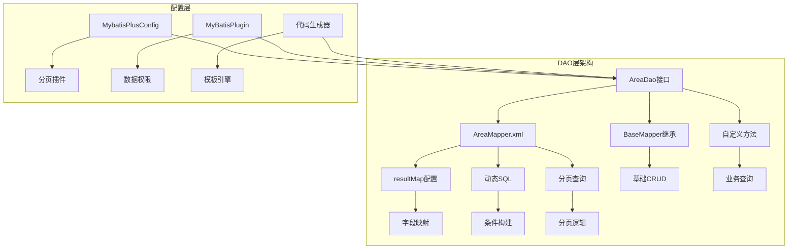
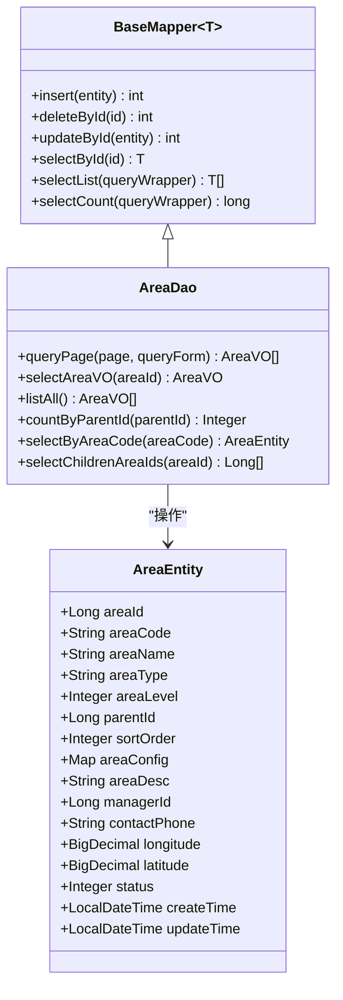
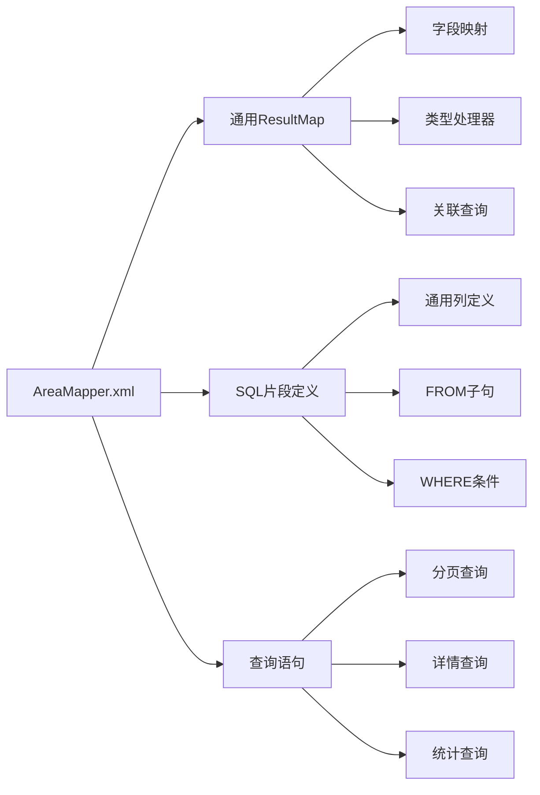
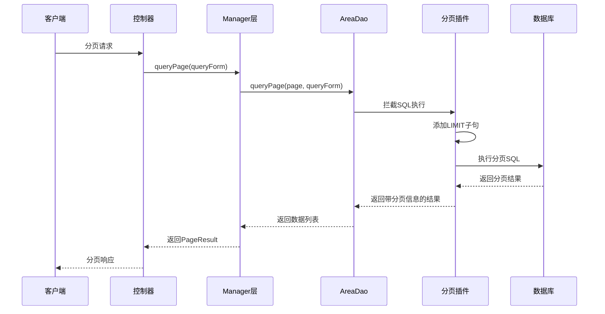
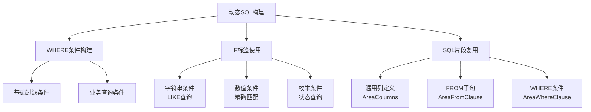
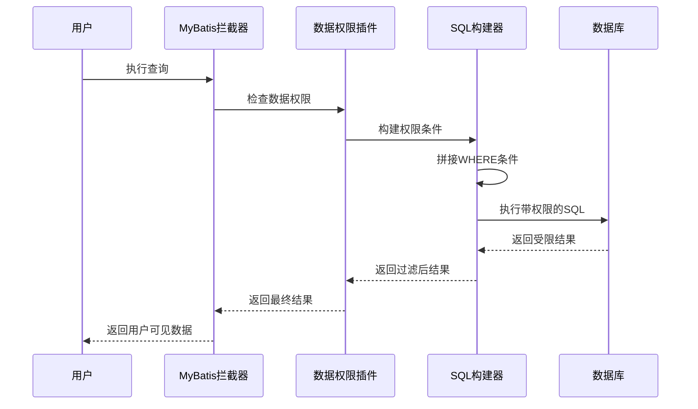

# DAO层与Mapper映射

<cite>
**本文档引用的文件**
- [AreaDao.java](file://smart-admin-api-java17-springboot3/sa-admin/src/main/java/net/lab1024/sa/admin/module/system/area/dao/AreaDao.java)
- [AreaMapper.xml](file://smart-admin-api-java17-springboot3/sa-admin/src/main/resources/mapper/system/area/AreaMapper.xml)
- [AreaQueryForm.java](file://smart-admin-api-java17-springboot3/sa-admin/src/main/java/net/lab1024/sa/admin/module/system/area/domain/form/AreaQueryForm.java)
- [AreaVO.java](file://smart-admin-api-java17-springboot3/sa-admin/src/main/java/net/lab1024/sa/admin/module/system/area/domain/vo/AreaVO.java)
- [AreaEntity.java](file://smart-admin-api-java17-springboot3/sa-admin/src/main/java/net/lab1024/sa/admin/module/system/area/domain/entity/AreaEntity.java)
- [MybatisPlusConfig.java](file://smart-admin-api-java17-springboot3/sa-base/src/main/java/net/lab1024/sa/base/config/MybatisPlusConfig.java)
- [Dao.java.vm](file://smart-admin-api-java17-springboot3/sa-base/src/main/resources/code-generator-template/java/dao/Dao.java.vm)
- [MyBatisPlugin.java](file://smart-admin-api-java17-springboot3/sa-admin/src/main/java/net/lab1024/sa/admin/module/system/datascope/MyBatisPlugin.java)
</cite>

## 目录
1. [概述](#概述)
2. [项目架构](#项目架构)
3. [DAO接口设计](#dao接口设计)
4. [XML映射文件详解](#xml映射文件详解)
5. [@Param注解使用规范](#param注解使用规范)
6. [分页查询实现](#分页查询实现)
7. [动态SQL与resultMap配置](#动态sql与resultmap配置)
8. [代码生成器模板](#代码生成器模板)
9. [性能优化策略](#性能优化策略)
10. [最佳实践指南](#最佳实践指南)

## 概述

IOE-DREAM项目采用MyBatis-Plus作为ORM框架，实现了完整的DAO层与Mapper映射体系。该体系通过继承BaseMapper接口扩展自定义方法，结合XML配置文件实现灵活的数据库操作，支持复杂的查询场景和高性能的数据处理。

### 核心特性

- **继承BaseMapper**：提供基础CRUD操作
- **自定义方法扩展**：支持业务特定的查询方法
- **XML映射配置**：灵活的SQL语句和resultMap定义
- **动态SQL支持**：智能的条件查询构建
- **分页查询集成**：与MyBatis-Plus分页插件无缝对接
- **代码生成器**：自动化DAO层代码生成

## 项目架构



**图表来源**
- [AreaDao.java](file://smart-admin-api-java17-springboot3/sa-admin/src/main/java/net/lab1024/sa/admin/module/system/area/dao/AreaDao.java#L1-L71)
- [AreaMapper.xml](file://smart-admin-api-java17-springboot3/sa-admin/src/main/resources/mapper/system/area/AreaMapper.xml#L1-L160)
- [MybatisPlusConfig.java](file://smart-admin-api-java17-springboot3/sa-base/src/main/java/net/lab1024/sa/base/config/MybatisPlusConfig.java#L1-L34)

## DAO接口设计

### BaseMapper继承模式

AreaDao接口展示了标准的MyBatis-Plus DAO设计模式：



**图表来源**
- [AreaDao.java](file://smart-admin-api-java17-springboot3/sa-admin/src/main/java/net/lab1024/sa/admin/module/system/area/dao/AreaDao.java#L19-L70)
- [AreaEntity.java](file://smart-admin-api-java17-springboot3/sa-admin/src/main/java/net/lab1024/sa/admin/module/system/area/domain/entity/AreaEntity.java#L1-L66)

### 自定义方法设计原则

1. **单一职责**：每个方法专注于特定的业务查询
2. **参数明确**：使用@Param注解明确参数含义
3. **返回类型适配**：根据业务需求选择合适的返回类型
4. **命名规范**：遵循清晰的命名约定

**章节来源**
- [AreaDao.java](file://smart-admin-api-java17-springboot3/sa-admin/src/main/java/net/lab1024/sa/admin/module/system/area/dao/AreaDao.java#L22-L70)

## XML映射文件详解

### resultMap配置架构

AreaMapper.xml展示了完整的resultMap配置模式：



**图表来源**
- [AreaMapper.xml](file://smart-admin-api-java17-springboot3/sa-admin/src/main/resources/mapper/system/area/AreaMapper.xml#L6-L29)

### 关联查询配置

XML映射文件支持复杂的关联查询配置：

| 配置项 | 功能描述 | 示例 |
|--------|----------|------|
| LEFT JOIN | 左连接查询 | `LEFT JOIN t_employee me ON a.manager_id = me.employee_id` |
| 字段别名 | 别名映射 | `me.actual_name as manager_name` |
| 类型处理器 | 复杂类型处理 | `JacksonTypeHandler` |
| 动态条件 | 条件查询 | `<if test="queryForm.areaName != null">` |

**章节来源**
- [AreaMapper.xml](file://smart-admin-api-java17-springboot3/sa-admin/src/main/resources/mapper/system/area/AreaMapper.xml#L58-L62)

## @Param注解使用规范

### 注解使用场景

@Param注解在IOE-DREAM项目中有以下典型使用场景：

```mermaid
flowchart TD
A[@Param注解使用] --> B[单参数方法]
A --> C[多参数方法]
A --> D[复杂对象参数]
B --> E[基本类型参数<br/>Long, Integer, String]
C --> F[Page分页参数<br/>查询表单对象]
D --> G[复合查询条件<br/>嵌套对象]
E --> H[#{areaId}]
F --> I[#{queryForm.areaName}]
G --> J[#{queryForm.managerId}]
```

**图表来源**
- [AreaDao.java](file://smart-admin-api-java17-springboot3/sa-admin/src/main/java/net/lab1024/sa/admin/module/system/area/dao/AreaDao.java#L29-L68)

### 参数命名规范

| 方法签名 | 参数注解 | XML引用 | 用途 |
|----------|----------|---------|------|
| `queryPage(Page<?> page, @Param("queryForm") AreaQueryForm queryForm)` | `@Param("queryForm")` | `#{queryForm.areaName}` | 复合查询条件 |
| `selectAreaVO(@Param("areaId") Long areaId)` | `@Param("areaId")` | `#{areaId}` | 单一主键查询 |
| `countByParentId(@Param("parentId") Long parentId)` | `@Param("parentId")` | `#{parentId}` | 父级关联查询 |
| `selectChildrenAreaIds(@Param("areaId") Long areaId)` | `@Param("areaId")` | `#{areaId}` | 递归查询参数 |

**章节来源**
- [AreaDao.java](file://smart-admin-api-java17-springboot3/sa-admin/src/main/java/net/lab1024/sa/admin/module/system/area/dao/AreaDao.java#L29-L68)

## 分页查询实现

### 分页插件配置

项目采用MyBatis-Plus内置的分页插件：



**图表来源**
- [MybatisPlusConfig.java](file://smart-admin-api-java17-springboot3/sa-base/src/main/java/net/lab1024/sa/base/config/MybatisPlusConfig.java#L26-L30)
- [AreaDao.java](file://smart-admin-api-java17-springboot3/sa-admin/src/main/java/net/lab1024/sa/admin/module/system/area/dao/AreaDao.java#L29-L30)

### 分页查询实现细节

分页查询的核心实现包括：

1. **Page对象传递**：自动包含分页参数
2. **SQL拦截处理**：插件自动添加分页LIMIT
3. **结果封装**：返回完整的分页信息
4. **排序支持**：支持多字段排序

**章节来源**
- [AreaDao.java](file://smart-admin-api-java17-springboot3/sa-admin/src/main/java/net/lab1024/sa/admin/module/system/area/dao/AreaDao.java#L29-L30)
- [MybatisPlusConfig.java](file://smart-admin-api-java17-springboot3/sa-base/src/main/java/net/lab1024/sa/base/config/MybatisPlusConfig.java#L26-L30)

## 动态SQL与resultMap配置

### 动态SQL构建模式

AreaMapper.xml展示了完整的动态SQL构建模式：



**图表来源**
- [AreaMapper.xml](file://smart-admin-api-java17-springboot3/sa-admin/src/main/resources/mapper/system/area/AreaMapper.xml#L66-L92)

### resultMap字段映射策略

| 映射类型 | 配置方式 | 用途 | 示例 |
|----------|----------|------|------|
| 基础字段 | `<result property="fieldName" column="db_column"/>` | 简单字段映射 | `area_name` → `areaName` |
| 主键字段 | `<id property="id" column="id"/>` | 主键标识 | `area_id` → `areaId` |
| 复杂类型 | `typeHandler="JacksonTypeHandler"` | JSON序列化 | `area_config` → `areaConfig` |
| 关联字段 | `column="关联字段" property="属性名"` | 外键关联 | `manager_id` → `managerName` |

**章节来源**
- [AreaMapper.xml](file://smart-admin-api-java17-springboot3/sa-admin/src/main/resources/mapper/system/area/AreaMapper.xml#L6-L29)

## 代码生成器模板

### DAO模板结构

代码生成器提供了标准化的DAO接口模板：

```mermaid
graph TB
A[Dao.java.vm模板] --> B[包路径导入]
A --> C[基础接口继承]
A --> D[自定义方法定义]
A --> E[删除操作支持]
B --> F[BaseMapper导入]
B --> G[分页Page导入]
B --> H[注解导入]
C --> I[extends BaseMapper<Entity>]
C --> J[@Mapper注解]
D --> K[分页查询方法]
D --> L[业务特定查询]
E --> M[假删除支持]
E --> N[批量删除支持]
```

**图表来源**
- [Dao.java.vm](file://smart-admin-api-java17-springboot3/sa-base/src/main/resources/code-generator-template/java/dao/Dao.java.vm#L1-L52)

### 变量替换机制

模板引擎支持的变量替换：

| 变量名 | 替换内容 | 示例 |
|--------|----------|------|
| `${packageName}` | 包路径 | `net.lab1024.sa.admin.module.system.area.dao` |
| `${name.upperCamel}` | 实体名称 | `Area` |
| `${primaryKeyFieldName}` | 主键字段名 | `areaId` |
| `${primaryKeyJavaType}` | 主键类型 | `Long` |
| `${deleteInfo.isSupportDelete}` | 是否支持删除 | `true/false` |

**章节来源**
- [Dao.java.vm](file://smart-admin-api-java17-springboot3/sa-base/src/main/resources/code-generator-template/java/dao/Dao.java.vm#L1-L52)

## 性能优化策略

### 查询优化技术

1. **索引优化**：合理设计数据库索引
2. **SQL优化**：避免全表扫描
3. **缓存策略**：结合Redis缓存
4. **分页优化**：大数据量分页处理

### 数据权限控制

项目实现了基于MyBatis拦截器的数据权限控制：



**图表来源**
- [MyBatisPlugin.java](file://smart-admin-api-java17-springboot3/sa-admin/src/main/java/net/lab1024/sa/admin/module/system/datascope/MyBatisPlugin.java#L34-L96)

**章节来源**
- [MyBatisPlugin.java](file://smart-admin-api-java17-springboot3/sa-admin/src/main/java/net/lab1024/sa/admin/module/system/datascope/MyBatisPlugin.java#L34-L127)

## 最佳实践指南

### DAO层设计原则

1. **单一职责**：每个DAO只负责特定实体的操作
2. **接口隔离**：避免接口过于臃肿
3. **依赖注入**：使用Spring管理DAO实例
4. **异常处理**：统一的异常处理机制

### XML配置最佳实践

1. **命名规范**：保持一致的命名约定
2. **注释完整**：为复杂SQL添加详细注释
3. **性能考虑**：避免不必要的JOIN操作
4. **安全性**：防止SQL注入攻击

### 开发流程建议

1. **先写接口**：定义清晰的DAO接口
2. **再写XML**：实现对应的SQL映射
3. **单元测试**：确保功能正确性
4. **性能测试**：验证查询效率

**章节来源**
- [AreaDao.java](file://smart-admin-api-java17-springboot3/sa-admin/src/main/java/net/lab1024/sa/admin/module/system/area/dao/AreaDao.java#L1-L71)
- [AreaMapper.xml](file://smart-admin-api-java17-springboot3/sa-admin/src/main/resources/mapper/system/area/AreaMapper.xml#L1-L160)

## 总结

IOE-DREAM项目的DAO层与Mapper映射体系展现了现代Java企业应用的最佳实践。通过MyBatis-Plus的强大功能，结合精心设计的接口和XML配置，实现了高效、灵活、可维护的数据访问层。该体系不仅支持基本的CRUD操作，还能够处理复杂的业务查询场景，为上层业务逻辑提供了坚实的数据支撑。