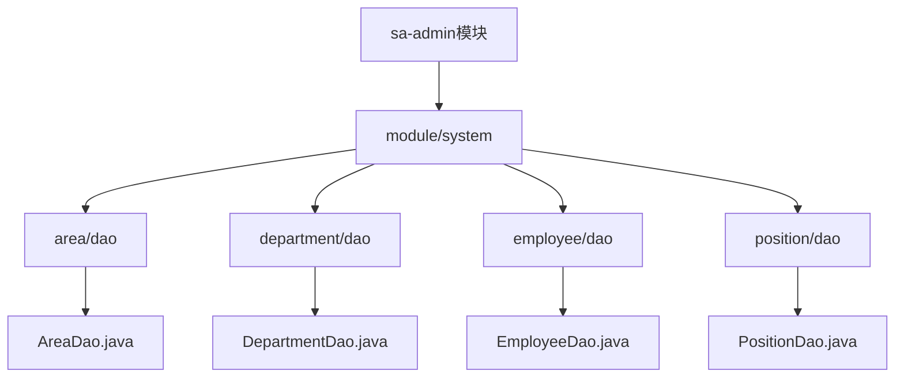
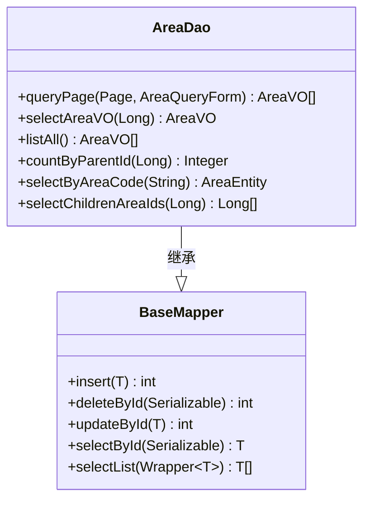
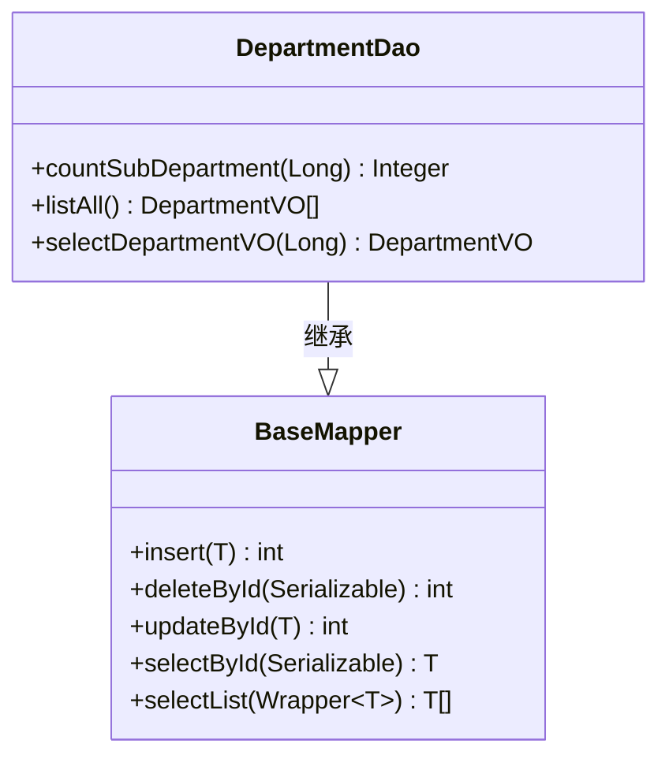
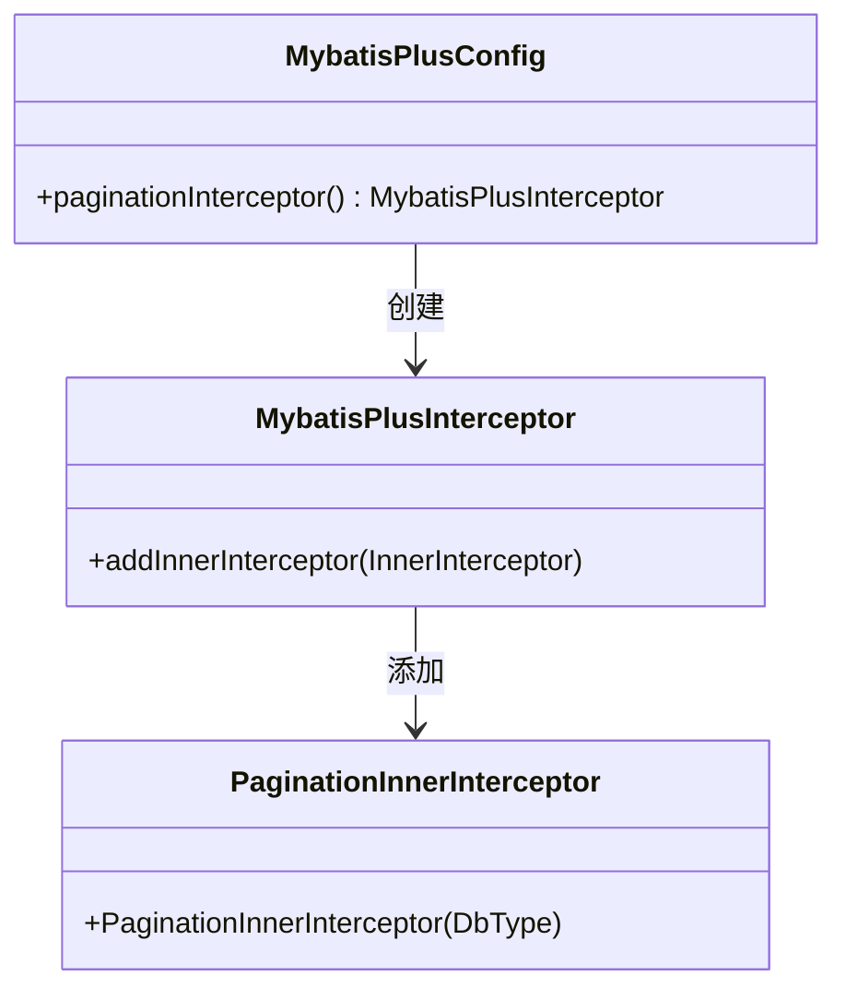
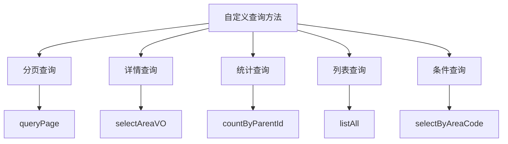
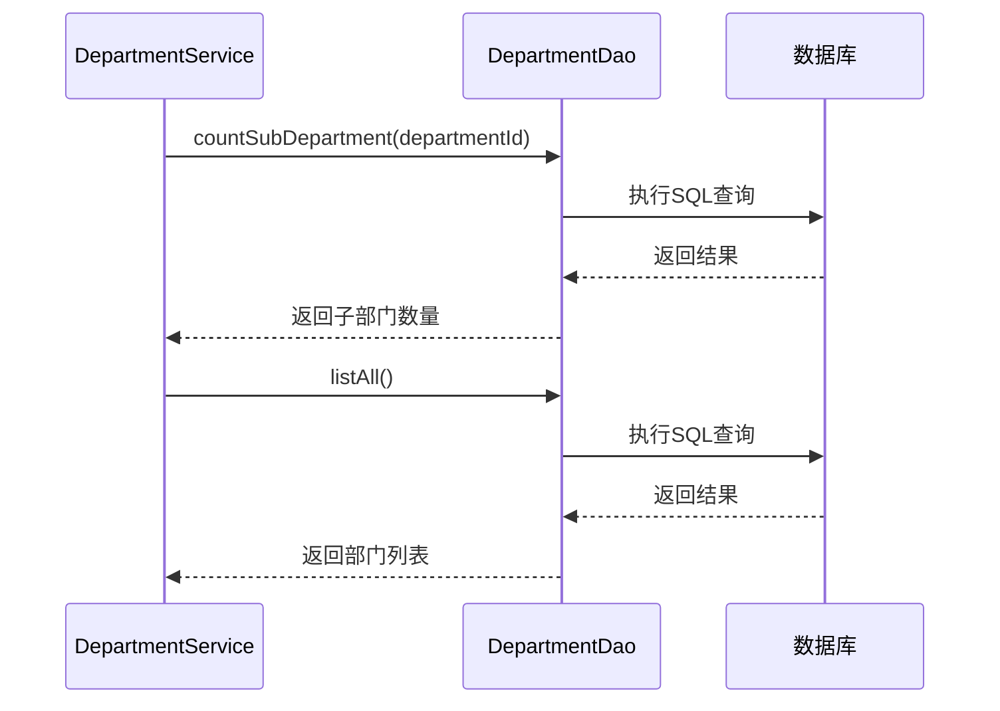

# DAO接口设计

<cite>
**本文档引用文件**  
- [AreaDao.java](file://smart-admin-api-java17-springboot3\sa-admin\src\main\java\net\lab1024\sa\admin\module\system\area\dao\AreaDao.java)
- [DepartmentDao.java](file://smart-admin-api-java17-springboot3\sa-admin\src\main\java\net\lab1024\sa\admin\module\system\department\dao\DepartmentDao.java)
- [EmployeeDao.java](file://smart-admin-api-java17-springboot3\sa-admin\src\main\java\net\lab1024\sa\admin\module\system\employee\dao\EmployeeDao.java)
- [PositionDao.java](file://smart-admin-api-java17-springboot3\sa-admin\src\main\java\net\lab1024\sa\admin\module\system\position\dao\PositionDao.java)
- [AreaMapper.xml](file://smart-admin-api-java17-springboot3\sa-admin\src\main\resources\mapper\system\area\AreaMapper.xml)
- [MybatisPlusConfig.java](file://smart-admin-api-java17-springboot3\sa-base\src\main\java\net\lab1024\sa\base\config\MybatisPlusConfig.java)
- [Dao.java.vm](file://smart-admin-api-java17-springboot3\sa-base\src\main\resources\code-generator-template\java\dao\Dao.java.vm)
</cite>

## 目录
1. [引言](#引言)
2. [项目结构与DAO模块定位](#项目结构与dao模块定位)
3. [核心DAO接口设计](#核心dao接口设计)
4. [MyBatis-Plus集成与配置](#mybatis-plus集成与配置)
5. [通用CRUD操作机制](#通用crud操作机制)
6. [自定义查询方法设计](#自定义查询方法设计)
7. [@Param注解使用规范](#param注解使用规范)
8. [复杂条件查询实现](#复杂条件查询实现)
9. [分页查询设计](#分页查询设计)
10. [批量操作与递归查询](#批量操作与递归查询)
11. [DAO与Service层调用关系](#dao与service层调用关系)
12. [接口命名规范与业务语义](#接口命名规范与业务语义)
13. [最佳实践与常见问题](#最佳实践与常见问题)

## 引言
本文档详细阐述IOE-DREAM项目中基于MyBatis-Plus的DAO接口设计。重点分析AreaDao、DepartmentDao等接口如何继承BaseMapper并扩展自定义方法，解释@Param注解在多参数传递中的使用场景和命名规范。文档涵盖通用CRUD操作的继承机制、自定义查询方法的设计原则、接口方法命名规范与业务语义的对应关系，以及复杂条件查询、分页查询和批量操作的接口设计示例。

## 项目结构与DAO模块定位
在IOE-DREAM项目中，DAO接口位于`sa-admin`模块的`module/system`包下，按业务模块组织。每个业务模块（如area、department、employee）都有独立的DAO包，包含对应的DAO接口和实体类。DAO接口通过`@Mapper`注解标识，由MyBatis-Plus框架管理。



**图示来源**  
- [AreaDao.java](file://smart-admin-api-java17-springboot3\sa-admin\src\main\java\net\lab1024\sa\admin\module\system\area\dao\AreaDao.java)
- [DepartmentDao.java](file://smart-admin-api-java17-springboot3\sa-admin\src\main\java\net\lab1024\sa\admin\module\system\department\dao\DepartmentDao.java)

## 核心DAO接口设计
IOE-DREAM项目中的DAO接口均继承自MyBatis-Plus的`BaseMapper<T>`，从而获得通用的CRUD操作能力。在此基础上，各业务DAO接口扩展了自定义查询方法以满足特定业务需求。

### AreaDao接口设计
AreaDao接口继承`BaseMapper<AreaEntity>`，提供了区域管理相关的自定义查询方法，包括分页查询、详情查询、子区域数量统计等。



**图示来源**  
- [AreaDao.java](file://smart-admin-api-java17-springboot3\sa-admin\src\main\java\net\lab1024\sa\admin\module\system\area\dao\AreaDao.java)

### DepartmentDao接口设计
DepartmentDao接口继承`BaseMapper<DepartmentEntity>`，提供了部门管理相关的自定义查询方法，包括子部门数量统计、部门列表查询等。



**图示来源**  
- [DepartmentDao.java](file://smart-admin-api-java17-springboot3\sa-admin\src\main\java\net\lab1024\sa\admin\module\system\department\dao\DepartmentDao.java)

## MyBatis-Plus集成与配置
项目通过MyBatisPlusConfig类配置MyBatis-Plus插件，主要配置了分页插件，支持MySQL数据库的分页查询。



**图示来源**  
- [MybatisPlusConfig.java](file://smart-admin-api-java17-springboot3\sa-base\src\main\java\net\lab1024\sa\base\config\MybatisPlusConfig.java)

## 通用CRUD操作机制
DAO接口通过继承`BaseMapper<T>`获得通用的CRUD操作能力，无需在DAO接口中显式声明这些方法。

### 继承的通用方法
- `insert(T entity)`：插入记录
- `deleteById(Serializable id)`：根据ID删除记录
- `updateById(T entity)`：根据ID更新记录
- `selectById(Serializable id)`：根据ID查询记录
- `selectList(Wrapper<T> queryWrapper)`：条件查询列表

这些通用方法由MyBatis-Plus框架自动实现，DAO接口可以直接使用。

**代码来源**  
- [BaseMapper](file://com.baomidou.mybatisplus.core.mapper.BaseMapper)

## 自定义查询方法设计
除了通用CRUD操作，DAO接口还定义了满足特定业务需求的自定义查询方法。

### 查询方法设计原则
1. **返回值类型**：通常返回VO（View Object）类型，封装查询结果
2. **参数设计**：使用@Param注解明确参数名称，便于XML映射
3. **业务语义**：方法名清晰表达业务含义

### 自定义方法示例


**代码来源**  
- [AreaDao.java](file://smart-admin-api-java17-springboot3\sa-admin\src\main\java\net\lab1024\sa\admin\module\system\area\dao\AreaDao.java)

## @Param注解使用规范
@Param注解用于在DAO接口方法中为参数指定名称，这些名称在对应的XML映射文件中使用。

### 使用场景
1. **单参数**：虽然MyBatis支持单参数直接使用，但建议使用@Param保持一致性
2. **多参数**：必须使用@Param注解区分不同参数
3. **复杂对象参数**：当参数是复杂对象时，使用@Param指定参数别名

### 命名规范
- **参数名称**：使用小驼峰命名法
- **语义清晰**：参数名称应清晰表达其含义
- **一致性**：在接口和XML映射文件中保持一致

### 使用示例
```java
// 单参数
AreaVO selectAreaVO(@Param("areaId") Long areaId);

// 多参数  
Integer countByParentId(@Param("parentId") Long parentId);

// 复杂对象参数
List<AreaVO> queryPage(Page<?> page, @Param("queryForm") AreaQueryForm queryForm);
```

**代码来源**  
- [AreaDao.java](file://smart-admin-api-java17-springboot3\sa-admin\src\main\java\net\lab1024\sa\admin\module\system\area\dao\AreaDao.java)

## 复杂条件查询实现
复杂条件查询通过在XML映射文件中使用动态SQL实现，DAO接口方法通过@Param传递查询条件。

### 动态SQL实现
使用`<if>`标签实现条件判断，根据传入的参数值动态构建SQL语句。

```xml
<sql id="AreaWhereClause">
    <where>
        <if test="queryForm.includeDeleted == null or queryForm.includeDeleted == false">
            AND a.deleted_flag = 0
        </if>
        <if test="queryForm.areaCode != null and queryForm.areaCode != ''">
            AND a.area_code LIKE CONCAT('%', #{queryForm.areaCode}, '%')
        </if>
        <if test="queryForm.areaName != null and queryForm.areaName != ''">
            AND a.area_name LIKE CONCAT('%', #{queryForm.areaName}, '%')
        </if>
    </where>
</sql>
```

### 查询方法实现
```java
List<AreaVO> queryPage(Page<?> page, @Param("queryForm") AreaQueryForm queryForm);
```

**代码来源**  
- [AreaMapper.xml](file://smart-admin-api-java17-springboot3\sa-admin\src\main\resources\mapper\system\area\AreaMapper.xml)
- [AreaDao.java](file://smart-admin-api-java17-springboot3\sa-admin\src\main\java\net\lab1024\sa\admin\module\system\area\dao\AreaDao.java)

## 分页查询设计
分页查询通过MyBatis-Plus的分页插件实现，DAO接口方法接收Page对象和查询条件。

### 分页实现机制
1. **Page对象**：封装分页参数（页码、页大小）
2. **分页插件**：MyBatis-Plus拦截SQL执行，自动添加分页语句
3. **结果封装**：查询结果包含分页信息和数据列表

### 分页查询示例
```java
List<AreaVO> queryPage(Page<?> page, @Param("queryForm") AreaQueryForm queryForm);
```

```xml
<select id="queryPage" resultMap="AreaVOMap">
    SELECT
    <include refid="AreaColumns"/>
    <include refid="AreaFromClause"/>
    <include refid="AreaWhereClause"/>
    ORDER BY a.sort_order ASC, a.create_time DESC
</select>
```

**代码来源**  
- [AreaDao.java](file://smart-admin-api-java17-springboot3\sa-admin\src\main\java\net\lab1024\sa\admin\module\system\area\dao\AreaDao.java)
- [AreaMapper.xml](file://smart-admin-api-java17-springboot3\sa-admin\src\main\resources\mapper\system\area\AreaMapper.xml)

## 批量操作与递归查询
DAO接口支持批量操作和递归查询等高级查询功能。

### 批量操作
通过传递集合参数实现批量操作：

```java
List<EmployeeVO> getEmployeeByIds(@Param("employeeIds") Collection<Long> employeeIds);
```

### 递归查询
使用MySQL的WITH RECURSIVE语法实现递归查询：

```xml
<select id="selectChildrenAreaIds" resultType="java.lang.Long">
    WITH RECURSIVE area_tree AS (
        SELECT area_id, parent_id
        FROM t_area
        WHERE area_id = #{areaId}
        AND deleted_flag = 0
        
        UNION ALL
        
        SELECT a.area_id, a.parent_id
        FROM t_area a
        INNER JOIN area_tree at ON a.parent_id = at.area_id
        WHERE a.deleted_flag = 0
    )
    SELECT area_id FROM area_tree WHERE area_id != #{areaId}
</select>
```

**代码来源**  
- [AreaDao.java](file://smart-admin-api-java17-springboot3\sa-admin\src\main\java\net\lab1024\sa\admin\module\system\area\dao\AreaDao.java)
- [AreaMapper.xml](file://smart-admin-api-java17-springboot3\sa-admin\src\main\resources\mapper\system\area\AreaMapper.xml)

## DAO与Service层调用关系
DAO层与Service层通过依赖注入建立调用关系，Service层调用DAO层方法实现业务逻辑。

### 调用关系图


### 依赖注入实现
```java
@Service
public class DepartmentService {
    
    @Resource
    private DepartmentDao departmentDao;
    
    public Integer countSubDepartments(Long departmentId) {
        return departmentDao.countSubDepartment(departmentId);
    }
    
    public List<DepartmentVO> getAllDepartments() {
        return departmentDao.listAll();
    }
}
```

**代码来源**  
- [DepartmentDao.java](file://smart-admin-api-java17-springboot3\sa-admin\src\main\java\net\lab1024\sa\admin\module\system\department\dao\DepartmentDao.java)
- [DepartmentService.java](file://smart-admin-api-java17-springboot3\sa-admin\src\main\java\net\lab1024\sa\admin\module\system\department\service\DepartmentService.java)

## 接口命名规范与业务语义
DAO接口方法命名遵循清晰的命名规范，确保方法名与业务语义对应。

### 命名规范
1. **动词+名词**：使用动词描述操作类型，名词描述操作对象
2. **语义清晰**：方法名应清晰表达其业务含义
3. **一致性**：同类操作使用一致的命名模式

### 命名示例
| 方法名 | 业务语义 | 操作类型 |
|-------|---------|---------|
| queryPage | 分页查询区域 | 查询 |
| selectAreaVO | 查询区域详情 | 查询 |
| listAll | 查询所有区域 | 查询 |
| countByParentId | 统计子区域数量 | 统计 |
| selectByAreaCode | 根据编码查询区域 | 查询 |

**代码来源**  
- [AreaDao.java](file://smart-admin-api-java17-springboot3\sa-admin\src\main\java\net\lab1024\sa\admin\module\system\area\dao\AreaDao.java)

## 最佳实践与常见问题
### 最佳实践
1. **继承BaseMapper**：充分利用MyBatis-Plus提供的通用CRUD方法
2. **使用@Param注解**：明确参数名称，提高代码可读性
3. **VO/Entity分离**：查询返回VO对象，保持数据层与表现层分离
4. **动态SQL复用**：使用`<sql>`标签复用SQL片段
5. **分页插件配置**：正确配置分页插件以支持分页查询

### 常见问题及解决方案
1. **参数传递问题**：多参数未使用@Param注解导致SQL映射失败
   - **解决方案**：所有参数都使用@Param注解明确命名

2. **分页不生效**：未正确配置分页插件
   - **解决方案**：确保MyBatisPlusConfig中正确配置PaginationInnerInterceptor

3. **递归查询性能问题**：大数据量下递归查询性能下降
   - **解决方案**：添加适当索引，限制递归深度

4. **XML映射文件路径问题**：Mapper XML文件未正确放置
   - **解决方案**：确保XML文件位于resources/mapper目录下，路径与DAO接口包结构对应

**代码来源**  
- [Dao.java.vm](file://smart-admin-api-java17-springboot3\sa-base\src\main\resources\code-generator-template\java\dao\Dao.java.vm)
- [MybatisPlusConfig.java](file://smart-admin-api-java17-springboot3\sa-base\src\main\java\net\lab1024\sa\base\config\MybatisPlusConfig.java)