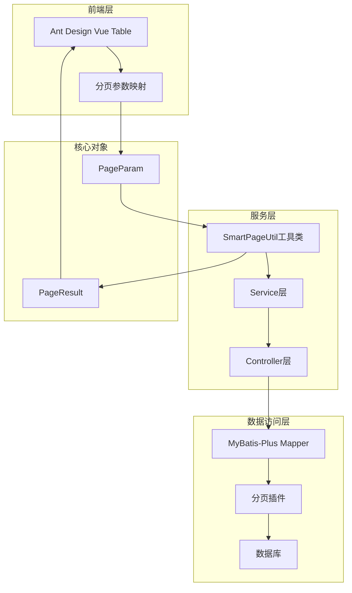
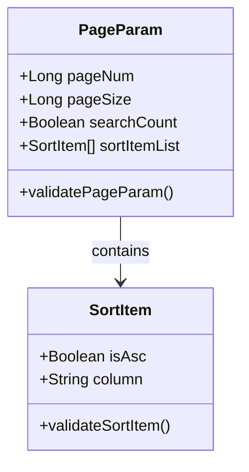
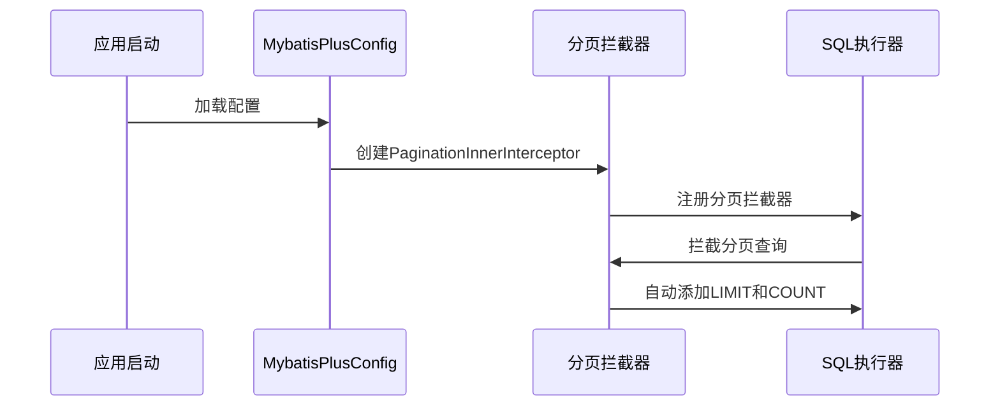
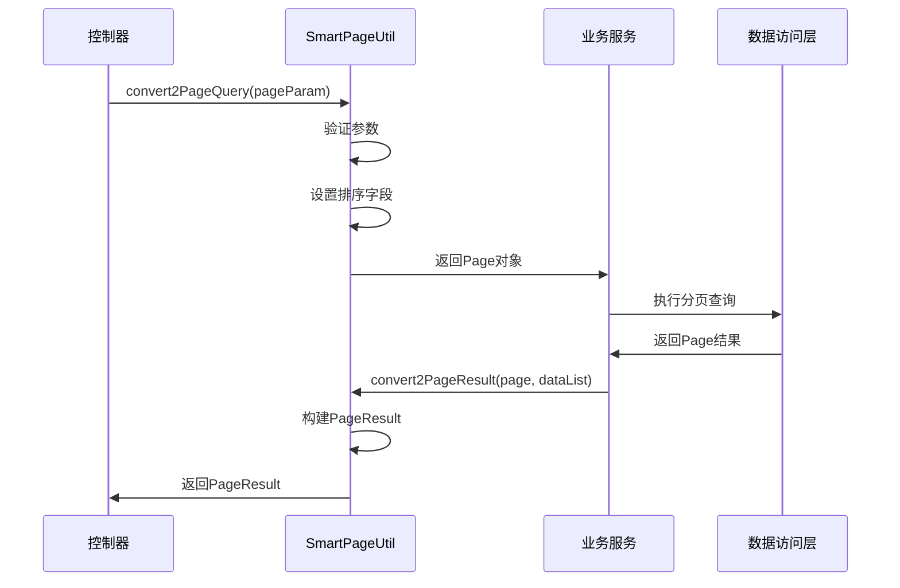
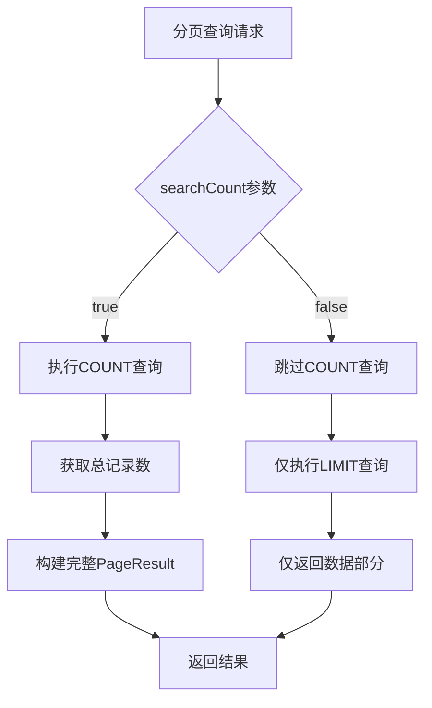

# 分页结果

<cite>
**本文档中引用的文件**
- [PageResult.java](file://smart-admin-api-java17-springboot3/sa-base/src/main/java/net/lab1024/sa/base/common/domain/PageResult.java)
- [PageParam.java](file://smart-admin-api-java17-springboot3/sa-base/src/main/java/net/lab1024/sa/base/common/domain/PageParam.java)
- [SmartPageUtil.java](file://smart-admin-api-java17-springboot3/sa-base/src/main/java/net/lab1024/sa/base/common/util/SmartPageUtil.java)
- [MybatisPlusConfig.java](file://smart-admin-api-java17-springboot3/sa-base/src/main/java/net/lab1024/sa/base/config/MybatisPlusConfig.java)
- [EmployeeService.java](file://smart-admin-api-java17-springboot3/sa-admin/src/main/java/net/lab1024/sa/admin/module/system/employee/service/EmployeeService.java)
- [MyBatisPlusConfig.java](file://smart-admin-api-java17-springboot3/sa-base/src/main/java/net/lab1024/sa/base/config/MybatisPlusConfig.java)
</cite>

## 目录
1. [概述](#概述)
2. [核心组件架构](#核心组件架构)
3. [PageResult分页结果对象](#pageresult分页结果对象)
4. [PageParam分页参数对象](#pageparam分页参数对象)
5. [MyBatis-Plus分页插件集成](#mybatis-plus分页插件集成)
6. [Service层使用模式](#service层使用模式)
7. [前端分页组件对接](#前端分页组件对接)
8. [分页性能优化](#分页性能优化)
9. [最佳实践](#最佳实践)
10. [故障排除](#故障排除)

## 概述

SmartAdmin框架提供了完整的分页解决方案，通过PageResult分页结果对象和PageParam分页参数对象，结合MyBatis-Plus分页插件，实现了高效、安全、易用的分页功能。该方案支持前后端分离架构，提供了统一的分页接口规范和性能优化策略。

## 核心组件架构



**图表来源**
- [SmartPageUtil.java](file://smart-admin-api-java17-springboot3/sa-base/src/main/java/net/lab1024/sa/base/common/util/SmartPageUtil.java#L28-L79)
- [MybatisPlusConfig.java](file://smart-admin-api-java17-springboot3/sa-base/src/main/java/net/lab1024/sa/base/config/MybatisPlusConfig.java#L26-L30)

## PageResult分页结果对象

PageResult是分页查询的核心返回对象，包含了分页所需的所有信息。

### 字段定义与含义

| 字段名 | 类型 | 描述 | 计算逻辑 |
|--------|------|------|----------|
| pageNum | Long | 当前页码 | 当前查询的页码，从1开始 |
| pageSize | Long | 每页记录数 | 每页显示的记录数量 |
| total | Long | 总记录数 | 符合查询条件的总记录数 |
| pages | Long | 总页数 | 总页数，根据total和pageSize计算 |
| list | List<T> | 结果集 | 当前页的数据列表 |
| emptyFlag | Boolean | 是否为空 | 结果集是否为空 |

### 计算逻辑详解

```mermaid
flowchart TD
A[开始分页计算] --> B{total > 0?}
B --> |是| C[pages = total / pageSize + (total % pageSize > 0 ? 1 : 0)]
B --> |否| D[pages = 0]
C --> E[pageNum <= pages?]
D --> F[设置空结果]
E --> |是| G[提取当前页数据]
E --> |否| F
G --> H[设置PageResult属性]
F --> I[返回空结果]
H --> J[返回完整PageResult]
```

**图表来源**
- [SmartPageUtil.java](file://smart-admin-api-java17-springboot3/sa-base/src/main/java/net/lab1024/sa/base/common/util/SmartPageUtil.java#L96-L118)

**章节来源**
- [PageResult.java](file://smart-admin-api-java17-springboot3/sa-base/src/main/java/net/lab1024/sa/base/common/domain/PageResult.java#L17-L52)

## PageParam分页参数对象

PageParam是分页查询的基础参数对象，提供了灵活的分页配置选项。

### 核心字段

| 字段名 | 类型 | 必填 | 默认值 | 限制 | 描述 |
|--------|------|------|--------|------|------|
| pageNum | Long | 是 | - | ≥1 | 页码，从1开始 |
| pageSize | Long | 是 | - | ≤500 | 每页记录数 |
| searchCount | Boolean | 否 | true | - | 是否查询总记录数 |
| sortItemList | List<SortItem> | 否 | - | ≤10 | 排序字段列表 |

### 排序字段配置



**图表来源**
- [PageParam.java](file://smart-admin-api-java17-springboot3/sa-base/src/main/java/net/lab1024/sa/base/common/domain/PageParam.java#L46-L57)

### 参数验证规则

- **pageNum**: 必须≥1，表示从第一页开始
- **pageSize**: 必须≤500，防止过大数据量查询
- **sortItemList**: 最多10个排序字段，每个字段长度≤30字符
- **isAsc**: 排序规则必须明确指定，true为升序，false为降序

**章节来源**
- [PageParam.java](file://smart-admin-api-java17-springboot3/sa-base/src/main/java/net/lab1024/sa/base/common/domain/PageParam.java#L23-L57)

## MyBatis-Plus分页插件集成

SmartAdmin框架集成了MyBatis-Plus分页插件，提供了自动化的分页处理能力。

### 配置方式



**图表来源**
- [MybatisPlusConfig.java](file://smart-admin-api-java17-springboot3/sa-base/src/main/java/net/lab1024/sa/base/config/MybatisPlusConfig.java#L26-L30)

### 分页插件特性

- **自动分页**: 无需手动编写LIMIT语句
- **COUNT优化**: 智能判断是否需要执行COUNT查询
- **SQL注入防护**: 内置SQL安全检查
- **多数据库支持**: 支持MySQL、PostgreSQL等主流数据库

**章节来源**
- [MybatisPlusConfig.java](file://smart-admin-api-java17-springboot3/sa-base/src/main/java/net/lab1024/sa/base/config/MybatisPlusConfig.java#L26-L30)

## Service层使用模式

SmartPageUtil工具类提供了标准化的分页处理流程。

### 标准使用流程



**图表来源**
- [SmartPageUtil.java](file://smart-admin-api-java17-springboot3/sa-base/src/main/java/net/lab1024/sa/base/common/util/SmartPageUtil.java#L31-L79)
- [EmployeeService.java](file://smart-admin-api-java17-springboot3/sa-admin/src/main/java/net/lab1024/sa/admin/module/system/employee/service/EmployeeService.java#L83-L116)

### 典型Service方法实现

以员工查询为例，展示标准的分页使用模式：

```java
// 1. 参数转换
Page pageParam = SmartPageUtil.convert2PageQuery(employeeQueryForm);

// 2. 执行查询
List<EmployeeVO> employeeList = employeeDao.queryEmployee(pageParam, employeeQueryForm, departmentIdList);

// 3. 构建结果
PageResult<EmployeeVO> pageResult = SmartPageUtil.convert2PageResult(pageParam, employeeList);
```

**章节来源**
- [EmployeeService.java](file://smart-admin-api-java17-springboot3/sa-admin/src/main/java/net/lab1024/sa/admin/module/system/employee/service/EmployeeService.java#L83-L116)
- [SmartPageUtil.java](file://smart-admin-api-java17-springboot3/sa-base/src/main/java/net/lab1024/sa/base/common/util/SmartPageUtil.java#L31-L79)

## 前端分页组件对接

SmartAdmin框架提供了与Ant Design Vue Table的无缝对接方案。

### 请求参数映射

| 前端参数 | 后端参数 | 映射关系 | 示例值 |
|----------|----------|----------|--------|
| current | pageNum | 直接映射 | 1 |
| size | pageSize | 直接映射 | 10 |
| total | total | 直接映射 | 100 |
| page | pageNum | 直接映射 | 2 |

### 响应数据解析


### Ant Design Vue Table集成示例

```vue
<a-table
  :data-source="tableData"
  :pagination="{
    current: queryParams.pageNum,
    pageSize: queryParams.pageSize,
    total: pageResult.total,
    showSizeChanger: true,
    pageSizeOptions: ['10', '20', '50', '100']
  }"
  @change="handleTableChange"
  row-key="id"
>
  <!-- 列定义 -->
</a-table>
```

### 分页事件处理

```javascript
methods: {
  handleTableChange(pagination, filters, sorter) {
    // 更新分页参数
    this.queryParams.pageNum = pagination.current;
    this.queryParams.pageSize = pagination.pageSize;
    
    // 执行查询
    this.fetchData();
  }
}
```

## 分页性能优化

SmartAdmin框架在分页性能方面采用了多种优化策略。

### COUNT查询优化



### 性能优化策略

1. **智能COUNT控制**: 通过searchCount参数控制是否执行COUNT查询
2. **索引优化**: 确保查询字段建立适当索引
3. **批量查询**: 减少数据库连接开销
4. **缓存策略**: 对频繁查询的结果进行缓存

### 避免SELECT COUNT(*)与主查询分离

SmartAdmin框架通过以下方式避免性能问题：

- **合并查询**: MyBatis-Plus插件自动合并COUNT和数据查询
- **延迟加载**: 只在需要时才执行COUNT查询
- **估算机制**: 在大数据量场景下使用估算值

**章节来源**
- [SmartPageUtil.java](file://smart-admin-api-java17-springboot3/sa-base/src/main/java/net/lab1024/sa/base/common/util/SmartPageUtil.java#L34-L36)

## 最佳实践

### 1. 参数校验

```java
// 前端参数校验
@NotNull(message = "页码不能为空")
private Long pageNum;

@NotNull(message = "每页数量不能为空")
@Max(value = 500, message = "每页最大为500")
private Long pageSize;
```

### 2. 异常处理

```java
try {
    PageResult<DataType> result = service.queryData(queryForm);
    return ResponseDTO.ok(result);
} catch (BusinessException e) {
    return ResponseDTO.userError(e.getMessage());
} catch (Exception e) {
    log.error("分页查询异常", e);
    return ResponseDTO.sysError();
}
```

### 3. 排序安全性

SmartPageUtil内置了SQL注入防护机制：

```java
// 自动检测SQL注入风险
if (SqlInjectionUtils.check(sortItem.getColumn())) {
    log.error("存在SQL注入：{}", sortItem.getColumn());
    throw new BusinessException("存在SQL注入风险");
}
```

### 4. 性能监控

建议在生产环境中监控分页查询性能：

- COUNT查询耗时
- 数据库连接池使用情况
- 内存使用情况

## 故障排除

### 常见问题及解决方案

#### 1. 分页结果为空但total不为0

**原因**: 查询条件过于严格或数据被过滤

**解决方案**: 
- 检查查询条件
- 验证数据完整性
- 确认权限过滤逻辑

#### 2. 分页查询性能慢

**原因**: 缺少索引或查询条件复杂

**解决方案**:
- 为查询字段添加索引
- 优化查询条件
- 考虑使用searchCount=false

#### 3. SQL注入警告

**原因**: 排序字段包含危险字符

**解决方案**:
- 检查排序字段输入
- 使用白名单验证
- 启用SQL注入防护

### 调试技巧

1. **开启SQL日志**: 查看实际执行的SQL语句
2. **监控COUNT查询**: 确认COUNT查询是否必要
3. **分析执行计划**: 使用EXPLAIN分析查询性能

**章节来源**
- [SmartPageUtil.java](file://smart-admin-api-java17-springboot3/sa-base/src/main/java/net/lab1024/sa/base/common/util/SmartPageUtil.java#L51-L54)

## 总结

SmartAdmin的分页解决方案通过PageResult和PageParam的标准化设计，结合MyBatis-Plus的强大功能，提供了完整、高效、安全的分页体验。该方案不仅简化了开发工作，还通过多种优化策略确保了良好的性能表现。开发者可以基于本文档快速掌握分页功能的使用，并在实际项目中应用最佳实践。