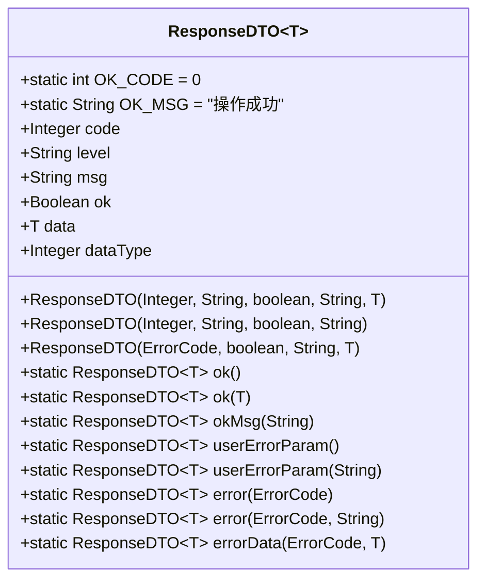
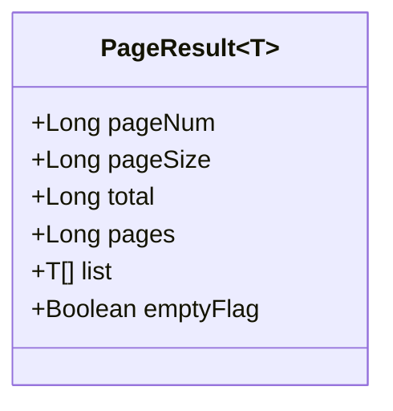
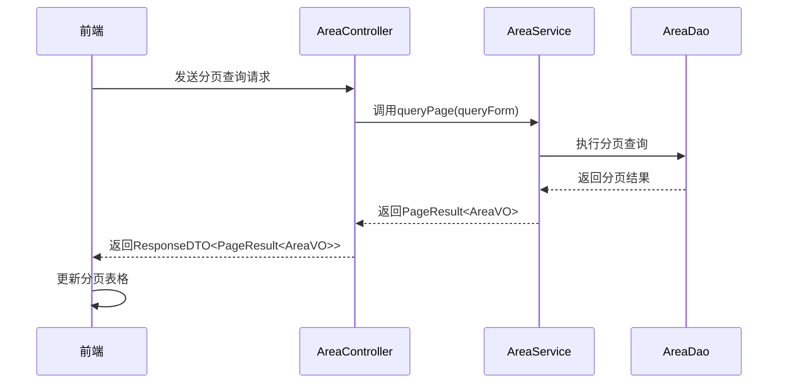
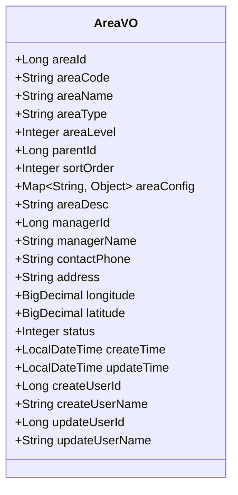
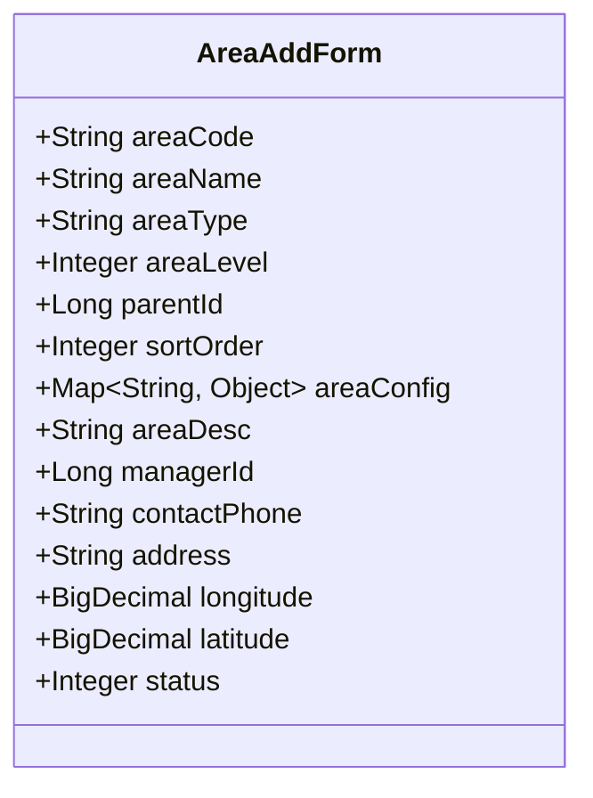
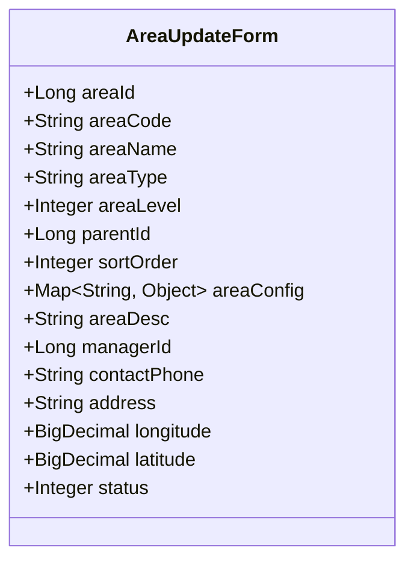
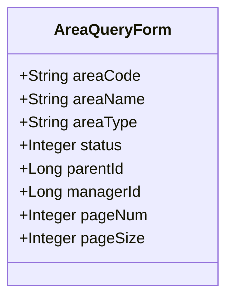
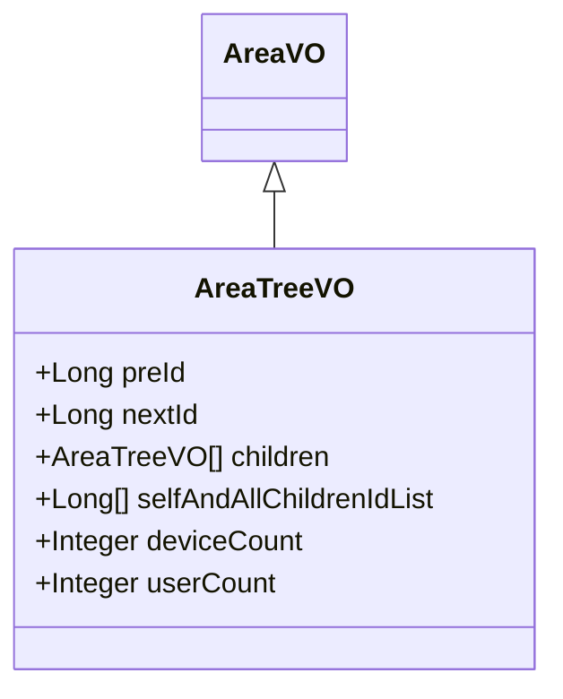
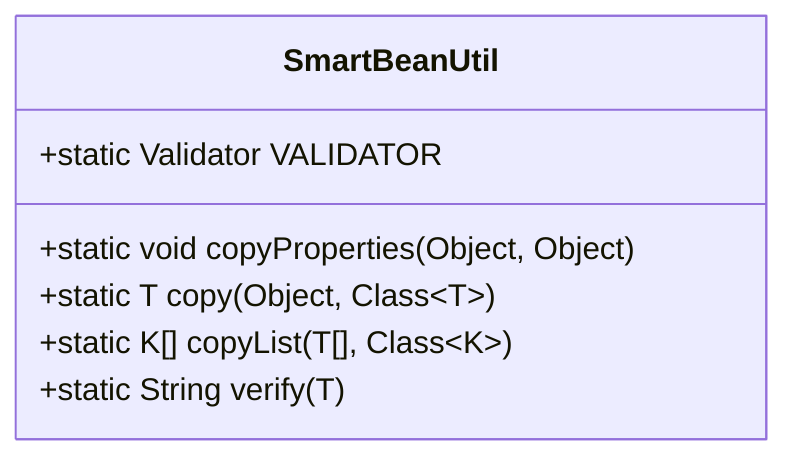

# 数据传输对象

<cite>
**本文档引用的文件**
- [ResponseDTO.java](file://smart-admin-api-java17-springboot3\sa-base\src\main\java\net\lab1024\sa\base\common\domain\ResponseDTO.java)
- [PageResult.java](file://smart-admin-api-java17-springboot3\sa-base\src\main\java\net\lab1024\sa\base\common\domain\PageResult.java)
- [SmartBeanUtil.java](file://smart-admin-api-java17-springboot3\sa-base\src\main\java\net\lab1024\sa\base\common\util\SmartBeanUtil.java)
- [AreaVO.java](file://smart-admin-api-java17-springboot3\sa-admin\src\main\java\net\lab1024\sa\admin\module\system\area\domain\vo\AreaVO.java)
- [AreaAddForm.java](file://smart-admin-api-java17-springboot3\sa-admin\src\main\java\net\lab1024\sa\admin\module\system\area\domain\form\AreaAddForm.java)
- [AreaUpdateForm.java](file://smart-admin-api-java17-springboot3\sa-admin\src\main\java\net\lab1024\sa\admin\module\system\area\domain\form\AreaUpdateForm.java)
- [AreaQueryForm.java](file://smart-admin-api-java17-springboot3\sa-admin\src\main\java\net\lab1024\sa\admin\module\system\area\domain\form\AreaQueryForm.java)
- [AreaTreeVO.java](file://smart-admin-api-java17-springboot3\sa-admin\src\main\java\net\lab1024\sa\admin\module\system\area\domain\vo\AreaTreeVO.java)
- [AreaService.java](file://smart-admin-api-java17-springboot3\sa-admin\src\main\java\net\lab1024\sa\admin\module\system\area\service\AreaService.java)
- [AreaController.java](file://smart-admin-api-java17-springboot3\sa-admin\src\main\java\net\lab1024\sa\admin\module\system\area\controller\AreaController.java)
- [area-api.js](file://smart-admin-web-javascript\src\api\system\area-api.js)
- [index.vue](file://smart-admin-web-javascript\src\views\system\area\index.vue)
- [area-modal.vue](file://smart-admin-web-javascript\src\views\system\area\area-modal.vue)
</cite>

## 目录
1. [引言](#引言)
2. [统一响应体设计](#统一响应体设计)
3. [分页结果处理](#分页结果处理)
4. [数据传输对象分类](#数据传输对象分类)
5. [DTO与实体转换](#dto与实体转换)
6. [前端交互示例](#前端交互示例)
7. [最佳实践总结](#最佳实践总结)

## 引言
在IOE-DREAM项目中，数据传输对象(DTO)模式被广泛应用于各层之间的数据流转。本项目采用清晰的分层架构，通过不同类型的DTO实现数据的安全、高效传输。本文档详细阐述了项目中DTO模式的应用，包括统一响应体、分页结果、视图对象、表单对象等的设计与使用规范。

**本文档引用的文件**
- [ResponseDTO.java](file://smart-admin-api-java17-springboot3\sa-base\src\main\java\net\lab1024\sa\base\common\domain\ResponseDTO.java)
- [PageResult.java](file://smart-admin-api-java17-springboot3\sa-base\src\main\java\net\lab1024\sa\base\common\domain\PageResult.java)

## 统一响应体设计
IOE-DREAM项目采用`ResponseDTO<T>`作为统一的API响应体，确保前后端交互的一致性和可预测性。该设计遵循RESTful API最佳实践，提供标准化的响应格式。

### 响应体结构
`ResponseDTO<T>`包含以下核心字段：

- **code**: 返回码，用于标识请求结果状态。成功时为0，失败时为具体的错误码。
- **msg**: 消息描述，提供人类可读的响应信息。
- **data**: 返回数据，包含实际的业务数据，类型为泛型T。
- **ok**: 布尔值，标识请求是否成功。
- **level**: 级别，用于标识错误的严重程度。
- **dataType**: 数据类型，标识返回数据的类型。



**图示来源**
- [ResponseDTO.java](file://smart-admin-api-java17-springboot3\sa-base\src\main\java\net\lab1024\sa\base\common\domain\ResponseDTO.java#L23-L121)

### 使用规范
项目提供了丰富的静态工厂方法来创建`ResponseDTO`实例，简化了响应体的构建：

- `ResponseDTO.ok()`: 创建成功响应，无数据。
- `ResponseDTO.ok(T data)`: 创建成功响应，包含数据。
- `ResponseDTO.okMsg(String msg)`: 创建成功响应，包含自定义消息。
- `ResponseDTO.userErrorParam()`: 创建用户参数错误响应。
- `ResponseDTO.userErrorParam(String msg)`: 创建用户参数错误响应，包含自定义消息。
- `ResponseDTO.error(ErrorCode errorCode)`: 创建错误响应，使用预定义的错误码。
- `ResponseDTO.error(ErrorCode errorCode, String msg)`: 创建错误响应，使用预定义的错误码和自定义消息。

**本文档引用的文件**
- [ResponseDTO.java](file://smart-admin-api-java17-springboot3\sa-base\src\main\java\net\lab1024\sa\base\common\domain\ResponseDTO.java)
- [UserErrorCode.java](file://smart-admin-api-java17-springboot3\sa-base\src\main\java\net\lab1024\sa\base\common\code\UserErrorCode.java)

## 分页结果处理
为了支持分页查询功能，项目设计了`PageResult<T>`类作为分页结果的统一包装器。该设计与前端分页组件紧密配合，实现了高效的分页数据交互。

### 分页结果结构
`PageResult<T>`包含以下字段：

- **pageNum**: 当前页码。
- **pageSize**: 每页记录数。
- **total**: 总记录数。
- **pages**: 总页数。
- **list**: 结果集，包含当前页的数据列表。
- **emptyFlag**: 是否为空标志。



**图示来源**
- [PageResult.java](file://smart-admin-api-java17-springboot3\sa-base\src\main\java\net\lab1024\sa\base\common\domain\PageResult.java#L18-L53)

### 分页交互方式
前端通过`SmartPageUtil`工具类与后端进行分页交互。后端服务接收分页查询参数，返回`PageResult<T>`对象，前端根据返回的分页信息更新UI。



**图示来源**
- [PageResult.java](file://smart-admin-api-java17-springboot3\sa-base\src\main\java\net\lab1024\sa\base\common\domain\PageResult.java)
- [SmartPageUtil.java](file://smart-admin-api-java17-springboot3\sa-base\src\main\java\net\lab1024\sa\base\common\util\SmartPageUtil.java)
- [AreaController.java](file://smart-admin-api-java17-springboot3\sa-admin\src\main\java\net\lab1024\sa\admin\module\system\area\controller\AreaController.java)
- [AreaService.java](file://smart-admin-api-java17-springboot3\sa-admin\src\main\java\net\lab1024\sa\admin\module\system\area\service\AreaService.java)

**本文档引用的文件**
- [PageResult.java](file://smart-admin-api-java17-springboot3\sa-base\src\main\java\net\lab1024\sa\base\common\domain\PageResult.java)
- [SmartPageUtil.java](file://smart-admin-api-java17-springboot3\sa-base\src\main\java\net\lab1024\sa\base\common\util\SmartPageUtil.java)

## 数据传输对象分类
IOE-DREAM项目根据不同的使用场景，定义了多种数据传输对象，实现了清晰的职责划分。

### 视图对象(VO)
视图对象(View Object)用于向前端展示数据。`AreaVO`是区域管理模块的视图对象，包含区域的所有展示字段。



**图示来源**
- [AreaVO.java](file://smart-admin-api-java17-springboot3\sa-admin\src\main\java\net\lab1024\sa\admin\module\system\area\domain\vo\AreaVO.java#L16-L85)

### 表单对象(Form)
表单对象用于接收前端提交的数据，并进行参数校验。项目根据操作类型定义了不同的表单对象。

#### 新增表单(AreaAddForm)
`AreaAddForm`用于新增区域，包含所有必填字段的校验注解。



**图示来源**
- [AreaAddForm.java](file://smart-admin-api-java17-springboot3\sa-admin\src\main\java\net\lab1024\sa\admin\module\system\area\domain\form\AreaAddForm.java#L19-L73)

#### 更新表单(AreaUpdateForm)
`AreaUpdateForm`用于更新区域，与新增表单类似，但包含区域ID字段。



**图示来源**
- [AreaUpdateForm.java](file://smart-admin-api-java17-springboot3\sa-admin\src\main\java\net\lab1024\sa\admin\module\system\area\domain\form\AreaUpdateForm.java#L19-L73)

#### 查询表单(AreaQueryForm)
`AreaQueryForm`用于分页查询条件，包含分页参数和查询条件。



**图示来源**
- [AreaQueryForm.java](file://smart-admin-api-java17-springboot3\sa-admin\src\main\java\net\lab1024\sa\admin\module\system\area\domain\form\AreaQueryForm.java#L19-L67)

### 树形视图对象(AreaTreeVO)
`AreaTreeVO`继承自`AreaVO`，用于展示树形结构的数据，包含子节点列表和导航信息。



**图示来源**
- [AreaTreeVO.java](file://smart-admin-api-java17-springboot3\sa-admin\src\main\java\net\lab1024\sa\admin\module\system\area\domain\vo\AreaTreeVO.java#L17-L37)

**本文档引用的文件**
- [AreaVO.java](file://smart-admin-api-java17-springboot3\sa-admin\src\main\java\net\lab1024\sa\admin\module\system\area\domain\vo\AreaVO.java)
- [AreaAddForm.java](file://smart-admin-api-java17-springboot3\sa-admin\src\main\java\net\lab1024\sa\admin\module\system\area\domain\form\AreaAddForm.java)
- [AreaUpdateForm.java](file://smart-admin-api-java17-springboot3\sa-admin\src\main\java\net\lab1024\sa\admin\module\system\area\domain\form\AreaUpdateForm.java)
- [AreaQueryForm.java](file://smart-admin-api-java17-springboot3\sa-admin\src\main\java\net\lab1024\sa\admin\module\system\area\domain\form\AreaQueryForm.java)
- [AreaTreeVO.java](file://smart-admin-api-java17-springboot3\sa-admin\src\main\java\net\lab1024\sa\admin\module\system\area\domain\vo\AreaTreeVO.java)

## DTO与实体转换
项目使用`SmartBeanUtil`工具类实现DTO与实体对象之间的转换，确保数据在各层间安全高效地流转。

### 转换工具(SmartBeanUtil)
`SmartBeanUtil`提供了对象复制和列表复制的静态方法，基于Spring的BeanUtils实现。



**图示来源**
- [SmartBeanUtil.java](file://smart-admin-api-java17-springboot3\sa-base\src\main\java\net\lab1024\sa\base\common\util\SmartBeanUtil.java#L22-L94)

### 使用方法
在服务层中，通过`SmartBeanUtil.copy`方法将表单对象转换为实体对象，或将实体对象转换为视图对象。

```java
// 新增区域时，将表单对象转换为实体对象
AreaEntity areaEntity = SmartBeanUtil.copy(addForm, AreaEntity.class);

// 查询详情时，将实体对象转换为视图对象
AreaVO areaVO = SmartBeanUtil.copy(areaEntity, AreaVO.class);
```

### 性能优化建议
1. **避免不必要的转换**: 在不需要转换的场景下，直接使用原始对象。
2. **批量转换**: 使用`copyList`方法批量转换列表，避免在循环中逐个转换。
3. **缓存转换结果**: 对于频繁使用的转换，考虑使用缓存机制。
4. **选择性转换**: 只转换需要的字段，避免转换大量无用数据。

**本文档引用的文件**
- [SmartBeanUtil.java](file://smart-admin-api-java17-springboot3\sa-base\src\main\java\net\lab1024\sa\base\common\util\SmartBeanUtil.java)
- [AreaService.java](file://smart-admin-api-java17-springboot3\sa-admin\src\main\java\net\lab1024\sa\admin\module\system\area\service\AreaService.java)

## 前端交互示例
以下示例展示了前端如何与后端进行数据交互。

### API调用
前端通过`area-api.js`定义的API接口与后端通信。

```javascript
export const areaApi = {
  /**
   * 分页查询区域
   */
  queryPage: (param) => {
    return postRequest('/system/area/page', param);
  },

  /**
   * 新增区域
   */
  add: (param) => {
    return postRequest('/system/area/add', param);
  },

  /**
   * 更新区域
   */
  update: (param) => {
    return postRequest('/system/area/update', param);
  }
};
```

**本文档引用的文件**
- [area-api.js](file://smart-admin-web-javascript\src\api\system\area-api.js)
- [index.vue](file://smart-admin-web-javascript\src\views\system\area\index.vue)
- [area-modal.vue](file://smart-admin-web-javascript\src\views\system\area\area-modal.vue)

## 最佳实践总结
IOE-DREAM项目中的DTO模式应用体现了以下最佳实践：

1. **统一响应体**: 使用`ResponseDTO<T>`确保API响应格式的一致性。
2. **清晰的职责划分**: 通过VO、Form等不同类型的DTO明确各层的职责。
3. **参数校验**: 在表单对象中使用JSR-303校验注解，确保数据的合法性。
4. **类型安全**: 使用泛型确保类型安全，避免类型转换错误。
5. **工具支持**: 提供`SmartBeanUtil`等工具类，简化DTO转换操作。
6. **文档化**: 通过Swagger注解为DTO字段提供详细的文档说明。

这些实践确保了数据在各层间安全、高效地流转，提高了代码的可维护性和可读性。

**本文档引用的文件**
- [ResponseDTO.java](file://smart-admin-api-java17-springboot3\sa-base\src\main\java\net\lab1024\sa\base\common\domain\ResponseDTO.java)
- [PageResult.java](file://smart-admin-api-java17-springboot3\sa-base\src\main\java\net\lab1024\sa\base\common\domain\PageResult.java)
- [SmartBeanUtil.java](file://smart-admin-api-java17-springboot3\sa-base\src\main\java\net\lab1024\sa\base\common\util\SmartBeanUtil.java)