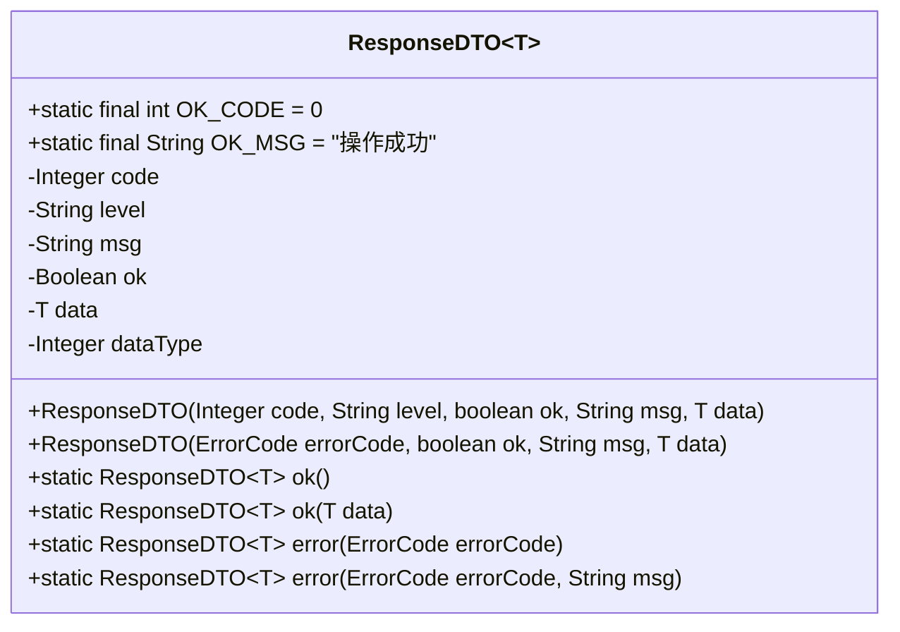
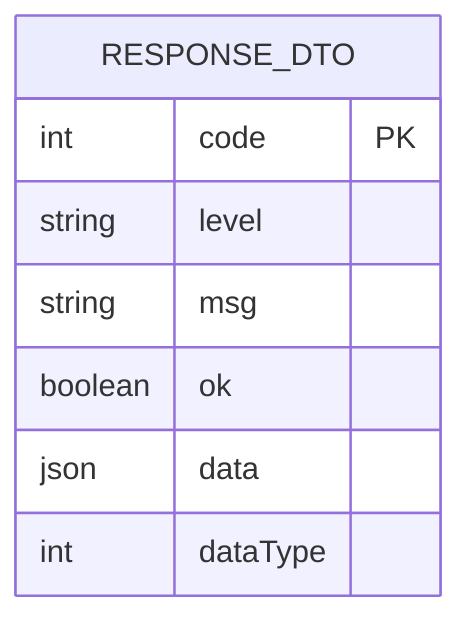
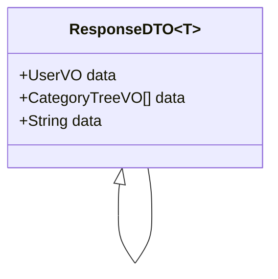
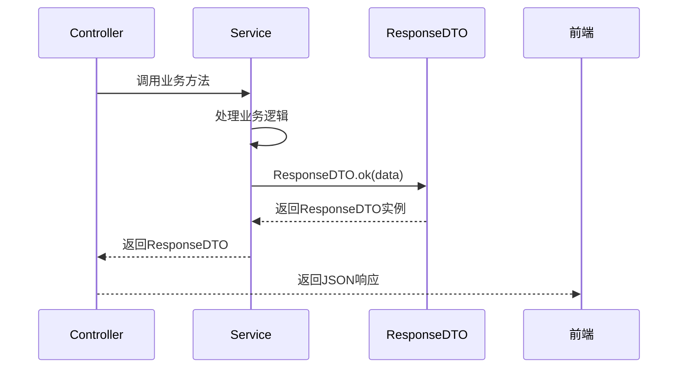
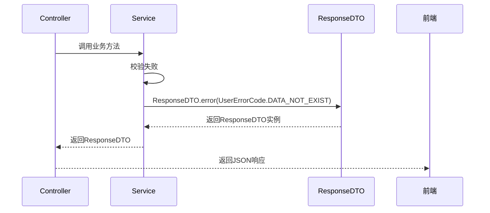
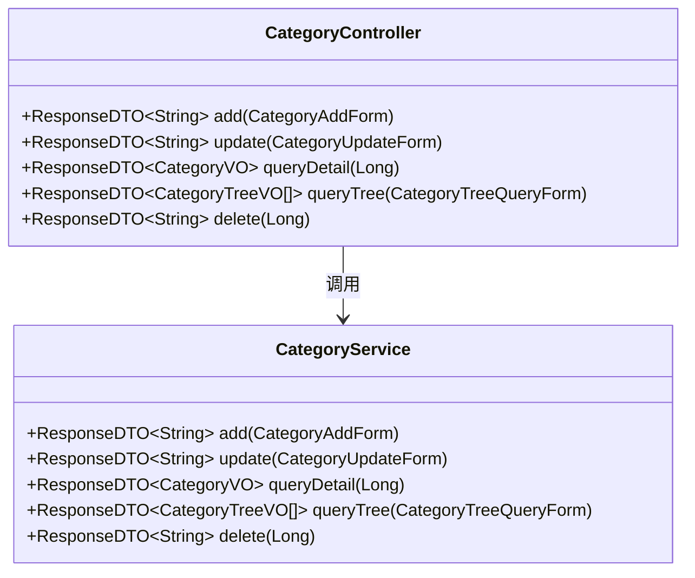
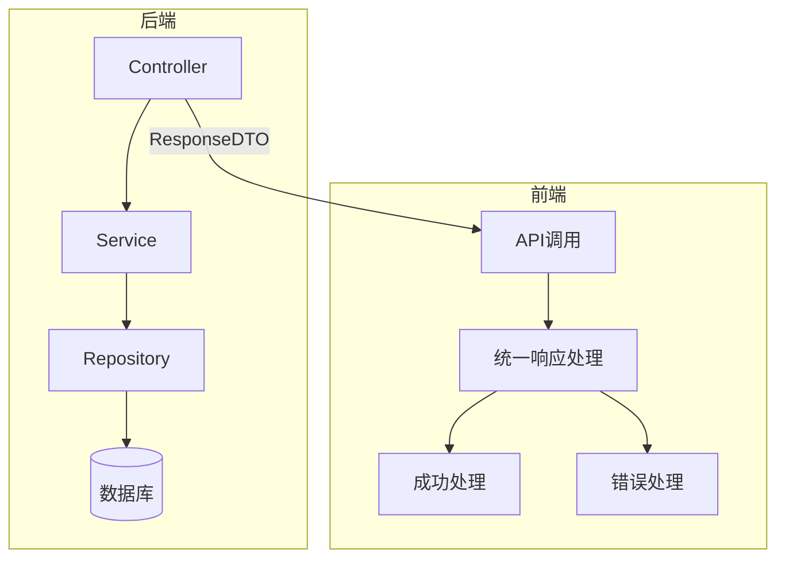

# 统一响应体

<cite>
**本文档引用文件**  
- [ResponseDTO.java](file://smart-admin-api-java17-springboot3\sa-base\src\main\java\net\lab1024\sa\base\common\domain\ResponseDTO.java)
- [SmartResponseUtil.java](file://smart-admin-api-java17-springboot3\sa-base\src\main\java\net\lab1024\sa\base\common\util\SmartResponseUtil.java)
- [GlobalExceptionHandler.java](file://smart-admin-api-java17-springboot3\sa-base\src\main\java\net\lab1024\sa\base\handler\GlobalExceptionHandler.java)
- [SystemErrorCode.java](file://smart-admin-api-java17-springboot3\sa-base\src\main\java\net\lab1024\sa\base\common\code\SystemErrorCode.java)
- [UserErrorCode.java](file://smart-admin-api-java17-springboot3\sa-base\src\main\java\net\lab1024\sa\base\common\code\UserErrorCode.java)
- [CategoryController.java](file://smart-admin-api-java17-springboot3\sa-admin\src\main\java\net\lab1024\sa\admin\module\business\category\controller\CategoryController.java)
- [CategoryService.java](file://smart-admin-api-java17-springboot3\sa-admin\src\main\java\net\lab1024\sa\admin\module\business\category\service\CategoryService.java)
</cite>

## 目录
1. [引言](#引言)
2. [统一响应体设计](#统一响应体设计)
3. [核心字段语义规范](#核心字段语义规范)
4. [泛型设计解析](#泛型设计解析)
5. [使用示例](#使用示例)
6. [与全局异常处理器的协同](#与全局异常处理器的协同)
7. [Controller层返回规范](#controller层返回规范)
8. [前后端接口契约统一](#前后端接口契约统一)
9. [总结](#总结)

## 引言
在IOE-DREAM项目中，为了实现前后端接口的统一规范和提升错误处理的一致性，项目采用了统一的响应体设计。该设计通过`ResponseDTO<T>`泛型类封装所有接口的返回数据，确保了接口返回格式的标准化。本文档将深入解析该统一响应体的设计原理、核心字段语义、使用方法以及其在项目中的重要作用。

## 统一响应体设计
IOE-DREAM项目中的统一响应体`ResponseDTO<T>`是一个泛型类，位于`net.lab1024.sa.base.common.domain`包中。该类的设计遵循了RESTful API的最佳实践，通过标准化的字段结构来封装所有接口的返回信息。这种设计不仅提高了接口的可读性和可维护性，还为前后端开发人员提供了清晰的契约。



**图示来源**
- [ResponseDTO.java](file://smart-admin-api-java17-springboot3\sa-base\src\main\java\net\lab1024\sa\base\common\domain\ResponseDTO.java#L23-L121)

**本节来源**
- [ResponseDTO.java](file://smart-admin-api-java17-springboot3\sa-base\src\main\java\net\lab1024\sa\base\common\domain\ResponseDTO.java#L1-L122)

## 核心字段语义规范
`ResponseDTO<T>`类包含五个核心字段，每个字段都有明确的语义和用途：

- **code**: 返回码，遵循系统错误码体系。成功时为0，失败时为预定义的错误码。
- **level**: 级别，表示错误的严重程度，如"system"、"user"等。
- **msg**: 用户可读提示信息，用于向用户展示操作结果或错误原因。
- **ok**: 布尔值，表示操作是否成功。
- **data**: 泛型字段，用于封装业务数据。



**图示来源**
- [ResponseDTO.java](file://smart-admin-api-java17-springboot3\sa-base\src\main\java\net\lab1024\sa\base\common\domain\ResponseDTO.java#L29-L43)

**本节来源**
- [ResponseDTO.java](file://smart-admin-api-java17-springboot3\sa-base\src\main\java\net\lab1024\sa\base\common\domain\ResponseDTO.java#L29-L43)

## 泛型设计解析
`ResponseDTO<T>`采用泛型设计，使得`data`字段可以容纳任意类型的业务数据。这种设计提供了极大的灵活性，同时保持了类型安全。当接口需要返回特定类型的对象时，可以直接指定泛型类型，如`ResponseDTO<UserVO>`或`ResponseDTO<List<CategoryTreeVO>>`。

泛型设计的优势包括：
- **类型安全**: 编译时检查类型正确性，避免运行时类型转换异常。
- **代码复用**: 同一个响应体类可以用于所有接口，无需为每种返回类型创建新的响应类。
- **清晰的契约**: 前端开发人员可以清楚地知道每个接口返回的数据类型。



**图示来源**
- [ResponseDTO.java](file://smart-admin-api-java17-springboot3\sa-base\src\main\java\net\lab1024\sa\base\common\domain\ResponseDTO.java#L23-L121)
- [CategoryController.java](file://smart-admin-api-java17-springboot3\sa-admin\src\main\java\net\lab1024\sa\admin\module\business\category\controller\CategoryController.java#L39-L67)

**本节来源**
- [ResponseDTO.java](file://smart-admin-api-java17-springboot3\sa-base\src\main\java\net\lab1024\sa\base\common\domain\ResponseDTO.java#L23-L121)

## 使用示例
### 标准成功响应
使用`SmartResponseUtil.success(data)`方法可以创建标准的成功响应。该方法实际上是调用`ResponseDTO.ok(T data)`静态方法。



**图示来源**
- [ResponseDTO.java](file://smart-admin-api-java17-springboot3\sa-base\src\main\java\net\lab1024\sa\base\common\domain\ResponseDTO.java#L79-L81)
- [CategoryService.java](file://smart-admin-api-java17-springboot3\sa-admin\src\main\java\net\lab1024\sa\admin\module\business\category\service\CategoryService.java#L65-L66)

**本节来源**
- [ResponseDTO.java](file://smart-admin-api-java17-springboot3\sa-base\src\main\java\net\lab1024\sa\base\common\domain\ResponseDTO.java#L79-L81)
- [CategoryService.java](file://smart-admin-api-java17-springboot3\sa-admin\src\main\java\net\lab1024\sa\admin\module\business\category\service\CategoryService.java#L65-L66)

### 错误响应
使用`SmartResponseUtil.error(errorCode)`方法可以创建错误响应。该方法实际上是调用`ResponseDTO.error(ErrorCode errorCode)`静态方法。



**图示来源**
- [ResponseDTO.java](file://smart-admin-api-java17-springboot3\sa-base\src\main\java\net\lab1024\sa\base\common\domain\ResponseDTO.java#L100-L102)
- [CategoryService.java](file://smart-admin-api-java17-springboot3\sa-admin\src\main\java\net\lab1024\sa\admin\module\business\category\service\CategoryService.java#L78-L79)

**本节来源**
- [ResponseDTO.java](file://smart-admin-api-java17-springboot3\sa-base\src\main\java\net\lab1024\sa\base\common\domain\ResponseDTO.java#L100-L102)
- [CategoryService.java](file://smart-admin-api-java17-springboot3\sa-admin\src\main\java\net\lab1024\sa\admin\module\business\category\service\CategoryService.java#L78-L79)

## 与全局异常处理器的协同
`ResponseDTO`与`GlobalExceptionHandler`紧密协作，实现了统一的错误处理机制。当系统发生异常时，`GlobalExceptionHandler`会捕获异常并返回标准化的`ResponseDTO`响应。

```mermaid
flowchart TD
A[API请求] --> B{发生异常?}
B --> |是| C[GlobalExceptionHandler捕获]
C --> D[根据异常类型创建ResponseDTO]
D --> E[返回标准化错误响应]
B --> |否| F[正常业务处理]
F --> G[返回ResponseDTO.ok()]
G --> H[返回成功响应]
```

**图示来源**
- [GlobalExceptionHandler.java](file://smart-admin-api-java17-springboot3\sa-base\src\main\java\net\lab1024\sa\base\handler\GlobalExceptionHandler.java#L46-L116)
- [ResponseDTO.java](file://smart-admin-api-java17-springboot3\sa-base\src\main\java\net\lab1024\sa\base\common\domain\ResponseDTO.java#L100-L102)

**本节来源**
- [GlobalExceptionHandler.java](file://smart-admin-api-java17-springboot3\sa-base\src\main\java\net\lab1024\sa\base\handler\GlobalExceptionHandler.java#L46-L116)

## Controller层返回规范
在Controller层，所有接口都应返回`ResponseDTO<T>`类型，避免直接返回原始数据或抛出异常。这种规范确保了接口返回格式的一致性。



**图示来源**
- [CategoryController.java](file://smart-admin-api-java17-springboot3\sa-admin\src\main\java\net\lab1024\sa\admin\module\business\category\controller\CategoryController.java#L39-L67)
- [CategoryService.java](file://smart-admin-api-java17-springboot3\sa-admin\src\main\java\net\lab1024\sa\admin\module\business\category\service\CategoryService.java#L75-L203)

**本节来源**
- [CategoryController.java](file://smart-admin-api-java17-springboot3\sa-admin\src\main\java\net\lab1024\sa\admin\module\business\category\controller\CategoryController.java#L39-L67)

## 前后端接口契约统一
通过使用`ResponseDTO<T>`，IOE-DREAM项目实现了前后端接口契约的统一。前端开发人员可以基于统一的响应格式编写通用的处理逻辑，提高了开发效率和代码质量。



**图示来源**
- [ResponseDTO.java](file://smart-admin-api-java17-springboot3\sa-base\src\main\java\net\lab1024\sa\base\common\domain\ResponseDTO.java#L23-L121)
- [GlobalExceptionHandler.java](file://smart-admin-api-java17-springboot3\sa-base\src\main\java\net\lab1024\sa\base\handler\GlobalExceptionHandler.java#L46-L116)

**本节来源**
- [ResponseDTO.java](file://smart-admin-api-java17-springboot3\sa-base\src\main\java\net\lab1024\sa\base\common\domain\ResponseDTO.java#L23-L121)
- [GlobalExceptionHandler.java](file://smart-admin-api-java17-springboot3\sa-base\src\main\java\net\lab1024\sa\base\handler\GlobalExceptionHandler.java#L46-L116)

## 总结
IOE-DREAM项目的统一响应体`ResponseDTO<T>`设计通过泛型机制实现了灵活而类型安全的响应封装。`code`、`msg`、`data`三个核心字段遵循明确的语义规范，确保了接口返回的一致性和可读性。通过`SmartResponseUtil`工具类提供的便捷方法，开发人员可以轻松创建标准的成功和错误响应。与`GlobalExceptionHandler`的协同工作，实现了全局的错误处理机制，避免了异常的直接暴露。在Controller层强制使用`ResponseDTO<T>`作为返回类型，确保了接口契约的统一，为前后端开发提供了清晰的规范。