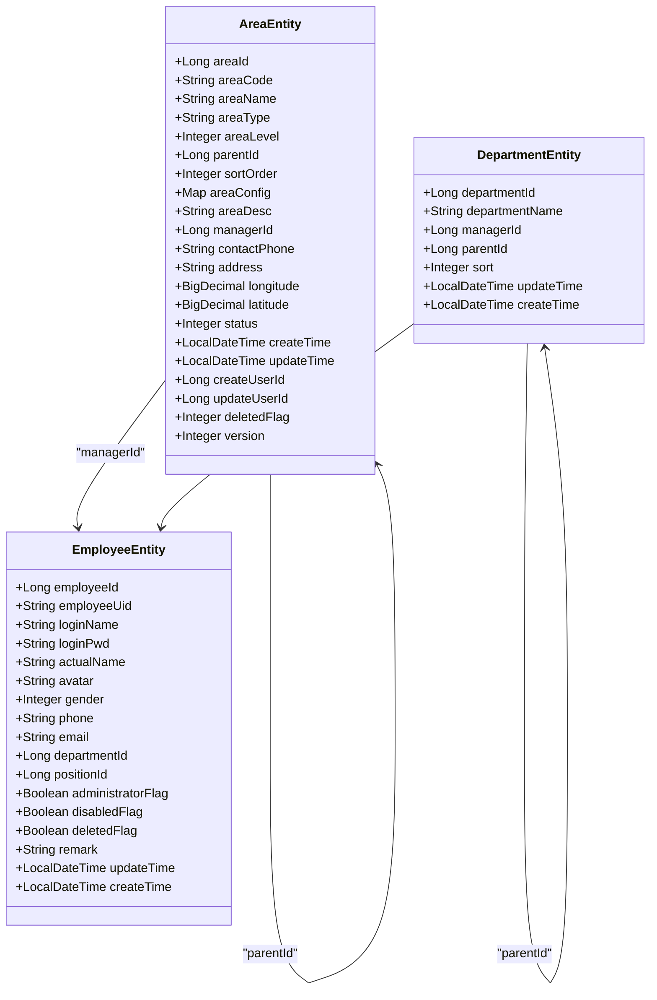
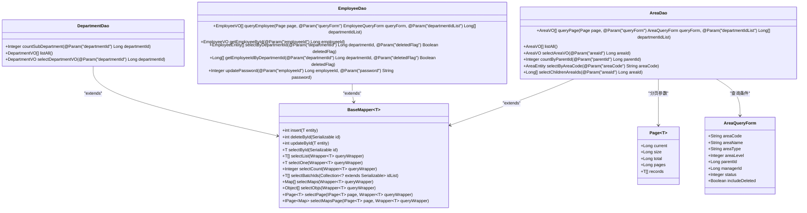
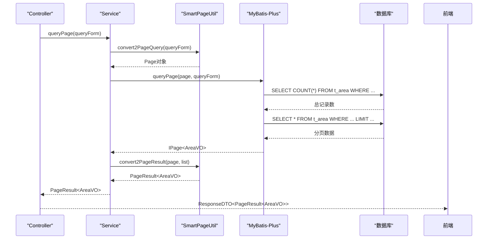
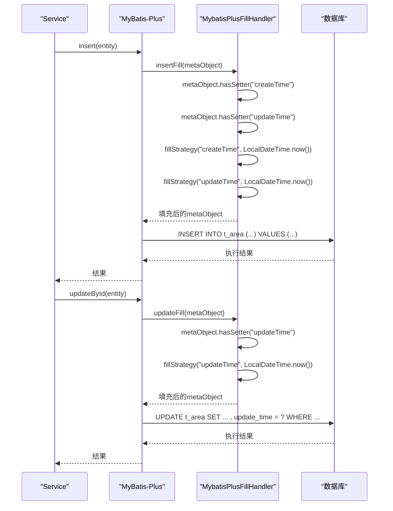

# 数据模型与ORM

<cite>
**本文档引用的文件**
- [AreaEntity.java](file://smart-admin-api-java17-springboot3\sa-admin\src\main\java\net\lab1024\sa\admin\module\system\area\domain\entity\AreaEntity.java)
- [DepartmentEntity.java](file://smart-admin-api-java17-springboot3\sa-admin\src\main\java\net\lab1024\sa\admin\module\system\department\domain\entity\DepartmentEntity.java)
- [EmployeeEntity.java](file://smart-admin-api-java17-springboot3\sa-admin\src\main\java\net\lab1024\sa\admin\module\system\employee\domain\entity\EmployeeEntity.java)
- [AreaMapper.xml](file://smart-admin-api-java17-springboot3\sa-admin\src\main\resources\mapper\system\area\AreaMapper.xml)
- [MybatisPlusConfig.java](file://smart-admin-api-java17-springboot3\sa-base\src\main\java\net\lab1024\sa\base\config\MybatisPlusConfig.java)
- [MybatisPlusFillHandler.java](file://smart-admin-api-java17-springboot3\sa-base\src\main\java\net\lab1024\sa\base\handler\MybatisPlusFillHandler.java)
- [PageResult.java](file://smart-admin-api-java17-springboot3\sa-base\src\main\java\net\lab1024\sa\base\common\domain\PageResult.java)
- [ResponseDTO.java](file://smart-admin-api-java17-springboot3\sa-base\src\main\java\net\lab1024\sa\base\common\domain\ResponseDTO.java)
</cite>

## 目录
1. [引言](#引言)
2. [核心实体类设计](#核心实体类设计)
3. [MyBatis-Plus注解详解](#mybatis-plus注解详解)
4. [DAO层接口设计](#dao层接口设计)
5. [MyBatis XML映射文件](#mybatis-xml映射文件)
6. [分页查询实现](#分页查询实现)
7. [统一响应处理](#统一响应处理)
8. [数据填充机制](#数据填充机制)
9. [最佳实践与优化](#最佳实践与优化)
10. [总结](#总结)

## 引言

IOE-DREAM项目采用MyBatis-Plus作为持久层框架，实现了高效的数据访问和对象关系映射。本项目通过注解驱动的方式简化了数据库操作，同时保持了MyBatis的灵活性。系统中的核心实体类如AreaEntity、DepartmentEntity和EmployeeEntity等，通过MyBatis-Plus的注解与数据库表建立了精确的映射关系。

项目采用了分层架构设计，包括实体层（Entity）、数据访问层（DAO）、服务层（Service）和控制层（Controller），各层职责分明。实体类位于`module/system`模块下的`domain/entity`包中，DAO接口位于`dao`包中，通过MyBatis-Plus的BaseMapper继承实现了基本的CRUD操作。

MyBatis-Plus的配置在`sa-base`模块中统一管理，通过`MybatisPlusConfig`类配置了分页插件等核心功能。这种集中式配置方式确保了整个项目的数据访问行为一致性，同时也便于维护和升级。

**Section sources**
- [AreaEntity.java](file://smart-admin-api-java17-springboot3\sa-admin\src\main\java\net\lab1024\sa\admin\module\system\area\domain\entity\AreaEntity.java#L1-L132)
- [DepartmentEntity.java](file://smart-admin-api-java17-springboot3\sa-admin\src\main\java\net\lab1024\sa\admin\module\system\department\domain\entity\DepartmentEntity.java#L1-L65)
- [EmployeeEntity.java](file://smart-admin-api-java17-springboot3\sa-admin\src\main\java\net\lab1024\sa\admin\module\system\employee\domain\entity\EmployeeEntity.java#L1-L103)

## 核心实体类设计

IOE-DREAM项目中的核心实体类设计遵循了清晰的业务语义和规范的编码标准。AreaEntity、DepartmentEntity和EmployeeEntity三个核心实体类构成了系统的基础数据模型，它们之间通过外键关系建立了完整的组织架构体系。

AreaEntity实体类代表区域信息，包含区域ID、编码、名称、类型、层级等属性，支持多级区域管理。该实体还包含地理信息（经度、纬度）、联系信息（电话、地址）以及状态管理（启用/禁用、删除标志）等字段，满足了复杂区域管理的需求。特别的是，AreaEntity通过`areaConfig`字段使用JacksonTypeHandler实现了JSON数据的存储和读取，为区域配置提供了灵活的扩展能力。

DepartmentEntity实体类代表部门信息，包含部门ID、名称、负责人、父级部门等属性。该实体通过`managerId`字段与EmployeeEntity建立关联，表示部门负责人。同时，通过`parentId`字段实现部门的树形结构管理，支持无限层级的组织架构。

EmployeeEntity实体类代表员工信息，包含员工ID、登录账号、姓名、联系方式、部门归属等属性。该实体通过`departmentId`字段与DepartmentEntity建立关联，形成员工与部门的关系。同时，包含性别、头像、邮箱等个人信息字段，以及管理员标志、禁用标志等权限控制字段。



**Diagram sources**
- [AreaEntity.java](file://smart-admin-api-java17-springboot3\sa-admin\src\main\java\net\lab1024\sa\admin\module\system\area\domain\entity\AreaEntity.java#L20-L131)
- [DepartmentEntity.java](file://smart-admin-api-java17-springboot3\sa-admin\src\main\java\net\lab1024\sa\admin\module\system\department\domain\entity\DepartmentEntity.java#L21-L64)
- [EmployeeEntity.java](file://smart-admin-api-java17-springboot3\sa-admin\src\main\java\net\lab1024\sa\admin\module\system\employee\domain\entity\EmployeeEntity.java#L19-L102)

**Section sources**
- [AreaEntity.java](file://smart-admin-api-java17-springboot3\sa-admin\src\main\java\net\lab1024\sa\admin\module\system\area\domain\entity\AreaEntity.java#L1-L132)
- [DepartmentEntity.java](file://smart-admin-api-java17-springboot3\sa-admin\src\main\java\net\lab1024\sa\admin\module\system\department\domain\entity\DepartmentEntity.java#L1-L65)
- [EmployeeEntity.java](file://smart-admin-api-java17-springboot3\sa-admin\src\main\java\net\lab1024\sa\admin\module\system\employee\domain\entity\EmployeeEntity.java#L1-L103)

## MyBatis-Plus注解详解

IOE-DREAM项目充分利用了MyBatis-Plus提供的注解来简化实体类与数据库表的映射配置。这些注解不仅减少了XML配置的复杂性，还提高了代码的可读性和维护性。

`@TableName`注解用于指定实体类对应的数据库表名。在AreaEntity中，`@TableName(value = "t_area", autoResultMap = true)`明确指定了该实体映射到`t_area`表，并启用了自动结果映射功能。autoResultMap设置为true时，MyBatis-Plus会自动生成基本的结果映射，减少了手动配置的工作量。

`@TableId`注解用于标识主键字段。在AreaEntity、DepartmentEntity和EmployeeEntity中，主键字段都使用了`@TableId(type = IdType.AUTO)`注解，表示主键为自增类型。IdType枚举提供了多种主键策略，包括AUTO（数据库自增）、NONE（无状态）、INPUT（用户输入）等，满足了不同场景的需求。

`@TableField`注解用于配置非主键字段的映射关系。在AreaEntity中，`areaConfig`字段使用了`@TableField(typeHandler = JacksonTypeHandler.class)`注解，指定了使用JacksonTypeHandler来处理JSON类型的转换。这使得Java的Map对象可以直接映射到数据库的JSON字段，实现了复杂数据结构的持久化。

此外，`@TableField`还支持更新策略配置。在DepartmentEntity中，`managerId`字段使用了`@TableField(updateStrategy = FieldStrategy.NEVER)`注解，表示该字段在更新时永远不会被更新。这种策略适用于某些业务场景，如部门负责人变更需要特殊流程处理，不能通过常规的更新操作修改。

```mermaid
classDiagram
class MyBatisPlusAnnotations {
+@TableName
+@TableId
+@TableField
+@KeySequence
+@Version
+@EnumValue
+@TableLogic
}
MyBatisPlusAnnotations --> @TableName : "表名映射"
MyBatisPlusAnnotations --> @TableId : "主键标识"
MyBatisPlusAnnotations --> @TableField : "字段映射"
MyBatisPlusAnnotations --> @Version : "乐观锁"
MyBatisPlusAnnotations --> @TableLogic : "逻辑删除"
class AreaEntity {
+@TableName("t_area")
+@TableId(type = IdType.AUTO)
+@TableField(typeHandler = JacksonTypeHandler.class)
}
class DepartmentEntity {
+@TableName("t_department")
+@TableId(type = IdType.AUTO)
+@TableField(updateStrategy = FieldStrategy.NEVER)
}
class EmployeeEntity {
+@TableName("t_employee")
+@TableId(type = IdType.AUTO)
}
AreaEntity --> MyBatisPlusAnnotations
DepartmentEntity --> MyBatisPlusAnnotations
EmployeeEntity --> MyBatisPlusAnnotations
```

**Diagram sources**
- [AreaEntity.java](file://smart-admin-api-java17-springboot3\sa-admin\src\main\java\net\lab1024\sa\admin\module\system\area\domain\entity\AreaEntity.java#L20-L21)
- [DepartmentEntity.java](file://smart-admin-api-java17-springboot3\sa-admin\src\main\java\net\lab1024\sa\admin\module\system\department\domain\entity\DepartmentEntity.java#L21-L27)
- [EmployeeEntity.java](file://smart-admin-api-java17-springboot3\sa-admin\src\main\java\net\lab1024\sa\admin\module\system\employee\domain\entity\EmployeeEntity.java#L19-L20)

**Section sources**
- [AreaEntity.java](file://smart-admin-api-java17-springboot3\sa-admin\src\main\java\net\lab1024\sa\admin\module\system\area\domain\entity\AreaEntity.java#L1-L132)
- [DepartmentEntity.java](file://smart-admin-api-java17-springboot3\sa-admin\src\main\java\net\lab1024\sa\admin\module\system\department\domain\entity\DepartmentEntity.java#L1-L65)

## DAO层接口设计

IOE-DREAM项目的DAO层接口设计遵循了MyBatis-Plus的最佳实践，通过继承BaseMapper接口获得了基本的CRUD操作能力，同时根据业务需求定义了特定的查询方法。这种设计模式既保证了代码的简洁性，又提供了足够的灵活性来满足复杂的业务查询需求。

DAO接口位于各个模块的`dao`包中，以`XxxDao`命名，如AreaDao、DepartmentDao和EmployeeDao。每个DAO接口都使用`@Mapper`注解标识，这是MyBatis框架识别DAO接口的必要注解。通过`@Resource`注解在Service层注入DAO实例，实现了依赖注入和松耦合设计。

BaseMapper接口提供了丰富的通用方法，包括`insert`、`deleteById`、`updateById`、`selectById`等，覆盖了大部分基础的数据操作需求。在此基础上，项目根据具体业务场景扩展了特定的查询方法。例如，在EmployeeDao中定义了`getEmployeeById`、`selectByDepartmentId`等方法，满足了员工管理的特定查询需求。

DAO接口中的方法参数使用`@Param`注解进行命名，这在多参数方法中尤为重要。`@Param`注解不仅提高了代码的可读性，还在MyBatis的SQL映射中提供了参数引用的名称。例如，在EmployeeDao的`queryEmployee`方法中，`@Param("queryForm")`和`@Param("departmentIdList")`清晰地标识了方法参数的用途。



**Diagram sources**
- [AreaDao.java](file://smart-admin-api-java17-springboot3\sa-admin\src\main\java\net\lab1024\sa\admin\module\system\area\dao\AreaDao.java#L20-L35)
- [DepartmentDao.java](file://smart-admin-api-java17-springboot3\sa-admin\src\main\java\net\lab1024\sa\admin\module\system\department\dao\DepartmentDao.java#L20-L35)
- [EmployeeDao.java](file://smart-admin-api-java17-springboot3\sa-admin\src\main\java\net\lab1024\sa\admin\module\system\employee\dao\EmployeeDao.java#L24-L110)

**Section sources**
- [DepartmentDao.java](file://smart-admin-api-java17-springboot3\sa-admin\src\main\java\net\lab1024\sa\admin\module\system\department\dao\DepartmentDao.java#L1-L36)
- [EmployeeDao.java](file://smart-admin-api-java17-springboot3\sa-admin\src\main\java\net\lab1024\sa\admin\module\system\employee\dao\EmployeeDao.java#L1-L111)

## MyBatis XML映射文件

IOE-DREAM项目中的MyBatis XML映射文件位于`resources/mapper`目录下，按照模块进行组织。这些XML文件定义了复杂的SQL查询语句，特别是那些无法通过MyBatis-Plus的Wrapper条件构造器实现的查询逻辑。XML映射文件与DAO接口通过namespace属性建立关联，确保了SQL语句的正确执行。

XML映射文件遵循了标准化的结构，包含`<mapper>`根元素、`<resultMap>`结果映射、`<sql>`可复用SQL片段和`<select>`、`<insert>`、`<update>`、`<delete>`等SQL语句元素。这种结构化的组织方式提高了SQL语句的可维护性和可读性。

在AreaMapper.xml中，定义了多个`<sql>`片段来复用常用的SQL代码。`AreaColumns`片段定义了区域表的查询列，`AreaFromClause`片段定义了FROM子句和JOIN关联，`AreaWhereClause`片段定义了WHERE条件。这些片段通过`<include refid="..."/>`进行引用，避免了SQL代码的重复，提高了代码的复用性。

动态SQL是XML映射文件的核心特性。通过`<if>`、`<choose>`、`<when>`、`<otherwise>`、`<where>`、`<set>`、`<foreach>`等标签，实现了条件化SQL语句的生成。例如，在`AreaWhereClause`中，多个`<if>`标签根据查询参数的存在与否动态添加WHERE条件，实现了灵活的查询过滤。

```mermaid
flowchart TD
A["AreaMapper.xml"] --> B["<mapper namespace=\"net.lab1024.sa.admin.module.system.area.dao.AreaDao\">"]
B --> C["<resultMap id=\"AreaVOMap\" type=\"AreaVO\">"]
C --> C1["<id property=\"areaId\" column=\"area_id\"/>"]
C --> C2["<result property=\"areaName\" column=\"area_name\"/>"]
C --> C3["<result property=\"managerName\" column=\"manager_name\"/>"]
C --> C4["<result property=\"areaConfig\" column=\"area_config\" typeHandler=\"JacksonTypeHandler\"/>"]
B --> D["<sql id=\"AreaColumns\">"]
D --> D1["a.area_id,"]
D --> D2["a.area_name,"]
D --> D3["me.actual_name as manager_name,"]
B --> E["<sql id=\"AreaFromClause\">"]
E --> E1["FROM t_area a"]
E --> E2["LEFT JOIN t_employee me ON a.manager_id = me.employee_id"]
B --> F["<sql id=\"AreaWhereClause\">"]
F --> F1["<where>"]
F1 --> F11["<if test=\"queryForm.areaCode != null and queryForm.areaCode != ''\">"]
F11 --> F111["AND a.area_code LIKE CONCAT('%', #{queryForm.areaCode}, '%')"]
F1 --> F12["<if test=\"queryForm.areaName != null and queryForm.areaName != ''\">"]
F12 --> F121["AND a.area_name LIKE CONCAT('%', #{queryForm.areaName}, '%')"]
F1 --> F13["<if test=\"queryForm.parentId != null\">"]
F13 --> F131["AND a.parent_id = #{queryForm.parentId}"]
B --> G["<select id=\"queryPage\" resultMap=\"AreaVOMap\">"]
G --> G1["SELECT"]
G --> G2["<include refid=\"AreaColumns\"/>"]
G --> G3["<include refid=\"AreaFromClause\"/>"]
G --> G4["<include refid=\"AreaWhereClause\"/>"]
G --> G5["ORDER BY a.sort_order ASC, a.create_time DESC"]
B --> H["<select id=\"selectAreaVO\" resultMap=\"AreaVOMap\">"]
H --> H1["SELECT"]
H --> H2["<include refid=\"AreaColumns\"/>"]
H --> H3["<include refid=\"AreaFromClause\"/>"]
H --> H4["WHERE a.area_id = #{areaId} AND a.deleted_flag = 0"]
B --> I["<select id=\"selectChildrenAreaIds\" resultType=\"java.lang.Long\">"]
I --> I1["WITH RECURSIVE area_tree AS ("]
I1 --> I11["SELECT area_id, parent_id FROM t_area WHERE area_id = #{areaId} AND deleted_flag = 0"]
I1 --> I12["UNION ALL"]
I1 --> I13["SELECT a.area_id, a.parent_id FROM t_area a INNER JOIN area_tree at ON a.parent_id = at.area_id WHERE a.deleted_flag = 0"]
I --> I2["SELECT area_id FROM area_tree WHERE area_id != #{areaId}"]
```

**Diagram sources**
- [AreaMapper.xml](file://smart-admin-api-java17-springboot3\sa-admin\src\main\resources\mapper\system\area\AreaMapper.xml#L1-L160)

**Section sources**
- [AreaMapper.xml](file://smart-admin-api-java17-springboot3\sa-admin\src\main\resources\mapper\system\area\AreaMapper.xml#L1-L160)

## 分页查询实现

IOE-DREAM项目中的分页查询实现基于MyBatis-Plus的分页插件，结合自定义的分页参数和结果封装类，提供了一套完整的分页解决方案。这套方案不仅支持基本的分页功能，还支持排序、条件查询等高级特性。

分页功能的核心是`MybatisPlusConfig`类中的`paginationInterceptor`方法，该方法配置了MyBatis-Plus的分页拦截器。拦截器针对MySQL数据库进行了优化，能够自动识别分页查询并生成相应的LIMIT语句。当执行分页查询时，拦截器会先执行COUNT查询获取总记录数，然后再执行实际的数据查询。

分页参数通过`PageParam`类进行封装，包含`pageNum`（当前页码）、`pageSize`（每页数量）、`searchCount`（是否查询总条数）和`sortItemList`（排序字段集合）等属性。这些参数通过`@RequestBody`注解从HTTP请求中接收，并在Service层转换为MyBatis-Plus的Page对象。

分页结果通过`PageResult`类进行封装，包含`pageNum`、`pageSize`、`total`（总记录数）、`pages`（总页数）和`list`（结果集）等属性。`SmartPageUtil`工具类提供了`convert2PageQuery`和`convert2PageResult`方法，用于在PageParam和Page对象之间进行转换，以及将MyBatis-Plus的分页结果转换为PageResult对象。



**Diagram sources**
- [MybatisPlusConfig.java](file://smart-admin-api-java17-springboot3\sa-base\src\main\java\net\lab1024\sa\base\config\MybatisPlusConfig.java#L26-L31)
- [PageParam.java](file://smart-admin-api-java17-springboot3\sa-base\src\main\java\net\lab1024\sa\base\common\domain\PageParam.java#L1-L48)
- [PageResult.java](file://smart-admin-api-java17-springboot3\sa-base\src\main\java\net\lab1024\sa\base\common\domain\PageResult.java#L1-L53)
- [SmartPageUtil.java](file://smart-admin-api-java17-springboot3\sa-base\src\main\java\net\lab1024\sa\base\common\util\SmartPageUtil.java#L72-L101)

**Section sources**
- [MybatisPlusConfig.java](file://smart-admin-api-java17-springboot3\sa-base\src\main\java\net\lab1024\sa\base\config\MybatisPlusConfig.java#L1-L34)
- [PageResult.java](file://smart-admin-api-java17-springboot3\sa-base\src\main\java\net\lab1024\sa\base\common\domain\PageResult.java#L1-L53)

## 统一响应处理

IOE-DREAM项目通过`ResponseDTO`类实现了统一的API响应格式，确保了前后端交互的一致性和规范性。这种统一的响应结构不仅提高了接口的可预测性，还简化了前端的错误处理逻辑。

`ResponseDTO`类包含`code`（返回码）、`level`（级别）、`msg`（消息）、`ok`（是否成功）、`data`（返回数据）和`dataType`（数据类型）等属性。其中，`code`为0表示操作成功，非0表示操作失败；`ok`为true表示成功，false表示失败；`data`字段用于携带实际的业务数据，如分页结果、单个实体或简单值。

项目提供了静态工厂方法来简化`ResponseDTO`的创建。`ok()`方法创建一个成功的响应，`ok(T data)`方法创建一个携带数据的成功响应，`userErrorParam()`方法创建一个用户参数错误的响应。这些工厂方法大大减少了重复代码，提高了开发效率。

在Controller层，每个API方法都返回`ResponseDTO`对象。例如，分页查询方法返回`ResponseDTO<PageResult<XxxVO>>`，单个实体查询方法返回`ResponseDTO<XxxVO>`，操作结果方法返回`ResponseDTO<String>`。这种一致的返回类型使得前端可以使用统一的拦截器来处理所有API响应。

```mermaid
classDiagram
class ResponseDTO~T~ {
+Integer code
+String level
+String msg
+Boolean ok
+T data
+Integer dataType
+static final int OK_CODE = 0
+static final String OK_MSG = "操作成功"
+ResponseDTO(Integer code, String level, boolean ok, String msg, T data)
+ResponseDTO(ErrorCode errorCode, boolean ok, String msg, T data)
+static <T> ResponseDTO~T~ ok()
+static <T> ResponseDTO~T~ ok(T data)
+static <T> ResponseDTO~T~ okMsg(String msg)
+static <T> ResponseDTO~T~ userErrorParam()
+static <T> ResponseDTO~T~ userErrorParam(String msg)
+static <T> ResponseDTO~T~ error(ErrorCode errorCode)
+static <T> ResponseDTO~T~ error(ErrorCode errorCode, String msg)
}
class PageResult~T~ {
+Long pageNum
+Long pageSize
+Long total
+Long pages
+T[] list
+Boolean emptyFlag
}
class AreaVO {
+Long areaId
+String areaCode
+String areaName
+String areaType
+Integer areaLevel
+Long parentId
+String managerName
+String createUserName
+String updateUserName
}
class ErrorCode {
+Integer code
+String level
+String msg
}
ResponseDTO~PageResult~AreaVO~~ --> PageResult~AreaVO~ : "泛型"
ResponseDTO~AreaVO~ --> AreaVO : "泛型"
ResponseDTO~String~ --> String : "泛型"
ResponseDTO~T~ --> ErrorCode : "错误码"
class Controller {
+ResponseDTO~PageResult~AreaVO~~ queryPage(@RequestBody AreaQueryForm queryForm)
+ResponseDTO~AreaVO~ getAreaById(@RequestBody Long areaId)
+ResponseDTO~String~ addArea(@RequestBody AreaAddForm addForm)
+ResponseDTO~String~ updateArea(@RequestBody AreaUpdateForm updateForm)
+ResponseDTO~String~ deleteArea(@RequestBody Long areaId)
}
Controller --> ResponseDTO~PageResult~AreaVO~~
Controller --> ResponseDTO~AreaVO~
Controller --> ResponseDTO~String~
```

**Diagram sources**
- [ResponseDTO.java](file://smart-admin-api-java17-springboot3\sa-base\src\main\java\net\lab1024\sa\base\common\domain\ResponseDTO.java#L1-L121)
- [PageResult.java](file://smart-admin-api-java17-springboot3\sa-base\src\main\java\net\lab1024\sa\base\common\domain\PageResult.java#L1-L53)

**Section sources**
- [ResponseDTO.java](file://smart-admin-api-java17-springboot3\sa-base\src\main\java\net\lab1024\sa\base\common\domain\ResponseDTO.java#L1-L121)

## 数据填充机制

IOE-DREAM项目通过`MybatisPlusFillHandler`类实现了自动化的数据填充机制，解决了创建时间和更新时间等字段的自动维护问题。这种机制不仅减少了开发者的手动操作，还确保了这些重要字段的一致性和准确性。

`MybatisPlusFillHandler`实现了MyBatis-Plus的`MetaObjectHandler`接口，重写了`insertFill`和`updateFill`方法。在插入记录时，`insertFill`方法会自动为`createTime`和`updateTime`字段设置当前时间；在更新记录时，`updateFill`方法会自动为`updateTime`字段更新为当前时间。

这种数据填充机制基于MyBatis-Plus的元对象处理器，通过反射机制在SQL执行前动态修改实体对象的属性值。处理器首先检查实体类是否包含指定的字段（如`createTime`和`updateTime`），如果存在则进行填充。这种方式具有很好的通用性，可以应用于所有包含这些字段的实体类，而无需在每个Service方法中手动设置。

数据填充机制的实现还考虑了性能优化。通过`hasSetter`方法检查字段是否存在，避免了不必要的反射操作。同时，使用`fillStrategy`方法进行填充，确保了填充逻辑的统一性和可扩展性。



**Diagram sources**
- [MybatisPlusFillHandler.java](file://smart-admin-api-java17-springboot3\sa-base\src\main\java\net\lab1024\sa\base\handler\MybatisPlusFillHandler.java#L1-L41)

**Section sources**
- [MybatisPlusFillHandler.java](file://smart-admin-api-java17-springboot3\sa-base\src\main\java\net\lab1024\sa\base\handler\MybatisPlusFillHandler.java#L1-L41)

## 最佳实践与优化

IOE-DREAM项目在数据模型与ORM实现中采用了多项最佳实践和优化策略，确保了系统的高性能、可维护性和可扩展性。这些实践涵盖了从实体设计到查询优化的各个方面。

代码生成器是项目的一大亮点。通过`code-generator-template`模板，项目实现了DAO、Service、Controller等组件的自动化生成。这种代码生成策略不仅提高了开发效率，还确保了代码风格的一致性。模板中包含了分页查询、假删除等通用功能的预置代码，减少了重复劳动。

逻辑删除而非物理删除是项目遵循的重要原则。通过`deletedFlag`字段实现逻辑删除，保留了数据的历史记录，支持数据恢复和审计需求。在查询时，默认添加`AND deleted_flag = 0`条件过滤已删除的记录，确保业务数据的纯净性。

查询优化方面，项目采用了多种策略。对于复杂的关联查询，使用XML映射文件定义JOIN语句，避免了N+1查询问题。对于树形结构查询，如区域的递归查询，使用了MySQL的CTE（Common Table Expression）特性，通过`WITH RECURSIVE`语句高效地获取子区域列表。

缓存策略也是性能优化的重要组成部分。虽然在当前分析中未直接看到缓存实现，但项目结构中的`cache`模块表明了缓存机制的存在。合理的缓存策略可以显著减少数据库访问压力，提高系统响应速度。

```mermaid
flowchart TD
A["最佳实践与优化"] --> B["代码生成器"]
A --> C["逻辑删除"]
A --> D["查询优化"]
A --> E["缓存策略"]
A --> F["事务管理"]
A --> G["数据校验"]
B --> B1["DAO模板"]
B --> B2["Service模板"]
B --> B3["Controller模板"]
B --> B4["VO/QueryForm模板"]
C --> C1["deletedFlag字段"]
C --> C2["查询时过滤"]
C --> C3["假删除操作"]
D --> D1["JOIN关联查询"]
D --> D2["CTE递归查询"]
D --> D3["索引优化"]
D --> D4["分页查询"]
E --> E1["Redis缓存"]
E --> E2["本地缓存"]
E --> E3["缓存穿透处理"]
F --> F1["@Transactional注解"]
F --> F2["事务传播行为"]
F --> F3["事务隔离级别"]
G --> G1["JSR-303校验"]
G --> G2["自定义校验"]
G --> G3["参数校验"]
classDef practice fill:#e1f5fe,stroke:#039be5;
classDef detail fill:#f3f3f3,stroke:#9e9e9e;
class A practice
class B,C,D,E,F,G practice
class B1,B2,B3,B4,C1,C2,C3,D1,D2,D3,D4,E1,E2,E3,F1,F2,F3,G1,G2,G3 detail
```



**Diagram sources**
- [Dao.java.vm](file://smart-admin-api-java17-springboot3\sa-base\src\main\resources\code-generator-template\java\dao\Dao.java.vm#L1-L51)
- [Mapper.xml.vm](file://smart-admin-api-java17-springboot3\sa-base\src\main\resources\code-generator-template\java\mapper\Mapper.xml.vm#L1-L76)
- [AreaMapper.xml](file://smart-admin-api-java17-springboot3\sa-admin\src\main\resources\mapper\system\area\AreaMapper.xml#L1-L160)

**Section sources**
- [Dao.java.vm](file://smart-admin-api-java17-springboot3\sa-base\src\main\resources\code-generator-template\java\dao\Dao.java.vm#L1-L51)
- [Mapper.xml.vm](file://smart-admin-api-java17-springboot3\sa-base\src\main\resources\code-generator-template\java\mapper\Mapper.xml.vm#L1-L76)

## 总结

IOE-DREAM项目的数据模型与ORM实现展现了现代化Java企业应用的最佳实践。通过MyBatis-Plus框架的深度集成，项目实现了高效、灵活且易于维护的数据访问层。核心实体类的设计充分考虑了业务需求和扩展性，通过合理的注解配置实现了与数据库表的精确映射。

DAO层接口的设计遵循了分层架构原则，通过继承BaseMapper获得了基本的CRUD能力，同时根据业务需求扩展了特定的查询方法。XML映射文件的使用解决了复杂查询的需求，特别是递归查询和多表关联查询，展示了MyBatis强大的SQL控制能力。

分页查询和统一响应处理机制为前后端交互提供了标准化的解决方案。`PageResult`和`ResponseDTO`类的封装不仅提高了接口的规范性，还简化了前端的处理逻辑。数据填充机制的实现自动化了创建时间和更新时间的管理，减少了人为错误的可能性。

项目的代码生成器和模板机制显著提高了开发效率，确保了代码风格的一致性。逻辑删除、查询优化等最佳实践的应用，保证了系统的高性能和数据完整性。整体而言，IOE-DREAM项目的数据访问层设计合理、实现完善，为系统的稳定运行和持续发展奠定了坚实的基础。