# 智能区域管理系统

> **版本**: v3.5.4
> **更新时间**: 2025-11-13
> **分类**: 核心功能模块 > 企业OA系统 > 一卡通消费系统
> **标签**: ["区域管理", "智能分配", "空间规划", "层级结构", "移动端管理"]
> **作者**: SmartAdmin规范治理委员会
> **技术栈**: Spring Boot 3.5.4 + Java 17 + PostgreSQL 14+ + Redis 7.0
> **描述**: IOE-DREAM智慧园区一卡通管理平台的智能区域管理系统，支持无限层级结构和多业务场景适配

## 📋 系统概述

### 核心功能

**智能区域管理系统**是IOE-DREAM智慧园区一卡通管理平台消费系统的核心基础模块，负责统一管理园区内的各种消费区域和空间资源。基于Spring Boot 3.5.4 + Java 17架构，支持无限层级结构、智能区域分配、多业务场景适配和实时空间规划。

### 主要特性

- ✅ **无限层级结构**: 支持园区→楼栋→楼层→区域的多级树形结构
- ✅ **智能区域分配**: 基于AI算法的最优区域分配和负载均衡
- ✅ **多场景适配**: 支持餐饮、零售、办公、医疗等多种业务场景
- ✅ **实时空间规划**: 基于人流数据的动态空间调整
- ✅ **地理围栏**: GPS定位和电子围栏技术
- ✅ **移动端管理**: 全功能移动端区域管理
- ✅ **可视化分析**: 丰富的图表和3D可视化展示
- ✅ **智能推荐**: 基于用户行为模式的个性化区域推荐

## 🏗️ 技术架构

### 核心技术栈
- **后端框架**: Spring Boot 3.5.4 + Java 17
- **数据库**: PostgreSQL 14+ + PostGIS (空间数据库) + Redis 7.0
- **搜索引擎**: Elasticsearch 8.10 (全文检索)
- **地理服务**: PostGIS 3.3 + GeoServer
- **机器学习**: Apache Spark MLlib + scikit-learn
- **实时计算**: Apache Kafka 3.5 + Apache Flink
- **可视化**: Apache ECharts + Mapbox GL + Three.js

### 微服务架构设计
```java
@RestController
@RequestMapping("/api/v1/area-management")
@Tag(name = "智能区域管理", description = "智能区域管理相关接口")
@SecurityRequirement(name = "bearerAuth")
public class IntelligentAreaManagementController {

    @Resource
    private AreaService areaService;

    @Resource
    private IntelligentAllocationService allocationService;

    @Resource
    private SpatialPlanningService planningService;
}
```

## 🗄️ 数据库设计

### 1. 智能区域主表 (t_smart_area)
```sql
CREATE TABLE t_smart_area (
    area_id BIGSERIAL PRIMARY KEY,
    area_code VARCHAR(50) NOT NULL UNIQUE,
    area_name VARCHAR(200) NOT NULL,
    area_name_en VARCHAR(200),

    -- 层级结构
    parent_area_id BIGINT,
    area_level INTEGER NOT NULL DEFAULT 1,
    area_path TEXT, -- 完整路径，如：园区A/栋B/层C/区D
    full_path_name TEXT,

    -- 基础分类
    area_type VARCHAR(50) NOT NULL, -- PARKING, DINING, RETAIL, OFFICE, MEDICAL
    area_category VARCHAR(50), -- 子分类，如：食堂、超市、会议室
    business_scenario VARCHAR(100), -- 业务场景

    -- 空间信息
    floor_number VARCHAR(20),
    room_number VARCHAR(50),
    building_code VARCHAR(50),
    area_capacity INTEGER, -- 容纳人数
    area_size DECIMAL(10, 2), -- 面积(平方米)

    -- 地理信息
    geometry GEOMETRY(POLYGON, 4326), -- PostGIS几何图形
    center_point GEOMETRY(POINT, 4326), -- 中心点
    geo_fence_enabled BOOLEAN DEFAULT FALSE,
    geo_fence_config JSONB,

    -- 智能配置
    intelligent_config JSONB, -- AI算法配置
    allocation_algorithm VARCHAR(50),
    optimization_parameters JSONB,

    -- 资源配置
    resource_config JSONB, -- 设备、人员等资源配置
    capacity_rules JSONB, -- 容量规则
    load_balance_config JSONB, -- 负载均衡配置

    -- 经营配置
    operation_config JSONB, -- 经营模式配置
    business_hours JSONB, -- 营业时间
    service_types JSONB, -- 服务类型

    -- 状态信息
    area_status VARCHAR(20) DEFAULT 'ACTIVE', -- ACTIVE, INACTIVE, MAINTENANCE
    availability_status VARCHAR(20), -- AVAILABLE, OCCUPIED, RESERVED
    health_score DECIMAL(5, 4), -- 区域健康度评分

    -- 统计信息
    usage_statistics JSONB, -- 使用统计数据
    performance_metrics JSONB, -- 性能指标
    user_satisfaction_score DECIMAL(5, 4),

    -- 多媒体资源
    area_images JSONB, -- 区域图片
    floor_plan_image VARCHAR(500), -- 平面图
    3d_model_url VARCHAR(500), -- 3D模型
    virtual_tour_url VARCHAR(500), -- 虚拟导览

    -- 集成配置
    iot_device_ids JSONB, -- IoT设备ID列表
    sensor_data_config JSONB, -- 传感器数据配置
    external_system_links JSONB, -- 外部系统集成

    -- 审计字段
    create_time TIMESTAMP(6) DEFAULT CURRENT_TIMESTAMP,
    update_time TIMESTAMP(6) DEFAULT CURRENT_TIMESTAMP,
    create_user_id BIGINT,
    update_user_id BIGINT,
    version INTEGER DEFAULT 1,
    deleted_flag SMALLINT DEFAULT 0,

    -- 分区字段
    partition_month VARCHAR(7) GENERATED ALWAYS AS (TO_CHAR(create_time, 'YYYY-MM')) STORED
) PARTITION BY LIST (partition_month);

-- 创建分区
CREATE TABLE t_smart_area_202401 PARTITION OF t_smart_area
    FOR VALUES IN ('2024-01');

-- 创建空间索引
CREATE INDEX idx_smart_area_geometry ON t_smart_area USING GIST(geometry);
CREATE INDEX idx_smart_area_center ON t_smart_area USING GIST(center_point);
CREATE INDEX idx_smart_area_parent ON t_smart_area(parent_area_id);
CREATE INDEX idx_smart_area_type ON t_smart_area(area_type, area_status);
```

### 2. 区域智能分配表 (t_area_intelligent_allocation)
```sql
CREATE TABLE t_area_intelligent_allocation (
    allocation_id BIGSERIAL PRIMARY KEY,
    allocation_code VARCHAR(50) NOT NULL UNIQUE,

    -- 分配配置
    allocation_type VARCHAR(50) NOT NULL, -- EMPLOYEE, RESOURCE, SERVICE
    allocation_scenario VARCHAR(100), -- 分配场景
    optimization_objective VARCHAR(50), -- 优化目标

    -- 目标区域
    target_area_id BIGINT NOT NULL,
    allocation_strategy VARCHAR(50), -- ALGORITHM_BASED, RULE_BASED, AI_BASED

    -- 约束条件
    hard_constraints JSONB, -- 硬约束
    soft_constraints JSONB, -- 软约束
    preference_constraints JSONB, -- 偏好约束

    -- AI模型配置
    ml_model_id VARCHAR(100),
    feature_extractors JSONB,
    model_parameters JSONB,

    -- 分配结果
    allocation_result JSONB, -- 分配结果详情
    optimization_score DECIMAL(15, 8),
    alternative_solutions JSONB,

    -- 影响分析
    impact_analysis JSONB, -- 影响分析结果
    risk_assessment JSONB, -- 风险评估

    -- 执行状态
    allocation_status VARCHAR(20) DEFAULT 'PENDING',
    execution_time TIMESTAMP(6),
    execution_duration_seconds INTEGER,

    -- 用户反馈
    user_feedback JSONB,
    satisfaction_score DECIMAL(5, 4),
    improvement_suggestions JSONB,

    -- 审计字段
    create_time TIMESTAMP(6) DEFAULT CURRENT_TIMESTAMP,
    update_time TIMESTAMP(6) DEFAULT CURRENT_TIMESTAMP,
    create_user_id BIGINT,
    update_user_id BIGINT,
    deleted_flag SMALLINT DEFAULT 0
) DISTRIBUTED BY (allocation_id);

-- 创建索引
CREATE INDEX idx_allocation_target_area ON t_area_intelligent_allocation(target_area_id);
CREATE INDEX idx_allocation_status ON t_area_intelligent_allocation(allocation_status);
CREATE INDEX idx_allocation_score ON t_area_intelligent_allocation(optimization_score DESC);
```

### 3. 区域空间规划表 (t_area_spatial_planning)
```sql
CREATE TABLE t_area_spatial_planning (
    planning_id BIGSERIAL PRIMARY KEY,
    planning_code VARCHAR(50) NOT NULL UNIQUE,

    -- 规划信息
    planning_name VARCHAR(200) NOT NULL,
    planning_type VARCHAR(50) NOT NULL, -- EXPANSION, OPTIMIZATION, REORGANIZATION
    planning_scope JSONB, -- 规划范围

    -- 时间信息
    planning_start_date DATE NOT NULL,
    planning_end_date DATE NOT NULL,
    planning_horizon_months INTEGER,

    -- 目标配置
    target_configuration JSONB, -- 目标配置
    current_configuration JSONB, -- 当前配置

    -- 优化算法
    optimization_algorithm VARCHAR(50) NOT NULL,
    algorithm_parameters JSONB,
    convergence_criteria JSONB,

    -- 空间约束
    spatial_constraints JSONB, -- 空间约束条件
    capacity_constraints JSONB, -- 容量约束
    operational_constraints JSONB, -- 运营约束

    -- 预测数据
    demand_forecast JSONB, -- 需求预测
    utilization_prediction JSONB, -- 利用率预测
    cost_impact_prediction JSONB, -- 成本影响预测

    -- 规划方案
    planning_solutions JSONB, -- 多个规划方案
    recommended_solution JSONB, -- 推荐方案

    -- 实施计划
    implementation_plan JSONB, -- 实施计划
    change_management_plan JSONB, -- 变更管理计划

    -- 执行状态
    planning_status VARCHAR(20) DEFAULT 'PLANNING',
    execution_progress DECIMAL(5, 2) DEFAULT 0.00,
    current_phase VARCHAR(50),

    -- 评估指标
    kpi_metrics JSONB, -- KPI指标
    success_criteria JSONB, -- 成功标准
    roi_estimation DECIMAL(10, 2),

    -- 审计字段
    create_time TIMESTAMP(6) DEFAULT CURRENT_TIMESTAMP,
    update_time TIMESTAMP(6) DEFAULT CURRENT_TIMESTAMP,
    create_user_id BIGINT,
    update_user_id BIGINT,
    deleted_flag SMALLINT DEFAULT 0
) DISTRIBUTED BY (planning_id);

-- 创建索引
CREATE INDEX idx_planning_status ON t_area_spatial_planning(planning_status);
CREATE INDEX idx_planning_dates ON t_area_spatial_planning(planning_start_date, planning_end_date);
```

### 4. 区域使用分析表 (t_area_usage_analytics)
```sql
CREATE TABLE t_area_usage_analytics (
    analytics_id BIGSERIAL PRIMARY KEY,

    -- 分析维度
    area_id BIGINT NOT NULL,
    analysis_date DATE NOT NULL,
    analysis_period VARCHAR(20), -- HOURLY, DAILY, WEEKLY, MONTHLY

    -- 使用指标
    total_visitors INTEGER DEFAULT 0,
    peak_concurrent_visitors INTEGER DEFAULT 0,
    average_stay_duration_minutes DECIMAL(10, 2),
    total_usage_minutes BIGINT DEFAULT 0,

    -- 效率指标
    utilization_rate DECIMAL(5, 4) DEFAULT 0.0000,
    capacity_efficiency_rate DECIMAL(5, 4) DEFAULT 0.0000,
    resource_efficiency_rate DECIMAL(5, 4) DEFAULT 0.0000,

    -- 满意度指标
    user_satisfaction_score DECIMAL(5, 4),
    service_quality_score DECIMAL(5, 4),
    feedback_count INTEGER DEFAULT 0,

    -- 时间分布
    peak_hours JSONB, -- 高峰时段分布
    day_of_week_pattern JSONB, -- 星期分布模式
    seasonal_pattern JSONB, -- 季节性分布模式

    -- 用户行为分析
    user_demographics JSONB, -- 用户人口统计
    behavior_patterns JSONB, -- 行为模式分析
    preference_analysis JSONB, -- 偏好分析

    -- 环境因素
    environmental_factors JSONB, -- 环境因素数据
    weather_impact JSONB, -- 天气影响分析
    event_impact JSONB, -- 事件影响分析

    -- 预测数据
    demand_prediction JSONB, -- 需求预测
    trend_analysis JSONB, -- 趋势分析
    anomaly_detection JSONB, -- 异常检测结果

    -- 改进建议
    optimization_recommendations JSONB, -- 优化建议
    improvement_opportunities JSONB, -- 改进机会
    cost_optimization_suggestions JSONB, -- 成本优化建议

    -- 审计字段
    create_time TIMESTAMP(6) DEFAULT CURRENT_TIMESTAMP,
    update_time TIMESTAMP(6) DEFAULT CURRENT_TIMESTAMP,
    data_source VARCHAR(50) DEFAULT 'SYSTEM', -- SYSTEM, MANUAL, IMPORT
    data_quality_score DECIMAL(5, 4),

    -- 分区字段
    partition_year INTEGER GENERATED ALWAYS AS (EXTRACT(YEAR FROM analysis_date)) STORED
) PARTITION BY RANGE (partition_year);

-- 创建分区
CREATE TABLE t_area_usage_analytics_2024 PARTITION OF t_area_usage_analytics
    FOR VALUES FROM (2024) TO (2025);

-- 创建索引
CREATE INDEX idx_analytics_area_date ON t_area_usage_analytics(area_id, analysis_date);
CREATE INDEX idx_analytics_period ON t_area_usage_analytics(analysis_period, analysis_date);
CREATE INDEX idx_analytics_utilization ON t_area_usage_analytics(utilization_rate DESC);
```

## 🔄 核心业务逻辑

### 1. 智能区域分配引擎
```java
@Service
@Transactional
@Slf4j
public class IntelligentAreaAllocationEngine {

    @Resource
    private AreaService areaService;

    @Resource
    private OptimizationAlgorithmFactory algorithmFactory;

    @Resource
    private ConstraintValidationService constraintValidation;

    @Resource
    private MLPredictionService predictionService;

    /**
     * 执行智能区域分配
     */
    public AllocationResult executeIntelligentAllocation(
            AreaAllocationRequest request) {

        try {
            // 1. 验证分配请求
            AllocationValidationResult validation = validateAllocationRequest(request);
            if (!validation.isValid()) {
                return AllocationResult.rejected(validation.getErrors());
            }

            // 2. 获取可用区域
            List<Area> availableAreas = getAvailableAreas(request);

            // 3. 应用AI预测
            PredictionContext predictionContext = applyAIPrediction(request, availableAreas);

            // 4. 选择优化算法
            OptimizationAlgorithm algorithm = algorithmFactory.createAlgorithm(
                request.getAllocationStrategy());

            // 5. 构建优化问题
            AllocationProblem problem = buildAllocationProblem(request, availableAreas, predictionContext);

            // 6. 执行优化
            OptimizationSolution solution = algorithm.solve(problem);

            // 7. 验证解决方案
            SolutionValidationResult solutionValidation = validateSolution(solution, request);

            // 8. 生成分配结果
            AllocationResult result = generateAllocationResult(solution, solutionValidation);

            // 9. 记录分配过程
            recordAllocationProcess(request, result);

            return result;

        } catch (Exception e) {
            log.error("智能区域分配失败", e);
            throw new AllocationException("区域分配失败", e);
        }
    }

    /**
     * 应用AI预测
     */
    private PredictionContext applyAIPrediction(
            AreaAllocationRequest request,
            List<Area> areas) {

        try {
            // 1. 需求预测
            DemandPrediction demandPrediction = predictionService.predictDemand(
                request.getAllocationType(),
                request.getTimeRange(),
                request.getTargetDemographics());

            // 2. 区域利用率预测
            Map<Long, UtilizationPrediction> utilizationPredictions = new HashMap<>();
            for (Area area : areas) {
                UtilizationPrediction prediction = predictionService.predictUtilization(
                    area.getAreaId(),
                    request.getTimeRange());
                utilizationPredictions.put(area.getAreaId(), prediction);
            }

            // 3. 用户行为预测
            UserBehaviorPrediction behaviorPrediction = predictionService.predictUserBehavior(
                request.getUserPreferences(),
                request.getHistoricalData());

            // 4. 成本效益预测
            CostBenefitPrediction costBenefitPrediction = predictionService.predictCostBenefit(
                request.getBudgetConstraints(),
                areas);

            // 5. 风险评估预测
            RiskAssessmentPrediction riskPrediction = predictionService.predictRisks(
                request.getAllocationType(),
                areas);

            return PredictionContext.builder()
                .demandPrediction(demandPrediction)
                .utilizationPredictions(utilizationPredictions)
                .behaviorPrediction(behaviorPrediction)
                .costBenefitPrediction(costBenefitPrediction)
                .riskPrediction(riskPrediction)
                .confidenceLevel(calculatePredictionConfidence(demandPrediction, utilizationPredictions))
                .build();

        } catch (Exception e) {
            log.warn("AI预测失败，使用默认值", e);
            return PredictionContext.defaultContext();
        }
    }

    /**
     * 构建分配优化问题
     */
    private AllocationProblem buildAllocationProblem(
            AreaAllocationRequest request,
            List<Area> areas,
            PredictionContext predictionContext) {

        try {
            // 1. 构建决策变量
            List<AllocationVariable> variables = buildAllocationVariables(request, areas);

            // 2. 设置目标函数
            List<Objective> objectives = buildObjectives(request, predictionContext);

            // 3. 设置约束条件
            List<Constraint> constraints = buildConstraints(request, areas, predictionContext);

            // 4. 构建优化问题
            return AllocationProblem.builder()
                .variables(variables)
                .objectives(objectives)
                .constraints(constraints)
                .predictionContext(predictionContext)
                .optimizationParameters(request.getOptimizationParameters())
                .timeLimit(request.getTimeLimit())
                .build();

        } catch (Exception e) {
            log.error("构建分配优化问题失败", e);
            throw new AllocationException("优化问题构建失败", e);
        }
    }

    /**
     * 构建分配变量
     */
    private List<AllocationVariable> buildAllocationVariables(
            AreaAllocationRequest request,
            List<Area> areas) {

        List<AllocationVariable> variables = new ArrayList<>();

        for (Area area : areas) {
            // 为每个区域创建分配变量
            AllocationVariable variable = AllocationVariable.builder()
                .variableName("allocation_" + area.getAreaId())
                .areaId(area.getAreaId())
                .areaName(area.getAreaName())
                .capacity(area.getAreaCapacity())
                .currentAllocation(area.getCurrentAllocation())
                .minAllocation(calculateMinAllocation(area, request))
                .maxAllocation(calculateMaxAllocation(area, request))
                .costPerUnit(area.getCostPerUnit())
                .qualityScore(area.getQualityScore())
                .build();

            variables.add(variable);
        }

        return variables;
    }

    /**
     * 构建优化目标
     */
    private List<Objective> buildObjectives(
            AreaAllocationRequest request,
            PredictionContext predictionContext) {

        List<Objective> objectives = new ArrayList<>();

        // 1. 成本最小化目标
        if (request.isCostOptimizationEnabled()) {
            objectives.add(Objective.builder()
                .name("cost_minimization")
                .type(ObjectiveType.MINIMIZE)
                .weight(request.getCostWeight())
                .expression("SUM(allocation * cost_per_unit)")
                .build());
        }

        // 2. 利用率最大化目标
        if (request.isUtilizationOptimizationEnabled()) {
            objectives.add(Objective.builder()
                .name("utilization_maximization")
                .type(ObjectiveType.MAXIMIZE)
                .weight(request.getUtilizationWeight())
                .expression("AVG(allocation / capacity)")
                .build());
        }

        // 3. 用户满意度最大化目标
        if (request.isSatisfactionOptimizationEnabled()) {
            objectives.add(Objective.builder()
                .name("satisfaction_maximization")
                .type(ObjectiveType.MAXIMIZE)
                .weight(request.getSatisfactionWeight())
                .expression("SUM(allocation * user_satisfaction_score)")
                .build());
        }

        // 4. 负载均衡目标
        if (request.isLoadBalancingEnabled()) {
            objectives.add(Objective.builder()
                .name("load_balancing")
                .type(ObjectiveType.MINIMIZE)
                .weight(request.getLoadBalancingWeight())
                .expression("STD_DEV(allocation / capacity)")
                .build());
        }

        return objectives;
    }

    /**
     * 构建约束条件
     */
    private List<Constraint> buildConstraints(
            AreaAllocationRequest request,
            List<Area> areas,
            PredictionContext predictionContext) {

        List<Constraint> constraints = new ArrayList<>();

        // 1. 容量约束
        constraints.add(Constraint.builder()
            .name("capacity_constraint")
            .type(ConstraintType.HARD)
            .expression("allocation <= max_allocation")
            .description("分配数量不能超过最大容量")
            .build());

        // 2. 总需求约束
        constraints.add(Constraint.builder()
            .name("demand_constraint")
            .type(ConstraintType.HARD)
            .expression("SUM(allocation) >= total_demand")
            .description("总分配数量必须满足需求")
            .build());

        // 3. 预算约束
        if (request.getBudgetConstraints() != null) {
            constraints.add(Constraint.builder()
                .name("budget_constraint")
                .type(ConstraintType.HARD)
                .expression("SUM(allocation * cost_per_unit) <= max_budget")
                .description("总成本不能超过预算上限")
                .build());
        }

        // 4. 技能匹配约束
        constraints.add(Constraint.builder()
            .name("skill_match_constraint")
            .type(ConstraintType.SOFT)
            .expression("skill_match_score >= min_skill_score")
            .description("技能匹配分数不能低于最低要求")
            .build());

        // 5. 地理位置约束
        if (request.getLocationConstraints() != null) {
            constraints.add(Constraint.builder()
                .name("location_constraint")
                .type(ConstraintType.HARD)
                .expression("distance(preferred_location, area_location) <= max_distance")
                .description("区域位置不能超过最大距离")
                .build());
        }

        return constraints;
    }
}
```

### 2. 空间规划优化引擎
```java
@Service
@Slf4j
public class SpatialPlanningOptimizationEngine {

    @Resource
    private SpatialAnalyzer spatialAnalyzer;

    @Resource
    private DemandAnalyzer demandAnalyzer;

    @Resource
    private CostAnalyzer costAnalyzer;

    /**
     * 执行空间规划优化
     */
    public PlanningResult executeSpatialOptimization(
            SpatialPlanningRequest request) {

        try {
            // 1. 空间现状分析
            SpatialAnalysisResult currentAnalysis = spatialAnalyzer.analyzeCurrentSpace(
                request.getTargetAreas());

            // 2. 需求分析
            DemandAnalysisResult demandAnalysis = demandAnalyzer.analyzeDemand(
                request.getTimeHorizon(),
                request.getBusinessScenario(),
                request.getGrowthTarget());

            // 3. 空间优化模拟
            List<PlanningScenario> scenarios = generatePlanningScenarios(
                request, currentAnalysis, demandAnalysis);

            // 4. 评估每个场景
            List<ScenarioEvaluation> evaluations = new ArrayList<>();
            for (PlanningScenario scenario : scenarios) {
                ScenarioEvaluation evaluation = evaluateScenario(scenario, request);
                evaluations.add(evaluation);
            }

            // 5. 选择最优方案
            PlanningScenario recommendedScenario = selectOptimalScenario(evaluations);

            // 6. 生成实施计划
            ImplementationPlan implementationPlan = generateImplementationPlan(
                recommendedScenario, currentAnalysis);

            // 7. 成本效益分析
            CostBenefitAnalysis costBenefitAnalysis = costAnalyzer.analyzeCostBenefit(
                currentAnalysis, recommendedScenario, implementationPlan);

            return PlanningResult.builder()
                .currentAnalysis(currentAnalysis)
                .demandAnalysis(demandAnalysis)
                .scenarios(scenarios)
                .evaluations(evaluations)
                .recommendedScenario(recommendedScenario)
                .implementationPlan(implementationPlan)
                .costBenefitAnalysis(costBenefitAnalysis)
                .optimizationScore(calculateOptimizationScore(evaluations))
                .build();

        } catch (Exception e) {
            log.error("空间规划优化失败", e);
            throw new PlanningException("空间规划优化失败", e);
        }
    }

    /**
     * 生成规划场景
     */
    private List<PlanningScenario> generatePlanningScenario(
            SpatialPlanningRequest request,
            SpatialAnalysisResult currentAnalysis,
            DemandAnalysisResult demandAnalysis) {

        List<PlanningScenario> scenarios = new ArrayList<>();

        // 1. 基础扩展场景
        PlanningScenario basicExpansion = PlanningScenario.builder()
            .scenarioName("基础扩展")
            .scenarioType("EXPANSION")
            .description("基于当前需求的基础空间扩展")
            .modifications(generateBasicModifications(demandAnalysis))
            .constraints(request.getBasicConstraints())
            .build();
        scenarios.add(basicExpansion);

        // 2. 优化重组场景
        PlanningScenario optimizationReorganization = PlanningScenario.builder()
            .scenarioName("优化重组")
            .scenarioType("REORGANIZATION")
            .description("优化现有空间布局和功能分配")
            .modifications(generateOptimizationModifications(currentAnalysis, demandAnalysis))
            .constraints(request.getOptimizationConstraints())
            .build();
        scenarios.add(optimizationReorganization);

        // 3. 技术升级场景
        PlanningScenario technologyUpgrade = PlanningScenario.builder()
            .scenarioName("技术升级")
            .scenarioType("UPGRADE")
            .description("引入新技术提升空间效率")
            .modifications(generateTechnologyModifications(request))
            .constraints(request.getUpgradeConstraints())
            .build();
        scenarios.add(technologyUpgrade);

        // 4. 混合策略场景
        PlanningScenario hybridStrategy = PlanningScenario.builder()
            .scenarioName("混合策略")
            .scenarioType("HYBRID")
            .description("结合多种策略的综合方案")
            .modifications(generateHybridModifications(request, currentAnalysis, demandAnalysis))
            .constraints(request.getHybridConstraints())
            .build();
        scenarios.add(hybridStrategy);

        // 5. AI推荐场景
        if (request.isAIEnabled()) {
            PlanningScenario aiRecommended = generateAIRecommendedScenario(
                request, currentAnalysis, demandAnalysis);
            scenarios.add(aiRecommended);
        }

        return scenarios;
    }

    /**
     * 评估场景
     */
    private ScenarioEvaluation evaluateScenario(
            PlanningScenario scenario,
            SpatialPlanningRequest request) {

        try {
            // 1. 空间效率评估
            EfficiencyMetrics efficiencyMetrics = calculateEfficiencyMetrics(scenario);

            // 2. 成本效益评估
            CostBenefitMetrics costBenefitMetrics = calculateCostBenefitMetrics(scenario, request);

            // 3. 可行性评估
            FeasibilityMetrics feasibilityMetrics = calculateFeasibilityMetrics(scenario);

            // 4. 风险评估
            RiskAssessment riskAssessment = assessRisks(scenario);

            // 5. 用户影响评估
            UserImpactAssessment userImpact = assessUserImpact(scenario);

            // 6. 综合评分
            double overallScore = calculateOverallScore(
                efficiencyMetrics, costBenefitMetrics, feasibilityMetrics, userImpact);

            return ScenarioEvaluation.builder()
                .scenario(scenario)
                .efficiencyMetrics(efficiencyMetrics)
                .costBenefitMetrics(costBenefitMetrics)
                .feasibilityMetrics(feasibilityMetrics)
                .riskAssessment(riskAssessment)
                .userImpactAssessment(userImpact)
                .overallScore(overallScore)
                .recommendations(generateRecommendations(scenario, overallScore))
                .build();

        } catch (Exception e) {
            log.error("场景评估失败", e);
            return ScenarioEvaluation.error(scenario.getScenarioName(), e.getMessage());
        }
    }

    /**
     * 计算效率指标
     */
    private EfficiencyMetrics calculateEfficiencyMetrics(PlanningScenario scenario) {

        // 1. 空间利用率
        double spaceUtilization = calculateSpaceUtilization(scenario);

        // 2. 容量效率
        double capacityEfficiency = calculateCapacityEfficiency(scenario);

        // 3. 功能匹配度
        double functionalMatch = calculateFunctionalMatch(scenario);

        // 4. 流线效率
        double workflowEfficiency = calculateWorkflowEfficiency(scenario);

        // 5. 灵活性指标
        double flexibilityScore = calculateFlexibilityScore(scenario);

        return EfficiencyMetrics.builder()
            .spaceUtilization(spaceUtilization)
            .capacityEfficiency(capacityEfficiency)
            .functionalMatch(functionalMatch)
            .workflowEfficiency(workflowEfficiency)
            .flexibilityScore(flexibilityScore)
            .overallEfficiencyScore((spaceUtilization + capacityEfficiency + functionalMatch) / 3.0)
            .build();
    }
}
```

### 3. 实时使用分析引擎
```java
@Service
@Slf4j
public class RealTimeUsageAnalyticsEngine {

    @Resource
    private KafkaTemplate<String, Object> kafkaTemplate;

    @Resource
    private ElasticsearchTemplate elasticsearchTemplate;

    @Resource
    private InfluxDBTemplate influxDBTemplate;

    /**
     * 处理实时使用数据
     */
    @KafkaListener(topics = "area-usage-events")
    public void processUsageEvent(AreaUsageEvent event) {

        try {
            // 1. 数据预处理
            ProcessedUsageData processedData = preprocessUsageData(event);

            // 2. 异常检测
            AnomalyDetectionResult anomalyResult = detectAnomalies(processedData);

            // 3. 实时指标计算
            RealTimeMetrics realTimeMetrics = calculateRealTimeMetrics(processedData);

            // 4. 预测更新
            PredictionUpdateResult predictionUpdate = updatePredictions(processedData);

            // 5. 存储到时序数据库
            storeToInfluxDB(processedData, realTimeMetrics);

            // 6. 索引到Elasticsearch
            indexToElasticsearch(processedData);

            // 7. 发布分析结果
            publishAnalyticsResult(processedData, realTimeMetrics, anomalyResult);

            // 8. 触发实时响应
            triggerRealTimeResponse(processedData, anomalyResult);

        } catch (Exception e) {
            log.error("实时使用数据分析失败", e);
            throw new AnalyticsException("实时分析失败", e);
        }
    }

    /**
     * 异常检测
     */
    private AnomalyDetectionResult detectAnomalies(ProcessedUsageData data) {

        List<UsageAnomaly> anomalies = new ArrayList<>();

        try {
            // 1. 统计异常检测
            StatisticalAnomaly statisticalAnomaly = detectStatisticalAnomaly(data);
            if (statisticalAnomaly.isAnomaly()) {
                anomalies.add(statisticalAnomaly);
            }

            // 2. 模式异常检测
            PatternAnomaly patternAnomaly = detectPatternAnomaly(data);
            if (patternAnomaly.isAnomaly()) {
                anomalies.add(patternAnomaly);
            }

            // 3. 机器学习异常检测
            MLAnomaly mlAnomaly = detectMLAnomaly(data);
            if (mlAnomaly.isAnomaly()) {
                anomalies.add(mlAnomaly);
            }

            // 4. 阈值异常检测
            ThresholdAnomaly thresholdAnomaly = detectThresholdAnomaly(data);
            if (thresholdAnomaly.isAnomaly()) {
                anomalies.add(thresholdAnomaly);
            }

            // 5. 聚合异常评分
            double anomalyScore = calculateAnomalyScore(anomalies);

            return AnomalyDetectionResult.builder()
                .anomalies(anomalies)
                .anomalyScore(anomalyScore)
                .riskLevel(assessRiskLevel(anomalyScore))
                .requiresAttention(anomalyScore > ANOMALY_THRESHOLD)
                .recommendations(generateAnomalyRecommendations(anomalies))
                .build();

        } catch (Exception e) {
            log.error("异常检测失败", e);
            return AnomalyDetectionResult.empty();
        }
    }

    /**
     * 实时指标计算
     */
    private RealTimeMetrics calculateRealTimeMetrics(ProcessedUsageData data) {

        try {
            // 1. 当前利用率
            double currentUtilization = calculateCurrentUtilization(data);

            // 2. 实时容量
            int currentCapacity = calculateCurrentCapacity(data);

            // 3. 峰值并发数
            int peakConcurrency = calculatePeakConcurrency(data);

            // 4. 平均停留时间
            double averageStayDuration = calculateAverageStayDuration(data);

            // 5. 转化率
            double conversionRate = calculateConversionRate(data);

            // 6. 服务质量评分
            double serviceQualityScore = calculateServiceQualityScore(data);

            // 7. 用户满意度预测
            double predictedSatisfaction = predictUserSatisfaction(data);

            return RealTimeMetrics.builder()
                .currentUtilization(currentUtilization)
                .currentCapacity(currentCapacity)
                .peakConcurrency(peakConcurrency)
                .averageStayDuration(averageStayDuration)
                .conversionRate(conversionRate)
                .serviceQualityScore(serviceQualityScore)
                .predictedSatisfaction(predictedSatisfaction)
                .healthScore(calculateHealthScore(currentUtilization, serviceQualityScore))
                .performanceIndex(calculatePerformanceIndex(currentUtilization, conversionRate))
                .timestamp(Instant.now())
                .build();

        } catch (Exception e) {
            log.error("实时指标计算失败", e);
            return RealTimeMetrics.empty();
        }
    }

    /**
     * 触发实时响应
     */
    private void triggerRealTimeResponse(
            ProcessedUsageData data,
            AnomalyDetectionResult anomalyResult) {

        try {
            // 1. 资源自动调整
            if (shouldTriggerResourceAdjustment(data, anomalyResult)) {
                resourceAutoAdjustmentService.adjustResources(data);
            }

            // 2. 智能推荐
            if (shouldGenerateRecommendations(data)) {
                List<Recommendation> recommendations = recommendationService.generateRealTimeRecommendations(data);
                notificationService.sendRecommendations(recommendations);
            }

            // 3. 预警通知
            if (anomalyResult.isRequiresAttention()) {
                alertService.sendAnomalyAlert(anomalyResult);
            }

            // 4. 自动化动作
            if (shouldExecuteAutomatedActions(data, anomalyResult)) {
                automationService.executeActions(data, anomalyResult);
            }

        } catch (Exception e) {
            log.error("实时响应触发失败", e);
        }
    }

    /**
     * 存储到时序数据库
     */
    private void storeToInfluxDB(ProcessedUsageData data, RealTimeMetrics metrics) {

        try {
            Point point = Point.measurement("area_usage")
                .tag("area_id", String.valueOf(data.getAreaId()))
                .tag("area_name", data.getAreaName())
                .addField("visitor_count", data.getVisitorCount())
                .addField("concurrent_visitors", data.getConcurrentVisitors())
                .addField("utilization_rate", metrics.getCurrentUtilization())
                .addField("service_quality_score", metrics.getServiceQualityScore())
                .addField("health_score", metrics.getHealthScore())
                .time(Instant.now());

            influxDBTemplate.write(point);

        } catch (Exception e) {
            log.error("存储到InfluxDB失败", e);
        }
    }
}
```

## 📱 移动端区域管理

### 1. 区域管理移动端组件
```vue
<template>
  <div class="area-management-container">
    <!-- 搜索栏 -->
    <van-search
      v-model="searchKeyword"
      placeholder="搜索区域..."
      @search="onSearch"
      @clear="onClear"
    />

    <!-- 筛选器 -->
    <div class="filter-section">
      <van-dropdown-menu>
        <van-dropdown-item v-model="filterType" title="区域类型">
          <van-cell
            v-for="type in areaTypes"
            :key="type.value"
            :title="type.label"
            @click="onFilterTypeChange(type.value)">
            <template #right-icon>
              <van-icon
                :name="filterType === type.value ? 'success' : ''"
                :color="filterType === type.value ? '#07c160' : '#969796'"
              />
            </template>
          </van-cell>
        </van-dropdown-item>

        <van-dropdown-item v-model="sortBy" title="排序方式">
          <van-cell
            v-for="sort in sortOptions"
            :key="sort.value"
            :title="sort.label"
            @click="onSortChange(sort.value)">
            <template #right-icon>
              <van-icon
                :name="sortBy === sort.value ? 'success' : ''"
                :color="sortBy === sort.value ? '#07c160' : '#969796'"
              />
            </template>
          </van-cell>
        </van-dropdown-item>
      </van-dropdown-menu>
    </div>

    <!-- 区域列表 -->
    <div class="area-list">
      <van-pull-refresh v-model="isRefreshing" @refresh="onRefresh">
        <van-list
          v-model:loading="isLoading"
          :finished="isFinished"
          finished-text="没有更多了"
          @load="onLoad"
        >
          <AreaCard
            v-for="area in filteredAreas"
            :key="area.areaId"
            :area="area"
            @click="onAreaClick(area)"
            @edit="onAreaEdit(area)"
            @analyze="onAreaAnalyze(area)"
          />
        </van-list>
      </van-pull-refresh>
    </div>

    <!-- 浮动操作按钮 -->
    <van-floating-bubble
      v-if="showQuickActions"
      axis="xy"
      icon="plus"
      @click="showActionMenu"
    />

    <!-- 操作菜单 -->
    <van-action-sheet v-model:showActionMenu" title="区域操作">
      <van-cell
        title="添加区域"
        icon="plus"
        @click="onAddArea"
      />
      <van-cell
        title="智能分配"
        icon="cluster-o"
        @click="onIntelligentAllocation"
      />
      <van-cell
        title="空间规划"
        icon="bar-chart-o"
        @click="onSpatialPlanning"
      />
      <van-cell
        title="批量操作"
        icon="apps-o"
        @click="onBatchOperation"
      />
    </van-action-sheet>

    <!-- 区域详情弹窗 -->
    <van-popup
      v-model:showAreaDetail"
      position="bottom"
      :style="{ height: '90%' }"
    >
      <AreaDetail
        v-if="selectedArea"
        :area="selectedArea"
        :real-time-metrics="realTimeMetrics"
        @close="showAreaDetail = false"
      />
    </van-popup>

    <!-- 智能分配弹窗 -->
    <van-popup
      v-model:showAllocationPanel"
      position="bottom"
      :style="{ height: '80%' }"
    >
      <IntelligentAllocationPanel
        :area="selectedArea"
        @close="showAllocationPanel = false"
      />
    </van-popup>
  </div>
</template>

<script setup>
import { ref, computed, onMounted, watch } from 'vue'
import { showToast, showConfirmDialog } from 'vant'
import { useAreaStore } from '@/stores/area'

// 响应式数据
const searchKeyword = ref('')
const filterType = ref('all')
const sortBy = ref('name')
const isLoading = ref(false)
const isFinished = ref(false)
const isRefreshing = ref(false)
const showActionMenu = ref(false)
const showAreaDetail = ref(false)
const showAllocationPanel = ref(false)
const selectedArea = ref(null)
const realTimeMetrics = ref(null)

const areaStore = useAreaStore()

// 计算属性
const filteredAreas = computed(() => {
  let areas = areaStore.areas

  // 搜索过滤
  if (searchKeyword.value) {
    areas = areas.filter(area =>
      area.areaName.toLowerCase().includes(searchKeyword.value.toLowerCase()) ||
      area.areaCode.toLowerCase().includes(searchKeyword.value.toLowerCase())
    )
  }

  // 类型过滤
  if (filterType.value !== 'all') {
    areas = areas.filter(area => area.areaType === filterType.value)
  }

  // 排序
  areas.sort((a, b) => {
    switch (sortBy.value) {
      case 'name':
        return a.areaName.localeCompare(b.areaName)
      case 'capacity':
        return b.areaCapacity - a.areaCapacity
      case 'utilization':
        return b.utilizationRate - a.utilizationRate
      case 'satisfaction':
        return b.userSatisfactionScore - a.userSatisfactionScore
      default:
        return 0
    }
  })

  return areas
})

// 区域类型选项
const areaTypes = [
  { label: '全部', value: 'all' },
  { label: '餐饮', value: 'DINING' },
  { label: '零售', value: 'RETAIL' },
  { label: '办公', value: 'OFFICE' },
  { label: '医疗', value: 'MEDICAL' }
]

// 排序选项
const sortOptions = [
  { label: '名称', value: 'name' },
  { label: '容量', value: 'capacity' },
  { label: '利用率', value: 'utilization' },
  { label: '满意度', value: 'satisfaction' }
]

// 生命周期
onMounted(() => {
  loadAreas()
  startRealTimeUpdates()
})

// 方法
const loadAreas = async () => {
  try {
    isLoading.value = true
    await areaStore.fetchAreas()
  } catch (error) {
    showToast('加载区域数据失败')
  } finally {
    isLoading.value = false
  }
}

const onRefresh = async () => {
  try {
    isRefreshing.value = true
    await areaStore.refreshAreas()
    showToast('刷新成功')
  } catch (error) {
    showToast('刷新失败')
  } finally {
    isRefreshing.value = false
  }
}

const onLoad = async () => {
  try {
    isLoading.value = true
    await areaStore.loadMoreAreas()
  } catch (error) {
    showToast('加载更多失败')
  } finally {
    isLoading.value = false
  }
}

const onAreaClick = (area) => {
  selectedArea.value = area
  loadRealTimeMetrics(area.areaId)
  showAreaDetail.value = true
}

const loadRealTimeMetrics = async (areaId) => {
  try {
    const response = await areaApi.getRealTimeMetrics(areaId)
    realTimeMetrics.value = response.data
  } catch (error) {
    console.error('加载实时指标失败', error)
  }
}

const onIntelligentAllocation = () => {
  if (!selectedArea.value) {
    showToast('请先选择区域')
    return
  }
  showAllocationPanel.value = true
}

// 启动实时更新
const startRealTimeUpdates = () => {
  // 使用WebSocket连接获取实时数据
  const ws = new WebSocket('wss://api.example.com/area-updates')

  ws.onmessage = (event) => {
    const update = JSON.parse(event.data)

    // 更新区域状态
    if (update.type === 'AREA_METRICS_UPDATE') {
      const area = areaStore.areas.find(a => a.areaId === update.areaId)
      if (area) {
        area.utilizationRate = update.utilizationRate
        area.currentVisitors = update.currentVisitors
      }
    }
  }

  ws.onerror = (error) => {
    console.error('WebSocket连接失败', error)
    // 降级到定时刷新
    setInterval(() => {
      areaStore.refreshRealTimeMetrics()
    }, 30000) // 30秒刷新一次
  }
}
</script>

<style lang="scss" scoped>
.area-management-container {
  height: 100vh;
  background: #f7f8fa;
  display: flex;
  flex-direction: column;
}

.filter-section {
  background: white;
  padding: 12px 16px;
  border-bottom: 1px solid #ebedf0;
}

.area-list {
  flex: 1;
  overflow-y: auto;
}
</style>
```

## 📊 数据分析功能

### 1. 区域使用分析仪表板
```java
@Service
@Slf4j
public class AreaUsageAnalyticsService {

    @Resource
    private AreaUsageRepository usageRepository;

    @Resource
    private InfluxDBTemplate influxDBTemplate;

    @Resource
    private ElasticsearchTemplate elasticsearchTemplate;

    /**
     * 生成区域使用分析仪表板
     */
    public AreaUsageDashboard generateUsageDashboard(
            DashboardRequest request) {

        try {
            // 1. 获取时间范围内的使用数据
            List<AreaUsageData> usageData = getUsageDataInTimeRange(
                request.getStartDate(),
                request.getEndDate(),
                request.getAreaIds()
            );

            // 2. 计算关键指标
            DashboardMetrics metrics = calculateDashboardMetrics(usageData);

            // 3. 分析使用模式
            UsagePatternAnalysis patternAnalysis = analyzeUsagePatterns(usageData);

            // 4. 热点分析
            HotspotAnalysis hotspotAnalysis = analyzeHotspots(usageData);

            // 5. 趋势分析
            TrendAnalysis trendAnalysis = analyzeTrends(usageData);

            // 6. 用户行为分析
            UserBehaviorAnalysis userBehaviorAnalysis = analyzeUserBehavior(usageData);

            // 7. 生成预测
            ForecastingResult forecastingResult = generateForecasting(usageData);

            // 8. 生成建议
            List<OptimizationRecommendation> recommendations = generateRecommendations(
                metrics, patternAnalysis, hotspotAnalysis);

            return AreaUsageDashboard.builder()
                .dashboardRequest(request)
                .metrics(metrics)
                .patternAnalysis(patternAnalysis)
                .hotspotAnalysis(hotspotAnalysis)
                .trendAnalysis(trendAnalysis)
                .userBehaviorAnalysis(userBehaviorAnalysis)
                .forecastingResult(forecastingResult)
                .recommendations(recommendations)
                .generatedAt(Instant.now())
                .build();

        } catch (Exception e) {
            log.error("生成区域使用分析仪表板失败", e);
            throw new AnalyticsException("仪表板生成失败", e);
        }
    }

    /**
     * 计算仪表板指标
     */
    private DashboardMetrics calculateDashboardMetrics(List<AreaUsageData> usageData) {

        // 1. 总体使用指标
        int totalVisitors = usageData.stream()
            .mapToInt(AreaUsageData::getVisitorCount)
            .sum();

        double averageUtilization = usageData.stream()
            .mapToDouble(AreaUsageData::getUtilizationRate)
            .average();

        double averageStayDuration = usageData.stream()
            .mapToDouble(AreaUsageData::getAverageStayDuration)
            .average();

        // 2. 效率指标
        double spaceEfficiency = calculateSpaceEfficiency(usageData);
        double timeEfficiency = calculateTimeEfficiency(usageData);
        double resourceEfficiency = calculateResourceEfficiency(usageData);

        // 3. 满意度指标
        double overallSatisfaction = calculateOverallSatisfaction(usageData);
        double serviceQualityScore = calculateServiceQualityScore(usageData);

        // 4. 成本效益指标
        double costPerVisitor = calculateCostPerVisitor(usageData);
        double revenuePerSquareMeter = calculateRevenuePerSquareMeter(usageData);
        double roiScore = calculateROIScore(usageData);

        // 5. 健康度指标
        double healthScore = calculateHealthScore(
            averageUtilization, serviceQualityScore, resourceEfficiency);

        return DashboardMetrics.builder()
            .totalVisitors(totalVisitors)
            .averageUtilization(averageUtilization)
            .averageStayDuration(averageStayDuration)
            .spaceEfficiency(spaceEfficiency)
            .timeEfficiency(timeEfficiency)
            .resourceEfficiency(resourceEfficiency)
            .overallSatisfaction(overallSatisfaction)
            .serviceQualityScore(serviceQualityScore)
            .costPerVisitor(costPerVisitor)
            .revenuePerSquareMeter(revenuePerSquareMeter)
            .roiScore(roiScore)
            .healthScore(healthScore)
            .performanceIndex(calculatePerformanceIndex(
                averageUtilization, spaceEfficiency, serviceQualityScore))
            .build();
    }

    /**
     * 分析使用模式
     */
    private UsagePatternAnalysis analyzeUsagePatterns(List<AreaUsageData> usageData) {

        try {
            // 1. 时间分布模式
            TimeDistributionPattern timePattern = analyzeTimeDistributionPattern(usageData);

            // 2. 星期分布模式
            DayOfWeekPattern dayPattern = analyzeDayOfWeekPattern(usageData);

            // 3. 季节性模式
            SeasonalPattern seasonalPattern = analyzeSeasonalPattern(usageData);

            // 4. 用户群体模式
            UserGroupPattern userGroupPattern = analyzeUserGroupPattern(usageData);

            // 5. 功能使用模式
            FunctionUsagePattern functionPattern = analyzeFunctionUsagePattern(usageData);

            // 6. 区域关联模式
            AreaAssociationPattern areaAssociationPattern = analyzeAreaAssociationPattern(usageData);

            return UsagePatternAnalysis.builder()
                .timeDistributionPattern(timePattern)
                .dayOfWeekPattern(dayPattern)
                .seasonalPattern(seasonalPattern)
                .userGroupPattern(userGroupPattern)
                .functionUsagePattern(functionPattern)
                .areaAssociationPattern(areaAssociationPattern)
                .patternStability(calculatePatternStability(usageData))
                .predictabilityScore(calculatePredictabilityScore(usageData))
                .build();

        } catch (Exception e) {
            log.error("使用模式分析失败", e);
            return UsagePatternAnalysis.empty();
        }
    }

    /**
     * 分析热点区域
     */
    private HotspotAnalysis analyzeHotspots(List<AreaUsageData> usageData) {

        try {
            // 1. 按使用量排序
            List<AreaHotspot> areaHotspots = usageData.stream()
                .map(data -> AreaHotspot.builder()
                    .areaId(data.getAreaId())
                    .areaName(data.getAreaName())
                    .areaType(data.getAreaType())
                    .totalVisitors(data.getVisitorCount())
                    .peakConcurrency(data.getPeakConcurrency())
                    .averageUtilization(data.getUtilizationRate())
                    .hotpotScore(calculateHotspotScore(data))
                    .build())
                )
                .sorted((a, b) -> Double.compare(b.getHotpotScore(), a.getHotpotScore()))
                .collect(Collectors.toList());

            // 2. 热点聚类分析
            List<HotspotCluster> hotspotClusters = performHotspotClustering(areaHotspots);

            // 3. 热点变化趋势
            HotspotTrend hotspotTrend = analyzeHotspotTrend(usageData);

            // 4. 热点预测
            HotspotForecast hotspotForecast = forecastHotspots(usageData);

            return HotspotAnalysis.builder()
                .areaHotspots(areaHotspots)
                .hotspotClusters(hotspotClusters)
                .hotspotTrend(hotspotTrend)
                .hotspotForecast(hotspotForecast)
                .peakHours(identifyPeakHours(usageData))
                .peakSeasons(identifyPeakSeasons(usageData))
                .build();

        } catch (Exception e) {
            log.error("热点分析失败", e);
            return HotspotAnalysis.empty();
        }
    }

    /**
     * 生成优化建议
     */
    private List<OptimizationRecommendation> generateOptimizationRecommendations(
            DashboardMetrics metrics,
            UsagePatternAnalysis patternAnalysis,
            HotspotAnalysis hotspotAnalysis) {

        List<OptimizationRecommendation> recommendations = new ArrayList<>();

        // 1. 利用率优化建议
        if (metrics.getAverageUtilization() < 0.7) {
            recommendations.add(OptimizationRecommendation.builder()
                .recommendationType("UTILIZATION_OPTIMIZATION")
                .priority("HIGH")
                .title("提升区域利用率")
                .description("当前平均利用率为 " + String.format("%.1f%%", metrics.getAverageUtilization() * 100) + "，建议通过营销推广或功能优化提升利用率")
                .actions(Arrays.asList(
                    "制定区域推广计划",
                    "优化区域功能配置",
                    "调整营业时间",
                    "增加用户吸引力"
                ))
                .expectedImpact("15-25%利用率提升")
                .estimatedCost("中等")
                .build());
        }

        // 2. 热点区域优化建议
        if (hotspotAnalysis.getAreaHotspots().size() > 0) {
            AreaHotspot topHotspot = hotspotAnalysis.getAreaHotspots().get(0);
            if (topHotspot.getUtilizationRate() > 0.9) {
                recommendations.add(OptimizationRecommendation.builder()
                    .recommendationType("HOTSPOT_OPTIMIZATION")
                    .priority("HIGH")
                    .title("优化热点区域负载")
                    .description("热点区域 " + topHotspot.getAreaName() + " 利用率过高，建议进行负载均衡或扩容")
                    .actions(Arrays.asList(
                        "扩展区域容量",
                        "引导用户到其他区域",
                        "优化区域功能布局",
                        "增加备用区域"
                    ))
                    .expectedImpact("20-30%负载改善")
                    .estimatedCost("高")
                    .build());
            }
        }

        // 3. 成本优化建议
        if (metrics.getCostPerVisitor() > getIndustryAverageCostPerVisitor()) {
            recommendations.add(OptimizationRecommendation.builder()
                .recommendationType("COST_OPTIMIZATION")
                .priority("MEDIUM")
                .title("降低单客成本")
                .description("当前单客成本为 " + String.format("%.2f", metrics.getCostPerVisitor()) + "，高于行业平均水平，建议通过自动化或流程优化降低成本")
                .actions(Arrays.asList(
                    "实施自动化设备",
                    "优化人员配置",
                    "改进操作流程",
                    "引入智能管理系统"
                ))
                .expectedImpact("10-15%成本降低")
                .estimatedCost("中高")
                .build());
        }

        // 4. 满意度提升建议
        if (metrics.getOverallSatisfaction() < 4.0) {
            recommendations.add(OptimizationRecommendation.builder()
                .recommendationType("SATISFACTION_IMPROVEMENT")
                .priority("HIGH")
                .title("提升用户满意度")
                .description("当前满意度评分为 " + String.format("%.1f", metrics.getOverallSatisfaction()) + "，建议通过服务质量改进提升用户满意度")
                .actions(Arrays.asList(
                    "收集用户反馈",
                    "改进服务质量",
                    "增加便利设施",
                    "优化用户流程"
                ))
                .expectedImpact("0.5-1.0分提升")
                .estimatedCost("中低")
                .build());
        }

        return recommendations;
    }
}
```

## 📊 数据库ER图



```mermaid
erDiagram
    t_smart_area {
        bigint area_id PK
        varchar area_code UK
        varchar area_name
        bigint parent_area_id FK
        integer area_level
        geometry geometry
        varchar area_type
        varchar area_category
        decimal area_size
        integer area_capacity
        decimal health_score
        varchar area_status
        jsonb intelligent_config
        jsonb operation_config
        timestamp create_time
    }

    t_area_intelligent_allocation {
        bigint allocation_id PK
        varchar allocation_code UK
        bigint target_area_id FK
        varchar allocation_type
        varchar allocation_strategy
        jsonb optimization_objective
        jsonb allocation_result
        decimal optimization_score
        varchar allocation_status
        timestamp create_time
    }

    t_area_spatial_planning {
        bigint planning_id PK
        varchar planning_code UK
        varchar planning_name
        varchar planning_type
        date planning_start_date
        date planning_end_date
        jsonb planning_solutions
        jsonb recommended_solution
        varchar planning_status
        decimal roi_estimation
        timestamp create_time
    }

    t_area_usage_analytics {
        bigint analytics_id PK
        bigint area_id FK
        date analysis_date
        varchar analysis_period
        integer total_visitors
        decimal utilization_rate
        decimal user_satisfaction_score
        jsonb peak_hours
        jsonb optimization_recommendations
        timestamp create_time
    }

    %% å…³è”关系
    t_smart_area ||--o{ t_area_intelligent_allocation : "target_area_id"
    t_smart_area ||--o{ t_area_spatial_planning : "planning_scope"
    t_smart_area ||--o{ t_area_usage_analytics : "area_id"
    t_smart_area ||--o{ t_smart_area : "parent_area_id"
    employees ||--o{ t_area_intelligent_allocation : "create_user_id"
    employees ||--o{ t_area_spatial_planning : "create_user_id"
```

## 总结

智能区域管理系统作为IOE-DREAM智慧园区一卡通管理平台消费系统的核心模块，具备以下特点：

### 核心能力
1. **无限层级结构**: 支持园区→楼栋→楼层→区域的完整树形结构
2. **智能区域分配**: 基于AI算法的最优区域分配和负载均衡
3. **多场景适配**: 支持餐饮、零售、办公、医疗等多种业务场景
4. **实时空间规划**: 基于人流数据的动态空间调整和优化
5. **地理围栏**: GPS定位和电子围栏技术，精确定位和管理

### 技术优势
1. **空间数据库**: PostGIS 3.3地理信息数据库，支持复杂的空间查询和分析
2. **AI优化**: 多种优化算法支持，包括遗传算法、模拟退火、禁忌搜索等
3. **实时分析**: Kafka + Flink实时数据管道，支持毫秒级分析响应
4. **3D可视化**: Three.js和Mapbox GL支持，提供沉浸式空间体验
5. **预测分析**: 机器学习预测模型，精准预测需求和使用趋势

### 业务价值
1. **空间效率提升**: 智能分配算法提升空间利用率30-50%
2. **成本优化**: AI优化降低运营成本15-25%
3. **用户体验**: 个性化推荐和服务质量提升用户满意度20-30%
4. **数据驱动**: 基于实时数据的决策支持，提升管理水平
5. **灵活扩展**: 模块化设计支持快速适应业务变化

该系统为智慧园区提供了完整的空间资源管理解决方案，是传统区域管理系统的智能化升级产品。

---

**🎯 IOE-DREAM智能区域管理系统 - 智能、高效、可视化的新一代空间管理平台**