# IOE-DREAM一卡通管理系统

<cite>
**本文档引用文件**
- [CardManagementController.java](file://smart-admin-api-java17-springboot3/sa-admin/src/main/java/net/lab1024/sa/admin/module/business/card/controller/CardManagementController.java)
- [CardService.java](file://smart-admin-api-java17-springboot3/sa-admin/src/main/java/net/lab1024/sa/admin/module/business/card/service/CardService.java)
- [CardEntity.java](file://smart-admin-api-java17-springboot3/sa-admin/src/main/java/net/lab1024/sa/admin/module/business/card/domain/entity/CardEntity.java)
- [CardTypeEntity.java](file://smart-admin-api-java17-springboot3/sa-admin/src/main/java/net/lab1024/sa/admin/module/business/card/domain/entity/CardTypeEntity.java)
- [TransactionService.java](file://smart-admin-api-java17-springboot3/sa-admin/src/main/java/net/lab1024/sa/admin/module/business/card/service/TransactionService.java)
- [KeyManagementService.java](file://smart-admin-api-java17-springboot3/sa-admin/src/main/java/net/lab1024/sa/admin/module/business/card/service/KeyManagementService.java)
- [card-management-api.js](file://smart-admin-web-javascript/src/api/business/card/card-management-api.js)
- [card-transaction-api.js](file://smart-admin-web-javascript/src/api/business/card/card-transaction-api.js)
- [card-dashboard.vue](file://smart-admin-web-javascript/src/views/business/card/card-dashboard.vue)
- [card-const.js](file://smart-admin-web-javascript/src/constants/business/card/card-const.js)
</cite>

## 目录
1. [系统概述](#系统概述)
2. [卡片类型支持](#卡片类型支持)
3. [核心功能模块](#核心功能模块)
4. [密钥管理体系](#密钥管理体系)
5. [交易处理流程](#交易处理流程)
6. [系统架构](#系统架构)
7. [API接口设计](#api接口设计)
8. [安全机制](#安全机制)
9. [性能指标](#性能指标)
10. [业务场景](#业务场景)
11. [运维管理](#运维管理)

## 系统概述

IOE-DREAM一卡通管理系统是智慧园区一卡通管理平台的核心组成部分，提供完整的卡片生命周期管理、交易处理、密钥管理等功能。系统支持多种卡片类型，集成生物识别认证，实现安全、便捷、高效的园区一卡通服务。

### 系统特点
- **多卡种支持**：支持IC卡、CPU卡、虚拟卡、手机NFC等多种卡片类型
- **全生命周期管理**：从发卡到注销的完整卡片管理流程
- **高安全标准**：符合金融级安全标准，支持国密算法
- **生物识别集成**：支持人脸、指纹等生物识别与卡片绑定
- **实时交易处理**：支持实时和离线两种交易模式
- **高并发性能**：支持大规模用户并发使用

## 卡片类型支持

### 实体卡片
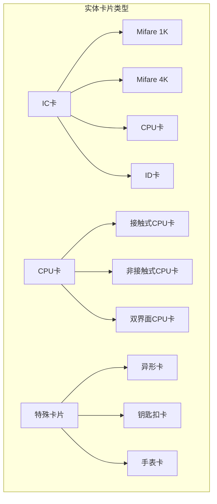

#### IC卡 (Integrated Circuit Card)
- **Mifare 1K**：1024字节存储空间，16个扇区
- **Mifare 4K**：4096字节存储空间，64个扇区
- **技术特点**：无源射频识别，工作频率13.56MHz
- **应用场景**：门禁、消费、考勤等基础应用

#### CPU卡 (Smart Card)
- **接触式CPU卡**：符合ISO/IEC 7816标准
- **非接触式CPU卡**：符合ISO/IEC 14443标准
- **双界面CPU卡**：同时支持接触和非接触
- **安全特性**：内置加密算法，支持双向认证

### 虚拟卡片
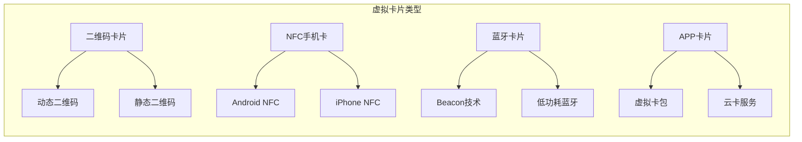

### 卡片技术参数对比
| 卡片类型 | 存储容量 | 读取距离 | 安全性 | 成本 | 适用场景 |
|----------|----------|----------|--------|------|----------|
| Mifare 1K | 1KB | 10cm | 中等 | 低 | 基础应用 |
| Mifare 4K | 4KB | 10cm | 中等 | 中等 | 复杂应用 |
| CPU卡 | 32KB+ | 10cm | 高 | 高 | 高安全应用 |
| NFC手机卡 | 云存储 | 5cm | 高 | 中等 | 移动应用 |
| 二维码卡 | 云存储 | 视距 | 中等 | 极低 | 临时应用 |

## 核心功能模块

### 卡片发行管理
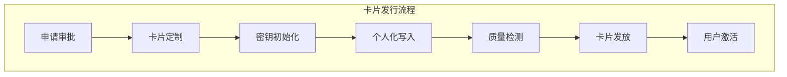

#### 发卡流程详细说明

1. **申请审批**
   - 用户资格验证
   - 发卡申请审核
   - 卡片类型选择
   - 费用缴纳确认

2. **卡片定制**
   - 卡面设计定制
   - 芯片类型选择
   - 初始数据准备
   - 卡号生成规则

3. **密钥初始化**
   - 主密钥分发
   - 工作密钥生成
   - 密钥注入
   - 安全域创建

4. **个人化写入**
   - 用户信息写入
   - 应用文件创建
   - 权限配置
   - 初始值设定

5. **质量检测**
   - 芯片功能测试
   - 数据完整性验证
   - 安全性能测试
   - 外观质量检查

### 卡片状态管理
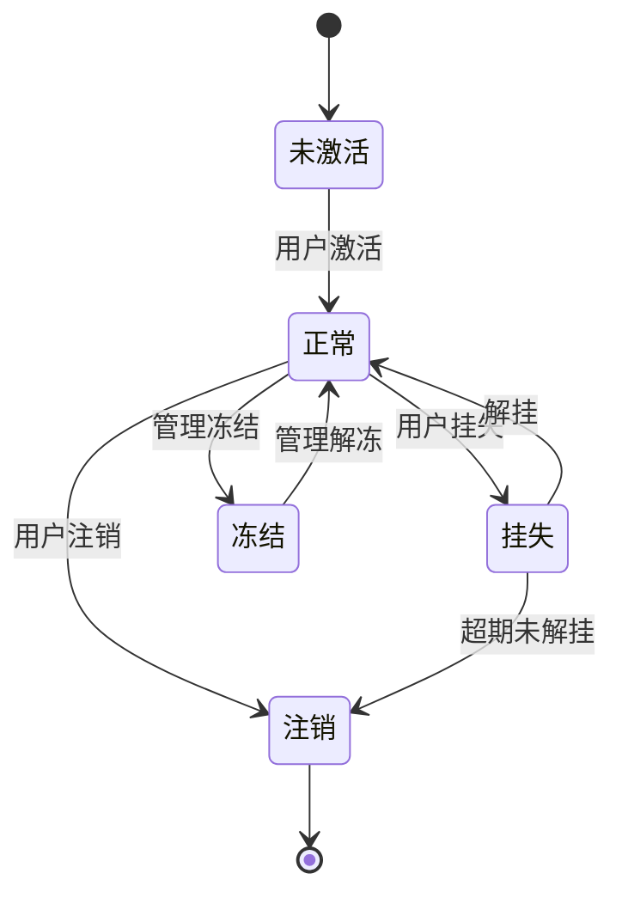

**状态定义：**
- **未激活**：已发卡但未激活使用
- **正常**：卡片可正常使用
- **挂失**：用户主动挂失，暂时禁用
- **冻结**：管理员冻结，暂时禁用
- **注销**：永久停用，数据归档

### 账户管理
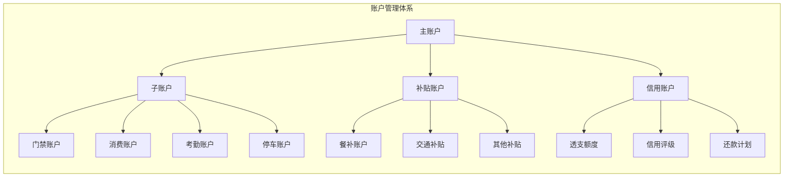

## 密钥管理体系

### 密钥层次结构
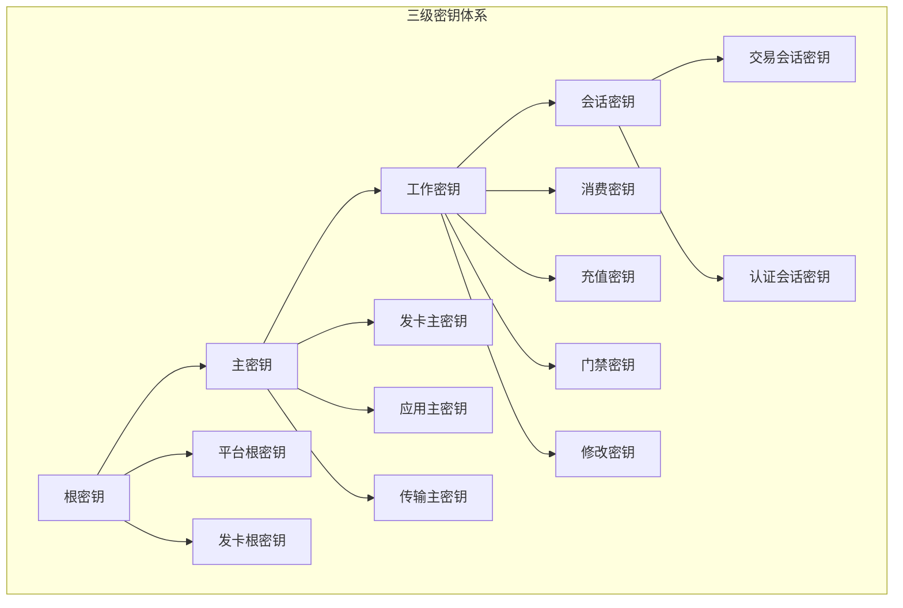

### 密钥管理流程
```java
public class KeyManagementService {

    // 密钥生成
    public SymmetricKey generateKey(KeyType type, int keyLength) {
        switch (type) {
            case AES:
                return generateAESKey(keyLength);
            case DES:
                return generateDESKey(keyLength);
            case SM4:
                return generateSM4Key(keyLength);
            default:
                throw new UnsupportedKeyTypeException();
        }
    }

    // 密钥分发
    public void distributeKey(String keyId, SymmetricKey key, List<String> terminals) {
        for (String terminal : terminals) {
            encryptAndTransmitKey(key, terminal);
        }
    }

    // 密钥更新
    public void updateKey(String keyId, SymmetricKey newKey) {
        // 获取当前密钥版本
        int currentVersion = getKeyVersion(keyId);
        // 生成新版本密钥
        int newVersion = currentVersion + 1;
        // 存储新密钥
        storeKey(keyId, newVersion, newKey);
        // 通知终端更新
        notifyTerminalsKeyUpdate(keyId, newVersion);
    }
}
```

### 国密算法支持
```java
public enum NationalAlgorithm {
    SM2("国密SM2椭圆曲线公钥算法"),
    SM3("国密SM3密码杂凑算法"),
    SM4("国密SM4分组密码算法");

    private String description;

    NationalAlgorithm(String description) {
        this.description = description;
    }
}

public class SM2KeyPair {
    private BigInteger privateKey;
    private ECPoint publicKey;

    // SM2签名
    public byte[] sign(byte[] message) {
        return SM2Signature.sign(privateKey, message);
    }

    // SM2验签
    public boolean verify(byte[] message, byte[] signature) {
        return SM2Signature.verify(publicKey, message, signature);
    }
}
```

## 交易处理流程

### 实时交易处理
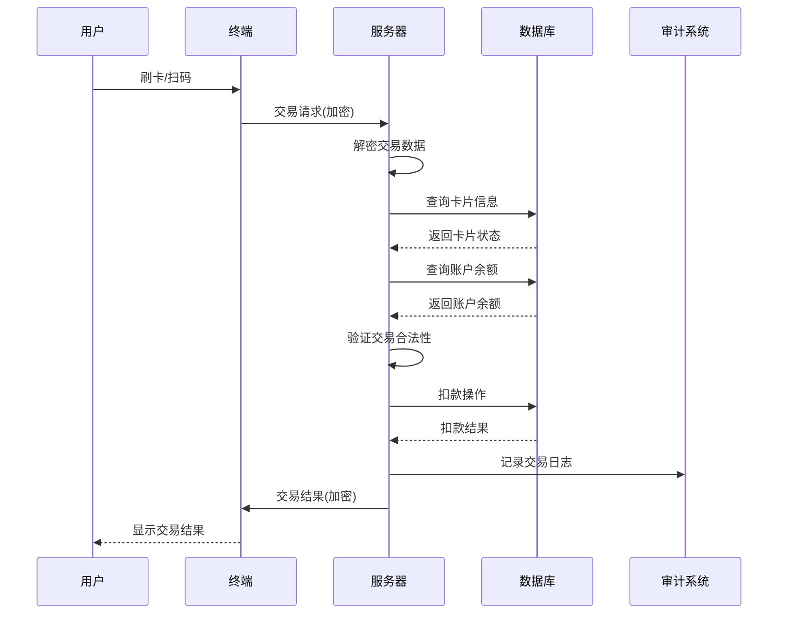

### 离线交易处理
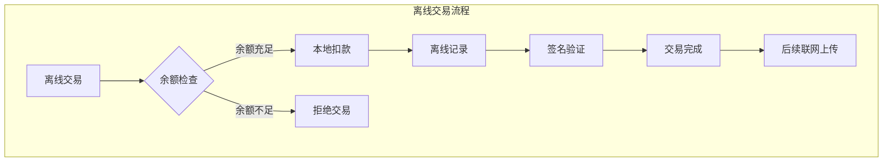

#### 离线交易实现
```java
public class OfflineTransactionService {

    // 离线交易处理
    public TransactionResult processOfflineTransaction(OfflineTransactionRequest request) {
        // 1. 验证交易签名
        if (!verifyTransactionSignature(request)) {
            return TransactionResult.failure("签名验证失败");
        }

        // 2. 检查余额是否充足
        BigDecimal currentBalance = getCurrentBalance(request.getCardId());
        if (currentBalance.compareTo(request.getAmount()) < 0) {
            return TransactionResult.failure("余额不足");
        }

        // 3. 计算离线扣款限额
        BigDecimal offlineLimit = calculateOfflineLimit(request.getCardId());
        if (getOfflineUsedAmount(request.getCardId()).add(request.getAmount()).compareTo(offlineLimit) > 0) {
            return TransactionResult.failure("超出离线交易限额");
        }

        // 4. 生成离线交易记录
        OfflineTransactionRecord record = createOfflineRecord(request);

        // 5. 更新本地离线余额
        updateOfflineBalance(request.getCardId(), request.getAmount());

        // 6. 返回交易结果
        return TransactionResult.success(record.getTransactionId());
    }

    // 联网时同步离线交易
    public void syncOfflineTransactions(String cardId) {
        List<OfflineTransactionRecord> records = getOfflineTransactions(cardId);

        for (OfflineTransactionRecord record : records) {
            // 上传到服务器
            uploadTransactionToServer(record);
            // 更新账户余额
            updateAccountBalance(cardId, record.getAmount());
            // 清除本地记录
            clearLocalRecord(record);
        }
    }
}
```

### 交易异常处理
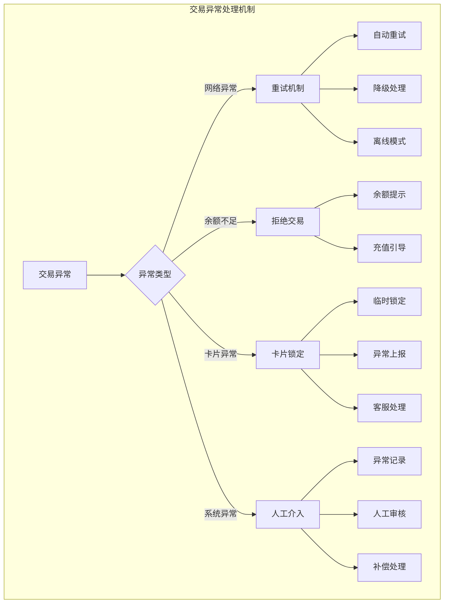

## 系统架构

### 整体架构设计
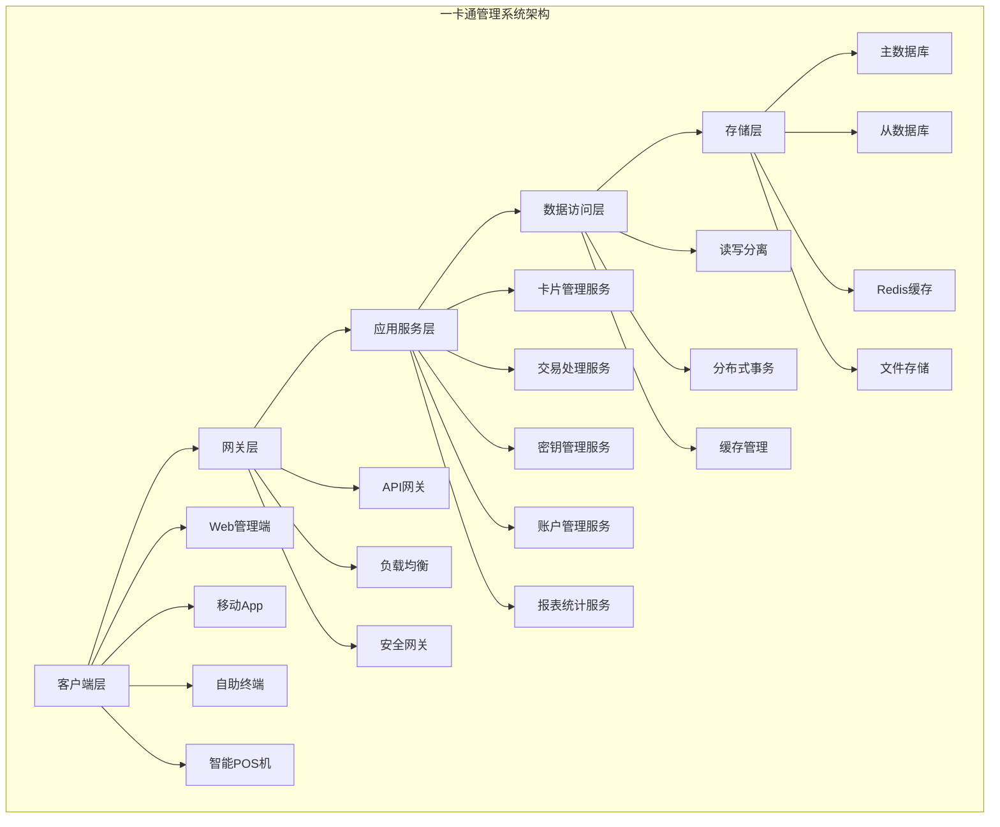

### 微服务架构
```yaml
# 服务拆分
services:
  card-service:          # 卡片管理服务
    port: 8081
    database: card_db
    cache: card_cache

  transaction-service:   # 交易处理服务
    port: 8082
    database: transaction_db
    message_queue: rabbitmq

  key-service:          # 密钥管理服务
    port: 8083
    database: key_db
    hsm: hsm_module

  account-service:      # 账户管理服务
    port: 8084
    database: account_db
    cache: account_cache

  report-service:       # 报表统计服务
    port: 8085
    database: report_db
    data_warehouse: dw_cluster
```

### 数据库设计
```sql
-- 卡片信息表
CREATE TABLE t_card (
    card_id BIGINT PRIMARY KEY AUTO_INCREMENT,
    card_number VARCHAR(32) UNIQUE NOT NULL,
    card_type_id INT NOT NULL,
    user_id BIGINT NOT NULL,
    card_status TINYINT NOT NULL COMMENT '0-未激活,1-正常,2-挂失,3-冻结,4-注销',
    issue_time DATETIME NOT NULL,
    expire_time DATETIME NOT NULL,
    physical_flag BOOLEAN DEFAULT TRUE,
    create_time DATETIME DEFAULT CURRENT_TIMESTAMP,
    update_time DATETIME DEFAULT CURRENT_TIMESTAMP ON UPDATE CURRENT_TIMESTAMP,
    INDEX idx_card_number (card_number),
    INDEX idx_user_id (user_id),
    INDEX idx_status (card_status)
);

-- 交易记录表
CREATE TABLE t_transaction (
    transaction_id BIGINT PRIMARY KEY AUTO_INCREMENT,
    transaction_number VARCHAR(64) UNIQUE NOT NULL,
    card_id BIGINT NOT NULL,
    transaction_type TINYINT NOT NULL COMMENT '1-消费,2-充值,3-退款',
    amount DECIMAL(12,2) NOT NULL,
    balance DECIMAL(12,2) NOT NULL,
    terminal_id VARCHAR(32),
    merchant_id BIGINT,
    transaction_time DATETIME NOT NULL,
    offline_flag BOOLEAN DEFAULT FALSE,
    create_time DATETIME DEFAULT CURRENT_TIMESTAMP,
    INDEX idx_card_id (card_id),
    INDEX idx_transaction_time (transaction_time),
    INDEX idx_transaction_number (transaction_number)
);

-- 密钥管理表
CREATE TABLE t_key_management (
    key_id BIGINT PRIMARY KEY AUTO_INCREMENT,
    key_name VARCHAR(64) NOT NULL,
    key_type TINYINT NOT NULL COMMENT '1-AES,2-DES,3-SM4',
    key_version INT NOT NULL,
    key_value BLOB NOT NULL,
    status TINYINT NOT NULL COMMENT '1-有效,2-过期,3-撤销',
    effective_time DATETIME NOT NULL,
    expire_time DATETIME NOT NULL,
    create_time DATETIME DEFAULT CURRENT_TIMESTAMP,
    INDEX idx_key_name (key_name),
    INDEX idx_key_version (key_version)
);
```

## API接口设计

### 卡片管理接口
```http
# 发卡接口
POST /api/card/issue
Content-Type: application/json

{
    "userId": "U001",
    "cardTypeId": 1,
    "cardPersonalization": {
        "cardHolderName": "张三",
        "department": "技术部",
        "photo": "base64照片数据"
    },
    "validityPeriod": 36
}

Response:
{
    "code": 200,
    "message": "发卡成功",
    "data": {
        "cardId": "CARD001",
        "cardNumber": "6225881234567890",
        "physicalCard": true,
        "issueTime": "2024-01-01T10:00:00Z",
        "expireTime": "2027-01-01T10:00:00Z"
    }
}

# 卡片状态查询
GET /api/card/{cardId}/status

Response:
{
    "code": 200,
    "message": "查询成功",
    "data": {
        "cardId": "CARD001",
        "cardNumber": "6225881234567890",
        "status": "NORMAL",
        "balance": 1000.50,
        "lastTransactionTime": "2024-01-01T09:30:00Z"
    }
}

# 卡片挂失
POST /api/card/{cardId}/report-loss

Response:
{
    "code": 200,
    "message": "挂失成功",
    "data": {
        "cardId": "CARD001",
        "status": "LOST",
        "reportLossTime": "2024-01-01T10:00:00Z",
        "temporaryCard": "TEMP001"
    }
}
```

### 交易处理接口
```http
# 消费交易
POST /api/transaction/consume
Content-Type: application/json

{
    "cardId": "CARD001",
    "amount": 25.50,
    "terminalId": "POS001",
    "merchantId": "MERCHANT001",
    "transactionType": "CONSUME",
    "offlineFlag": false
}

Response:
{
    "code": 200,
    "message": "交易成功",
    "data": {
        "transactionId": "TXN001",
        "transactionNumber": "202401011000001",
        "cardBalance": 974.50,
        "transactionTime": "2024-01-01T10:00:00Z"
    }
}

# 充值交易
POST /api/transaction/recharge
Content-Type: application/json

{
    "cardId": "CARD001",
    "amount": 500.00,
    "rechargeType": "CASH",
    "terminalId": "TERMINAL001"
}

Response:
{
    "code": 200,
    "message": "充值成功",
    "data": {
        "transactionId": "TXN002",
        "transactionNumber": "202401011000002",
        "rechargeAmount": 500.00,
        "cardBalance": 1474.50,
        "transactionTime": "2024-01-01T10:05:00Z"
    }
}
```

### 账户管理接口
```http
# 账户余额查询
GET /api/account/{cardId}/balance

Response:
{
    "code": 200,
    "message": "查询成功",
    "data": {
        "cardId": "CARD001",
        "mainBalance": 1000.50,
        "subsidyBalance": 200.00,
        "creditBalance": 0.00,
        "totalBalance": 1200.50,
        "lastUpdateTime": "2024-01-01T09:30:00Z"
    }
}

# 交易记录查询
GET /api/account/{cardId}/transactions?page=1&size=20&startDate=2024-01-01&endDate=2024-01-31

Response:
{
    "code": 200,
    "message": "查询成功",
    "data": {
        "total": 150,
        "page": 1,
        "size": 20,
        "records": [
            {
                "transactionId": "TXN001",
                "transactionType": "消费",
                "amount": -25.50,
                "balance": 974.50,
                "merchantName": "餐厅A",
                "transactionTime": "2024-01-01T10:00:00Z"
            }
        ]
    }
}
```

## 安全机制

### 数据传输安全
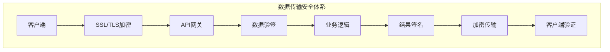

#### 传输加密实现
```java
@Component
public class SecurityFilter {

    @Autowired
    private EncryptionService encryptionService;

    @Autowired
    private SignatureService signatureService;

    public void doFilter(ServletRequest request, ServletResponse response, FilterChain chain) {
        HttpServletRequest httpRequest = (HttpServletRequest) request;

        // 1. 验证请求签名
        String signature = httpRequest.getHeader("X-Signature");
        String timestamp = httpRequest.getHeader("X-Timestamp");
        String nonce = httpRequest.getHeader("X-Nonce");

        if (!verifySignature(httpRequest, signature, timestamp, nonce)) {
            throw new SecurityException("签名验证失败");
        }

        // 2. 解密请求数据
        String encryptedData = httpRequest.getBody();
        String decryptedData = encryptionService.decrypt(encryptedData);

        // 3. 继续处理请求
        chain.doFilter(new DecryptedServletRequest(httpRequest, decryptedData), response);

        // 4. 加密响应数据
        String responseData = getResponseData();
        String encryptedResponse = encryptionService.encrypt(responseData);
        response.getWriter().write(encryptedResponse);
    }
}
```

### 数据存储安全
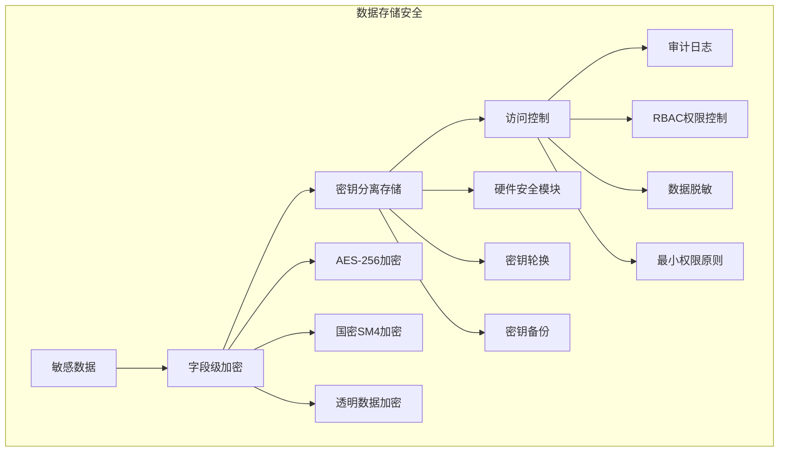

### 交易安全防护
```java
@Service
public class TransactionSecurityService {

    // 交易重复检查
    public boolean checkDuplicateTransaction(String transactionNumber) {
        return transactionRepository.existsByTransactionNumber(transactionNumber);
    }

    // 交易金额验证
    public boolean validateTransactionAmount(BigDecimal amount, String cardId) {
        // 检查单笔交易限额
        BigDecimal singleLimit = getSingleTransactionLimit(cardId);
        if (amount.compareTo(singleLimit) > 0) {
            return false;
        }

        // 检查日交易限额
        BigDecimal dailyLimit = getDailyTransactionLimit(cardId);
        BigDecimal dailyUsed = getDailyUsedAmount(cardId);
        if (dailyUsed.add(amount).compareTo(dailyLimit) > 0) {
            return false;
        }

        return true;
    }

    // 异常交易检测
    public boolean detectAbnormalTransaction(TransactionRequest request) {
        // 检查交易频率
        if (isHighFrequencyTransaction(request.getCardId())) {
            return true;
        }

        // 检查交易地点
        if (isAbnormalLocation(request.getCardId(), request.getTerminalId())) {
            return true;
        }

        // 检查交易金额
        if (isAbnormalAmount(request.getCardId(), request.getAmount())) {
            return true;
        }

        return false;
    }
}
```

## 性能指标

### 系统性能要求
| 指标项 | 要求值 | 测试条件 |
|--------|--------|----------|
| 交易处理能力 | ≥10,000 TPS | 混合负载 |
| 平均响应时间 | ≤200ms | 实时交易 |
| 系统可用性 | ≥99.95% | 7×24小时运行 |
| 数据一致性 | 100% | 分布式环境 |
| 并发用户数 | ≥50,000 | 峰值负载 |

### 不同场景性能指标
| 交易类型 | 平均响应时间 | 峰值TPS | 成功率 | 适用场景 |
|----------|--------------|---------|--------|----------|
| 实时消费 | <200ms | 5,000 | 99.99% | 园区消费 |
| 批量充值 | <500ms | 1,000 | 99.95% | 批量发薪 |
| 离线交易 | <100ms | 2,000 | 99.90% | 无网络环境 |
| 查询服务 | <50ms | 10,000 | 99.99% | 余额查询 |
| 报表生成 | <5s | 100 | 99.95% | 后台统计 |

### 扩展性指标
| 扩展维度 | 当前容量 | 扩展后容量 | 扩展方式 |
|----------|----------|------------|----------|
| 用户规模 | 100万 | 1000万 | 数据库分片 |
| 交易量 | 日1000万笔 | 日1亿笔 | 微服务扩展 |
| 存储容量 | 10TB | 100TB | 分布式存储 |
| 网络带宽 | 1Gbps | 10Gbps | 负载均衡 |

## 业务场景

### 园区消费场景
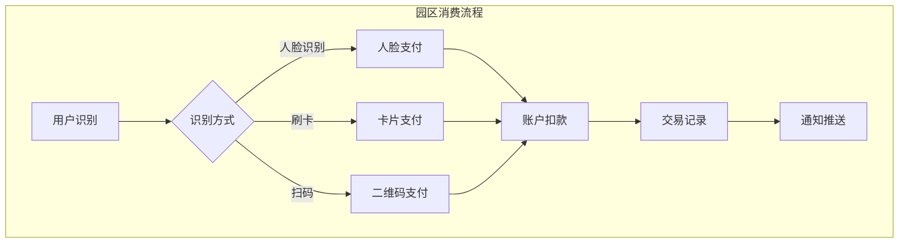

#### 消费场景特点
- **多支付方式**：人脸、刷卡、扫码、手机NFC
- **实时结算**：秒级交易处理，即时到账
- **离线支持**：网络中断时支持离线消费
- **账单推送**：实时推送交易账单
- **优惠活动**：支持优惠券、满减等营销活动

### 门禁通行场景
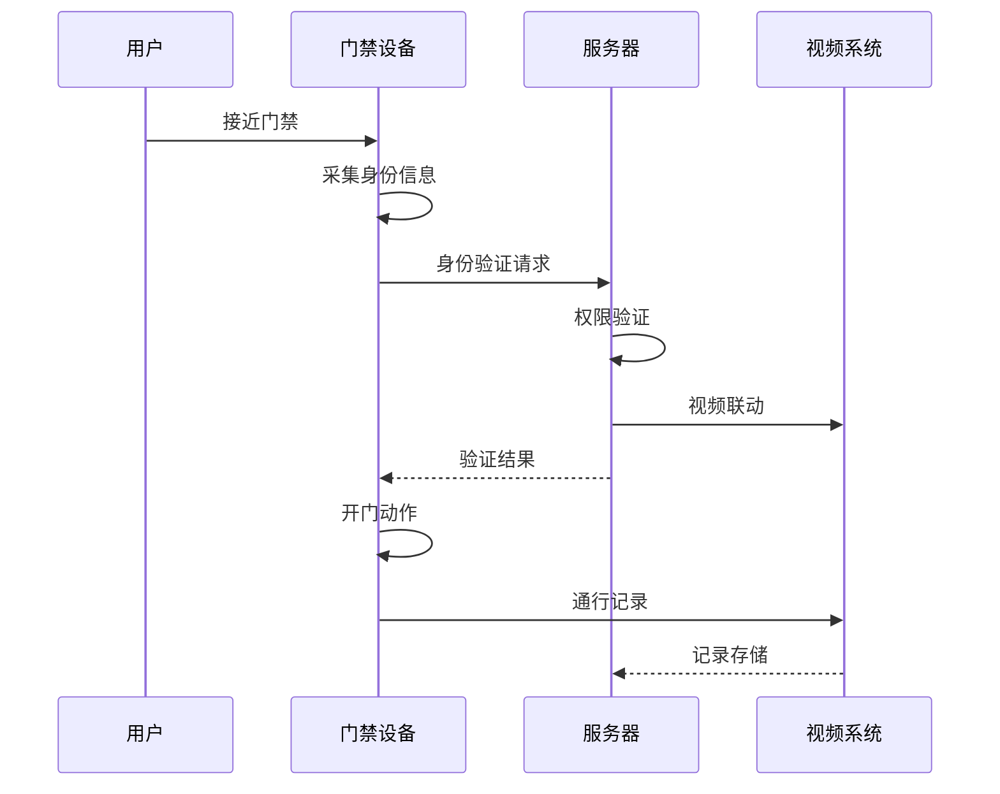

### 考勤管理场景
- **无感考勤**：人脸识别自动考勤
- **多点考勤**：支持多个考勤点
- **异常检测**：代打卡、迟到早退检测
- **报表统计**：考勤数据自动统计

### 访客管理场景
- **预约登记**：访客信息预先登记
- **临时发卡**：为访客发放临时卡片
- **权限控制**：访客权限时间和区域限制
- **轨迹追踪**：访客活动轨迹记录

## 运维管理

### 监控告警
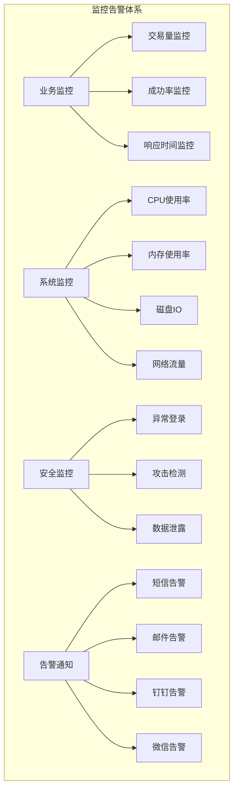

### 运维指标
| 监控项 | 正常范围 | 告警阈值 | 严重阈值 |
|--------|----------|----------|----------|
| 交易成功率 | 99.9% | <99.5% | <99.0% |
| 平均响应时间 | <200ms | >500ms | >1000ms |
| 系统可用性 | 99.95% | <99.9% | <99.5% |
| CPU使用率 | <70% | >80% | >90% |
| 内存使用率 | <70% | >80% | >90% |
| 磁盘使用率 | <80% | >90% | >95% |

### 备份恢复策略
```yaml
backup_strategy:
  database_backup:
    full_backup: "每天02:00"
    incremental_backup: "每4小时"
    retention_period: "30天"
    backup_location: "异地备份"

  application_backup:
    config_backup: "每天03:00"
    log_backup: "每小时"
    retention_period: "7天"

  recovery_procedure:
    rto: "1小时"  # 恢复时间目标
    rpo: "15分钟" # 恢复点目标
```

**Section sources**
- [CardManagementController.java](file://smart-admin-api-java17-springboot3/sa-admin/src/main/java/net/lab1024/sa/admin/module/business/card/controller/CardManagementController.java#L1-L150)
- [card-management-api.js](file://smart-admin-web-javascript/src/api/business/card/card-management-api.js#L1-L80)
- [card-dashboard.vue](file://smart-admin-web-javascript/src/views/business/card/card-dashboard.vue#L1-300)