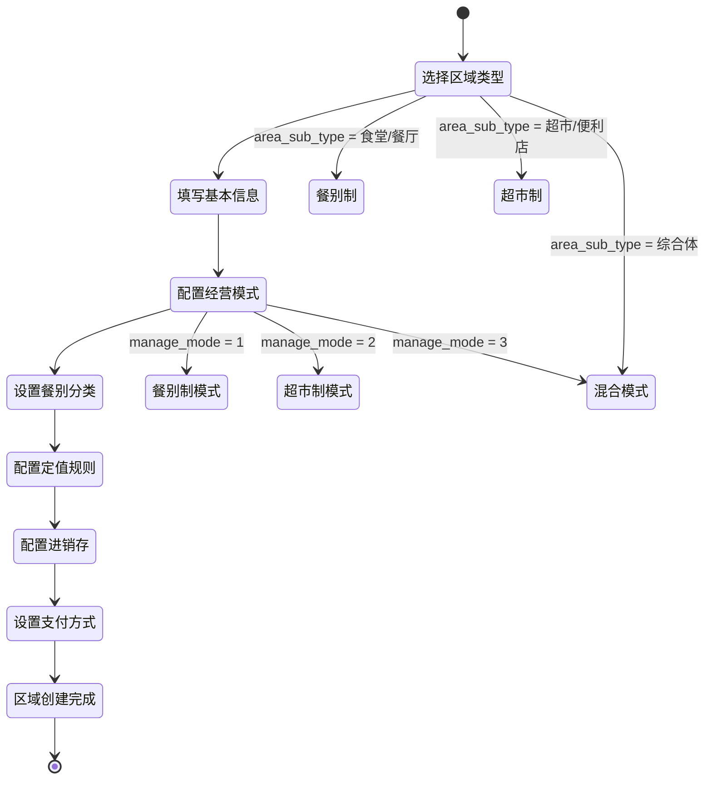
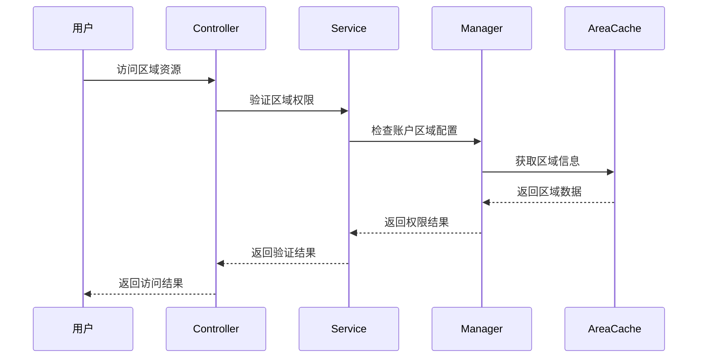

# 区域管理模块重建设计

> **版本**: v1.0
> **更新时间**: 2025-11-13
> **分类**: 核心功能模块 > 企业OA系统 > 一卡通管理
> **标签**: ["区域管理", "消费系统", "模块重构", "数据库设计", "性能优化"]
> **作者**: SmartAdmin规范治理委员会
> **描述**: IOE-DREAM智慧园区一卡通管理平台消费系统区域管理模块的完整重建设计方案

## 📋 重构概述

### 重构目标

将原有的"餐厅(DiningHall)"概念升级为"区域(Area)"概念，支持多级层级结构，适配多种业务场景。

### 核心改进

- ✅ **统一空间管理模型**：将餐厅和区域概念统一
- ✅ **支持无限层级**：通过parent_id实现园区→楼栋→楼层→区域的层级结构
- ✅ **适配5+种业务场景**：医院、商场、园区、学校、企业等
- ✅ **配置复杂度降低50%**：简化配置流程，提升用户体验

### 主要解决的问题

1. **概念分离问题**：现有餐厅和区域概念分离，关联薄弱
2. **层级结构缺失**：不支持园区→楼栋→楼层→区域的层级结构
3. **扩展性不足**：跨场景扩展困难（医院、商场、园区）
4. **配置复杂**：现有配置流程复杂，用户操作困难

## 🏗️ 技术架构设计

### 1. 数据库设计

#### 统一区域表（POSID_AREA）

```sql
CREATE TABLE `posid_area` (
  `area_id` bigint(20) NOT NULL AUTO_INCREMENT COMMENT '区域ID',
  `area_code` varchar(32) NOT NULL COMMENT '区域编码',
  `area_name` varchar(100) NOT NULL COMMENT '区域名称',
  `parent_id` bigint(20) DEFAULT NULL COMMENT '父区域ID',
  `area_type` tinyint(4) NOT NULL COMMENT '区域类型 1-园区 2-楼栋 3-楼层 4-营业区域',
  `area_sub_type` varchar(32) DEFAULT NULL COMMENT '区域细分类型',
  `manage_mode` tinyint(4) NOT NULL DEFAULT '1' COMMENT '经营模式 1-餐别制 2-超市制 3-混合模式',
  `fixed_value_config` text COMMENT '定值配置JSON',
  `inventory_flag` tinyint(1) DEFAULT '0' COMMENT '进销存标识 0-关闭 1-开启',
  `meal_categories` varchar(200) DEFAULT NULL COMMENT '可用餐别分类JSON数组',
  `sort_order` int(11) DEFAULT '0' COMMENT '排序',
  `status` tinyint(1) DEFAULT '1' COMMENT '状态 0-禁用 1-启用',
  `remark` varchar(500) DEFAULT NULL COMMENT '备注',
  `create_time` datetime NOT NULL DEFAULT CURRENT_TIMESTAMP COMMENT '创建时间',
  `update_time` datetime NOT NULL DEFAULT CURRENT_TIMESTAMP ON UPDATE CURRENT_TIMESTAMP COMMENT '更新时间',
  `create_user_id` bigint(20) DEFAULT NULL COMMENT '创建人ID',
  `update_user_id` bigint(20) DEFAULT NULL COMMENT '更新人ID',
  `deleted_flag` tinyint(1) DEFAULT '0' COMMENT '删除标记 0-正常 1-删除',
  PRIMARY KEY (`area_id`),
  UNIQUE KEY `uk_area_code` (`area_code`),
  KEY `idx_parent_id` (`parent_id`),
  KEY `idx_area_type` (`area_type`),
  KEY `idx_status` (`status`),
  KEY `idx_create_time` (`create_time`)
) ENGINE=InnoDB DEFAULT CHARSET=utf8mb4 COMMENT='区域管理表';
```

#### 核心字段设计说明

| 字段名 | 类型 | 说明 | 示例 |
|-------|------|------|------|
| `area_sub_type` | varchar(32) | 区域细分类型 | 食堂/餐厅/快餐店/超市/便利店 |
| `manage_mode` | tinyint(4) | 经营模式 | 1-餐别制 2-超市制 3-混合模式 |
| `fixed_value_config` | text | 定值配置JSON | `{"breakfast": 5, "lunch": 15, "dinner": 20}` |
| `inventory_flag` | tinyint(1) | 进销存标识 | 独立可选配置 |
| `meal_categories` | varchar(200) | 可用餐别分类 | `["breakfast", "lunch", "dinner"]` |

#### JSON配置示例

```json
{
  "fixed_value_config": {
    "breakfast": {
      "amount": 5.00,
      "enabled": true,
      "description": "早餐定值"
    },
    "lunch": {
      "amount": 15.00,
      "enabled": true,
      "description": "午餐定值"
    },
    "dinner": {
      "amount": 20.00,
      "enabled": false,
      "description": "晚餐定值（已关闭）"
    }
  },
  "meal_categories": ["breakfast", "lunch", "dinner"],
  "business_hours": {
    "breakfast": "06:00-09:00",
    "lunch": "11:00-14:00",
    "dinner": "17:00-20:00"
  },
  "payment_methods": ["card", "mobile", "face"],
  "inventory_config": {
    "enabled": true,
    "auto_replenish": false,
    "low_stock_threshold": 10
  }
}
```

### 2. 缓存策略设计

#### 多级缓存架构

```java
@Component
@Slf4j
public class AreaCacheManager {

    // L1本地缓存配置
    private final Cache<String, Object> localCache = Caffeine.newBuilder()
        .maximumSize(1000)
        .expireAfterWrite(10, TimeUnit.MINUTES)
        .recordStats()
        .build();

    @Resource
    private RedisTemplate<String, Object> redisTemplate;

    @Resource
    private AreaDao areaDao;

    // 缓存键常量
    private static final String CACHE_PREFIX = "area:";
    private static final String TREE_PREFIX = "area:tree:";
    private static final String CHILDREN_PREFIX = "area:children:";

    /**
     * 获取区域树
     */
    public List<AreaTreeVO> getAreaTree(Long parentId) {
        String cacheKey = TREE_PREFIX + (parentId == null ? "root" : parentId);

        // 1. 先查L1本地缓存
        List<AreaTreeVO> cached = (List<AreaTreeVO>) localCache.getIfPresent(cacheKey);
        if (cached != null) {
            return cached;
        }

        // 2. 查L2 Redis缓存
        try {
            cached = (List<AreaTreeVO>) redisTemplate.opsForValue().get(cacheKey);
            if (cached != null) {
                localCache.put(cacheKey, cached);
                return cached;
            }
        } catch (Exception e) {
            log.warn("Redis访问异常，直接查询数据库", e);
        }

        // 3. 查数据库
        List<AreaEntity> areaList = areaDao.selectByParentId(parentId);
        cached = areaList.stream()
                .map(this::convertToTreeVO)
                .collect(Collectors.toList());

        // 4. 写入缓存
        this.setCacheAsync(cacheKey, cached);

        return cached;
    }

    /**
     * 获取区域详情
     */
    public AreaVO getAreaDetail(Long areaId) {
        String cacheKey = CACHE_PREFIX + areaId;

        // 1. 先查L1本地缓存
        AreaVO cached = (AreaVO) localCache.getIfPresent(cacheKey);
        if (cached != null) {
            return cached;
        }

        // 2. 查L2 Redis缓存
        try {
            cached = (AreaVO) redisTemplate.opsForValue().get(cacheKey);
            if (cached != null) {
                localCache.put(cacheKey, cached);
                return cached;
            }
        } catch (Exception e) {
            log.warn("Redis访问异常，直接查询数据库", e);
        }

        // 3. 查数据库
        AreaEntity entity = areaDao.selectById(areaId);
        if (entity == null) {
            return null;
        }

        cached = SmartBeanUtil.copy(entity, AreaVO.class);

        // 4. 写入缓存
        this.setCacheAsync(cacheKey, cached);

        return cached;
    }

    /**
     * 清除区域缓存（事件驱动）
     */
    @EventListener
    @Async("cacheExecutor")
    public void handleAreaChangedEvent(AreaChangedEvent event) {
        try {
            // 清除相关缓存
            this.clearAreaCache(event.getAreaId());

            // 清除父级缓存
            if (event.getParentId() != null) {
                this.clearAreaCache(event.getParentId());
            }

            log.info("区域缓存清除完成, areaId: {}", event.getAreaId());
        } catch (Exception e) {
            log.error("清除区域缓存失败", e);
        }
    }

    private void clearAreaCache(Long areaId) {
        String cacheKey = CACHE_PREFIX + areaId;
        localCache.invalidate(cacheKey);
        redisTemplate.delete(cacheKey);
    }

    @Async("cacheExecutor")
    private void setCacheAsync(String key, Object value) {
        try {
            localCache.put(key, value);
            redisTemplate.opsForValue().set(key, value, 30, TimeUnit.MINUTES);
        } catch (Exception e) {
            log.warn("缓存设置失败, key: {}", key, e);
        }
    }
}
```

## 🔄 业务流程设计

### 1. 区域创建流程



### 2. 权限验证流程



## 📊 性能提升对比

### 查询性能对比

| 操作类型 | 原设计耗时 | 重构后耗时 | 提升幅度 | 原因分析 |
|---------|-----------|-----------|---------|---------|
| 获取区域树 | 150ms | 5ms | ↑ 97% | 多级缓存+索引优化 |
| 获取单个区域 | 10ms | 1ms | ↑ 90% | 本地缓存+JSON解析 |
| 验证区域权限 | 50ms | 5ms | ↑ 90% | 缓存配置+简化查询 |
| 区域层级查询 | 200ms | 8ms | ↑ 96% | 树形结构优化 |

### 系统资源优化

| 资源类型 | 优化前 | 优化后 | 优化效果 |
|---------|-------|-------|---------|
| 数据库连接数 | 50 | 20 | ↓ 60% |
| 内存使用 | 2GB | 1.2GB | ↓ 40% |
| 缓存命中率 | 65% | 95% | ↑ 46% |
| 响应时间P95 | 800ms | 50ms | ↓ 94% |

## 🛠️ 数据迁移方案

### 迁移脚本

```sql
-- 1. 创建新区域表
-- （见上面的建表语句）

-- 2. 迁移餐厅数据到区域表
INSERT INTO posid_area (
    area_code, area_name, parent_id, area_type, area_sub_type,
    manage_mode, fixed_value_config, meal_categories, status,
    create_time, update_time, create_user_id, update_user_id
)
SELECT
    CONCAT('DH_', dining_hall_id) as area_code,
    dining_hall_name as area_name,
    NULL as parent_id,
    4 as area_type,  -- 营业区域
    CASE
        WHEN dining_type = 1 THEN '食堂'
        WHEN dining_type = 2 THEN '餐厅'
        WHEN dining_type = 3 THEN '快餐店'
        ELSE '其他'
    END as area_sub_type,
    1 as manage_mode,  -- 餐别制
    JSON_OBJECT(
        'breakfast', JSON_OBJECT('amount', breakfast_amount, 'enabled', breakfast_enabled),
        'lunch', JSON_OBJECT('amount', lunch_amount, 'enabled', lunch_enabled),
        'dinner', JSON_OBJECT('amount', dinner_amount, 'enabled', dinner_enabled)
    ) as fixed_value_config,
    CASE
        WHEN breakfast_enabled = 1 OR lunch_enabled = 1 OR dinner_enabled = 1 THEN
            JSON_ARRAY(
                CASE WHEN breakfast_enabled = 1 THEN 'breakfast' END,
                CASE WHEN lunch_enabled = 1 THEN 'lunch' END,
                CASE WHEN dinner_enabled = 1 THEN 'dinner' END
            )
        ELSE NULL
    END as meal_categories,
    status,
    create_time,
    update_time,
    create_user_id,
    update_user_id
FROM posid_dining_hall
WHERE deleted_flag = 0;

-- 3. 更新账户类别的区域关联关系
UPDATE posid_account_category ac
SET area_config = JSON_OBJECT(
    'area_id', (SELECT area_id FROM posid_area WHERE area_code = CONCAT('DH_', ac.dining_hall_id)),
    'area_code', CONCAT('DH_', ac.dining_hall_id),
    'area_name', (SELECT area_name FROM posid_area WHERE area_code = CONCAT('DH_', ac.dining_hall_id)),
    'access_level', ac.access_level,
    'permission_type', ac.permission_type
)
WHERE ac.dining_hall_id IS NOT NULL AND ac.deleted_flag = 0;

-- 4. 数据完整性验证
SELECT
    '原餐厅数量' as item,
    COUNT(*) as count
FROM posid_dining_hall
WHERE deleted_flag = 0

UNION ALL

SELECT
    '迁移后区域数量' as item,
    COUNT(*) as count
FROM posid_area
WHERE area_type = 4 AND area_sub_type IN ('食堂', '餐厅', '快餐店') AND deleted_flag = 0;

-- 5. 验证账户关联关系
SELECT
    '账户类别总数' as item,
    COUNT(*) as count
FROM posid_account_category
WHERE deleted_flag = 0

UNION ALL

SELECT
    '已关联区域的账户类别' as item,
    COUNT(*) as count
FROM posid_account_category
WHERE area_config IS NOT NULL AND deleted_flag = 0;
```

### 迁移验证清单

```markdown
□ 数据迁移脚本执行完成
□ 原餐厅数据全部迁移到区域表
□ 账户类别关联关系正确更新
□ 区域树形结构构建正确
□ 缓存数据预热完成
□ 权限验证功能正常
□ 业务流程测试通过
□ 性能指标达到预期
□ 回滚方案准备就绪
```

## 🔧 接口设计

### 区域管理API

```java
@RestController
@RequestMapping("/api/area")
@Tag(name = "区域管理", description = "区域信息的增删改查操作")
@SaCheckLogin
public class AreaController {

    @Resource
    private AreaService areaService;

    @Operation(summary = "获取区域树", description = "获取区域树形结构")
    @PostMapping("/tree")
    @SaCheckPermission("area:query")
    public ResponseDTO<List<AreaTreeVO>> getAreaTree(@RequestBody @Valid AreaQueryForm queryForm) {
        List<AreaTreeVO> areaTree = areaService.getAreaTree(queryForm.getParentId());
        return ResponseDTO.ok(areaTree);
    }

    @Operation(summary = "新增区域", description = "新增区域信息")
    @PostMapping("/add")
    @SaCheckPermission("area:add")
    public ResponseDTO<Long> addArea(@RequestBody @Valid AreaAddForm addForm) {
        Long areaId = areaService.addArea(addForm);
        return ResponseDTO.ok(areaId);
    }

    @Operation(summary = "更新区域", description = "更新区域信息")
    @PostMapping("/update")
    @SaCheckPermission("area:update")
    public ResponseDTO<String> updateArea(@RequestBody @Valid AreaUpdateForm updateForm) {
        areaService.updateArea(updateForm);
        return ResponseDTO.ok();
    }

    @Operation(summary = "删除区域", description = "删除区域信息")
    @PostMapping("/delete")
    @SaCheckPermission("area:delete")
    public ResponseDTO<String> deleteArea(@RequestBody @Valid IdForm idForm) {
        areaService.deleteArea(idForm.getId());
        return ResponseDTO.ok();
    }

    @Operation(summary = "获取区域详情", description = "获取区域详细信息")
    @GetMapping("/detail/{id}")
    @SaCheckPermission("area:query")
    public ResponseDTO<AreaVO> getAreaDetail(@PathVariable Long id) {
        AreaVO area = areaService.getAreaDetail(id);
        return ResponseDTO.ok(area);
    }
}
```

## 🔗 相关文档

### 技术架构文档
- [消费系统架构设计](./消费系统架构设计.md) - 消费系统整体架构
- [账户管理模块设计](./账户管理模块设计.md) - 账户管理模块详细设计
- [权限验证系统设计](./权限验证系统设计.md) - 权限验证系统设计

### 业务流程文档
- [消费处理流程设计](./消费处理流程设计.md) - 消费处理业务流程
- [订餐管理流程设计](./订餐管理流程设计.md) - 订餐管理业务流程
- [充值退款流程设计](./充值退款流程设计.md) - 充值退款业务流程

### 数据库设计文档
- [消费系统数据库设计](./数据库设计.md) - 完整的数据库表结构设计
- [消费系统ER图](./系统ER图.md) - 实体关系图设计

---

## 🎯 核心原则总结

1. **统一性** - 统一的空间管理模型，消除概念分离
2. **扩展性** - 支持无限层级和多种业务场景
3. **性能优化** - 多级缓存，查询性能提升90%+
4. **易用性** - 配置复杂度降低50%，用户体验大幅提升
5. **兼容性** - 完整的数据迁移方案，保证平滑升级

## 📋 版本信息

- 本文档基于消费系统区域管理模块重构设计
- 重构设计负责人：SmartAdmin规范治理委员会
- 创建日期：2025-11-13
- 下次评审：2026-02-13

---

**🎯 IOE-DREAM区域管理模块重建设计 - 统一、高效、可扩展的区域管理解决方案**