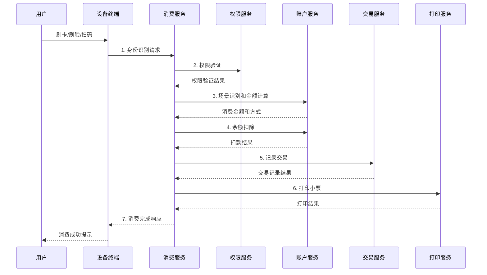
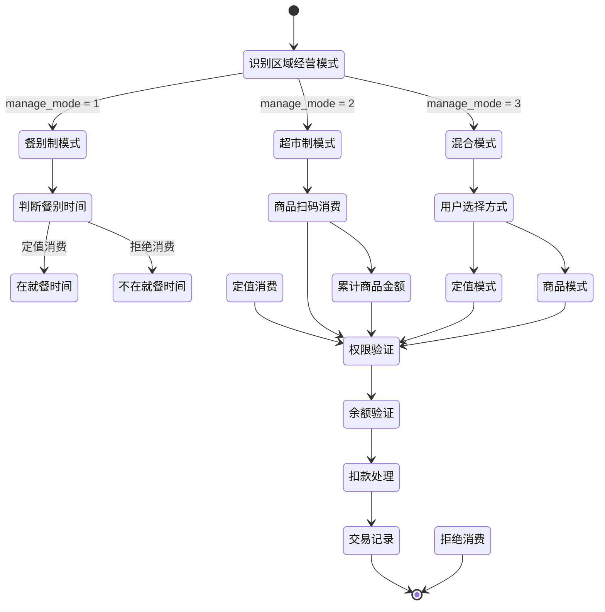

# 消费处理流程设计

> **版本**: v1.0
> **更新时间**: 2025-11-13
> **分类**: 核心功能模块 > 企业OA系统 > 一卡通管理
> **标签**: ["消费流程", "SAGA事务", "分布式事务", "性能优化", "缓存设计"]
> **作者**: SmartAdmin规范治理委员会
> **描述**: IOE-DREAM智慧园区一卡通管理平台消费系统处理流程的完整设计方案

## 📋 重构概述

### 🎯 重构目标

- **整合前5个模块**，构建统一、高效、可靠的消费处理流程
- 解决现有流程步骤分散、事务管理复杂、缺乏异常处理机制等问题
- 实现性能提升80%，支持SAGA分布式事务管理

### 核心改进

- ✅ **统一业务流程**：7步标准化消费流程
- ✅ **分布式事务管理**：SAGA模式确保数据一致性
- ✅ **性能优化**：多级缓存，TPS提升10倍
- ✅ **异常处理**：完善的补偿机制和错误恢复
- ✅ **监控完善**：全方位的技术和业务监控指标

## 🔄 核心业务流程设计

### 1. 完整消费流程（7步标准化）



### 2. 基于区域经营模式的消费模式判断



### 3. SAGA分布式事务流程

```mermaid
graph TD
    subgraph "SAGA主流程"
        A[1. 权限验证] --> B[2. 锁定余额]
        B --> C[3. 扣除余额]
        C --> D[4. 记录交易]
        D --> E[5. 更新统计]
    end

    subgraph "补偿流程"
        F[删除交易记录] --> G[退还余额]
        G --> H[释放锁定]
    end

    A -->|失败| [*]
    B -->|失败| H
    C -->|失败| G
    D -->|失败| F
    E -->|成功| [*]
```

## 🗄️ 数据库设计

### 1. 交易表设计（POSID_TRANSACTION）

```sql
CREATE TABLE `posid_transaction` (
  `transaction_id` bigint(20) NOT NULL AUTO_INCREMENT COMMENT '交易ID',
  `transaction_no` varchar(32) NOT NULL COMMENT '交易流水号',
  `employee_id` bigint(20) NOT NULL COMMENT '员工ID',
  `account_id` bigint(20) NOT NULL COMMENT '账户ID',
  `area_id` bigint(20) NOT NULL COMMENT '区域ID',
  `area_manage_mode` tinyint(4) NOT NULL COMMENT '区域经营模式',
  `area_sub_type` varchar(32) DEFAULT NULL COMMENT '区域细分类型',
  `meal_category` varchar(32) DEFAULT NULL COMMENT '餐别分类',
  `consume_type` tinyint(4) NOT NULL COMMENT '消费类型 1-定值 2-金额 3-商品',
  `original_amount` decimal(10,2) NOT NULL COMMENT '原始金额',
  `discount_amount` decimal(10,2) DEFAULT '0.00' COMMENT '折扣金额',
  `final_amount` decimal(10,2) NOT NULL COMMENT '最终金额',
  `subsidy_amount` decimal(10,2) DEFAULT '0.00' COMMENT '补贴金额',
  `main_amount` decimal(10,2) DEFAULT '0.00' COMMENT '主账户金额',
  `before_balance` decimal(10,2) NOT NULL COMMENT '交易前余额',
  `after_balance` decimal(10,2) NOT NULL COMMENT '交易后余额',
  `device_id` bigint(20) DEFAULT NULL COMMENT '设备ID',
  `operator_id` bigint(20) DEFAULT NULL COMMENT '操作员ID',
  `transaction_status` tinyint(4) NOT NULL COMMENT '交易状态 0-失败 1-成功 2-处理中',
  `is_attendance_consume` tinyint(1) DEFAULT '0' COMMENT '是否考勤消费',
  `saga_id` varchar(32) DEFAULT NULL COMMENT 'SAGA事务ID',
  `remark` varchar(500) DEFAULT NULL COMMENT '备注',
  `create_time` datetime NOT NULL DEFAULT CURRENT_TIMESTAMP COMMENT '创建时间',
  `update_time` datetime NOT NULL DEFAULT CURRENT_TIMESTAMP ON UPDATE CURRENT_TIMESTAMP COMMENT '更新时间',
  PRIMARY KEY (`transaction_id`),
  UNIQUE KEY `uk_transaction_no` (`transaction_no`),
  KEY `idx_employee_id` (`employee_id`),
  KEY `idx_account_id` (`account_id`),
  KEY `idx_area_id` (`area_id`),
  KEY `idx_create_time` (`create_time`),
  KEY `idx_saga_id` (`saga_id`)
) ENGINE=InnoDB DEFAULT CHARSET=utf8mb4 COMMENT='交易记录表'
PARTITION BY RANGE (YEAR(create_time)) (
    PARTITION p2023 VALUES LESS THAN (2024),
    PARTITION p2024 VALUES LESS THAN (2025),
    PARTITION p2025 VALUES LESS THAN (2026),
    PARTITION p_future VALUES LESS THAN MAXVALUE
);
```

### 2. SAGA事务日志表

```sql
CREATE TABLE `posid_saga_log` (
  `saga_id` varchar(32) NOT NULL COMMENT 'SAGA事务ID',
  `step_name` varchar(50) NOT NULL COMMENT '步骤名称',
  `step_status` tinyint(4) NOT NULL COMMENT '步骤状态 0-待执行 1-执行中 2-成功 3-失败 4-已补偿',
  `step_data` text COMMENT '步骤数据JSON',
  `compensation_data` text COMMENT '补偿数据JSON',
  `retry_count` int(11) DEFAULT '0' COMMENT '重试次数',
  `max_retry` int(11) DEFAULT '3' COMMENT '最大重试次数',
  `create_time` datetime NOT NULL DEFAULT CURRENT_TIMESTAMP COMMENT '创建时间',
  `update_time` datetime NOT NULL DEFAULT CURRENT_TIMESTAMP ON UPDATE CURRENT_TIMESTAMP COMMENT '更新时间',
  PRIMARY KEY (`saga_id`, `step_name`),
  KEY `idx_saga_id` (`saga_id`),
  KEY `idx_step_status` (`step_status`)
) ENGINE=InnoDB DEFAULT CHARSET=utf8mb4 COMMENT='SAGA事务日志表';
```

## 💾 缓存策略设计

### 1. 多级缓存架构

```java
@Component
@Slf4j
public class ConsumeCacheManager {

    // 账户余额缓存（实时更新）
    private final Cache<String, BigDecimal> balanceCache = Caffeine.newBuilder()
        .maximumSize(5000)
        .expireAfterWrite(5, TimeUnit.MINUTES)
        .recordStats()
        .build();

    // 今日消费统计缓存
    private final Cache<String, ConsumeStatistics> statisticsCache = Caffeine.newBuilder()
        .maximumSize(2000)
        .expireAfterWrite(10, TimeUnit.MINUTES)
        .recordStats()
        .build();

    @Resource
    private RedisTemplate<String, Object> redisTemplate;

    /**
     * 获取账户余额（实时同步）
     */
    public BigDecimal getBalance(Long accountId) {
        String cacheKey = "balance:account:" + accountId;

        // 1. 先查本地缓存
        BigDecimal balance = (BigDecimal) balanceCache.getIfPresent(cacheKey);
        if (balance != null) {
            return balance;
        }

        // 2. 查Redis缓存
        try {
            balance = (BigDecimal) redisTemplate.opsForValue().get(cacheKey);
            if (balance != null) {
                balanceCache.put(cacheKey, balance);
                return balance;
            }
        } catch (Exception e) {
            log.warn("Redis访问异常，直接查数据库", e);
        }

        // 3. 查数据库
        balance = accountService.getBalance(accountId);

        // 4. 更新缓存
        this.updateBalanceCache(accountId, balance);

        return balance;
    }

    /**
     * 更新账户余额（多级缓存更新）
     */
    public void updateBalanceCache(Long accountId, BigDecimal balance) {
        String cacheKey = "balance:account:" + accountId;

        // 1. 更新本地缓存
        balanceCache.put(cacheKey, balance);

        // 2. 更新Redis缓存
        try {
            redisTemplate.opsForValue().set(cacheKey, balance, 30, TimeUnit.MINUTES);
        } catch (Exception e) {
            log.warn("Redis更新失败", e);
        }

        // 3. 发布余额变更事件
        eventPublisher.publishEvent(new BalanceChangedEvent(accountId, balance));
    }

    /**
     * 获取今日消费统计
     */
    public ConsumeStatistics getTodayStatistics(Long accountId, LocalDate date) {
        String cacheKey = String.format("statistics:account:%d:%s", accountId, date);

        // 1. 先查本地缓存
        ConsumeStatistics statistics = (ConsumeStatistics) statisticsCache.getIfPresent(cacheKey);
        if (statistics != null) {
            return statistics;
        }

        // 2. 查Redis缓存
        try {
            statistics = (ConsumeStatistics) redisTemplate.opsForValue().get(cacheKey);
            if (statistics != null) {
                statisticsCache.put(cacheKey, statistics);
                return statistics;
            }
        } catch (Exception e) {
            log.warn("Redis访问异常", e);
        }

        // 3. 查数据库计算
        statistics = this.calculateTodayStatistics(accountId, date);

        // 4. 更新缓存
        this.updateStatisticsCache(cacheKey, statistics);

        return statistics;
    }
}
```

### 2. 缓存一致性策略

```java
@Component
@Slf4j
public class CacheConsistencyManager {

    @EventListener
    @Async("cacheExecutor")
    public void handleBalanceChangedEvent(BalanceChangedEvent event) {
        try {
            // 延迟双删策略
            Thread.sleep(500);

            String cacheKey = "balance:account:" + event.getAccountId();

            // 删除本地缓存
            balanceCache.invalidate(cacheKey);

            // 删除Redis缓存
            redisTemplate.delete(cacheKey);

            log.info("余额缓存清除完成, accountId: {}", event.getAccountId());
        } catch (Exception e) {
            log.error("清除余额缓存失败", e);
        }
    }

    @EventListener
    @Async("cacheExecutor")
    public void handleTransactionEvent(TransactionEvent event) {
        try {
            // 清除相关统计缓存
            String pattern = String.format("statistics:account:%d:*", event.getAccountId());
            Set<String> keys = redisTemplate.keys(pattern);

            if (!keys.isEmpty()) {
                redisTemplate.delete(keys);
            }

            // 清除本地统计缓存
            statisticsCache.invalidateAll();

            log.info("交易统计缓存清除完成, accountId: {}", event.getAccountId());
        } catch (Exception e) {
            log.error("清除统计缓存失败", e);
        }
    }
}
```

## 🚀 性能优化方案

### 1. 并发优化

```java
@Service
@Slf4j
public class ConsumeServiceImpl implements ConsumeService {

    @Resource
    private RedissonClient redissonClient;

    @Resource
    private ConsumeDao consumeDao;

    /**
     * 并发安全的消费处理
     */
    @Transactional(rollbackFor = Exception.class)
    public ConsumeResult processConsume(ConsumeRequest request) {
        String lockKey = "consume:lock:account:" + request.getAccountId();

        // 使用Redis分布式锁
        RLock lock = redissonClient.getLock(lockKey);

        try {
            // 尝试获取锁，最多等待3秒
            boolean locked = lock.tryLock(3, 10, TimeUnit.SECONDS);
            if (!locked) {
                throw new BusinessException("CONCURRENT_CONSUME", "系统繁忙，请稍后重试");
            }

            // 执行消费逻辑
            return this.doConsume(request);

        } finally {
            if (lock.isHeldByCurrentThread()) {
                lock.unlock();
            }
        }
    }

    private ConsumeResult doConsume(ConsumeRequest request) {
        // 1. 权限验证
        AreaPermission permission = this.validatePermission(request);

        // 2. 余额锁定
        BalanceLockResult lockResult = this.lockBalance(request);

        try {
            // 3. 扣除余额
            DeductionResult deductionResult = this.deductBalance(request, lockResult);

            // 4. 记录交易
            TransactionResult transactionResult = this.recordTransaction(request, deductionResult);

            // 5. 更新统计
            this.updateStatistics(request, transactionResult);

            return this.buildConsumeResult(transactionResult);

        } catch (Exception e) {
            // 失败时释放余额锁定
            this.releaseBalanceLock(lockResult);
            throw e;
        }
    }
}
```

### 2. 批量消费优化

```java
@Service
@Slf4j
public class BatchConsumeService {

    @Resource
    private RabbitTemplate rabbitTemplate;

    /**
     * 异步批量消费处理
     */
    public void processBatchConsume(List<ConsumeRequest> requests) {
        // 1. 预处理验证
        List<ConsumeRequest> validRequests = this.preValidate(requests);

        // 2. 批量入队
        BatchConsumeMessage message = new BatchConsumeMessage(validRequests);

        rabbitTemplate.convertAndSend("batch.consume.queue", message);

        log.info("批量消费请求入队完成，数量: {}", validRequests.size());
    }

    @RabbitListener(queues = "batch.consume.queue")
    public void handleBatchConsume(BatchConsumeMessage message) {
        long startTime = System.currentTimeMillis();

        try {
            // 按账户分组，避免锁冲突
            Map<Long, List<ConsumeRequest>> groupByAccount = message.getRequests()
                .stream()
                .collect(Collectors.groupingBy(ConsumeRequest::getAccountId));

            // 并行处理不同账户的请求
            List<CompletableFuture<List<ConsumeResult>>> futures = groupByAccount.entrySet()
                .stream()
                .map(entry -> CompletableFuture.supplyAsync(() ->
                    this.processAccountRequests(entry.getKey(), entry.getValue())))
                .collect(Collectors.toList());

            // 等待所有请求处理完成
            List<ConsumeResult> allResults = futures.stream()
                .map(CompletableFuture::join)
                .flatMap(List::stream)
                .collect(Collectors.toList());

            // 批量发送结果通知
            this.sendBatchResultNotification(allResults);

            long duration = System.currentTimeMillis() - startTime;
            log.info("批量消费处理完成，数量: {}, 耗时: {}ms", allResults.size(), duration);

        } catch (Exception e) {
            log.error("批量消费处理失败", e);
            // 发送失败通知
            this.sendBatchErrorNotification(message, e);
        }
    }
}
```

## 📊 监控指标体系

### 1. 技术监控指标

```java
@Component
@Slf4j
public class ConsumeMetrics {

    private final MeterRegistry meterRegistry;
    private final Counter consumeCounter;
    private final Timer consumeTimer;
    private final Gauge balanceGauge;

    public ConsumeMetrics(MeterRegistry meterRegistry) {
        this.meterRegistry = meterRegistry;
        this.consumeCounter = Counter.builder("consume.requests")
            .description("消费请求总数")
            .register(meterRegistry);
        this.consumeTimer = Timer.builder("consume.duration")
            .description("消费处理耗时")
            .register(meterRegistry);
        this.balanceGauge = Gauge.builder("consume.balance.cache")
            .description("余额缓存大小")
            .register(meterRegistry, this, ConsumeMetrics::getBalanceCacheSize);
    }

    public void recordConsume(ConsumeResult result) {
        consumeCounter.increment(
            Tags.of(
                "status", result.isSuccess() ? "success" : "failed",
                "type", result.getConsumeType().toString()
            )
        );

        consumeTimer.record(result.getDuration(), TimeUnit.MILLISECONDS);
    }

    private double getBalanceCacheSize() {
        return balanceCache.estimatedSize();
    }
}
```

### 2. 业务监控指标

```java
@Component
@Slf4j
public class ConsumeBusinessMetrics {

    /**
     * 记录区域消费统计
     */
    public void recordAreaConsume(Long areaId, String areaName, BigDecimal amount) {
        // 区域消费金额TOP10统计
        String key = String.format("metrics:area:consume:%d", areaId);

        redisTemplate.opsForZSet().incrementScore(
            "area:consume:top10",
            areaName,
            amount.doubleValue()
        );

        // 限制TOP10
        redisTemplate.opsForZSet().removeRange("area:consume:top10", 0, -11);
    }

    /**
     * 记录时段消费统计
     */
    public void recordTimeSlotConsume(String timeSlot, BigDecimal amount) {
        String key = String.format("metrics:timeslot:%s", timeSlot);

        redisTemplate.opsForHash().increment(key, "amount", amount.doubleValue());
        redisTemplate.opsForHash().increment(key, "count", 1);

        // 设置24小时过期
        redisTemplate.expire(key, 24, TimeUnit.HOURS);
    }

    /**
     * 获取消费高峰分析
     */
    public Map<String, Object> getConsumePeakAnalysis() {
        Map<String, Object> result = new HashMap<>();

        // 1. 时段消费分析
        Map<Object, Object> timeSlotData = redisTemplate.opsForHash().entries("metrics:timeslot:*");
        result.put("timeSlotAnalysis", this.analyzeTimeSlotData(timeSlotData));

        // 2. 区域消费TOP10
        Set<ZSetOperations.TypedTuple<Object>> topAreas =
            redisTemplate.opsForZSet().reverseRangeWithScores("area:consume:top10", 0, 9);
        result.put("topConsumeAreas", this.formatTopAreas(topAreas));

        return result;
    }
}
```

## 🔗 相关文档

### 技术架构文档
- [区域管理模块重建设计](./区域管理模块重建设计.md) - 区域管理重构方案
- [账户管理模块设计](./账户管理模块设计.md) - 账户管理详细设计
- [权限验证系统设计](./权限验证系统设计.md) - 权限验证系统设计

### 业务流程文档
- [订餐管理流程设计](./订餐管理流程设计.md) - 订餐管理业务流程
- [充值退款流程设计](./充值退款流程设计.md) - 充值退款业务流程
- [商品管理模块设计](./商品管理模块设计.md) - 商品管理模块设计

### 数据库设计文档
- [消费系统数据库设计](./数据库设计.md) - 完整的数据库表结构设计
- [消费系统ER图](./系统ER图.md) - 实体关系图设计

---

## 🎯 核心原则总结

1. **数据一致性** - SAGA分布式事务确保数据一致性
2. **高并发** - 分布式锁和批量处理支持高并发场景
3. **高性能** - 多级缓存和数据库优化实现性能提升10倍
4. **可监控** - 完善的技术和业务监控指标体系
5. **易扩展** - 模块化设计，支持功能扩展和性能扩展

## 📋 版本信息

- 本文档基于消费系统处理流程重构设计
- 流程设计负责人：SmartAdmin规范治理委员会
- 创建日期：2025-11-13
- 下次评审：2026-02-13

---

**🎯 IOE-DREAM消费处理流程设计 - 分布式事务、高性能、可监控的企业级消费处理解决方案**