# 企业基本信息管理

<cite>
**本文档引用的文件**   
- [EnterpriseEntity.java](file://smart-admin-api-java17-springboot3\sa-admin\src\main\java\net\lab1024\sa\admin\module\business\oa\enterprise\domain\entity\EnterpriseEntity.java)
- [EnterpriseController.java](file://smart-admin-api-java17-springboot3\sa-admin\src\main\java\net\lab1024\sa\admin\module\business\oa\enterprise\controller\EnterpriseController.java)
- [EnterpriseService.java](file://smart-admin-api-java17-springboot3\sa-admin\src\main\java\net\lab1024\sa\admin\module\business\oa\enterprise\service\EnterpriseService.java)
- [EnterpriseCreateForm.java](file://smart-admin-api-java17-springboot3\sa-admin\src\main\java\net\lab1024\sa\admin\module\business\oa\enterprise\domain\form\EnterpriseCreateForm.java)
- [EnterpriseUpdateForm.java](file://smart-admin-api-java17-springboot3\sa-admin\src\main\java\net\lab1024\sa\admin\module\business\oa\enterprise\domain\form\EnterpriseUpdateForm.java)
- [EnterpriseQueryForm.java](file://smart-admin-api-java17-springboot3\sa-admin\src\main\java\net\lab1024\sa\admin\module\business\oa\enterprise\domain\form\EnterpriseQueryForm.java)
- [EnterpriseTypeEnum.java](file://smart-admin-api-java17-springboot3\sa-admin\src\main\java\net\lab1024\sa\admin\module\business\oa\enterprise\constant\EnterpriseTypeEnum.java)
- [enterprise-list.vue](file://smart-admin-web-javascript\src\views\business\oa\enterprise\enterprise-list.vue)
- [enterprise-detail.vue](file://smart-admin-web-javascript\src\views\business\oa\enterprise\enterprise-detail.vue)
- [enterprise-operate-modal.vue](file://smart-admin-web-javascript\src\views\business\oa\enterprise\components\enterprise-operate-modal.vue)
- [enterprise-form.vue](file://smart-app\src\pages\enterprise\enterprise-form.vue)
- [enterprise-api.js](file://smart-app\src\api\business\oa\enterprise-api.js)
- [EnterpriseMapper.xml](file://smart-admin-api-java17-springboot3\sa-admin\src\main\resources\mapper\business\oa\enterprise\EnterpriseMapper.xml)
</cite>

## 目录
1. [简介](#简介)
2. [项目结构](#项目结构)
3. [核心组件](#核心组件)
4. [架构概述](#架构概述)
5. [详细组件分析](#详细组件分析)
6. [依赖分析](#依赖分析)
7. [性能考虑](#性能考虑)
8. [故障排除指南](#故障排除指南)
9. [结论](#结论)

## 简介
本文档详细描述了企业基本信息管理系统的实现，涵盖了企业的增删改查（CRUD）操作、企业类型枚举（EnterpriseTypeEnum）的定义与使用、企业信息表单验证规则及数据持久化机制。系统采用前后端分离架构，后端基于Spring Boot框架实现，前端使用Vue.js和UniApp技术栈。文档详细说明了EnterpriseEntity实体类的字段结构、与数据库的映射关系以及数据约束条件；解析了EnterpriseController中创建、更新、查询和删除接口的实现逻辑，包括参数校验、权限控制和异常处理流程；描述了EnterpriseService中的业务逻辑封装，如重复名称校验、状态变更规则等；阐述了前端enterprise-list.vue的企业列表展示逻辑、分页查询实现及搜索过滤功能，以及enterprise-detail.vue中的详情展示与编辑交互设计。

## 项目结构
企业基本信息管理系统分布在两个主要模块中：后端API模块（smart-admin-api-java17-springboot3）和前端Web模块（smart-admin-web-javascript）。后端模块采用典型的Spring Boot分层架构，包括controller、service、dao和domain等包，实现了企业信息的完整业务逻辑。前端模块采用Vue.js框架，通过组件化方式组织企业信息管理界面，包括列表展示、详情查看、表单编辑等功能。系统还包含移动端应用（smart-app），使用UniApp框架实现跨平台企业信息管理功能。

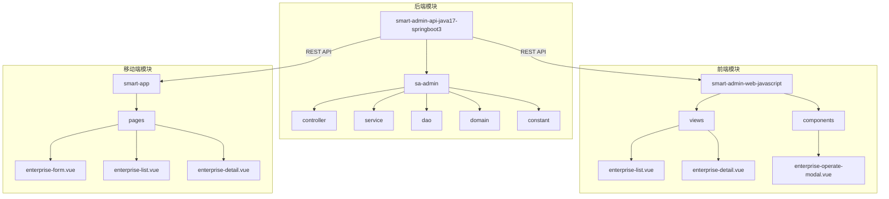

**图源**
- [EnterpriseController.java](file://smart-admin-api-java17-springboot3\sa-admin\src\main\java\net\lab1024\sa\admin\module\business\oa\enterprise\controller\EnterpriseController.java)
- [enterprise-list.vue](file://smart-admin-web-javascript\src\views\business\oa\enterprise\enterprise-list.vue)
- [enterprise-form.vue](file://smart-app\src\pages\enterprise\enterprise-form.vue)

**章节来源**
- [EnterpriseController.java](file://smart-admin-api-java17-springboot3\sa-admin\src\main\java\net\lab1024\sa\admin\module\business\oa\enterprise\controller\EnterpriseController.java)
- [enterprise-list.vue](file://smart-admin-web-javascript\src\views\business\oa\enterprise\enterprise-list.vue)

## 核心组件
企业基本信息管理系统的核心组件包括EnterpriseEntity实体类、EnterpriseController控制器、EnterpriseService服务类和前端企业信息管理组件。EnterpriseEntity实体类定义了企业信息的数据结构，通过MyBatis Plus注解与数据库表t_oa_enterprise进行映射。EnterpriseController提供了RESTful API接口，处理企业信息的增删改查请求，并通过Sa-Token实现权限控制。EnterpriseService封装了业务逻辑，包括企业名称重复校验、数据变更记录等。前端组件enterprise-list.vue实现了企业列表的展示和管理功能，支持分页查询、搜索过滤和导出操作。

**章节来源**
- [EnterpriseEntity.java](file://smart-admin-api-java17-springboot3\sa-admin\src\main\java\net\lab1024\sa\admin\module\business\oa\enterprise\domain\entity\EnterpriseEntity.java)
- [EnterpriseController.java](file://smart-admin-api-java17-springboot3\sa-admin\src\main\java\net\lab1024\sa\admin\module\business\oa\enterprise\controller\EnterpriseController.java)
- [EnterpriseService.java](file://smart-admin-api-java17-springboot3\sa-admin\src\main\java\net\lab1024\sa\admin\module\business\oa\enterprise\service\EnterpriseService.java)
- [enterprise-list.vue](file://smart-admin-web-javascript\src\views\business\oa\enterprise\enterprise-list.vue)

## 架构概述
企业基本信息管理系统采用典型的前后端分离架构，后端基于Spring Boot框架，前端使用Vue.js和UniApp技术栈。系统架构分为表现层、业务逻辑层、数据访问层和数据持久层。表现层由前端Vue.js应用和UniApp移动端应用组成，负责用户界面展示和交互。业务逻辑层由EnterpriseService类实现，封装了企业信息管理的核心业务逻辑。数据访问层通过EnterpriseDao接口与数据库交互，使用MyBatis Plus框架简化数据库操作。数据持久层使用关系型数据库存储企业信息，通过EnterpriseMapper.xml文件定义SQL映射。

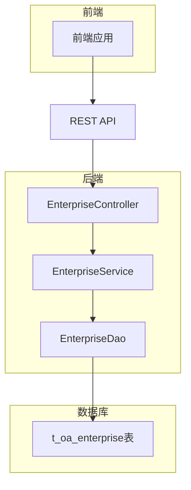

**图源**
- [EnterpriseController.java](file://smart-admin-api-java17-springboot3\sa-admin\src\main\java\net\lab1024\sa\admin\module\business\oa\enterprise\controller\EnterpriseController.java)
- [EnterpriseService.java](file://smart-admin-api-java17-springboot3\sa-admin\src\main\java\net\lab1024\sa\admin\module\business\oa\enterprise\service\EnterpriseService.java)
- [EnterpriseDao.java](file://smart-admin-api-java17-springboot3\sa-admin\src\main\java\net\lab1024\sa\admin\module\business\oa\enterprise\dao\EnterpriseDao.java)
- [EnterpriseMapper.xml](file://smart-admin-api-java17-springboot3\sa-admin\src\main\resources\mapper\business\oa\enterprise\EnterpriseMapper.xml)

## 详细组件分析

### 企业实体类分析
EnterpriseEntity实体类定义了企业信息的数据结构，通过Lombok注解简化代码，使用MyBatis Plus注解实现与数据库的映射。实体类包含企业ID、企业名称、统一社会信用代码、企业类型、联系人、联系方式等字段，每个字段都有详细的注释说明其业务含义。通过@DataTracerFieldLabel注解标记需要进行变更追踪的字段，系统会自动记录这些字段的修改历史。

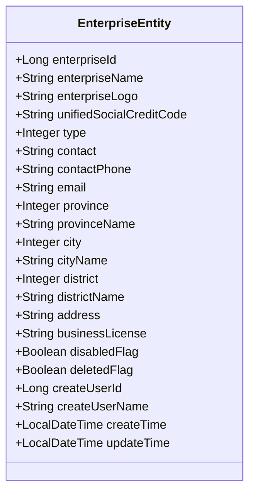

**图源**
- [EnterpriseEntity.java](file://smart-admin-api-java17-springboot3\sa-admin\src\main\java\net\lab1024\sa\admin\module\business\oa\enterprise\domain\entity\EnterpriseEntity.java)

**章节来源**
- [EnterpriseEntity.java](file://smart-admin-api-java17-springboot3\sa-admin\src\main\java\net\lab1024\sa\admin\module\business\oa\enterprise\domain\entity\EnterpriseEntity.java)

### 企业控制器分析
EnterpriseController类提供了企业信息管理的RESTful API接口，使用@RestController注解标记为Spring MVC控制器。控制器通过@SaCheckPermission注解实现基于角色的权限控制，确保只有授权用户才能执行相应操作。每个接口方法都有详细的Swagger文档注释，便于API文档生成和测试。控制器方法通过@RequestBody注解接收JSON格式的请求体，使用@Valid注解触发表单验证。

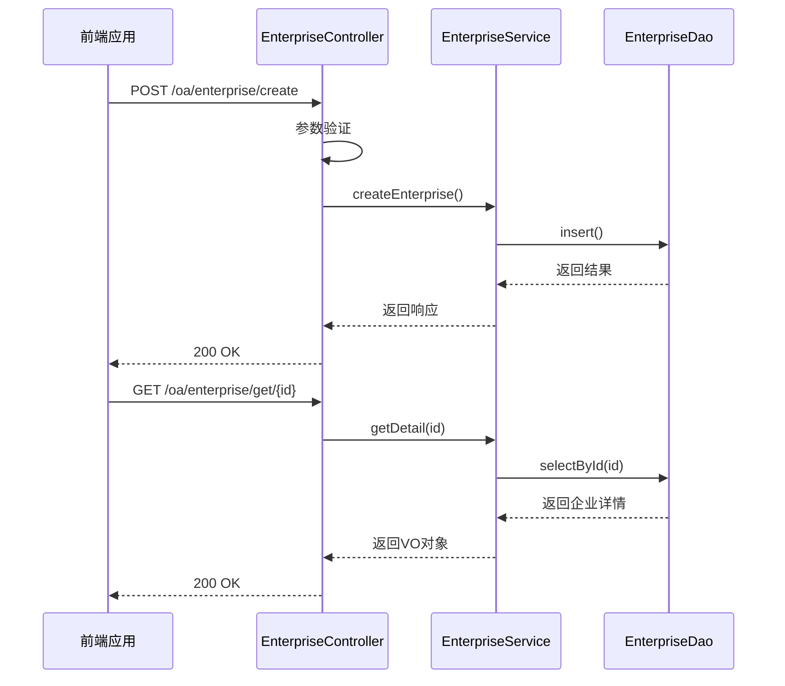

**图源**
- [EnterpriseController.java](file://smart-admin-api-java17-springboot3\sa-admin\src\main\java\net\lab1024\sa\admin\module\business\oa\enterprise\controller\EnterpriseController.java)
- [EnterpriseService.java](file://smart-admin-api-java17-springboot3\sa-admin\src\main\java\net\lab1024\sa\admin\module\business\oa\enterprise\service\EnterpriseService.java)
- [EnterpriseDao.java](file://smart-admin-api-java17-springboot3\sa-admin\src\main\java\net\lab1024\sa\admin\module\business\oa\enterprise\dao\EnterpriseDao.java)

**章节来源**
- [EnterpriseController.java](file://smart-admin-api-java17-springboot3\sa-admin\src\main\java\net\lab1024\sa\admin\module\business\oa\enterprise\controller\EnterpriseController.java)

### 企业服务类分析
EnterpriseService类封装了企业信息管理的核心业务逻辑，使用@Service注解标记为Spring服务组件。服务类通过@Transactional注解确保数据操作的原子性，防止数据不一致。在创建企业时，服务类会检查企业名称是否重复，避免数据冲突。在更新企业信息时，服务类会记录变更前后的数据差异，便于审计追踪。服务类还实现了分页查询、数据导出等复杂业务逻辑。

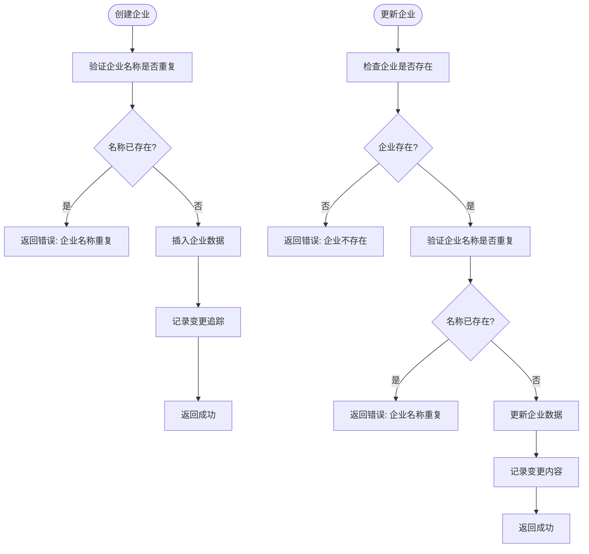

**图源**
- [EnterpriseService.java](file://smart-admin-api-java17-springboot3\sa-admin\src\main\java\net\lab1024\sa\admin\module\business\oa\enterprise\service\EnterpriseService.java)

**章节来源**
- [EnterpriseService.java](file://smart-admin-api-java17-springboot3\sa-admin\src\main\java\net\lab1024\sa\admin\module\business\oa\enterprise\service\EnterpriseService.java)

### 企业类型枚举分析
EnterpriseTypeEnum枚举类定义了企业类型，实现了BaseEnum接口，便于在系统中统一处理枚举值。枚举类包含有限企业和外资企业两种类型，每种类型都有对应的数值和描述。通过SchemaEnum注解，枚举值可以在Swagger文档中自动生成描述信息，方便前端开发人员理解和使用。枚举类的使用确保了企业类型数据的一致性和完整性。

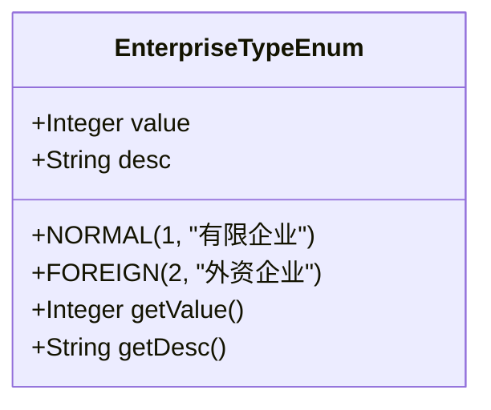

**图源**
- [EnterpriseTypeEnum.java](file://smart-admin-api-java17-springboot3\sa-admin\src\main\java\net\lab1024\sa\admin\module\business\oa\enterprise\constant\EnterpriseTypeEnum.java)

**章节来源**
- [EnterpriseTypeEnum.java](file://smart-admin-api-java17-springboot3\sa-admin\src\main\java\net\lab1024\sa\admin\module\business\oa\enterprise\constant\EnterpriseTypeEnum.java)

### 前端企业列表分析
enterprise-list.vue组件实现了企业列表的展示和管理功能，使用Ant Design Vue组件库构建用户界面。组件支持分页查询、关键字搜索、时间范围筛选等功能，通过enterpriseApi.pageQuery接口获取数据。列表支持自定义列显示，用户可以根据需要调整显示的字段。组件还提供了新建企业、导出数据、编辑和删除等操作按钮，通过权限指令v-privilege控制按钮的显示。

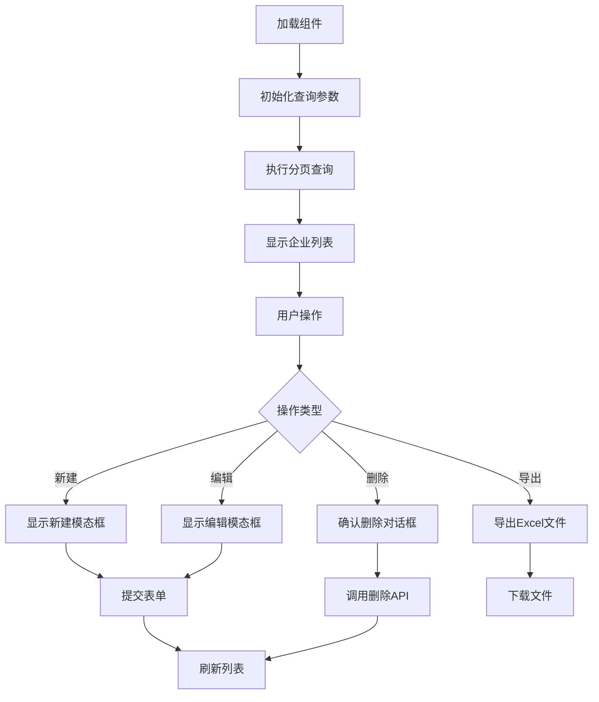

**图源**
- [enterprise-list.vue](file://smart-admin-web-javascript\src\views\business\oa\enterprise\enterprise-list.vue)
- [enterprise-api.js](file://smart-app\src\api\business\oa\enterprise-api.js)

**章节来源**
- [enterprise-list.vue](file://smart-admin-web-javascript\src\views\business\oa\enterprise\enterprise-list.vue)

### 前端企业详情分析
enterprise-detail.vue组件实现了企业详情的展示功能，使用a-page-header组件显示企业名称和logo，使用a-descriptions组件以键值对形式展示企业详细信息。组件通过路由参数获取企业ID，调用enterpriseApi.detail接口获取企业详情数据。页面包含编辑按钮，点击后弹出编辑模态框。对于有权限的用户，页面还显示员工信息、银行信息、发票信息和变更记录等标签页。

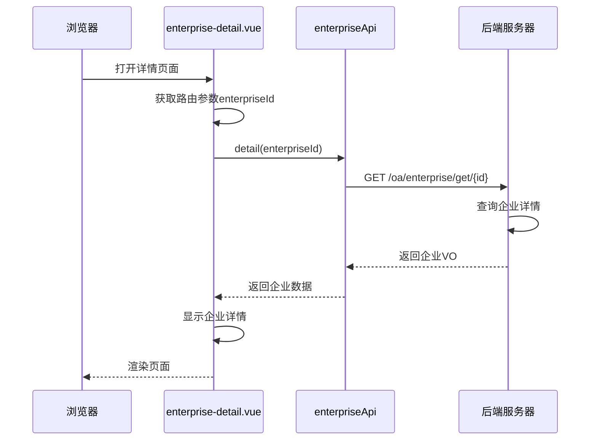

**图源**
- [enterprise-detail.vue](file://smart-admin-web-javascript\src\views\business\oa\enterprise\enterprise-detail.vue)
- [enterprise-api.js](file://smart-app\src\api\business\oa\enterprise-api.js)

**章节来源**
- [enterprise-detail.vue](file://smart-admin-web-javascript\src\views\business\oa\enterprise\enterprise-detail.vue)

### 前端表单操作分析
enterprise-operate-modal.vue组件实现了企业信息的创建和编辑功能，使用a-modal组件作为模态框容器。表单包含企业名称、统一社会信用代码、企业类型、联系人、联系方式等字段，每个字段都有相应的验证规则。对于地区选择，组件使用AreaCascader级联选择器，自动填充省市区信息。表单提交时，根据是否存在enterpriseId判断是创建还是更新操作，调用相应的API接口。

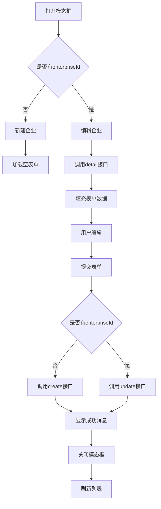

**图源**
- [enterprise-operate-modal.vue](file://smart-admin-web-javascript\src\views\business\oa\enterprise\components\enterprise-operate-modal.vue)
- [enterprise-api.js](file://smart-app\src\api\business\oa\enterprise-api.js)

**章节来源**
- [enterprise-operate-modal.vue](file://smart-admin-web-javascript\src\views\business\oa\enterprise\components\enterprise-operate-modal.vue)

### 移动端表单分析
enterprise-form.vue组件实现了移动端的企业信息创建和编辑功能，使用UniApp框架的uni-forms组件构建表单界面。表单分为基本信息和联系方式两个分组，使用smart-enum-radio组件选择企业类型。表单验证规则与Web端保持一致，确保数据一致性。组件通过onLoad生命周期钩子判断是新建还是编辑模式，并相应地设置页面标题和加载数据。

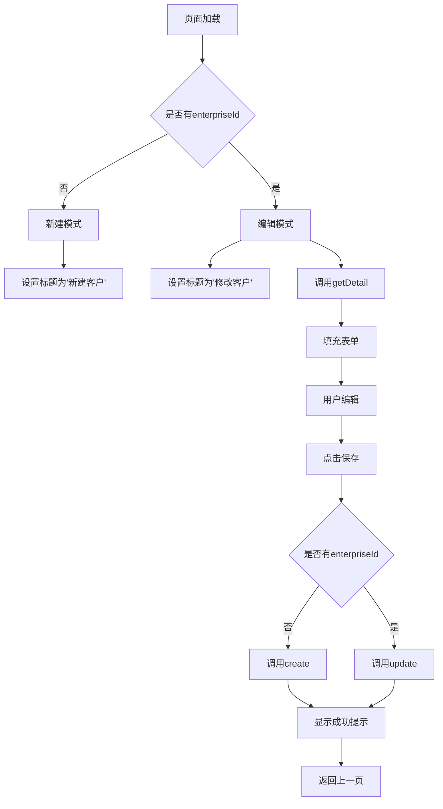

**图源**
- [enterprise-form.vue](file://smart-app\src\pages\enterprise\enterprise-form.vue)
- [enterprise-api.js](file://smart-app\src\api\business\oa\enterprise-api.js)

**章节来源**
- [enterprise-form.vue](file://smart-app\src\pages\enterprise\enterprise-form.vue)

## 依赖分析
企业基本信息管理系统各组件之间存在明确的依赖关系。后端控制器依赖服务类，服务类依赖数据访问层，形成典型的分层架构。前端组件通过API接口依赖后端服务，实现数据交互。系统还依赖一些公共组件，如权限控制、日志记录、文件上传等，这些功能由sa-base模块提供。通过合理的依赖管理，系统实现了高内聚低耦合的设计目标。

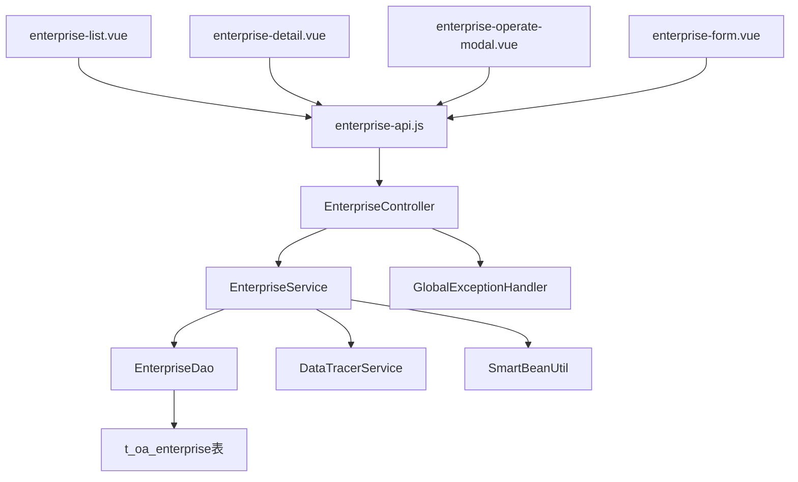

**图源**
- [EnterpriseController.java](file://smart-admin-api-java17-springboot3\sa-admin\src\main\java\net\lab1024\sa\admin\module\business\oa\enterprise\controller\EnterpriseController.java)
- [EnterpriseService.java](file://smart-admin-api-java17-springboot3\sa-admin\src\main\java\net\lab1024\sa\admin\module\business\oa\enterprise\service\EnterpriseService.java)
- [EnterpriseDao.java](file://smart-admin-api-java17-springboot3\sa-admin\src\main\java\net\lab1024\sa\admin\module\business\oa\enterprise\dao\EnterpriseDao.java)
- [enterprise-list.vue](file://smart-admin-web-javascript\src\views\business\oa\enterprise\enterprise-list.vue)
- [enterprise-api.js](file://smart-app\src\api\business\oa\enterprise-api.js)

**章节来源**
- [EnterpriseController.java](file://smart-admin-api-java17-springboot3\sa-admin\src\main\java\net\lab1024\sa\admin\module\business\oa\enterprise\controller\EnterpriseController.java)
- [EnterpriseService.java](file://smart-admin-api-java17-springboot3\sa-admin\src\main\java\net\lab1024\sa\admin\module\business\oa\enterprise\service\EnterpriseService.java)
- [enterprise-list.vue](file://smart-admin-web-javascript\src\views\business\oa\enterprise\enterprise-list.vue)

## 性能考虑
企业基本信息管理系统在设计时充分考虑了性能优化。后端使用MyBatis Plus的分页插件实现高效的数据分页查询，避免一次性加载大量数据。对于企业名称的唯一性校验，系统在数据库层面建立了唯一索引，确保校验操作的高效性。前端实现了懒加载和虚拟滚动，提升大数据量下的列表渲染性能。系统还提供了数据导出功能，支持带水印的Excel文件导出，满足审计需求。

**章节来源**
- [EnterpriseService.java](file://smart-admin-api-java17-springboot3\sa-admin\src\main\java\net\lab1024\sa\admin\module\business\oa\enterprise\service\EnterpriseService.java)
- [EnterpriseDao.java](file://smart-admin-api-java17-springboot3\sa-admin\src\main\java\net\lab1024\sa\admin\module\business\oa\enterprise\dao\EnterpriseDao.java)
- [enterprise-list.vue](file://smart-admin-web-javascript\src\views\business\oa\enterprise\enterprise-list.vue)

## 故障排除指南
在使用企业基本信息管理系统时，可能会遇到一些常见问题。如果无法创建企业，首先检查企业名称是否已存在，系统不允许重复的企业名称。如果编辑企业时出现"企业不存在"的错误，可能是企业已被删除或ID错误。如果列表查询无数据，检查查询条件是否过于严格。对于权限相关的问题，确保当前用户具有相应的操作权限。系统会记录所有操作日志，便于问题排查。

**章节来源**
- [EnterpriseService.java](file://smart-admin-api-java17-springboot3\sa-admin\src\main\java\net\lab1024\sa\admin\module\business\oa\enterprise\service\EnterpriseService.java)
- [GlobalExceptionHandler.java](file://smart-admin-api-java17-springboot3\sa-base\src\main\java\net\lab1024\sa\base\handler\GlobalExceptionHandler.java)

## 结论
企业基本信息管理系统实现了完整的企业信息管理功能，包括增删改查、类型管理、表单验证和数据持久化。系统采用前后端分离架构，后端基于Spring Boot框架，前端使用Vue.js和UniApp技术栈，具有良好的可维护性和扩展性。通过合理的分层设计和依赖管理，系统实现了高内聚低耦合的目标。未来可以考虑增加企业关联关系管理、多级组织架构支持等高级功能，进一步提升系统的实用价值。