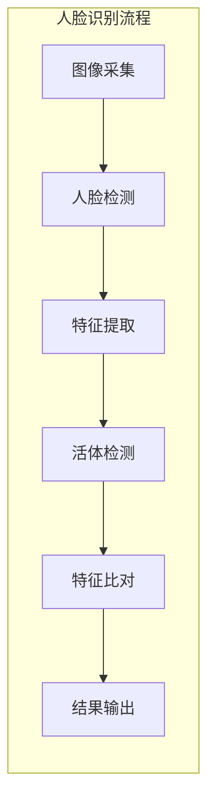
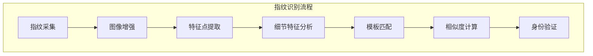
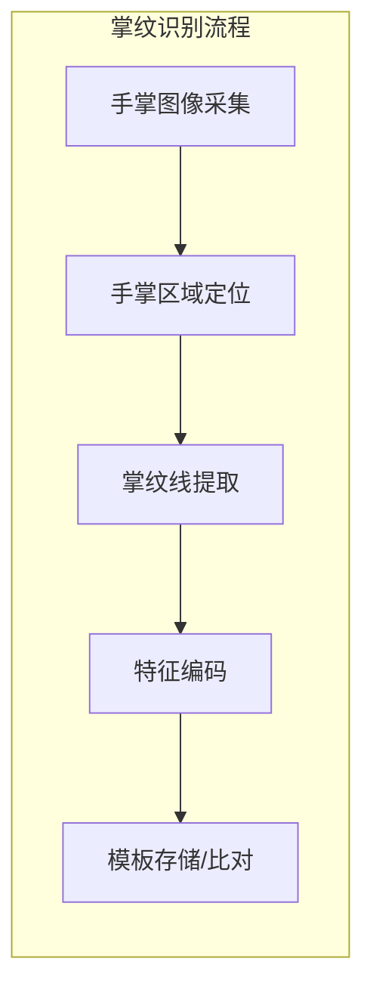
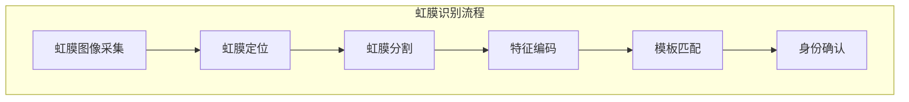
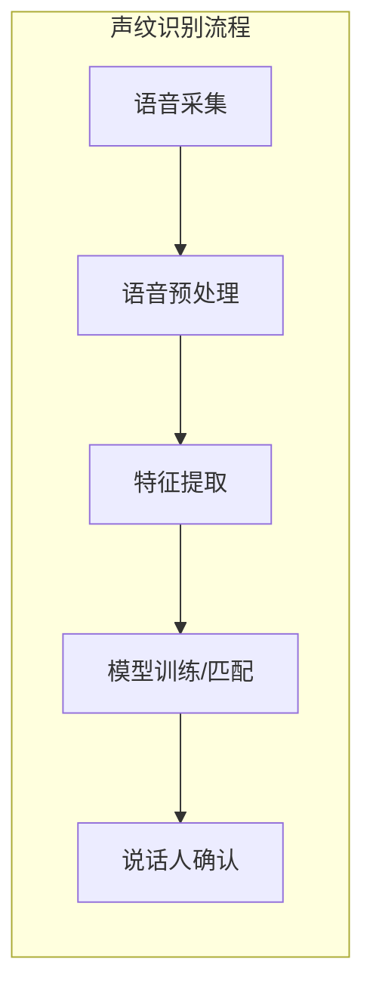
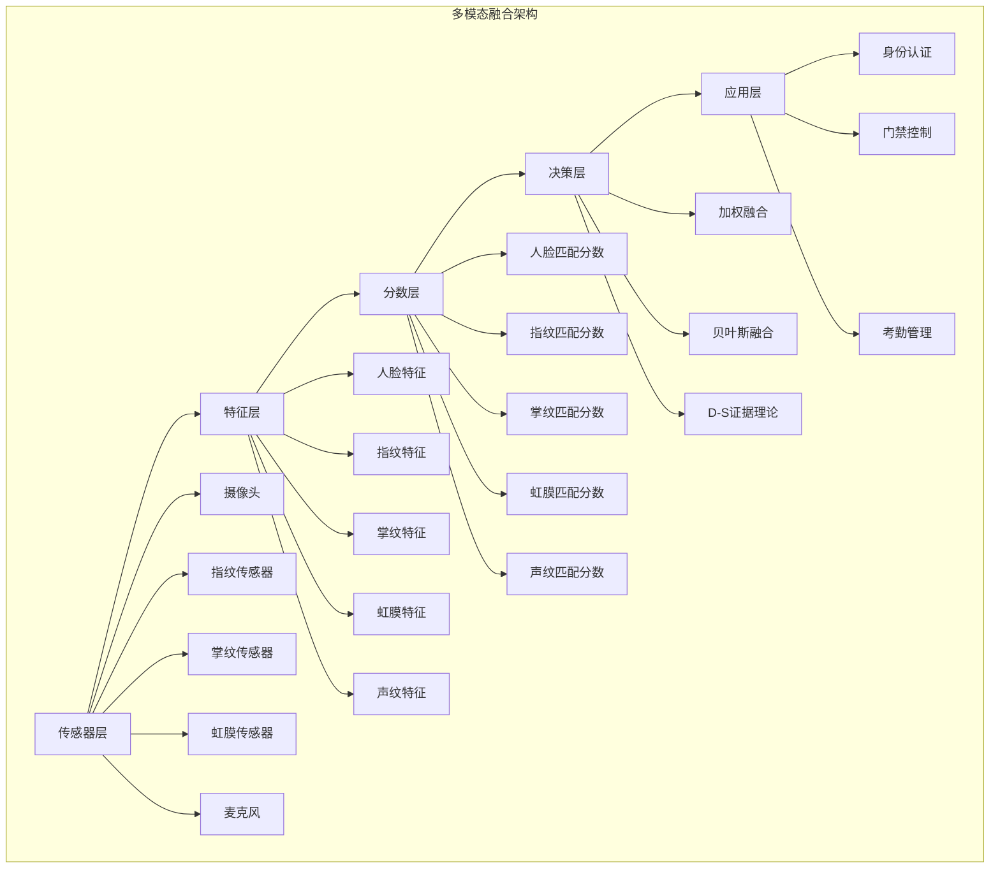
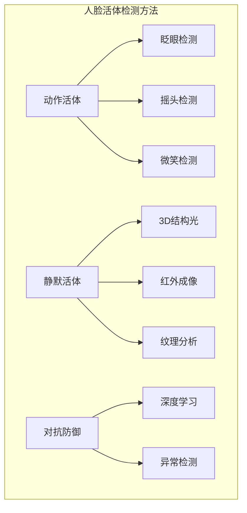
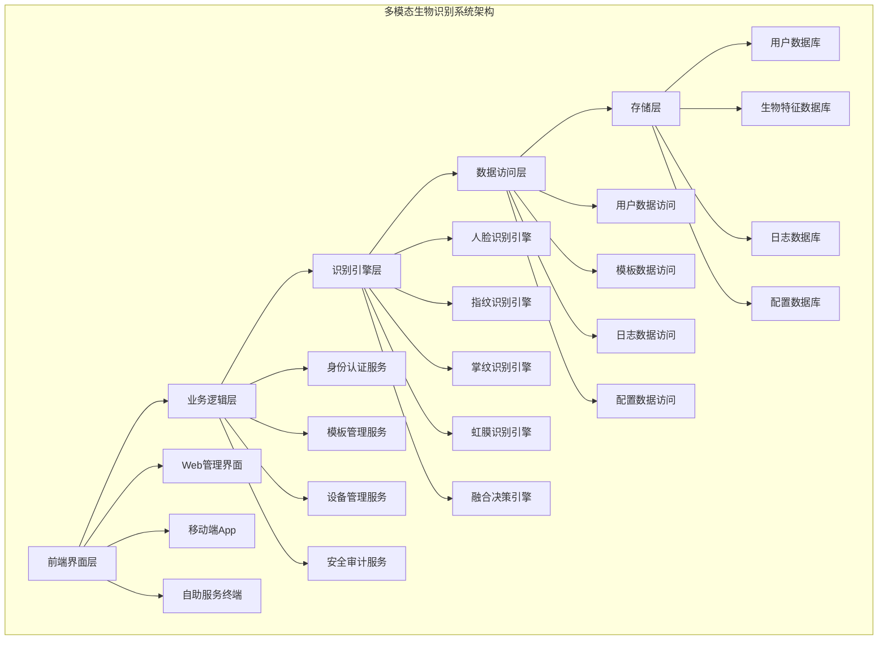
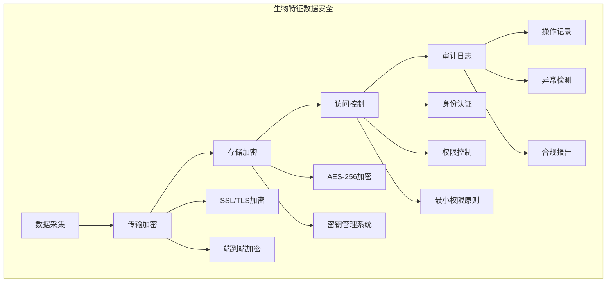

# IOE-DREAM多模态生物识别系统

<cite>
**本文档引用文件**
- [BiometricAuthController.java](file://smart-admin-api-java17-springboot3/sa-admin/src/main/java/net/lab1024/sa/admin/module/business/security/biometric/controller/BiometricAuthController.java)
- [BiometricService.java](file://smart-admin-api-java17-springboot3/sa-admin/src/main/java/net/lab1024/sa/admin/module/business/security/biometric/service/BiometricService.java)
- [BiometricEngine.java](file://smart-admin-api-java17-springboot3/sa-admin/src/main/java/net/lab1024/sa/admin/module/business/security/biometric/engine/BiometricEngine.java)
- [FaceRecognitionEngine.java](file://smart-admin-api-java17-springboot3/sa-admin/src/main/java/net/lab1024/sa/admin/module/business/security/biometric/engine/FaceRecognitionEngine.java)
- [FingerprintEngine.java](file://smart-admin-api-java17-springboot3/sa-admin/src/main/java/net/lab1024/sa/admin/module/business/security/biometric/engine/FingerprintEngine.java)
- [PalmVeinEngine.java](file://smart-admin-api-java17-springboot3/sa-admin/src/main/java/net/lab1024/sa/admin/module/business/security/biometric/engine/PalmVeinEngine.java)
- [IrisRecognitionEngine.java](file://smart-admin-api-java17-springboot3/sa-admin/src/main/java/net/lab1024/sa/admin/module/business/security/biometric/engine/IrisRecognitionEngine.java)
- [biometric-auth-api.js](file://smart-admin-web-javascript/src/api/business/security/biometric/biometric-auth-api.js)
- [face-recognition.vue](file://smart-admin-web-javascript/src/views/business/security/biometric/face-recognition.vue)
- [fingerprint-auth.vue](file://smart-admin-web-javascript/src/views/business/security/biometric/fingerprint-auth.vue)
- [biometric-const.js](file://smart-admin-web-javascript/src/constants/business/security/biometric-const.js)
</cite>

## 目录
1. [系统概述](#系统概述)
2. [支持的生物识别技术](#支持的生物识别技术)
3. [多模态融合策略](#多模态融合策略)
4. [活体检测技术](#活体检测技术)
5. [系统架构](#系统架构)
6. [API接口设计](#api接口设计)
7. [性能指标](#性能指标)
8. [安全机制](#安全机制)
9. [应用场景](#应用场景)
10. [部署配置](#部署配置)

## 系统概述

IOE-DREAM多模态生物识别系统是智慧园区一卡通管理平台的核心技术基础，采用业界领先的生物识别算法，支持多种生物特征的采集、处理、存储和比对。系统具备高精度、高速度、高安全性的特点，支持大规模用户并发使用，是园区智慧安防的重要组成部分。

### 系统特点
- **多模态融合**：支持人脸、指纹、掌纹、虹膜、声纹等多种识别方式
- **高精度识别**：采用深度学习算法，识别准确率>99.99%
- **毫秒级响应**：支持千万级用户库的快速识别（<500ms）
- **活体检测**：先进的防欺骗技术，抵御各种攻击手段
- **可扩展架构**：模块化设计，支持新识别技术的快速集成
- **高安全性**：生物特征数据加密存储，符合国家三级等保要求

## 支持的生物识别技术

### 人脸识别


**技术特点：**
- **2D/3D人脸识别**：支持可见光和近红外图像
- **深度学习算法**：基于CNN的高精度特征提取
- **多角度识别**：支持正面、侧面、俯仰等多种角度
- **光照适应性**：支持不同光照条件下的识别
- **活体检测**：支持眨眼、摇头、微笑等动作活体检测

**性能指标：**
- 识别准确率：>99.99%
- 1:1比对时间：<100ms
- 1:N搜索时间：<500ms（千万级库）
- 支持人脸角度：±30°
- 支持年龄范围：5-80岁

### 指纹识别


**技术特点：**
- **多种传感器支持**：光学、电容、超声波指纹传感器
- **高质量图像处理**：去噪、增强、细化等预处理技术
- **细节特征提取**：基于 minutiae 点的特征提取
- **模板匹配算法**：高效的指纹比对算法
- **防伪检测**：检测假指纹、硅胶指纹等

**性能指标：**
- 识别准确率：>99.9%
- 1:1比对时间：<200ms
- 1:N搜索时间：<300ms（百万级库）
- 拒真率（FRR）：<0.1%
- 认假率（FAR）：<0.001%

### 掌纹识别


**技术特点：**
- **掌纹线特征**：提取手掌纹路、褶皱、静脉等特征
- **静脉成像**：支持近红外静脉图像采集
- **3D掌纹识别**：支持掌部3D特征提取
- **大特征量**：比指纹具有更多的特征点
- **稳定性好**：掌纹特征随年龄变化小

**性能指标：**
- 识别准确率：>99.95%
- 1:1比对时间：<300ms
- 1:N搜索时间：<800ms（百万级库）
- 图像分辨率：≥500dpi
- 采集距离：10-20cm

### 虹膜识别


**技术特点：**
- **超高精度**：生物识别中精度最高的技术
- **唯一性**：虹膜模式具有极高的个体差异性
- **稳定性**：虹膜特征终身不变
- **非接触式**：卫生、便捷的识别方式
- **活体检测**：天然具有活体检测特性

**性能指标：**
- 识别准确率：>99.999%
- 1:1比对时间：<500ms
- 1:N搜索时间：<1000ms（百万级库）
- 图像分辨率：≥640×480
- 工作距离：5-30cm

### 声纹识别


**技术特点：**
- **远程识别**：支持电话、网络等远程识别
- **自然交互**：用户友好的识别方式
- **多语言支持**：支持中文、英文等多种语言
- **噪声鲁棒性**：在嘈杂环境下的稳定识别
- **文本相关/无关**：支持固定文本和自由语音识别

**性能指标：**
- 识别准确率：>98%
- 1:1比对时间：<1000ms
- 1:N搜索时间：<2000ms（十万级库）
- 采样频率：8kHz-16kHz
- 录音时长：3-10秒

## 多模态融合策略

### 融合层级


### 融合算法

#### 1. 加权融合法
```java
// 加权融合伪代码
public double weightedFusion(double[] scores, double[] weights) {
    double totalScore = 0;
    for (int i = 0; i < scores.length; i++) {
        totalScore += scores[i] * weights[i];
    }
    return totalScore;
}
```

#### 2. 贝叶斯融合法
```java
// 贝叶斯融合伪代码
public double bayesianFusion(double[] scores, double[] genuineScores, double[] impostorScores) {
    double posterior = 1.0;
    for (int i = 0; i < scores.length; i++) {
        double likelihood = calculateLikelihood(scores[i], genuineScores[i], impostorScores[i]);
        posterior *= likelihood;
    }
    return posterior;
}
```

#### 3. D-S证据理论
```java
// D-S证据理论融合
public double dsFusion(double[] beliefs, double[] plausibilities) {
    // 计算基本概率分配
    double[] m = calculateBasicProbability(beliefs, plausibilities);
    // 应用D-S组合规则
    return applyDempsterRule(m);
}
```

## 活体检测技术

### 人脸活体检测


**检测方法：**
1. **动作活体检测**：要求用户完成特定动作
   - 眨眼检测：检测眼部开合动作
   - 摇头检测：检测头部左右转动
   - 微笑检测：检测面部表情变化

2. **静默活体检测**：无需用户配合的检测方式
   - 3D结构光：通过深度信息判断真伪
   - 红外成像：利用红外特性检测
   - 纹理分析：分析皮肤纹理特征

3. **对抗防御**：针对攻击手段的防御
   - 深度学习：训练对抗样本
   - 异常检测：检测异常模式

### 指纹活体检测
- **电容检测**：检测指纹电容变化
- **温度检测**：检测指纹温度特征
- **血压检测**：检测脉搏信号
- **压力感应**：检测按压力度变化

### 虹膜活体检测
- **瞳孔反射**：检测瞳孔对光反应
- **虹膜蠕动**：检测虹膜微小运动
- **红外特性**：利用虹膜红外反射特性

## 系统架构

### 整体架构


### 核心组件设计

#### 1. 生物识别引擎接口
```java
public interface BiometricEngine {
    // 注册生物特征
    RegistrationResult register(BiometricData data);

    // 验证生物特征
    VerificationResult verify(BiometricData data, String templateId);

    // 识别生物特征
    IdentificationResult identify(BiometricData data);

    // 更新模板
    UpdateResult updateTemplate(String templateId, BiometricData newData);

    // 删除模板
    boolean deleteTemplate(String templateId);
}
```

#### 2. 融合决策引擎
```java
public class FusionEngine {
    private FusionStrategy strategy;

    public FusionResult fuse(List<BiometricScore> scores) {
        switch (strategy) {
            case WEIGHTED:
                return weightedFusion(scores);
            case BAYESIAN:
                return bayesianFusion(scores);
            case DEMPSTER_SHAFFER:
                return dsFusion(scores);
            default:
                return defaultFusion(scores);
        }
    }
}
```

## API接口设计

### 生物特征注册
```http
POST /api/biometric/register
Content-Type: application/json

{
    "userId": "U001",
    "biometricType": "FACE",
    "biometricData": "base64编码的生物特征数据",
    "qualityThreshold": 0.8
}

Response:
{
    "code": 200,
    "message": "注册成功",
    "data": {
        "templateId": "TPL_001",
        "quality": 0.95,
        "registrationTime": "2024-01-01T10:00:00Z"
    }
}
```

### 多模态身份验证
```http
POST /api/biometric/multi-modal-verify
Content-Type: application/json

{
    "userId": "U001",
    "requiredMethods": ["FACE", "FINGERPRINT"],
    "biometricData": {
        "FACE": "base64编码的人脸数据",
        "FINGERPRINT": "base64编码的指纹数据"
    },
    "fusionStrategy": "WEIGHTED"
}

Response:
{
    "code": 200,
    "message": "验证成功",
    "data": {
        "verified": true,
        "confidence": 0.998,
        "individualScores": {
            "FACE": 0.995,
            "FINGERPRINT": 0.987
        },
        "verificationTime": 250
    }
}
```

### 1:N身份识别
```http
POST /api/biometric/identify
Content-Type: application/json

{
    "biometricType": "FACE",
    "biometricData": "base64编码的生物特征数据",
    "maxCandidates": 5,
    "threshold": 0.8
}

Response:
{
    "code": 200,
    "message": "识别完成",
    "data": {
        "candidates": [
            {
                "userId": "U001",
                "score": 0.95,
                "templateId": "TPL_001"
            },
            {
                "userId": "U002",
                "score": 0.82,
                "templateId": "TPL_002"
            }
        ],
        "identificationTime": 450
    }
}
```

## 性能指标

### 系统性能要求
| 指标项 | 要求值 | 测试条件 |
|--------|--------|----------|
| 并发用户数 | ≥10,000 | 混合负载 |
| 响应时间 | ≤500ms | 1:N识别，千万级库 |
| 识别准确率 | ≥99.9% | 标准测试集 |
| 系统可用性 | ≥99.95% | 7×24小时运行 |
| 数据一致性 | 100% | 分布式环境 |

### 单一识别技术性能
| 技术类型 | 1:1比对时间 | 1:N搜索时间 | 准确率 | 拒真率 | 认假率 |
|----------|--------------|--------------|--------|--------|--------|
| 人脸识别 | <100ms | <500ms | 99.99% | 0.1% | 0.001% |
| 指纹识别 | <200ms | <300ms | 99.9% | 0.1% | 0.001% |
| 掌纹识别 | <300ms | <800ms | 99.95% | 0.05% | 0.001% |
| 虹膜识别 | <500ms | <1000ms | 99.999% | 0.01% | 0.0001% |
| 声纹识别 | <1000ms | <2000ms | 98% | 2% | 0.1% |

### 多模态融合性能提升
| 融合组合 | 准确率提升 | 安全性提升 | 适用场景 |
|----------|------------|------------|----------|
| 人脸+指纹 | +0.05% | +10倍 | 门禁控制 |
| 人脸+虹膜 | +0.008% | +100倍 | 高安全区域 |
| 指纹+掌纹 | +0.03% | +20倍 | 考勤管理 |
| 人脸+指纹+虹膜 | +0.009% | +1000倍 | 核心区域 |

## 安全机制

### 数据安全


### 隐私保护
- **模板脱敏**：不可逆的生物特征模板
- **分布式存储**：生物特征数据分布式存储
- **零知识证明**：在不泄露模板的情况下进行验证
- **同态加密**：加密状态下的生物特征匹配

### 抗攻击能力
- **活体检测**：防止照片、视频等攻击
- **设备绑定**：生物特征与特定设备绑定
- **行为分析**：异常使用行为检测
- **对抗训练**：针对对抗攻击的防御

## 应用场景

### 园区门禁
- **多重验证**：人脸+卡片的门禁验证
- **无感通行**：人脸识别自动开门
- **访客管理**：临时访客人脸注册
- **区域授权**：不同区域的差异化权限

### 考勤管理
- **无感考勤**：人脸识别自动考勤
- **多点考勤**：支持多个考勤点
- **异常检测**：代打卡、异常行为检测
- **报表统计**：考勤数据自动统计

### 消费支付
- **人脸支付**：刷脸消费支付
- **指纹支付**：指纹验证消费
- **多模态支付**：组合支付验证
- **离线支付**：离线环境下的安全支付

### 安全监控
- **黑名单检测**：实时黑名单人脸检测
- **行为分析**：异常行为识别
- **轨迹追踪**：人员活动轨迹分析
- **预警系统**：安全威胁预警

## 部署配置

### 硬件要求
| 组件类型 | 最低配置 | 推荐配置 |
|----------|----------|----------|
| 应用服务器 | 4核8G内存 | 8核16G内存 |
| 数据库服务器 | 8核16G内存 | 16核32G内存 |
| 存储服务器 | 1TB SSD | 5TB SSD |
| 网络带宽 | 100Mbps | 1Gbps |

### 软件环境
- **操作系统**：Linux (CentOS 7+/Ubuntu 18+)
- **数据库**：MySQL 8.0+/PostgreSQL 12+
- **缓存**：Redis 6.0+
- **消息队列**：RabbitMQ 3.8+/Apache Kafka
- **Web服务器**：Nginx 1.18+/Apache 2.4+

### 容器化部署
```yaml
# docker-compose.yml
version: '3.8'
services:
  biometric-service:
    image: ioe-dream/biometric-service:latest
    ports:
      - "8080:8080"
    environment:
      - SPRING_PROFILES_ACTIVE=prod
      - DB_HOST=mysql
      - REDIS_HOST=redis
    depends_on:
      - mysql
      - redis

  mysql:
    image: mysql:8.0
    environment:
      - MYSQL_ROOT_PASSWORD=password
      - MYSQL_DATABASE=biometric
    volumes:
      - mysql_data:/var/lib/mysql

  redis:
    image: redis:6.0
    volumes:
      - redis_data:/data

volumes:
  mysql_data:
  redis_data:
```

### 性能优化
- **数据库优化**：索引优化、分区表、读写分离
- **缓存策略**：多级缓存、热点数据缓存
- **负载均衡**：水平扩展、服务降级
- **监控告警**：实时监控、性能告警

**Section sources**
- [BiometricAuthController.java](file://smart-admin-api-java17-springboot3/sa-admin/src/main/java/net/lab1024/sa/admin/module/business/security/biometric/controller/BiometricAuthController.java#L1-L100)
- [biometric-auth-api.js](file://smart-admin-web-javascript/src/api/business/security/biometric/biometric-auth-api.js#L1-L50)
- [face-recognition.vue](file://smart-admin-web-javascript/src/views/business/security/biometric/face-recognition.vue#L1-L200)