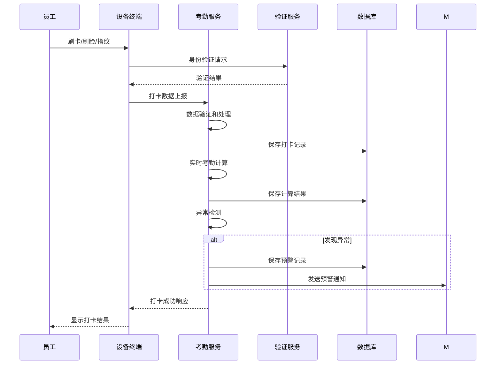
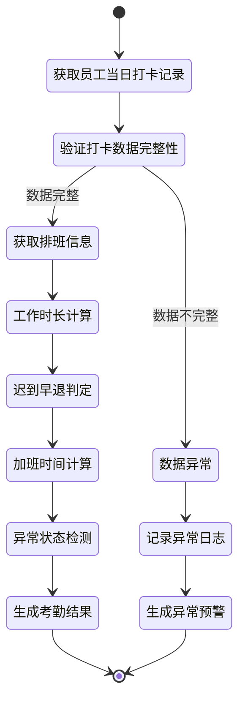

# 原始记录及考勤计算设计

> **版本**: v1.0
> **更新时间**: 2025-11-13
> **分类**: 核心功能模块 > 企业OA系统 > 考勤管理
> **标签**: ["考勤系统", "打卡记录", "考勤计算", "数据采集", "算法实现"]
> **作者**: SmartAdmin规范治理委员会
> **描述**: IOE-DREAM智慧园区一卡通管理平台考勤系统的原始记录采集和考勤计算完整设计方案

## 📋 系统概述

### 核心功能

**考勤管理系统**是IOE-DREAM智慧园区一卡通管理平台的重要模块，负责员工的打卡数据采集、考勤计算、异常检测和统计分析。系统支持多种打卡方式，提供灵活的考勤规则配置，实现自动化考勤管理。

### 主要特性

- ✅ **多方式打卡**：支持人脸识别、指纹、刷卡、移动端打卡
- ✅ **实时计算**：打卡后实时计算考勤结果
- ✅ **灵活规则**：支持自定义考勤规则和异常判定
- ✅ **异常预警**：实时检测异常情况并预警
- ✅ **统计分析**：提供多维度的考勤统计分析

## 🗄️ 数据库设计

### 1. 打卡记录表（clock_records）

```sql
CREATE TABLE `clock_records` (
  `record_id` bigint(20) NOT NULL AUTO_INCREMENT COMMENT '记录ID',
  `employee_id` bigint(20) NOT NULL COMMENT '员工ID',
  `employee_code` varchar(32) NOT NULL COMMENT '员工编号',
  `employee_name` varchar(100) NOT NULL COMMENT '员工姓名',
  `clock_type` tinyint(4) NOT NULL COMMENT '打卡类型 1-上班 2-下班 3-加班开始 4-加班结束',
  `clock_time` datetime NOT NULL COMMENT '打卡时间',
  `clock_location` varchar(100) DEFAULT NULL COMMENT '打卡地点',
  `device_id` bigint(20) DEFAULT NULL COMMENT '设备ID',
  `device_type` varchar(32) DEFAULT NULL COMMENT '设备类型',
  `auth_method` varchar(32) DEFAULT NULL COMMENT '认证方式',
  `verify_result` varchar(32) NOT NULL COMMENT '验证结果',
  `photo_path` varchar(500) DEFAULT NULL COMMENT '照片路径',
  `ip_address` varchar(50) DEFAULT NULL COMMENT 'IP地址',
  `gps_location` varchar(100) DEFAULT NULL COMMENT 'GPS定位',
  `create_time` datetime NOT NULL DEFAULT CURRENT_TIMESTAMP COMMENT '创建时间',
  `update_time` datetime NOT NULL DEFAULT CURRENT_TIMESTAMP ON UPDATE CURRENT_TIMESTAMP COMMENT '更新时间',
  PRIMARY KEY (`record_id`),
  KEY `idx_employee_id` (`employee_id`),
  KEY `idx_employee_code` (`employee_code`),
  KEY `idx_clock_time` (`clock_time`),
  KEY `idx_employee_date` (`employee_id`, DATE(clock_time)),
  KEY `idx_create_time` (`create_time`)
) ENGINE=InnoDB DEFAULT CHARSET=utf8mb4 COMMENT='打卡记录表'
PARTITION BY RANGE (YEAR(clock_time)) (
    PARTITION p2023 VALUES LESS THAN (2024),
    PARTITION p2024 VALUES LESS THAN (2025),
    PARTITION p2025 VALUES LESS THAN (2026),
    PARTITION p_future VALUES LESS THAN MAXVALUE
);
```

### 2. 考勤计算结果表（attendance_results）

```sql
CREATE TABLE `attendance_results` (
  `result_id` bigint(20) NOT NULL AUTO_INCREMENT COMMENT '结果ID',
  `employee_id` bigint(20) NOT NULL COMMENT '员工ID',
  `employee_code` varchar(32) NOT NULL COMMENT '员工编号',
  `employee_name` varchar(100) NOT NULL COMMENT '员工姓名',
  `attendance_date` date NOT NULL COMMENT '考勤日期',
  `work_schedule_id` bigint(20) DEFAULT NULL COMMENT '排班ID',
  `should_work_minutes` int(11) DEFAULT '0' COMMENT '应工作时长(分钟)',
  `actual_work_minutes` int(11) DEFAULT '0' COMMENT '实际工作时长(分钟)',
  `overtime_minutes` int(11) DEFAULT '0' COMMENT '加班时长(分钟)',
  `late_minutes` int(11) DEFAULT '0' COMMENT '迟到时长(分钟)',
  `early_leave_minutes` int(11) DEFAULT '0' COMMENT '早退时长(分钟)',
  `leave_days` decimal(3,1) DEFAULT '0.0' COMMENT '请假天数',
  `absence_days` decimal(3,1) DEFAULT '0.0' COMMENT '缺勤天数',
  `attendance_status` varchar(32) NOT NULL COMMENT '考勤状态',
  `is_abnormal` tinyint(1) DEFAULT '0' COMMENT '是否异常 0-正常 1-异常',
  `calculate_time` datetime NOT NULL COMMENT '计算时间',
  `create_time` datetime NOT NULL DEFAULT CURRENT_TIMESTAMP COMMENT '创建时间',
  `update_time` datetime NOT NULL DEFAULT CURRENT_TIMESTAMP ON UPDATE CURRENT_TIMESTAMP COMMENT '更新时间',
  PRIMARY KEY (`result_id`),
  UNIQUE KEY `uk_employee_date` (`employee_id`, `attendance_date`),
  KEY `idx_employee_code` (`employee_code`),
  KEY `idx_attendance_date` (`attendance_date`),
  KEY `idx_is_abnormal` (`is_abnormal`),
  KEY `idx_calculate_time` (`calculate_time`)
) ENGINE=InnoDB DEFAULT CHARSET=utf8mb4 COMMENT='考勤计算结果表'
PARTITION BY RANGE (YEAR(attendance_date)) (
    PARTITION p2023 VALUES LESS THAN (2024),
    PARTITION p2024 VALUES LESS THAN (2025),
    PARTITION p2025 VALUES LESS THAN (2026),
    PARTITION p_future VALUES LESS THAN MAXVALUE
);
```

### 3. 考勤预警记录表（attendance_warning_records）

```sql
CREATE TABLE `attendance_warning_records` (
  `warning_id` bigint(20) NOT NULL AUTO_INCREMENT COMMENT '预警ID',
  `employee_id` bigint(20) NOT NULL COMMENT '员工ID',
  `employee_code` varchar(32) NOT NULL COMMENT '员工编号',
  `employee_name` varchar(100) NOT NULL COMMENT '员工姓名',
  `warning_type` varchar(32) NOT NULL COMMENT '预警类型',
  `warning_level` varchar(32) NOT NULL COMMENT '预警级别',
  `warning_content` varchar(500) NOT NULL COMMENT '预警内容',
  `attendance_date` date NOT NULL COMMENT '考勤日期',
  `related_record_id` bigint(20) DEFAULT NULL COMMENT '相关记录ID',
  `warning_status` varchar(32) DEFAULT 'PENDING' COMMENT '预警状态',
  `handle_time` datetime DEFAULT NULL COMMENT '处理时间',
  `handle_user_id` bigint(20) DEFAULT NULL COMMENT '处理人ID',
  `handle_remark` varchar(500) DEFAULT NULL COMMENT '处理备注',
  `create_time` datetime NOT NULL DEFAULT CURRENT_TIMESTAMP COMMENT '创建时间',
  `update_time` datetime NOT NULL DEFAULT CURRENT_TIMESTAMP ON UPDATE CURRENT_TIMESTAMP COMMENT '更新时间',
  PRIMARY KEY (`warning_id`),
  KEY `idx_employee_id` (`employee_id`),
  KEY `idx_warning_type` (`warning_type`),
  KEY `idx_warning_level` (`warning_level`),
  KEY `idx_attendance_date` (`attendance_date`),
  KEY `idx_warning_status` (`warning_status`),
  KEY `idx_create_time` (`create_time`)
) ENGINE=InnoDB DEFAULT CHARSET=utf8mb4 COMMENT='考勤预警记录表'
PARTITION BY RANGE (YEAR(attendance_date)) (
    PARTITION p2023 VALUES LESS THAN (2024),
    PARTITION p2024 VALUES LESS THAN (2025),
    PARTITION p2025 VALUES LESS THAN (2026),
    PARTITION p_future VALUES LESS THAN MAXVALUE
);
```

## 🔄 业务逻辑设计

### 1. 打卡数据采集逻辑



### 2. 考勤计算逻辑



### 3. 异常检测逻辑

```java
@Component
@Slf4j
public class AttendanceAnomalyDetector {

    @Resource
    private AttendanceWarningService warningService;

    /**
     * 检测考勤异常
     */
    public List<AttendanceWarning> detectAnomalies(AttendanceResult result) {
        List<AttendanceWarning> warnings = new ArrayList<>();

        // 1. 检测迟到异常
        if (result.getLateMinutes() > 0) {
            warnings.add(this.createLateWarning(result));
        }

        // 2. 检测早退异常
        if (result.getEarlyLeaveMinutes() > 0) {
            warnings.add(this.createEarlyLeaveWarning(result));
        }

        // 3. 检测缺勤异常
        if (result.getAttendanceStatus().equals("ABSENCE")) {
            warnings.add(this.createAbsenceWarning(result));
        }

        // 4. 检测加班异常
        if (result.getOvertimeMinutes() > 480) { // 超过8小时
            warnings.add(this.createOvertimeWarning(result));
        }

        // 5. 保存预警记录
        if (!warnings.isEmpty()) {
            warningService.saveWarnings(warnings);
        }

        return warnings;
    }

    private AttendanceWarning createLateWarning(AttendanceResult result) {
        return AttendanceWarning.builder()
                .employeeId(result.getEmployeeId())
                .employeeName(result.getEmployeeName())
                .attendanceDate(result.getAttendanceDate())
                .warningType("LATE")
                .warningLevel("MEDIUM")
                .warningContent(String.format("迟到%d分钟", result.getLateMinutes()))
                .build();
    }
}
```

## 🧮 算法实现

### 1. 工作时长计算算法

```java
@Component
@Slf4j
public class WorkTimeCalculator {

    /**
     * 计算工作时长
     */
    public WorkTimeResult calculateWorkTime(List<ClockRecord> clockRecords, WorkSchedule schedule) {
        if (CollectionUtils.isEmpty(clockRecords)) {
            return WorkTimeResult.empty();
        }

        // 按时间排序打卡记录
        clockRecords.sort(Comparator.comparing(ClockRecord::getClockTime));

        // 计算工作时长
        Duration workDuration = Duration.ZERO;
        DateTime workStartTime = null;
        DateTime workEndTime = null;

        for (ClockRecord record : clockRecords) {
            if (record.getClockType() == ClockType.WORK_START) {
                workStartTime = new DateTime(record.getClockTime());
            } else if (record.getClockType() == ClockType.WORK_END) {
                workEndTime = new DateTime(record.getClockTime());

                // 计算时长
                if (workStartTime != null) {
                    workDuration = Duration.between(workStartTime, workEndTime);
                    break;
                }
            }
        }

        // 调整工作时长（扣除休息时间）
        Duration adjustedDuration = this.adjustWorkDuration(workDuration, schedule);

        return WorkTimeResult.builder()
                .workStartTime(workStartTime)
                .workEndTime(workEndTime)
                .originalDuration(workDuration)
                .adjustedDuration(adjustedDuration)
                .actualMinutes((int) adjustedDuration.toMinutes())
                .build();
    }

    /**
     * 调整工作时长（扣除休息时间）
     */
    private Duration adjustWorkDuration(Duration workDuration, WorkSchedule schedule) {
        Duration adjustedDuration = workDuration;

        // 扣除午休时间
        if (schedule.getLunchBreakEnabled() && workDuration.toHours() >= 6) {
            Duration lunchBreak = schedule.getLunchBreakDuration();
            adjustedDuration = adjustedDuration.minus(lunchBreak);
        }

        // 扣除其他休息时间
        if (schedule.getOtherBreaks() != null) {
            for (BreakTime breakTime : schedule.getOtherBreaks()) {
                if (this.shouldDeductBreak(workDuration, breakTime)) {
                    adjustedDuration = adjustedDuration.minus(breakTime.getDuration());
                }
            }
        }

        return adjustedDuration;
    }
}
```

### 2. 迟到早退判定算法

```java
@Component
@Slf4j
public class LateEarlyDetector {

    /**
     * 检测迟到
     */
    public LateEarlyResult detectLate(List<ClockRecord> clockRecords, WorkSchedule schedule) {
        DateTime workStartTime = this.findWorkStartTime(clockRecords);
        DateTime scheduleStartTime = new DateTime(schedule.getWorkStartTime());

        if (workStartTime == null) {
            return LateEarlyResult.notRecorded();
        }

        // 考虑宽容时间
        DateTime graceEndTime = scheduleStartTime.plusMinutes(schedule.getGracePeriod());

        if (workStartTime.isAfter(graceEndTime)) {
            Duration lateDuration = Duration.between(graceEndTime, workStartTime);
            return LateEarlyResult.late((int) lateDuration.toMinutes());
        }

        return LateEarlyResult.normal();
    }

    /**
     * 检测早退
     */
    public LateEarlyResult detectEarlyLeave(List<ClockRecord> clockRecords, WorkSchedule schedule) {
        DateTime workEndTime = this.findWorkEndTime(clockRecords);
        DateTime scheduleEndTime = new DateTime(schedule.getWorkEndTime());

        if (workEndTime == null) {
            return LateEarlyResult.notRecorded();
        }

        // 考虑宽容时间
        DateTime graceStartTime = scheduleEndTime.minusMinutes(schedule.getGracePeriod());

        if (workEndTime.isBefore(graceStartTime)) {
            Duration earlyDuration = Duration.between(workEndTime, graceStartTime);
            return LateEarlyResult.earlyLeave((int) earlyDuration.toMinutes());
        }

        return LateEarlyResult.normal();
    }
}
```

### 3. 加班时间计算算法

```java
@Component
@Slf4j
public class OvertimeCalculator {

    /**
     * 计算加班时长
     */
    public OvertimeResult calculateOvertime(List<ClockRecord> clockRecords,
                                           WorkSchedule schedule,
                                           LocalDate date) {
        List<OvertimeRecord> overtimeRecords = new ArrayList<>();

        // 查找加班开始和结束记录
        DateTime overtimeStart = null;
        DateTime overtimeEnd = null;

        for (ClockRecord record : clockRecords) {
            if (record.getClockType() == ClockType.OVERTIME_START) {
                overtimeStart = new DateTime(record.getClockTime());
            } else if (record.getClockType() == ClockType.OVERTIME_END) {
                overtimeEnd = new DateTime(record.getClockTime());

                // 计算加班时长
                if (overtimeStart != null) {
                    Duration overtimeDuration = Duration.between(overtimeStart, overtimeEnd);

                    // 验证加班时长是否符合规定
                    if (this.isValidOvertimeDuration(overtimeDuration)) {
                        OvertimeRecord overtimeRecord = OvertimeRecord.builder()
                                .employeeId(record.getEmployeeId())
                                .overtimeDate(date)
                                .startTime(overtimeStart)
                                .endTime(overtimeEnd)
                                .durationMinutes((int) overtimeDuration.toMinutes())
                                .build();

                        overtimeRecords.add(overtimeRecord);
                    }
                }

                // 重置加班开始时间
                overtimeStart = null;
            }
        }

        // 统计总加班时长
        int totalMinutes = overtimeRecords.stream()
                .mapToInt(OvertimeRecord::getDurationMinutes)
                .sum();

        return OvertimeResult.builder()
                .overtimeRecords(overtimeRecords)
                .totalMinutes(totalMinutes)
                .build();
    }

    /**
     * 验证加班时长有效性
     */
    private boolean isValidOvertimeDuration(Duration duration) {
        int minutes = (int) duration.toMinutes();

        // 加班时长至少30分钟
        if (minutes < 30) {
            return false;
        }

        // 加班时长不超过12小时
        if (minutes > 720) {
            return false;
        }

        return true;
    }
}
```

## 📊 统计分析设计

### 1. 考勤统计维度

```markdown
1. **时间维度统计**
   - 日统计：每日考勤情况
   - 周统计：每周考勤汇总
   - 月统计：月度考勤分析
   - 季度统计：季度考勤趋势
   - 年统计：年度考勤总结

2. **人员维度统计**
   - 个人考勤：员工个人考勤明细
   - 部门考勤：部门考勤汇总
   - 岗位考勤：岗位考勤对比

3. **异常维度统计**
   - 迟到统计：迟到次数、时长、趋势
   - 早退统计：早退次数、时长、趋势
   - 缺勤统计：缺勤次数、天数、原因
   - 加班统计：加班时长、频率、成本

4. **效率维度统计**
   - 出勤率：实际出勤/应出勤比例
   - 准时率：准时打卡比例
   - 工时利用率：有效工作时间/应工作时间
```

### 2. 统计报表实现

```java
@Service
@Slf4j
public class AttendanceStatisticsService {

    /**
     * 生成月度考勤统计报表
     */
    public AttendanceMonthlyReport generateMonthlyReport(Long employeeId,
                                                            int year,
                                                            int month) {
        LocalDate startDate = LocalDate.of(year, month, 1);
        LocalDate endDate = startDate.withDayOfMonth(startDate.lengthOfMonth());

        // 获取月度考勤数据
        List<AttendanceResult> monthlyResults = attendanceResultDao
                .selectByEmployeeAndDateRange(employeeId, startDate, endDate);

        // 计算统计数据
        AttendanceStatistics statistics = this.calculateStatistics(monthlyResults);

        // 构建报表
        return AttendanceMonthlyReport.builder()
                .employeeId(employeeId)
                .year(year)
                .month(month)
                .statistics(statistics)
                .detailResults(monthlyResults)
                .generateTime(LocalDateTime.now())
                .build();
    }

    /**
     * 计算考勤统计数据
     */
    private AttendanceStatistics calculateStatistics(List<AttendanceResult> results) {
        return AttendanceStatistics.builder()
                .totalDays(results.size())
                .normalDays((int) results.stream().filter(r -> !r.getIsAbnormal()).count())
                .abnormalDays((int) results.stream().filter(AttendanceResult::getIsAbnormal).count())
                .lateCount((int) results.stream().filter(r -> r.getLateMinutes() > 0).count())
                .earlyLeaveCount((int) results.stream().filter(r -> r.getEarlyLeaveMinutes() > 0).count())
                .absenceCount((int) results.stream().filter(r -> "ABSENCE".equals(r.getAttendanceStatus())).count())
                .totalActualWorkMinutes(results.stream().mapToInt(AttendanceResult::getActualWorkMinutes).sum())
                .totalOvertimeMinutes(results.stream().mapToInt(AttendanceResult::getOvertimeMinutes).sum())
                .attendanceRate(this.calculateAttendanceRate(results))
                .build();
    }
}
```

## 🔗 相关文档

### 技术架构文档
- [考勤管理API接口文档](./考勤管理API接口文档.md) - 考勤管理API详细设计
- [排班管理模块设计](./排班管理模块设计.md) - 排班管理模块详细设计
- [门禁系统集成设计](../门禁系统/门禁系统集成设计.md) - 门禁考勤集成方案

### 业务流程文档
- [异常管理流程设计](./异常管理流程设计.md) - 考勤异常处理流程
- [考勤汇总报表设计](./考勤汇总报表设计.md) - 考勤统计报表设计
- [考勤规则配置设计](./考勤规则配置设计.md) - 考勤规则配置管理

### 数据库设计文档
- [考勤系统数据库设计](./数据库设计.md) - 完整的数据库表结构设计
- [考勤系统ER图](./系统ER图.md) - 实体关系图设计

---

## 🎯 核心原则总结

1. **数据完整性** - 确保打卡数据的准确性和完整性
2. **计算准确性** - 采用标准算法确保考勤计算结果准确
3. **实时性** - 打卡后实时计算和异常检测
4. **灵活性** - 支持多种考勤规则和自定义配置
5. **可扩展性** - 模块化设计，支持功能扩展

## 📋 版本信息

- 本文档基于考勤系统原始记录及考勤计算设计
- 算法设计负责人：SmartAdmin规范治理委员会
- 创建日期：2025-11-13
- 下次评审：2026-02-13

---

**🎯 IOE-DREAM原始记录及考勤计算设计 - 准确、实时、灵活的企业级考勤管理解决方案**