# 多模态生物识别考勤计算引擎

> **版本**: v3.5.4
> **更新时间**: 2025-11-13
> **分类**: 核心功能模块 > 企业OA系统 > 考勤管理
> **标签**: ["考勤引擎", "多模态生物识别", "实时计算", "异常检测", "国密算法"]
> **作者**: SmartAdmin规范治理委员会
> **技术栈**: Spring Boot 3.5.4 + Java 17 + PostgreSQL 14+ + Redis 7.0
> **描述**: IOE-DREAM智慧园区一卡通管理平台的高性能多模态生物识别考勤计算引擎

## 📋 系统概述

### 核心功能

**多模态生物识别考勤计算引擎**是IOE-DREAM智慧园区一卡通管理平台的核心数据处理模块，负责多模态生物识别打卡数据的实时采集、智能验证、精确计算和异常检测。基于Spring Boot 3.5.4 + Java 17架构，支持百万级员工的高并发打卡处理，提供毫秒级响应的实时计算引擎。

### 主要特性

- ✅ **多模态生物识别**：支持人脸、指纹、掌纹、虹膜、声纹融合验证
- ✅ **实时计算引擎**：毫秒级响应的考勤计算能力
- ✅ **智能异常检测**：基于机器学习和行为模式的异常识别
- ✅ **高并发处理**：支持百万级员工同时打卡
- ✅ **国密安全保护**：SM2/SM3/SM4全链路数据加密
- ✅ **分布式架构**：微服务架构支持水平扩展
- ✅ **AI算法集成**：TensorFlow Lite本地化推理
- ✅ **自动运维监控**：完善的监控、告警、自愈机制

## 🏗️ 技术架构

### 核心技术栈
- **后端框架**: Spring Boot 3.5.4 + Java 17
- **数据库**: PostgreSQL 14+ (主库) + Redis 7.0 (缓存)
- **消息队列**: Apache Kafka 3.5 (实时事件流)
- **搜索引擎**: Elasticsearch 8.10 (日志检索)
- **机器学习**: TensorFlow Lite (生物识别算法)
- **分布式计算**: Apache Flink (实时流处理)
- **国密算法**: SM2/SM3/SM4 (数据加密)

### 微服务架构设计
```java
@RestController
@RequestMapping("/api/v1/attendance")
@Tag(name = "考勤计算引擎", description = "原始记录与考勤计算相关接口")
@SecurityRequirement(name = "bearerAuth")
public class AttendanceCalculationController {

    @Resource
    private AttendanceCalculationService calculationService;

    @Resource
    private BiometricVerificationService biometricService;

    @Resource
    private RealTimeCalculationEngine realTimeEngine;
}
```

## 🗄️ 数据库设计

### 1. 打卡记录主表 (t_attendance_clock_record)
```sql
CREATE TABLE t_attendance_clock_record (
    record_id BIGSERIAL PRIMARY KEY,
    employee_id BIGINT NOT NULL,
    device_id BIGINT NOT NULL,
    clock_time TIMESTAMP(6) NOT NULL,
    clock_type VARCHAR(20) NOT NULL CHECK (clock_type IN ('IN', 'OUT', 'FIELD_OUT', 'FIELD_BACK')),
    clock_location VARCHAR(200),
    longitude DECIMAL(10, 7),
    latitude DECIMAL(10, 7),
    accuracy_radius INTEGER,

    -- 生物识别相关字段
    biometric_type VARCHAR(20) NOT NULL,
    biometric_data JSONB,
    confidence_score DECIMAL(5, 4),
    liveness检测结果 BOOLEAN DEFAULT TRUE,
    anti_spoofing_score DECIMAL(5, 4),

    -- 多模态融合验证
    verification_method VARCHAR(50),
    multi_factor_score DECIMAL(5, 4),

    -- 安全审计字段
    client_ip INET,
    user_agent TEXT,
    device_fingerprint VARCHAR(100),
    security_level SMALLINT DEFAULT 1,

    -- 状态字段
    verification_status VARCHAR(20) DEFAULT 'PENDING',
    process_status VARCHAR(20) DEFAULT 'PENDING',
    exception_reason TEXT,

    -- 国密加密字段
    encrypted_data TEXT,
    digital_signature TEXT,

    -- 审计字段
    create_time TIMESTAMP(6) DEFAULT CURRENT_TIMESTAMP,
    update_time TIMESTAMP(6) DEFAULT CURRENT_TIMESTAMP,
    create_user_id BIGINT,
    update_user_id BIGINT,
    deleted_flag SMALLINT DEFAULT 0,

    -- 分区字段
    partition_date DATE GENERATED ALWAYS AS (clock_time::DATE) STORED
) PARTITION BY RANGE (partition_date);

-- 创建分区表（按月分区）
CREATE TABLE t_attendance_clock_record_202401 PARTITION OF t_attendance_clock_record
    FOR VALUES FROM ('2024-01-01') TO ('2024-02-01');
```

### 2. 考勤计算结果表 (t_attendance_result)
```sql
CREATE TABLE t_attendance_result (
    result_id BIGSERIAL PRIMARY KEY,
    employee_id BIGINT NOT NULL,
    attendance_date DATE NOT NULL,
    shift_id BIGINT,

    -- 时间信息
    scheduled_start_time TIMESTAMP(6),
    scheduled_end_time TIMESTAMP(6),
    actual_start_time TIMESTAMP(6),
    actual_end_time TIMESTAMP(6),
    first_clock_time TIMESTAMP(6),
    last_clock_time TIMESTAMP(6),

    -- 时长计算（精确到秒）
    scheduled_work_seconds INTEGER,
    actual_work_seconds INTEGER,
    overtime_seconds INTEGER DEFAULT 0,
    weekend_overtime_seconds INTEGER DEFAULT 0,
    holiday_overtime_seconds INTEGER DEFAULT 0,
    break_seconds INTEGER DEFAULT 0,

    -- 异常统计
    late_seconds INTEGER DEFAULT 0,
    early_leave_seconds INTEGER DEFAULT 0,
    absent_seconds INTEGER DEFAULT 0,

    -- 多班次支持
    shift_count INTEGER DEFAULT 1,
    break_count INTEGER DEFAULT 0,
    field_work_count INTEGER DEFAULT 0,

    -- 状态标识
    attendance_status VARCHAR(20) NOT NULL,
    exception_count INTEGER DEFAULT 0,
    need_review BOOLEAN DEFAULT FALSE,

    -- 计算引擎信息
    calculation_version VARCHAR(20),
    calculation_time TIMESTAMP(6) DEFAULT CURRENT_TIMESTAMP,
    calculation_source VARCHAR(20) DEFAULT 'AUTO',

    -- 审计字段
    create_time TIMESTAMP(6) DEFAULT CURRENT_TIMESTAMP,
    update_time TIMESTAMP(6) DEFAULT CURRENT_TIMESTAMP,
    create_user_id BIGINT,
    update_user_id BIGINT,
    deleted_flag SMALLINT DEFAULT 0,

    -- 分区字段
    partition_month VARCHAR(7) GENERATED ALWAYS AS (TO_CHAR(attendance_date, 'YYYY-MM')) STORED
) PARTITION BY LIST (partition_month);

-- 创建分区表
CREATE TABLE t_attendance_result_202401 PARTITION OF t_attendance_result
    FOR VALUES IN ('2024-01');
```

### 3. 考勤预警记录表 (t_attendance_warning)
```sql
CREATE TABLE t_attendance_warning (
    warning_id BIGSERIAL PRIMARY KEY,
    employee_id BIGINT NOT NULL,
    rule_id BIGINT NOT NULL,

    -- 预警分类
    warning_type VARCHAR(30) NOT NULL,
    warning_code VARCHAR(20) NOT NULL,
    warning_level VARCHAR(10) NOT NULL CHECK (warning_level IN ('CRITICAL', 'HIGH', 'MEDIUM', 'LOW')),

    -- 时间维度
    warning_date DATE NOT NULL,
    warning_time TIMESTAMP(6) DEFAULT CURRENT_TIMESTAMP,
    period_start_date DATE,
    period_end_date DATE,

    -- 统计指标
    consecutive_days INTEGER DEFAULT 1,
    total_count INTEGER DEFAULT 1,
    violation_count INTEGER DEFAULT 1,
    percentage DECIMAL(5, 2),

    -- 预警内容
    warning_title VARCHAR(200) NOT NULL,
    warning_content TEXT NOT NULL,
    suggestion TEXT,

    -- 处理状态
    notification_status VARCHAR(20) DEFAULT 'PENDING',
    notification_count INTEGER DEFAULT 0,
    last_notification_time TIMESTAMP(6),

    -- 处理信息
    handle_status VARCHAR(20) DEFAULT 'PENDING',
    handle_result VARCHAR(50),
    handle_comment TEXT,
    handle_time TIMESTAMP(6),
    handler_id BIGINT,

    -- 自动处理
    auto_handle_enabled BOOLEAN DEFAULT FALSE,
    auto_handle_rule JSONB,
    auto_handle_time TIMESTAMP(6),

    -- 国密签名
    digital_signature TEXT,

    -- 审计字段
    create_time TIMESTAMP(6) DEFAULT CURRENT_TIMESTAMP,
    update_time TIMESTAMP(6) DEFAULT CURRENT_TIMESTAMP,
    deleted_flag SMALLINT DEFAULT 0
) DISTRIBUTED BY (warning_id);
```

### 4. 生物识别验证记录表 (t_biometric_verification)
```sql
CREATE TABLE t_biometric_verification (
    verification_id BIGSERIAL PRIMARY KEY,
    clock_record_id BIGINT NOT NULL,
    employee_id BIGINT NOT NULL,

    -- 生物识别类型
    biometric_type VARCHAR(20) NOT NULL CHECK (biometric_type IN ('FACE', 'FINGERPRINT', 'PALM', 'IRIS', 'VOICE')),

    -- 原始数据（国密加密）
    template_data BYTEA NOT NULL,
    sample_data BYTEA NOT NULL,

    -- 验证结果
    match_score DECIMAL(5, 4) NOT NULL,
    match_threshold DECIMAL(5, 4) NOT NULL,
    verification_result BOOLEAN NOT NULL,

    -- 活体检测
    liveness_score DECIMAL(5, 4),
    liveness_threshold DECIMAL(5, 4),
    liveness_result BOOLEAN,

    -- 防攻击检测
    anti_spoofing_score DECIMAL(5, 4),
    anti_spoofing_result BOOLEAN,
    attack_type VARCHAR(50),

    -- 质量评估
    image_quality_score DECIMAL(5, 4),
    signal_to_noise_ratio DECIMAL(5, 2),

    -- 算法信息
    algorithm_version VARCHAR(20),
    model_version VARCHAR(20),
    processing_time_ms INTEGER,

    -- 元数据
    device_type VARCHAR(50),
    device_info JSONB,
    environmental_factors JSONB,

    -- 审计字段
    create_time TIMESTAMP(6) DEFAULT CURRENT_TIMESTAMP,

    -- 安全字段
    encrypted_session_key TEXT,
    digital_signature TEXT
) DISTRIBUTED BY (verification_id);
```

## 🔄 核心业务逻辑

### 1. 多模态生物识别打卡引擎
```java
@Service
@Validated
public class BiometricClockInService {

    @Resource
    private BiometricVerificationEngine verificationEngine;

    @Resource
    private LivenessDetectionService livenessService;

    @Resource
    private AntiSpoofingService antiSpoofingService;

    /**
     * 多模态生物识别打卡
     * 支持人脸、指纹、掌纹、虹膜、声纹融合验证
     */
    @Async("attendanceCalculationExecutor")
    public CompletableFuture<ClockInResult> multiModalClockIn(
            @Valid @RequestBody MultiModalClockInRequest request) {

        // 1. 安全验证
        securityValidationService.validateRequest(request);

        // 2. 多模态验证流水线
        List<CompletableFuture<BiometricVerificationResult>> futures =
            request.getBiometricData().stream()
                .map(this::processBiometricVerification)
                .collect(Collectors.toList());

        // 3. 等待所有验证完成
        List<BiometricVerificationResult> results =
            CompletableFuture.allOf(futures.toArray(new CompletableFuture[0]))
                .thenApply(v -> futures.stream()
                    .map(CompletableFuture::join)
                    .collect(Collectors.toList()))
                .join();

        // 4. 融合决策
        FusionDecision fusionDecision = fusionDecisionEngine.makeDecision(results);

        // 5. 创建打卡记录
        ClockRecord clockRecord = createClockRecord(request, fusionDecision);

        // 6. 触发实时计算
        realTimeCalculationEngine.processClockIn(clockRecord);

        return CompletableFuture.completedFuture(
            ClockInResult.builder()
                .success(fusionDecision.isApproved())
                .clockRecordId(clockRecord.getRecordId())
                .verificationResults(results)
                .processingTimeMs(fusionDecision.getTotalProcessingTime())
                .build()
        );
    }

    /**
     * 生物识别验证处理
     */
    private CompletableFuture<BiometricVerificationResult> processBiometricVerification(
            BiometricData biometricData) {

        return CompletableFuture.supplyAsync(() -> {

            // 1. 数据预处理
            PreprocessedData preprocessedData =
                dataPreprocessor.preprocess(biometricData);

            // 2. 特征提取
            FeatureVector featureVector =
                featureExtractor.extract(preprocessedData);

            // 3. 模板匹配
            TemplateMatchResult matchResult =
                templateMatcher.match(featureVector, biometricData.getEmployeeId());

            // 4. 活体检测
            LivenessResult livenessResult =
                livenessService.detect(preprocessedData);

            // 5. 防攻击检测
            AntiSpoofingResult antiSpoofingResult =
                antiSpoofingService.detect(preprocessedData);

            // 6. 综合评分
            double finalScore = calculateFinalScore(
                matchResult, livenessResult, antiSpoofingResult);

            return BiometricVerificationResult.builder()
                .biometricType(biometricData.getType())
                .matchScore(matchResult.getScore())
                .livenessScore(livenessResult.getScore())
                .antiSpoofingScore(antiSpoofingResult.getScore())
                .finalScore(finalScore)
                .verificationResult(finalScore >= getThreshold(biometricData.getType()))
                .build();
        });
    }

    /**
     * 计算最终验证分数
     */
    private double calculateFinalScore(
            TemplateMatchResult matchResult,
            LivenessResult livenessResult,
            AntiSpoofingResult antiSpoofingResult) {

        // 加权计算公式：最终分数 = 匹配分数 × 0.6 + 活体分数 × 0.3 + 防攻击分数 × 0.1
        return matchResult.getScore() * 0.6
             + livenessResult.getScore() * 0.3
             + antiSpoofingResult.getScore() * 0.1;
    }
}
```

### 2. 实时考勤计算引擎
```java
@Service
@Slf4j
public class RealTimeCalculationEngine {

    @Resource
    private AttendanceRuleEngine ruleEngine;

    @Resource
    private ShiftManagementService shiftService;

    @Resource
    private OvertimeCalculationService overtimeService;

    @EventListener
    @Async("realTimeCalculationExecutor")
    public void processClockInEvent(ClockInEvent event) {

        try {
            // 1. 获取员工排班信息
            EmployeeShift shift = shiftService.getEmployeeShift(
                event.getEmployeeId(), event.getClockTime());

            // 2. 查找今日考勤结果
            AttendanceResult todayResult = getOrCreateTodayResult(
                event.getEmployeeId(), event.getClockTime());

            // 3. 实时计算
            CalculationContext context = CalculationContext.builder()
                .clockEvent(event)
                .shift(shift)
                .existingResult(todayResult)
                .rules(ruleEngine.getApplicableRules(event.getEmployeeId()))
                .build();

            AttendanceResult updatedResult = calculateAttendance(context);

            // 4. 保存结果
            attendanceResultService.save(updatedResult);

            // 5. 异常检测
            detectAndCreateWarnings(updatedResult);

            // 6. 发送通知
            notificationService.sendRealTimeNotification(updatedResult);

        } catch (Exception e) {
            log.error("实时考勤计算失败", e);
            // 异常处理：加入重试队列
            retryQueueService.offer(event);
        }
    }

    /**
     * 精确考勤计算
     */
    public AttendanceResult calculateAttendance(CalculationContext context) {

        ClockInEvent event = context.getClockEvent();
        EmployeeShift shift = context.getShift();
        AttendanceResult existingResult = context.getExistingResult();

        // 1. 时间匹配算法
        TimeMatchResult timeMatch = matchClockTimeToShift(event, shift);

        // 2. 工作时长精确计算
        WorkDurationCalculation durationCalculation =
            calculateWorkDuration(existingResult, event, shift);

        // 3. 异常判定
        ExceptionDetectionResult exceptionDetection =
            detectExceptions(timeMatch, durationCalculation, context.getRules());

        // 4. 加班计算
        OvertimeCalculation overtimeCalculation =
            overtimeService.calculateOvertime(
                durationCalculation, shift, context.getRules());

        // 5. 构建结果
        return AttendanceResult.builder()
            .employeeId(event.getEmployeeId())
            .attendanceDate(event.getClockTime().toLocalDate())
            .shiftId(shift.getShiftId())

            // 时间信息
            .scheduledStartTime(shift.getStartTime())
            .scheduledEndTime(shift.getEndTime())
            .actualStartTime(durationCalculation.getActualStartTime())
            .actualEndTime(durationCalculation.getActualEndTime())

            // 时长信息（精确到秒）
            .scheduledWorkSeconds(durationCalculation.getScheduledWorkSeconds())
            .actualWorkSeconds(durationCalculation.getActualWorkSeconds())
            .breakSeconds(durationCalculation.getBreakSeconds())
            .overtimeSeconds(overtimeCalculation.getRegularOvertimeSeconds())
            .weekendOvertimeSeconds(overtimeCalculation.getWeekendOvertimeSeconds())
            .holidayOvertimeSeconds(overtimeCalculation.getHolidayOvertimeSeconds())

            // 异常信息
            .lateSeconds(exceptionDetection.getLateSeconds())
            .earlyLeaveSeconds(exceptionDetection.getEarlyLeaveSeconds())
            .absentSeconds(exceptionDetection.getAbsentSeconds())
            .exceptionCount(exceptionDetection.getExceptionCount())

            // 状态信息
            .attendanceStatus(determineAttendanceStatus(exceptionDetection))
            .needReview(exceptionDetection.hasCriticalExceptions())

            // 计算引擎信息
            .calculationVersion("v3.5.4")
            .calculationTime(Instant.now())
            .calculationSource("REAL_TIME")
            .build();
    }

    /**
     * 工作时长精确计算
     */
    private WorkDurationCalculation calculateWorkDuration(
            AttendanceResult existingResult,
            ClockInEvent newEvent,
            EmployeeShift shift) {

        LocalTime newClockTime = newEvent.getClockTime().toLocalTime();
        LocalDate attendanceDate = newEvent.getClockTime().toLocalDate();

        if ("IN".equals(newEvent.getClockType())) {
            // 上班打卡逻辑
            return calculateForClockIn(existingResult, newClockTime, attendanceDate, shift);
        } else {
            // 下班打卡逻辑
            return calculateForClockOut(existingResult, newClockTime, attendanceDate, shift);
        }
    }

    /**
     * 上班打卡时长计算
     */
    private WorkDurationCalculation calculateForClockIn(
            AttendanceResult existingResult,
            LocalTime clockInTime,
            LocalDate attendanceDate,
            EmployeeShift shift) {

        // 计算迟到时间
        int lateSeconds = 0;
        if (clockInTime.isAfter(shift.getStartTime().plusMinutes(shift.getGracePeriod()))) {
            lateSeconds = (int) Duration.between(
                shift.getStartTime().plusMinutes(shift.getGracePeriod()),
                clockInTime).getSeconds();
        }

        return WorkDurationCalculation.builder()
            .actualStartTime(clockInTime)
            .actualEndTime(existingResult != null ? existingResult.getActualEndTime() : null)
            .lateSeconds(lateSeconds)
            .build();
    }

    /**
     * 下班打卡时长计算
     */
    private WorkDurationCalculation calculateForClockOut(
            AttendanceResult existingResult,
            LocalTime clockOutTime,
            LocalDate attendanceDate,
            EmployeeShift shift) {

        if (existingResult == null || existingResult.getActualStartTime() == null) {
            // 没有上班打卡记录，异常处理
            throw new AttendanceCalculationException("缺少上班打卡记录");
        }

        LocalTime clockInTime = existingResult.getActualStartTime();

        // 计算早退时间
        int earlyLeaveSeconds = 0;
        if (clockOutTime.isBefore(shift.getEndTime().minusMinutes(shift.getGracePeriod()))) {
            earlyLeaveSeconds = (int) Duration.between(
                clockOutTime,
                shift.getEndTime().minusMinutes(shift.getGracePeriod())).getSeconds();
        }

        // 计算实际工作时长（秒）
        int actualWorkSeconds = (int) Duration.between(clockInTime, clockOutTime).getSeconds();

        // 减去休息时间
        int breakSeconds = calculateBreakDuration(clockInTime, clockOutTime, shift);

        return WorkDurationCalculation.builder()
            .actualStartTime(clockInTime)
            .actualEndTime(clockOutTime)
            .actualWorkSeconds(actualWorkSeconds - breakSeconds)
            .breakSeconds(breakSeconds)
            .earlyLeaveSeconds(earlyLeaveSeconds)
            .build();
    }
}
```

### 3. 智能异常检测系统
```java
@Service
@Slf4j
public class IntelligentAnomalyDetectionService {

    @Resource
    private MachineLearningService mlService;

    @Resource
    private AttendanceRuleEngine ruleEngine;

    /**
     * 智能异常检测
     */
    public List<AttendanceWarning> detectAnomalies(AttendanceResult result) {

        List<AttendanceWarning> warnings = new ArrayList<>();

        // 1. 基于规则的异常检测
        warnings.addAll(detectRuleBasedAnomalies(result));

        // 2. 基于机器学习的异常检测
        warnings.addAll(detectMLBasedAnomalies(result));

        // 3. 基于统计的异常检测
        warnings.addAll(detectStatisticalAnomalies(result));

        // 4. 基于行为模式的异常检测
        warnings.addAll(detectBehavioralAnomalies(result));

        // 5. 预警级别评估
        warnings.forEach(this::assessWarningLevel);

        return warnings;
    }

    /**
     * 基于机器学习的异常检测
     */
    private List<AttendanceWarning> detectMLBasedAnomalies(AttendanceResult result) {

        try {
            // 1. 准备特征数据
            FeatureVector features = featureExtractionService.extractFeatures(result);

            // 2. 模型预测
            AnomalyPrediction prediction = mlService.predictAnomaly(features);

            // 3. 生成预警
            if (prediction.isAnomaly()) {
                return Arrays.asList(
                    AttendanceWarning.builder()
                        .employeeId(result.getEmployeeId())
                        .warningType("ML_ANOMALY")
                        .warningCode("ML_001")
                        .warningTitle("机器学习检测到异常考勤模式")
                        .warningContent(String.format(
                            "AI模型检测到异常考勤模式，异常分数：%.4f，原因：%s",
                            prediction.getAnomalyScore(),
                            prediction.getReason()))
                        .warningDate(result.getAttendanceDate())
                        .warningLevel(assessMLWarningLevel(prediction.getAnomalyScore()))
                        .needReview(true)
                        .build()
                );
            }

        } catch (Exception e) {
            log.error("机器学习异常检测失败", e);
        }

        return Collections.emptyList();
    }

    /**
     * 基于行为模式的异常检测
     */
    private List<AttendanceWarning> detectBehavioralAnomalies(AttendanceResult result) {

        List<AttendanceWarning> warnings = new ArrayList<>();

        // 1. 获取历史行为数据
        List<AttendanceResult> historicalData =
            attendanceResultService.getEmployeeHistory(
                result.getEmployeeId(),
                LocalDate.now().minusMonths(3),
                LocalDate.now());

        // 2. 行为模式分析
        BehavioralPattern pattern = behavioralAnalysisService.analyze(historicalData);

        // 3. 异常检测
        if (isBehavioralAnomaly(result, pattern)) {
            warnings.add(
                AttendanceWarning.builder()
                    .employeeId(result.getEmployeeId())
                    .warningType("BEHAVIORAL_ANOMALY")
                    .warningCode("BHV_001")
                    .warningTitle("考勤行为模式异常")
                    .warningContent(String.format(
                        "检测到考勤行为模式异常，与历史模式偏差%.2f%%",
                        calculateBehavioralDeviation(result, pattern) * 100))
                    .warningDate(result.getAttendanceDate())
                    .warningLevel("MEDIUM")
                    .needReview(false)
                    .build()
            );
        }

        return warnings;
    }
}
```

## 系统性能优化

### 1. 数据分区策略
```sql
-- 智能分区管理函数
CREATE OR REPLACE FUNCTION manage_attendance_partitions()
RETURNS void AS $$
DECLARE
    current_month TEXT;
    next_month TEXT;
    partition_name TEXT;
BEGIN
    current_month := TO_CHAR(NOW(), 'YYYY-MM');
    next_month := TO_CHAR(NOW() + INTERVAL '1 month', 'YYYY-MM');

    -- 为下个月创建分区
    partition_name := 't_attendance_result_' || next_month;

    EXECUTE format('CREATE TABLE IF NOT EXISTS %I PARTITION OF t_attendance_result
                    FOR VALUES IN (%L)', partition_name, next_month);

    -- 清理过期分区（保留2年）
    DELETE FROM t_attendance_result
    WHERE partition_month < TO_CHAR(NOW() - INTERVAL '2 years', 'YYYY-MM');
END;
$$ LANGUAGE plpgsql;

-- 自动执行分区管理
SELECT cron.schedule('manage-attendance-partitions', '0 0 1 * *', 'SELECT manage_attendance_partitions();');
```

### 2. 实时计算引擎配置
```java
@Configuration
@EnableAsync
public class AsyncCalculationConfig {

    /**
     * 实时计算线程池
     */
    @Bean("realTimeCalculationExecutor")
    public Executor realTimeCalculationExecutor() {

        ThreadPoolTaskExecutor executor = new ThreadPoolTaskExecutor();

        // 核心线程数：CPU核心数 * 2
        executor.setCorePoolSize(Runtime.getRuntime().availableProcessors() * 2);

        // 最大线程数：核心线程数 * 4
        executor.setMaxPoolSize(Runtime.getRuntime().availableProcessors() * 8);

        // 队列容量：10000
        executor.setQueueCapacity(10000);

        // 线程名前缀
        executor.setThreadNamePrefix("realtime-calc-");

        // 拒绝策略：调用者运行
        executor.setRejectedExecutionHandler(new ThreadPoolExecutor.CallerRunsPolicy());

        // 关闭等待时间
        executor.setAwaitTerminationSeconds(60);
        executor.setWaitForTasksToCompleteOnShutdown(true);

        return executor;
    }

    /**
     * 批量计算线程池
     */
    @Bean("batchCalculationExecutor")
    public Executor batchCalculationExecutor() {

        ThreadPoolTaskExecutor executor = new ThreadPoolTaskExecutor();

        // 批量计算需要较少的线程
        executor.setCorePoolSize(4);
        executor.setMaxPoolSize(8);
        executor.setQueueCapacity(1000);
        executor.setThreadNamePrefix("batch-calc-");
        executor.setRejectedExecutionHandler(new ThreadPoolExecutor.CallerRunsPolicy());

        return executor;
    }
}
```

## 安全与加密

### 1. 国密算法集成
```java
@Component
@Slf4j
public class SMEncryptionService {

    private final SM4Cipher sm4Cipher;
    private final SM2KeyPair sm2KeyPair;

    public SMEncryptionService() {
        this.sm4Cipher = new SM4Cipher();
        this.sm2KeyPair = SM2KeyGenerator.generateKeyPair();
    }

    /**
     * SM4加密生物识别数据
     */
    public String encryptBiometricData(String rawData) {

        try {
            // 生成随机IV
            byte[] iv = generateRandomIV();

            // SM4加密
            byte[] encryptedData = sm4Cipher.encrypt(
                rawData.getBytes(StandardCharsets.UTF_8),
                iv);

            // 组合IV和加密数据
            byte[] combined = new byte[iv.length + encryptedData.length];
            System.arraycopy(iv, 0, combined, 0, iv.length);
            System.arraycopy(encryptedData, 0, combined, iv.length, encryptedData.length);

            return Base64.getEncoder().encodeToString(combined);

        } catch (Exception e) {
            log.error("生物识别数据加密失败", e);
            throw new SecurityException("数据加密失败");
        }
    }

    /**
     * SM2数字签名
     */
    public String signData(String data) {

        try {
            // SM3哈希
            byte[] hash = SM3.hash(data.getBytes(StandardCharsets.UTF_8));

            // SM2签名
            return sm2KeyPair.sign(hash);

        } catch (Exception e) {
            log.error("数据签名失败", e);
            throw new SecurityException("数据签名失败");
        }
    }
}
```

## API接口设计

### 1. RESTful API规范
```java
@RestController
@RequestMapping("/api/v1/attendance/calculation")
@Tag(name = "考勤计算引擎", description = "原始记录与考勤计算相关接口")
@SecurityRequirement(name = "bearerAuth")
public class AttendanceCalculationController {

    /**
     * 触发考勤重新计算
     */
    @PostMapping("/recalculate")
    @Operation(summary = "触发考勤重新计算")
    @PreAuthorize("hasRole('ATTENDANCE_ADMIN')")
    public ResponseDTO<RecalculationResult> triggerRecalculation(
            @Valid @RequestBody RecalculationRequest request) {

        RecalculationResult result = calculationService.triggerRecalculation(request);
        return ResponseDTO.ok(result);
    }

    /**
     * 获取考勤计算结果
     */
    @GetMapping("/results")
    @Operation(summary = "获取考勤计算结果")
    @PreAuthorize("hasRole('EMPLOYEE') or hasRole('ATTENDANCE_ADMIN')")
    public ResponseDTO<PageResult<AttendanceResultVO>> getAttendanceResults(
            @ParameterObject @Valid AttendanceResultQueryRequest request) {

        PageResult<AttendanceResultVO> results =
            calculationService.getAttendanceResults(request);
        return ResponseDTO.ok(results);
    }

    /**
     * 获取考勤异常预警
     */
    @GetMapping("/warnings")
    @Operation(summary = "获取考勤异常预警")
    @PreAuthorize("hasRole('ATTENDANCE_ADMIN')")
    public ResponseDTO<PageResult<AttendanceWarningVO>> getAttendanceWarnings(
            @ParameterObject @Valid AttendanceWarningQueryRequest request) {

        PageResult<AttendanceWarningVO> warnings =
            calculationService.getAttendanceWarnings(request);
        return ResponseDTO.ok(warnings);
    }
}
```

### 2. 实时事件API
```java
@RestController
@RequestMapping("/api/v1/attendance/realtime")
@Tag(name = "实时考勤事件", description = "实时考勤事件处理接口")
public class RealTimeAttendanceController {

    /**
     * WebSocket连接建立
     */
    @GetMapping("/ws/employee/{employeeId}")
    public String connectEmployeeWebSocket(
            @PathVariable Long employeeId,
            Principal principal) {

        // 验证权限
        if (!securityService.canAccessEmployee(principal, employeeId)) {
            throw new AccessDeniedException("无权限访问该员工考勤数据");
        }

        return "websocket/attendance-employee";
    }

    /**
     * 实时推送考勤更新
     */
    @EventListener
    public void handleAttendanceUpdate(AttendanceUpdateEvent event) {

        // 推送给员工
        messagingTemplate.convertAndSendToUser(
            event.getEmployeeId().toString(),
            "/queue/attendance-updates",
            event
        );

        // 推送给管理员
        messagingTemplate.convertAndSend(
            "/topic/attendance-admin-updates",
            event
        );
    }
}
```

## 监控与运维

### 1. 性能监控指标
```java
@Component
@Slf4j
public class AttendanceCalculationMetrics {

    private final MeterRegistry meterRegistry;
    private final Counter clockInCounter;
    private final Timer calculationTimer;
    private final Gauge calculationQueueSize;

    public AttendanceCalculationMetrics(MeterRegistry meterRegistry) {
        this.meterRegistry = meterRegistry;

        this.clockInCounter = Counter.builder("attendance.clock.in.total")
            .description("打卡总数")
            .tag("type", "total")
            .register(meterRegistry);

        this.calculationTimer = Timer.builder("attendance.calculation.time")
            .description("考勤计算耗时")
            .register(meterRegistry);

        this.calculationQueueSize = Gauge.builder("attendance.calculation.queue.size")
            .description("计算队列大小")
            .register(meterRegistry, this, AttendanceCalculationMetrics::getQueueSize);
    }

    public void recordClockIn(String clockType, boolean success) {
        clockInCounter.increment(
            Tags.of(
                Tag.of("type", clockType),
                Tag.of("result", success ? "success" : "failure")
            )
        );
    }

    public void recordCalculationTime(Duration duration) {
        calculationTimer.record(duration);
    }

    private double getQueueSize() {
        return taskExecutor.getThreadPoolExecutor().getQueue().size();
    }
}
```

### 2. 健康检查端点
```java
@Component
public class AttendanceCalculationHealthIndicator implements HealthIndicator {

    @Resource
    private RealTimeCalculationEngine calculationEngine;

    @Override
    public Health health() {

        try {
            // 检查计算引擎状态
            CalculationEngineStatus status = calculationEngine.getStatus();

            if (status.isHealthy()) {
                return Health.up()
                    .withDetail("status", "healthy")
                    .withDetail("queueSize", status.getQueueSize())
                    .withDetail("activeThreads", status.getActiveThreads())
                    .withDetail("avgCalculationTime", status.getAvgCalculationTime())
                    .build();
            } else {
                return Health.down()
                    .withDetail("status", "unhealthy")
                    .withDetail("error", status.getLastError())
                    .build();
            }

        } catch (Exception e) {
            return Health.down(e).build();
        }
    }
}
```

## 📊 数据库ER图



```mermaid
erDiagram
    t_attendance_clock_record {
        bigint record_id PK
        bigint employee_id FK
        bigint device_id FK
        timestamp clock_time
        varchar clock_type
        varchar biometric_type
        decimal confidence_score
        varchar verification_status
        timestamp create_time
    }

    t_attendance_result {
        bigint result_id PK
        bigint employee_id FK
        date attendance_date
        bigint shift_id FK
        timestamp actual_start_time
        timestamp actual_end_time
        integer actual_work_seconds
        integer overtime_seconds
        varchar attendance_status
        timestamp calculation_time
    }

    t_attendance_warning {
        bigint warning_id PK
        bigint employee_id FK
        bigint rule_id FK
        varchar warning_type
        varchar warning_level
        date warning_date
        varchar handle_status
        timestamp create_time
    }

    t_biometric_verification {
        bigint verification_id PK
        bigint clock_record_id FK
        bigint employee_id FK
        varchar biometric_type
        decimal match_score
        boolean verification_result
        decimal liveness_score
        timestamp create_time
    }

    %% å…³è”关系
    t_attendance_clock_record ||--o{ t_biometric_verification : "clock_record_id"
    t_attendance_clock_record ||--|| t_attendance_result : "employee_id, date"
    t_attendance_result ||--o{ t_attendance_warning : "employee_id, date"
    employees ||--o{ t_attendance_clock_record : "employee_id"
    employees ||--o{ t_attendance_result : "employee_id"
    employees ||--o{ t_attendance_warning : "employee_id"
    employees ||--o{ t_biometric_verification : "employee_id"
    devices ||--o{ t_attendance_clock_record : "device_id"
    shifts ||--o{ t_attendance_result : "shift_id"
    attendance_rules ||--o{ t_attendance_warning : "rule_id"
```

## 总结

多模态生物识别考勤计算引擎作为IOE-DREAM智慧园区一卡通管理平台的核心模块，具备以下特点：

### 核心能力
1. **多模态生物识别**: 支持人脸、指纹、掌纹、虹膜、声纹融合验证
2. **实时计算引擎**: 毫秒级响应的考勤计算能力
3. **智能异常检测**: 基于机器学习和行为模式的异常识别
4. **高并发处理**: 支持百万级员工同时打卡
5. **国密安全保护**: SM2/SM3/SM4全链路数据加密

### 技术优势
1. **微服务架构**: Spring Boot 3.5.4 + Java 17现代化架构
2. **分布式存储**: PostgreSQL集群 + Redis分布式缓存
3. **实时流处理**: Kafka + Flink实时数据管道
4. **AI算法集成**: TensorFlow Lite本地化推理
5. **自动运维**: 完善的监控、告警、自愈机制

### 业务价值
1. **提升效率**: 自动化考勤计算，减少人工干预
2. **增强安全**: 多重生物识别验证，杜绝代打卡
3. **智能分析**: 异常行为检测，风险预警
4. **合规管理**: 符合劳动法规的考勤规则引擎
5. **用户体验**: 移动端实时考勤，便捷高效

该模块为智慧园区提供了完整的考勤管理解决方案，是传统考勤系统的智能化升级替代产品。

---

**🎯 IOE-DREAM多模态生物识别考勤计算引擎 - 安全、智能、高效的新一代考勤管理系统**