# 智能异常管理系统

> **版本**: v3.5.4
> **更新时间**: 2025-11-13
> **分类**: 核心功能模块 > 企业OA系统 > 考勤管理
> **标签**: ["异常管理", "智能审批", "工作流引擎", "规则引擎", "移动审批"]
> **作者**: SmartAdmin规范治理委员会
> **技术栈**: Spring Boot 3.5.4 + Java 17 + Activiti 7.3 + Drools 8.44
> **描述**: IOE-DREAM智慧园区一卡通管理平台的智能异常管理系统，支持AI辅助审批和自适应工作流

## 📋 系统概述

### 核心功能

**智能异常管理系统**是IOE-DREAM智慧园区一卡通管理平台的重要组成部分，负责处理各种考勤异常情况的申请、审批和管理。基于Spring Boot 3.5.4 + Java 17架构，集成Activiti工作流引擎和Drools规则引擎，支持AI辅助审批、自适应工作流和智能决策推荐。

### 主要特性

- ✅ **智能工作流引擎**: 基于Activiti 7.3的自适应审批流程
- ✅ **AI辅助审批**: 机器学习算法辅助审批决策
- ✅ **规则引擎**: Drools 8.44业务规则动态配置
- ✅ **多级审批**: 支持复杂的多层级审批流程
- ✅ **移动审批**: 全功能移动端审批支持
- ✅ **实时通知**: 多渠道实时消息推送
- ✅ **电子签章**: 国密电子签章集成
- ✅ **智能路由**: 基于负载和业务智能的审批路由

## 🏗️ 技术架构

### 核心技术栈
- **后端框架**: Spring Boot 3.5.4 + Java 17
- **工作流引擎**: Activiti 7.3 + BPMN 2.0
- **规则引擎**: Drools 8.44 + DRL规则语言
- **数据库**: PostgreSQL 14+ + Redis 7.0
- **消息队列**: Apache Kafka 3.5
- **AI引擎**: TensorFlow Lite + scikit-learn
- **电子签章**: 国密SM2算法
- **移动端**: Uni-app + Vue 3

### 微服务架构设计
```java
@RestController
@RequestMapping("/api/v1/exception-management")
@Tag(name = "智能异常管理", description = "异常申请审批相关接口")
@SecurityRequirement(name = "bearerAuth")
public class ExceptionManagementController {

    @Resource
    private ExceptionApplicationService applicationService;

    @Resource
    private IntelligentApprovalService approvalService;

    @Resource
    private WorkflowEngineService workflowService;
}
```

## 🗄️ 数据库设计

### 1. 假种配置表 (t_leave_type_config)
```sql
CREATE TABLE t_leave_type_config (
    leave_type_id BIGSERIAL PRIMARY KEY,
    leave_type_code VARCHAR(32) NOT NULL UNIQUE,
    leave_type_name VARCHAR(100) NOT NULL,
    leave_category VARCHAR(50) NOT NULL,

    -- 额度配置
    annual_quota_days DECIMAL(8, 2) DEFAULT 0.00,
    max_days_per_application DECIMAL(5, 2) DEFAULT 0.00,
    min_advance_days INTEGER DEFAULT 0,

    -- 薪资配置
    salary_deduction_rate DECIMAL(5, 4) DEFAULT 0.0000,
    overtime_compensation_rate DECIMAL(5, 4) DEFAULT 1.5000,

    -- 证明配置
    certificate_required BOOLEAN DEFAULT FALSE,
    certificate_types JSONB,
    certificate_upload_required BOOLEAN DEFAULT FALSE,

    -- 审批配置
    approval_workflow_key VARCHAR(100),
    approval_levels JSONB,
    auto_approval_enabled BOOLEAN DEFAULT FALSE,
    auto_approval_conditions JSONB,

    -- 适用范围
    applicable_departments JSONB,
    applicable_positions JSONB,
    applicable_employee_levels JSONB,
    applicable_conditions JSONB,

    -- AI辅助配置
    ai_approval_enabled BOOLEAN DEFAULT FALSE,
    ai_approval_threshold DECIMAL(5, 4) DEFAULT 0.8000,
    ai_training_data JSONB,

    -- 状态字段
    is_enabled BOOLEAN DEFAULT TRUE,
    sort_order INTEGER DEFAULT 0,

    -- 审计字段
    create_time TIMESTAMP(6) DEFAULT CURRENT_TIMESTAMP,
    update_time TIMESTAMP(6) DEFAULT CURRENT_TIMESTAMP,
    create_user_id BIGINT,
    update_user_id BIGINT,
    deleted_flag SMALLINT DEFAULT 0,

    -- 版本控制
    version INTEGER DEFAULT 1
) DISTRIBUTED BY (leave_type_id);

-- 创建索引
CREATE INDEX idx_leave_type_code ON t_leave_type_config(leave_type_code);
CREATE INDEX idx_leave_category ON t_leave_type_config(leave_category);
CREATE INDEX idx_is_enabled ON t_leave_type_config(is_enabled);
```

### 2. 异常申请主表 (t_exception_application)
```sql
CREATE TABLE t_exception_application (
    application_id BIGSERIAL PRIMARY KEY,
    application_number VARCHAR(32) NOT NULL UNIQUE,

    -- 申请人信息
    employee_id BIGINT NOT NULL,
    employee_name VARCHAR(100) NOT NULL,
    employee_code VARCHAR(32) NOT NULL,
    department_id BIGINT,
    department_name VARCHAR(100),
    position_id BIGINT,
    position_name VARCHAR(100),

    -- 申请类型
    application_type VARCHAR(50) NOT NULL,
    leave_type_id BIGINT,
    leave_type_name VARCHAR(100),

    -- 时间信息
    application_date DATE NOT NULL,
    start_date DATE,
    end_date DATE,
    start_time TIME,
    end_time TIME,
    duration_days DECIMAL(8, 2),
    duration_hours DECIMAL(8, 2),

    -- 申请内容
    application_title VARCHAR(200) NOT NULL,
    application_reason TEXT NOT NULL,
    detailed_description TEXT,

    -- 证明文件
    certificate_files JSONB,
    attachment_count INTEGER DEFAULT 0,

    -- 审批信息
    current_approval_level INTEGER DEFAULT 0,
    max_approval_level INTEGER DEFAULT 1,
    approval_status VARCHAR(20) DEFAULT 'PENDING',
    approval_result VARCHAR(20),

    -- 关联信息
    original_application_id BIGINT,
    related_application_ids JSONB,

    -- 业务数据
    business_data JSONB,
    custom_fields JSONB,

    -- AI辅助信息
    ai_approval_score DECIMAL(5, 4),
    ai_approval_result VARCHAR(20),
    ai_approval_explanation TEXT,

    -- 工作流信息
    workflow_instance_id VARCHAR(100),
    workflow_task_id VARCHAR(100),
    workflow_variables JSONB,

    -- 状态时间
    submit_time TIMESTAMP(6),
    first_approval_time TIMESTAMP(6),
    final_approval_time TIMESTAMP(6),

    -- 审计字段
    create_time TIMESTAMP(6) DEFAULT CURRENT_TIMESTAMP,
    update_time TIMESTAMP(6) DEFAULT CURRENT_TIMESTAMP,
    create_user_id BIGINT,
    update_user_id BIGINT,
    deleted_flag SMALLINT DEFAULT 0,

    -- 分区字段
    partition_month VARCHAR(7) GENERATED ALWAYS AS (TO_CHAR(application_date, 'YYYY-MM')) STORED
) PARTITION BY LIST (partition_month);

-- 创建分区
CREATE TABLE t_exception_application_202401 PARTITION OF t_exception_application
    FOR VALUES IN ('2024-01');

-- 创建索引
CREATE INDEX idx_employee_application ON t_exception_application(employee_id, application_date);
CREATE INDEX idx_application_type_status ON t_exception_application(application_type, approval_status);
CREATE INDEX idx_workflow_instance ON t_exception_application(workflow_instance_id);
CREATE INDEX idx_application_date ON t_exception_application(application_date);
```

### 3. 审批记录表 (t_approval_record)
```sql
CREATE TABLE t_approval_record (
    approval_id BIGSERIAL PRIMARY KEY,

    -- 关联信息
    application_id BIGINT NOT NULL,
    workflow_task_id VARCHAR(100),

    -- 审批人信息
    approver_id BIGINT NOT NULL,
    approver_name VARCHAR(100) NOT NULL,
    approver_code VARCHAR(32) NOT NULL,
    approver_type VARCHAR(20) NOT NULL,
    approver_role VARCHAR(50),

    -- 审批级别
    approval_level INTEGER NOT NULL,
    approval_path VARCHAR(200),

    -- 审批决策
    approval_result VARCHAR(20) NOT NULL,
    approval_comment TEXT,
    approval_reason TEXT,

    -- AI辅助信息
    ai_approval_suggestion VARCHAR(20),
    ai_approval_confidence DECIMAL(5, 4),
    ai_approval_factors JSONB,

    -- 处理时间
    receive_time TIMESTAMP(6),
    start_process_time TIMESTAMP(6),
    approval_time TIMESTAMP(6) DEFAULT CURRENT_TIMESTAMP,
    processing_duration_seconds INTEGER,

    -- 审批方式
    approval_method VARCHAR(20) DEFAULT 'WEB',
    approval_device VARCHAR(50),
    approval_ip INET,
    location_info JSONB,

    -- 电子签章
    digital_signature TEXT,
    signature_timestamp TIMESTAMP(6),
    signature_certificate_id VARCHAR(100),

    -- 委托信息
    delegated_by_id BIGINT,
    delegated_by_name VARCHAR(100),
    delegation_reason TEXT,

    -- 审计字段
    create_time TIMESTAMP(6) DEFAULT CURRENT_TIMESTAMP,
    update_time TIMESTAMP(6) DEFAULT CURRENT_TIMESTAMP,
    deleted_flag SMALLINT DEFAULT 0
) DISTRIBUTED BY (approval_id);

-- 创建索引
CREATE INDEX idx_application_approval ON t_approval_record(application_id, approval_level);
CREATE INDEX idx_approver_pending ON t_approval_record(approver_id, approval_result);
CREATE INDEX idx_approval_time ON t_approval_record(approval_time);
CREATE INDEX idx_workflow_task ON t_approval_record(workflow_task_id);
```

### 4. 工作流定义表 (t_workflow_definition)
```sql
CREATE TABLE t_workflow_definition (
    workflow_id BIGSERIAL PRIMARY KEY,
    workflow_key VARCHAR(100) NOT NULL UNIQUE,
    workflow_name VARCHAR(200) NOT NULL,
    workflow_version INTEGER DEFAULT 1,

    -- 流程配置
    bpmn_xml TEXT NOT NULL,
    bpmn_model JSONB,
    workflow_diagram TEXT,

    -- 应用范围
    application_types JSONB,
    leave_types JSONB,
    departments JSONB,
    employee_levels JSONB,

    -- 条件规则
    start_conditions JSONB,
    routing_rules JSONB,
    escalation_rules JSONB,

    -- 节点配置
    node_definitions JSONB,
    gateway_definitions JSONB,
    service_task_definitions JSONB,

    -- 权限配置
    candidate_assignments JSONB,
    permission_rules JSONB,

    -- 监控配置
    sla_rules JSONB,
    notification_rules JSONB,
    monitoring_rules JSONB,

    -- 状态信息
    is_active BOOLEAN DEFAULT TRUE,
    is_latest_version BOOLEAN DEFAULT TRUE,
    deployment_time TIMESTAMP(6),

    -- 审计字段
    create_time TIMESTAMP(6) DEFAULT CURRENT_TIMESTAMP,
    update_time TIMESTAMP(6) DEFAULT CURRENT_TIMESTAMP,
    create_user_id BIGINT,
    update_user_id BIGINT,
    deleted_flag SMALLINT DEFAULT 0
) DISTRIBUTED BY (workflow_id);
```

### 5. 审批规则表 (t_approval_rule)
```sql
CREATE TABLE t_approval_rule (
    rule_id BIGSERIAL PRIMARY KEY,
    rule_key VARCHAR(100) NOT NULL UNIQUE,
    rule_name VARCHAR(200) NOT NULL,
    rule_type VARCHAR(50) NOT NULL,

    -- 规则配置
    rule_expression TEXT NOT NULL,
    rule_drl TEXT,
    rule_parameters JSONB,

    -- 适用范围
    workflow_keys JSONB,
    application_types JSONB,

    -- 执行配置
    execution_order INTEGER DEFAULT 0,
    is_blocking BOOLEAN DEFAULT FALSE,
    error_handling JSONB,

    -- AI配置
    ml_model_id VARCHAR(100),
    feature_extractors JSONB,

    -- 状态信息
    is_enabled BOOLEAN DEFAULT TRUE,
    rule_version VARCHAR(20),

    -- 审计字段
    create_time TIMESTAMP(6) DEFAULT CURRENT_TIMESTAMP,
    update_time TIMESTAMP(6) DEFAULT CURRENT_TIMESTAMP,
    create_user_id BIGINT,
    update_user_id BIGINT,
    deleted_flag SMALLINT DEFAULT 0
) DISTRIBUTED BY (rule_id);
```

## 🔄 核心业务逻辑

### 1. 智能工作流引擎
```java
@Service
@Transactional
@Slf4j
public class IntelligentWorkflowEngine {

    @Resource
    private ProcessEngine processEngine;

    @Resource
    private RepositoryService repositoryService;

    @Resource
    private RuntimeService runtimeService;

    @Resource
    private TaskService taskService;

    @Resource
    private ApprovalRuleEngine ruleEngine;

    @Resource
    private AIApprovalService aiApprovalService;

    /**
     * 启动智能工作流
     */
    public WorkflowStartResult startIntelligentWorkflow(
            ExceptionApplication application) {

        try {
            // 1. 确定工作流定义
            WorkflowDefinition workflowDef = determineWorkflowDefinition(application);

            // 2. 应用业务规则
            Map<String, Object> variables = applyBusinessRules(application, workflowDef);

            // 3. AI辅助决策
            if (workflowDef.isAiApprovalEnabled()) {
                AIApprovalResult aiResult = aiApprovalService.analyzeApplication(application);
                variables.putAll(aiResult.getVariables());
            }

            // 4. 启动流程实例
            ProcessInstance processInstance = processEngine.getRuntimeService()
                .startProcessInstanceByKey(
                    workflowDef.getWorkflowKey(),
                    application.getApplicationNumber(),
                    variables
                );

            // 5. 记录工作流信息
            application.setWorkflowInstanceId(processInstance.getId());
            application.setCurrentApprovalLevel(0);
            application.setMaxApprovalLevel(workflowDef.getMaxApprovalLevel());

            return WorkflowStartResult.builder()
                .success(true)
                .processInstanceId(processInstance.getId())
                .currentTasks(getCurrentTasks(processInstance.getId()))
                .estimatedApprovalTime(calculateEstimatedTime(workflowDef, application))
                .build();

        } catch (Exception e) {
            log.error("启动工作流失败", e);
            throw new WorkflowException("工作流启动失败", e);
        }
    }

    /**
     * 智能路由决策
     */
    public List<WorkflowTask> intelligentRouting(
            String taskId,
            ExceptionApplication application,
            ApprovalRequest request) {

        try {
            // 1. 获取当前任务
            Task currentTask = taskService.createTaskQuery()
                .taskId(taskId)
                .singleResult();

            // 2. 应用路由规则
            List<GatewayRoute> routes = applyRoutingRules(currentTask, application, request);

            // 3. AI路由建议
            if (isAIRoutingEnabled(currentTask)) {
                List<GatewayRoute> aiSuggestedRoutes = aiApprovalService.suggestRoutes(
                    currentTask, application, request);
                routes = mergeRoutes(routes, aiSuggestedRoutes);
            }

            // 4. 执行路由决策
            return executeRoutingDecision(currentTask, routes, request);

        } catch (Exception e) {
            log.error("智能路由决策失败", e);
            throw new WorkflowException("路由决策失败", e);
        }
    }

    /**
     * 自动审批处理
     */
    public AutoApprovalResult processAutoApproval(
            String taskId,
            ExceptionApplication application) {

        try {
            // 1. 检查自动审批条件
            AutoApprovalContext context = AutoApprovalContext.builder()
                .taskId(taskId)
                .application(application)
                .build();

            if (!isAutoApprovalEnabled(context)) {
                return AutoApprovalResult.notEligible("不满足自动审批条件");
            }

            // 2. 应用自动审批规则
            List<ApprovalRule> autoRules = ruleEngine.getApplicableAutoApprovalRules(context);

            // 3. AI辅助判断
            AIApprovalResult aiResult = aiApprovalService.evaluateAutoApproval(context);

            // 4. 综合决策
            boolean shouldApprove = evaluateAutoApprovalDecision(autoRules, aiResult);

            if (shouldApprove) {
                return executeAutoApproval(taskId, application, aiResult);
            } else {
                return AutoApprovalResult.rejected("未达到自动审批标准");
            }

        } catch (Exception e) {
            log.error("自动审批处理失败", e);
            throw new WorkflowException("自动审批失败", e);
        }
    }

    /**
     * 应用业务规则
     */
    private Map<String, Object> applyBusinessRules(
            ExceptionApplication application,
            WorkflowDefinition workflowDef) {

        Map<String, Object> variables = new HashMap<>();

        // 1. 基础变量
        variables.put("applicationId", application.getApplicationId());
        variables.put("applicationType", application.getApplicationType());
        variables.put("employeeId", application.getEmployeeId());
        variables.put("durationDays", application.getDurationDays());
        variables.put("applicationDate", application.getApplicationDate());

        // 2. 应用审批规则
        List<ApprovalRule> rules = ruleEngine.getApplicableRules(application);
        for (ApprovalRule rule : rules) {
            RuleExecutionResult result = ruleEngine.executeRule(rule, variables);
            variables.putAll(result.getVariables());
        }

        // 3. 风险评估
        RiskAssessmentResult risk = riskAssessmentService.assessRisk(application);
        variables.put("riskLevel", risk.getRiskLevel());
        variables.put("riskFactors", risk.getRiskFactors());

        return variables;
    }
}
```

### 2. AI辅助审批服务
```java
@Service
@Slf4j
public class AIApprovalService {

    @Resource
    private TensorFlowLiteModel approvalModel;

    @Resource
    private FeatureExtractionService featureExtractionService;

    @Resource
    private HistoricalDataService historicalDataService;

    /**
     * AI分析申请
     */
    public AIApprovalResult analyzeApplication(ExceptionApplication application) {

        try {
            // 1. 特征提取
            FeatureVector features = featureExtractionService.extractFeatures(application);

            // 2. 历史数据分析
            HistoricalDataAnalysis historicalAnalysis =
                historicalDataService.analyzeSimilarApplications(application);

            // 3. 模型预测
            ModelPrediction prediction = approvalModel.predict(features);

            // 4. 结果解释
            List<FactorContribution> contributions =
                explainPrediction(features, prediction);

            // 5. 构建结果
            return AIApprovalResult.builder()
                .approvalScore(prediction.getScore())
                .approvalRecommendation(mapScoreToRecommendation(prediction.getScore()))
                .confidence(prediction.getConfidence())
                .contributions(contributions)
                .historicalSimilarity(historicalAnalysis.getSimilarity())
                .riskAssessment(assessRisk(features, prediction))
                .build();

        } catch (Exception e) {
            log.error("AI分析申请失败", e);
            return AIApprovalResult.error("AI分析失败: " + e.getMessage());
        }
    }

    /**
     * AI路由建议
     */
    public List<GatewayRoute> suggestRoutes(
            Task task,
            ExceptionApplication application,
            ApprovalRequest request) {

        try {
            // 1. 提取路由特征
            FeatureVector routingFeatures = extractRoutingFeatures(task, application, request);

            // 2. 获取可用路由
            List<GatewayRoute> availableRoutes = getAvailableRoutes(task);

            // 3. 评估每个路由
            List<RouteScore> routeScores = availableRoutes.stream()
                .map(route -> evaluateRoute(route, routingFeatures))
                .collect(Collectors.toList());

            // 4. 排序并返回建议
            return routeScores.stream()
                .sorted(Comparator.comparing(RouteScore::getScore).reversed())
                .map(RouteScore::getRoute)
                .collect(Collectors.toList());

        } catch (Exception e) {
            log.error("AI路由建议失败", e);
            return Collections.emptyList();
        }
    }

    /**
     * 解释预测结果
     */
    private List<FactorContribution> explainPrediction(
            FeatureVector features,
            ModelPrediction prediction) {

        List<FactorContribution> contributions = new ArrayList<>();

        // 1. SHAP值分析
        Map<String, Float> shapValues = calculateSHAPValues(features);

        // 2. 特征重要性排序
        shapValues.entrySet().stream()
            .sorted(Map.Entry.<String, Float>comparingByValue().reversed())
            .limit(10)
            .forEach(entry -> {
                contributions.add(FactorContribution.builder()
                    .factorName(entry.getKey())
                    .contribution(entry.getValue())
                    .featureValue(features.getValue(entry.getKey()))
                    .importance(Math.abs(entry.getValue()))
                    .build());
            });

        return contributions;
    }

    /**
     * 评估风险
     */
    private RiskAssessment assessRisk(FeatureVector features, ModelPrediction prediction) {

        double riskScore = calculateRiskScore(features, prediction);
        RiskLevel riskLevel = determineRiskLevel(riskScore);

        List<String> riskFactors = identifyRiskFactors(features, prediction);

        return RiskAssessment.builder()
            .riskScore(riskScore)
            .riskLevel(riskLevel)
            .riskFactors(riskFactors)
            .recommendations(generateRiskRecommendations(riskLevel, riskFactors))
            .build();
    }
}
```

### 3. 智能规则引擎
```java
@Service
@Slf4j
public class ApprovalRuleEngine {

    @Resource
    private KieContainer kieContainer;

    @Resource
    private ApprovalRuleRepository ruleRepository;

    private final Map<String, KieSession> kieSessionCache = new ConcurrentHashMap<>();

    /**
     * 执行审批规则
     */
    public RuleExecutionResult executeRule(
            ApprovalRule rule,
            Map<String, Object> variables) {

        try {
            // 1. 获取或创建KieSession
            KieSession kieSession = getOrCreateKieSession(rule.getRuleKey());

            // 2. 插入事实
            insertFacts(kieSession, variables);

            // 3. 执行规则
            int rulesExecuted = kieSession.fireAllRules();

            // 4. 提取结果
            Map<String, Object> resultVariables = extractVariables(kieSession);

            // 5. 清理会话
            kieSession.dispose();

            return RuleExecutionResult.builder()
                .success(true)
                .rulesExecuted(rulesExecuted)
                .variables(resultVariables)
                .build();

        } catch (Exception e) {
            log.error("规则执行失败", e);
            throw new RuleExecutionException("规则执行失败: " + rule.getRuleKey(), e);
        }
    }

    /**
     * 获取适用的审批规则
     */
    public List<ApprovalRule> getApplicableRules(ExceptionApplication application) {

        return ruleRepository.findApplicableRules(
            application.getApplicationType(),
            application.getLeaveType(),
            application.getEmployeeId(),
            application.getDurationDays()
        ).stream()
            .filter(ApprovalRule::getIsEnabled)
            .sorted(Comparator.comparing(ApprovalRule::getExecutionOrder))
            .collect(Collectors.toList());
    }

    /**
     * 创建或获取KieSession
     */
    private KieSession getOrCreateKieSession(String ruleKey) {

        return kieSessionCache.computeIfAbsent(ruleKey, key -> {
            KieBase kieBase = kieContainer.getKieBase(ruleKey);
            if (kieBase == null) {
                throw new RuleExecutionException("找不到规则基: " + ruleKey);
            }
            return kieBase.newKieSession();
        });
    }

    /**
     * 插入事实对象
     */
    private void insertFacts(KieSession kieSession, Map<String, Object> variables) {

        // 1. 插入变量作为事实
        variables.forEach((key, value) -> {
            kieSession.insert(new FactWrapper(key, value));
        });

        // 2. 插入特殊的全局对象
        kieSession.setGlobal("logger", LoggerFactory.getLogger("Drools-Rule-Engine"));
        kieSession.setGlobal("dateTimeProvider", new DateTimeProvider());
        kieSession.setGlobal("mathUtil", new MathUtil());
    }
}
```

## 📱 移动端审批功能

### 1. 移动端审批接口
```java
@RestController
@RequestMapping("/api/v1/mobile/approval")
@Tag(name = "移动端审批", description = "移动端审批相关接口")
public class MobileApprovalController {

    @Resource
    private MobileApprovalService mobileApprovalService;

    /**
     * 获取待审批列表
     */
    @GetMapping("/pending")
    @Operation(summary = "获取待审批列表")
    @PreAuthorize("hasRole('EMPLOYEE')")
    public ResponseDTO<PageResult<MobileApprovalItemVO>> getPendingApprovals(
            @ParameterObject @Valid MobileApprovalQueryRequest request) {

        PageResult<MobileApprovalItemVO> result =
            mobileApprovalService.getPendingApprovals(request);
        return ResponseDTO.ok(result);
    }

    /**
     * 快速审批
     */
    @PostMapping("/quick-approve")
    @Operation(summary = "快速审批")
    @PreAuthorize("hasRole('EMPLOYEE')")
    public ResponseDTO<Void> quickApprove(
            @Valid @RequestBody QuickApprovalRequest request) {

        // 生物识别验证
        biometricService.verifyIdentity(request.getBiometricData());

        mobileApprovalService.quickApprove(request);
        return ResponseDTO.ok();
    }

    /**
     * 语音审批
     */
    @PostMapping("/voice-approve")
    @Operation(summary = "语音审批")
    @PreAuthorize("hasRole('EMPLOYEE')")
    public ResponseDTO<VoiceApprovalResult> voiceApprove(
            @Valid @RequestBody VoiceApprovalRequest request) {

        // 语音识别
        VoiceRecognitionResult voiceResult =
            voiceRecognitionService.recognize(request.getAudioData());

        // 意图分析
        ApprovalIntent intent = intentAnalysisService.analyzeIntent(voiceResult.getText());

        // 执行审批
        VoiceApprovalResult result = mobileApprovalService.executeVoiceApproval(
            request.getApplicationId(), intent);

        return ResponseDTO.ok(result);
    }
}
```

### 2. 移动端审批组件
```vue
<template>
  <div class="mobile-approval-container">
    <!-- 快速审批卡片 -->
    <van-card
      v-for="approval in pendingApprovals"
      :key="approval.applicationId"
      class="approval-card">

      <template #title>
        <div class="approval-title">
          {{ approval.applicationTitle }}
          <van-tag :type="getUrgencyType(approval.urgency)">
            {{ approval.urgency }}
          </van-tag>
        </div>
      </template>

      <template #desc>
        <div class="approval-content">
          <p class="applicant">申请人：{{ approval.applicantName }}</p>
          <p class="duration">时长：{{ approval.duration }}天</p>
          <p class="reason">原因：{{ approval.reason | truncate(30) }}</p>
        </div>
      </template>

      <template #footer>
        <div class="approval-actions">
          <van-button
            size="small"
            type="danger"
            @click="quickReject(approval)">
            拒绝
          </van-button>
          <van-button
            size="small"
            type="primary"
            @click="quickApprove(approval)">
            同意
          </van-button>
          <van-button
            size="small"
            @click="viewDetail(approval)">
            详情
          </van-button>
        </div>
      </template>
    </van-card>

    <!-- 语音审批按钮 -->
    <van-floating-bubble
      v-if="voiceApprovalEnabled"
      axis="xy"
      icon="voice"
      @click="startVoiceApproval"
    />

    <!-- 生物识别弹窗 -->
    <van-popup v-model:show="showBiometric" position="bottom">
      <div class="biometric-container">
        <h3>生物识别验证</h3>
        <van-button type="primary" @click="verifyFingerprint">
          指纹验证
        </van-button>
        <van-button type="primary" @click="verifyFace">
          人脸验证
        </van-button>
      </div>
    </van-popup>
  </div>
</template>

<script setup>
import { ref, onMounted } from 'vue'
import { showToast, showConfirmDialog } from 'vant'

// 响应式数据
const pendingApprovals = ref([])
const showBiometric = ref(false)
const voiceApprovalEnabled = ref(true)
const currentApproval = ref(null)

// 生命周期
onMounted(() => {
  loadPendingApprovals()
})

// 加载待审批列表
const loadPendingApprovals = async () => {
  try {
    const response = await approvalApi.getPendingApprovals()
    pendingApprovals.value = response.data.records
  } catch (error) {
    showToast('加载失败')
  }
}

// 快速同意
const quickApprove = async (approval) => {
  try {
    // 显示生物识别
    currentApproval.value = approval
    showBiometric.value = true
  } catch (error) {
    showToast('操作失败')
  }
}

// 生物识别验证
const verifyFingerprint = async () => {
  try {
    const biometricData = await biometricService.captureFingerprint()
    await approvalApi.quickApprove({
      applicationId: currentApproval.value.applicationId,
      action: 'approve',
      biometricData
    })

    showToast('审批成功')
    showBiometric.value = false
    loadPendingApprovals()
  } catch (error) {
    showToast('验证失败')
  }
}
</script>
```

## 📊 统计分析功能

### 1. 审批效率分析
```java
@Service
@Slf4j
public class ApprovalAnalyticsService {

    @Resource
    private ApprovalRecordRepository approvalRecordRepository;

    @Resource
    private ExceptionApplicationRepository applicationRepository;

    /**
     * 生成审批效率报告
     */
    public ApprovalEfficiencyReport generateEfficiencyReport(
            LocalDate startDate,
            LocalDate endDate,
            Long departmentId) {

        // 1. 获取审批数据
        List<ApprovalRecord> approvals = approvalRecordRepository
            .findByDateRangeAndDepartment(startDate, endDate, departmentId);

        // 2. 计算效率指标
        EfficiencyMetrics metrics = calculateEfficiencyMetrics(approvals);

        // 3. 分析审批模式
        ApprovalPatternAnalysis patternAnalysis = analyzeApprovalPatterns(approvals);

        // 4. 识别瓶颈
        List<ApprovalBottleneck> bottlenecks = identifyBottlenecks(approvals);

        // 5. 生成建议
        List<OptimizationSuggestion> suggestions = generateOptimizationSuggestions(
            metrics, patternAnalysis, bottlenecks);

        return ApprovalEfficiencyReport.builder()
            .reportPeriod(DateRange.of(startDate, endDate))
            .departmentId(departmentId)
            .metrics(metrics)
            .patternAnalysis(patternAnalysis)
            .bottlenecks(bottlenecks)
            .suggestions(suggestions)
            .build();
    }

    /**
     * 计算效率指标
     */
    private EfficiencyMetrics calculateEfficiencyMetrics(List<ApprovalRecord> approvals) {

        // 1. 平均审批时间
        double avgApprovalTime = approvals.stream()
            .mapToLong(approval -> approval.getProcessingDurationSeconds())
            .average()
            .orElse(0.0);

        // 2. 审批通过率
        long totalCount = approvals.size();
        long approvedCount = approvals.stream()
            .filter(approval -> "APPROVED".equals(approval.getApprovalResult()))
            .count();
        double approvalRate = totalCount > 0 ? (double) approvedCount / totalCount : 0.0;

        // 3. 超时率
        long timeoutCount = approvals.stream()
            .filter(this::isTimeout)
            .count();
        double timeoutRate = totalCount > 0 ? (double) timeoutCount / totalCount : 0.0;

        // 4. 自动审批率
        long autoApprovalCount = approvals.stream()
            .filter(approval -> "AUTO".equals(approval.getApprovalMethod()))
            .count();
        double autoApprovalRate = totalCount > 0 ? (double) autoApprovalCount / totalCount : 0.0;

        return EfficiencyMetrics.builder()
            .avgApprovalTimeSeconds(avgApprovalTime)
            .approvalRate(approvalRate)
            .timeoutRate(timeoutRate)
            .autoApprovalRate(autoApprovalRate)
            .totalApprovals(totalCount)
            .build();
    }

    /**
     * 识别审批瓶颈
     */
    private List<ApprovalBottleneck> identifyBottlenecks(List<ApprovalRecord> approvals) {

        // 1. 按审批人分组分析
        Map<Long, List<ApprovalRecord>> approvalsByApprover = approvals.stream()
            .collect(Collectors.groupingBy(ApprovalRecord::getApproverId));

        List<ApprovalBottleneck> bottlenecks = new ArrayList<>();

        approvalsByApprover.forEach((approverId, approverApprovals) -> {

            // 2. 计算平均处理时间
            double avgProcessingTime = approverApprovals.stream()
                .mapToLong(approval -> approval.getProcessingDurationSeconds())
                .average()
                .orElse(0.0);

            // 3. 计算待办积压
            long pendingCount = approverApprovals.stream()
                .filter(approval -> "PENDING".equals(approval.getApprovalResult()))
                .count();

            // 4. 判断是否为瓶颈
            if (avgProcessingTime > 24 * 3600 || pendingCount > 10) { // 超过1天或积压超过10个
                bottlenecks.add(ApprovalBottleneck.builder()
                    .approverId(approverId)
                    .avgProcessingTimeSeconds(avgProcessingTime)
                    .pendingCount(pendingCount)
                    .totalApprovals(approverApprovals.size())
                    .severity(calculateBottleneckSeverity(avgProcessingTime, pendingCount))
                    .build());
            }
        });

        // 5. 按严重程度排序
        return bottlenecks.stream()
            .sorted(Comparator.comparing(ApprovalBottleneck::getSeverity).reversed())
            .collect(Collectors.toList());
    }
}
```

## 🔒 安全与加密

### 1. 电子签章集成
```java
@Component
@Slf4j
public class DigitalSignatureService {

    @Resource
    private SM2SignatureService sm2SignatureService;

    @Resource
    private CertificateService certificateService;

    /**
     * 生成电子签章
     */
    public DigitalSignature generateSignature(
            ApprovalRecord approvalRecord,
            byte[] documentHash) {

        try {
            // 1. 获取用户数字证书
            UserCertificate cert = certificateService.getUserCertificate(
                approvalRecord.getApproverId());

            // 2. 签名时间戳
            Timestamp timestamp = timestampService.getTimestamp();

            // 3. 构建签名数据
            SignatureData signatureData = SignatureData.builder()
                .documentHash(documentHash)
                .approverId(approvalRecord.getApproverId())
                .approvalId(approvalRecord.getApprovalId())
                .approvalTime(approvalRecord.getApprovalTime())
                .timestamp(timestamp)
                .build();

            // 4. SM2签名
            String signature = sm2SignatureService.sign(
                signatureData.toBytes(),
                cert.getPrivateKey());

            // 5. 验证签名
            boolean isValid = sm2SignatureService.verify(
                signatureData.toBytes(),
                signature,
                cert.getPublicKey());

            if (!isValid) {
                throw new SignatureException("签名验证失败");
            }

            return DigitalSignature.builder()
                .signatureValue(signature)
                .certificateId(cert.getCertificateId())
                .timestamp(timestamp)
                .signatureAlgorithm("SM2")
                .hashAlgorithm("SM3")
                .build();

        } catch (Exception e) {
            log.error("生成电子签章失败", e);
            throw new SignatureException("电子签章生成失败", e);
        }
    }

    /**
     * 验证电子签章
     */
    public boolean verifySignature(
            DigitalSignature signature,
            byte[] documentHash,
            Long approverId) {

        try {
            // 1. 获取签名人证书
            UserCertificate cert = certificateService.getUserCertificate(approverId);

            // 2. 构建原始签名数据
            SignatureData signatureData = SignatureData.builder()
                .documentHash(documentHash)
                .approverId(approverId)
                .certificateId(signature.getCertificateId())
                .timestamp(signature.getTimestamp())
                .build();

            // 3. SM2验签
            return sm2SignatureService.verify(
                signatureData.toBytes(),
                signature.getSignatureValue(),
                cert.getPublicKey());

        } catch (Exception e) {
            log.error("验证电子签章失败", e);
            return false;
        }
    }
}
```

## 📊 数据库ER图



```mermaid
erDiagram
    t_leave_type_config {
        bigint leave_type_id PK
        varchar leave_type_code UK
        varchar leave_type_name
        varchar leave_category
        decimal annual_quota_days
        jsonb approval_workflow_key
        boolean ai_approval_enabled
        boolean is_enabled
    }

    t_exception_application {
        bigint application_id PK
        varchar application_number UK
        bigint employee_id FK
        varchar application_type
        bigint leave_type_id FK
        date application_date
        decimal duration_days
        text application_reason
        varchar approval_status
        decimal ai_approval_score
        varchar workflow_instance_id
        timestamp submit_time
        timestamp create_time
    }

    t_approval_record {
        bigint approval_id PK
        bigint application_id FK
        bigint approver_id FK
        integer approval_level
        varchar approval_result
        text approval_comment
        decimal ai_approval_confidence
        text digital_signature
        timestamp approval_time
    }

    t_workflow_definition {
        bigint workflow_id PK
        varchar workflow_key UK
        varchar workflow_name
        text bpmn_xml
        jsonb application_types
        jsonb routing_rules
        boolean is_active
    }

    t_approval_rule {
        bigint rule_id PK
        varchar rule_key UK
        varchar rule_name
        text rule_drl
        varchar ml_model_id
        boolean is_enabled
    }

    %% å…³è”关系
    t_leave_type_config ||--o{ t_exception_application : "leave_type_id"
    t_exception_application ||--o{ t_approval_record : "application_id"
    t_workflow_definition ||--o{ t_exception_application : "workflow_key"
    t_approval_rule ||--o{ t_exception_application : "rule_application"
    employees ||--o{ t_exception_application : "employee_id"
    employees ||--o{ t_approval_record : "approver_id"
```

## 总结

智能异常管理系统作为IOE-DREAM智慧园区一卡通管理平台的重要模块，具备以下特点：

### 核心能力
1. **智能工作流引擎**: 基于Activiti 7.3的自适应审批流程
2. **AI辅助审批**: 机器学习算法辅助审批决策，提高审批效率
3. **规则引擎**: Drools 8.44业务规则动态配置，支持复杂业务逻辑
4. **多级审批**: 支持复杂的多层级审批流程和条件路由
5. **移动审批**: 全功能移动端审批，支持生物识别验证

### 技术优势
1. **微服务架构**: Spring Boot 3.5.4 + Java 17现代化架构
2. **工作流引擎**: Activiti 7.3企业级流程引擎
3. **规则引擎**: Drools 8.44灵活的业务规则管理
4. **AI集成**: TensorFlow Lite本地化推理，scikit-learn模型训练
5. **电子签章**: 国密SM2算法电子签章，法律效力保障

### 业务价值
1. **提升效率**: AI辅助审批，自动审批率可达60%+
2. **降低成本**: 减少人工审批工作量，优化审批流程
3. **合规管理**: 电子签章留痕，审计追踪完整
4. **移动办公**: 随时随地审批，业务响应更快
5. **智能决策**: 数据驱动的审批决策，减少人为错误

该系统为智慧园区提供了完整的异常管理解决方案，是传统OA审批系统的智能化升级产品。

---

**🎯 IOE-DREAM智能异常管理系统 - 高效、智能、安全的新一代审批管理平台**