# 智能排班管理系统

> **版本**: v3.5.4
> **更新时间**: 2025-11-13
> **分类**: 核心功能模块 > 企业OA系统 > 考勤管理
> **标签**: ["智能排班", "优化算法", "机器学习", "实时调整", "移动端排班"]
> **作者**: SmartAdmin规范治理委员会
> **技术栈**: Spring Boot 3.5.4 + Java 17 + OptaPlanner 9.44 + Apache Commons Math
> **描述**: IOE-DREAM智慧园区一卡通管理平台的智能排班管理系统，支持AI优化算法和实时排班调整

## 📋 系统概述

### 核心功能

**智能排班管理系统**是IOE-DREAM智慧园区一卡通管理平台的核心组件，负责企业员工排班安排的智能化管理。基于Spring Boot 3.5.4 + Java 17架构，集成OptaPlanner约束满足求解器和机器学习算法，实现最优排班方案的自动生成和实时调整。

### 主要特性

- ✅ **AI优化排班**: 基于OptaPlanner 9.44的智能排班优化算法
- ✅ **多目标优化**: 同时考虑成本、效率、公平性等多个目标
- ✅ **实时排班调整**: 支持实时动态调整和冲突自动解决
- ✅ **智能预测**: 基于历史数据的排班需求预测
- ✅ **移动端排班**: 全功能移动端排班管理
- ✅ **多维度约束**: 法规、技能、工作量等多维度约束管理
- ✅ **排班公平性**: 确保排班分配的公平性和员工满意度
- ✅ **可视化排班**: 丰富的图表和日历视图展示

## 🏗️ 技术架构

### 核心技术栈
- **后端框架**: Spring Boot 3.5.4 + Java 17
- **优化引擎**: OptaPlanner 9.44 + Drools 8.44
- **机器学习**: Apache Spark MLlib + TensorFlow Lite
- **数据库**: PostgreSQL 14+ + Redis 7.0 (缓存)
- **消息队列**: Apache Kafka 3.5 (实时事件)
- **搜索引擎**: Elasticsearch 8.10 (日志检索)
- **时间序列**: InfluxDB 2.7 (排班历史数据)
- **可视化**: Apache ECharts + D3.js

### 微服务架构设计
```java
@RestController
@RequestMapping("/api/v1/smart-scheduling")
@Tag(name = "智能排班管理", description = "智能排班相关接口")
@SecurityRequirement(name = "bearerAuth")
public class SmartSchedulingController {

    @Resource
    private IntelligentSchedulingService schedulingService;

    @Resource
    private OptimizationEngineService optimizationEngine;

    @Resource
    private SchedulingPredictionService predictionService;
}
```

## 🗄️ 数据库设计

### 1. 排班记录主表 (t_schedule_record)
```sql
CREATE TABLE t_schedule_record (
    schedule_id BIGSERIAL PRIMARY KEY,
    schedule_number VARCHAR(32) NOT NULL UNIQUE,

    -- 员工信息
    employee_id BIGINT NOT NULL,
    employee_name VARCHAR(100) NOT NULL,
    employee_code VARCHAR(32) NOT NULL,
    department_id BIGINT,
    department_name VARCHAR(100),
    position_id BIGINT,
    position_name VARCHAR(100),

    -- 排班信息
    schedule_date DATE NOT NULL,
    shift_id BIGINT NOT NULL,
    shift_name VARCHAR(100) NOT NULL,
    shift_type VARCHAR(50) NOT NULL,

    -- 时间信息
    start_time TIMESTAMP(6) NOT NULL,
    end_time TIMESTAMP(6) NOT NULL,
    duration_minutes INTEGER NOT NULL,
    break_minutes INTEGER DEFAULT 0,

    -- 排班属性
    schedule_type VARCHAR(20) NOT NULL,
    priority_level INTEGER DEFAULT 0,
    is_flexible BOOLEAN DEFAULT FALSE,
    is_overtime BOOLEAN DEFAULT FALSE,

    -- 技能要求
    required_skills JSONB,
    employee_skills JSONB,
    skill_match_score DECIMAL(5, 4),

    -- 工作量
    workload_points DECIMAL(8, 2),
    complexity_level INTEGER DEFAULT 1,

    -- 成本信息
    labor_cost DECIMAL(10, 2),
    overtime_cost DECIMAL(10, 2),

    -- 优化信息
    optimization_score DECIMAL(5, 4),
    optimization_factors JSONB,
    alternative_options JSONB,

    -- 状态信息
    schedule_status VARCHAR(20) DEFAULT 'SCHEDULED',
    confirmation_status VARCHAR(20) DEFAULT 'PENDING',
    adjustment_count INTEGER DEFAULT 0,

    -- 创建信息
    source_type VARCHAR(20) DEFAULT 'SYSTEM',
    template_id BIGINT,
    created_by_id BIGINT,
    creation_reason TEXT,

    -- 审计字段
    create_time TIMESTAMP(6) DEFAULT CURRENT_TIMESTAMP,
    update_time TIMESTAMP(6) DEFAULT CURRENT_TIMESTAMP,
    create_user_id BIGINT,
    update_user_id BIGINT,
    deleted_flag SMALLINT DEFAULT 0,

    -- 分区字段
    partition_month VARCHAR(7) GENERATED ALWAYS AS (TO_CHAR(schedule_date, 'YYYY-MM')) STORED
) PARTITION BY LIST (partition_month);

-- 创建分区
CREATE TABLE t_schedule_record_202401 PARTITION OF t_schedule_record
    FOR VALUES IN ('2024-01');

-- 创建索引
CREATE INDEX idx_employee_schedule ON t_schedule_record(employee_id, schedule_date);
CREATE INDEX idx_department_schedule ON t_schedule_record(department_id, schedule_date);
CREATE INDEX idx_shift_schedule ON t_schedule_record(shift_id, schedule_date);
CREATE INDEX idx_schedule_status ON t_schedule_record(schedule_status);
CREATE INDEX idx_optimization_score ON t_schedule_record(optimization_score DESC);
```

### 2. 排班模板表 (t_schedule_template)
```sql
CREATE TABLE t_schedule_template (
    template_id BIGSERIAL PRIMARY KEY,
    template_code VARCHAR(32) NOT NULL UNIQUE,
    template_name VARCHAR(200) NOT NULL,
    template_category VARCHAR(50) NOT NULL,

    -- 模板配置
    template_type VARCHAR(20) NOT NULL,
    cycle_type VARCHAR(20) NOT NULL,
    cycle_length INTEGER NOT NULL,
    effective_start_date DATE,
    effective_end_date DATE,

    -- 排班模式
    schedule_patterns JSONB NOT NULL,
    rotation_rules JSONB,
    substitution_rules JSONB,

    -- 约束条件
    scheduling_constraints JSONB,
    business_constraints JSONB,
    legal_constraints JSONB,

    -- 优化目标
    optimization_objectives JSONB,
    cost_optimization_rules JSONB,
    workload_balancing_rules JSONB,

    -- 适用范围
    applicable_departments JSONB,
    applicable_positions JSONB,
    applicable_employee_levels JSONB,
    skill_requirements JSONB,

    -- AI配置
    ml_model_id VARCHAR(100),
    prediction_accuracy DECIMAL(5, 4),
    historical_performance JSONB,

    -- 模板统计
    usage_count INTEGER DEFAULT 0,
    success_rate DECIMAL(5, 4),
    employee_satisfaction_score DECIMAL(5, 4),

    -- 状态信息
    is_active BOOLEAN DEFAULT TRUE,
    is_latest_version BOOLEAN DEFAULT TRUE,
    template_version INTEGER DEFAULT 1,

    -- 审计字段
    create_time TIMESTAMP(6) DEFAULT CURRENT_TIMESTAMP,
    update_time TIMESTAMP(6) DEFAULT CURRENT_TIMESTAMP,
    create_user_id BIGINT,
    update_user_id BIGINT,
    deleted_flag SMALLINT DEFAULT 0,

    -- 版本控制
    parent_template_id BIGINT,
    version_notes TEXT
) DISTRIBUTED BY (template_id);

-- 创建索引
CREATE INDEX idx_template_code ON t_schedule_template(template_code);
CREATE INDEX idx_template_type ON t_schedule_template(template_type);
CREATE INDEX idx_is_active ON t_schedule_template(is_active);
CREATE INDEX idx_usage_count ON t_schedule_template(usage_count DESC);
```

### 3. 排班优化任务表 (t_scheduling_optimization_task)
```sql
CREATE TABLE t_scheduling_optimization_task (
    task_id BIGSERIAL PRIMARY KEY,
    task_number VARCHAR(32) NOT NULL UNIQUE,

    -- 任务配置
    task_name VARCHAR(200) NOT NULL,
    optimization_type VARCHAR(50) NOT NULL,
    optimization_scope JSONB NOT NULL,

    -- 时间范围
    start_date DATE NOT NULL,
    end_date DATE NOT NULL,
    planning_horizon_days INTEGER NOT NULL,

    -- 优化目标
    primary_objective VARCHAR(50) NOT NULL,
    secondary_objectives JSONB,
    optimization_weights JSONB,

    -- 算法配置
    algorithm_type VARCHAR(50) NOT NULL,
    algorithm_parameters JSONB,
    time_limit_seconds INTEGER,
    solution_count_limit INTEGER DEFAULT 10,

    -- 约束条件
    hard_constraints JSONB,
    soft_constraints JSONB,
    constraint_weights JSONB,

    -- 执行状态
    task_status VARCHAR(20) DEFAULT 'PENDING',
    progress_percentage INTEGER DEFAULT 0,
    current_phase VARCHAR(50),

    -- 执行结果
    best_solution_id VARCHAR(100),
    best_score DECIMAL(15, 8),
    solution_count INTEGER DEFAULT 0,
    execution_time_seconds INTEGER,

    -- 质量指标
    feasibility_score DECIMAL(5, 4),
    cost_efficiency_score DECIMAL(5, 4),
    fairness_score DECIMAL(5, 4),
    employee_satisfaction_prediction DECIMAL(5, 4),

    -- 预测数据
    demand_prediction JSONB,
    resource_utilization_prediction JSONB,
    cost_impact_prediction JSONB,

    -- 执行信息
    started_at TIMESTAMP(6),
    completed_at TIMESTAMP(6),
    error_message TEXT,
    execution_log JSONB,

    -- 审计字段
    create_time TIMESTAMP(6) DEFAULT CURRENT_TIMESTAMP,
    update_time TIMESTAMP(6) DEFAULT CURRENT_TIMESTAMP,
    create_user_id BIGINT,
    update_user_id BIGINT,
    deleted_flag SMALLINT DEFAULT 0
) DISTRIBUTED BY (task_id);

-- 创建索引
CREATE INDEX idx_task_status ON t_scheduling_optimization_task(task_status);
CREATE INDEX idx_task_date_range ON t_scheduling_optimization_task(start_date, end_date);
CREATE INDEX idx_best_score ON t_scheduling_optimization_task(best_score DESC);
CREATE INDEX idx_create_time ON t_scheduling_optimization_task(create_time);
```

### 4. 排班调整记录表 (t_schedule_adjustment)
```sql
CREATE TABLE t_schedule_adjustment (
    adjustment_id BIGSERIAL PRIMARY KEY,
    adjustment_number VARCHAR(32) NOT NULL UNIQUE,

    -- 关联信息
    schedule_id BIGINT NOT NULL,
    original_shift_id BIGINT,
    new_shift_id BIGINT,

    -- 调整信息
    adjustment_type VARCHAR(50) NOT NULL,
    adjustment_reason VARCHAR(200) NOT NULL,
    adjustment_category VARCHAR(50),

    -- 时间变更
    original_start_time TIMESTAMP(6),
    original_end_time TIMESTAMP(6),
    new_start_time TIMESTAMP(6),
    new_end_time TIMESTAMP(6),

    -- 影响分析
    cost_impact DECIMAL(10, 2),
    workload_impact DECIMAL(8, 2),
    skill_match_impact DECIMAL(5, 4),

    -- 自动化信息
    auto_adjustment BOOLEAN DEFAULT FALSE,
    adjustment_algorithm VARCHAR(50),
    confidence_score DECIMAL(5, 4),
    alternative_solutions JSONB,

    -- 审批信息
    approval_status VARCHAR(20) DEFAULT 'PENDING',
    approver_id BIGINT,
    approval_time TIMESTAMP(6),
    approval_comment TEXT,

    -- 通知信息
    notification_sent BOOLEAN DEFAULT FALSE,
    notification_time TIMESTAMP(6),
    employee_acknowledged BOOLEAN DEFAULT FALSE,
    acknowledgment_time TIMESTAMP(6),

    -- 审计字段
    create_time TIMESTAMP(6) DEFAULT CURRENT_TIMESTAMP,
    update_time TIMESTAMP(6) DEFAULT CURRENT_TIMESTAMP,
    create_user_id BIGINT,
    update_user_id BIGINT,
    deleted_flag SMALLINT DEFAULT 0,

    -- 冲突解决
    resolved_conflicts JSONB,
    cascading_adjustments JSONB
) DISTRIBUTED BY (adjustment_id);

-- 创建索引
CREATE INDEX idx_schedule_adjustment ON t_schedule_adjustment(schedule_id);
CREATE INDEX idx_adjustment_type ON t_schedule_adjustment(adjustment_type);
CREATE INDEX idx_approval_status ON t_schedule_adjustment(approval_status);
CREATE INDEX idx_adjustment_time ON t_schedule_adjustment(create_time);
```

### 5. 技能匹配配置表 (t_skill_match_config)
```sql
CREATE TABLE t_skill_match_config (
    config_id BIGSERIAL PRIMARY KEY,
    config_name VARCHAR(200) NOT NULL,
    config_category VARCHAR(50) NOT NULL,

    -- 技能定义
    skill_id BIGINT NOT NULL,
    skill_name VARCHAR(100) NOT NULL,
    skill_category VARCHAR(50) NOT NULL,
    skill_level INTEGER NOT NULL,

    -- 匹配规则
    match_algorithm VARCHAR(50) NOT NULL,
    match_threshold DECIMAL(5, 4) NOT NULL,
    weight_factors JSONB,

    -- 评估标准
    competency_levels JSONB,
    assessment_criteria JSONB,
    certification_requirements JSONB,

    -- 历史数据
    match_history JSONB,
    success_rate DECIMAL(5, 4),
    average_match_score DECIMAL(5, 4),

    -- AI配置
    ml_model_parameters JSONB,
    feature_importance JSONB,
    prediction_accuracy DECIMAL(5, 4),

    -- 状态信息
    is_active BOOLEAN DEFAULT TRUE,
    version INTEGER DEFAULT 1,

    -- 审计字段
    create_time TIMESTAMP(6) DEFAULT CURRENT_TIMESTAMP,
    update_time TIMESTAMP(6) DEFAULT CURRENT_TIMESTAMP,
    create_user_id BIGINT,
    update_user_id BIGINT,
    deleted_flag SMALLINT DEFAULT 0
) DISTRIBUTED BY (config_id);

-- 创建索引
CREATE INDEX idx_skill_id ON t_skill_match_config(skill_id);
CREATE INDEX idx_skill_category ON t_skill_match_config(skill_category);
CREATE INDEX idx_is_active ON t_skill_match_config(is_active);
```

## 🔄 核心业务逻辑

### 1. 智能排班优化引擎
```java
@Service
@Transactional
@Slf4j
public class IntelligentSchedulingEngine {

    @Resource
    private SolverManager<SchedulingSolution, Long> solverManager;

    @Resource
    private SchedulingConstraints constraints;

    @Resource
    private SchedulingObjectiveCalculator objectiveCalculator;

    @Resource
    private MLPredictionService predictionService;

    /**
     * 启动智能排班优化
     */
    public CompletableFuture<OptimizationResult> startOptimization(
            SchedulingOptimizationRequest request) {

        try {
            // 1. 创建优化问题
            SchedulingProblem problem = createOptimizationProblem(request);

            // 2. 应用AI预测
            applyAIPredictions(problem);

            // 3. 配置求解器
            SolverConfig solverConfig = createSolverConfig(request);

            // 4. 启动求解
            CompletableFuture<SchedulingSolution> solutionFuture =
                solverManager.solveAndListen(request.getTaskId(), problem, solverConfig);

            // 5. 处理结果
            return solutionFuture.thenApply(this::processOptimizationResult);

        } catch (Exception e) {
            log.error("智能排班优化失败", e);
            throw new OptimizationException("排班优化失败", e);
        }
    }

    /**
     * 创建优化问题
     */
    private SchedulingProblem createOptimizationProblem(SchedulingOptimizationRequest request) {

        // 1. 获取基础数据
        List<Employee> employees = employeeService.getEmployeesByScope(request.getScope());
        List<Shift> shifts = shiftService.getShiftsByDateRange(request.getStartDate(), request.getEndDate());
        List<SkillRequirement> skillRequirements = skillRequirementService.getByScope(request.getScope());

        // 2. 创建排班实体
        List<ScheduleAssignment> assignments = new ArrayList<>();
        for (Employee employee : employees) {
            for (LocalDate date = request.getStartDate();
                 !date.isAfter(request.getEndDate());
                 date = date.plusDays(1)) {

                // 考虑员工可用性
                if (isEmployeeAvailable(employee, date)) {
                    assignments.add(createAssignment(employee, date, shifts, skillRequirements));
                }
            }
        }

        // 3. 构建优化问题
        return SchedulingProblem.builder()
            .employees(employees)
            .shifts(shifts)
            .skillRequirements(skillRequirements)
            .assignments(assignments)
            .constraints(constraints.getConstraints(request))
            .objectives(objectiveCalculator.getObjectives(request))
            .planningHorizon(request.getPlanningHorizonDays())
            .build();
    }

    /**
     * 应用AI预测
     */
    private void applyAIPredictions(SchedulingProblem problem) {

        try {
            // 1. 预测人员需求
            DemandPrediction demandPrediction = predictionService.predictDemand(
                problem.getStartDate(), problem.getEndDate());
            problem.setDemandPrediction(demandPrediction);

            // 2. 预测员工可用性
            AvailabilityPrediction availabilityPrediction =
                predictionService.predictAvailability(problem.getEmployees());
            problem.setAvailabilityPrediction(availabilityPrediction);

            // 3. 预测技能需求
            SkillDemandPrediction skillDemandPrediction =
                predictionService.predictSkillDemand(problem.getSkillRequirements());
            problem.setSkillDemandPrediction(skillDemandPrediction);

            // 4. 预测工作负荷
            WorkloadPrediction workloadPrediction =
                predictionService.predictWorkload(problem.getEmployees());
            problem.setWorkloadPrediction(workloadPrediction);

        } catch (Exception e) {
            log.warn("AI预测失败，使用默认值", e);
        }
    }

    /**
     * 创建求解器配置
     */
    private SolverConfig createSolverConfig(SchedulingOptimizationRequest request) {

        SolverConfig solverConfig = new SolverConfig();

        // 1. 基础配置
        solverConfig.withSolutionClass(SchedulingSolution.class);
        solverConfig.withEntityClasses(ScheduleAssignment.class);

        // 2. 求解算法
        switch (request.getAlgorithmType()) {
            case "GENETIC_ALGORITHM":
                solverConfig.withAlgorithmConfig(new GeneticAlgorithmConfig()
                    .withPopulationSize(request.getPopulationSize())
                    .withMaxGenerations(request.getMaxGenerations()));
                break;
            case "SIMULATED_ANNEALING":
                solverConfig.withAlgorithmConfig(new SimulatedAnnealingConfig()
                    .withInitialTemperature(request.getInitialTemperature())
                    .withTemperatureMultiplier(request.getTemperatureMultiplier()));
                break;
            case "TABU_SEARCH":
                solverConfig.withAlgorithmConfig(new TabuSearchConfig()
                    .withTabuSize(request.getTabuSize())
                    .withMaxNeighborsSize(request.getMaxNeighborsSize()));
                break;
            default:
                solverConfig.withAlgorithmConfig(new LateAcceptanceConfig());
        }

        // 3. 终止配置
        solverConfig.withTerminationConfig(new TerminationConfig()
            .withTimeLimit(Duration.ofSeconds(request.getTimeLimitSeconds()))
            .withBestScoreLimit(request.getBestScoreLimit()));

        // 4. 约束权重
        Map<String, String> constraintWeights = new HashMap<>();
        constraintWeights.put("hardConstraintScore", "1soft");
        constraintWeights.put("costScore", String.valueOf(request.getCostWeight()));
        constraintWeights.put("fairnessScore", String.valueOf(request.getFairnessWeight()));
        constraintWeights.put("skillMatchScore", String.valueOf(request.getSkillWeight()));

        solverConfig.setConstraintWeights(constraintWeights);

        return solverConfig;
    }

    /**
     * 处理优化结果
     */
    private OptimizationResult processOptimizationResult(SchedulingSolution solution) {

        try {
            // 1. 验证解的可行性
            FeasibilityCheckResult feasibility = validateSolution(solution);

            // 2. 计算优化指标
            OptimizationMetrics metrics = calculateOptimizationMetrics(solution);

            // 3. 生成排班记录
            List<ScheduleRecord> scheduleRecords = generateScheduleRecords(solution);

            // 4. 分析成本影响
            CostAnalysis costAnalysis = analyzeCostImpact(scheduleRecords);

            // 5. 评估员工满意度
            SatisfactionAnalysis satisfactionAnalysis = evaluateEmployeeSatisfaction(solution);

            return OptimizationResult.builder()
                .feasible(feasibility.isFeasible())
                .feasibilityIssues(feasibility.getIssues())
                .metrics(metrics)
                .scheduleRecords(scheduleRecords)
                .costAnalysis(costAnalysis)
                .satisfactionAnalysis(satisfactionAnalysis)
                .optimizationScore(solution.getScore())
                .build();

        } catch (Exception e) {
            log.error("处理优化结果失败", e);
            throw new OptimizationException("结果处理失败", e);
        }
    }

    /**
     * 验证解决方案
     */
    private FeasibilityCheckResult validateSolution(SchedulingSolution solution) {

        List<String> issues = new ArrayList<>();

        // 1. 检查硬约束违反
        for (ScheduleAssignment assignment : solution.getAssignments()) {
            if (assignment.hasHardConstraintViolation()) {
                issues.add(String.format("员工 %s 在 %s 违反硬约束: %s",
                    assignment.getEmployee().getName(),
                    assignment.getDate(),
                    assignment.getHardConstraintViolations()));
            }
        }

        // 2. 检查资源冲突
        List<ResourceConflict> conflicts = detectResourceConflicts(solution);
        for (ResourceConflict conflict : conflicts) {
            issues.add(String.format("资源冲突: %s", conflict.getDescription()));
        }

        // 3. 检查法律法规合规性
        List<LegalComplianceIssue> complianceIssues = checkLegalCompliance(solution);
        for (LegalComplianceIssue issue : complianceIssues) {
            issues.add(String.format("合规性问题: %s", issue.getDescription()));
        }

        return FeasibilityCheckResult.builder()
            .feasible(issues.isEmpty())
            .issues(issues)
            .build();
    }
}
```

### 2. 机器学习预测服务
```java
@Service
@Slf4j
public class SchedulingPredictionService {

    @Resource
    private SparkMLService sparkMLService;

    @Resource
    private TensorFlowLiteService tensorflowService;

    @Resource
    private TimeSeriesService timeSeriesService;

    /**
     * 预测人员需求
     */
    public DemandPrediction predictDemand(LocalDate startDate, LocalDate endDate) {

        try {
            // 1. 获取历史数据
            List<HistoricalDemandData> historicalData =
                demandDataService.getHistoricalData(startDate.minusYears(2), startDate);

            // 2. 特征工程
            List<FeatureVector> features = extractDemandFeatures(historicalData);

            // 3. 模型预测
            Map<LocalDate, Double> demandPredictions = new HashMap<>();
            for (LocalDate date = startDate; !date.isAfter(endDate); date = date.plusDays(1)) {

                // 构建预测特征
                FeatureVector predictionFeatures = buildPredictionFeatures(date, features);

                // 时间序列预测
                double tsPrediction = timeSeriesService.predict(historicalData, date);

                // 机器学习预测
                double mlPrediction = sparkMLService.predict(predictionFeatures);

                // 深度学习预测
                double dlPrediction = tensorflowService.predict(predictionFeatures);

                // 集成预测
                double finalPrediction = ensemblePredictions(tsPrediction, mlPrediction, dlPrediction);
                demandPredictions.put(date, finalPrediction);
            }

            // 4. 预测置信度
            Map<LocalDate, Double> confidenceIntervals = calculateConfidenceIntervals(demandPredictions);

            return DemandPrediction.builder()
                .predictions(demandPredictions)
                .confidenceIntervals(confidenceIntervals)
                .modelAccuracy(calculateModelAccuracy())
                .build();

        } catch (Exception e) {
            log.error("人员需求预测失败", e);
            throw new PredictionException("人员需求预测失败", e);
        }
    }

    /**
     * 预测员工可用性
     */
    public AvailabilityPrediction predictAvailability(List<Employee> employees) {

        Map<Long, EmployeeAvailability> availabilityMap = new HashMap<>();

        for (Employee employee : employees) {
            try {
                // 1. 获取员工历史可用性数据
                List<HistoricalAvailabilityData> historicalData =
                    availabilityDataService.getEmployeeHistory(employee.getId());

                // 2. 提取特征
                FeatureVector features = extractAvailabilityFeatures(employee, historicalData);

                // 3. 预测未来可用性
                double availabilityScore = sparkMLService.predictAvailability(features);

                // 4. 预测请假概率
                double leaveProbability = tensorflowService.predictLeaveProbability(features);

                // 5. 预测工作效率
                double productivityScore = sparkMLService.predictProductivity(features);

                availabilityMap.put(employee.getId(), EmployeeAvailability.builder()
                    .employeeId(employee.getId())
                    .availabilityScore(availabilityScore)
                    .leaveProbability(leaveProbability)
                    .productivityScore(productivityScore)
                    .confidenceLevel(calculateConfidenceLevel(features))
                    .build());

            } catch (Exception e) {
                log.warn("员工可用性预测失败: " + employee.getId(), e);
                availabilityMap.put(employee.getId(), EmployeeAvailability.defaultAvailability());
            }
        }

        return AvailabilityPrediction.builder()
            .employeeAvailabilities(availabilityMap)
            .overallAvailability(calculateOverallAvailability(availabilityMap))
            .build();
    }

    /**
     * 预测技能需求
     */
    public SkillDemandPrediction predictSkillDemand(List<SkillRequirement> currentRequirements) {

        Map<String, SkillDemandTrend> skillTrends = new HashMap<>();

        for (SkillRequirement requirement : currentRequirements) {
            try {
                // 1. 获取技能需求数据
                List<HistoricalSkillDemand> historicalData =
                    skillDemandService.getHistoricalData(requirement.getSkillId());

                // 2. 时间序列分析
                TimeSeriesAnalysisResult tsAnalysis =
                    timeSeriesService.analyzeTrend(historicalData);

                // 3. 季节性分析
                SeasonalityAnalysisResult seasonalityAnalysis =
                    timeSeriesService.analyzeSeasonality(historicalData);

                // 4. 机器学习预测
                FeatureVector features = extractSkillDemandFeatures(requirement, historicalData);
                double mlPrediction = sparkMLService.predictSkillDemand(features);

                // 5. 集成预测结果
                SkillDemandTrend trend = SkillDemandTrend.builder()
                    .skillId(requirement.getSkillId())
                    .skillName(requirement.getSkillName())
                    .currentDemand(requirement.getRequiredCount())
                    .predictedDemand(mlPrediction)
                    .trendDirection(tsAnalysis.getTrendDirection())
                    .seasonalPattern(seasonalityAnalysis.getPattern())
                    .confidenceInterval(calculateConfidenceInterval(mlPrediction, tsAnalysis))
                    .build();

                skillTrends.put(requirement.getSkillId(), trend);

            } catch (Exception e) {
                log.warn("技能需求预测失败: " + requirement.getSkillId(), e);
            }
        }

        return SkillDemandPrediction.builder()
            .skillTrends(skillTrends)
            .overallTrend(calculateOverallTrend(skillTrends))
            .recommendations(generateSkillRecommendations(skillTrends))
            .build();
    }

    /**
     * 集成预测结果
     */
    private double ensemblePredictions(double... predictions) {

        // 使用加权平均集成
        double[] weights = {0.3, 0.4, 0.3}; // 时间序列、机器学习、深度学习权重

        double weightedSum = 0.0;
        double weightSum = 0.0;

        for (int i = 0; i < predictions.length; i++) {
            if (!Double.isNaN(predictions[i])) {
                weightedSum += predictions[i] * weights[i];
                weightSum += weights[i];
            }
        }

        return weightSum > 0 ? weightedSum / weightSum : 0.0;
    }

    /**
     * 计算置信度
     */
    private Map<LocalDate, Double> calculateConfidenceIntervals(
            Map<LocalDate, Double> predictions) {

        Map<LocalDate, Double> confidenceIntervals = new HashMap<>();

        predictions.forEach((date, prediction) -> {
            // 基于历史预测误差计算置信度
            double historicalMae = getHistoricalMAE(date);
            double confidence = Math.max(0.5, 1.0 - (historicalMae / Math.max(prediction, 1.0)));
            confidenceIntervals.put(date, confidence);
        });

        return confidenceIntervals;
    }
}
```

### 3. 实时排班调整引擎
```java
@Service
@Slf4j
public class RealTimeSchedulingAdjustmentEngine {

    @Resource
    private KafkaTemplate<String, Object> kafkaTemplate;

    @Resource
    private SchedulingConflictResolver conflictResolver;

    @Resource
    private SchedulingOptimizer optimizer;

    @EventListener
    @Async("schedulingAdjustmentExecutor")
    public void handleSchedulingChangeRequest(SchedulingChangeRequest request) {

        try {
            // 1. 验证调整请求
            AdjustmentValidationResult validation = validateAdjustmentRequest(request);
            if (!validation.isValid()) {
                sendAdjustmentResponse(request, AdjustmentResponse.rejected(validation.getErrors()));
                return;
            }

            // 2. 检测冲突
            List<SchedulingConflict> conflicts = detectSchedulingConflicts(request);
            if (!conflicts.isEmpty()) {
                // 自动解决冲突
                ConflictResolutionResult resolution = conflictResolver.resolveConflicts(conflicts);
                if (!resolution.isResolved()) {
                    sendAdjustmentResponse(request, AdjustmentResponse.conflicts(resolution.getRemainingConflicts()));
                    return;
                }
            }

            // 3. 执行调整
            AdjustmentExecutionResult execution = executeAdjustment(request);

            // 4. 影响分析
            ImpactAnalysisResult impact = analyzeAdjustmentImpact(execution);

            // 5. 生成替代方案
            List<AlternativeSchedule> alternatives = generateAlternatives(execution);

            // 6. 发送通知
            notificationService.sendAdjustmentNotifications(execution, impact);

            // 7. 记录调整
            adjustmentRecordService.recordAdjustment(request, execution, impact);

            // 8. 发送响应
            AdjustmentResponse response = AdjustmentResponse.success(execution, impact, alternatives);
            sendAdjustmentResponse(request, response);

        } catch (Exception e) {
            log.error("实时排班调整失败", e);
            sendAdjustmentResponse(request, AdjustmentResponse.error(e.getMessage()));
        }
    }

    /**
     * 检测排班冲突
     */
    private List<SchedulingConflict> detectSchedulingConflicts(SchedulingChangeRequest request) {

        List<SchedulingConflict> conflicts = new ArrayList<>();

        try {
            // 1. 时间冲突检测
            List<ScheduleRecord> overlappingSchedules =
                scheduleRepository.findOverlappingSchedules(
                    request.getEmployeeId(),
                    request.getNewStartTime(),
                    request.getNewEndTime());

            for (ScheduleRecord schedule : overlappingSchedules) {
                conflicts.add(SchedulingConflict.builder()
                    .conflictType("TIME_OVERLAP")
                    .conflictingSchedule(schedule)
                    .severity("HIGH")
                    .description("与现有排班时间重叠")
                    .build());
            }

            // 2. 技能匹配冲突检测
            SkillMatchResult skillMatch = skillMatchService.evaluateMatch(
                request.getEmployeeId(),
                request.getRequiredSkills());

            if (skillMatch.getMatchScore() < skillMatch.getRequiredThreshold()) {
                conflicts.add(SchedulingConflict.builder()
                    .conflictType("SKILL_MISMATCH")
                    .severity("MEDIUM")
                    .matchScore(skillMatch.getMatchScore())
                    .requiredThreshold(skillMatch.getRequiredThreshold())
                    .description("员工技能不满足要求")
                    .build());
            }

            // 3. 工作量冲突检测
            WorkloadAnalysis workload = workloadService.analyzeWorkload(
                request.getEmployeeId(),
                request.getStartDate(),
                request.getEndDate());

            if (workload.getExceedsLimit()) {
                conflicts.add(SchedulingConflict.builder()
                    .conflictType("WORKLOAD_EXCEEDED")
                    .severity("HIGH")
                    .currentHours(workload.getCurrentHours())
                    .limitHours(workload.getLimitHours())
                    .description("超出工作量限制")
                    .build());
            }

            // 4. 法规合规性检测
            LegalComplianceCheck complianceCheck =
                legalComplianceService.checkCompliance(request);

            if (!complianceCheck.isCompliant()) {
                conflicts.add(SchedulingConflict.builder()
                    .conflictType("LEGAL_COMPLIANCE")
                    .severity("CRITICAL")
                    .violations(complianceCheck.getViolations())
                    .description("违反劳动法规")
                    .build());
            }

        } catch (Exception e) {
            log.error("冲突检测失败", e);
            throw new AdjustmentException("冲突检测失败", e);
        }

        return conflicts;
    }

    /**
     * 执行排班调整
     */
    private AdjustmentExecutionResult executeAdjustment(SchedulingChangeRequest request) {

        try {
            // 1. 开始事务
            TransactionStatus transactionStatus = transactionManager.getTransaction(
                new DefaultTransactionDefinition());

            try {
                // 2. 更新排班记录
                ScheduleRecord updatedSchedule = updateScheduleRecord(request);

                // 3. 更新关联记录
                updateRelatedRecords(request, updatedSchedule);

                // 4. 提交事务
                transactionManager.commit(transactionStatus);

                // 5. 发送事件
                eventPublisher.publishEvent(new ScheduleAdjustedEvent(updatedSchedule));

                return AdjustmentExecutionResult.builder()
                    .success(true)
                    .updatedSchedule(updatedSchedule)
                    .adjustmentTime(Instant.now())
                    .build();

            } catch (Exception e) {
                transactionManager.rollback(transactionStatus);
                throw e;
            }

        } catch (Exception e) {
            log.error("执行排班调整失败", e);
            throw new AdjustmentException("排班调整执行失败", e);
        }
    }

    /**
     * 分析调整影响
     */
    private ImpactAnalysisResult analyzeAdjustmentImpact(AdjustmentExecutionResult execution) {

        try {
            // 1. 成本影响分析
            CostImpact costImpact = costAnalysisService.calculateCostImpact(execution);

            // 2. 员工影响分析
            EmployeeImpact employeeImpact = employeeImpactService.analyzeImpact(execution);

            // 3. 团队影响分析
            TeamImpact teamImpact = teamImpactService.analyzeImpact(execution);

            // 4. 客户影响分析（如适用）
            CustomerImpact customerImpact = customerImpactService.analyzeImpact(execution);

            // 5. 运营影响分析
            OperationalImpact operationalImpact = operationalImpactService.analyzeImpact(execution);

            // 6. 综合评分
            double overallImpactScore = calculateOverallImpactScore(
                costImpact, employeeImpact, teamImpact, operationalImpact);

            return ImpactAnalysisResult.builder()
                .costImpact(costImpact)
                .employeeImpact(employeeImpact)
                .teamImpact(teamImpact)
                .customerImpact(customerImpact)
                .operationalImpact(operationalImpact)
                .overallImpactScore(overallImpactScore)
                .recommendations(generateImpactRecommendations(execution))
                .build();

        } catch (Exception e) {
            log.error("影响分析失败", e);
            throw new AdjustmentException("影响分析失败", e);
        }
    }
}
```

## 📱 移动端排班功能

### 1. 排班日历组件
```vue
<template>
  <div class="scheduling-calendar-container">
    <!-- 日历头部 -->
    <van-nav-bar
      :title="calendarTitle"
      left-arrow
      @click-left="onPrevMonth"
      @click-right="onNextMonth">
      <template #right>
        <van-icon name="plus" @click="showAddSchedule" />
      </template>
    </van-nav-bar>

    <!-- 排班日历 -->
    <van-calendar
      v-model="currentDate"
      :show-confirm="false"
      :min-date="minDate"
      :max-date="maxDate"
      :default-date="defaultDate"
      @select="onDateSelect">

      <template #day-content="{ date }">
        <div class="schedule-day">
          <div class="day-number">{{ date.getDate() }}</div>
          <div class="schedule-indicators">
            <div
              v-for="schedule in getSchedulesByDate(date)"
              :key="schedule.scheduleId"
              class="schedule-indicator"
              :class="getScheduleIndicatorClass(schedule)">
              {{ formatScheduleTime(schedule) }}
            </div>
          </div>
        </div>
      </template>
    </van-calendar>

    <!-- 排班详情弹窗 -->
    <van-popup v-model:show="showScheduleDetail" position="bottom" :style="{ height: '80%' }">
      <div class="schedule-detail">
        <div class="detail-header">
          <h3>{{ selectedDate }} 排班详情</h3>
          <van-icon name="cross" @click="showScheduleDetail = false" />
        </div>

        <div class="detail-content">
          <ScheduleCard
            v-for="schedule in selectedDateSchedules"
            :key="schedule.scheduleId"
            :schedule="schedule"
            @edit="editSchedule"
            @swap="showSwapOptions"
          />
        </div>

        <div class="detail-actions">
          <van-button type="primary" block @click="addNewSchedule">
            添加排班
          </van-button>
        </div>
      </div>
    </van-popup>

    <!-- 快速操作 -->
    <van-floating-bubble
      v-if="showQuickActions"
      axis="xy"
      icon="setting-o"
      @click="showQuickActionMenu"
    />

    <!-- 交换排班弹窗 -->
    <van-popup v-model:show="showSwapPanel" position="bottom">
      <div class="swap-panel">
        <h3>交换排班</h3>
        <EmployeeSelector
          :exclude-ids="[currentEmployeeId]"
          :skill-requirements="swapSkillRequirements"
          @select="confirmSwap"
        />
      </div>
    </van-popup>
  </div>
</template>

<script setup>
import { ref, computed, onMounted } from 'vue'
import { showToast, showConfirmDialog } from 'vant'
import { useCalendarStore } from '@/stores/calendar'

// 响应式数据
const currentDate = ref(new Date())
const selectedDate = ref('')
const showScheduleDetail = ref(false)
const showSwapPanel = ref(false)
const selectedDateSchedules = ref([])
const swapSkillRequirements = ref([])

const calendarStore = useCalendarStore()

// 计算属性
const calendarTitle = computed(() => {
  return currentDate.value.toLocaleDateString('zh-CN', {
    year: 'numeric',
    month: 'long'
  })
})

// 生命周期
onMounted(() => {
  loadScheduleData()
})

// 加载排班数据
const loadScheduleData = async () => {
  try {
    await calendarStore.loadMonthlySchedules(currentDate.value)
  } catch (error) {
    showToast('加载排班数据失败')
  }
}

// 获取指定日期的排班
const getSchedulesByDate = (date) => {
  return calendarStore.getSchedulesByDate(date)
}

// 获取排班指示器样式
const getScheduleIndicatorClass = (schedule) => {
  const baseClass = 'indicator'
  const statusClass = `indicator-${schedule.scheduleStatus.toLowerCase()}`
  const typeClass = `indicator-${schedule.shiftType.toLowerCase()}`

  return [baseClass, statusClass, typeClass]
}

// 格式化排班时间
const formatScheduleTime = (schedule) => {
  const start = new Date(schedule.startTime).toLocaleTimeString('zh-CN', {
    hour: '2-digit',
    minute: '2-digit'
  })
  return start
}

// 日期选择事件
const onDateSelect = (date) => {
  selectedDate.value = formatDate(date)
  selectedDateSchedules.value = getSchedulesByDate(date)
  showScheduleDetail.value = true
}

// 显示交换选项
const showSwapOptions = (schedule) => {
  swapSkillRequirements.value = schedule.requiredSkills
  currentSchedule.value = schedule
  showSwapPanel.value = true
}

// 确认交换
const confirmSwap = async (targetEmployee) => {
  try {
    const result = await scheduleApi.swapSchedule({
      sourceScheduleId: currentSchedule.value.scheduleId,
      targetEmployeeId: targetEmployee.employeeId
    })

    showToast('交换请求已发送')
    showSwapPanel.value = false

    // 重新加载数据
    await loadScheduleData()

  } catch (error) {
    showToast('交换失败')
  }
}

// 添加新排班
const addNewSchedule = () => {
  uni.navigateTo({
    url: '/pages/scheduling/add-schedule'
  })
}

// 编辑排班
const editSchedule = (schedule) => {
  uni.navigateTo({
    url: `/pages/scheduling/edit-schedule?id=${schedule.scheduleId}`
  })
}
</script>

<style lang="scss" scoped>
.scheduling-calendar-container {
  height: 100vh;
  background: #f7f8fa;
}

.schedule-day {
  display: flex;
  flex-direction: column;
  align-items: center;
  height: 60px;

  .day-number {
    font-weight: 500;
    margin-bottom: 2px;
  }

  .schedule-indicators {
    display: flex;
    flex-direction: column;
    align-items: center;
    gap: 2px;

    .schedule-indicator {
      font-size: 10px;
      padding: 1px 4px;
      border-radius: 2px;
      color: white;

      &.indicator-scheduled {
        background: #1989fa;
      }

      &.indicator-overtime {
        background: #ff976a;
      }

      &.indicator-leave {
        background: #07c160;
      }

      &.indicator-absent {
        background: #ee0a24;
      }
    }
  }
}

.schedule-detail {
  height: 100%;
  display: flex;
  flex-direction: column;

  .detail-header {
    display: flex;
    justify-content: space-between;
    align-items: center;
    padding: 16px;
    border-bottom: 1px solid #ebedf0;

    h3 {
      margin: 0;
      font-size: 18px;
    }
  }

  .detail-content {
    flex: 1;
    overflow-y: auto;
    padding: 16px;
  }

  .detail-actions {
    padding: 16px;
    border-top: 1px solid #ebedf0;
  }
}

.swap-panel {
  padding: 20px;

  h3 {
    margin-bottom: 20px;
    text-align: center;
  }
}
</style>
```

## 📊 统计分析功能

### 1. 排班效率分析
```java
@Service
@Slf4j
public class SchedulingAnalyticsService {

    @Resource
    private ScheduleRecordRepository scheduleRepository;

    @Resource
    private OptimizationMetricsService metricsService;

    /**
     * 生成排班效率报告
     */
    public SchedulingEfficiencyReport generateEfficiencyReport(
            LocalDate startDate,
            LocalDate endDate,
            Long departmentId) {

        // 1. 获取排班数据
        List<ScheduleRecord> schedules = scheduleRepository
            .findByDateRangeAndDepartment(startDate, endDate, departmentId);

        // 2. 计算效率指标
        SchedulingEfficiencyMetrics metrics = calculateEfficiencyMetrics(schedules);

        // 3. 分析排班模式
        SchedulingPatternAnalysis patternAnalysis = analyzeSchedulingPatterns(schedules);

        // 4. 成本效益分析
        CostBenefitAnalysis costAnalysis = analyzeCostEffectiveness(schedules);

        // 5. 员工满意度分析
        EmployeeSatisfactionAnalysis satisfactionAnalysis = analyzeEmployeeSatisfaction(schedules);

        // 6. 生成优化建议
        List<OptimizationRecommendation> recommendations = generateOptimizationRecommendations(
            metrics, patternAnalysis, costAnalysis);

        return SchedulingEfficiencyReport.builder()
            .reportPeriod(DateRange.of(startDate, endDate))
            .departmentId(departmentId)
            .metrics(metrics)
            .patternAnalysis(patternAnalysis)
            .costAnalysis(costAnalysis)
            .satisfactionAnalysis(satisfactionAnalysis)
            .recommendations(recommendations)
            .build();
    }

    /**
     * 计算排班效率指标
     */
    private SchedulingEfficiencyMetrics calculateEfficiencyMetrics(List<ScheduleRecord> schedules) {

        // 1. 排班覆盖率
        double coverageRate = calculateCoverageRate(schedules);

        // 2. 技能匹配度
        double skillMatchRate = calculateSkillMatchRate(schedules);

        // 3. 工作量均衡度
        double workloadBalance = calculateWorkloadBalance(schedules);

        // 4. 成本效率
        double costEfficiency = calculateCostEfficiency(schedules);

        // 5. 排班变更率
        double changeRate = calculateChangeRate(schedules);

        // 6. 自动化排班率
        double automationRate = calculateAutomationRate(schedules);

        return SchedulingEfficiencyMetrics.builder()
            .coverageRate(coverageRate)
            .skillMatchRate(skillMatchRate)
            .workloadBalance(workloadBalance)
            .costEfficiency(costEfficiency)
            .changeRate(changeRate)
            .automationRate(automationRate)
            .overallEfficiencyScore(calculateOverallEfficiency(
                coverageRate, skillMatchRate, workloadBalance, costEfficiency))
            .build();
    }

    /**
     * 计算排班覆盖率
     */
    private double calculateCoverageRate(List<ScheduleRecord> schedules) {

        // 按日期分组
        Map<LocalDate, List<ScheduleRecord>> schedulesByDate = schedules.stream()
            .collect(Collectors.groupingBy(ScheduleRecord::getScheduleDate));

        int totalRequiredShifts = 0;
        int actualCoveredShifts = 0;

        for (Map.Entry<LocalDate, List<ScheduleRecord>> entry : schedulesByDate.entrySet()) {
            LocalDate date = entry.getKey();
            List<ScheduleRecord> dateSchedules = entry.getValue();

            // 获取该日期的必需班次
            int requiredShifts = getRequiredShiftsForDate(date);
            totalRequiredShifts += requiredShifts;

            // 统计已覆盖的班次
            int coveredShifts = countCoveredShifts(dateSchedules);
            actualCoveredShifts += coveredShifts;
        }

        return totalRequiredShifts > 0 ? (double) actualCoveredShifts / totalRequiredShifts : 0.0;
    }

    /**
     * 分析排班模式
     */
    private SchedulingPatternAnalysis analyzeSchedulingPatterns(List<ScheduleRecord> schedules) {

        // 1. 周期性分析
        Map<Integer, Map<LocalDate, Integer>> dayOfWeekPatterns = analyzeDayOfWeekPatterns(schedules);

        // 2. 季节性分析
        Map<Month, Double> monthlyPatterns = analyzeMonthlyPatterns(schedules);

        // 3. 技能分布分析
        Map<String, Double> skillDistribution = analyzeSkillDistribution(schedules);

        // 4. 负载分布分析
        Map<LocalTime, Double> hourlyLoadDistribution = analyzeHourlyLoadDistribution(schedules);

        // 5. 异常模式识别
        List<SchedulingAnomaly> anomalies = detectSchedulingAnomalies(schedules);

        return SchedulingPatternAnalysis.builder()
            .dayOfWeekPatterns(dayOfWeekPatterns)
            .monthlyPatterns(monthlyPatterns)
            .skillDistribution(skillDistribution)
            .hourlyLoadDistribution(hourlyLoadDistribution)
            .anomalies(anomalies)
            .patternStability(calculatePatternStability(schedules))
            .predictabilityScore(calculatePredictabilityScore(schedules))
            .build();
    }

    /**
     * 检测排班异常
     */
    private List<SchedulingAnomaly> detectSchedulingAnomalies(List<ScheduleRecord> schedules) {

        List<SchedulingAnomaly> anomalies = new ArrayList<>();

        // 1. 使用统计方法检测异常
        List<ScheduleRecord> statisticalAnomalies = detectStatisticalAnomalies(schedules);
        anomalies.addAll(statisticalAnomalies);

        // 2. 使用机器学习检测异常
        List<ScheduleRecord> mlAnomalies = detectMLAnomalies(schedules);
        anomalies.addAll(mlAnomalies);

        // 3. 检测业务规则异常
        List<ScheduleRecord> businessRuleAnomalies = detectBusinessRuleAnomalies(schedules);
        anomalies.addAll(businessRuleAnomalies);

        return anomalies.stream()
            .sorted(Comparator.comparing(SchedulingAnomaly::getSeverity).reversed())
            .collect(Collectors.toList());
    }
}
```

## 🔒 安全与合规

### 1. 排班合规性检查
```java
@Component
@Slf4j
public class SchedulingComplianceService {

    @Resource
    private LaborLawConfigService laborLawConfig;

    @Resource
    private ComplianceRuleEngine ruleEngine;

    /**
     * 检查排班合规性
     */
    public ComplianceCheckResult checkCompliance(ScheduleRecord schedule) {

        try {
            List<ComplianceViolation> violations = new ArrayList<>();

            // 1. 检查工作时间合规性
            List<WorkingHoursViolation> workingHoursViolations =
                checkWorkingHoursCompliance(schedule);
            violations.addAll(workingHoursViolations);

            // 2. 检查休息时间合规性
            List<RestTimeViolation> restTimeViolations =
                checkRestTimeCompliance(schedule);
            violations.addAll(restTimeViolations);

            // 3. 检查加班合规性
            List<OvertimeViolation> overtimeViolations =
                checkOvertimeCompliance(schedule);
            violations.addAll(overtimeViolations);

            // 4. 检查特殊人群保护
            List<SpecialGroupViolation> specialGroupViolations =
                checkSpecialGroupProtection(schedule);
            violations.addAll(specialGroupViolations);

            // 5. 应用自定义合规规则
            List<CustomRuleViolation> customViolations =
                ruleEngine.applyCustomComplianceRules(schedule);
            violations.addAll(customViolations);

            // 6. 计算合规性评分
            double complianceScore = calculateComplianceScore(violations);

            return ComplianceCheckResult.builder()
                .compliant(violations.isEmpty())
                .violations(violations)
                .complianceScore(complianceScore)
                .riskLevel(assessRiskLevel(violations))
                .recommendations(generateComplianceRecommendations(violations))
                .build();

        } catch (Exception e) {
            log.error("合规性检查失败", e);
            throw new ComplianceException("合规性检查失败", e);
        }
    }

    /**
     * 检查工作时间合规性
     */
    private List<WorkingHoursViolation> checkWorkingHoursCompliance(ScheduleRecord schedule) {

        List<WorkingHoursViolation> violations = new ArrayList<>();

        try {
            // 获取 applicable 法规配置
            LaborLawConfig config = laborLawConfig.getApplicableConfig(schedule);

            // 检查每日工作时间
            if (schedule.getDurationMinutes() > config.getMaxDailyWorkingMinutes()) {
                violations.add(WorkingHoursViolation.builder()
                    .violationType("DAILY_WORKING_HOURS_EXCEEDED")
                    .actualMinutes(schedule.getDurationMinutes())
                    .limitMinutes(config.getMaxDailyWorkingMinutes())
                    .exceededMinutes(schedule.getDurationMinutes() - config.getMaxDailyWorkingMinutes())
                    .severity("HIGH")
                    .legalReference(config.getLegalReference())
                    .build());
            }

            // 检查每周工作时间
            int weeklyWorkingMinutes = calculateWeeklyWorkingMinutes(schedule.getEmployeeId(),
                schedule.getScheduleDate());
            if (weeklyWorkingMinutes > config.getMaxWeeklyWorkingMinutes()) {
                violations.add(WorkingHoursViolation.builder()
                    .violationType("WEEKLY_WORKING_HOURS_EXCEEDED")
                    .actualMinutes(weeklyWorkingMinutes)
                    .limitMinutes(config.getMaxWeeklyWorkingMinutes())
                    .exceededMinutes(weeklyWorkingMinutes - config.getMaxWeeklyWorkingMinutes())
                    .severity("CRITICAL")
                    .legalReference(config.getLegalReference())
                    .build());
            }

            // 检查连续工作天数
            int consecutiveDays = calculateConsecutiveWorkingDays(schedule.getEmployeeId(),
                schedule.getScheduleDate());
            if (consecutiveDays > config.getMaxConsecutiveWorkingDays()) {
                violations.add(WorkingHoursViolation.builder()
                    .violationType("CONSECUTIVE_WORKING_DAYS_EXCEEDED")
                    .actualDays(consecutiveDays)
                    .limitDays(config.getMaxConsecutiveWorkingDays())
                    .exceededDays(consecutiveDays - config.getMaxConsecutiveWorkingDays())
                    .severity("MEDIUM")
                    .legalReference(config.getLegalReference())
                    .build());
            }

        } catch (Exception e) {
            log.error("工作时间合规检查失败", e);
        }

        return violations;
    }
}
```

## 📊 数据库ER图

```mermaid
erDiagram
    t_schedule_record {
        bigint schedule_id PK
        varchar schedule_number UK
        bigint employee_id FK
        date schedule_date
        bigint shift_id FK
        timestamp start_time
        timestamp end_time
        varchar schedule_type
        decimal optimization_score
        varchar schedule_status
        timestamp create_time
    }

    t_schedule_template {
        bigint template_id PK
        varchar template_code UK
        varchar template_name
        varchar template_type
        jsonb schedule_patterns
        jsonb optimization_objectives
        boolean is_active
        decimal success_rate
    }

    t_scheduling_optimization_task {
        bigint task_id PK
        varchar task_number UK
        varchar optimization_type
        date start_date
        date end_date
        varchar task_status
        decimal best_score
        integer execution_time_seconds
        timestamp create_time
    }

    t_schedule_adjustment {
        bigint adjustment_id PK
        bigint schedule_id FK
        varchar adjustment_type
        timestamp new_start_time
        timestamp new_end_time
        decimal cost_impact
        varchar approval_status
        timestamp create_time
    }

    t_skill_match_config {
        bigint config_id PK
        bigint skill_id FK
        varchar skill_name
        varchar match_algorithm
        decimal match_threshold
        decimal success_rate
        boolean is_active
    }

    %% 关联关系
    t_schedule_template ||--o{ t_schedule_record : "template_id"
    t_schedule_record ||--o{ t_schedule_adjustment : "schedule_id"
    t_scheduling_optimization_task ||--o{ t_schedule_record : "task_id"
    t_skill_match_config ||--o{ t_schedule_record : "skill_id"
    employees ||--o{ t_schedule_record : "employee_id"
    employees ||--o{ t_schedule_adjustment : "create_user_id"
    shifts ||--o{ t_schedule_record : "shift_id"
```



## 总结

智能排班管理系统作为IOE-DREAM智慧园区一卡通管理平台的核心模块，具备以下特点：

### 核心能力
1. **AI优化排班**: 基于OptaPlanner 9.44的智能排班优化算法
2. **多目标优化**: 同时考虑成本、效率、公平性等多个目标
3. **实时排班调整**: 支持实时动态调整和冲突自动解决
4. **智能预测**: 基于历史数据的排班需求预测和趋势分析
5. **移动端排班**: 全功能移动端排班管理和员工自助服务

### 技术优势
1. **优化引擎**: OptaPlanner 9.44约束满足求解器，支持复杂优化问题
2. **机器学习**: Apache Spark MLlib和TensorFlow Lite预测分析
3. **实时计算**: Kafka实时事件处理，支持动态调整
4. **可视化**: 丰富的图表和日历视图，直观展示排班信息
5. **合规性**: 内置劳动法规检查，确保排班合规

### 业务价值
1. **提升效率**: 自动化排班，减少人工工作量80%+
2. **降低成本**: 优化人员配置，降低人力成本15-25%
3. **提升满意度**: 公平排班算法，员工满意度提升30%+
4. **合规保障**: 自动合规检查，规避法律风险
5. **数据驱动**: 基于数据的排班决策，提升管理水平

该系统为智慧园区提供了完整的智能化排班解决方案，是传统排班管理系统的革命性升级产品。

---

**🎯 IOE-DREAM智能排班管理系统 - 高效、智能、合规的新一代排班管理平台**