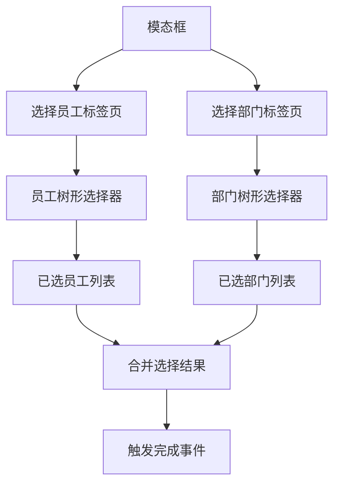
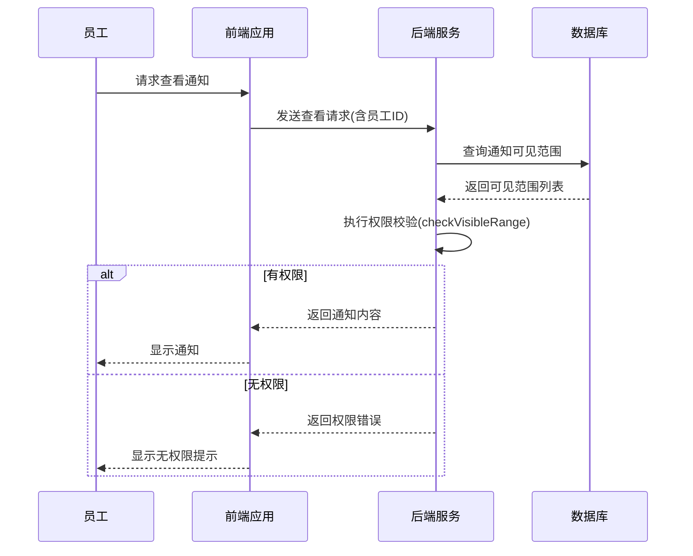

# 可见范围控制

<cite>
**本文档引用的文件**  
- [NoticeVisibleRangeForm.java](file://smart-admin-api-java17-springboot3\sa-admin\src\main\java\net\lab1024\sa\admin\module\business\oa\notice\domain\form\NoticeVisibleRangeForm.java)
- [NoticeVisibleRangeDataTypeEnum.java](file://smart-admin-api-java17-springboot3\sa-admin\src\main\java\net\lab1024\sa\admin\module\business\oa\notice\constant\NoticeVisibleRangeDataTypeEnum.java)
- [notice-const.js](file://smart-admin-web-javascript\src\constants\business\oa\notice-const.js)
- [notice-form-visible-modal.vue](file://smart-admin-web-javascript\src\views\business\oa\notice\components\notice-form-visible-modal.vue)
- [notice-form-visible-transfer-department.vue](file://smart-admin-web-javascript\src\views\business\oa\notice\components\notice-form-visible-transfer-department.vue)
- [notice-form-visible-transfer-employee.vue](file://smart-admin-web-javascript\src\views\business\oa\notice\components\notice-form-visible-transfer-employee.vue)
- [NoticeEmployeeService.java](file://smart-admin-api-java17-springboot3\sa-admin\src\main\java\net\lab1024\sa\admin\module\business\oa\notice\service\NoticeEmployeeService.java)
- [NoticeMapper.xml](file://smart-admin-api-java17-springboot3\sa-admin\src\main\resources\mapper\business\oa\notice\NoticeMapper.xml)
</cite>

## 目录
1. [简介](#简介)
2. [表单对象设计](#表单对象设计)
3. [数据类型枚举](#数据类型枚举)
4. [前端组件交互设计](#前端组件交互设计)
5. [后端分发与权限校验](#后端分发与权限校验)
6. [可见性配置示例](#可见性配置示例)

## 简介
本文档详细说明通知可见范围控制机制的技术实现，涵盖从表单设计、前端交互到后端权限校验的完整流程。系统通过灵活的可见范围配置，实现了基于角色、部门层级和自定义人员列表的通知分发机制，确保信息能够精准触达目标受众。

## 表单对象设计

`NoticeVisibleRangeForm` 表单对象是通知可见范围配置的核心数据结构，用于在前后端之间传输可见范围信息。该对象包含两个关键属性：`dataType` 和 `dataId`。

`dataType` 字段标识了可见范围的类型，通过枚举值区分不同的范围类别（如员工、部门）。`dataId` 字段则存储对应范围实体的唯一标识符。表单对象通过 `@CheckEnum` 注解进行数据类型验证，确保传入的 `dataType` 值必须是 `NoticeVisibleRangeDataTypeEnum` 枚举中定义的有效值，从而保证了数据的完整性和一致性。

该表单对象的设计遵循了简洁性和可扩展性的原则，仅包含必要的字段，便于序列化和反序列化处理。同时，通过与枚举类的紧密结合，实现了类型安全的编程模式，减少了运行时错误的可能性。

**Section sources**
- [NoticeVisibleRangeForm.java](file://smart-admin-api-java17-springboot3\sa-admin\src\main\java\net\lab1024\sa\admin\module\business\oa\notice\domain\form\NoticeVisibleRangeForm.java#L1-L33)

## 数据类型枚举

`NoticeVisibleRangeDataTypeEnum` 枚举类定义了通知可见范围的所有可能类型，是系统权限控制的基础。当前系统支持两种基本的可见范围类型：员工（EMPLOYEE）和部门（DEPARTMENT），分别对应枚举值 1 和 2。

该枚举实现了 `BaseEnum` 接口，遵循了统一的枚举设计规范。每个枚举项都包含一个数值 `value` 和描述性文本 `desc`，便于在用户界面中显示友好的名称。这种设计不仅提高了代码的可读性，还为未来的国际化支持奠定了基础。

枚举类的设计考虑到了系统的可扩展性，未来可以轻松添加新的范围类型（如岗位、角色等）而无需修改核心逻辑。通过将范围类型定义为枚举，系统实现了类型安全的编程模式，避免了使用原始整数或字符串可能带来的错误。

**Section sources**
- [NoticeVisibleRangeDataTypeEnum.java](file://smart-admin-api-java17-springboot3\sa-admin\src\main\java\net\lab1024\sa\admin\module\business\oa\notice\constant\NoticeVisibleRangeDataTypeEnum.java#L1-L36)

## 前端组件交互设计

通知可见范围的前端交互通过 `notice-form-visible-modal.vue` 及其子组件实现，采用标签页（Tabs）的布局方式，分别提供"选择员工"和"选择部门"两个功能模块。

### 模态框设计
`notice-form-visible-modal.vue` 作为主容器，管理整体的显示状态和数据流。它通过 `showModal` 方法接收初始的可见范围列表，并根据 `dataType` 将数据分发给相应的子组件进行初始化。当用户完成选择并点击确定时，模态框会将所有选中的员工和部门合并成一个列表，通过 `selectedFinish` 事件回调通知父组件。

**Diagram sources**
- [notice-form-visible-modal.vue](file://smart-admin-web-javascript\src\views\business\oa\notice\components\notice-form-visible-modal.vue#L1-L72)

### 部门选择器
`notice-form-visible-transfer-department.vue` 组件实现了部门选择功能。它使用树形控件展示组织架构，并在每个节点右侧提供"添加"图标。用户点击图标后，该部门会被添加到右侧的已选列表中。已选列表采用可滚动的布局，每个条目都包含部门名称和移除按钮，支持用户随时调整选择。

### 员工选择器
`notice-form-visible-transfer-employee.vue` 组件实现了员工选择功能。其核心特点是将部门树与员工列表结合，构建了一个"部门-员工"的复合树形结构。通过 `buildDepartmentEmployeeTree` 方法，系统将所有员工按部门组织，并作为对应部门节点的子节点展示。这种设计使用户能够在浏览组织架构的同时选择特定员工，大大提升了选择效率。

两个选择器组件都实现了数据回显机制，当模态框重新打开时，已选中的条目会在树形结构中高亮显示（通过 `checkExists` 方法判断），确保用户能够清晰地看到当前的配置状态。

**Section sources**
- [notice-form-visible-modal.vue](file://smart-admin-web-javascript\src\views\business\oa\notice\components\notice-form-visible-modal.vue#L1-L72)
- [notice-form-visible-transfer-department.vue](file://smart-admin-web-javascript\src\views\business\oa\notice\components\notice-form-visible-transfer-department.vue#L1-L205)
- [notice-form-visible-transfer-employee.vue](file://smart-admin-web-javascript\src\views\business\oa\notice\components\notice-form-visible-transfer-employee.vue#L1-L254)

## 后端分发与权限校验

后端的可见范围控制机制主要由 `NoticeEmployeeService` 类实现，其核心是 `checkVisibleRange` 方法。该方法在员工尝试查看通知时被调用，负责验证该员工是否具有相应的查看权限。

权限校验分为两个层次：首先是员工级别的精确匹配，系统会检查可见范围列表中是否存在与当前员工ID完全匹配的记录；其次是部门级别的层级匹配，系统会获取所有被授权的部门ID，然后通过 `departmentService.selfAndChildrenIdList` 方法获取这些部门及其所有子部门的ID列表，最后判断当前员工所在的部门是否包含在授权范围内。

这种设计支持了灵活的权限配置策略，既可以通过直接指定员工实现精准推送，也可以通过指定部门实现批量授权。当通知的 `allVisibleFlag` 为 true 时，系统会跳过可见范围检查，允许所有员工查看。

通知的可见范围数据存储在 `t_notice_visible_range` 表中，通过 `NoticeMapper.xml` 中的 `insertVisibleRange` 和 `deleteVisibleRange` 操作进行管理。这种分离式的设计使得可见范围可以独立于通知主体进行增删改操作，提高了系统的灵活性和可维护性。

**Diagram sources**
- [NoticeEmployeeService.java](file://smart-admin-api-java17-springboot3\sa-admin\src\main\java\net\lab1024\sa\admin\module\business\oa\notice\service\NoticeEmployeeService.java#L1-L156)
- [NoticeMapper.xml](file://smart-admin-api-java17-springboot3\sa-admin\src\main\resources\mapper\business\oa\notice\NoticeMapper.xml#L1-L39)

## 可见性配置示例

基于上述机制，系统支持多种可见性配置场景：

### 基于角色的配置
管理员可以创建一个通知，并将其可见范围设置为"全体员工"（通过设置 `allVisibleFlag` 为 true）。这种配置适用于公司级公告，确保信息能够覆盖所有员工。

### 基于部门层级的配置
对于部门内部的通知，管理员可以选择特定部门作为可见范围。系统会自动将该部门及其所有子部门的员工纳入通知对象。例如，选择"技术部"后，"前端组"、"后端组"等子部门的员工都能收到通知。

### 基于自定义人员列表的配置
对于需要精准推送的场景，管理员可以直接选择特定员工。这种配置适用于项目进度更新、个人绩效反馈等需要点对点沟通的场景。

在实际操作中，管理员可以通过模态框的标签页在"选择员工"和"选择部门"之间切换，灵活组合不同的可见范围。所有选择结果最终都会被转换为 `NoticeVisibleRangeForm` 对象列表，提交给后端进行持久化存储。

**Section sources**
- [NoticeVisibleRangeForm.java](file://smart-admin-api-java17-springboot3\sa-admin\src\main\java\net\lab1024\sa\admin\module\business\oa\notice\domain\form\NoticeVisibleRangeForm.java#L1-L33)
- [NoticeVisibleRangeDataTypeEnum.java](file://smart-admin-api-java17-springboot3\sa-admin\src\main\java\net\lab1024\sa\admin\module\business\oa\notice\constant\NoticeVisibleRangeDataTypeEnum.java#L1-L36)
- [notice-form-visible-modal.vue](file://smart-admin-web-javascript\src\views\business\oa\notice\components\notice-form-visible-modal.vue#L1-L72)