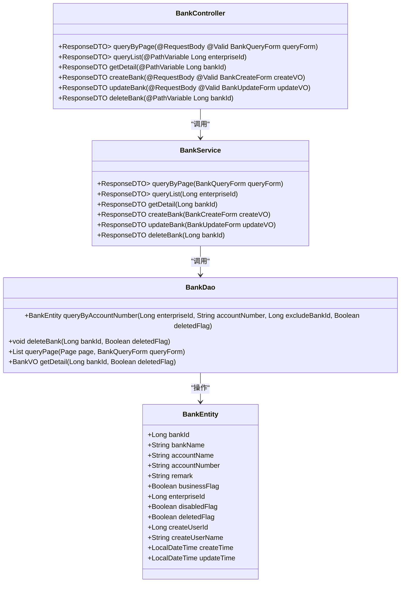
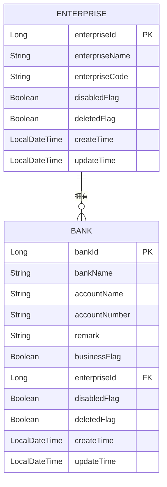
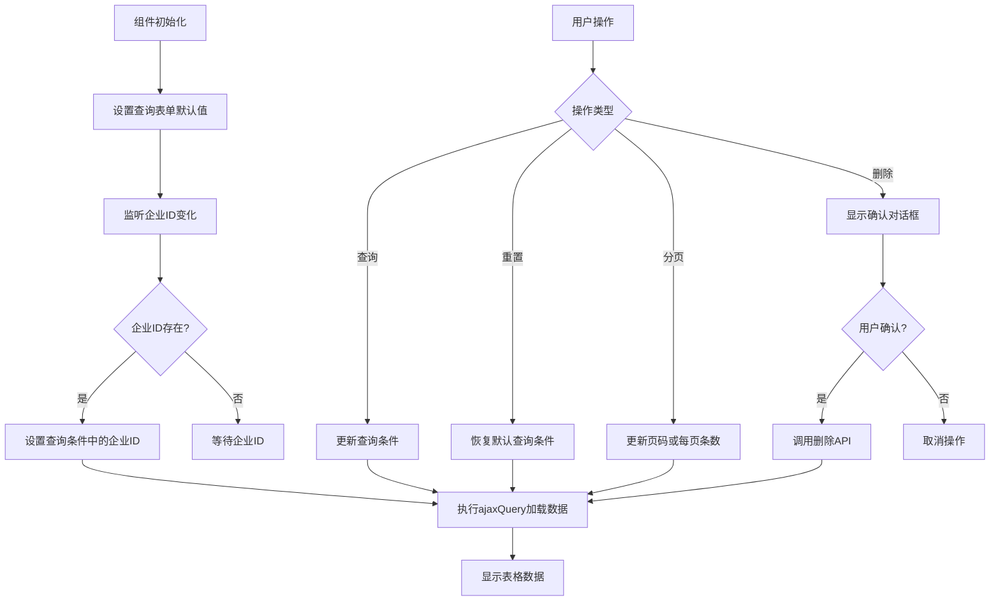
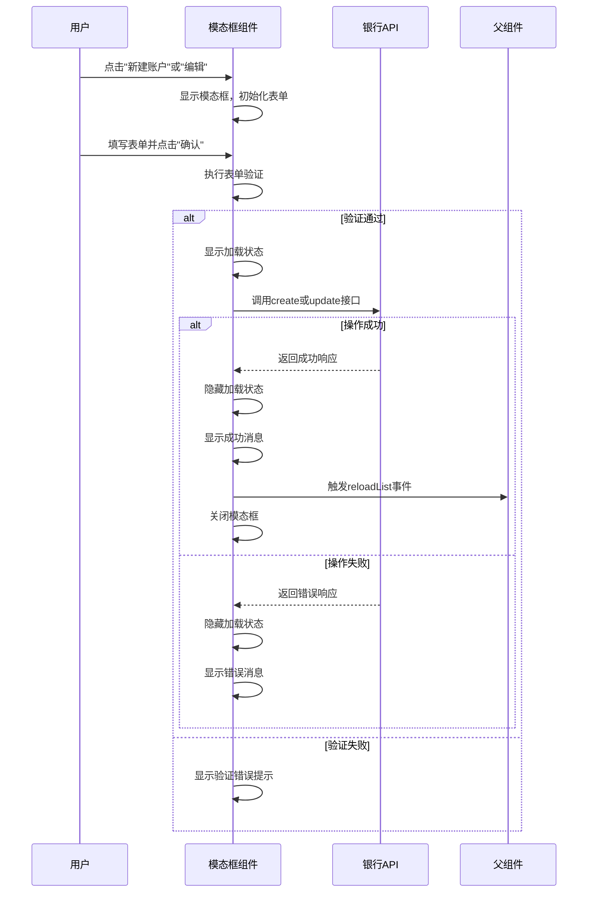
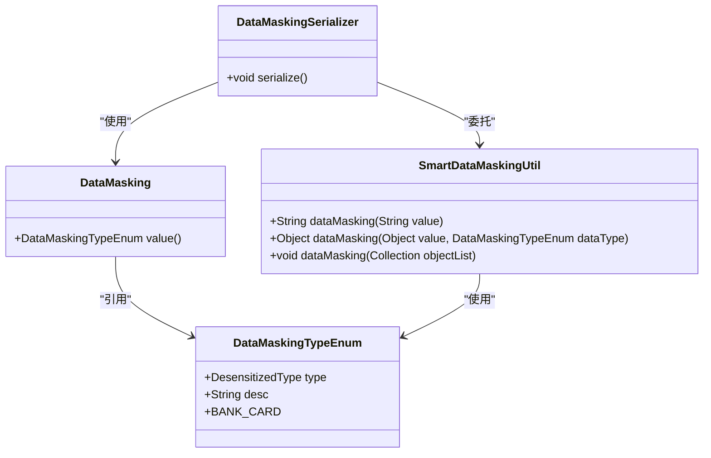

# 银行账户管理

<cite>
**本文档引用的文件**  
- [BankEntity.java](file://smart-admin-api-java17-springboot3\sa-admin\src\main\java\net\lab1024\sa\admin\module\business\oa\bank\domain\BankEntity.java)
- [BankDao.java](file://smart-admin-api-java17-springboot3\sa-admin\src\main\java\net\lab1024\sa\admin\module\business\oa\bank\dao\BankDao.java)
- [BankService.java](file://smart-admin-api-java17-springboot3\sa-admin\src\main\java\net\lab1024\sa\admin\module\business\oa\bank\service\BankService.java)
- [BankController.java](file://smart-admin-api-java17-springboot3\sa-admin\src\main\java\net\lab1024\sa\admin\module\business\oa\bank\controller\BankController.java)
- [enterprise-bank-list.vue](file://smart-admin-web-javascript\src\views\business\oa\enterprise\components\enterprise-bank-list.vue)
- [enterprise-bank-operate-modal.vue](file://smart-admin-web-javascript\src\views\business\oa\enterprise\components\enterprise-bank-operate-modal.vue)
- [bank-api.js](file://smart-admin-web-javascript\src\api\business\oa\bank-api.js)
- [DataMasking.java](file://smart-admin-api-java17-springboot3\sa-base\src\main\java\net\lab1024\sa\base\module\support\datamasking\DataMasking.java)
- [SmartDataMaskingUtil.java](file://smart-admin-api-java17-springboot3\sa-base\src\main\java\net\lab1024\sa\base\module\support\datamasking\SmartDataMaskingUtil.java)
</cite>

## 目录
1. [引言](#引言)
2. [银行账户信息数据模型](#银行账户信息数据模型)
3. [后端持久化存储机制](#后端持久化存储机制)
4. [银行账户与企业主体关联关系](#银行账户与企业主体关联关系)
5. [前端表格展示与分页处理](#前端表格展示与分页处理)
6. [表单验证与交互体验设计](#表单验证与交互体验设计)
7. [银行账户信息加密存储与安全访问](#银行账户信息加密存储与安全访问)
8. [批量导入导出功能](#批量导入导出功能)
9. [结论](#结论)

## 引言
本文档详细说明了企业银行账户管理功能的技术实现，涵盖银行账户信息的录入、查询、修改和删除操作。文档阐述了后端通过EnterpriseDao对企业银行信息的持久化存储机制，详细描述了前端enterprise-bank-list.vue组件的表格展示逻辑、分页处理和数据渲染方式，以及enterprise-bank-operate-modal.vue模态框的表单验证、数据提交和交互体验设计。同时，文档说明了银行账户信息的数据模型设计，包括账户名称、账号、开户行等关键字段的定义与约束，以及银行账户与企业主体的关联关系维护机制。此外，文档还提供了银行账户信息加密存储和安全访问的实现方案，以及银行账户批量导入、导出功能的使用方法和接口规范。

## 银行账户信息数据模型
银行账户信息的数据模型设计基于BankEntity实体类，该类映射到数据库表t_oa_bank，包含以下关键字段：

- **银行信息ID** (bankId): 主键，自增，标识唯一的银行账户记录
- **开户银行** (bankName): 字符串类型，存储开户银行名称，最大长度200字符
- **账户名称** (accountName): 字符串类型，存储账户名称，最大长度200字符
- **账号** (accountNumber): 字符串类型，存储银行账号，最大长度200字符
- **备注** (remark): 字符串类型，存储账户备注信息，最大长度500字符
- **是否对公** (businessFlag): 布尔类型，标识账户是否为对公账户
- **企业ID** (enterpriseId): 长整型，关联企业主体的外键
- **禁用状态** (disabledFlag): 布尔类型，标识账户是否被禁用
- **删除状态** (deletedFlag): 布尔类型，软删除标记
- **创建人ID** (createUserId): 长整型，记录创建人用户ID
- **创建人名称** (createUserName): 字符串类型，记录创建人姓名
- **创建时间** (createTime): LocalDateTime类型，记录创建时间
- **更新时间** (updateTime): LocalDateTime类型，记录最后更新时间

数据模型通过@DataTracerFieldLabel注解标记可追踪字段，支持数据变更追踪功能。所有字段都遵循严格的约束规则，确保数据的完整性和一致性。

**Section sources**
- [BankEntity.java](file://smart-admin-api-java17-springboot3\sa-admin\src\main\java\net\lab1024\sa\admin\module\business\oa\bank\domain\BankEntity.java#L23-L95)

## 后端持久化存储机制
后端通过EnterpriseDao对企业银行信息进行持久化存储，采用MyBatis-Plus框架实现数据访问层。BankDao接口继承BaseMapper<BankEntity>，提供了基本的CRUD操作，并定义了特定的查询方法。

BankDao接口包含以下关键方法：
- **queryByAccountNumber**: 根据企业ID和账号查询银行信息，用于验证账号唯一性
- **deleteBank**: 软删除银行信息，将deletedFlag设置为true
- **queryPage**: 分页查询银行信息列表，支持多种查询条件
- **getDetail**: 查询银行信息详情

BankService服务层封装了业务逻辑，通过@Transactional注解确保数据操作的原子性。服务层实现了以下核心功能：

1. **创建银行信息**: 验证企业存在性，检查账号唯一性，插入新记录并记录数据追踪日志
2. **编辑银行信息**: 验证企业存在性，检查账号唯一性（排除当前记录），更新记录并记录变更日志
3. **删除银行信息**: 软删除记录，设置deletedFlag为true，并记录删除日志
4. **查询功能**: 提供分页查询和根据企业ID查询列表的功能

BankController控制器层暴露RESTful API接口，通过SaCheckPermission注解实现权限控制，确保只有授权用户才能执行相应操作。

**Diagram sources**
- [BankEntity.java](file://smart-admin-api-java17-springboot3\sa-admin\src\main\java\net\lab1024\sa\admin\module\business\oa\bank\domain\BankEntity.java#L20-L95)
- [BankDao.java](file://smart-admin-api-java17-springboot3\sa-admin\src\main\java\net\lab1024\sa\admin\module\business\oa\bank\dao\BankDao.java#L23-L46)
- [BankService.java](file://smart-admin-api-java17-springboot3\sa-admin\src\main\java\net\lab1024\sa\admin\module\business\oa\bank\service\BankService.java#L32-L146)
- [BankController.java](file://smart-admin-api-java17-springboot3\sa-admin\src\main\java\net\lab1024\sa\admin\module\business\oa\bank\controller\BankController.java#L32-L82)

**Section sources**
- [BankEntity.java](file://smart-admin-api-java17-springboot3\sa-admin\src\main\java\net\lab1024\sa\admin\module\business\oa\bank\domain\BankEntity.java#L20-L95)
- [BankDao.java](file://smart-admin-api-java17-springboot3\sa-admin\src\main\java\net\lab1024\sa\admin\module\business\oa\bank\dao\BankDao.java#L23-L46)
- [BankService.java](file://smart-admin-api-java17-springboot3\sa-admin\src\main\java\net\lab1024\sa\admin\module\business\oa\bank\service\BankService.java#L32-L146)
- [BankController.java](file://smart-admin-api-java17-springboot3\sa-admin\src\main\java\net\lab1024\sa\admin\module\business\oa\bank\controller\BankController.java#L32-L82)

## 银行账户与企业主体关联关系
银行账户与企业主体之间存在明确的关联关系，通过BankEntity实体中的enterpriseId字段建立外键关联。这种设计确保了每个银行账户都归属于特定的企业主体，实现了数据的层级化管理。

在业务逻辑层面，BankService在处理银行账户操作时，会首先验证关联企业是否存在且未被删除。创建和编辑银行账户时，系统会检查enterpriseId对应的企业记录，确保关联关系的有效性。这种验证机制防止了孤立的银行账户记录产生，维护了数据的完整性。

数据追踪服务(DataTracerService)利用企业ID作为追踪上下文，记录所有与特定企业相关的银行账户变更操作。当银行账户被创建、更新或删除时，系统会在企业级别的数据追踪日志中记录相应的操作，包括操作类型、变更内容和操作人信息。这种设计提供了完整的审计追踪能力，便于后续的合规审查和问题排查。

**Diagram sources**
- [BankEntity.java](file://smart-admin-api-java17-springboot3\sa-admin\src\main\java\net\lab1024\sa\admin\module\business\oa\bank\domain\BankEntity.java#L64-L65)
- [EnterpriseEntity.java](file://smart-admin-api-java17-springboot3\sa-admin\src\main\java\net\lab1024\sa\admin\module\business\oa\enterprise\domain\entity\EnterpriseEntity.java)

**Section sources**
- [BankEntity.java](file://smart-admin-api-java17-springboot3\sa-admin\src\main\java\net\lab1024\sa\admin\module\business\oa\bank\domain\BankEntity.java#L64-L65)
- [BankService.java](file://smart-admin-api-java17-springboot3\sa-admin\src\main\java\net\lab1024\sa\admin\module\business\oa\bank\service\BankService.java#L86-L88)

## 前端表格展示与分页处理
前端enterprise-bank-list.vue组件实现了银行账户信息的表格展示和分页处理功能。组件采用Ant Design Vue的a-table组件进行数据展示，支持灵活的列配置和操作按钮。

表格列定义包含开户银行、账户名称、账号、是否对公、状态、备注、创建人和创建时间等字段。其中，账号、备注和创建人等长文本字段启用了ellipsis属性，实现文本溢出省略显示。操作列固定在右侧，包含编辑和删除按钮，按钮的显示受用户权限控制。

分页处理通过a-pagination组件实现，支持每页显示条数选择、快速跳转和页码切换。分页参数包括pageNum（当前页码）和pageSize（每页条数），默认值由PAGE_SIZE常量定义。当用户切换页码或改变每页显示条数时，会触发ajaxQuery方法重新加载数据。

查询功能支持关键字搜索（可搜索开户银行、账户名称、账号和创建人）和创建时间范围筛选。查询表单包含重置功能，可将所有查询条件恢复到初始状态。表格数据通过响应式变量tableData进行管理，配合tableLoading实现加载状态显示。

**Diagram sources**
- [enterprise-bank-list.vue](file://smart-admin-web-javascript\src\views\business\oa\enterprise\components\enterprise-bank-list.vue#L106-L153)
- [enterprise-bank-list.vue](file://smart-admin-web-javascript\src\views\business\oa\enterprise\components\enterprise-bank-list.vue#L164-L244)

**Section sources**
- [enterprise-bank-list.vue](file://smart-admin-web-javascript\src\views\business\oa\enterprise\components\enterprise-bank-list.vue#L106-L244)

## 表单验证与交互体验设计
enterprise-bank-operate-modal.vue组件实现了银行账户信息的表单验证和交互体验设计。模态框采用Ant Design Vue的a-modal组件，支持新建和编辑两种模式，标题根据操作类型动态显示。

表单包含开户银行、账户名称、账号、是否对公、启用状态和备注等字段。所有必填字段都配置了验证规则，包括：
- 开户银行：必填，最大长度200字符
- 账户名称：必填，最大长度200字符
- 账号：必填，最大长度200字符
- 是否对公：必填，布尔值

表单验证通过a-form的rules属性配置，使用async/await语法处理异步验证逻辑。当用户点击确认按钮时，系统会先执行表单验证，验证通过后才提交数据。验证失败时，会显示相应的错误提示信息。

交互体验方面，组件使用ref暴露showModal方法，允许父组件控制模态框的显示和传入编辑数据。开关组件(a-switch)用于是否对公和启用状态字段，提供直观的切换体验。提交过程中显示SmartLoading加载提示，提升用户体验。操作成功后显示成功消息，并通过emit触发reloadList事件通知父组件刷新数据列表。

**Diagram sources**
- [enterprise-bank-operate-modal.vue](file://smart-admin-web-javascript\src\views\business\oa\enterprise\components\enterprise-bank-operate-modal.vue#L70-L125)
- [bank-api.js](file://smart-admin-web-javascript\src\api\business\oa\bank-api.js#L14-L35)

**Section sources**
- [enterprise-bank-operate-modal.vue](file://smart-admin-web-javascript\src\views\business\oa\enterprise\components\enterprise-bank-operate-modal.vue#L70-L131)

## 银行账户信息加密存储与安全访问
系统通过数据脱敏机制实现银行账户信息的安全访问，而非加密存储。数据脱敏在序列化阶段自动应用，确保敏感信息在传输过程中被保护。

核心实现基于@DataMasking注解和SmartDataMaskingUtil工具类。在BankEntity实体中，虽然没有直接看到脱敏注解，但系统提供了完整的脱敏框架，可通过在实体字段上添加@DataMasking(DataMaskingTypeEnum.BANK_CARD)注解来实现银行卡号的自动脱敏。

脱敏机制的工作流程如下：
1. 当数据对象需要序列化为JSON时，Jackson框架检测到@DataMasking注解
2. 使用DataMaskingSerializer序列化器处理标注字段
3. 根据指定的脱敏类型(如BANK_CARD)应用相应的脱敏规则
4. 返回脱敏后的数据给客户端

对于银行卡号，系统采用标准的银行卡脱敏规则，通常显示前6位和后4位，中间部分用*号替代。这种设计既保护了敏感信息，又保留了足够的信息供用户识别。

前端通过bank-api.js中的API接口与后端通信，所有请求都经过统一的axios配置处理，确保请求的安全性。权限控制通过@SaCheckPermission注解实现，确保只有具备相应权限的用户才能访问银行账户相关接口。

**Diagram sources**
- [DataMasking.java](file://smart-admin-api-java17-springboot3\sa-base\src\main\java\net\lab1024\sa\base\module\support\datamasking\DataMasking.java)
- [DataMaskingTypeEnum.java](file://smart-admin-api-java17-springboot3\sa-base\src\main\java\net\lab1024\sa\base\module\support\datamasking\DataMaskingTypeEnum.java)
- [SmartDataMaskingUtil.java](file://smart-admin-api-java17-springboot3\sa-base\src\main\java\net\lab1024\sa\base\module\support\datamasking\SmartDataMaskingUtil.java)

**Section sources**
- [DataMasking.java](file://smart-admin-api-java17-springboot3\sa-base\src\main\java\net\lab1024\sa\base\module\support\datamasking\DataMasking.java)
- [SmartDataMaskingUtil.java](file://smart-admin-api-java17-springboot3\sa-base\src\main\java\net\lab1024\sa\base\module\support\datamasking\SmartDataMaskingUtil.java)

## 批量导入导出功能
虽然当前代码中未直接实现银行账户的批量导入导出功能，但系统架构支持此类功能的扩展。基于现有的API接口和数据模型，可以设计完整的批量处理方案。

批量导入功能可通过以下方式实现：
1. 提供标准的Excel模板供用户下载
2. 用户填写模板后上传文件
3. 后端解析Excel文件，验证数据格式和业务规则
4. 批量插入或更新银行账户信息
5. 返回导入结果报告，包括成功和失败记录

批量导出功能可基于现有的分页查询接口扩展：
1. 提供导出按钮，支持按当前查询条件导出
2. 后端查询所有匹配记录（不限制分页）
3. 生成Excel文件，包含所有字段
4. 对敏感字段（如账号）应用脱敏规则
5. 提供文件下载链接

API接口设计建议：
- 批量导入: POST /oa/bank/batch/import
- 批量导出: GET /oa/bank/batch/export

前端可复用现有的enterprise-bank-list组件，添加导入导出按钮，并集成文件上传和下载功能。权限控制应独立设置，确保只有特定角色可以执行批量操作。

**Section sources**
- [BankController.java](file://smart-admin-api-java17-springboot3\sa-admin\src\main\java\net\lab1024\sa\admin\module\business\oa\bank\controller\BankController.java)
- [bank-api.js](file://smart-admin-web-javascript\src\api\business\oa\bank-api.js)

## 结论
本文档全面阐述了企业银行账户管理功能的技术实现。系统通过清晰的数据模型设计和分层架构，实现了银行账户信息的完整生命周期管理。后端采用MyBatis-Plus框架和事务管理确保数据持久化的一致性和可靠性，前端通过Vue组件实现了友好的用户交互体验。

银行账户与企业主体的关联关系通过外键约束和业务验证双重保障，确保了数据的完整性和层次性。数据安全方面，系统采用数据脱敏机制保护敏感信息，结合权限控制实现安全访问。

虽然当前实现中未包含批量导入导出功能，但系统架构具备良好的扩展性，可基于现有API和组件快速实现该功能。整体设计遵循了模块化、可维护和安全性的原则，为企业的银行账户管理提供了可靠的技术支持。