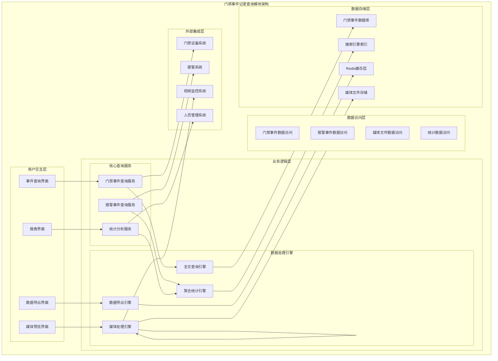
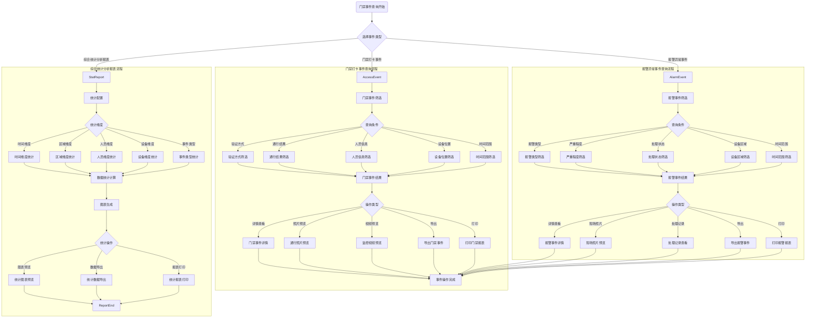

# 门禁事件记录查询模块详细设计

> **版本**: v1.0
> **更新时间**: 2025-11-13
> **分类**: 核心功能模块 > 企业OA系统 > 门禁管理系统
> **标签**: ["门禁系统", "事件查询", "数据统计分析", "报表生成", "媒体预览"]
> **作者**: SmartAdmin规范治理委员会
> **描述**: IOE-DREAM智慧园区一卡通管理平台门禁管理系统的事件记录查询、统计分析、媒体预览和数据导出模块详细技术设计

## 📋 模块概述

### 核心定位

**门禁事件记录查询模块**是IOE-DREAM智慧园区一卡通管理平台的数据中心，专注于门禁核心业务事件的记录、查询、统计和分析。模块提供门禁打卡事件查询、报警异常事件处理、综合统计分析报表、媒体文件预览和完整的数据导出功能，确保门禁事件数据的准确性、实时性和可追溯性。

### 核心特性

- ✅ **门禁事件专属中心**：专注处理门禁相关的通行和报警事件
- ✅ **多维度查询筛选**：验证方式、通行结果、人员信息、设备位置等多维度筛选
- ✅ **媒体文件预览**：通行照片、监控视频在线预览和管理
- ✅ **智能统计分析**：时间、区域、人员、设备等多维度统计分析
- ✅ **多格式数据导出**：Excel、PDF、CSV格式导出和自定义报表
- ✅ **权限分级控制**：基于角色的数据访问和操作权限控制
- ✅ **高性能查询**：支持海量事件数据的高效查询和分页显示

## 🏗️ 事件记录查询模块架构设计

### 模块功能架构图



### 事件记录查询核心流程设计



## 🔧 核心功能详细设计

### 1. 门禁事件查询服务

#### 1.1 门禁打卡事件查询

**功能描述**：门禁打卡事件的多维度查询和筛选

**技术实现**：
```java
@Service
@Slf4j
public class AccessEventQueryService {

    @Resource
    private AccessEventDao accessEventDao;

    @Resource
    private FullTextSearchService searchService;

    @Resource
    private CacheManager cacheManager;

    /**
     * 查询门禁打卡事件
     */
    public ResponseDTO<PageResult<AccessEventVO>> queryAccessEvents(AccessEventQueryForm queryForm) {
        try {
            // 1. 权限验证
            validateQueryPermission(queryForm);

            // 2. 构建查询条件
            LambdaQueryWrapper<AccessEventEntity> queryWrapper = buildAccessEventQuery(queryForm);

            // 3. 分页查询
            IPage<AccessEventEntity> page = new Page<>(queryForm.getPageNum(), queryForm.getPageSize());
            IPage<AccessEventEntity> eventPage = accessEventDao.selectPage(page, queryWrapper);

            // 4. 转换为VO并补充关联数据
            List<AccessEventVO> eventVOList = eventPage.getRecords().stream()
                    .map(this::convertToAccessEventVO)
                    .collect(Collectors.toList());

            // 5. 构建分页结果
            PageResult<AccessEventVO> pageResult = new PageResult<>();
            pageResult.setRows(eventVOList);
            pageResult.setTotal(eventPage.getTotal());
            pageResult.setPageNum(queryForm.getPageNum());
            pageResult.setPageSize(queryForm.getPageSize());

            // 6. 记录查询日志
            logQueryOperation("ACCESS_EVENT_QUERY", queryForm, pageResult.getTotal());

            return ResponseDTO.ok(pageResult);

        } catch (Exception e) {
            log.error("查询门禁打卡事件失败", e);
            return ResponseDTO.error("查询失败");
        }
    }

    /**
     * 构建门禁事件查询条件
     */
    private LambdaQueryWrapper<AccessEventEntity> buildAccessEventQuery(AccessEventQueryForm queryForm) {
        LambdaQueryWrapper<AccessEventEntity> queryWrapper = new LambdaQueryWrapper<>();

        // 1. 基础条件
        queryWrapper.eq(AccessEventEntity::getDeletedFlag, false)
                .orderByDesc(AccessEventEntity::getEventTime);

        // 2. 验证方式筛选
        if (CollectionUtils.isNotEmpty(queryForm.getVerificationMethods())) {
            queryWrapper.in(AccessEventEntity::getVerificationMethod, queryForm.getVerificationMethods());
        }

        // 3. 通行结果筛选
        if (CollectionUtils.isNotEmpty(queryForm.getAccessResults())) {
            queryWrapper.in(AccessEventEntity::getAccessResult, queryForm.getAccessResults());
        }

        // 4. 人员信息筛选
        if (StringUtils.isNotBlank(queryForm.getPersonKeyword())) {
            queryWrapper.and(wrapper -> wrapper
                    .like(AccessEventEntity::getPersonName, queryForm.getPersonKeyword())
                    .or()
                    .like(AccessEventEntity::getPersonCode, queryForm.getPersonKeyword())
                    .or()
                    .like(AccessEventEntity::getDepartmentName, queryForm.getPersonKeyword()));
        }

        // 5. 设备位置筛选
        if (CollectionUtils.isNotEmpty(queryForm.getAreaIds())) {
            queryWrapper.in(AccessEventEntity::getAreaId, queryForm.getAreaIds());
        }
        if (CollectionUtils.isNotEmpty(queryForm.getDeviceIds())) {
            queryWrapper.in(AccessEventEntity::getDeviceId, queryForm.getDeviceIds());
        }

        // 6. 时间范围筛选
        if (queryForm.getStartTime() != null) {
            queryWrapper.ge(AccessEventEntity::getEventTime, queryForm.getStartTime());
        }
        if (queryForm.getEndTime() != null) {
            queryWrapper.le(AccessEventEntity::getEventTime, queryForm.getEndTime());
        }

        // 7. 数据权限过滤
        applyDataPermissionFilter(queryWrapper);

        return queryWrapper;
    }

    /**
     * 转换为门禁事件VO
     */
    private AccessEventVO convertToAccessEventVO(AccessEventEntity entity) {
        AccessEventVO vo = BeanUtil.copyProperties(entity, AccessEventVO.class);

        // 1. 补充人员信息
        if (entity.getPersonId() != null) {
            PersonInfoVO personInfo = personService.getPersonInfo(entity.getPersonId());
            vo.setPersonInfo(personInfo);
        }

        // 2. 补充设备信息
        if (entity.getDeviceId() != null) {
            DeviceInfoVO deviceInfo = deviceService.getDeviceInfo(entity.getDeviceId());
            vo.setDeviceInfo(deviceInfo);
        }

        // 3. 补充区域信息
        if (entity.getAreaId() != null) {
            AreaInfoVO areaInfo = areaService.getAreaInfo(entity.getAreaId());
            vo.setAreaInfo(areaInfo);
        }

        // 4. 补充媒体文件信息
        vo.setMediaFiles(getMediaFiles(entity.getEventId()));

        return vo;
    }

    /**
     * 全文搜索门禁事件
     */
    public ResponseDTO<PageResult<AccessEventVO>> fullTextSearchAccessEvents(AccessEventSearchForm searchForm) {
        try {
            // 1. 构建搜索查询
            SearchQuery searchQuery = SearchQuery.builder()
                    .keyword(searchForm.getKeyword())
                    .filters(buildSearchFilters(searchForm))
                    .sort(buildSearchSort(searchForm))
                    .page(searchForm.getPageNum())
                    .size(searchForm.getPageSize())
                    .build();

            // 2. 执行搜索
            SearchResult<AccessEventEntity> searchResult = searchService.search(searchQuery, AccessEventEntity.class);

            // 3. 转换结果
            List<AccessEventVO> voList = searchResult.getDocuments().stream()
                    .map(this::convertToAccessEventVO)
                    .collect(Collectors.toList());

            PageResult<AccessEventVO> pageResult = new PageResult<>();
            pageResult.setRows(voList);
            pageResult.setTotal(searchResult.getTotal());
            pageResult.setPageNum(searchForm.getPageNum());
            pageResult.setPageSize(searchForm.getPageSize());

            return ResponseDTO.ok(pageResult);

        } catch (Exception e) {
            log.error("全文搜索门禁事件失败", e);
            return ResponseDTO.error("搜索失败");
        }
    }
}
```

### 2. 报警事件查询服务

#### 2.1 报警异常事件查询

**功能描述**：报警异常事件的查询和处理状态跟踪

**技术实现**：
```java
@Service
@Slf4j
public class AlarmEventQueryService {

    @Resource
    private AlarmEventDao alarmEventDao;

    @Resource
    private AlarmProcessService alarmProcessService;

    @Resource
    private AlarmNotificationService notificationService;

    /**
     * 查询报警异常事件
     */
    public ResponseDTO<PageResult<AlarmEventVO>> queryAlarmEvents(AlarmEventQueryForm queryForm) {
        try {
            // 1. 权限验证
            validateAlarmQueryPermission(queryForm);

            // 2. 构建查询条件
            LambdaQueryWrapper<AlarmEventEntity> queryWrapper = buildAlarmEventQuery(queryForm);

            // 3. 分页查询
            IPage<AlarmEventEntity> page = new Page<>(queryForm.getPageNum(), queryForm.getPageSize());
            IPage<AlarmEventEntity> eventPage = alarmEventDao.selectPage(page, queryWrapper);

            // 4. 转换为VO并补充关联数据
            List<AlarmEventVO> eventVOList = eventPage.getRecords().stream()
                    .map(this::convertToAlarmEventVO)
                    .collect(Collectors.toList());

            // 5. 构建分页结果
            PageResult<AlarmEventVO> pageResult = new PageResult<>();
            pageResult.setRows(eventVOList);
            pageResult.setTotal(eventPage.getTotal());
            pageResult.setPageNum(queryForm.getPageNum());
            pageResult.setPageSize(queryForm.getPageSize());

            // 6. 记录查询日志
            logQueryOperation("ALARM_EVENT_QUERY", queryForm, pageResult.getTotal());

            return ResponseDTO.ok(pageResult);

        } catch (Exception e) {
            log.error("查询报警异常事件失败", e);
            return ResponseDTO.error("查询失败");
        }
    }

    /**
     * 构建报警事件查询条件
     */
    private LambdaQueryWrapper<AlarmEventEntity> buildAlarmEventQuery(AlarmEventQueryForm queryForm) {
        LambdaQueryWrapper<AlarmEventEntity> queryWrapper = new LambdaQueryWrapper<>();

        // 1. 基础条件
        queryWrapper.eq(AlarmEventEntity::getDeletedFlag, false)
                .orderByDesc(AlarmEventEntity::getAlarmTime);

        // 2. 报警类型筛选
        if (CollectionUtils.isNotEmpty(queryForm.getAlarmTypes())) {
            queryWrapper.in(AlarmEventEntity::getAlarmType, queryForm.getAlarmTypes());
        }

        // 3. 严重程度筛选
        if (CollectionUtils.isNotEmpty(queryForm.getSeverityLevels())) {
            queryWrapper.in(AlarmEventEntity::getSeverityLevel, queryForm.getSeverityLevels());
        }

        // 4. 处理状态筛选
        if (CollectionUtils.isNotEmpty(queryForm.getProcessStatuses())) {
            queryWrapper.in(AlarmEventEntity::getProcessStatus, queryForm.getProcessStatuses());
        }

        // 5. 设备区域筛选
        if (CollectionUtils.isNotEmpty(queryForm.getAreaIds())) {
            queryWrapper.in(AlarmEventEntity::getAreaId, queryForm.getAreaIds());
        }
        if (CollectionUtils.isNotEmpty(queryForm.getDeviceIds())) {
            queryWrapper.in(AlarmEventEntity::getDeviceId, queryForm.getDeviceIds());
        }

        // 6. 时间范围筛选
        if (queryForm.getStartTime() != null) {
            queryWrapper.ge(AlarmEventEntity::getAlarmTime, queryForm.getStartTime());
        }
        if (queryForm.getEndTime() != null) {
            queryWrapper.le(AlarmEventEntity::getAlarmTime, queryForm.getEndTime());
        }

        // 7. 数据权限过滤
        applyAlarmDataPermissionFilter(queryWrapper);

        return queryWrapper;
    }

    /**
     * 处理报警事件
     */
    @Transactional(rollbackFor = Exception.class)
    public ResponseDTO<Void> processAlarmEvent(AlarmProcessForm processForm) {
        try {
            Long alarmId = processForm.getAlarmId();

            // 1. 验证报警事件存在
            AlarmEventEntity alarm = alarmEventDao.selectById(alarmId);
            if (alarm == null || alarm.getDeletedFlag()) {
                return ResponseDTO.error("报警事件不存在");
            }

            // 2. 验证处理权限
            validateProcessPermission(alarm);

            // 3. 更新处理状态
            AlarmProcessRecord processRecord = AlarmProcessRecord.builder()
                    .alarmId(alarmId)
                    .processUserId(SmartRequestUtil.getRequestUserId())
                    .processType(processForm.getProcessType())
                    .processResult(processForm.getProcessResult())
                    .processDescription(processForm.getProcessDescription())
                    .processTime(LocalDateTime.now())
                    .build();

            alarmProcessService.saveProcessRecord(processRecord);

            // 4. 更新报警事件状态
            alarm.setProcessStatus(processForm.getProcessStatus());
            alarm.setProcessUserId(processForm.getProcessUserId());
            alarm.setProcessTime(LocalDateTime.now());
            alarmEventDao.updateById(alarm);

            // 5. 发送处理完成通知
            if (processForm.getProcessStatus() == ProcessStatus.COMPLETED) {
                notificationService.sendProcessCompleteNotification(alarm, processRecord);
            }

            log.info("报警事件处理完成, alarmId: {}, processType: {}",
                    alarmId, processForm.getProcessType());

            return ResponseDTO.ok();

        } catch (Exception e) {
            log.error("处理报警事件失败", e);
            return ResponseDTO.error("处理失败");
        }
    }

    /**
     * 转换为报警事件VO
     */
    private AlarmEventVO convertToAlarmEventVO(AlarmEventEntity entity) {
        AlarmEventVO vo = BeanUtil.copyProperties(entity, AlarmEventVO.class);

        // 1. 补充设备信息
        if (entity.getDeviceId() != null) {
            DeviceInfoVO deviceInfo = deviceService.getDeviceInfo(entity.getDeviceId());
            vo.setDeviceInfo(deviceInfo);
        }

        // 2. 补充区域信息
        if (entity.getAreaId() != null) {
            AreaInfoVO areaInfo = areaService.getAreaInfo(entity.getAreaId());
            vo.setAreaInfo(areaInfo);
        }

        // 3. 补充处理记录
        vo.setProcessRecords(alarmProcessService.getProcessRecords(entity.getAlarmId()));

        // 4. 补充媒体文件信息
        vo.setMediaFiles(getMediaFiles(entity.getAlarmId()));

        return vo;
    }
}
```

### 3. 统计分析服务

#### 3.1 综合统计分析

**功能描述**：多维度门禁事件统计分析和报表生成

**技术实现**：
```java
@Service
@Slf4j
public class AccessEventStatisticsService {

    @Resource
    private AccessEventDao accessEventDao;

    @Resource
    private AlarmEventDao alarmEventDao;

    @Resource
    private ChartGenerateService chartGenerateService;

    /**
     * 生成综合统计报表
     */
    public ResponseDTO<ComprehensiveStatisticsVO> generateComprehensiveStatistics(
            StatisticsQueryForm queryForm) {
        try {
            // 1. 验证统计权限
            validateStatisticsPermission(queryForm);

            ComprehensiveStatisticsVO statistics = ComprehensiveStatisticsVO.builder()
                    .queryPeriod(buildQueryPeriod(queryForm))
                    .generationTime(LocalDateTime.now())
                    .build();

            // 2. 时间维度统计
            statistics.setTimeStatistics(generateTimeStatistics(queryForm));

            // 3. 区域维度统计
            statistics.setAreaStatistics(generateAreaStatistics(queryForm));

            // 4. 人员维度统计
            statistics.setPersonStatistics(generatePersonStatistics(queryForm));

            // 5. 设备维度统计
            statistics.setDeviceStatistics(generateDeviceStatistics(queryForm));

            // 6. 事件类型维度统计
            statistics.setEventTypeStatistics(generateEventTypeStatistics(queryForm));

            return ResponseDTO.ok(statistics);

        } catch (Exception e) {
            log.error("生成综合统计报表失败", e);
            return ResponseDTO.error("生成报表失败");
        }
    }

    /**
     * 生成时间维度统计
     */
    private TimeStatisticsVO generateTimeStatistics(StatisticsQueryForm queryForm) {
        try {
            TimeStatisticsVO timeStatistics = new TimeStatisticsVO();

            // 1. 日统计趋势
            List<DailyAccessCount> dailyCounts = accessEventDao.getDailyAccessCounts(
                    queryForm.getStartTime(), queryForm.getEndTime());
            timeStatistics.setDailyAccessTrend(dailyCounts);

            // 2. 小时分布统计
            List<HourlyAccessDistribution> hourlyDistribution = accessEventDao
                    .getHourlyAccessDistribution(queryForm.getStartTime(), queryForm.getEndTime());
            timeStatistics.setHourlyDistribution(hourlyDistribution);

            // 3. 工作日vs周末对比
            WeekdayWeekendComparison weekdayWeekendComparison = accessEventDao
                    .getWeekdayWeekendComparison(queryForm.getStartTime(), queryForm.getEndTime());
            timeStatistics.setWeekdayWeekendComparison(weekdayWeekendComparison);

            // 4. 月份环比统计
            List<MonthlyComparison> monthlyComparisons = accessEventDao
                    .getMonthlyComparisons(queryForm.getStartTime(), queryForm.getEndTime());
            timeStatistics.setMonthlyComparisons(monthlyComparisons);

            return timeStatistics;

        } catch (Exception e) {
            log.error("生成时间维度统计失败", e);
            return new TimeStatisticsVO();
        }
    }

    /**
     * 生成区域维度统计
     */
    private AreaStatisticsVO generateAreaStatistics(StatisticsQueryForm queryForm) {
        try {
            AreaStatisticsVO areaStatistics = new AreaStatisticsVO();

            // 1. 区域通行量排名
            List<AreaAccessRanking> areaRanking = accessEventDao
                    .getAreaAccessRanking(queryForm.getStartTime(), queryForm.getEndTime());
            areaStatistics.setAccessRanking(areaRanking);

            // 2. 区域通行密度热力图数据
            List<AreaAccessDensity> areaDensity = accessEventDao
                    .getAreaAccessDensity(queryForm.getStartTime(), queryForm.getEndTime());
            areaStatistics.setAccessDensity(areaDensity);

            // 3. 区域异常通行统计
            List<AreaAbnormalAccess> abnormalAccess = accessEventDao
                    .getAreaAbnormalAccess(queryForm.getStartTime(), queryForm.getEndTime());
            areaStatistics.setAbnormalAccess(abnormalAccess);

            // 4. 区域报警分布统计
            List<AreaAlarmDistribution> alarmDistribution = alarmEventDao
                    .getAreaAlarmDistribution(queryForm.getStartTime(), queryForm.getEndTime());
            areaStatistics.setAlarmDistribution(alarmDistribution);

            return areaStatistics;

        } catch (Exception e) {
            log.error("生成区域维度统计失败", e);
            return new AreaStatisticsVO();
        }
    }

    /**
     * 生成人员维度统计
     */
    private PersonStatisticsVO generatePersonStatistics(StatisticsQueryForm queryForm) {
        try {
            PersonStatisticsVO personStatistics = new PersonStatisticsVO();

            // 1. 人员通行频次排名
            List<PersonAccessFrequency> accessFrequency = accessEventDao
                    .getPersonAccessFrequency(queryForm.getStartTime(), queryForm.getEndTime());
            personStatistics.setAccessFrequency(accessFrequency);

            // 2. 人员异常行为统计
            List<PersonAbnormalBehavior> abnormalBehavior = accessEventDao
                    .getPersonAbnormalBehavior(queryForm.getStartTime(), queryForm.getEndTime());
            personStatistics.setAbnormalBehavior(abnormalBehavior);

            // 3. 首次通行人员统计
            List<NewPersonAccess> newPersonAccess = accessEventDao
                    .getNewPersonAccess(queryForm.getStartTime(), queryForm.getEndTime());
            personStatistics.setNewPersonAccess(newPersonAccess);

            // 4. 长时间未通行人员统计
            List<LongInactivePerson> longInactivePerson = accessEventDao
                    .getLongInactivePerson(queryForm.getEndTime());
            personStatistics.setLongInactivePerson(longInactivePerson);

            return personStatistics;

        } catch (Exception e) {
            log.error("生成人员维度统计失败", e);
            return new PersonStatisticsVO();
        }
    }

    /**
     * 生成图表数据
     */
    public ResponseDTO<List<ChartVO>> generateCharts(ChartGenerateForm chartForm) {
        try {
            List<ChartVO> charts = new ArrayList<>();

            for (ChartConfig config : chartForm.getChartConfigs()) {
                ChartVO chart = switch (config.getChartType()) {
                    case LINE_CHART -> chartGenerateService.generateLineChart(config);
                    case BAR_CHART -> chartGenerateService.generateBarChart(config);
                    case PIE_CHART -> chartGenerateService.generatePieChart(config);
                    case HEAT_MAP -> chartGenerateService.generateHeatMap(config);
                    case AREA_CHART -> chartGenerateService.generateAreaChart(config);
                    default -> throw new BusinessException("不支持的图表类型");
                };
                charts.add(chart);
            }

            return ResponseDTO.ok(charts);

        } catch (Exception e) {
            log.error("生成图表数据失败", e);
            return ResponseDTO.error("生成图表失败");
        }
    }
}
```

### 4. 媒体文件预览服务

#### 4.1 照片视频预览

**功能描述**：门禁事件相关媒体文件的预览和管理

**技术实现**：
```java
@Service
@Slf4j
public class MediaPreviewService {

    @Resource
    private MediaFileDao mediaFileDao;

    @Resource
    private FileStorageService fileStorageService;

    @Resource
    private VideoStreamService videoStreamService;

    /**
     * 获取事件媒体文件列表
     */
    public ResponseDTO<List<MediaFileVO>> getEventMediaFiles(String eventId) {
        try {
            // 1. 验证事件访问权限
            validateEventAccessPermission(eventId);

            // 2. 查询媒体文件
            List<MediaFileEntity> mediaFiles = mediaFileDao.selectList(
                    new LambdaQueryWrapper<MediaFileEntity>()
                            .eq(MediaFileEntity::getEventId, eventId)
                            .eq(MediaFileEntity::getDeletedFlag, false)
                            .orderByAsc(MediaFileEntity::getCreateTime()));

            // 3. 转换为VO
            List<MediaFileVO> voList = mediaFiles.stream()
                    .map(this::convertToMediaFileVO)
                    .collect(Collectors.toList());

            return ResponseDTO.ok(voList);

        } catch (Exception e) {
            log.error("获取事件媒体文件失败, eventId: {}", eventId, e);
            return ResponseDTO.error("获取失败");
        }
    }

    /**
     * 预览照片
     */
    public ResponseDTO<String> previewPhoto(String mediaFileId, String size) {
        try {
            // 1. 获取媒体文件信息
            MediaFileEntity mediaFile = mediaFileDao.selectById(mediaFileId);
            if (mediaFile == null || mediaFile.getDeletedFlag()) {
                return ResponseDTO.error("媒体文件不存在");
            }

            // 2. 验证文件类型
            if (!mediaFile.getFileType().startsWith("image/")) {
                return ResponseDTO.error("不是图片文件");
            }

            // 3. 验证访问权限
            validateMediaAccessPermission(mediaFile);

            // 4. 生成预览URL
            String previewUrl;
            if ("thumbnail".equals(size)) {
                previewUrl = fileStorageService.generateThumbnailUrl(mediaFile.getFileId(), 200, 200);
            } else {
                previewUrl = fileStorageService.generatePreviewUrl(mediaFile.getFileId());
            }

            return ResponseDTO.ok(previewUrl);

        } catch (Exception e) {
            log.error("预览照片失败, mediaFileId: {}", mediaFileId, e);
            return ResponseDTO.error("预览失败");
        }
    }

    /**
     * 预览视频
     */
    public ResponseDTO<VideoPreviewVO> previewVideo(String mediaFileId) {
        try {
            // 1. 获取媒体文件信息
            MediaFileEntity mediaFile = mediaFileDao.selectById(mediaFileId);
            if (mediaFile == null || mediaFile.getDeletedFlag()) {
                return ResponseDTO.error("媒体文件不存在");
            }

            // 2. 验证文件类型
            if (!mediaFile.getFileType().startsWith("video/")) {
                return ResponseDTO.error("不是视频文件");
            }

            // 3. 验证访问权限
            validateMediaAccessPermission(mediaFile);

            // 4. 生成视频流信息
            VideoStreamInfo streamInfo = videoStreamService.getStreamInfo(mediaFile.getFileId());

            VideoPreviewVO previewVO = VideoPreviewVO.builder()
                    .mediaFileId(mediaFileId)
                    .fileName(mediaFile.getFileName())
                    .duration(streamInfo.getDuration())
                    .resolution(streamInfo.getResolution())
                    .fileSize(mediaFile.getFileSize())
                    .streamUrl(streamInfo.getStreamUrl())
                    .thumbnailUrl(streamInfo.getThumbnailUrl())
                    .build();

            return ResponseDTO.ok(previewVO);

        } catch (Exception e) {
            log.error("预览视频失败, mediaFileId: {}", mediaFileId, e);
            return ResponseDTO.error("预览失败");
        }
    }

    /**
     * 下载媒体文件
     */
    public ResponseEntity<Resource> downloadMediaFile(String mediaFileId) {
        try {
            // 1. 获取媒体文件信息
            MediaFileEntity mediaFile = mediaFileDao.selectById(mediaFileId);
            if (mediaFile == null || mediaFile.getDeletedFlag()) {
                throw new BusinessException("媒体文件不存在");
            }

            // 2. 验证下载权限
            validateDownloadPermission(mediaFile);

            // 3. 获取文件流
            Resource resource = fileStorageService.getFileResource(mediaFile.getFileId());

            // 4. 设置响应头
            String contentType = mediaFile.getFileType();
            String headerValue = "attachment; filename=\"" +
                    URLEncoder.encode(mediaFile.getOriginalFileName(), "UTF-8") + "\"";

            return ResponseEntity.ok()
                    .contentType(MediaType.parseMediaType(contentType))
                    .header(HttpHeaders.CONTENT_DISPOSITION, headerValue)
                    .body(resource);

        } catch (Exception e) {
            log.error("下载媒体文件失败, mediaFileId: {}", mediaFileId, e);
            throw new BusinessException("下载失败");
        }
    }

    /**
     * 转换为媒体文件VO
     */
    private MediaFileVO convertToMediaFileVO(MediaFileEntity entity) {
        MediaFileVO vo = BeanUtil.copyProperties(entity, MediaFileVO.class);

        // 1. 生成预览URL
        if (entity.getFileType().startsWith("image/")) {
            vo.setThumbnailUrl(fileStorageService.generateThumbnailUrl(entity.getFileId(), 150, 150));
            vo.setPreviewUrl(fileStorageService.generatePreviewUrl(entity.getFileId()));
        }

        // 2. 生成视频流URL
        if (entity.getFileType().startsWith("video/")) {
            VideoStreamInfo streamInfo = videoStreamService.getStreamInfo(entity.getFileId());
            vo.setStreamUrl(streamInfo.getStreamUrl());
            vo.setThumbnailUrl(streamInfo.getThumbnailUrl());
            vo.setDuration(streamInfo.getDuration());
        }

        return vo;
    }
}
```

### 5. 数据导出服务

#### 5.1 多格式数据导出

**功能描述**：门禁事件数据的Excel、PDF、CSV格式导出

**技术实现**：
```java
@Service
@Slf4j
public class DataExportService {

    @Resource
    private AccessEventDao accessEventDao;

    @Resource
    private AlarmEventDao alarmEventDao;

    @Resource
    private ExcelExportService excelExportService;

    @Resource
    private PdfExportService pdfExportService;

    /**
     * 导出门禁事件数据
     */
    public ResponseDTO<String> exportAccessEvents(AccessEventExportForm exportForm) {
        try {
            // 1. 验证导出权限
            validateExportPermission(exportForm);

            // 2. 查询导出数据
            List<AccessEventEntity> events = queryAccessEventsForExport(exportForm);

            // 3. 根据格式导出
            String downloadUrl = switch (exportForm.getExportFormat()) {
                case EXCEL -> exportAccessEventsToExcel(events, exportForm);
                case PDF -> exportAccessEventsToPdf(events, exportForm);
                case CSV -> exportAccessEventsToCsv(events, exportForm);
                default -> throw new BusinessException("不支持的导出格式");
            };

            // 4. 记录导出日志
            logExportOperation("ACCESS_EVENT_EXPORT", exportForm, events.size(), downloadUrl);

            return ResponseDTO.ok(downloadUrl);

        } catch (Exception e) {
            log.error("导出门禁事件数据失败", e);
            return ResponseDTO.error("导出失败");
        }
    }

    /**
     * 导出为Excel格式
     */
    private String exportAccessEventsToExcel(List<AccessEventEntity> events, AccessEventExportForm exportForm) {
        try {
            // 1. 构建Excel导出配置
            ExcelExportConfig config = ExcelExportConfig.builder()
                    .fileName(generateExportFileName("门禁事件", exportForm.getExportFormat()))
                    .sheetName("门禁事件记录")
                    .headers(buildExcelHeaders(exportForm.getSelectedFields()))
                    .build();

            // 2. 转换数据
            List<Map<String, Object>> data = events.stream()
                    .map(event -> convertEventToExportData(event, exportForm.getSelectedFields()))
                    .collect(Collectors.toList());

            // 3. 执行导出
            String fileId = excelExportService.export(config, data);

            // 4. 生成下载URL
            return fileStorageService.generateDownloadUrl(fileId);

        } catch (Exception e) {
            log.error("Excel导出失败", e);
            throw new BusinessException("Excel导出失败");
        }
    }

    /**
     * 导出为PDF格式
     */
    private String exportAccessEventsToPdf(List<AccessEventEntity> events, AccessEventExportForm exportForm) {
        try {
            // 1. 构建PDF导出配置
            PdfExportConfig config = PdfExportConfig.builder()
                    .fileName(generateExportFileName("门禁事件", exportForm.getExportFormat()))
                    .title("门禁事件记录报表")
                    .build();

            // 2. 转换数据
            List<Map<String, Object>> data = events.stream()
                    .map(event -> convertEventToExportData(event, exportForm.getSelectedFields()))
                    .collect(Collectors.toList());

            // 3. 生成PDF表格数据
            PdfTableData tableData = PdfTableData.builder()
                    .headers(buildPdfHeaders(exportForm.getSelectedFields()))
                    .data(data)
                    .build();

            // 4. 执行导出
            String fileId = pdfExportService.export(config, tableData);

            // 5. 生成下载URL
            return fileStorageService.generateDownloadUrl(fileId);

        } catch (Exception e) {
            log.error("PDF导出失败", e);
            throw new BusinessException("PDF导出失败");
        }
    }

    /**
     * 导出统计报表
     */
    public ResponseDTO<String> exportStatisticsReport(StatisticsExportForm exportForm) {
        try {
            // 1. 生成统计数据
            ComprehensiveStatisticsVO statistics = generateComprehensiveStatistics(
                    exportForm.getStatisticsQuery());

            // 2. 根据格式导出报表
            String downloadUrl = switch (exportForm.getExportFormat()) {
                case EXCEL -> exportStatisticsToExcel(statistics, exportForm);
                case PDF -> exportStatisticsToPdf(statistics, exportForm);
                default -> throw new BusinessException("不支持的导出格式");
            };

            // 3. 记录导出日志
            logExportOperation("STATISTICS_REPORT_EXPORT", exportForm, 1, downloadUrl);

            return ResponseDTO.ok(downloadUrl);

        } catch (Exception e) {
            log.error("导出统计报表失败", e);
            return ResponseDTO.error("导出失败");
        }
    }

    /**
     * 转换事件为导出数据
     */
    private Map<String, Object> convertEventToExportData(AccessEventEntity event, List<String> selectedFields) {
        Map<String, Object> data = new HashMap<>();

        for (String field : selectedFields) {
            switch (field) {
                case "eventTime" -> data.put("事件时间", event.getEventTime());
                case "personName" -> data.put("人员姓名", event.getPersonName());
                case "personCode" -> data.put("人员工号", event.getPersonCode());
                case "departmentName" -> data.put("部门", event.getDepartmentName());
                case "deviceName" -> data.put("设备名称", event.getDeviceName());
                case "areaName" -> data.put("区域", event.getAreaName());
                case "verificationMethod" -> data.put("验证方式",
                        VerificationMethodEnum.getDescByCode(event.getVerificationMethod()));
                case "accessResult" -> data.put("通行结果",
                        AccessResultEnum.getDescByCode(event.getAccessResult()));
                case "processTime" -> data.put("处理时间", event.getProcessTime());
                default -> data.put(field, "");
            }
        }

        return data;
    }
}
```

## 📊 关键性能指标

### 事件查询性能要求

| 指标类型 | 性能要求 | 监控方法 |
|---------|---------|---------|
| 单次查询响应时间 | ≤ 2秒 | 查询耗时监控 |
| 大数据量查询 | ≤ 5秒 | 万级数据查询测试 |
| 全文搜索响应时间 | ≤ 1秒 | 搜索引擎性能监控 |
| 照片预览加载时间 | ≤ 3秒 | 图片加载速度测试 |
| 视频流启动时间 | ≤ 2秒 | 视频流响应时间 |
| 数据导出处理时间 | ≤ 30秒/万条 | 导出性能监控 |

### 系统容量指标

| 指标类型 | 设计容量 | 说明 |
|---------|---------|------|
| 日均事件处理量 | 100万条/天 | 门禁事件日常处理能力 |
| 并发查询用户数 | 500用户 | 同时查询事件用户数 |
| 媒体文件存储 | 10TB/年 | 照片视频年度存储量 |
| 数据导出并发数 | 100个/分钟 | 同时进行数据导出数 |
| 报表生成能力 | 1000张/小时 | 统计报表生成速度 |
| 历史数据保留期 | 3年 | 事件数据在线保留期 |

## 🔗 相关文档

### 技术实现文档
- [门禁管理系统整体架构设计](./系统整体架构设计.md) - 完整的系统架构设计
- [实时监控模块详细设计](./实时监控模块详细设计.md) - 实时监控功能实现
- [设备管理模块详细设计](./设备管理模块详细设计.md) - 设备管理功能设计

### 数据处理文档
- [门禁事件数据模型设计](./事件数据模型设计.md) - 事件数据结构和关系
- [统计分析算法设计](./统计分析算法设计.md) - 统计分析算法实现
- [媒体文件存储方案](./媒体文件存储方案.md) - 媒体文件存储架构

### 部署运维文档
- [数据库性能优化方案](./数据库性能优化方案.md) - 数据库查询优化策略
- [大数据量处理方案](./大数据量处理方案.md) - 海量数据处理架构
- [数据备份恢复方案](./数据备份恢复方案.md) - 数据备份和恢复策略

---

## 🎯 核心原则总结

1. **数据准确性** - 确保门禁事件记录的完整性和准确性
2. **查询性能优化** - 支持海量数据的高效查询和检索
3. **多维度分析** - 提供全方位的统计分析功能
4. **媒体文件集成** - 完善的照片视频预览和管理
5. **权限安全控制** - 严格的数据访问和操作权限控制

## 📋 版本信息

- 本文档基于门禁事件管理最佳实践设计
- 事件记录查询模块设计负责人：SmartAdmin规范治理委员会
- 创建日期：2025-11-13
- 下次评审：2026-02-13

---

**🎯 IOE-DREAM门禁事件记录查询模块 - 专业查询、智能统计、媒体集成、安全导出的企业级事件管理解决方案**