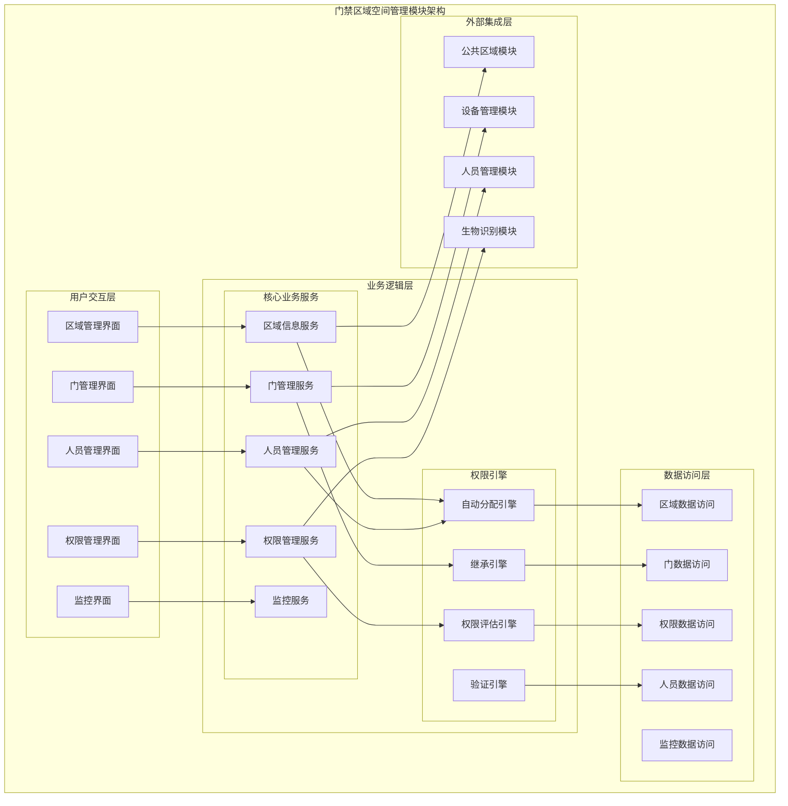
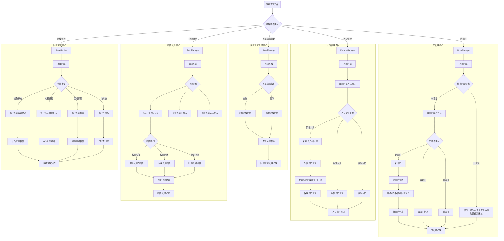

# 门禁区域空间管理模块详细设计

> **版本**: v1.0
> **更新时间**: 2025-11-13
> **分类**: 核心功能模块 > 企业OA系统 > 门禁管理系统
> **标签**: ["门禁系统", "区域管理", "权限分配", "空间管理", "权限继承"]
> **作者**: SmartAdmin规范治理委员会
> **描述**: IOE-DREAM智慧园区一卡通管理平台门禁管理系统的区域空间管理和权限分配模块详细技术设计

## 📋 模块概述

### 核心定位

**门禁区域空间管理模块**是IOE-DREAM智慧园区一卡通管理平台的重要业务模块，基于公共区域模块统一维护，主要负责门禁系统中的区域信息管理、门禁权限分配、人员权限管理和区域通行监控。模块采用权限自动分配机制，实现区域、人员、门的高效权限管理。

### 核心特性

- ✅ **统一区域管理**：基于公共区域模块的统一区域信息维护
- ✅ **智能权限分配**：新增门/人员时自动分配通行权限
- ✅ **权限继承机制**：人员继承门权限，门继承人员权限
- ✅ **实时区域监控**：设备状态、人员通行、区域容量监控
- ✅ **权限矩阵管理**：直观的人员-门权限关系管理
- ✅ **设备依赖验证**：门管理依赖设备管理的区域关联
- ✅ **数据一致性保障**：权限变更实时同步和一致性检查

## 🏗️ 区域空间管理模块架构设计

### 模块功能架构图



### 区域空间管理核心流程设计



## 🔧 核心功能详细设计

### 1. 权限自动分配引擎

#### 1.1 权限自动分配机制

**功能描述**：新增门或人员时自动分配通行权限

**技术实现**：
```java
@Service
@Slf4j
public class AutoPermissionAllocationService {

    @Resource
    private AreaPermissionService areaPermissionService;

    @Resource
    private DoorPermissionService doorPermissionService;

    @Resource
    private PersonPermissionService personPermissionService;

    /**
     * 新增门后自动分配权限给区域人员
     */
    @EventListener
    @Async
    @Transactional(rollbackFor = Exception.class)
    public void handleDoorAddedEvent(DoorAddedEvent event) {
        try {
            Long doorId = event.getDoorId();
            Long areaId = event.getAreaId();

            // 1. 获取区域内所有人员
            List<Long> areaPersonIds = areaPermissionService
                    .getAreaPersonIds(areaId);

            if (CollectionUtils.isEmpty(areaPersonIds)) {
                log.info("区域{}暂无人员，跳过权限自动分配", areaId);
                return;
            }

            // 2. 批量为人员分配门权限
            List<PersonDoorPermission> permissions = new ArrayList<>();
            for (Long personId : areaPersonIds) {
                PersonDoorPermission permission = PersonDoorPermission.builder()
                        .personId(personId)
                        .doorId(doorId)
                        .areaId(areaId)
                        .permissionType(PermissionType.ACCESS)
                        .validFrom(LocalDateTime.now())
                        .validTo(LocalDateTime.now().plusYears(10)) // 默认10年有效期
                        .allocationType(AllocationType.AUTO) // 自动分配标记
                        .createTime(LocalDateTime.now())
                        .build();
                permissions.add(permission);
            }

            // 3. 批量保存权限
            doorPermissionService.batchAddPermissions(permissions);

            log.info("门权限自动分配完成, doorId: {}, 分配权限数: {}",
                    doorId, permissions.size());

        } catch (Exception e) {
            log.error("门权限自动分配失败", e);
            throw new RuntimeException("权限自动分配失败");
        }
    }

    /**
     * 新增人员后自动分配区域门权限
     */
    @EventListener
    @Async
    @Transactional(rollbackFor = Exception.class)
    public void handlePersonAddedEvent(PersonAddedEvent event) {
        try {
            Long personId = event.getPersonId();
            Long areaId = event.getAreaId();

            // 1. 获取区域内所有门
            List<Long> areaDoorIds = areaPermissionService
                    .getAreaDoorIds(areaId);

            if (CollectionUtils.isEmpty(areaDoorIds)) {
                log.info("区域{}暂无门，跳过权限自动分配", areaId);
                return;
            }

            // 2. 批量为人员分配门权限
            List<PersonDoorPermission> permissions = new ArrayList<>();
            for (Long doorId : areaDoorIds) {
                PersonDoorPermission permission = PersonDoorPermission.builder()
                        .personId(personId)
                        .doorId(doorId)
                        .areaId(areaId)
                        .permissionType(PermissionType.ACCESS)
                        .validFrom(LocalDateTime.now())
                        .validTo(LocalDateTime.now().plusYears(10))
                        .allocationType(AllocationType.AUTO)
                        .createTime(LocalDateTime.now())
                        .build();
                permissions.add(permission);
            }

            // 3. 批量保存权限
            doorPermissionService.batchAddPermissions(permissions);

            log.info("人员权限自动分配完成, personId: {}, 分配权限数: {}",
                    personId, permissions.size());

        } catch (Exception e) {
            log.error("人员权限自动分配失败", e);
            throw new RuntimeException("权限自动分配失败");
        }
    }
}
```

#### 1.2 权限继承引擎

**功能描述**：处理权限继承逻辑和权限传递

**技术实现**：
```java
@Service
@Slf4j
public class PermissionInheritanceService {

    /**
     * 计算区域人员继承的门权限
     */
    public List<InheritedPermission> calculateInheritedPermissions(Long areaId) {
        try {
            List<InheritedPermission> inheritedPermissions = new ArrayList<>();

            // 1. 获取区域基础权限配置
            AreaPermissionConfig areaConfig = areaPermissionService
                    .getAreaPermissionConfig(areaId);

            // 2. 获取区域内所有门
            List<DoorEntity> areaDoors = doorService.getDoorsByArea(areaId);

            // 3. 计算每个门的继承权限
            for (DoorEntity door : areaDoors) {
                InheritedPermission permission = InheritedPermission.builder()
                        .areaId(areaId)
                        .doorId(door.getDoorId())
                        .doorName(door.getDoorName())
                        .inheritanceType(InheritanceType.AREA_BASED)
                        .accessTimeRanges(areaConfig.getTimeRanges())
                        .accessLevels(areaConfig.getAccessLevels())
                        .verificationMethods(areaConfig.getVerificationMethods())
                        .build();
                inheritedPermissions.add(permission);
            }

            return inheritedPermissions;

        } catch (Exception e) {
            log.error("计算继承权限失败, areaId: {}", areaId, e);
            return Collections.emptyList();
        }
    }

    /**
     * 应用权限继承规则
     */
    @Transactional(rollbackFor = Exception.class)
    public void applyInheritanceRules(Long areaId) {
        try {
            // 1. 清除现有的自动分配权限
            doorPermissionService.clearAutoPermissions(areaId);

            // 2. 计算新的继承权限
            List<InheritedPermission> inheritedPermissions =
                    calculateInheritedPermissions(areaId);

            // 3. 获取区域内所有人员
            List<Long> areaPersonIds = areaPermissionService
                    .getAreaPersonIds(areaId);

            // 4. 为每个人员应用继承权限
            for (Long personId : areaPersonIds) {
                applyPersonInheritance(personId, inheritedPermissions);
            }

            log.info("权限继承规则应用完成, areaId: {}", areaId);

        } catch (Exception e) {
            log.error("应用权限继承规则失败, areaId: {}", areaId, e);
            throw new RuntimeException("继承规则应用失败");
        }
    }

    /**
     * 为个人应用继承权限
     */
    private void applyPersonInheritance(Long personId,
                                       List<InheritedPermission> inheritedPermissions) {
        List<PersonDoorPermission> permissions = new ArrayList<>();

        for (InheritedPermission inherited : inheritedPermissions) {
            PersonDoorPermission permission = PersonDoorPermission.builder()
                    .personId(personId)
                    .doorId(inherited.getDoorId())
                    .areaId(inherited.getAreaId())
                    .permissionType(PermissionType.INHERITED)
                    .validFrom(inherited.getValidFrom())
                    .validTo(inherited.getValidTo())
                    .timeRanges(inherited.getAccessTimeRanges())
                    .accessLevels(inherited.getAccessLevels())
                    .verificationMethods(inherited.getVerificationMethods())
                    .allocationType(AllocationType.INHERITED)
                    .createTime(LocalDateTime.now())
                    .build();
            permissions.add(permission);
        }

        doorPermissionService.batchAddPermissions(permissions);
    }
}
```

### 2. 区域信息服务

#### 2.1 区域概览服务

**功能描述**：提供区域综合概览和统计信息

**技术实现**：
```java
@Service
@Slf4j
public class AreaOverviewService {

    @Resource
    private AreaDao areaDao;

    @Resource
    private DoorService doorService;

    @Resource
    private DeviceService deviceService;

    @Resource
    private PersonPermissionService personPermissionService;

    /**
     * 获取区域概览信息
     */
    public AreaOverviewVO getAreaOverview(Long areaId) {
        try {
            // 1. 获取区域基本信息
            AreaEntity area = areaDao.selectById(areaId);
            if (area == null) {
                throw new BusinessException("区域不存在");
            }

            // 2. 统计区域各项数据
            AreaOverviewVO overview = AreaOverviewVO.builder()
                    .areaId(areaId)
                    .areaName(area.getAreaName())
                    .areaType(area.getAreaType())
                    .build();

            // 3. 统计门数量
            long doorCount = doorService.countByArea(areaId);
            overview.setDoorCount(doorCount);

            // 4. 统计设备数量
            long deviceCount = deviceService.countByArea(areaId);
            overview.setDeviceCount(deviceCount);

            // 5. 统计人员数量
            long personCount = personPermissionService.countAreaPersons(areaId);
            overview.setPersonCount(personCount);

            // 6. 统计权限配置数量
            long permissionCount = personPermissionService
                    .countAreaPermissions(areaId);
            overview.setPermissionCount(permissionCount);

            // 7. 统计今日通行记录
            long todayAccessCount = accessEventService
                    .countTodayAccessByArea(areaId);
            overview.setTodayAccessCount(todayAccessCount);

            // 8. 获取区域设备状态统计
            DeviceStatusStatistics deviceStats = deviceService
                    .getDeviceStatisticsByArea(areaId);
            overview.setDeviceStatusStats(deviceStats);

            // 9. 获取区域容量监控
            AreaCapacityMonitor capacityMonitor = capacityMonitorService
                    .getCapacityMonitor(areaId);
            overview.setCapacityMonitor(capacityMonitor);

            return overview;

        } catch (Exception e) {
            log.error("获取区域概览失败, areaId: {}", areaId, e);
            throw new BusinessException("获取区域概览失败");
        }
    }

    /**
     * 获取区域权限配置概览
     */
    public AreaPermissionOverviewVO getPermissionOverview(Long areaId) {
        try {
            // 1. 获取区域权限配置
            AreaPermissionConfig config = areaPermissionService
                    .getPermissionConfig(areaId);

            // 2. 统计权限分配情况
            PermissionAllocationStats allocationStats = PermissionAllocationStats.builder()
                    .autoAllocatedCount(doorPermissionService
                            .countAutoPermissions(areaId))
                    .manualAllocatedCount(doorPermissionService
                            .countManualPermissions(areaId))
                    .inheritedCount(doorPermissionService
                            .countInheritedPermissions(areaId))
                    .build();

            // 3. 统计权限类型分布
            List<PermissionTypeDistribution> typeDistributions =
                    doorPermissionService.getPermissionTypeDistribution(areaId);

            return AreaPermissionOverviewVO.builder()
                    .areaId(areaId)
                    .permissionConfig(config)
                    .allocationStats(allocationStats)
                    .typeDistributions(typeDistributions)
                    .build();

        } catch (Exception e) {
            log.error("获取区域权限概览失败, areaId: {}", areaId, e);
            throw new BusinessException("获取权限概览失败");
        }
    }
}
```

### 3. 门管理服务

#### 3.1 门信息服务

**功能描述**：区域内门的全生命周期管理

**技术实现**：
```java
@Service
@Transactional(rollbackFor = Exception.class)
@Slf4j
public class AreaDoorManagementService {

    @Resource
    private DoorDao doorDao;

    @Resource
    private AreaDao areaDao;

    @Resource
    private DeviceService deviceService;

    @Resource
    private AutoPermissionAllocationService autoPermissionService;

    /**
     * 在区域内新增门
     */
    public ResponseDTO<Long> addDoorToArea(DoorAddForm addForm) {
        try {
            // 1. 验证区域存在
            AreaEntity area = areaDao.selectById(addForm.getAreaId());
            if (area == null) {
                return ResponseDTO.error("区域不存在");
            }

            // 2. 检查区域是否有关联设备
            List<DeviceInfo> areaDevices = deviceService
                    .getDevicesByArea(addForm.getAreaId());
            if (CollectionUtils.isEmpty(areaDevices)) {
                return ResponseDTO.error("区域暂无关联设备，请先在设备管理中添加设备到区域");
            }

            // 3. 检查门名称唯一性
            if (doorDao.existsByNameAndArea(addForm.getDoorName(), addForm.getAreaId())) {
                return ResponseDTO.error("门名称已存在");
            }

            // 4. 创建门记录
            DoorEntity door = DoorEntity.builder()
                    .doorName(addForm.getDoorName())
                    .areaId(addForm.getAreaId())
                    .deviceId(addForm.getDeviceId())
                    .doorType(addForm.getDoorType())
                    .verificationMethods(addForm.getVerificationMethods())
                    .accessTimeRanges(addForm.getAccessTimeRanges())
                    .accessLevels(addForm.getAccessLevels())
                    .description(addForm.getDescription())
                    .enabledFlag(true)
                    .createTime(LocalDateTime.now())
                    .build();

            doorDao.insert(door);

            // 5. 发布门新增事件，触发权限自动分配
            DoorAddedEvent event = DoorAddedEvent.builder()
                    .doorId(door.getDoorId())
                    .doorName(door.getDoorName())
                    .areaId(addForm.getAreaId())
                    .createTime(LocalDateTime.now())
                    .build();
            applicationEventPublisher.publishEvent(event);

            log.info("区域门添加成功, areaId: {}, doorId: {}",
                    addForm.getAreaId(), door.getDoorId());

            return ResponseDTO.ok(door.getDoorId());

        } catch (Exception e) {
            log.error("区域门添加失败", e);
            return ResponseDTO.error("添加失败");
        }
    }

    /**
     * 获取区域门列表
     */
    public ResponseDTO<PageResult<DoorListVO>> getAreaDoors(DoorQueryForm queryForm) {
        try {
            // 1. 构建查询条件
            LambdaQueryWrapper<DoorEntity> queryWrapper = new LambdaQueryWrapper<>();
            queryWrapper.eq(DoorEntity::getAreaId, queryForm.getAreaId())
                    .eq(DoorEntity::getDeletedFlag, false)
                    .orderByDesc(DoorEntity::getCreateTime);

            // 2. 分页查询
            IPage<DoorEntity> page = new Page<>(queryForm.getPageNum(), queryForm.getPageSize());
            IPage<DoorEntity> doorPage = doorDao.selectPage(page, queryWrapper);

            // 3. 转换为VO
            List<DoorListVO> doorList = doorPage.getRecords().stream()
                    .map(this::convertToDoorListVO)
                    .collect(Collectors.toList());

            PageResult<DoorListVO> pageResult = new PageResult<>();
            pageResult.setRows(doorList);
            pageResult.setTotal(doorPage.getTotal());
            pageResult.setPageNum(queryForm.getPageNum());
            pageResult.setPageSize(queryForm.getPageSize());

            return ResponseDTO.ok(pageResult);

        } catch (Exception e) {
            log.error("获取区域门列表失败", e);
            return ResponseDTO.error("查询失败");
        }
    }

    /**
     * 删除区域门
     */
    public ResponseDTO<Void> deleteAreaDoor(Long doorId) {
        try {
            // 1. 获取门信息
            DoorEntity door = doorDao.selectById(doorId);
            if (door == null || door.getDeletedFlag()) {
                return ResponseDTO.error("门不存在");
            }

            // 2. 清除相关权限
            doorPermissionService.revokeDoorPermissions(doorId);

            // 3. 软删除门
            door.setDeletedFlag(true);
            door.setUpdateTime(LocalDateTime.now());
            doorDao.updateById(door);

            log.info("区域门删除成功, doorId: {}", doorId);
            return ResponseDTO.ok();

        } catch (Exception e) {
            log.error("删除区域门失败", e);
            return ResponseDTO.error("删除失败");
        }
    }
}
```

### 4. 人员权限管理服务

#### 4.1 人员区域权限服务

**功能描述**：区域内人员权限的分配和管理

**技术实现**：
```java
@Service
@Transactional(rollbackFor = Exception.class)
@Slf4j
public class AreaPersonPermissionService {

    @Resource
    private PersonPermissionDao personPermissionDao;

    @Resource
    private EmployeeService employeeService;

    @Resource
    private DoorService doorService;

    @Resource
    private AutoPermissionAllocationService autoPermissionService;

    /**
     * 添加人员到区域
     */
    public ResponseDTO<Void> addPersonToArea(PersonAreaAddForm addForm) {
        try {
            // 1. 验证人员存在
            EmployeeEntity employee = employeeService.getById(addForm.getEmployeeId());
            if (employee == null) {
                return ResponseDTO.error("人员不存在");
            }

            // 2. 检查人员是否已在区域中
            if (personPermissionDao.existsPersonInArea(
                    addForm.getEmployeeId(), addForm.getAreaId())) {
                return ResponseDTO.error("人员已在区域中");
            }

            // 3. 创建人员区域关联
            PersonAreaEntity personArea = PersonAreaEntity.builder()
                    .employeeId(addForm.getEmployeeId())
                    .areaId(addForm.getAreaId())
                    .joinType(addForm.getJoinType())
                    .validFrom(addForm.getValidFrom())
                    .validTo(addForm.getValidTo())
                    .createTime(LocalDateTime.now())
                    .build();

            personPermissionDao.insertPersonArea(personArea);

            // 4. 发布人员新增事件，触发权限自动分配
            PersonAddedEvent event = PersonAddedEvent.builder()
                    .personId(addForm.getEmployeeId())
                    .personName(employee.getActualName())
                    .areaId(addForm.getAreaId())
                    .createTime(LocalDateTime.now())
                    .build();
            applicationEventPublisher.publishEvent(event);

            log.info("人员添加到区域成功, employeeId: {}, areaId: {}",
                    addForm.getEmployeeId(), addForm.getAreaId());

            return ResponseDTO.ok();

        } catch (Exception e) {
            log.error("人员添加到区域失败", e);
            return ResponseDTO.error("添加失败");
        }
    }

    /**
     * 获取区域人员权限矩阵
     */
    public ResponseDTO<AreaPermissionMatrixVO> getAreaPermissionMatrix(Long areaId) {
        try {
            // 1. 获取区域所有人员
            List<PersonPermissionMatrixRow> personRows =
                    getAreaPersonMatrixRows(areaId);

            // 2. 获取区域所有门
            List<PersonPermissionMatrixColumn> doorColumns =
                    getAreaDoorMatrixColumns(areaId);

            // 3. 获取权限矩阵数据
            List<PermissionMatrixCell> matrixCells =
                    getPermissionMatrixCells(areaId, personRows, doorColumns);

            AreaPermissionMatrixVO matrixVO = AreaPermissionMatrixVO.builder()
                    .areaId(areaId)
                    .personRows(personRows)
                    .doorColumns(doorColumns)
                    .matrixCells(matrixCells)
                    .build();

            return ResponseDTO.ok(matrixVO);

        } catch (Exception e) {
            log.error("获取区域权限矩阵失败, areaId: {}", areaId, e);
            return ResponseDTO.error("获取权限矩阵失败");
        }
    }

    /**
     * 批量调整人员权限
     */
    @Transactional(rollbackFor = Exception.class)
    public ResponseDTO<Void> batchAdjustPermissions(BatchPermissionAdjustForm form) {
        try {
            List<PermissionAdjustment> adjustments = form.getAdjustments();

            for (PermissionAdjustment adjustment : adjustments) {
                // 1. 验证权限调整请求
                validatePermissionAdjustment(adjustment);

                // 2. 执行权限调整
                executePermissionAdjustment(adjustment);
            }

            log.info("批量权限调整完成, 调整数量: {}", adjustments.size());
            return ResponseDTO.ok();

        } catch (Exception e) {
            log.error("批量权限调整失败", e);
            return ResponseDTO.error("权限调整失败");
        }
    }

    /**
     * 执行权限调整
     */
    private void executePermissionAdjustment(PermissionAdjustment adjustment) {
        switch (adjustment.getOperation()) {
            case GRANT:
                grantPersonDoorPermission(adjustment.getPersonId(),
                        adjustment.getDoorId(), adjustment.getPermission());
                break;
            case REVOKE:
                revokePersonDoorPermission(adjustment.getPersonId(),
                        adjustment.getDoorId());
                break;
            case MODIFY:
                modifyPersonDoorPermission(adjustment.getPersonId(),
                        adjustment.getDoorId(), adjustment.getPermission());
                break;
            default:
                throw new BusinessException("不支持的权限操作");
        }
    }
}
```

### 5. 区域监控服务

#### 5.1 实时监控服务

**功能描述**：区域实时状态监控和异常告警

**技术实现**：
```java
@Service
@Slf4j
public class AreaMonitoringService {

    @Resource
    private SimpMessagingTemplate messagingTemplate;

    @Resource
    private DeviceService deviceService;

    @Resource
    private AccessEventService accessEventService;

    @Resource
    private CapacityMonitorService capacityMonitorService;

    /**
     * 获取区域实时监控数据
     */
    @Cacheable(value = "areaMonitor", key = "#areaId")
    public AreaMonitorVO getAreaMonitorData(Long areaId) {
        try {
            AreaMonitorVO monitorVO = AreaMonitorVO.builder()
                    .areaId(areaId)
                    .timestamp(LocalDateTime.now())
                    .build();

            // 1. 设备状态监控
            DeviceMonitorData deviceMonitor = getDeviceMonitorData(areaId);
            monitorVO.setDeviceMonitor(deviceMonitor);

            // 2. 人员通行监控
            AccessMonitorData accessMonitor = getAccessMonitorData(areaId);
            monitorVO.setAccessMonitor(accessMonitor);

            // 3. 区域容量监控
            CapacityMonitorData capacityMonitor = getCapacityMonitorData(areaId);
            monitorVO.setCapacityMonitor(capacityMonitor);

            // 4. 门状态监控
            DoorMonitorData doorMonitor = getDoorMonitorData(areaId);
            monitorVO.setDoorMonitor(doorMonitor);

            return monitorVO;

        } catch (Exception e) {
            log.error("获取区域监控数据失败, areaId: {}", areaId, e);
            return null;
        }
    }

    /**
     * 设备状态监控
     */
    private DeviceMonitorData getDeviceMonitorData(Long areaId) {
        List<DeviceInfo> areaDevices = deviceService.getDevicesByArea(areaId);

        DeviceMonitorData monitorData = DeviceMonitorData.builder()
                .totalDevices(areaDevices.size())
                .onlineDevices((int) areaDevices.stream()
                        .filter(DeviceInfo::isOnline)
                        .count())
                .offlineDevices((int) areaDevices.stream()
                        .filter(d -> !d.isOnline())
                        .count())
                .build();

        // 计算在线率
        if (monitorData.getTotalDevices() > 0) {
            double onlineRate = (double) monitorData.getOnlineDevices() /
                    monitorData.getTotalDevices() * 100;
            monitorData.setOnlineRate(onlineRate);
        }

        return monitorData;
    }

    /**
     * 人员通行监控
     */
    private AccessMonitorData getAccessMonitorData(Long areaId) {
        // 获取今日通行统计
        LocalDate today = LocalDate.now();
        LocalDateTime startOfToday = today.atStartOfDay();
        LocalDateTime endOfToday = today.plusDays(1).atStartOfDay();

        AccessMonitorData monitorData = AccessMonitorData.builder()
                .todayAccessCount(accessEventService.countAccessByAreaAndTime(
                        areaId, startOfToday, endOfToday))
                .todaySuccessCount(accessEventService.countSuccessAccessByAreaAndTime(
                        areaId, startOfToday, endOfToday))
                .todayFailureCount(accessEventService.countFailureAccessByAreaAndTime(
                        areaId, startOfToday, endOfToday))
                .build();

        // 计算成功率
        if (monitorData.getTodayAccessCount() > 0) {
            double successRate = (double) monitorData.getTodaySuccessCount() /
                    monitorData.getTodayAccessCount() * 100;
            monitorData.setSuccessRate(successRate);
        }

        return monitorData;
    }

    /**
     * 区域容量监控
     */
    private CapacityMonitorData getCapacityMonitorData(Long areaId) {
        AreaCapacityMonitor capacityMonitor = capacityMonitorService
                .getCapacityMonitor(areaId);

        return CapacityMonitorData.builder()
                .maxCapacity(capacityMonitor.getMaxCapacity())
                .currentCount(capacityMonitor.getCurrentCount())
                .utilizationRate(capacityMonitor.getUtilizationRate())
                .alertLevel(capacityMonitor.getAlertLevel())
                .build();
    }

    /**
     * 推送实时监控数据
     */
    @EventListener
    @Async
    public void handleAreaMonitorUpdateEvent(AreaMonitorUpdateEvent event) {
        try {
            Long areaId = event.getAreaId();

            // 获取最新监控数据
            AreaMonitorVO monitorData = getAreaMonitorData(areaId);

            // 推送到前端
            messagingTemplate.convertAndSend(
                "/topic/area-monitor/" + areaId,
                monitorData
            );

            // 检查告警条件
            checkAndSendAlerts(areaId, monitorData);

        } catch (Exception e) {
            log.error("推送区域监控数据失败, areaId: {}", event.getAreaId(), e);
        }
    }

    /**
     * 检查并发送告警
     */
    private void checkAndSendAlerts(Long areaId, AreaMonitorVO monitorData) {
        List<MonitorAlert> alerts = new ArrayList<>();

        // 1. 设备离线告警
        if (monitorData.getDeviceMonitor().getOfflineDevices() > 0) {
            alerts.add(MonitorAlert.builder()
                    .areaId(areaId)
                    .alertType(AlertType.DEVICE_OFFLINE)
                    .alertLevel(AlertLevel.WARNING)
                    .message("有设备离线")
                    .createTime(LocalDateTime.now())
                    .build());
        }

        // 2. 区域容量告警
        CapacityMonitorData capacity = monitorData.getCapacityMonitor();
        if (capacity.getUtilizationRate() > 90.0) {
            alerts.add(MonitorAlert.builder()
                    .areaId(areaId)
                    .alertType(AlertType.CAPACITY_OVERFLOW)
                    .alertLevel(AlertLevel.CRITICAL)
                    .message("区域人员容量超限")
                    .createTime(LocalDateTime.now())
                    .build());
        }

        // 发送告警
        for (MonitorAlert alert : alerts) {
            notificationService.sendMonitorAlert(alert);
        }
    }
}
```

## 📊 数据库设计

### 区域空间管理相关表结构

```sql
-- 人员区域关联表
CREATE TABLE `t_access_person_area` (
    `id` BIGINT AUTO_INCREMENT COMMENT '主键ID',
    `employee_id` BIGINT NOT NULL COMMENT '员工ID',
    `area_id` BIGINT NOT NULL COMMENT '区域ID',
    `join_type` TINYINT DEFAULT 1 COMMENT '加入类型(1:分配 2:申请 3:临时)',
    `valid_from` DATETIME COMMENT '生效开始时间',
    `valid_to` DATETIME COMMENT '生效结束时间',
    `join_reason` VARCHAR(200) COMMENT '加入原因',
    `create_time` DATETIME NOT NULL DEFAULT CURRENT_TIMESTAMP COMMENT '创建时间',
    `update_time` DATETIME NOT NULL DEFAULT CURRENT_TIMESTAMP ON UPDATE CURRENT_TIMESTAMP COMMENT '更新时间',
    `create_user_id` BIGINT COMMENT '创建用户ID',
    `deleted_flag` TINYINT DEFAULT 0 COMMENT '删除标志(0:正常 1:删除)',
    PRIMARY KEY (`id`),
    UNIQUE KEY `uk_employee_area` (`employee_id`, `area_id`),
    KEY `idx_area_id` (`area_id`),
    KEY `idx_valid_period` (`valid_from`, `valid_to`)
) ENGINE=InnoDB DEFAULT CHARSET=utf8mb4 COMMENT='人员区域关联表';

-- 人员门权限表
CREATE TABLE `t_access_person_door_permission` (
    `permission_id` BIGINT AUTO_INCREMENT COMMENT '权限ID',
    `person_id` BIGINT NOT NULL COMMENT '人员ID',
    `door_id` BIGINT NOT NULL COMMENT '门ID',
    `area_id` BIGINT NOT NULL COMMENT '区域ID',
    `permission_type` TINYINT DEFAULT 1 COMMENT '权限类型(1:访问 2:管理 3:应急)',
    `allocation_type` TINYINT DEFAULT 1 COMMENT '分配类型(1:手动 2:自动 3:继承)',
    `valid_from` DATETIME NOT NULL COMMENT '生效开始时间',
    `valid_to` DATETIME NOT NULL COMMENT '生效结束时间',
    `time_ranges` JSON COMMENT '通行时间段配置',
    `access_levels` JSON COMMENT '访问级别配置',
    `verification_methods` JSON COMMENT '验证方式配置',
    `description` VARCHAR(500) COMMENT '权限描述',
    `create_time` DATETIME NOT NULL DEFAULT CURRENT_TIMESTAMP COMMENT '创建时间',
    `update_time` DATETIME NOT NULL DEFAULT CURRENT_TIMESTAMP ON UPDATE CURRENT_TIMESTAMP COMMENT '更新时间',
    `create_user_id` BIGINT COMMENT '创建用户ID',
    `deleted_flag` TINYINT DEFAULT 0 COMMENT '删除标志(0:正常 1:删除)',
    PRIMARY KEY (`permission_id`),
    UNIQUE KEY `uk_person_door` (`person_id`, `door_id`),
    KEY `idx_area_id` (`area_id`),
    KEY `idx_permission_type` (`permission_type`),
    KEY `idx_allocation_type` (`allocation_type`),
    KEY `idx_valid_period` (`valid_from`, `valid_to`)
) ENGINE=InnoDB DEFAULT CHARSET=utf8mb4 COMMENT='人员门权限表';

-- 区域权限配置表
CREATE TABLE `t_access_area_permission_config` (
    `config_id` BIGINT AUTO_INCREMENT COMMENT '配置ID',
    `area_id` BIGINT NOT NULL COMMENT '区域ID',
    `config_name` VARCHAR(100) NOT NULL COMMENT '配置名称',
    `default_time_ranges` JSON COMMENT '默认通行时间段',
    `default_access_levels` JSON COMMENT '默认访问级别',
    `default_verification_methods` JSON COMMENT '默认验证方式',
    `permission_inheritance_enabled` TINYINT DEFAULT 1 COMMENT '是否启用权限继承',
    `auto_allocation_enabled` TINYINT DEFAULT 1 COMMENT '是否启用自动分配',
    `max_valid_days` INT DEFAULT 3650 COMMENT '最大有效期(天)',
    `description` VARCHAR(500) COMMENT '配置描述',
    `enabled_flag` TINYINT DEFAULT 1 COMMENT '启用标志(0:禁用 1:启用)',
    `create_time` DATETIME NOT NULL DEFAULT CURRENT_TIMESTAMP COMMENT '创建时间',
    `update_time` DATETIME NOT NULL DEFAULT CURRENT_TIMESTAMP ON UPDATE CURRENT_TIMESTAMP COMMENT '更新时间',
    `create_user_id` BIGINT COMMENT '创建用户ID',
    PRIMARY KEY (`config_id`),
    UNIQUE KEY `uk_area_config` (`area_id`),
    KEY `idx_enabled_flag` (`enabled_flag`)
) ENGINE=InnoDB DEFAULT CHARSET=utf8mb4 COMMENT='区域权限配置表';

-- 区域容量监控表
CREATE TABLE `t_access_area_capacity_monitor` (
    `monitor_id` BIGINT AUTO_INCREMENT COMMENT '监控ID',
    `area_id` BIGINT NOT NULL COMMENT '区域ID',
    `max_capacity` INT NOT NULL DEFAULT 0 COMMENT '最大容量',
    `current_count` INT DEFAULT 0 COMMENT '当前人数',
    `warning_threshold` DECIMAL(5,2) DEFAULT 80.00 COMMENT '告警阈值(%)',
    `critical_threshold` DECIMAL(5,2) DEFAULT 95.00 COMMENT '严重告警阈值(%)',
    `last_update_time` DATETIME COMMENT '最后更新时间',
    `create_time` DATETIME NOT NULL DEFAULT CURRENT_TIMESTAMP COMMENT '创建时间',
    `update_time` DATETIME NOT NULL DEFAULT CURRENT_TIMESTAMP ON UPDATE CURRENT_TIMESTAMP COMMENT '更新时间',
    PRIMARY KEY (`monitor_id`),
    UNIQUE KEY `uk_area_monitor` (`area_id`),
    KEY `idx_last_update` (`last_update_time`)
) ENGINE=InnoDB DEFAULT CHARSET=utf8mb4 COMMENT='区域容量监控表';

-- 权限操作日志表
CREATE TABLE `t_access_permission_operation_log` (
    `log_id` BIGINT AUTO_INCREMENT COMMENT '日志ID',
    `area_id` BIGINT COMMENT '区域ID',
    `person_id` BIGINT COMMENT '人员ID',
    `door_id` BIGINT COMMENT '门ID',
    `operation_type` VARCHAR(50) NOT NULL COMMENT '操作类型',
    `operation_content` TEXT COMMENT '操作内容',
    `permission_before` JSON COMMENT '操作前权限',
    `permission_after` JSON COMMENT '操作后权限',
    `operation_result` TINYINT COMMENT '操作结果(1:成功 2:失败)',
    `error_message` TEXT COMMENT '错误信息',
    `execute_user_id` BIGINT COMMENT '执行用户ID',
    `execute_time` DATETIME NOT NULL DEFAULT CURRENT_TIMESTAMP COMMENT '执行时间',
    `create_time` DATETIME NOT NULL DEFAULT CURRENT_TIMESTAMP COMMENT '创建时间',
    PRIMARY KEY (`log_id`),
    KEY `idx_area_id` (`area_id`),
    KEY `idx_person_id` (`person_id`),
    KEY `idx_operation_type` (`operation_type`),
    KEY `idx_execute_time` (`execute_time`)
) ENGINE=InnoDB DEFAULT CHARSET=utf8mb4 COMMENT='权限操作日志表';
```

## 🔗 相关文档

### 技术实现文档
- [门禁管理系统整体架构设计](./系统整体架构设计.md) - 完整的系统架构设计
- [设备管理模块详细设计](./设备管理模块详细设计.md) - 设备管理功能详细实现
- [权限管理模块详细设计](./权限管理模块详细设计.md) - 权限管理技术实现

### 业务功能文档
- [门禁系统架构流程图](./系统架构流程图.md) - 系统流程和模块交互
- [实时监控模块详细设计](./实时监控模块详细设计.md) - 实时监控功能设计
- [系统配置模块详细设计](./系统配置模块详细设计.md) - 系统配置功能实现

### 数据库设计文档
- [门禁管理数据库设计](./数据库设计.md) - 完整的数据库表结构设计
- [权限管理数据库设计](./权限管理数据库设计.md) - 权限相关表结构设计
- [监控数据存储设计](./监控数据存储设计.md) - 监控数据存储方案

---

## 🎯 核心原则总结

1. **统一区域管理** - 基于公共区域模块的统一区域信息维护
2. **智能权限分配** - 自动权限分配和继承机制确保数据一致性
3. **灵活权限控制** - 支持手动、自动、继承多种权限分配模式
4. **实时监控预警** - 全面的区域状态监控和智能告警机制
5. **权限矩阵管理** - 直观的权限关系管理和批量操作支持

## 📋 版本信息

- 本文档基于ZKBioSecurity-ACC区域管理架构设计
- 区域空间管理模块设计负责人：SmartAdmin规范治理委员会
- 创建日期：2025-11-13
- 下次评审：2026-02-13

---

**🎯 IOE-DREAM门禁区域空间管理模块 - 智能权限分配、实时监控、高效管理的企业级区域空间解决方案**