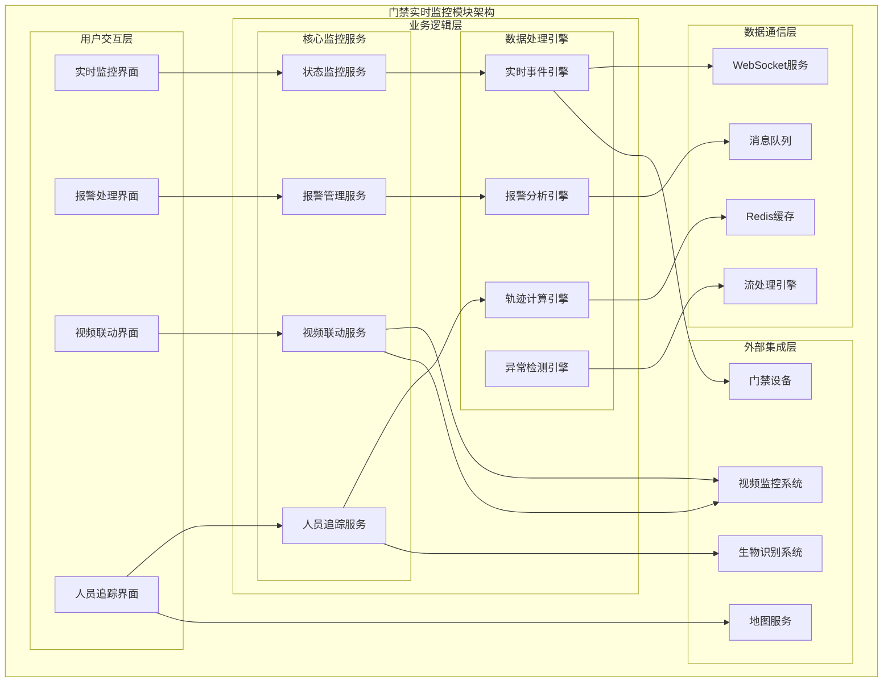
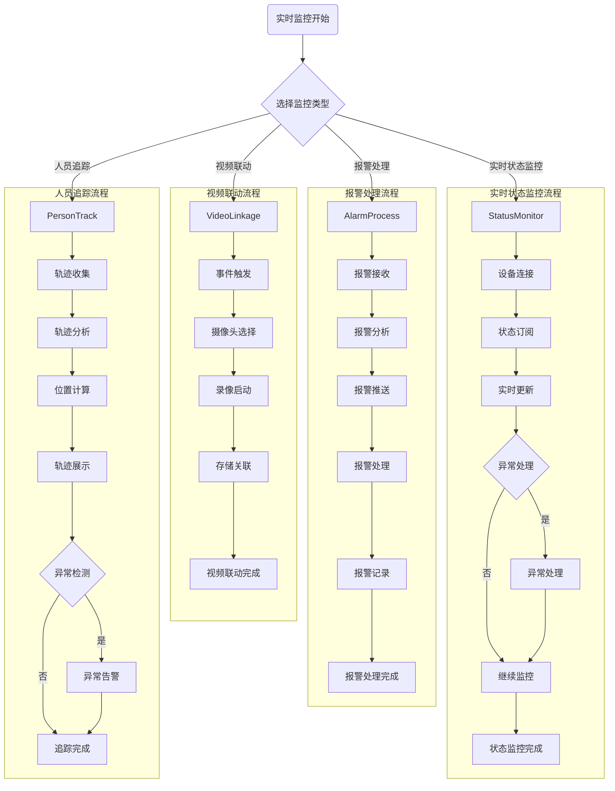

# 门禁实时监控模块详细设计

> **版本**: v1.0
> **更新时间**: 2025-11-13
> **分类**: 核心功能模块 > 企业OA系统 > 门禁管理系统
> **标签**: ["门禁系统", "实时监控", "视频联动", "人员追踪", "智能告警"]
> **作者**: SmartAdmin规范治理委员会
> **描述**: IOE-DREAM智慧园区一卡通管理平台门禁管理系统的实时监控、视频联动和人员追踪模块详细技术设计

## 📋 模块概述

### 核心定位

**门禁实时监控模块**是IOE-DREAM智慧园区一卡通管理平台的核心监控模块，提供7×24小时实时状态监控、智能报警处理、视频联动控制和人员轨迹追踪功能。模块采用事件驱动架构和高性能数据处理技术，确保监控数据的实时性和准确性。

### 核心特性

- ✅ **实时状态监控**：设备在线状态、门状态、网络状态实时监控
- ✅ **智能报警处理**：多级报警分类、智能分析和快速响应
- ✅ **视频联动控制**：门禁事件与视频监控无缝联动
- ✅ **人员轨迹追踪**：实时人员位置追踪和轨迹分析
- ✅ **异常行为检测**：基于机器学习的异常行为识别
- ✅ **高性能处理**：支持大规模并发设备监控
- ✅ **多维度展示**：地图展示、数据可视化、热力图分析

## 🏗️ 实时监控模块架构设计

### 模块功能架构图



### 实时监控核心流程设计



## 🔧 核心功能详细设计

### 1. 实时状态监控服务

#### 1.1 设备状态监控

**功能描述**：实时监控门禁设备、门、读头等硬件状态

**技术实现**：
```java
@Service
@Slf4j
public class RealTimeStatusMonitorService {

    @Resource
    private SimpMessagingTemplate messagingTemplate;

    @Resource
    private RedisTemplate<String, Object> redisTemplate;

    @Resource
    private DeviceConnectionPool connectionPool;

    private final ScheduledExecutorService monitorExecutor =
            Executors.newScheduledThreadPool(10);

    /**
     * 启动设备状态监控
     */
    @PostConstruct
    public void startDeviceStatusMonitoring() {
        // 每秒更新一次设备状态
        monitorExecutor.scheduleAtFixedRate(() -> {
            try {
                updateAllDeviceStatus();
            } catch (Exception e) {
                log.error("设备状态监控更新失败", e);
            }
        }, 0, 1, TimeUnit.SECONDS);
    }

    /**
     * 更新所有设备状态
     */
    private void updateAllDeviceStatus() {
        try {
            // 1. 获取所有在线设备
            List<DeviceConnection> onlineDevices = connectionPool.getOnlineDevices();

            // 2. 并发更新设备状态
            List<CompletableFuture<DeviceStatus>> futures = onlineDevices.stream()
                    .map(device -> CompletableFuture.supplyAsync(() ->
                            updateDeviceStatus(device), monitorExecutor))
                    .collect(Collectors.toList());

            // 3. 等待所有更新完成
            CompletableFuture.allOf(futures.toArray(new CompletableFuture[0]))
                    .thenApply(v -> futures.stream()
                            .map(CompletableFuture::join)
                            .collect(Collectors.toList()))
                    .thenAccept(this::processStatusUpdates)
                    .exceptionally(throwable -> {
                        log.error("设备状态批量更新失败", throwable);
                        return null;
                    });

        } catch (Exception e) {
            log.error("设备状态监控异常", e);
        }
    }

    /**
     * 更新单个设备状态
     */
    private DeviceStatus updateDeviceStatus(DeviceConnection connection) {
        try {
            Long deviceId = connection.getDeviceId();

            // 1. 获取设备基本信息
            DeviceInfo deviceInfo = deviceService.getDeviceInfo(deviceId);

            // 2. 获取设备实时状态
            DeviceRealTimeStatus status = deviceProtocolAdapter
                    .getDeviceRealTimeStatus(connection);

            // 3. 构建设备状态对象
            DeviceStatus deviceStatus = DeviceStatus.builder()
                    .deviceId(deviceId)
                    .deviceName(deviceInfo.getDeviceName())
                    .ipAddress(deviceInfo.getIpAddress())
                    .onlineStatus(status.isOnline())
                    .cpuUsage(status.getCpuUsage())
                    .memoryUsage(status.getMemoryUsage())
                    .diskUsage(status.getDiskUsage())
                    .networkStatus(status.getNetworkStatus())
                    .lastUpdateTime(LocalDateTime.now())
                    .build();

            // 4. 更新缓存
            String cacheKey = "device:status:" + deviceId;
            redisTemplate.opsForValue().set(cacheKey, deviceStatus, Duration.ofMinutes(5));

            return deviceStatus;

        } catch (Exception e) {
            log.error("更新设备状态失败, deviceId: {}", connection.getDeviceId(), e);
            return DeviceStatus.offline(connection.getDeviceId());
        }
    }

    /**
     * 处理状态更新
     */
    private void processStatusUpdates(List<DeviceStatus> statusUpdates) {
        try {
            // 1. 批量保存到数据库
            deviceStatusService.batchUpdateStatus(statusUpdates);

            // 2. 推送实时状态到前端
            for (DeviceStatus status : statusUpdates) {
                messagingTemplate.convertAndSend(
                    "/topic/device-status/" + status.getDeviceId(),
                    status
                );
            }

            // 3. 检查异常状态
            checkAbnormalStatus(statusUpdates);

        } catch (Exception e) {
            log.error("处理设备状态更新失败", e);
        }
    }

    /**
     * 检查异常状态
     */
    private void checkAbnormalStatus(List<DeviceStatus> statusUpdates) {
        for (DeviceStatus status : statusUpdates) {
            // 1. 检查设备离线
            if (!status.isOnlineStatus()) {
                DeviceOfflineEvent event = DeviceOfflineEvent.builder()
                        .deviceId(status.getDeviceId())
                        .deviceName(status.getDeviceName())
                        .offlineTime(status.getLastUpdateTime())
                        .build();
                applicationEventPublisher.publishEvent(event);
            }

            // 2. 检查CPU使用率过高
            if (status.getCpuUsage() > 90.0) {
                DeviceHighCpuEvent event = DeviceHighCpuEvent.builder()
                        .deviceId(status.getDeviceId())
                        .cpuUsage(status.getCpuUsage())
                        .build();
                applicationEventPublisher.publishEvent(event);
            }

            // 3. 检查内存使用率过高
            if (status.getMemoryUsage() > 90.0) {
                DeviceHighMemoryEvent event = DeviceHighMemoryEvent.builder()
                        .deviceId(status.getDeviceId())
                        .memoryUsage(status.getMemoryUsage())
                        .build();
                applicationEventPublisher.publishEvent(event);
            }
        }
    }
}
```

#### 1.2 门状态监控

**功能描述**：实时监控门的开关状态和异常情况

**技术实现**：
```java
@Service
@Slf4j
public class DoorStatusMonitorService {

    @Resource
    private DeviceProtocolAdapter protocolAdapter;

    @Resource
    private DoorEventService doorEventService;

    @Resource
    private AlarmService alarmService;

    /**
     * 监控门状态变化
     */
    @EventListener
    @Async
    public void handleDoorStatusChangedEvent(DoorStatusChangedEvent event) {
        try {
            Long doorId = event.getDoorId();
            DoorStatus newStatus = event.getNewStatus();
            DoorStatus oldStatus = event.getOldStatus();

            // 1. 记录门状态变化事件
            DoorStatusChangeEvent statusChangeEvent = DoorStatusChangeEvent.builder()
                    .doorId(doorId)
                    .oldStatus(oldStatus)
                    .newStatus(newStatus)
                    .changeTime(LocalDateTime.now())
                    .changeReason(event.getChangeReason())
                    .build();

            doorEventService.saveStatusChangeEvent(statusChangeEvent);

            // 2. 检查异常状态
            checkAbnormalDoorStatus(doorId, newStatus, oldStatus);

            // 3. 推送状态变化到前端
            messagingTemplate.convertAndSend(
                "/topic/door-status/" + doorId,
                DoorStatusVO.builder()
                        .doorId(doorId)
                        .status(newStatus)
                        .changeTime(LocalDateTime.now())
                        .build()
            );

            log.info("门状态变化处理完成, doorId: {}, status: {} -> {}",
                    doorId, oldStatus, newStatus);

        } catch (Exception e) {
            log.error("门状态变化处理失败", e);
        }
    }

    /**
     * 检查异常门状态
     */
    private void checkAbnormalDoorStatus(Long doorId, DoorStatus newStatus,
                                       DoorStatus oldStatus) {
        try {
            // 1. 检查门强制开门
            if (newStatus == DoorStatus.FORCED_OPEN) {
                DoorForcedOpenAlarm alarm = DoorForcedOpenAlarm.builder()
                        .doorId(doorId)
                        .alarmLevel(AlarmLevel.HIGH)
                        .alarmTime(LocalDateTime.now())
                        .description("检测到门被强制打开")
                        .build();
                alarmService.createAlarm(alarm);
            }

            // 2. 检查门长时间未关闭
            if (newStatus == DoorStatus.OPEN && oldStatus != DoorStatus.OPEN) {
                // 启动长时间开门检测定时器
                startLongOpenCheckTimer(doorId);
            }

            // 3. 检查门异常状态
            if (newStatus == DoorStatus.FAULT) {
                DoorFaultAlarm alarm = DoorFaultAlarm.builder()
                        .doorId(doorId)
                        .alarmLevel(AlarmLevel.MEDIUM)
                        .alarmTime(LocalDateTime.now())
                        .description("门设备故障")
                        .build();
                alarmService.createAlarm(alarm);
            }

        } catch (Exception e) {
            log.error("检查异常门状态失败, doorId: {}", doorId, e);
        }
    }

    /**
     * 启动长时间开门检测定时器
     */
    private void startLongOpenCheckTimer(Long doorId) {
        ScheduledExecutorService timer = Executors.newSingleThreadScheduledExecutor();

        timer.schedule(() -> {
            try {
                DoorStatus currentStatus = doorService.getDoorStatus(doorId);
                if (currentStatus == DoorStatus.OPEN) {
                    // 生成长时间开门告警
                    DoorLongOpenAlarm alarm = DoorLongOpenAlarm.builder()
                            .doorId(doorId)
                            .alarmLevel(AlarmLevel.MEDIUM)
                            .alarmTime(LocalDateTime.now())
                            .description("门长时间未关闭")
                            .build();
                    alarmService.createAlarm(alarm);
                }
            } catch (Exception e) {
                log.error("长时间开门检测失败", e);
            }
        }, 30, TimeUnit.SECONDS); // 30秒后检查
    }
}
```

### 2. 智能报警处理服务

#### 2.1 报警管理服务

**功能描述**：智能报警分析、分类和处理

**技术实现**：
```java
@Service
@Slf4j
public class IntelligentAlarmProcessService {

    @Resource
    private AlarmAnalysisEngine alarmAnalysisEngine;

    @Resource
    private AlarmNotificationService notificationService;

    @Resource
    private AlarmEscalationService escalationService;

    /**
     * 处理报警事件
     */
    @EventListener
    @Async
    public void handleAlarmEvent(AlarmEvent event) {
        try {
            // 1. 分析报警类型和级别
            AlarmAnalysisResult analysisResult = alarmAnalysisEngine
                    .analyzeAlarm(event);

            // 2. 创建报警记录
            AlarmRecord alarmRecord = AlarmRecord.builder()
                    .alarmId(event.getAlarmId())
                    .alarmType(analysisResult.getAlarmType())
                    .alarmLevel(analysisResult.getAlarmLevel())
                    .sourceDeviceId(event.getSourceDeviceId())
                    .sourceAreaId(event.getSourceAreaId())
                    .alarmTitle(analysisResult.getTitle())
                    .alarmContent(analysisResult.getContent())
                    .occurrenceTime(LocalDateTime.now())
                    .status(AlarmStatus.PENDING)
                    .build();

            alarmService.saveAlarm(alarmRecord);

            // 3. 发送报警通知
            sendAlarmNotifications(alarmRecord, analysisResult);

            // 4. 启动报警升级定时器
            startAlarmEscalationTimer(alarmRecord);

            log.info("报警事件处理完成, alarmId: {}, level: {}",
                    event.getAlarmId(), analysisResult.getAlarmLevel());

        } catch (Exception e) {
            log.error("报警事件处理失败", e);
        }
    }

    /**
     * 发送报警通知
     */
    private void sendAlarmNotifications(AlarmRecord alarmRecord,
                                       AlarmAnalysisResult analysisResult) {
        try {
            // 1. 获取报警通知规则
            List<NotificationRule> notificationRules = getNotificationRules(
                    alarmRecord.getAlarmType(), alarmRecord.getAlarmLevel());

            // 2. 根据规则发送通知
            for (NotificationRule rule : notificationRules) {
                switch (rule.getNotificationType()) {
                    case SMS:
                        notificationService.sendSmsNotification(alarmRecord, rule);
                        break;
                    case EMAIL:
                        notificationService.sendEmailNotification(alarmRecord, rule);
                        break;
                    case PUSH:
                        notificationService.sendPushNotification(alarmRecord, rule);
                        break;
                    case WEBHOOK:
                        notificationService.sendWebhookNotification(alarmRecord, rule);
                        break;
                }
            }

        } catch (Exception e) {
            log.error("发送报警通知失败, alarmId: {}", alarmRecord.getAlarmId(), e);
        }
    }

    /**
     * 启动报警升级定时器
     */
    private void startAlarmEscalationTimer(AlarmRecord alarmRecord) {
        ScheduledExecutorService escalationTimer = Executors.newSingleThreadScheduledExecutor();

        // 根据报警级别设置升级时间
        int escalationDelay = getEscalationDelay(alarmRecord.getAlarmLevel());

        escalationTimer.schedule(() -> {
            try {
                AlarmRecord currentAlarm = alarmService.getById(alarmRecord.getAlarmId());
                if (currentAlarm.getStatus() == AlarmStatus.PENDING) {
                    // 执行报警升级
                    escalationService.escalateAlarm(currentAlarm);
                }
            } catch (Exception e) {
                log.error("报警升级处理失败, alarmId: {}", alarmRecord.getAlarmId(), e);
            }
        }, escalationDelay, TimeUnit.SECONDS);
    }

    /**
     * 获取升级延迟时间（秒）
     */
    private int getEscalationDelay(AlarmLevel alarmLevel) {
        switch (alarmLevel) {
            case CRITICAL:
                return 30; // 30秒
            case HIGH:
                return 60; // 1分钟
            case MEDIUM:
                return 300; // 5分钟
            case LOW:
                return 900; // 15分钟
            default:
                return 600; // 默认10分钟
        }
    }
}
```

#### 2.2 报警分析引擎

**功能描述**：基于规则和机器学习的智能报警分析

**技术实现**：
```java
@Component
@Slf4j
public class AlarmAnalysisEngine {

    @Resource
    private AlarmRuleEngine ruleEngine;

    @Resource
    private MachineLearningModel mlModel;

    @Resource
    private AlarmHistoryService historyService;

    /**
     * 分析报警事件
     */
    public AlarmAnalysisResult analyzeAlarm(AlarmEvent event) {
        try {
            // 1. 规则分析
            RuleAnalysisResult ruleResult = ruleEngine.analyze(event);

            // 2. 机器学习分析
            MLAnalysisResult mlResult = mlModel.analyze(event);

            // 3. 历史数据分析
            HistoryAnalysisResult historyResult = historyService.analyzePattern(event);

            // 4. 综合分析结果
            AlarmAnalysisResult result = AlarmAnalysisResult.builder()
                    .alarmType(determineAlarmType(ruleResult, mlResult))
                    .alarmLevel(determineAlarmLevel(ruleResult, mlResult, historyResult))
                    .confidence(calculateConfidence(ruleResult, mlResult))
                    .title(generateAlarmTitle(event, ruleResult))
                    .content(generateAlarmContent(event, ruleResult, mlResult))
                    .recommendedActions(generateRecommendedActions(ruleResult, mlResult))
                    .relatedEvents(findRelatedEvents(event))
                    .build();

            log.info("报警分析完成, eventType: {}, alarmLevel: {}, confidence: {}%",
                    event.getEventType(), result.getAlarmLevel(), result.getConfidence());

            return result;

        } catch (Exception e) {
            log.error("报警分析失败", e);
            return AlarmAnalysisResult.defaultResult(event);
        }
    }

    /**
     * 确定报警类型
     */
    private AlarmType determineAlarmType(RuleAnalysisResult ruleResult,
                                       MLAnalysisResult mlResult) {
        // 优先使用规则引擎结果
        if (ruleResult.getAlarmType() != null) {
            return ruleResult.getAlarmType();
        }

        // 使用机器学习结果
        if (mlResult.getAlarmType() != null) {
            return mlResult.getAlarmType();
        }

        // 默认类型
        return AlarmType.SYSTEM_ERROR;
    }

    /**
     * 确定报警级别
     */
    private AlarmLevel determineAlarmLevel(RuleAnalysisResult ruleResult,
                                          MLAnalysisResult mlResult,
                                          HistoryAnalysisResult historyResult) {
        // 1. 基础级别从规则引擎获取
        AlarmLevel baseLevel = ruleResult.getAlarmLevel() != null ?
                ruleResult.getAlarmLevel() : AlarmLevel.LOW;

        // 2. 机器学习调整
        if (mlResult.getRiskScore() > 0.8) {
            baseLevel = increaseAlarmLevel(baseLevel);
        }

        // 3. 历史模式调整
        if (historyResult.isHighFrequencyPattern()) {
            baseLevel = decreaseAlarmLevel(baseLevel); // 高频模式降低级别
        }

        return baseLevel;
    }

    /**
     * 计算分析置信度
     */
    private double calculateConfidence(RuleAnalysisResult ruleResult,
                                     MLAnalysisResult mlResult) {
        double ruleConfidence = ruleResult.getConfidence();
        double mlConfidence = mlResult.getConfidence();

        // 加权平均
        return (ruleConfidence * 0.6) + (mlConfidence * 0.4);
    }

    /**
     * 生成报警标题
     */
    private String generateAlarmTitle(AlarmEvent event, RuleAnalysisResult ruleResult) {
        if (ruleResult.getTitle() != null) {
            return ruleResult.getTitle();
        }

        return String.format("%s - %s", event.getEventType().getDescription(),
                event.getSourceDeviceName());
    }
}
```

### 3. 视频联动服务

#### 3.1 视频联动控制

**功能描述**：门禁事件与视频监控的智能联动

**技术实现**：
```java
@Service
@Slf4j
public class VideoLinkageService {

    @Resource
    private VideoSystemClient videoSystemClient;

    @Resource
    private CameraMappingService cameraMappingService;

    @Resource
    private VideoStorageService videoStorageService;

    /**
     * 处理门禁事件视频联动
     */
    @EventListener
    @Async
    public void handleAccessEventVideoLinkage(AccessEvent accessEvent) {
        try {
            Long doorId = accessEvent.getDoorId();
            LocalDateTime eventTime = accessEvent.getEventTime();

            // 1. 获取门对应的摄像头
            List<CameraInfo> cameras = cameraMappingService.getDoorCameras(doorId);
            if (CollectionUtils.isEmpty(cameras)) {
                log.info("门{}未配置摄像头，跳过视频联动", doorId);
                return;
            }

            // 2. 并发启动所有摄像头的录像
            List<CompletableFuture<VideoRecordResult>> futures = cameras.stream()
                    .map(camera -> CompletableFuture.supplyAsync(() ->
                            startVideoRecording(camera, accessEvent)))
                    .collect(Collectors.toList());

            // 3. 等待所有录像启动完成
            CompletableFuture.allOf(futures.toArray(new CompletableFuture[0]))
                    .thenApply(v -> futures.stream()
                            .map(CompletableFuture::join)
                            .collect(Collectors.toList()))
                    .thenAccept(results -> saveVideoLinkageRecords(accessEvent, results))
                    .exceptionally(throwable -> {
                        log.error("视频联动处理失败", throwable);
                        return null;
                    });

            log.info("门禁事件视频联动处理完成, doorId: {}, cameraCount: {}",
                    doorId, cameras.size());

        } catch (Exception e) {
            log.error("门禁事件视频联动失败", e);
        }
    }

    /**
     * 启动视频录像
     */
    private VideoRecordResult startVideoRecording(CameraInfo camera, AccessEvent accessEvent) {
        try {
            // 1. 构建录像请求
            VideoRecordRequest recordRequest = VideoRecordRequest.builder()
                    .cameraId(camera.getCameraId())
                    .recordType(RecordType.EVENT_TRIGGERED)
                    .startTime(accessEvent.getEventTime())
                    .duration(Duration.ofSeconds(30)) // 默认录制30秒
                    .quality(VideoQuality.HIGH)
                    .eventInfo(EventInfo.builder()
                            .eventId(accessEvent.getEventId())
                            .eventType(accessEvent.getEventType())
                            .personId(accessEvent.getPersonId())
                            .doorId(accessEvent.getDoorId())
                            .build())
                    .build();

            // 2. 调用视频系统启动录像
            VideoRecordResponse response = videoSystemClient.startRecording(recordRequest);

            // 3. 同时抓拍快照
            String snapshotUrl = videoSystemClient.captureSnapshot(
                    camera.getCameraId(), accessEvent.getEventTime());

            return VideoRecordResult.builder()
                    .cameraId(camera.getCameraId())
                    .cameraName(camera.getCameraName())
                    .recordId(response.getRecordId())
                    .recordUrl(response.getRecordUrl())
                    .snapshotUrl(snapshotUrl)
                    .startTime(accessEvent.getEventTime())
                    .success(response.isSuccess())
                    .errorMessage(response.getErrorMessage())
                    .build();

        } catch (Exception e) {
            log.error("启动视频录像失败, cameraId: {}", camera.getCameraId(), e);
            return VideoRecordResult.failed(camera.getCameraId(), e.getMessage());
        }
    }

    /**
     * 保存视频联动记录
     */
    private void saveVideoLinkageRecords(AccessEvent accessEvent,
                                        List<VideoRecordResult> recordResults) {
        try {
            List<VideoLinkageRecord> linkageRecords = new ArrayList<>();

            for (VideoRecordResult result : recordResults) {
                if (result.isSuccess()) {
                    VideoLinkageRecord record = VideoLinkageRecord.builder()
                            .eventId(accessEvent.getEventId())
                            .cameraId(result.getCameraId())
                            .recordId(result.getRecordId())
                            .recordUrl(result.getRecordUrl())
                            .snapshotUrl(result.getSnapshotUrl())
                            .startTime(result.getStartTime())
                            .createTime(LocalDateTime.now())
                            .build();
                    linkageRecords.add(record);
                }
            }

            // 批量保存联动记录
            videoStorageService.batchSaveLinkageRecords(linkageRecords);

            // 更新门禁事件，关联视频信息
            accessEventService.updateEventVideoLinks(accessEvent.getEventId(),
                    recordResults.stream()
                            .filter(VideoRecordResult::isSuccess)
                            .collect(Collectors.toList()));

        } catch (Exception e) {
            log.error("保存视频联动记录失败", e);
        }
    }
}
```

### 4. 人员追踪服务

#### 4.1 人员轨迹追踪

**功能描述**：实时人员位置追踪和轨迹分析

**技术实现**：
```java
@Service
@Slf4j
public class PersonTrackingService {

    @Resource
    private AccessEventService accessEventService;

    @Resource
    private TrajectoryCalculationEngine trajectoryEngine;

    @Resource
    private AbnormalDetectionEngine abnormalEngine;

    @Resource
    private PositionService positionService;

    /**
     * 处理人员访问事件，更新轨迹
     */
    @EventListener
    @Async
    public void handlePersonAccessEvent(PersonAccessEvent event) {
        try {
            Long personId = event.getPersonId();
            Long doorId = event.getDoorId();
            LocalDateTime eventTime = event.getEventTime();

            // 1. 记录位置点
            PositionPoint positionPoint = PositionPoint.builder()
                    .personId(personId)
                    .locationId(doorId)
                    .locationType(LocationType.DOOR)
                    .accessType(event.getAccessType())
                    .timestamp(eventTime)
                    .build();

            positionService.recordPositionPoint(positionPoint);

            // 2. 更新人员轨迹
            updatePersonTrajectory(personId, positionPoint);

            // 3. 计算当前位置
            PersonPosition currentPosition = calculateCurrentPosition(personId, eventTime);

            // 4. 异常行为检测
            detectAbnormalBehavior(personId, currentPosition);

            // 5. 推送实时位置更新
            pushRealTimePositionUpdate(personId, currentPosition);

        } catch (Exception e) {
            log.error("人员访问事件处理失败", e);
        }
    }

    /**
     * 更新人员轨迹
     */
    private void updatePersonTrajectory(Long personId, PositionPoint newPosition) {
        try {
            // 1. 获取历史轨迹点
            List<PositionPoint> recentPositions = positionService
                    .getRecentPositions(personId, Duration.ofHours(24));

            // 2. 添加新位置点
            recentPositions.add(newPosition);

            // 3. 计算轨迹
            PersonTrajectory trajectory = trajectoryEngine
                    .calculateTrajectory(recentPositions);

            // 4. 保存轨迹
            positionService.saveTrajectory(personId, trajectory);

        } catch (Exception e) {
            log.error("更新人员轨迹失败, personId: {}", personId, e);
        }
    }

    /**
     * 计算当前位置
     */
    private PersonPosition calculateCurrentPosition(Long personId, LocalDateTime eventTime) {
        try {
            // 1. 获取最近的访问记录
            AccessEvent lastAccessEvent = accessEventService
                    .getLastAccessEvent(personId);

            if (lastAccessEvent == null) {
                return PersonPosition.unknown(personId);
            }

            // 2. 获取门位置信息
            DoorLocation doorLocation = positionService
                    .getDoorLocation(lastAccessEvent.getDoorId());

            // 3. 根据访问类型确定位置
            PersonPosition position;
            if (lastAccessEvent.getAccessType() == AccessType.ENTER) {
                position = PersonPosition.builder()
                        .personId(personId)
                        .areaId(doorLocation.getInsideAreaId())
                        .areaName(doorLocation.getInsideAreaName())
                        .locationType(LocationType.AREA)
                        .coordinate(doorLocation.getCoordinate())
                        .lastUpdateTime(eventTime)
                        .confidence(0.95)
                        .build();
            } else {
                position = PersonPosition.builder()
                        .personId(personId)
                        .areaId(doorLocation.getOutsideAreaId())
                        .areaName(doorLocation.getOutsideAreaName())
                        .locationType(LocationType.AREA)
                        .coordinate(doorLocation.getCoordinate())
                        .lastUpdateTime(eventTime)
                        .confidence(0.95)
                        .build();
            }

            return position;

        } catch (Exception e) {
            log.error("计算人员当前位置失败, personId: {}", personId, e);
            return PersonPosition.unknown(personId);
        }
    }

    /**
     * 异常行为检测
     */
    private void detectAbnormalBehavior(Long personId, PersonPosition position) {
        try {
            // 1. 获取历史轨迹数据
            List<PersonTrajectory> historicalTrajectories = positionService
                    .getHistoricalTrajectories(personId, Duration.ofDays(30));

            // 2. 检测异常模式
            List<AbnormalBehavior> abnormalBehaviors = abnormalEngine
                    .detectAbnormalBehavior(position, historicalTrajectories);

            // 3. 处理检测到的异常行为
            for (AbnormalBehavior abnormal : abnormalBehaviors) {
                handleAbnormalBehavior(abnormal);
            }

        } catch (Exception e) {
            log.error("异常行为检测失败, personId: {}", personId, e);
        }
    }

    /**
     * 处理异常行为
     */
    private void handleAbnormalBehavior(AbnormalBehavior abnormal) {
        try {
            // 1. 创建异常行为记录
            AbnormalBehaviorRecord record = AbnormalBehaviorRecord.builder()
                    .personId(abnormal.getPersonId())
                    .behaviorType(abnormal.getBehaviorType())
                    .behaviorLevel(abnormal.getBehaviorLevel())
                    .description(abnormal.getDescription())
                    .occurrenceTime(abnormal.getOccurrenceTime())
                    .location(abnormal.getLocation())
                    .confidence(abnormal.getConfidence())
                    .createTime(LocalDateTime.now())
                    .build();

            abnormalBehaviorService.saveRecord(record);

            // 2. 如果是高危异常，发送告警
            if (abnormal.getBehaviorLevel() == BehaviorLevel.HIGH) {
                AbnormalBehaviorAlarm alarm = AbnormalBehaviorAlarm.builder()
                        .personId(abnormal.getPersonId())
                        .behaviorType(abnormal.getBehaviorType())
                        .alarmLevel(AlarmLevel.HIGH)
                        .alarmTime(LocalDateTime.now())
                        .description("检测到高危异常行为: " + abnormal.getDescription())
                        .build();
                alarmService.createAlarm(alarm);
            }

        } catch (Exception e) {
            log.error("处理异常行为失败", e);
        }
    }
}
```

#### 4.2 轨迹计算引擎

**功能描述**：基于历史数据计算和分析人员移动轨迹

**技术实现**：
```java
@Component
@Slf4j
public class TrajectoryCalculationEngine {

    @Resource
    private PathOptimizationService pathOptimizationService;

    /**
     * 计算人员轨迹
     */
    public PersonTrajectory calculateTrajectory(List<PositionPoint> positionPoints) {
        try {
            if (CollectionUtils.isEmpty(positionPoints)) {
                return PersonTrajectory.empty();
            }

            // 1. 按时间排序
            positionPoints.sort(Comparator.comparing(PositionPoint::getTimestamp));

            // 2. 数据清洗和预处理
            List<PositionPoint> cleanedPoints = preprocessPositionPoints(positionPoints);

            // 3. 轨迹段划分
            List<TrajectorySegment> segments = segmentTrajectory(cleanedPoints);

            // 4. 路径优化
            List<OptimizedPath> optimizedPaths = pathOptimizationService
                    .optimizePaths(segments);

            // 5. 构建完整轨迹
            PersonTrajectory trajectory = PersonTrajectory.builder()
                    .personId(positionPoints.get(0).getPersonId())
                    .startTime(cleanedPoints.get(0).getTimestamp())
                    .endTime(cleanedPoints.get(cleanedPoints.size() - 1).getTimestamp())
                    .totalDistance(calculateTotalDistance(optimizedPaths))
                    .totalDuration(calculateTotalDuration(cleanedPoints))
                    .averageSpeed(calculateAverageSpeed(optimizedPaths, cleanedPoints))
                    .segments(segments)
                    .optimizedPaths(optimizedPaths)
                    .keyPoints(extractKeyPoints(cleanedPoints))
                    .build();

            return trajectory;

        } catch (Exception e) {
            log.error("计算人员轨迹失败", e);
            return PersonTrajectory.empty();
        }
    }

    /**
     * 数据预处理
     */
    private List<PositionPoint> preprocessPositionPoints(List<PositionPoint> points) {
        return points.stream()
                // 1. 过滤异常点（时间间隔过长、位置跳跃过大）
                .filter(point -> isValidPositionPoint(point, points))
                // 2. 去重（同一位置短时间内的重复记录）
                .distinct()
                // 3. 平滑处理
                .collect(Collectors.toList());
    }

    /**
     * 轨迹段划分
     */
    private List<TrajectorySegment> segmentTrajectory(List<PositionPoint> points) {
        List<TrajectorySegment> segments = new ArrayList<>();

        if (points.size() < 2) {
            return segments;
        }

        TrajectorySegment currentSegment = null;

        for (int i = 0; i < points.size() - 1; i++) {
            PositionPoint fromPoint = points.get(i);
            PositionPoint toPoint = points.get(i + 1);

            // 计算移动特征
            MovementFeature movement = calculateMovementFeature(fromPoint, toPoint);

            // 判断是否需要新的轨迹段
            if (currentSegment == null || shouldStartNewSegment(currentSegment, movement)) {
                if (currentSegment != null) {
                    segments.add(currentSegment);
                }

                currentSegment = TrajectorySegment.builder()
                        .segmentId(generateSegmentId())
                        .startPoint(fromPoint)
                        .endPoint(toPoint)
                        .movementType(determineMovementType(movement))
                        .startTime(fromPoint.getTimestamp())
                        .endTime(toPoint.getTimestamp())
                        .distance(movement.getDistance())
                        .duration(movement.getDuration())
                        .averageSpeed(movement.getAverageSpeed())
                        .build();
            } else {
                // 延长当前轨迹段
                currentSegment.setEndPoint(toPoint);
                currentSegment.setEndTime(toPoint.getTimestamp());
                currentSegment.setDistance(currentSegment.getDistance() + movement.getDistance());
                currentSegment.setDuration(currentSegment.getDuration() + movement.getDuration());
                currentSegment.setAverageSpeed(calculateAverageSpeed(currentSegment));
            }
        }

        if (currentSegment != null) {
            segments.add(currentSegment);
        }

        return segments;
    }

    /**
     * 计算移动特征
     */
    private MovementFeature calculateMovementFeature(PositionPoint from, PositionPoint to) {
        // 1. 计算位置距离
        double distance = calculateDistance(from, to);

        // 2. 计算时间差
        Duration duration = Duration.between(from.getTimestamp(), to.getTimestamp());

        // 3. 计算平均速度
        double averageSpeed = duration.getSeconds() > 0 ?
                distance / duration.getSeconds() : 0;

        return MovementFeature.builder()
                .distance(distance)
                .duration(duration.getSeconds())
                .averageSpeed(averageSpeed)
                .build();
    }
}
```

## 📊 关键性能指标

### 实时监控性能要求

| 指标类型 | 性能要求 | 监控方法 |
|---------|---------|---------|
| 设备状态更新频率 | ≤ 1秒 | 实时时间戳检查 |
| 报警响应时间 | ≤ 30秒 | 报警处理延迟监控 |
| 视频联动响应时间 | ≤ 2秒 | 视频系统响应时间 |
| 轨迹数据采集频率 | ≤ 3秒 | 位置更新时间间隔 |
| 异常检测准确率 | ≥ 95% | 机器学习模型评估 |
| 系统可用性 | ≥ 99.9% | 服务健康检查 |

### 系统容量指标

| 指标类型 | 设计容量 | 说明 |
|---------|---------|------|
| 并发设备监控数量 | 10,000台 | 支持大规模设备监控 |
| 并发用户数量 | 1,000用户 | 实时监控并发用户 |
| 报警处理能力 | 1000条/分钟 | 报警事件处理能力 |
| 视频联动并发数 | 500路/秒 | 同时启动录像路数 |
| 轨迹数据存储 | 1TB/月 | 轨迹数据月度增量 |
| 实时消息推送 | 10,000条/秒 | WebSocket消息推送能力 |

## 🔗 相关文档

### 技术实现文档
- [门禁管理系统整体架构设计](./系统整体架构设计.md) - 完整的系统架构设计
- [设备管理模块详细设计](./设备管理模块详细设计.md) - 设备管理功能实现
- [区域空间管理模块详细设计](./区域空间管理模块详细设计.md) - 区域管理功能设计

### 数据处理文档
- [实时数据处理设计](./实时数据处理设计.md) - 实时数据处理架构
- [视频联动技术方案](./视频联动技术方案.md) - 视频联动技术实现
- [异常检测算法设计](./异常检测算法设计.md) - 异常检测算法和模型

### 部署运维文档
- [实时监控部署方案](./实时监控部署方案.md) - 监控系统部署指南
- [性能优化方案](./性能优化方案.md) - 系统性能优化策略
- [运维监控手册](./运维监控手册.md) - 日常运维操作手册

---

## 🎯 核心原则总结

1. **实时性优先** - 确保状态监控和报警处理的实时响应
2. **智能分析** - 基于规则和机器学习的智能报警分析
3. **视频联动** - 门禁事件与视频监控的无缝集成
4. **异常检测** - 基于轨迹分析的异常行为识别
5. **高性能处理** - 支持大规模并发监控和数据处理

## 📋 版本信息

- 本文档基于实时监控系统最佳实践设计
- 实时监控模块设计负责人：SmartAdmin规范治理委员会
- 创建日期：2025-11-13
- 下次评审：2026-02-13

---

**🎯 IOE-DREAM门禁实时监控模块 - 实时监控、智能报警、视频联动、人员追踪的企业级监控解决方案**