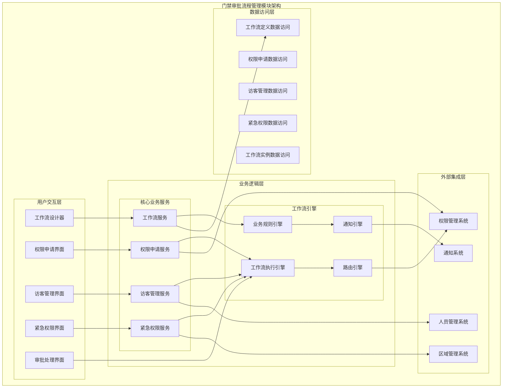
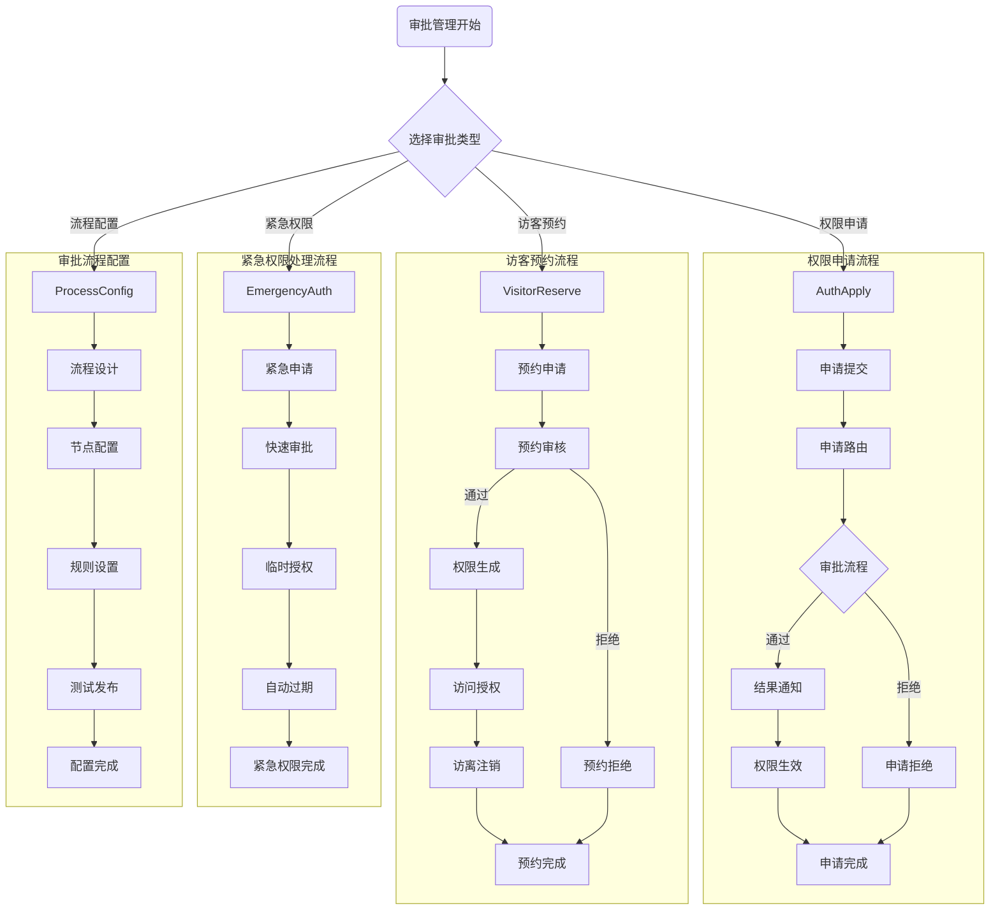

# 门禁审批流程管理模块详细设计

> **版本**: v1.0
> **更新时间**: 2025-11-13
> **分类**: 核心功能模块 > 企业OA系统 > 门禁管理系统
> **标签**: ["门禁系统", "审批流程", "权限申请", "访客管理", "工作流引擎"]
> **作者**: SmartAdmin规范治理委员会
> **描述**: IOE-DREAM智慧园区一卡通管理平台门禁管理系统的审批流程管理、权限申请、访客预约和紧急权限处理模块详细技术设计

## 📋 模块概述

### 核心定位

**门禁审批流程管理模块**是IOE-DREAM智慧园区一卡通管理平台的工作流核心，负责门禁权限申请、访客预约管理、紧急权限处理和审批流程配置。模块采用灵活的工作流引擎，支持标准审批、快速审批、紧急审批和自动审批等多种流程类型，确保权限管理的规范性和安全性。

### 核心特性

- ✅ **灵活工作流引擎**：支持串行、并行、会签、或签等多种审批模式
- ✅ **权限申请管理**：完整的权限申请、路由、审批、生效流程
- ✅ **访客预约系统**：访客预约、审核、授权、注销全流程管理
- ✅ **紧急权限处理**：紧急情况下的快速审批和临时授权机制
- ✅ **流程可视化设计**：拖拽式流程设计和节点配置
- ✅ **智能审批路由**：基于规则的自动审批路由和转交
- ✅ **移动端审批支持**：支持移动设备的审批操作和通知

## 🏗️ 审批流程管理模块架构设计

### 模块功能架构图



### 审批流程管理核心流程设计



## 🔧 核心功能详细设计

### 1. 权限申请服务

#### 1.1 权限申请提交流程

**功能描述**：用户门禁权限申请的提交、路由、审批和生效流程

**技术实现**：
```java
@Service
@Slf4j
public class PermissionApplyService {

    @Resource
    private WorkflowEngine workflowEngine;

    @Resource
    private PermissionRouteEngine routeEngine;

    @Resource
    private NotificationService notificationService;

    /**
     * 提交权限申请
     */
    @Transactional(rollbackFor = Exception.class)
    public ResponseDTO<String> submitPermissionApply(PermissionApplyForm applyForm) {
        try {
            // 1. 验证申请表单
            validateApplyForm(applyForm);

            // 2. 创建申请记录
            PermissionApplyEntity apply = PermissionApplyEntity.builder()
                    .applyId(IdGenerator.generateId())
                    .applicantId(SmartRequestUtil.getRequestUserId())
                    .applyType(applyForm.getApplyType())
                    .applyReason(applyForm.getApplyReason())
                    .permissionScope(applyForm.getPermissionScope())
                    .validFrom(applyForm.getValidFrom())
                    .validTo(applyForm.getValidTo())
                    .emergencyContact(applyForm.getEmergencyContact())
                    .attachmentIds(applyForm.getAttachmentIds())
                    .status(ApplyStatus.PENDING)
                    .createTime(LocalDateTime.now())
                    .build();

            permissionApplyDao.insert(apply);

            // 3. 路由申请到相应审批流程
            WorkflowRouteResult routeResult = routeEngine.routeApplication(apply);

            // 4. 启动工作流实例
            WorkflowInstance workflowInstance = workflowEngine.startWorkflow(
                    routeResult.getProcessDefinitionId(),
                    routeResult.getBusinessKey(),
                    buildWorkflowVariables(apply, routeResult));

            // 5. 关联工作流实例
            apply.setWorkflowInstanceId(workflowInstance.getInstanceId());
            permissionApplyDao.updateById(apply);

            // 6. 发送申请提交通知
            notificationService.sendApplySubmittedNotification(apply, workflowInstance);

            log.info("权限申请提交成功, applyId: {}, workflowInstanceId: {}",
                    apply.getApplyId(), workflowInstance.getInstanceId());

            return ResponseDTO.ok(apply.getApplyId());

        } catch (Exception e) {
            log.error("提交权限申请失败", e);
            return ResponseDTO.error("提交失败");
        }
    }

    /**
     * 处理权限申请审批
     */
    @Transactional(rollbackFor = Exception.class)
    public ResponseDTO<Void> processPermissionApply(PermissionApprovalForm approvalForm) {
        try {
            Long applyId = approvalForm.getApplyId();
            String decision = approvalForm.getDecision();
            String comment = approvalForm.getComment();

            // 1. 验证审批权限
            PermissionApplyEntity apply = permissionApplyDao.selectById(applyId);
            if (apply == null) {
                return ResponseDTO.error("申请不存在");
            }

            validateApprovalPermission(apply, approvalForm.getApproverId());

            // 2. 完成工作流任务
            WorkflowTaskResult taskResult = workflowEngine.completeTask(
                    approvalForm.getTaskId(),
                    buildTaskVariables(decision, comment));

            // 3. 更新申请状态
            if ("APPROVE".equals(decision)) {
                if (taskResult.isProcessCompleted()) {
                    // 审批流程完成，激活权限
                    activatePermission(apply);
                    apply.setStatus(ApplyStatus.APPROVED);
                } else {
                    apply.setStatus(ApplyStatus.IN_APPROVAL);
                }
            } else {
                apply.setStatus(ApplyStatus.REJECTED);
                apply.setRejectReason(comment);
            }

            apply.setUpdateTime(LocalDateTime.now());
            permissionApplyDao.updateById(apply);

            // 4. 发送审批结果通知
            notificationService.sendApprovalResultNotification(apply, taskResult, decision);

            log.info("权限申请审批处理完成, applyId: {}, decision: {}", applyId, decision);

            return ResponseDTO.ok();

        } catch (Exception e) {
            log.error("处理权限申请审批失败", e);
            return ResponseDTO.error("审批失败");
        }
    }

    /**
     * 激活权限
     */
    private void activatePermission(PermissionApplyEntity apply) {
        try {
            // 1. 根据申请范围创建权限
            List<PermissionGrant> grants = buildPermissionGrants(apply);

            // 2. 批量授权
            for (PermissionGrant grant : grants) {
                permissionService.grantPermission(grant);
            }

            // 3. 记录权限激活日志
            PermissionActivationLog activationLog = PermissionActivationLog.builder()
                    .applyId(apply.getApplyId())
                    .grantCount(grants.size())
                    .activationTime(LocalDateTime.now())
                    .validFrom(apply.getValidFrom())
                    .validTo(apply.getValidTo())
                    .build();

            permissionLogService.saveActivationLog(activationLog);

        } catch (Exception e) {
            log.error("激活权限失败, applyId: {}", apply.getApplyId(), e);
            throw new RuntimeException("权限激活失败");
        }
    }

    /**
     * 构建权限授权
     */
    private List<PermissionGrant> buildPermissionGrants(PermissionApplyEntity apply) {
        List<PermissionGrant> grants = new ArrayList<>();

        PermissionScope scope = apply.getPermissionScope();

        // 1. 区域权限
        for (Long areaId : scope.getAreaIds()) {
            PermissionGrant areaGrant = PermissionGrant.builder()
                    .userId(apply.getApplicantId())
                    .resourceType(ResourceType.AREA)
                    .resourceId(areaId)
                    .permissionType(PermissionType.ACCESS)
                    .validFrom(apply.getValidFrom())
                    .validTo(apply.getValidTo())
                    .grantSource(GrantSource.APPLY_APPROVAL)
                    .grantId(apply.getApplyId())
                    .build();
            grants.add(areaGrant);
        }

        // 2. 设备权限
        for (Long deviceId : scope.getDeviceIds()) {
            PermissionGrant deviceGrant = PermissionGrant.builder()
                    .userId(apply.getApplicantId())
                    .resourceType(ResourceType.DEVICE)
                    .resourceId(deviceId)
                    .permissionType(PermissionType.ACCESS)
                    .validFrom(apply.getValidFrom())
                    .validTo(apply.getValidTo())
                    .grantSource(GrantSource.APPLY_APPROVAL)
                    .grantId(apply.getApplyId())
                    .build();
            grants.add(deviceGrant);
        }

        return grants;
    }
}
```

#### 1.2 审批路由引擎

**功能描述**：基于业务规则的智能审批路由和转交

**技术实现**：
```java
@Component
@Slf4j
public class PermissionRouteEngine {

    @Resource
    private RouteRuleEngine ruleEngine;

    @Resource
    private OrganizationService organizationService;

    @Resource
    private RolePermissionService rolePermissionService;

    /**
     * 路由权限申请
     */
    public WorkflowRouteResult routeApplication(PermissionApplyEntity apply) {
        try {
            // 1. 获取路由规则
            List<RouteRule> rules = ruleEngine.getApplicableRules(apply);

            // 2. 执行路由规则
            for (RouteRule rule : rules) {
                if (rule.matches(apply)) {
                    return executeRouteRule(rule, apply);
                }
            }

            // 3. 默认路由规则
            return executeDefaultRoute(apply);

        } catch (Exception e) {
            log.error("路由权限申请失败", e);
            throw new RuntimeException("路由失败");
        }
    }

    /**
     * 执行路由规则
     */
    private WorkflowRouteResult executeRouteRule(RouteRule rule, PermissionApplyEntity apply) {
        try {
            RouteConfiguration config = rule.getConfiguration();

            // 1. 确定审批人
            List<Long> approverIds = determineApprovers(config, apply);

            // 2. 选择工作流定义
            String processDefinitionId = selectProcessDefinition(config);

            // 3. 构建路由结果
            return WorkflowRouteResult.builder()
                    .processDefinitionId(processDefinitionId)
                    .businessKey(generateBusinessKey(apply))
                    .approvers(approverIds)
                    .routeType(config.getRouteType())
                    .priority(config.getPriority())
                    .build();

        } catch (Exception e) {
            log.error("执行路由规则失败", e);
            throw new RuntimeException("路由规则执行失败");
        }
    }

    /**
     * 确定审批人
     */
    private List<Long> determineApprovers(RouteConfiguration config, PermissionApplyEntity apply) {
        List<Long> approvers = new ArrayList<>();

        switch (config.getApproverType()) {
            case ROLE_BASED:
                // 基于角色的审批人
                approvers.addAll(rolePermissionService.getUsersByRole(
                        config.getApproverRole(), apply.getPermissionScope()));
                break;

            case ORG_BASED:
                // 基于组织的审批人
                approvers.addAll(organizationService.getManagerByOrgAndLevel(
                        apply.getApplicantOrgId(), config.getApproverLevel()));
                break;

            case AREA_BASED:
                // 基于区域的审批人
                approvers.addAll(areaPermissionService.getAreaManagers(
                        apply.getPermissionScope().getAreaIds()));
                break;

            case SPECIFIC_USER:
                // 指定审批人
                approvers.addAll(config.getSpecificApprovers());
                break;

            case DYNAMIC_RULE:
                // 动态规则审批人
                approvers.addAll(executeDynamicApproverRule(config.getDynamicRule(), apply));
                break;
        }

        // 去重并验证审批人
        return approvers.stream()
                .distinct()
                .filter(this::validateApprover)
                .collect(Collectors.toList());
    }
}
```

### 2. 访客管理服务

#### 2.1 访客预约管理

**功能描述**：访客预约申请、审核、授权和注销全流程管理

**技术实现**：
```java
@Service
@Slf4j
public class VisitorReservationService {

    @Resource
    private VisitorReservationDao visitorReservationDao;

    @Resource
    private WorkflowEngine workflowEngine;

    @Resource
    private TemporaryPermissionService temporaryPermissionService;

    /**
     * 提交访客预约申请
     */
    @Transactional(rollbackFor = Exception.class)
    public ResponseDTO<String> submitVisitorReservation(VisitorReservationForm reservationForm) {
        try {
            // 1. 验证预约表单
            validateReservationForm(reservationForm);

            // 2. 创建访客预约记录
            VisitorReservationEntity reservation = VisitorReservationEntity.builder()
                    .reservationId(IdGenerator.generateId())
                    .visitorName(reservationForm.getVisitorName())
                    .visitorPhone(reservationForm.getVisitorPhone())
                    .visitorIdCard(reservationForm.getVisitorIdCard())
                    .visitorCompany(reservationForm.getVisitorCompany())
                    .visitPurpose(reservationForm.getVisitPurpose())
                    .hostUserId(reservationForm.getHostUserId())
                    .visitDate(reservationForm.getVisitDate())
                    .visitStartTime(reservationForm.getVisitStartTime())
                    .visitEndTime(reservationForm.getVisitEndTime())
                    .accessAreaIds(reservationForm.getAccessAreaIds())
                    .status(ReservationStatus.PENDING)
                    .createTime(LocalDateTime.now())
                    .build();

            visitorReservationDao.insert(reservation);

            // 3. 启动预约审核工作流
            WorkflowInstance workflowInstance = workflowEngine.startWorkflow(
                    "visitor_reservation_process",
                    reservation.getReservationId(),
                    buildReservationVariables(reservation));

            // 4. 关联工作流实例
            reservation.setWorkflowInstanceId(workflowInstance.getInstanceId());
            visitorReservationDao.updateById(reservation);

            // 5. 发送预约申请通知
            notificationService.sendReservationSubmittedNotification(reservation);

            log.info("访客预约申请提交成功, reservationId: {}", reservation.getReservationId());

            return ResponseDTO.ok(reservation.getReservationId());

        } catch (Exception e) {
            log.error("提交访客预约申请失败", e);
            return ResponseDTO.error("提交失败");
        }
    }

    /**
     * 审核访客预约
     */
    @Transactional(rollbackFor = Exception.class)
    public ResponseDTO<Void> approveVisitorReservation(VisitorApprovalForm approvalForm) {
        try {
            Long reservationId = approvalForm.getReservationId();
            String decision = approvalForm.getDecision();

            // 1. 获取预约记录
            VisitorReservationEntity reservation = visitorReservationDao.selectById(reservationId);
            if (reservation == null) {
                return ResponseDTO.error("预约不存在");
            }

            // 2. 完成工作流任务
            WorkflowTaskResult taskResult = workflowEngine.completeTask(
                    approvalForm.getTaskId(),
                    buildApprovalVariables(decision, approvalForm.getComment()));

            // 3. 更新预约状态
            if ("APPROVE".equals(decision)) {
                reservation.setStatus(ReservationStatus.APPROVED);
                reservation.setApproverId(approvalForm.getApproverId());
                reservation.setApproveTime(LocalDateTime.now());

                // 4. 生成临时访问权限
                generateTemporaryPermissions(reservation);

                // 5. 生成访客凭证
                generateVisitorCredentials(reservation);

            } else {
                reservation.setStatus(ReservationStatus.REJECTED);
                reservation.setRejectReason(approvalForm.getComment());
            }

            visitorReservationDao.updateById(reservation);

            // 6. 发送审核结果通知
            notificationService.sendReservationApprovalNotification(reservation, decision);

            log.info("访客预约审核完成, reservationId: {}, decision: {}", reservationId, decision);

            return ResponseDTO.ok();

        } catch (Exception e) {
            log.error("审核访客预约失败", e);
            return ResponseDTO.error("审核失败");
        }
    }

    /**
     * 生成临时访问权限
     */
    private void generateTemporaryPermissions(VisitorReservationEntity reservation) {
        try {
            // 1. 创建访客临时用户
            TemporaryUser tempUser = TemporaryUser.builder()
                    .username("VISITOR_" + reservation.getReservationId())
                    .password(generateTemporaryPassword())
                    .userType(UserType.VISITOR)
                    .realName(reservation.getVisitorName())
                    .phone(reservation.getVisitorPhone())
                    .idCard(reservation.getVisitorIdCard())
                    .validFrom(reservation.getVisitStartTime())
                    .validTo(reservation.getVisitEndTime())
                    .build();

            Long tempUserId = temporaryUserService.createTempUser(tempUser);

            // 2. 授予区域访问权限
            for (Long areaId : reservation.getAccessAreaIds()) {
                TemporaryPermission permission = TemporaryPermission.builder()
                        .userId(tempUserId)
                        .resourceType(ResourceType.AREA)
                        .resourceId(areaId)
                        .permissionType(PermissionType.VISITOR_ACCESS)
                        .validFrom(reservation.getVisitStartTime())
                        .validTo(reservation.getVisitEndTime())
                        .sourceId(reservation.getReservationId())
                        .sourceType(SourceType.VISITOR_RESERVATION)
                        .build();

                temporaryPermissionService.grantPermission(permission);
            }

            // 3. 更新预约记录
            reservation.setTempUserId(tempUserId);
            visitorReservationDao.updateById(reservation);

            log.info("临时权限生成成功, reservationId: {}, tempUserId: {}",
                    reservation.getReservationId(), tempUserId);

        } catch (Exception e) {
            log.error("生成临时访问权限失败", e);
            throw new RuntimeException("临时权限生成失败");
        }
    }

    /**
     * 访客签到/签离
     */
    @Transactional(rollbackFor = Exception.class)
    public ResponseDTO<Void> visitorCheckInOut(VisitorCheckInOutForm checkForm) {
        try {
            String reservationId = checkForm.getReservationId();
            CheckType checkType = checkForm.getCheckType();

            // 1. 获取预约记录
            VisitorReservationEntity reservation = visitorReservationDao.selectById(reservationId);
            if (reservation == null) {
                return ResponseDTO.error("预约不存在");
            }

            // 2. 验证签到状态
            validateCheckInOutStatus(reservation, checkType);

            // 3. 创建签到记录
            VisitorCheckRecord checkRecord = VisitorCheckRecord.builder()
                    .reservationId(reservationId)
                    .checkType(checkType)
                    .checkTime(LocalDateTime.now())
                    .checkLocation(checkForm.getCheckLocation())
                    .checkDeviceId(checkForm.getCheckDeviceId())
                    .build();

            visitorCheckRecordDao.insert(checkRecord);

            // 4. 更新预约状态
            if (checkType == CheckType.CHECK_IN) {
                reservation.setStatus(ReservationStatus.VISITING);
                reservation.setActualCheckInTime(LocalDateTime.now());
            } else {
                reservation.setStatus(ReservationStatus.COMPLETED);
                reservation.setActualCheckOutTime(LocalDateTime.now());

                // 5. 注销临时权限
                revokeTemporaryPermissions(reservation.getTempUserId());
            }

            visitorReservationDao.updateById(reservation);

            // 6. 发送签到/签离通知
            notificationService.sendVisitorCheckInOutNotification(reservation, checkType);

            log.info("访客{}完成, reservationId: {}", checkType.getDescription(), reservationId);

            return ResponseDTO.ok();

        } catch (Exception e) {
            log.error("访客签到/签离失败", e);
            return ResponseDTO.error("操作失败");
        }
    }

    /**
     * 注销临时权限
     */
    private void revokeTemporaryPermissions(Long tempUserId) {
        try {
            // 1. 撤销所有临时权限
            temporaryPermissionService.revokeAllPermissions(tempUserId);

            // 2. 禁用临时用户
            temporaryUserService.disableTempUser(tempUserId);

            log.info("临时权限注销成功, tempUserId: {}", tempUserId);

        } catch (Exception e) {
            log.error("注销临时权限失败", e);
            throw new RuntimeException("权限注销失败");
        }
    }
}
```

### 3. 紧急权限服务

#### 3.1 紧急权限处理

**功能描述**：紧急情况下的快速审批和临时授权机制

**技术实现**：
```java
@Service
@Slf4j
public class EmergencyPermissionService {

    @Resource
    private EmergencyPermissionDao emergencyPermissionDao;

    @Resource
    private TemporaryPermissionService temporaryPermissionService;

    @Resource
    private EmergencyNotificationService emergencyNotificationService;

    /**
     * 申请紧急权限
     */
    @Transactional(rollbackFor = Exception.class)
    public ResponseDTO<String> applyEmergencyPermission(EmergencyPermissionApplyForm applyForm) {
        try {
            // 1. 验证紧急权限申请
            validateEmergencyApply(applyForm);

            // 2. 创建紧急权限记录
            EmergencyPermissionEntity emergencyPermission = EmergencyPermissionEntity.builder()
                    .permissionId(IdGenerator.generateId())
                    .applicantId(SmartRequestUtil.getRequestUserId())
                    .emergencyType(applyForm.getEmergencyType())
                    .emergencyLevel(applyForm.getEmergencyLevel())
                    .emergencyReason(applyForm.getEmergencyReason())
                    .permissionScope(applyForm.getPermissionScope())
                    .requestedDuration(applyForm.getRequestedDuration())
                    .contactPerson(applyForm.getContactPerson())
                    .contactPhone(applyForm.getContactPhone())
                    .status(EmergencyStatus.PENDING)
                    .createTime(LocalDateTime.now())
                    .build();

            emergencyPermissionDao.insert(emergencyPermission);

            // 3. 立即发送紧急通知
            emergencyNotificationService.sendEmergencyNotification(emergencyPermission);

            // 4. 启动快速审批流程
            if (applyForm.getEmergencyLevel() == EmergencyLevel.CRITICAL) {
                // 关键级别立即授权
                grantEmergencyPermission(emergencyPermission);
            } else {
                // 启动快速审批工作流
                startEmergencyApprovalWorkflow(emergencyPermission);
            }

            log.info("紧急权限申请提交成功, permissionId: {}", emergencyPermission.getPermissionId());

            return ResponseDTO.ok(emergencyPermission.getPermissionId());

        } catch (Exception e) {
            log.error("申请紧急权限失败", e);
            return ResponseDTO.error("申请失败");
        }
    }

    /**
     * 快速审批紧急权限
     */
    @Transactional(rollbackFor = Exception.class)
    public ResponseDTO<Void> quickApproveEmergencyPermission(EmergencyApprovalForm approvalForm) {
        try {
            Long permissionId = approvalForm.getPermissionId();

            // 1. 获取紧急权限记录
            EmergencyPermissionEntity emergencyPermission = emergencyPermissionDao.selectById(permissionId);
            if (emergencyPermission == null) {
                return ResponseDTO.error("紧急权限不存在");
            }

            // 2. 验证审批权限
            validateEmergencyApprovalPermission(emergencyPermission, approvalForm.getApproverId());

            // 3. 更新审批状态
            emergencyPermission.setStatus(EmergencyStatus.APPROVED);
            emergencyPermission.setApproverId(approvalForm.getApproverId());
            emergencyPermission.setApproveTime(LocalDateTime.now());
            emergencyPermission.setApprovalComment(approvalForm.getComment());

            emergencyPermissionDao.updateById(emergencyPermission);

            // 4. 立即授予权限
            grantEmergencyPermission(emergencyPermission);

            // 5. 发送审批结果通知
            emergencyNotificationService.sendEmergencyApprovalNotification(emergencyPermission);

            log.info("紧急权限快速审批完成, permissionId: {}", permissionId);

            return ResponseDTO.ok();

        } catch (Exception e) {
            log.error("快速审批紧急权限失败", e);
            return ResponseDTO.error("审批失败");
        }
    }

    /**
     * 授予紧急权限
     */
    private void grantEmergencyPermission(EmergencyPermissionEntity emergencyPermission) {
        try {
            // 1. 计算权限有效期
            LocalDateTime validFrom = LocalDateTime.now();
            LocalDateTime validTo = validFrom.plusMinutes(emergencyPermission.getRequestedDuration());

            // 2. 创建临时权限授权
            List<TemporaryPermission> permissions = new ArrayList<>();

            for (Long resourceId : emergencyPermission.getPermissionScope().getResourceIds()) {
                TemporaryPermission permission = TemporaryPermission.builder()
                        .userId(emergencyPermission.getApplicantId())
                        .resourceType(emergencyPermission.getPermissionScope().getResourceType())
                        .resourceId(resourceId)
                        .permissionType(PermissionType.EMERGENCY_ACCESS)
                        .validFrom(validFrom)
                        .validTo(validTo)
                        .sourceId(emergencyPermission.getPermissionId())
                        .sourceType(SourceType.EMERGENCY_PERMISSION)
                        .priority(PermissionPriority.HIGH)
                        .build();
                permissions.add(permission);
            }

            // 3. 批量授权
            temporaryPermissionService.batchGrantPermissions(permissions);

            // 4. 设置自动过期任务
            schedulePermissionExpiration(emergencyPermission.getPermissionId(), validTo);

            // 5. 更新紧急权限状态
            emergencyPermission.setStatus(EmergencyStatus.ACTIVE);
            emergencyPermission.setGrantTime(validFrom);
            emergencyPermission.setExpireTime(validTo);
            emergencyPermissionDao.updateById(emergencyPermission);

            log.info("紧急权限授予成功, permissionId: {}, permissions: {}",
                    emergencyPermission.getPermissionId(), permissions.size());

        } catch (Exception e) {
            log.error("授予紧急权限失败", e);
            throw new RuntimeException("紧急权限授予失败");
        }
    }

    /**
     * 设置权限过期任务
     */
    private void schedulePermissionExpiration(String permissionId, LocalDateTime expireTime) {
        try {
            // 计算延迟时间
            long delay = Duration.between(LocalDateTime.now(), expireTime).toMillis();

            // 调度定时任务
            TaskScheduler scheduler = getTaskScheduler();
            scheduler.schedule(() -> {
                try {
                    expireEmergencyPermission(permissionId);
                } catch (Exception e) {
                    log.error("紧急权限过期处理失败, permissionId: {}", permissionId, e);
                }
            }, new Date(System.currentTimeMillis() + delay));

        } catch (Exception e) {
            log.error("设置权限过期任务失败", e);
        }
    }

    /**
     * 过期紧急权限
     */
    @Transactional(rollbackFor = Exception.class)
    public void expireEmergencyPermission(String permissionId) {
        try {
            // 1. 获取紧急权限记录
            EmergencyPermissionEntity emergencyPermission = emergencyPermissionDao.selectById(permissionId);
            if (emergencyPermission == null) {
                return;
            }

            // 2. 撤销相关权限
            temporaryPermissionService.revokePermissionsBySource(
                    permissionId, SourceType.EMERGENCY_PERMISSION);

            // 3. 更新状态
            emergencyPermission.setStatus(EmergencyStatus.EXPIRED);
            emergencyPermission.setExpireTime(LocalDateTime.now());
            emergencyPermissionDao.updateById(emergencyPermission);

            // 4. 发送过期通知
            emergencyNotificationService.sendEmergencyExpirationNotification(emergencyPermission);

            log.info("紧急权限已过期, permissionId: {}", permissionId);

        } catch (Exception e) {
            log.error("过期紧急权限失败", e);
        }
    }
}
```

### 4. 工作流服务

#### 4.1 工作流配置管理

**功能描述**：审批流程的设计、配置、测试和发布

**技术实现**：
```java
@Service
@Slf4j
public class WorkflowConfigurationService {

    @Resource
    private WorkflowDefinitionDao workflowDefinitionDao;

    @Resource
    private WorkflowEngine workflowEngine;

    @Resource
    private WorkflowTestService workflowTestService;

    /**
     * 设计新的审批流程
     */
    @Transactional(rollbackFor = Exception.class)
    public ResponseDTO<String> designWorkflow(WorkflowDesignForm designForm) {
        try {
            // 1. 验证流程设计
            validateWorkflowDesign(designForm);

            // 2. 创建工作流定义
            WorkflowDefinitionEntity definition = WorkflowDefinitionEntity.builder()
                    .definitionId(IdGenerator.generateId())
                    .processKey(designForm.getProcessKey())
                    .processName(designForm.getProcessName())
                    .processVersion(1)
                    .processDescription(designForm.getProcessDescription())
                    .processType(designForm.getProcessType())
                    .category(designForm.getCategory())
                    .bpmnXml(generateBpmnXml(designForm))
                    .status(WorkflowStatus.DRAFT)
                    .createUserId(SmartRequestUtil.getRequestUserId())
                    .createTime(LocalDateTime.now())
                    .build();

            workflowDefinitionDao.insert(definition);

            // 3. 保存节点配置
            saveWorkflowNodes(definition.getDefinitionId(), designForm.getNodes());

            // 4. 保存流转规则
            saveWorkflowTransitions(definition.getDefinitionId(), designForm.getTransitions());

            // 5. 保存流程变量
            saveWorkflowVariables(definition.getDefinitionId(), designForm.getVariables());

            log.info("工作流设计完成, definitionId: {}", definition.getDefinitionId());

            return ResponseDTO.ok(definition.getDefinitionId());

        } catch (Exception e) {
            log.error("设计工作流失败", e);
            return ResponseDTO.error("设计失败");
        }
    }

    /**
     * 发布工作流
     */
    @Transactional(rollbackFor = Exception.class)
    public ResponseDTO<Void> publishWorkflow(String definitionId) {
        try {
            // 1. 获取工作流定义
            WorkflowDefinitionEntity definition = workflowDefinitionDao.selectById(definitionId);
            if (definition == null) {
                return ResponseDTO.error("工作流定义不存在");
            }

            // 2. 验证工作流配置
            validateWorkflowConfiguration(definition);

            // 3. 运行流程测试
            WorkflowTestResult testResult = workflowTestService.runWorkflowTest(definition);
            if (!testResult.isSuccess()) {
                return ResponseDTO.error("流程测试失败: " + testResult.getErrorMessage());
            }

            // 4. 部署工作流到引擎
            ProcessDefinition processDefinition = workflowEngine.deployProcessDefinition(
                    definition.getProcessKey(),
                    definition.getBpmnXml());

            // 5. 更新定义状态
            definition.setStatus(WorkflowStatus.PUBLISHED);
            definition.setDeploymentId(processDefinition.getId());
            definition.setPublishTime(LocalDateTime.now());
            workflowDefinitionDao.updateById(definition);

            // 6. 激活流程定义
            workflowEngine.activateProcessDefinition(processDefinition.getId());

            log.info("工作流发布成功, definitionId: {}", definitionId);

            return ResponseDTO.ok();

        } catch (Exception e) {
            log.error("发布工作流失败", e);
            return ResponseDTO.error("发布失败");
        }
    }

    /**
     * 生成BPMN XML
     */
    private String generateBpmnXml(WorkflowDesignForm designForm) {
        try {
            // 1. 创建BPMN构建器
            BpmnModel bpmnModel = new BpmnModel();
            Process process = new Process();
            process.setId(designForm.getProcessKey());
            process.setName(designForm.getProcessName());

            // 2. 添加开始节点
            StartEvent startEvent = new StartEvent();
            startEvent.setId("start");
            process.addFlowElement(startEvent);

            // 3. 添加用户任务节点
            for (WorkflowNode node : designForm.getNodes()) {
                if ("userTask".equals(node.getType())) {
                    UserTask userTask = new UserTask();
                    userTask.setId(node.getId());
                    userTask.setName(node.getName());

                    // 设置候选用户/组
                    if (CollectionUtils.isNotEmpty(node.getCandidateUsers())) {
                        userTask.setCandidateUsers(node.getCandidateUsers());
                    }
                    if (CollectionUtils.isNotEmpty(node.getCandidateGroups())) {
                        userTask.setCandidateGroups(node.getCandidateGroups());
                    }

                    process.addFlowElement(userTask);
                }
            }

            // 4. 添加结束节点
            EndEvent endEvent = new EndEvent();
            endEvent.setId("end");
            process.addFlowElement(endEvent);

            // 5. 添加序列流
            for (WorkflowTransition transition : designForm.getTransitions()) {
                SequenceFlow sequenceFlow = new SequenceFlow();
                sequenceFlow.setId(transition.getId());
                sequenceFlow.setSourceRef(transition.getSourceRef());
                sequenceFlow.setTargetRef(transition.getTargetRef());

                // 添加条件表达式
                if (StringUtils.isNotBlank(transition.getConditionExpression())) {
                    sequenceFlow.setConditionExpression(transition.getConditionExpression());
                }

                process.addFlowElement(sequenceFlow);
            }

            bpmnModel.addProcess(process);

            // 6. 转换为XML
            BpmnXMLConverter converter = new BpmnXMLConverter();
            return converter.convertToXML(bpmnModel);

        } catch (Exception e) {
            log.error("生成BPMN XML失败", e);
            throw new RuntimeException("BPMN生成失败");
        }
    }
}
```

## 📊 关键性能指标

### 审批流程性能要求

| 指标类型 | 性能要求 | 监控方法 |
|---------|---------|---------|
| 权限申请提交响应时间 | ≤ 2秒 | 申请提交耗时监控 |
| 审批流程处理时间 | ≤ 24小时 | 流程处理时效统计 |
| 紧急审批处理时间 | ≤ 30分钟 | 紧急审批响应监控 |
| 权限生效延迟 | ≤ 1分钟 | 权限生效时效检查 |
| 审批通知发送延迟 | ≤ 30秒 | 通知发送时效监控 |
| 访客签到处理时间 | ≤ 3秒 | 签到操作响应时间 |

### 系统容量指标

| 指标类型 | 设计容量 | 说明 |
|---------|---------|------|
| 日均权限申请量 | 10,000条/天 | 权限申请日常处理能力 |
| 并发审批用户数 | 500用户 | 同时进行审批操作用户数 |
| 访客预约处理量 | 5,000次/天 | 访客预约日常处理量 |
| 紧急权限处理量 | 100次/小时 | 紧急权限每小时处理能力 |
| 工作流实例数 | 50,000个 | 活跃工作流实例数量 |
| 审批历史保留期 | 5年 | 审批历史数据在线保留期 |

## 🔗 相关文档

### 技术实现文档
- [门禁管理系统整体架构设计](./系统整体架构设计.md) - 完整的系统架构设计
- [权限管理模块详细设计](./权限管理模块详细设计.md) - 权限管理技术实现
- [区域空间管理模块详细设计](./区域空间管理模块详细设计.md) - 区域权限管理设计

### 工作流文档
- [工作流引擎设计](./工作流引擎设计.md) - 工作流引擎技术架构
- [审批规则引擎设计](./审批规则引擎设计.md) - 审批规则和路由引擎
- [BPMN流程设计指南](./BPMN流程设计指南.md) - BPMN流程设计规范

### 集成部署文档
- [通知系统集成方案](./通知系统集成方案.md) - 多渠道通知集成方案
- [移动端审批方案](./移动端审批方案.md) - 移动端审批功能实现
- [系统集成API文档](./系统集成API文档.md) - 外部系统集成接口

---

## 🎯 核心原则总结

1. **流程规范化** - 标准化的审批流程确保权限管理的规范性
2. **灵活路由机制** - 基于规则的智能审批路由和转交
3. **紧急响应机制** - 紧急情况下的快速审批和临时授权
4. **访客全生命周期管理** - 完整的访客预约、审核、授权、注销流程
5. **可视化流程设计** - 拖拽式流程设计降低配置复杂度

## 📋 版本信息

- 本文档基于工作流管理最佳实践设计
- 审批流程管理模块设计负责人：SmartAdmin规范治理委员会
- 创建日期：2025-11-13
- 下次评审：2026-02-13

---

**🎯 IOE-DREAM门禁审批流程管理模块 - 规范审批、智能路由、紧急响应、全流程管理的企业级工作流解决方案**