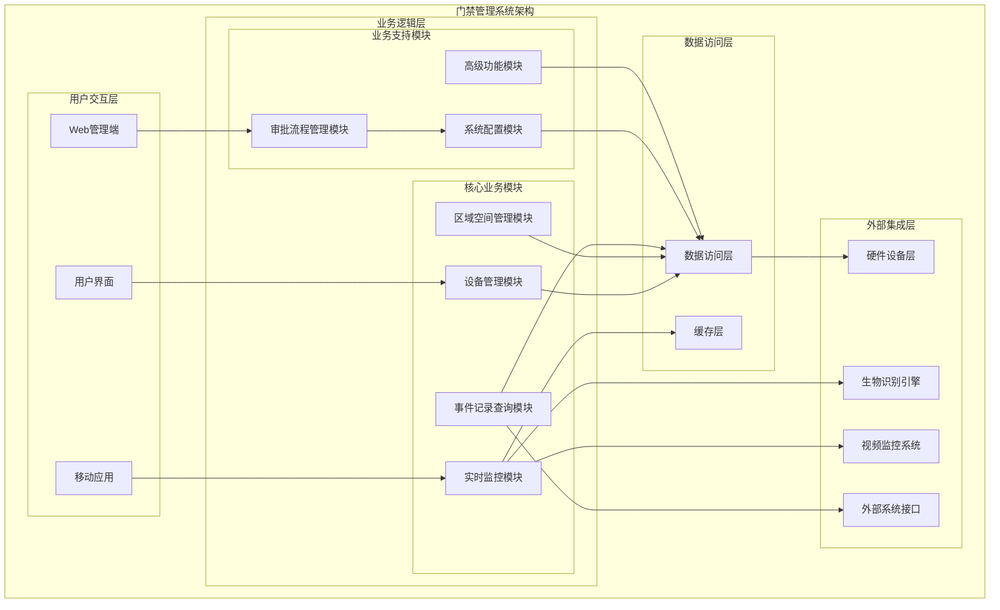
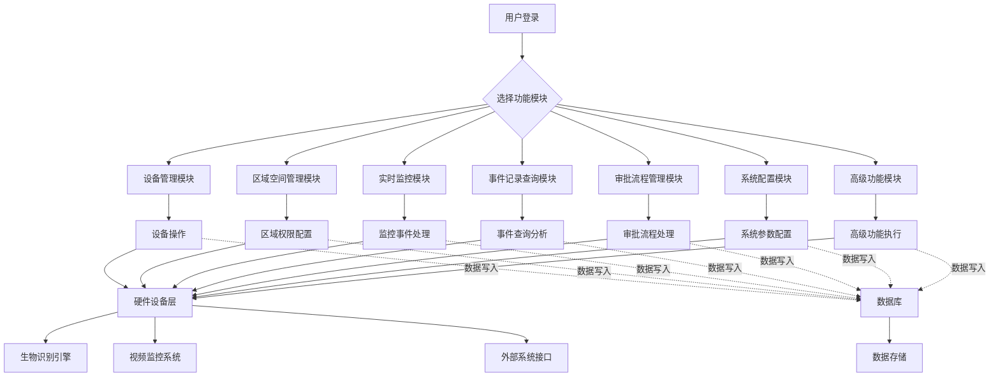

# 门禁管理系统整体架构设计

> **版本**: v1.0
> **更新时间**: 2025-11-13
> **分类**: 核心功能模块 > 企业OA系统 > 门禁管理系统
> **标签**: ["门禁系统", "ZKBioSecurity", "系统架构", "模块设计", "权限管理"]
> **作者**: SmartAdmin规范治理委员会
> **描述**: IOE-DREAM智慧园区一卡通管理平台门禁管理系统的整体架构设计

## 📋 系统概述

### 核心定位

**门禁管理系统**是IOE-DREAM智慧园区一卡通管理平台的重要组成部分，基于ZKBioSecurity-ACC技术架构，提供企业级的门禁控制和安全访问管理。系统采用模块化设计，支持多种认证方式，实现全方位的园区安全管控。

### 核心特性

- ✅ **多级权限控制**：支持人员、区域、时间、多级权限管理
- ✅ **实时监控**：7×24小时实时监控，异常事件即时告警
- ✅ **生物识别集成**：支持人脸、指纹、虹膜、掌纹等多种生物识别
- ✅ **视频联动**：门禁事件与视频监控无缝联动
- ✅ **访客管理**：完整的访客预约、审批、访问流程
- ✅ **智能分析**：人员轨迹分析、异常行为检测
- ✅ **应急处理**：紧急权限、全局联动、快速响应

## 🏗️ 系统核心模块架构

### 架构层次图



### 核心模块详细设计

#### 1. 设备管理模块

**功能职责**：
- 门禁设备全生命周期管理
- 读头设备配置和状态监控
- I/O扩展板管理
- 设备固件升级和维护

**核心功能**：
```markdown
🔧 设备管理
- 设备注册、配置、状态监控
- 设备分组和批量操作
- 设备健康度检测

🚪 门管理
- 门状态实时监控
- 门禁模式配置（常开/常闭/自动）
- 远程门控制

📟 读头管理
- 读头类型管理（IC卡/指纹/人脸/虹膜）
- 读头参数配置
- 读头状态监控和故障诊断

🔌 I/O扩展板管理
- 扩展板类型和配置
- 输入输出端口管理
- 扩展功能定义
```

#### 2. 区域空间管理模块

**功能职责**：
- 园区空间层级管理
- 人员权限分配
- 设备资源分配
- 空间占用监控

**核心功能**：
```markdown
🏢 区域创建
- 多级区域架构（园区→楼栋→楼层→房间）
- 区域类型定义（办公区/生产区/危险区）
- 区域属性配置

👥 人员权限分配
- 基于角色的权限分配
- 时间段权限控制
- 临时权限申请和管理

🔧 设备分配
- 设备与区域关联
- 设备资源占用监控
- 设备使用统计分析

📊 占用监控
- 实时区域占用情况
- 设备利用率统计
- 空间使用分析
```

#### 3. 实时监控模块

**功能职责**：
- 实时状态监控
- 异常事件处理
- 视频联动控制
- 人员轨迹追踪

**核心功能**：
```markdown
📹 实时状态监控
- 设备在线状态监控
- 门状态实时显示
- 网络连接状态检查
- 系统性能监控

🚨 报警处理
- 实时告警推送
- 告警级别分类
- 告警处理流程
- 告警统计分析

📹 视频联动
- 门禁事件视频联动
- 实时画面弹出
- 录像片段自动保存
- 视频回放管理

👤 人员追踪
- 实时人员位置追踪
- 访问轨迹记录
- 异常行为检测
- 人员热力图分析
```

#### 4. 事件记录查询模块

**功能职责**：
- 门禁事件查询和分析
- 异常事件处理
- 统计报表生成
- 数据归档管理

**核心功能**：
```markdown
📋 事件查询
- 多维度事件查询
- 事件详情查看
- 事件统计分析
- 事件导出功能

⚠️ 异常事件处理
- 异常事件分类
- 处理流程跟踪
- 处理结果记录
- 异常趋势分析

📊 统计报表生成
- 门禁使用统计
- 人员访问统计
- 设备运行统计
- 异常事件统计
- 时段访问分析

📁 数据归档管理
- 历史数据归档
- 数据备份策略
- 数据恢复功能
- 数据清理规则
```

#### 5. 审批流程管理模块

**功能职责**：
- 权限申请和审批
- 访客预约管理
- 紧急权限处理
- 审批流程配置

**核心功能**：
```markdown
📝 权限申请
- 临时权限申请
- 跨区域权限申请
- 时间段权限申请
- 申请流程跟踪

👥 访客预约
- 访客信息登记
- 预约时间安排
- 访客权限发放
- 访客轨迹监控

🚨 紧急权限处理
- 紧急情况定义
- 快速权限授予
- 紧急权限撤销
- 紧急事件记录

⚙️ 审批流程配置
- 审批流程定义
- 审批节点配置
- 审批条件设置
- 流程统计分析
```

#### 6. 系统配置模块

**功能职责**：
- 系统参数配置
- 用户权限管理
- 许可证管理
- 备份恢复

**核心功能**：
```markdown
⚙️ 系统参数配置
- 系统基本参数
- 安全策略配置
- 性能参数调优
- 集成接口配置

👤 用户权限管理
- 用户账户管理
- 角色权限分配
- 操作权限控制
- 审计日志记录

🔐 许可证管理
- 软件许可证配置
- 功能模块授权
- 设备数量限制
- 许可证状态监控

💾 备份恢复
- 数据备份策略
- 系统恢复功能
- 灾难恢复计划
- 备份数据验证
```

#### 7. 高级功能模块

**功能职责**：
- 全局反潜功能
- 全局联动控制
- 全局互锁管理
- 疏散点管理
- 人数控制和限制

**核心功能**：
```markdown
🔍 全局反潜
- 反潜规则配置
- 黑名单管理
- 反潜策略执行
- 反潜事件记录

🔗 全局联动
- 联动事件定义
- 联动设备配置
- 联动条件设置
- 联动状态监控

🔒 全局互锁
- 互锁区域定义
- 互锁规则配置
- 互锁状态管理
- 互锁异常处理

📍 疏散点管理
- 疏散路径定义
- 疏散时间配置
- 疏散执行监控
- 疏散效果验证

👥 人数控制
- 区域人数限制
- 人员超限处理
- 实时人数统计
- 人员密度分析
```

## 🔄 模块间交互关系

### 数据流设计



### 模块依赖关系

| 模块 | 依赖模块 | 数据流向 | 说明 |
|------|----------|---------|------|
| 设备管理 | 系统配置 | ← | 获取系统配置参数 |
| 区域空间 | 设备管理 | ← | 获取设备信息用于权限配置 |
| 实时监控 | 设备管理、区域空间 | ← | 获取设备状态和区域权限 |
| 实时监控 | 生物识别、视频系统 | ← | 集成生物识别和视频数据 |
| 事件记录 | 实时监控、设备管理 | ← | 接收监控事件和设备状态 |
| 审批流程 | 区域空间、系统配置 | ← | 权限验证和流程控制 |
| 高级功能 | 所有模块 | ← | 全局功能控制其他模块 |

## 🔧 技术实现要点

### 1. 实时通信架构

```java
@Component
@Slf4j
public class RealtimeEventHandler {

    @Resource
    private SimpMessagingTemplate messagingTemplate;

    @Resource
    private DeviceStatusService deviceStatusService;

    /**
     * 处理设备状态变更事件
     */
    @EventListener
    public void handleDeviceStatusChangedEvent(DeviceStatusChangedEvent event) {
        try {
            // 1. 更新设备状态缓存
            deviceStatusService.updateDeviceStatus(event);

            // 2. 推送实时状态到前端
            DeviceStatusVO statusVO = DeviceStatusVO.builder()
                    .deviceId(event.getDeviceId())
                    .deviceName(event.getDeviceName())
                    .status(event.getStatus())
                    .timestamp(event.getTimestamp())
                    .build();

            messagingTemplate.convertAndSend(
                "/topic/device/status",
                statusVO
            );

            // 3. 触发相关业务逻辑
            if (event.getStatus() == DeviceStatus.OFFLINE) {
                this.handleDeviceOffline(event);
            }

            log.info("设备状态变更事件处理完成, deviceId: {}", event.getDeviceId());

        } catch (Exception e) {
            log.error("设备状态变更事件处理失败", e);
        }
    }
}
```

### 2. 权限验证服务

```java
@Service
@Slf4j
public class AccessControlService {

    @Resource
    private AreaPermissionService areaPermissionService;
    @Resource
    private DeviceService deviceService;

    /**
     * 验证访问权限
     */
    public AccessControlResult validateAccess(Long employeeId, Long deviceId, LocalDateTime accessTime) {
        try {
            // 1. 获取设备信息
            DeviceInfo device = deviceService.getDeviceInfo(deviceId);
            if (device == null || !device.isEnabled()) {
                return AccessControlResult.denied("设备不存在或已禁用");
            }

            // 2. 获取设备所在区域
            List<Long> areaIds = deviceService.getDeviceAreaIds(deviceId);

            // 3. 验证人员区域权限
            for (Long areaId : areaIds) {
                AreaPermission permission = areaPermissionService
                        .getEmployeeAreaPermission(employeeId, areaId, accessTime);

                if (permission.isAllowed()) {
                    return AccessControlResult.granted(areaId, permission);
                }
            }

            return AccessControlResult.denied("无访问权限");

        } catch (Exception e) {
            log.error("权限验证失败", e);
            return AccessControlResult.error("系统异常");
        }
    }
}
```

### 3. 事件处理服务

```java
@Service
@Transactional
@Slf4j
public class EventProcessingService {

    @Resource
    private AccessEventDao accessEventDao;
    @Resource
    private WarningService warningService;
    @Resource
    private VideoLinkageService videoLinkageService;

    /**
     * 处理门禁事件
     */
    public void processAccessEvent(AccessEvent event) {
        try {
            // 1. 保存访问事件
            accessEventDao.insert(event);

            // 2. 检查异常情况
            if (this.isAbnormalEvent(event)) {
                // 生成预警
                WarningRecord warning = warningService.createWarning(event);

                // 发送通知
                this.sendWarningNotification(warning);
            }

            // 3. 视频联动处理
            if (videoLinkageService.isVideoLinkageEnabled(event.getDeviceId())) {
                videoLinkageService.triggerVideoLinkage(event);
            }

            // 4. 更新实时统计
            this.updateRealTimeStatistics(event);

        } catch (Exception e) {
            log.error("门禁事件处理失败", e);
        }
    }
}
```

## 🔗 相关文档

### 技术架构文档
- [门禁系统数据库设计](./数据库设计.md) - 完整的数据库表结构设计
- [生物识别集成方案](./生物识别集成方案.md) - 生物识别集成详细设计
- [视频联动方案](./视频联动方案.md) - 视频联动实现方案

### 业务流程文档
- [门禁集成方案](../集成方案/门禁集成方案.md) - 门禁系统集成设计
- [访客管理流程设计](./访客管理流程设计.md) - 访客管理业务流程
- [异常处理流程设计](./异常处理流程设计.md) - 异常事件处理流程

### API接口文档
- [门禁管理API接口文档](./门禁管理API接口文档.md) - 门禁管理API详细设计
- [实时监控API接口文档](./实时监控API接口文档.md) - 实时监控API设计

---

## 🎯 核心原则总结

1. **模块化设计** - 七大核心模块相互独立又紧密协作
2. **数据驱动** - 基于事件的响应式架构设计
3. **安全优先** - 多层安全防护，权限控制精细化
4. **实时性** - 实时监控和快速响应机制
5. **可扩展性** - 模块化架构支持功能扩展

## 📋 版本信息

- 本文档基于ZKBioSecurity-ACC门禁系统架构设计
- 架构设计负责人：SmartAdmin规范治理委员会
- 创建日期：2025-11-13
- 下次评审：2026-02-13

---

**🎯 IOE-DREAM门禁管理系统整体架构设计 - 模块化、安全、可扩展的企业级门禁解决方案**