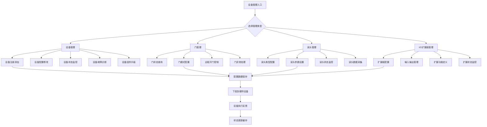
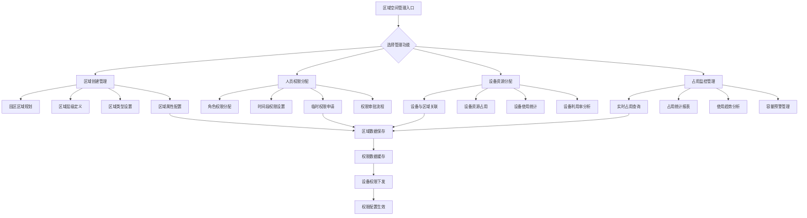
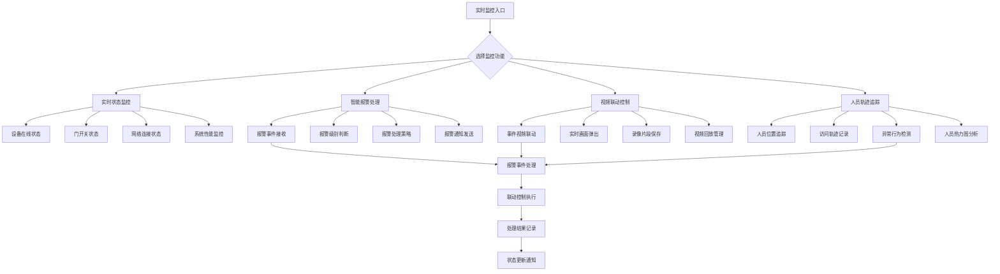
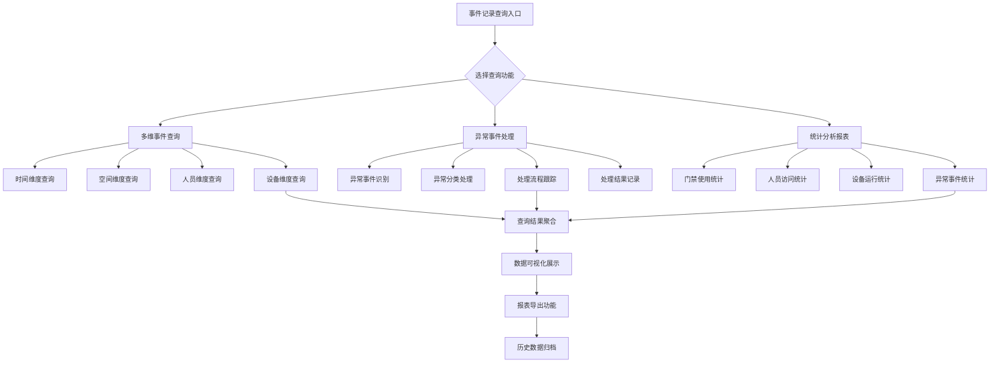
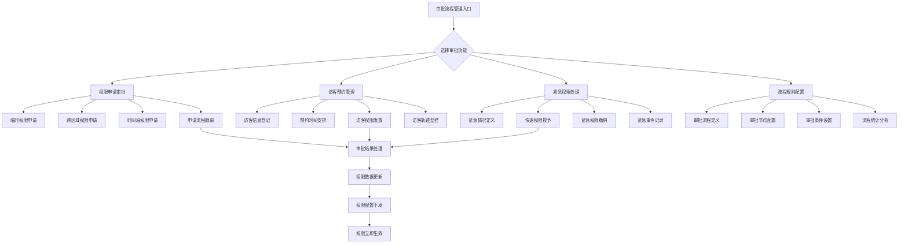
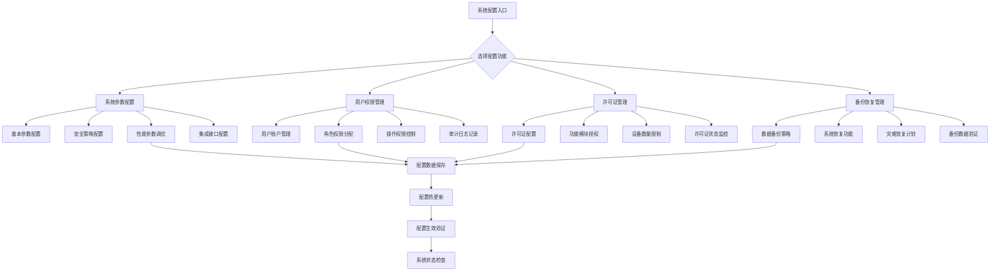
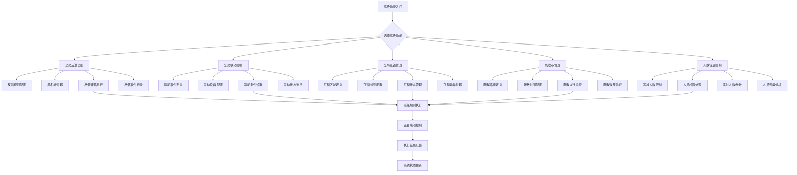
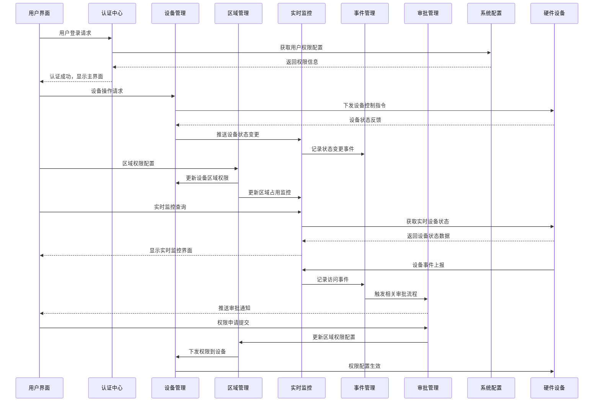

# 门禁管理系统架构流程图

> **版本**: v1.0
> **更新时间**: 2025-11-13
> **分类**: 核心功能模块 > 企业OA系统 > 门禁管理系统
> **标签**: ["门禁系统", "ZKBioSecurity", "架构流程", "系统设计", "模块交互"]
> **作者**: SmartAdmin规范治理委员会
> **描述**: IOE-DREAM智慧园区一卡通管理平台门禁管理系统的完整架构流程图和模块交互设计

## 📋 系统概述

### 架构定位

**门禁管理系统架构流程图**详细展示了IOE-DREAM智慧园区一卡通管理平台基于ZKBioSecurity-ACC技术架构的门禁系统七大核心模块及其相互关系。系统采用事件驱动的响应式架构，实现全方位的园区安全管控和智能化访问管理。

### 核心特性

- ✅ **模块化架构**：七大核心模块相互独立又紧密协作
- ✅ **事件驱动**：基于实时事件流的响应式处理机制
- ✅ **数据联动**：模块间数据流和状态同步机制
- ✅ **权限层级**：多级权限控制和区域管理
- ✅ **实时监控**：7×24小时实时状态监控和异常处理
- ✅ **智能联动**：视频联动、报警联动、设备联动机制

## 🏗️ 系统整体架构流程图

### 核心架构流程设计

```mermaid
graph TB
    subgraph "IOE-DREAM门禁管理系统架构流程"
        A[用户登录认证] --> B[系统主界面]

        B --> subgraph "核心业务模块层"
            C[设备管理模块]
            D[区域空间管理模块]
            E[实时监控模块]
            F[事件记录查询模块]
            G[审批流程管理模块]
        end

        B --> subgraph "系统支撑模块层"
            H[系统配置模块]
            I[高级功能模块]
        end

        subgraph "设备管理模块详细功能"
            C1[设备生命周期管理]
            C2[门状态控制管理]
            C3[读头设备管理]
            C4[I/O扩展板管理]
        end

        subgraph "区域空间管理模块详细功能"
            D1[多级区域创建]
            D2[人员权限分配]
            D3[设备资源分配]
            D4[区域占用监控]
        end

        subgraph "实时监控模块详细功能"
            E1[实时状态监控]
            E2[智能报警处理]
            E3[视频联动控制]
            E4[人员轨迹追踪]
        end

        subgraph "事件记录查询模块详细功能"
            F1[多维事件查询]
            F2[异常事件处理]
            F3[统计分析报表]
        end

        subgraph "审批流程管理模块详细功能"
            G1[权限申请审批]
            G2[访客预约管理]
            G3[紧急权限处理]
            G4[流程规则配置]
        end

        subgraph "系统配置模块详细功能"
            H1[系统参数配置]
            H2[用户权限管理]
            H3[许可证管理]
            H4[备份恢复管理]
        end

        subgraph "高级功能模块详细功能"
            I1[全局反潜功能]
            I2[全局联动控制]
            I3[全局互锁管理]
            I4[疏散点管理]
            I5[人数容量控制]
            I6[人员访问限制]
        end
    end

    %% 模块内部连接
    C --> C1
    C --> C2
    C --> C3
    C --> C4

    D --> D1
    D --> D2
    D --> D3
    D --> D4

    E --> E1
    E --> E2
    E --> E3
    E --> E4

    F --> F1
    F --> F2
    F --> F3

    G --> G1
    G --> G2
    G --> G3
    G --> G4

    H --> H1
    H --> H2
    H --> H3
    H --> H4

    I --> I1
    I --> I2
    I --> I3
    I --> I4
    I --> I5
    I --> I6

    %% 模块间数据流和关联关系
    C -.->|设备状态数据流| E
    C -.->|设备配置信息| D
    D -.->|区域权限策略| C
    D -.->|区域占用数据| E
    E -.->|实时事件数据| F
    E -.->|报警事件信息| G
    G -.->|权限审批结果| D
    H -.->|系统配置参数| A
    I -.->|高级控制规则| C
    I -.->|高级联动策略| E
```

## 🔧 核心模块详细流程设计

### 1. 设备管理模块流程

**功能职责**：门禁设备全生命周期管理和控制

**核心流程**：


**技术实现要点**：
- **设备连接池管理**：维护与硬件设备的长连接
- **配置下发机制**：异步配置下发和状态同步
- **健康度检查**：定期设备状态检查和故障诊断
- **固件升级管理**：安全的固件升级和回滚机制

### 2. 区域空间管理模块流程

**功能职责**：园区空间层级管理和权限分配

**核心流程**：


**技术实现要点**：
- **多级区域架构**：支持无限层级的区域树结构
- **权限矩阵计算**：高效的人员-区域-设备权限计算
- **实时占用监控**：基于事件驱动的区域占用统计
- **权限预计算**：权限数据的预计算和缓存机制

### 3. 实时监控模块流程

**功能职责**：实时状态监控和智能联动处理

**核心流程**：


**技术实现要点**：
- **实时数据流处理**：基于WebSocket的实时数据推送
- **事件驱动架构**：基于事件的响应式处理机制
- **智能视频联动**：门禁事件与视频监控的无缝集成
- **机器学习分析**：异常行为检测和人员轨迹分析

### 4. 事件记录查询模块流程

**功能职责**：门禁事件管理和统计分析

**核心流程**：


**技术实现要点**：
- **多维查询引擎**：支持多维度组合查询和过滤
- **大数据处理**：海量事件数据的存储和检索优化
- **实时统计分析**：基于流式计算的实时统计
- **数据生命周期管理**：历史数据的归档和清理策略

### 5. 审批流程管理模块流程

**功能职责**：权限申请审批和访客管理

**核心流程**：


**技术实现要点**：
- **工作流引擎**：灵活的审批流程配置和执行
- **访客管理系统**：完整的访客生命周期管理
- **紧急权限机制**：快速响应紧急情况的权限处理
- **移动端支持**：支持移动设备的申请和审批

### 6. 系统配置模块流程

**功能职责**：系统参数配置和基础管理

**核心流程**：


**技术实现要点**：
- **配置热更新**：支持配置的动态更新和生效
- **细粒度权限控制**：基于RBAC的精细化权限管理
- **许可证管理**：灵活的功能授权和设备限制
- **高可用备份**：系统数据的安全备份和快速恢复

### 7. 高级功能模块流程

**功能职责**：全局高级控制和智能管理

**核心流程**：


**技术实现要点**：
- **规则引擎**：灵活的业务规则配置和执行引擎
- **智能联动**：基于条件的自动设备联动机制
- **安全策略**：多层级的安全防护和控制策略
- **人群管理**：智能的人员密度和容量管理

## 🔄 模块间数据流设计

### 数据流架构图



### 关键数据流说明

#### 1. 设备状态数据流
- **流向**：设备管理 → 实时监控 → 事件记录
- **数据类型**：设备在线状态、门状态、网络状态
- **处理机制**：实时推送、缓存更新、事件记录

#### 2. 权限配置数据流
- **流向**：区域空间管理 → 设备管理 → 硬件设备
- **数据类型**：人员权限、区域权限、时间权限
- **处理机制**：权限计算、配置下发、生效确认

#### 3. 事件处理数据流
- **流向**：硬件设备 → 实时监控 → 事件记录 → 审批流程
- **数据类型**：访问事件、异常事件、报警事件
- **处理机制**：事件接收、智能分析、流程触发

#### 4. 系统配置数据流
- **流向**：系统配置 → 所有模块 → 硬件设备
- **数据类型**：系统参数、安全策略、性能配置
- **处理机制**：配置更新、热加载、全局生效

## 🚀 技术实现架构

### 1. 微服务架构设计

```java
@RestController
@RequestMapping("/api/access-control")
@Slf4j
public class AccessControlSystemController {

    @Resource
    private DeviceManagementService deviceManagementService;

    @Resource
    private AreaSpaceService areaSpaceService;

    @Resource
    private RealTimeMonitoringService realTimeMonitoringService;

    /**
     * 获取系统整体架构状态
     */
    @GetMapping("/system-architecture")
    @SaCheckPermission("access:system:architecture")
    public ResponseDTO<SystemArchitectureVO> getSystemArchitecture() {
        try {
            // 1. 获取各模块状态
            ModuleStatus deviceStatus = deviceManagementService.getModuleStatus();
            ModuleStatus areaStatus = areaSpaceService.getModuleStatus();
            ModuleStatus monitorStatus = realTimeMonitoringService.getModuleStatus();

            // 2. 构建系统架构状态
            SystemArchitectureVO architectureVO = SystemArchitectureVO.builder()
                    .deviceModule(deviceStatus)
                    .areaModule(areaStatus)
                    .monitorModule(monitorStatus)
                    .systemTime(LocalDateTime.now())
                    .build();

            return ResponseDTO.ok(architectureVO);

        } catch (Exception e) {
            log.error("获取系统架构状态失败", e);
            return ResponseDTO.error("系统架构获取失败");
        }
    }
}
```

### 2. 事件驱动架构

```java
@Component
@Slf4j
public class AccessEventProcessor {

    @Resource
    private ApplicationEventPublisher eventPublisher;

    @Resource
    private RealTimeMonitoringService monitoringService;

    @EventListener
    @Async
    public void handleDeviceStatusChangedEvent(DeviceStatusChangedEvent event) {
        try {
            // 1. 更新设备状态缓存
            monitoringService.updateDeviceStatus(event);

            // 2. 触发模块间数据流
            eventPublisher.publishEvent(new ModuleDataSyncEvent(event));

            // 3. 记录状态变更事件
            eventPublisher.publishEvent(new AccessEventRecord(event));

            log.info("设备状态变更事件处理完成: {}", event);

        } catch (Exception e) {
            log.error("设备状态变更事件处理失败", e);
        }
    }

    @EventListener
    public void handleAreaPermissionChangedEvent(AreaPermissionChangedEvent event) {
        try {
            // 1. 同步权限到设备管理模块
            deviceManagementService.syncAreaPermissions(event);

            // 2. 更新实时监控权限规则
            monitoringService.updatePermissionRules(event);

            log.info("区域权限变更事件处理完成: {}", event);

        } catch (Exception e) {
            log.error("区域权限变更事件处理失败", e);
        }
    }
}
```

### 3. 模块服务接口设计

```java
public interface ModuleDataService {

    /**
     * 获取模块状态
     */
    ModuleStatus getModuleStatus();

    /**
     * 模块数据同步
     */
    void syncModuleData(ModuleDataSyncEvent event);

    /**
     * 处理模块间数据流
     */
    void handleModuleDataFlow(ModuleDataFlowEvent event);

    /**
     * 模块健康检查
     */
    ModuleHealthCheckResult healthCheck();
}

@Service
public class DeviceManagementServiceImpl implements ModuleDataService {

    @Override
    @Cacheable(value = "moduleStatus", key = "'device'")
    public ModuleStatus getModuleStatus() {
        return ModuleStatus.builder()
                .moduleName("设备管理模块")
                .isOnline(true)
                .deviceCount(deviceService.getOnlineDeviceCount())
                .lastUpdateTime(LocalDateTime.now())
                .build();
    }

    @Override
    @EventListener
    public void syncModuleData(ModuleDataSyncEvent event) {
        if (event.getSourceModule().equals("区域空间管理")) {
            // 处理来自区域空间管理的数据同步
            this.syncAreaPermissions(event);
        }
    }
}
```

## 🔗 相关文档

### 架构设计文档
- [门禁管理系统整体架构设计](./系统整体架构设计.md) - 完整的架构设计和模块说明
- [门禁管理数据库设计](./数据库设计.md) - 数据库表结构和关系设计
- [门禁系统集成方案](./集成方案.md) - 系统集成和部署方案

### 技术实现文档
- [设备管理模块技术实现](./设备管理模块技术实现.md) - 设备管理详细技术方案
- [实时监控技术实现](./实时监控技术实现.md) - 实时监控技术架构
- [生物识别集成方案](./生物识别集成方案.md) - 生物识别技术集成

### 业务流程文档
- [门禁操作流程设计](./操作流程设计.md) - 门禁业务操作流程
- [异常处理流程设计](./异常处理流程设计.md) - 异常情况处理流程
- [权限管理流程设计](./权限管理流程设计.md) - 权限管理业务流程

---

## 🎯 核心原则总结

1. **模块化设计** - 七大核心模块职责清晰，相互独立又紧密协作
2. **事件驱动** - 基于事件的响应式架构，实现实时数据流处理
3. **数据联动** - 模块间数据流和状态同步机制确保数据一致性
4. **智能监控** - 7×24小时实时监控和智能异常处理
5. **灵活配置** - 支持灵活的规则配置和策略调整

## 📋 版本信息

- 本文档基于ZKBioSecurity-ACC门禁系统架构设计
- 架构流程设计负责人：SmartAdmin规范治理委员会
- 创建日期：2025-11-13
- 下次评审：2026-02-13

---

**🎯 IOE-DREAM门禁管理系统架构流程图 - 模块化、事件驱动、智能联动的企业级门禁解决方案**