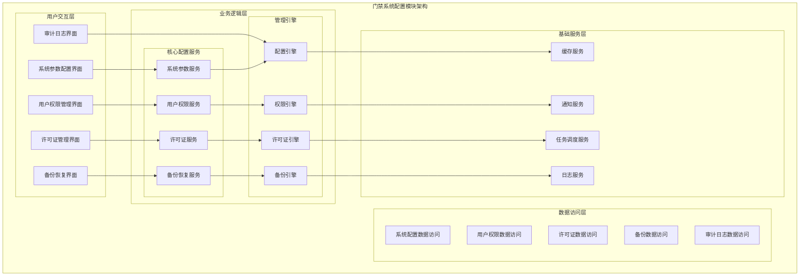
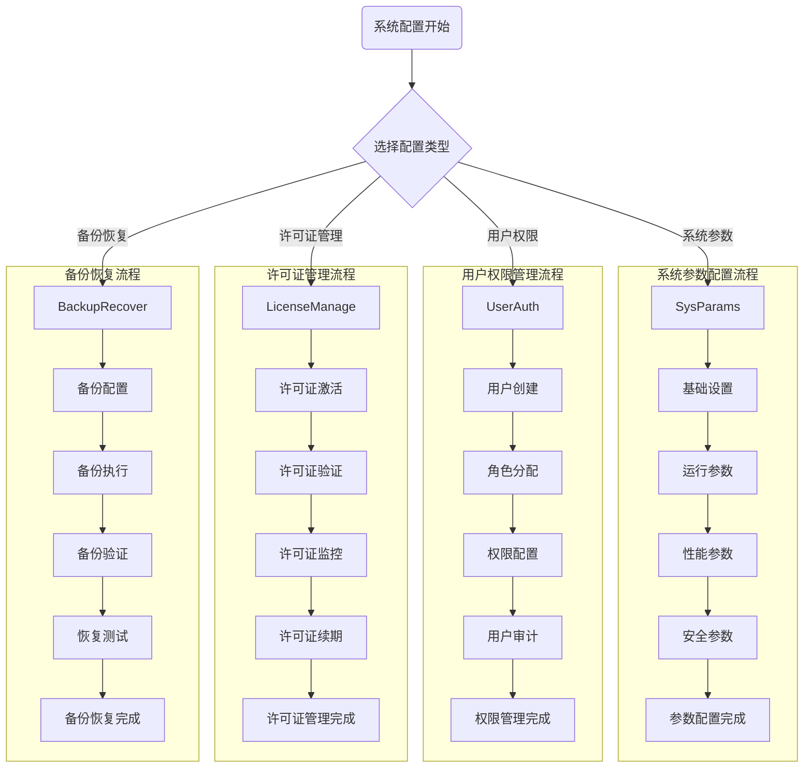

# 门禁系统配置模块详细设计

> **版本**: v1.0
> **更新时间**: 2025-11-13
> **分类**: 核心功能模块 > 企业OA系统 > 门禁管理系统
> **标签**: ["门禁系统", "系统配置", "用户权限", "许可证管理", "备份恢复"]
> **作者**: SmartAdmin规范治理委员会
> **描述**: IOE-DREAM智慧园区一卡通管理平台门禁管理系统的系统参数配置、用户权限管理、许可证管理和备份恢复模块详细技术设计

## 📋 模块概述

### 核心定位

**门禁系统配置模块**是IOE-DREAM智慧园区一卡通管理平台的管理中心，负责系统参数配置、用户权限管理、许可证管理和数据备份恢复。模块提供完整的系统管理功能，确保系统的安全、稳定和合规运行，支持灵活的配置管理和权限控制机制。

### 核心特性

- ✅ **灵活参数配置**：系统基础参数、运行参数、性能参数、安全参数配置
- ✅ **分级权限管理**：基于角色的用户权限管理和细粒度权限控制
- ✅ **许可证全生命周期**：许可证激活、验证、监控、续期完整管理
- ✅ **智能备份恢复**：多种备份策略、自动备份、快速恢复机制
- ✅ **配置热更新**：支持系统配置的动态更新和生效
- ✅ **审计日志追踪**：完整的配置变更和操作审计记录
- ✅ **安全策略管理**：密码策略、会话管理、访问控制安全策略

## 🏗️ 系统配置模块架构设计

### 模块功能架构图



### 系统配置管理核心流程设计



## 🔧 核心功能详细设计

### 1. 系统参数配置服务

#### 1.1 参数配置管理

**功能描述**：系统基础参数、运行参数、性能参数、安全参数的配置和管理

**技术实现**：
```java
@Service
@Slf4j
public class SystemParameterService {

    @Resource
    private SystemParameterDao systemParameterDao;

    @Resource
    private ConfigValidationService validationService;

    @Resource
    private ConfigurationChangeNotifier changeNotifier;

    /**
     * 获取系统参数配置
     */
    @Cacheable(value = "systemParams", key = "#category")
    public ResponseDTO<SystemParameterVO> getSystemParameters(String category) {
        try {
            // 1. 验证参数分类
            validateParameterCategory(category);

            // 2. 查询参数配置
            List<SystemParameterEntity> parameters = systemParameterDao.selectList(
                    new LambdaQueryWrapper<SystemParameterEntity>()
                            .eq(SystemParameterEntity::getCategory, category)
                            .eq(SystemParameterEntity::getEnabledFlag, true)
                            .orderByAsc(SystemParameterEntity::getSortOrder));

            // 3. 转换为VO
            SystemParameterVO parameterVO = SystemParameterVO.builder()
                    .category(category)
                    .parameters(parameters.stream()
                            .map(this::convertToParameterVO)
                            .collect(Collectors.toList()))
                    .lastUpdateTime(getLastUpdateTime(category))
                    .build();

            return ResponseDTO.ok(parameterVO);

        } catch (Exception e) {
            log.error("获取系统参数失败, category: {}", category, e);
            return ResponseDTO.error("获取失败");
        }
    }

    /**
     * 更新系统参数
     */
    @Transactional(rollbackFor = Exception.class)
    public ResponseDTO<Void> updateSystemParameters(SystemParameterUpdateForm updateForm) {
        try {
            String category = updateForm.getCategory();

            // 1. 验证更新权限
            validateUpdatePermission(category);

            // 2. 验证参数值
            for (ParameterUpdate param : updateForm.getParameters()) {
                validationService.validateParameterValue(
                        category, param.getParamKey(), param.getParamValue());
            }

            // 3. 备份当前配置
            backupCurrentConfiguration(category);

            // 4. 批量更新参数
            List<SystemParameterEntity> updateList = new ArrayList<>();
            for (ParameterUpdate param : updateForm.getParameters()) {
                SystemParameterEntity entity = SystemParameterEntity.builder()
                        .category(category)
                        .paramKey(param.getParamKey())
                        .paramValue(param.getParamValue())
                        .paramDesc(param.getParamDesc())
                        .updateUserId(SmartRequestUtil.getRequestUserId())
                        .updateTime(LocalDateTime.now())
                        .build();

                updateList.add(entity);
            }

            systemParameterDao.updateParametersBatch(updateList);

            // 5. 清除缓存
            evictParameterCache(category);

            // 6. 发送配置变更通知
            changeNotifier.notifyConfigurationChange(category, updateForm.getParameters());

            // 7. 记录变更日志
            logConfigurationChange(category, updateForm.getParameters());

            log.info("系统参数更新成功, category: {}, paramCount: {}",
                    category, updateForm.getParameters().size());

            return ResponseDTO.ok();

        } catch (Exception e) {
            log.error("更新系统参数失败", e);
            return ResponseDTO.error("更新失败");
        }
    }

    /**
     * 重置系统参数为默认值
     */
    @Transactional(rollbackFor = Exception.class)
    public ResponseDTO<Void> resetSystemParametersToDefault(String category) {
        try {
            // 1. 验证重置权限
            validateResetPermission(category);

            // 2. 获取默认参数配置
            List<SystemParameterEntity> defaultParams = getDefaultParameters(category);

            // 3. 批量更新为默认值
            for (SystemParameterEntity defaultParam : defaultParams) {
                SystemParameterEntity updateParam = SystemParameterEntity.builder()
                        .category(category)
                        .paramKey(defaultParam.getParamKey())
                        .paramValue(defaultParam.getDefaultValue())
                        .paramDesc(defaultParam.getParamDesc())
                        .updateUserId(SmartRequestUtil.getRequestUserId())
                        .updateTime(LocalDateTime.now())
                        .build();

                systemParameterDao.updateParameterByKey(updateParam);
            }

            // 4. 清除缓存
            evictParameterCache(category);

            // 5. 发送重置通知
            changeNotifier.notifyConfigurationReset(category);

            log.info("系统参数重置为默认值完成, category: {}", category);

            return ResponseDTO.ok();

        } catch (Exception e) {
            log.error("重置系统参数失败", e);
            return ResponseDTO.error("重置失败");
        }
    }

    /**
     * 转换为参数VO
     */
    private SystemParameterVO convertToParameterVO(SystemParameterEntity entity) {
        return SystemParameterVO.builder()
                .paramKey(entity.getParamKey())
                .paramName(entity.getParamName())
                .paramValue(entity.getParamValue())
                .paramType(entity.getParamType())
                .paramDesc(entity.getParamDesc())
                .defaultValue(entity.getDefaultValue())
                .requiredFlag(entity.getRequiredFlag())
                .editableFlag(entity.getEditableFlag())
                .build();
    }
}
```

#### 1.2 配置热更新机制

**功能描述**：系统配置的动态更新和热生效机制

**技术实现**：
```java
@Component
@Slf4j
public class ConfigurationHotUpdateManager {

    @Resource
    private ApplicationEventPublisher eventPublisher;

    @Resource
    private ConfigChangeExecutor configChangeExecutor;

    private final Map<String, List<ConfigurationChangeListener>> listeners = new ConcurrentHashMap<>();

    /**
     * 注册配置变更监听器
     */
    public void registerListener(String configCategory, ConfigurationChangeListener listener) {
        listeners.computeIfAbsent(configCategory, k -> new CopyOnWriteArrayList<>()).add(listener);
        log.info("注册配置变更监听器成功, category: {}, listener: {}", configCategory, listener.getClass().getSimpleName());
    }

    /**
     * 处理配置变更事件
     */
    @EventListener
    @Async
    public void handleConfigurationChangeEvent(ConfigurationChangeEvent event) {
        try {
            String category = event.getCategory();
            List<ConfigurationChangeListener> categoryListeners = listeners.get(category);

            if (CollectionUtils.isNotEmpty(categoryListeners)) {
                // 并发通知所有监听器
                List<CompletableFuture<Void>> futures = categoryListeners.stream()
                        .map(listener -> CompletableFuture.runAsync(() -> {
                            try {
                                listener.onConfigurationChange(event);
                            } catch (Exception e) {
                                log.error("配置变更监听器执行失败, listener: {}", listener.getClass().getSimpleName(), e);
                            }
                        }, configChangeExecutor))
                        .collect(Collectors.toList());

                // 等待所有监听器执行完成
                CompletableFuture.allOf(futures.toArray(new CompletableFuture[0]))
                        .thenRun(() -> log.info("配置变更通知完成, category: {}", category))
                        .exceptionally(throwable -> {
                            log.error("配置变更通知执行失败", throwable);
                            return null;
                        });
            }

        } catch (Exception e) {
            log.error("处理配置变更事件失败", e);
        }
    }

    /**
     * 数据库连接池热更新
     */
    @ConfigurationChangeListener("database")
    public void updateDatabaseConnectionPool(ConfigurationChangeEvent event) {
        try {
            List<ParameterUpdate> changedParams = event.getChangedParameters();

            for (ParameterUpdate param : changedParams) {
                if (param.getParamKey().startsWith("database.pool.")) {
                    updateDataSourcePool(param.getParamKey(), param.getParamValue());
                }
            }

        } catch (Exception e) {
            log.error("数据库连接池热更新失败", e);
        }
    }

    /**
     * 缓存配置热更新
     */
    @ConfigurationChangeListener("cache")
    public void updateCacheConfiguration(ConfigurationChangeEvent event) {
        try {
            List<ParameterUpdate> changedParams = event.getChangedParameters();

            for (ParameterUpdate param : changedParams) {
                if (param.getParamKey().startsWith("cache.")) {
                    updateCacheConfig(param.getParamKey(), param.getParamValue());
                }
            }

        } catch (Exception e) {
            log.error("缓存配置热更新失败", e);
        }
    }

    /**
     * 更新数据源池配置
     */
    private void updateDataSourcePool(String configKey, String configValue) {
        try {
            DataSource dataSource = getDataSource();
            if (dataSource instanceof HikariDataSource) {
                HikariDataSource hikariDataSource = (HikariDataSource) dataSource;

                switch (configKey) {
                    case "database.pool.maximumPoolSize":
                        hikariDataSource.setMaximumPoolSize(Integer.parseInt(configValue));
                        break;
                    case "database.pool.minimumIdle":
                        hikariDataSource.setMinimumIdle(Integer.parseInt(configValue));
                        break;
                    case "database.pool.connectionTimeout":
                        hikariDataSource.setConnectionTimeout(Long.parseLong(configValue));
                        break;
                    case "database.pool.idleTimeout":
                        hikariDataSource.setIdleTimeout(Long.parseLong(configValue));
                        break;
                    default:
                        log.warn("未知的数据库池配置项: {}", configKey);
                }

                log.info("数据库连接池配置更新成功: {} = {}", configKey, configValue);
            }

        } catch (Exception e) {
            log.error("更新数据源池配置失败", e);
        }
    }

    /**
     * 更新缓存配置
     */
    private void updateCacheConfig(String configKey, String configValue) {
        try {
            // 根据缓存类型更新相应配置
            if (configKey.startsWith("cache.redis.")) {
                updateRedisConfig(configKey.substring("cache.redis.".length()), configValue);
            } else if (configKey.startsWith("cache.caffeine.")) {
                updateCaffeineConfig(configKey.substring("cache.caffeine.".length()), configValue);
            }

            log.info("缓存配置更新成功: {} = {}", configKey, configValue);

        } catch (Exception e) {
            log.error("更新缓存配置失败", e);
        }
    }
}
```

### 2. 用户权限管理服务

#### 2.1 用户权限管理

**功能描述**：基于角色的用户权限管理和细粒度权限控制

**技术实现**：
```java
@Service
@Slf4j
public class UserPermissionManagementService {

    @Resource
    private UserDao userDao;

    @Resource
    private RoleDao roleDao;

    @Resource
    private PermissionDao permissionDao;

    @Resource
    private UserRoleDao userRoleDao;

    @Resource
    private RolePermissionDao rolePermissionDao;

    /**
     * 创建用户并分配角色
     */
    @Transactional(rollbackFor = Exception.class)
    public ResponseDTO<Long> createUserWithRoles(UserCreateForm createForm) {
        try {
            // 1. 验证用户创建权限
            validateUserCreationPermission();

            // 2. 创建用户
            UserEntity user = UserEntity.builder()
                    .userId(IdGenerator.generateId())
                    .username(createForm.getUsername())
                    .realName(createForm.getRealName())
                    .email(createForm.getEmail())
                    .phone(createForm.getPhone())
                    .departmentId(createForm.getDepartmentId())
                    .position(createForm.getPosition())
                    .status(UserStatus.ACTIVE)
                    .createUserId(SmartRequestUtil.getRequestUserId())
                    .createTime(LocalDateTime.now())
                    .build();

            // 3. 设置密码
            String encodedPassword = passwordEncoder.encode(createForm.getPassword());
            user.setPassword(encodedPassword);

            userDao.insert(user);

            // 4. 分配角色
            if (CollectionUtils.isNotEmpty(createForm.getRoleIds())) {
                assignRolesToUser(user.getUserId(), createForm.getRoleIds());
            }

            // 5. 记录操作日志
            logUserOperation("USER_CREATE", user.getUserId(), "创建用户并分配角色");

            log.info("用户创建成功, userId: {}, username: {}", user.getUserId(), user.getUsername());

            return ResponseDTO.ok(user.getUserId());

        } catch (Exception e) {
            log.error("创建用户失败", e);
            return ResponseDTO.error("创建失败");
        }
    }

    /**
     * 为用户分配角色
     */
    @Transactional(rollbackFor = Exception.class)
    public ResponseDTO<Void> assignRolesToUser(Long userId, List<Long> roleIds) {
        try {
            // 1. 验证用户存在
            UserEntity user = userDao.selectById(userId);
            if (user == null) {
                return ResponseDTO.error("用户不存在");
            }

            // 2. 验证角色存在和权限
            validateRoles(roleIds);

            // 3. 清除现有角色
            userRoleDao.deleteByUserId(userId);

            // 4. 分配新角色
            for (Long roleId : roleIds) {
                UserRoleEntity userRole = UserRoleEntity.builder()
                        .userId(userId)
                        .roleId(roleId)
                        .assignTime(LocalDateTime.now())
                        .assignUserId(SmartRequestUtil.getRequestUserId())
                        .build();
                userRoleDao.insert(userRole);
            }

            // 5. 更新用户权限缓存
            updateUserPermissionCache(userId);

            // 6. 记录操作日志
            logUserOperation("ROLE_ASSIGN", userId, "分配角色: " + roleIds);

            log.info("用户角色分配成功, userId: {}, roleIds: {}", userId, roleIds);

            return ResponseDTO.ok();

        } catch (Exception e) {
            log.error("分配用户角色失败", e);
            return ResponseDTO.error("分配失败");
        }
    }

    /**
     * 获取用户权限列表
     */
    @Cacheable(value = "userPermissions", key = "#userId")
    public ResponseDTO<UserPermissionVO> getUserPermissions(Long userId) {
        try {
            // 1. 验证用户存在
            UserEntity user = userDao.selectById(userId);
            if (user == null) {
                return ResponseDTO.error("用户不存在");
            }

            // 2. 获取用户角色
            List<RoleEntity> roles = getUserRoles(userId);

            // 3. 获取用户权限
            List<PermissionEntity> permissions = getUserPermissions(userId, roles);

            // 4. 构建权限VO
            UserPermissionVO permissionVO = UserPermissionVO.builder()
                    .userId(userId)
                    .username(user.getUsername())
                    .realName(user.getRealName())
                    .roles(roles.stream()
                            .map(this::convertToRoleVO)
                            .collect(Collectors.toList()))
                    .permissions(permissions.stream()
                            .map(this::convertToPermissionVO)
                            .collect(Collectors.toList()))
                    .lastUpdateTime(LocalDateTime.now())
                    .build();

            return ResponseDTO.ok(permissionVO);

        } catch (Exception e) {
            log.error("获取用户权限失败, userId: {}", userId, e);
            return ResponseDTO.error("获取失败");
        }
    }

    /**
     * 检查用户权限
     */
    public boolean hasPermission(Long userId, String permissionCode) {
        try {
            // 1. 从缓存获取用户权限
            UserPermissionVO userPermissions = getUserPermissionsFromCache(userId);
            if (userPermissions == null) {
                return false;
            }

            // 2. 检查权限
            return userPermissions.getPermissions().stream()
                    .anyMatch(permission -> permission.getPermissionCode().equals(permissionCode));

        } catch (Exception e) {
            log.error("检查用户权限失败, userId: {}, permissionCode: {}", userId, permissionCode, e);
            return false;
        }
    }

    /**
     * 用户权限审计
     */
    public ResponseDTO<PageResult<UserPermissionAuditVO>> auditUserPermissions(UserPermissionAuditForm auditForm) {
        try {
            // 1. 验证审计权限
            validateAuditPermission();

            // 2. 构建查询条件
            LambdaQueryWrapper<UserPermissionAuditEntity> queryWrapper = new LambdaQueryWrapper<>();
            queryWrapper.eq(UserPermissionAuditEntity::getDeletedFlag, false)
                    .orderByDesc(UserPermissionAuditEntity::getAuditTime);

            // 3. 添加过滤条件
            if (auditForm.getUserId() != null) {
                queryWrapper.eq(UserPermissionAuditEntity::getUserId, auditForm.getUserId());
            }
            if (auditForm.getAuditType() != null) {
                queryWrapper.eq(UserPermissionAuditEntity::getAuditType, auditForm.getAuditType());
            }
            if (auditForm.getStartTime() != null) {
                queryWrapper.ge(UserPermissionAuditEntity::getAuditTime, auditForm.getStartTime());
            }
            if (auditForm.getEndTime() != null) {
                queryWrapper.le(UserPermissionAuditEntity::getAuditTime, auditForm.getEndTime());
            }

            // 4. 分页查询
            IPage<UserPermissionAuditEntity> page = new Page<>(auditForm.getPageNum(), auditForm.getPageSize());
            IPage<UserPermissionAuditEntity> auditPage = userPermissionAuditDao.selectPage(page, queryWrapper);

            // 5. 转换为VO
            List<UserPermissionAuditVO> voList = auditPage.getRecords().stream()
                    .map(this::convertToAuditVO)
                    .collect(Collectors.toList());

            // 6. 构建分页结果
            PageResult<UserPermissionAuditVO> pageResult = new PageResult<>();
            pageResult.setRows(voList);
            pageResult.setTotal(auditPage.getTotal());
            pageResult.setPageNum(auditForm.getPageNum());
            pageResult.setPageSize(auditForm.getPageSize());

            return ResponseDTO.ok(pageResult);

        } catch (Exception e) {
            log.error("用户权限审计失败", e);
            return ResponseDTO.error("审计失败");
        }
    }

    /**
     * 获取用户角色
     */
    private List<RoleEntity> getUserRoles(Long userId) {
        return roleDao.selectRolesByUserId(userId);
    }

    /**
     * 获取用户权限
     */
    private List<PermissionEntity> getUserPermissions(Long userId, List<RoleEntity> roles) {
        Set<Long> permissionIds = new HashSet<>();

        // 1. 获取角色权限
        for (RoleEntity role : roles) {
            List<Long> rolePermissionIds = rolePermissionDao.getPermissionIdsByRoleId(role.getRoleId());
            permissionIds.addAll(rolePermissionIds);
        }

        // 2. 获取权限详情
        if (CollectionUtils.isNotEmpty(permissionIds)) {
            return permissionDao.selectBatchIds(permissionIds);
        }

        return Collections.emptyList();
    }
}
```

### 3. 许可证管理服务

#### 3.1 许可证生命周期管理

**功能描述**：许可证激活、验证、监控、续期的完整生命周期管理

**技术实现**：
```java
@Service
@Slf4j
public class LicenseManagementService {

    @Resource
    private LicenseDao licenseDao;

    @Resource
    private LicenseValidator licenseValidator;

    @Resource
    private LicenseMonitorService licenseMonitorService;

    /**
     * 激活许可证
     */
    @Transactional(rollbackFor = Exception.class)
    public ResponseDTO<LicenseActivationVO> activateLicense(LicenseActivationForm activationForm) {
        try {
            // 1. 验证许可证文件
            LicenseFile licenseFile = parseLicenseFile(activationForm.getLicenseFile());

            // 2. 验证许可证有效性
            LicenseValidationResult validationResult = licenseValidator.validate(licenseFile);
            if (!validationResult.isValid()) {
                return ResponseDTO.error("许可证验证失败: " + validationResult.getErrorMessage());
            }

            // 3. 检查是否已激活
            LicenseEntity existingLicense = licenseDao.selectByLicenseKey(licenseFile.getLicenseKey());
            if (existingLicense != null && existingLicense.getStatus() == LicenseStatus.ACTIVE) {
                return ResponseDTO.error("许可证已激活");
            }

            // 4. 创建许可证记录
            LicenseEntity license = LicenseEntity.builder()
                    .licenseId(IdGenerator.generateId())
                    .licenseKey(licenseFile.getLicenseKey())
                    .licenseType(licenseFile.getLicenseType())
                    .productName(licenseFile.getProductName())
                    .productVersion(licenseFile.getProductVersion())
                    .customerName(licenseFile.getCustomerName())
                    .issueDate(licenseFile.getIssueDate())
                    .expireDate(licenseFile.getExpireDate())
                    .maxDevices(licenseFile.getMaxDevices())
                    .maxUsers(licenseFile.getMaxUsers())
                    .features(licenseFile.getFeatures())
                    .status(LicenseStatus.ACTIVE)
                    .activateTime(LocalDateTime.now())
                    .activateUserId(SmartRequestUtil.getRequestUserId())
                    .machineCode(getMachineCode())
                    .createTime(LocalDateTime.now())
                    .build();

            licenseDao.insert(license);

            // 5. 应用许可证限制
            applyLicenseRestrictions(license);

            // 6. 启动许可证监控
            licenseMonitorService.startLicenseMonitoring(license);

            // 7. 设置续期提醒
            scheduleRenewalReminder(license);

            // 8. 构建激活结果
            LicenseActivationVO activationVO = LicenseActivationVO.builder()
                    .licenseId(license.getLicenseId())
                    .licenseKey(license.getLicenseKey())
                    .productName(license.getProductName())
                    .customerName(license.getCustomerName())
                    .expireDate(license.getExpireDate())
                    .features(license.getFeatures())
                    .activationTime(license.getActivateTime())
                    .build();

            log.info("许可证激活成功, licenseId: {}, licenseKey: {}",
                    license.getLicenseId(), license.getLicenseKey());

            return ResponseDTO.ok(activationVO);

        } catch (Exception e) {
            log.error("激活许可证失败", e);
            return ResponseDTO.error("激活失败");
        }
    }

    /**
     * 验证许可证状态
     */
    public ResponseDTO<LicenseStatusVO> verifyLicenseStatus() {
        try {
            // 1. 获取当前激活的许可证
            LicenseEntity license = getCurrentActiveLicense();
            if (license == null) {
                return ResponseDTO.ok(LicenseStatusVO.inactive());
            }

            // 2. 验证许可证
            LicenseValidationResult validationResult = licenseValidator.validate(license);

            // 3. 检查许可证使用情况
            LicenseUsageInfo usageInfo = getLicenseUsageInfo(license);

            // 4. 构建状态VO
            LicenseStatusVO statusVO = LicenseStatusVO.builder()
                    .licenseId(license.getLicenseId())
                    .licenseKey(license.getLicenseKey())
                    .status(license.getStatus())
                    .isValid(validationResult.isValid())
                    .expireDate(license.getExpireDate())
                    .daysUntilExpire(calculateDaysUntilExpire(license.getExpireDate()))
                    .maxDevices(license.getMaxDevices())
                    .usedDevices(usageInfo.getUsedDevices())
                    .maxUsers(license.getMaxUsers())
                    .usedUsers(usageInfo.getUsedUsers())
                    .features(license.getFeatures())
                    .validationMessage(validationResult.getErrorMessage())
                    .lastCheckTime(LocalDateTime.now())
                    .build();

            return ResponseDTO.ok(statusVO);

        } catch (Exception e) {
            log.error("验证许可证状态失败", e);
            return ResponseDTO.error("验证失败");
        }
    }

    /**
     * 续期许可证
     */
    @Transactional(rollbackFor = Exception.class)
    public ResponseDTO<Void> renewLicense(LicenseRenewalForm renewalForm) {
        try {
            // 1. 获取当前许可证
            LicenseEntity currentLicense = getCurrentActiveLicense();
            if (currentLicense == null) {
                return ResponseDTO.error("当前无激活的许可证");
            }

            // 2. 验证续期文件
            LicenseFile renewalLicenseFile = parseLicenseFile(renewalForm.getRenewalLicenseFile());

            // 3. 验证续期许可证
            if (!renewalLicenseFile.getLicenseKey().equals(currentLicense.getLicenseKey())) {
                return ResponseDTO.error("续期许可证密钥不匹配");
            }

            LicenseValidationResult validationResult = licenseValidator.validate(renewalLicenseFile);
            if (!validationResult.isValid()) {
                return ResponseDTO.error("续期许可证验证失败: " + validationResult.getErrorMessage());
            }

            // 4. 更新许可证信息
            currentLicense.setExpireDate(renewalLicenseFile.getExpireDate());
            currentLicense.setMaxDevices(renewalLicenseFile.getMaxDevices());
            currentLicense.setMaxUsers(renewalLicenseFile.getMaxUsers());
            currentLicense.setFeatures(renewalLicenseFile.getFeatures());
            currentLicense.setRenewTime(LocalDateTime.now());
            currentLicense.setRenewUserId(SmartRequestUtil.getRequestUserId());

            licenseDao.updateById(currentLicense);

            // 5. 重新应用许可证限制
            applyLicenseRestrictions(currentLicense);

            // 6. 更新续期提醒
            scheduleRenewalReminder(currentLicense);

            log.info("许可证续期成功, licenseId: {}", currentLicense.getLicenseId());

            return ResponseDTO.ok();

        } catch (Exception e) {
            log.error("续期许可证失败", e);
            return ResponseDTO.error("续期失败");
        }
    }

    /**
     * 获取许可证使用信息
     */
    private LicenseUsageInfo getLicenseUsageInfo(LicenseEntity license) {
        try {
            // 1. 统计设备使用数量
            long usedDevices = deviceDao.countActiveDevices();

            // 2. 统计用户使用数量
            long usedUsers = userDao.countActiveUsers();

            // 3. 统计功能使用情况
            Map<String, FeatureUsage> featureUsage = new HashMap<>();
            for (String feature : license.getFeatures()) {
                FeatureUsage usage = calculateFeatureUsage(feature);
                featureUsage.put(feature, usage);
            }

            return LicenseUsageInfo.builder()
                    .usedDevices(usedDevices)
                    .usedUsers(usedUsers)
                    .featureUsage(featureUsage)
                    .build();

        } catch (Exception e) {
            log.error("获取许可证使用信息失败", e);
            return LicenseUsageInfo.empty();
        }
    }

    /**
     * 应用许可证限制
     */
    private void applyLicenseRestrictions(LicenseEntity license) {
        try {
            // 1. 应用设备数量限制
            DeviceRestriction deviceRestriction = DeviceRestriction.builder()
                    .maxDevices(license.getMaxDevices())
                    .enforceLimit(true)
                    .build();
            deviceService.applyDeviceRestriction(deviceRestriction);

            // 2. 应用用户数量限制
            UserRestriction userRestriction = UserRestriction.builder()
                    .maxUsers(license.getMaxUsers())
                    .enforceLimit(true)
                    .build();
            userService.applyUserRestriction(userRestriction);

            // 3. 启用/禁用功能模块
            for (String feature : license.getFeatures()) {
                featureService.enableFeature(feature);
            }

            log.info("许可证限制应用成功, licenseId: {}", license.getLicenseId());

        } catch (Exception e) {
            log.error("应用许可证限制失败", e);
            throw new RuntimeException("许可证限制应用失败");
        }
    }

    /**
     * 设置续期提醒
     */
    private void scheduleRenewalReminder(LicenseEntity license) {
        try {
            LocalDateTime expireDate = license.getExpireDate();
            LocalDateTime reminderDate = expireDate.minusDays(30); // 提前30天提醒

            if (reminderDate.isAfter(LocalDateTime.now())) {
                TaskScheduler scheduler = getTaskScheduler();
                scheduler.schedule(() -> {
                    try {
                        sendRenewalReminder(license);
                    } catch (Exception e) {
                        log.error("发送许可证续期提醒失败", e);
                    }
                }, Date.from(reminderDate.atZone(ZoneId.systemDefault()).toInstant()));
            }

        } catch (Exception e) {
            log.error("设置续期提醒失败", e);
        }
    }
}
```

### 4. 备份恢复服务

#### 4.1 智能备份恢复

**功能描述**：多种备份策略、自动备份、快速恢复机制

**技术实现**：
```java
@Service
@Slf4j
public class BackupRestoreService {

    @Resource
    private BackupConfigDao backupConfigDao;

    @Resource
    private BackupTaskDao backupTaskDao;

    @Resource
    private BackupStorageService backupStorageService;

    @Resource
    private TaskScheduler taskScheduler;

    /**
     * 配置备份策略
     */
    @Transactional(rollbackFor = Exception.class)
    public ResponseDTO<String> configureBackupPolicy(BackupPolicyConfigForm configForm) {
        try {
            // 1. 验证备份策略配置
            validateBackupPolicy(configForm);

            // 2. 创建备份配置
            BackupConfigEntity backupConfig = BackupConfigEntity.builder()
                    .configId(IdGenerator.generateId())
                    .policyName(configForm.getPolicyName())
                    .backupType(configForm.getBackupType())
                    .backupFrequency(configForm.getBackupFrequency())
                    .backupTime(configForm.getBackupTime())
                    .retentionDays(configForm.getRetentionDays())
                    .compressionEnabled(configForm.getCompressionEnabled())
                    .encryptionEnabled(configForm.getEncryptionEnabled())
                    .storageLocation(configForm.getStorageLocation())
                    .includedTables(configForm.getIncludedTables())
                    .excludedTables(configForm.getExcludedTables())
                    .enabledFlag(true)
                    .createUserId(SmartRequestUtil.getRequestUserId())
                    .createTime(LocalDateTime.now())
                    .build();

            backupConfigDao.insert(backupConfig);

            // 3. 调度备份任务
            scheduleBackupTask(backupConfig);

            log.info("备份策略配置成功, configId: {}, policyName: {}",
                    backupConfig.getConfigId(), backupConfig.getPolicyName());

            return ResponseDTO.ok(backupConfig.getConfigId());

        } catch (Exception e) {
            log.error("配置备份策略失败", e);
            return ResponseDTO.error("配置失败");
        }
    }

    /**
     * 执行手动备份
     */
    @Async
    public CompletableFuture<BackupExecutionResult> executeManualBackup(ManualBackupForm backupForm) {
        return CompletableFuture.supplyAsync(() -> {
            try {
                String taskId = IdGenerator.generateId();

                // 1. 创建备份任务记录
                BackupTaskEntity backupTask = BackupTaskEntity.builder()
                        .taskId(taskId)
                        .taskType(BackupTaskType.MANUAL)
                        .backupType(backupForm.getBackupType())
                        .status(BackupStatus.RUNNING)
                        .startTime(LocalDateTime.now())
                        .createUserId(SmartRequestUtil.getRequestUserId())
                        .build();

                backupTaskDao.insert(backupTask);

                // 2. 执行备份
                BackupExecutionResult result = performBackup(taskId, backupForm);

                // 3. 更新任务状态
                backupTask.setStatus(result.isSuccess() ? BackupStatus.SUCCESS : BackupStatus.FAILED);
                backupTask.setEndTime(LocalDateTime.now());
                backupTask.setBackupFilePath(result.getBackupFilePath());
                backupTask.setFileSize(result.getFileSize());
                backupTask.setErrorMessage(result.getErrorMessage());

                backupTaskDao.updateById(backupTask);

                // 4. 发送备份完成通知
                if (result.isSuccess()) {
                    notificationService.sendBackupSuccessNotification(backupTask);
                } else {
                    notificationService.sendBackupFailureNotification(backupTask, result.getErrorMessage());
                }

                log.info("手动备份执行完成, taskId: {}, success: {}", taskId, result.isSuccess());

                return result;

            } catch (Exception e) {
                log.error("执行手动备份失败", e);
                return BackupExecutionResult.failed("备份执行异常: " + e.getMessage());
            }
        });
    }

    /**
     * 执行备份操作
     */
    private BackupExecutionResult performBackup(String taskId, BackupForm backupForm) {
        try {
            LocalDateTime startTime = LocalDateTime.now();
            String backupFileName = generateBackupFileName(backupForm.getBackupType(), startTime);

            // 1. 准备备份
            BackupContext context = BackupContext.builder()
                    .taskId(taskId)
                    .backupType(backupForm.getBackupType())
                    .backupFileName(backupFileName)
                    .compressionEnabled(backupForm.isCompressionEnabled())
                    .encryptionEnabled(backupForm.isEncryptionEnabled())
                    .build();

            // 2. 执行数据备份
            switch (backupForm.getBackupType()) {
                case FULL:
                    return performFullBackup(context);
                case INCREMENTAL:
                    return performIncrementalBackup(context);
                case DIFFERENTIAL:
                    return performDifferentialBackup(context);
                default:
                    throw new BusinessException("不支持的备份类型");
            }

        } catch (Exception e) {
            log.error("执行备份操作失败", e);
            return BackupExecutionResult.failed("备份执行失败: " + e.getMessage());
        }
    }

    /**
     * 执行全量备份
     */
    private BackupExecutionResult performFullBackup(BackupContext context) {
        try {
            String tempBackupPath = createTempBackupPath(context.getBackupFileName());

            // 1. 备份数据库表
            List<TableBackupResult> tableResults = new ArrayList<>();
            List<String> tablesToBackup = getTablesToBackup();

            for (String tableName : tablesToBackup) {
                TableBackupResult tableResult = backupTable(tableName, tempBackupPath, context);
                tableResults.add(tableResult);
            }

            // 2. 备份文件
            List<FileBackupResult> fileResults = backupFiles(tempBackupPath, context);

            // 3. 压缩备份文件
            if (context.isCompressionEnabled()) {
                compressBackup(tempBackupPath, context);
            }

            // 4. 加密备份文件
            if (context.isEncryptionEnabled()) {
                encryptBackup(tempBackupPath, context);
            }

            // 5. 上传到存储位置
            String backupFilePath = backupStorageService.storeBackup(tempBackupPath, context);

            // 6. 清理临时文件
            cleanupTempFiles(tempBackupPath);

            // 7. 计算备份文件大小
            long fileSize = calculateBackupFileSize(backupFilePath);

            // 8. 记录备份元数据
            BackupMetadata metadata = BackupMetadata.builder()
                    .taskId(context.getTaskId())
                    .backupType(BackupType.FULL)
                    .backupFilePath(backupFilePath)
                    .fileSize(fileSize)
                    .tableCount(tableResults.size())
                    .fileCount(fileResults.size())
                    .backupTime(LocalDateTime.now())
                    .tableResults(tableResults)
                    .fileResults(fileResults)
                    .build();

            saveBackupMetadata(metadata);

            return BackupExecutionResult.success(backupFilePath, fileSize);

        } catch (Exception e) {
            log.error("执行全量备份失败", e);
            return BackupExecutionResult.failed("全量备份失败: " + e.getMessage());
        }
    }

    /**
     * 恢复数据
     */
    @Transactional(rollbackFor = Exception.class)
    public ResponseDTO<RestoreResultVO> restoreData(RestoreForm restoreForm) {
        try {
            // 1. 验证恢复权限
            validateRestorePermission();

            // 2. 获取备份文件
            String backupFilePath = restoreForm.getBackupFilePath();
            if (!backupStorageService.backupExists(backupFilePath)) {
                return ResponseDTO.error("备份文件不存在");
            }

            // 3. 下载备份文件
            String localBackupPath = downloadBackupFile(backupFilePath);

            // 4. 解密备份文件（如果需要）
            if (isEncryptedBackup(backupFilePath)) {
                decryptBackup(localBackupPath, restoreForm.getDecryptPassword());
            }

            // 5. 解压备份文件（如果需要）
            if (isCompressedBackup(backupFilePath)) {
                decompressBackup(localBackupPath);
            }

            // 6. 验证备份文件
            BackupValidationResult validation = validateBackupFile(localBackupPath);
            if (!validation.isValid()) {
                return ResponseDTO.error("备份文件验证失败: " + validation.getErrorMessage());
            }

            // 7. 执行数据恢复
            RestoreResult restoreResult = performDataRestore(localBackupPath, restoreForm);

            // 8. 清理临时文件
            cleanupTempFiles(localBackupPath);

            // 9. 记录恢复操作
            logRestoreOperation(backupFilePath, restoreResult);

            // 10. 构建恢复结果
            RestoreResultVO resultVO = RestoreResultVO.builder()
                    .backupFilePath(backupFilePath)
                    .restoreTime(restoreResult.getRestoreTime())
                    .tablesRestored(restoreResult.getTablesRestored())
                    .recordsRestored(restoreResult.getRecordsRestored())
                    .success(restoreResult.isSuccess())
                    .errorMessage(restoreResult.getErrorMessage())
                    .build();

            log.info("数据恢复完成, backupFilePath: {}, success: {}",
                    backupFilePath, restoreResult.isSuccess());

            return ResponseDTO.ok(resultVO);

        } catch (Exception e) {
            log.error("恢复数据失败", e);
            return ResponseDTO.error("恢复失败");
        }
    }

    /**
     * 备份单个表
     */
    private TableBackupResult backupTable(String tableName, String backupPath, BackupContext context) {
        try {
            String tableBackupPath = backupPath + "/tables/" + tableName + ".sql";
            FileUtils.forceMkdir(new File(tableBackupPath).getParentFile());

            // 1. 导出表结构和数据
            ProcessBuilder processBuilder = new ProcessBuilder();
            processBuilder.command("mysqldump",
                    "--single-transaction",
                    "--routines",
                    "--triggers",
                    "--hex-blob",
                    "--default-character-set=utf8mb4",
                    "-h", getDatabaseHost(),
                    "-u", getDatabaseUser(),
                    "-p" + getDatabasePassword(),
                    getDatabaseName(),
                    tableName);

            processBuilder.redirectOutput(new File(tableBackupPath));
            Process process = processBuilder.start();

            int exitCode = process.waitFor();
            if (exitCode != 0) {
                throw new RuntimeException("表导出失败，退出码: " + exitCode);
            }

            // 2. 计算文件大小
            long fileSize = new File(tableBackupPath).length();

            // 3. 记录备份结果
            return TableBackupResult.builder()
                    .tableName(tableName)
                    .backupPath(tableBackupPath)
                    .fileSize(fileSize)
                    .recordCount(getTableRecordCount(tableName))
                    .backupTime(LocalDateTime.now())
                    .build();

        } catch (Exception e) {
            log.error("备份表失败, tableName: {}", tableName, e);
            return TableBackupResult.failed(tableName, e.getMessage());
        }
    }

    /**
     * 调度备份任务
     */
    private void scheduleBackupTask(BackupConfigEntity backupConfig) {
        try {
            CronTrigger trigger = new CronTrigger(backupConfig.getBackupTime());

            taskScheduler.schedule(() -> {
                try {
                    executeScheduledBackup(backupConfig);
                } catch (Exception e) {
                    log.error("执行调度备份失败", e);
                }
            }, trigger);

            log.info("备份任务调度成功, configId: {}, cron: {}",
                    backupConfig.getConfigId(), backupConfig.getBackupTime());

        } catch (Exception e) {
            log.error("调度备份任务失败", e);
        }
    }
}
```

## 📊 关键性能指标

### 系统配置性能要求

| 指标类型 | 性能要求 | 监控方法 |
|---------|---------|---------|
| 参数配置响应时间 | ≤ 1秒 | 配置变更耗时监控 |
| 配置热更新延迟 | ≤ 5秒 | 配置生效时效检查 |
| 权限验证响应时间 | ≤ 100毫秒 | 权限验证性能测试 |
| 许可证验证时间 | ≤ 1秒 | 许可证验证时效监控 |
| 备份处理速度 | ≥ 100MB/分钟 | 备份处理性能监控 |
| 数据恢复速度 | ≥ 50MB/分钟 | 恢复处理性能监控 |

### 系统容量指标

| 指标类型 | 设计容量 | 说明 |
|---------|---------|------|
| 并发配置用户数 | 100用户 | 同时进行系统配置用户数 |
| 参数配置项数量 | 1000项 | 系统参数配置项总数 |
| 用户角色数量 | 50个 | 系统用户角色总数 |
| 权限项数量 | 500个 | 系统权限项总数 |
| 备份文件存储 | 1TB | 备份文件年度存储量 |
| 配置变更日志 | 10万条/月 | 配置变更日志月度增量 |

## 🔗 相关文档

### 技术实现文档
- [门禁管理系统整体架构设计](./系统整体架构设计.md) - 完整的系统架构设计
- [用户权限管理模块设计](./用户权限管理模块设计.md) - 权限管理详细实现
- [系统安全规范设计](./系统安全规范设计.md) - 安全策略和规范

### 配置管理文档
- [配置热更新机制设计](./配置热更新机制设计.md) - 配置热更新技术实现
- [许可证管理规范](./许可证管理规范.md) - 许可证管理规范和流程
- [备份恢复策略设计](./备份恢复策略设计.md) - 备份恢复策略设计

### 运维管理文档
- [系统监控方案](./系统监控方案.md) - 系统监控和告警方案
- [运维操作手册](./运维操作手册.md) - 日常运维操作指南
- [故障处理指南](./故障处理指南.md) - 常见故障处理流程

---

## 🎯 核心原则总结

1. **配置集中管理** - 统一的系统参数配置和管理机制
2. **权限分级控制** - 基于角色的细粒度权限管理
3. **许可证合规管理** - 完整的许可证生命周期管理
4. **数据安全保障** - 多重备份和快速恢复机制
5. **变更可追溯** - 完整的配置变更审计日志

## 📋 版本信息

- 本文档基于系统管理最佳实践设计
- 系统配置模块设计负责人：SmartAdmin规范治理委员会
- 创建日期：2025-11-13
- 下次评审：2026-02-13

---

**🎯 IOE-DREAM门禁系统配置模块 - 集中配置、权限管理、许可证控制、数据备份的企业级系统管理解决方案**