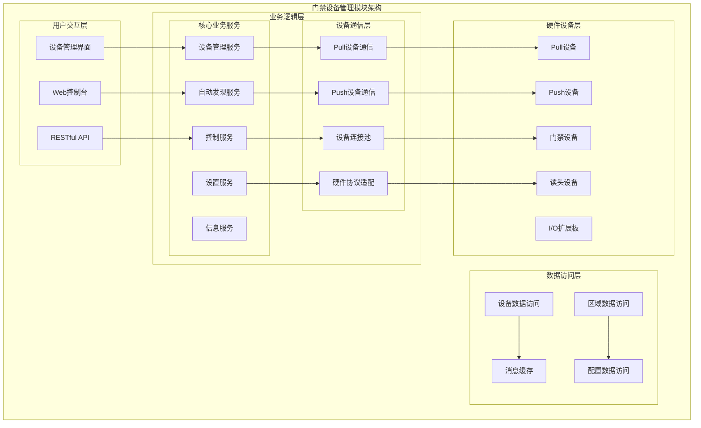
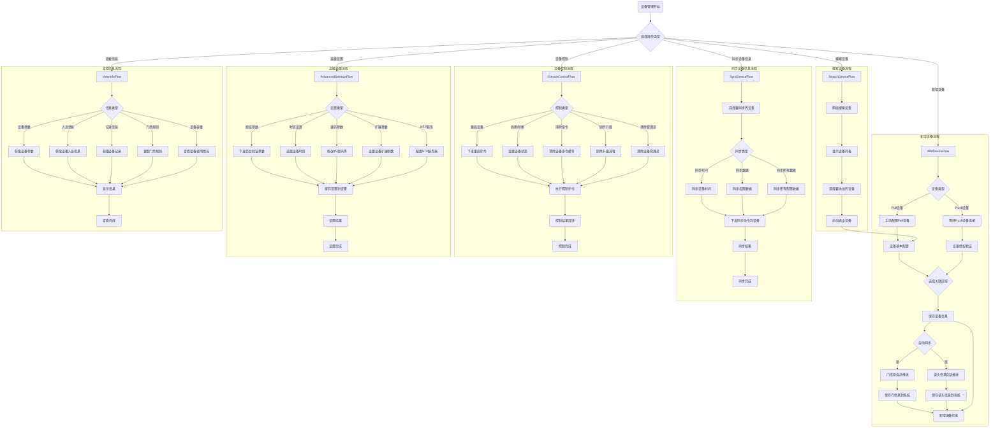

# 门禁设备管理模块详细设计

> **版本**: v1.0
> **更新时间**: 2025-11-13
> **分类**: 核心功能模块 > 企业OA系统 > 门禁管理系统
> **标签**: ["门禁系统", "设备管理", "ZKBioSecurity", "模块设计", "硬件集成"]
> **作者**: SmartAdmin规范治理委员会
> **描述**: IOE-DREAM智慧园区一卡通管理平台门禁管理系统的设备管理模块详细技术设计

## 📋 模块概述

### 核心定位

**门禁设备管理模块**是IOE-DREAM智慧园区一卡通管理平台的基础核心模块，负责所有门禁硬件设备的全生命周期管理。基于ZKBioSecurity-ACC 3.14.x技术架构，提供Pull/Push双模式设备接入、自动配置、状态监控和远程控制等功能。

### 核心特性

- ✅ **多模式设备接入**：支持Pull和Push两种设备连接模式
- ✅ **自动设备发现**：智能网络搜索和自动设备注册
- ✅ **设备自动推送**：设备信息、门信息、读头信息自动同步
- ✅ **远程设备控制**：重启、启用/禁用、固件升级等远程操作
- ✅ **高级参数配置**：验证参数、时区、NTP、扩展参数配置
- ✅ **设备状态监控**：7×24小时设备在线状态和健康度监控
- ✅ **区域关联管理**：设备与区域的绑定和权限传递

## 🏗️ 设备管理模块架构设计

### 模块功能架构图



### 设备管理核心流程设计



## 🔧 核心功能详细设计

### 1. 设备接入管理

#### 1.1 Pull设备接入

**功能描述**：系统主动连接设备，获取设备信息和状态

**技术实现**：
```java
@Service
@Slf4j
public class PullDeviceServiceImpl implements DeviceConnectionService {

    @Resource
    private DeviceConnectionPool connectionPool;

    @Resource
    private DeviceProtocolAdapter protocolAdapter;

    /**
     * Pull设备连接
     */
    public DeviceConnectionResult connectPullDevice(DeviceConnectForm connectForm) {
        try {
            // 1. 创建设备连接
            DeviceConnection connection = DeviceConnection.builder()
                    .deviceId(connectForm.getDeviceId())
                    .ipAddress(connectForm.getIpAddress())
                    .port(connectForm.getPort())
                    .connectionType(ConnectionType.PULL)
                    .build();

            // 2. 建立网络连接
            SocketChannel channel = connectionPool.createConnection(connection);

            // 3. 协议握手认证
            AuthResult authResult = protocolAdapter.handshake(channel, connectForm);
            if (!authResult.isSuccess()) {
                return DeviceConnectionResult.failed("设备认证失败: " + authResult.getMessage());
            }

            // 4. 获取设备基本信息
            DeviceInfo deviceInfo = protocolAdapter.getDeviceInfo(channel);

            // 5. 保存设备信息
            deviceService.saveDeviceInfo(deviceInfo);

            log.info("Pull设备连接成功: {}", connectForm.getDeviceId());
            return DeviceConnectionResult.success(connection);

        } catch (Exception e) {
            log.error("Pull设备连接失败", e);
            return DeviceConnectionResult.failed("连接失败: " + e.getMessage());
        }
    }

    /**
     * 获取设备状态
     */
    public DeviceStatus getDeviceStatus(Long deviceId) {
        try {
            DeviceConnection connection = connectionPool.getConnection(deviceId);
            return protocolAdapter.getDeviceStatus(connection);
        } catch (Exception e) {
            log.error("获取设备状态失败, deviceId: {}", deviceId, e);
            return DeviceStatus.offline(deviceId);
        }
    }
}
```

#### 1.2 Push设备接入

**功能描述**：设备主动连接系统，推送设备信息

**技术实现**：
```java
@Component
@Slf4j
public class PushDeviceConnectionHandler {

    @Resource
    private DeviceConnectionPool connectionPool;

    @Resource
    private DeviceAuthService deviceAuthService;

    /**
     * 处理Push设备连接
     */
    @EventListener
    @Async
    public void handlePushDeviceConnectEvent(PushDeviceConnectEvent event) {
        try {
            String deviceSn = event.getDeviceSn();
            String ipAddress = event.getIpAddress();

            // 1. 查找设备记录
            DeviceEntity device = deviceService.getByDeviceSn(deviceSn);
            if (device == null) {
                log.warn("未找到设备记录, deviceSn: {}", deviceSn);
                return;
            }

            // 2. 验证设备授权
            AuthResult authResult = deviceAuthService.authenticatePushDevice(
                device.getDeviceId(), event.getAuthCode());

            if (!authResult.isSuccess()) {
                log.warn("Push设备认证失败, deviceSn: {}", deviceSn);
                return;
            }

            // 3. 建立连接
            DeviceConnection connection = DeviceConnection.builder()
                    .deviceId(device.getDeviceId())
                    .deviceSn(deviceSn)
                    .ipAddress(ipAddress)
                    .connectionType(ConnectionType.PUSH)
                    .connectTime(LocalDateTime.now())
                    .build();

            connectionPool.addConnection(connection);

            // 4. 自动同步设备信息
            autoSyncDeviceInfo(device.getDeviceId());

            log.info("Push设备连接成功: {}", deviceSn);

        } catch (Exception e) {
            log.error("Push设备连接处理失败", e);
        }
    }

    /**
     * 自动同步设备信息
     */
    private void autoSyncDeviceInfo(Long deviceId) {
        try {
            // 1. 同步设备基本参数
            deviceSyncService.syncDeviceParameters(deviceId);

            // 2. 同步门信息
            deviceSyncService.syncDoorInfo(deviceId);

            // 3. 同步读头信息
            deviceSyncService.syncReaderInfo(deviceId);

            // 4. 同步人员权限数据
            deviceSyncService.syncPersonPermissions(deviceId);

        } catch (Exception e) {
            log.error("自动同步设备信息失败, deviceId: {}", deviceId, e);
        }
    }
}
```

### 2. 设备自动发现

#### 2.1 网络搜索实现

**功能描述**：自动搜索网络内的门禁设备

**技术实现**：
```java
@Service
@Slf4j
public class DeviceDiscoveryService {

    @Value("${access.device.discovery.timeout:5000}")
    private int discoveryTimeout;

    @Resource
    private UdpDiscoveryClient udpDiscoveryClient;

    /**
     * 搜索网络设备
     */
    public List<DiscoveredDevice> discoverNetworkDevices(String subnet) {
        try {
            List<DiscoveredDevice> discoveredDevices = new ArrayList<>();

            // 1. 广播搜索包
            DiscoveryPacket searchPacket = DiscoveryPacket.builder()
                    .packetType(PacketType.SEARCH_REQUEST)
                    .timestamp(System.currentTimeMillis())
                    .sourceMac(getLocalMacAddress())
                    .build();

            // 2. 发送广播到指定网段
            List<String> broadcastAddresses = getBroadcastAddresses(subnet);
            for (String broadcastAddr : broadcastAddresses) {
                udpDiscoveryClient.sendBroadcast(searchPacket, broadcastAddr, 48899);
            }

            // 3. 等待设备响应
            Thread.sleep(discoveryTimeout);

            // 4. 收集响应设备
            List<DiscoveryResponsePacket> responses = udpDiscoveryClient.getResponses();
            for (DiscoveryResponsePacket response : responses) {
                DiscoveredDevice device = DiscoveredDevice.builder()
                        .deviceSn(response.getDeviceSn())
                        .ipAddress(response.getIpAddress())
                        .macAddress(response.getMacAddress())
                        .deviceModel(response.getDeviceModel())
                        .firmwareVersion(response.getFirmwareVersion())
                        .deviceType(response.getDeviceType())
                        .build();

                // 5. 检查设备是否已添加
                if (!isDeviceAdded(response.getDeviceSn())) {
                    discoveredDevices.add(device);
                }
            }

            log.info("网络设备搜索完成, 发现{}个新设备", discoveredDevices.size());
            return discoveredDevices;

        } catch (Exception e) {
            log.error("网络设备搜索失败", e);
            return Collections.emptyList();
        }
    }

    /**
     * 检查设备是否已添加
     */
    private boolean isDeviceAdded(String deviceSn) {
        return deviceService.existsByDeviceSn(deviceSn);
    }
}
```

### 3. 设备区域关联管理

#### 3.1 区域关联流程

**功能描述**：设备与区域的绑定和权限传递

**技术实现**：
```java
@Service
@Transactional(rollbackFor = Exception.class)
@Slf4j
public class DeviceAreaAssociationService {

    @Resource
    private DeviceDao deviceDao;

    @Resource
    private AreaDao areaDao;

    @Resource
    private DeviceAreaDao deviceAreaDao;

    /**
     * 设备关联区域
     */
    public ResponseDTO<Void> associateDeviceWithArea(DeviceAreaAssociationForm form) {
        try {
            // 1. 验证设备存在
            DeviceEntity device = deviceDao.selectById(form.getDeviceId());
            if (device == null) {
                return ResponseDTO.error("设备不存在");
            }

            // 2. 验证区域存在
            AreaEntity area = areaDao.selectById(form.getAreaId());
            if (area == null) {
                return ResponseDTO.error("区域不存在");
            }

            // 3. 检查设备是否已关联其他区域
            DeviceAreaEntity existingAssociation = deviceAreaDao.getByDeviceId(form.getDeviceId());
            if (existingAssociation != null && !existingAssociation.getAreaId().equals(form.getAreaId())) {
                return ResponseDTO.error("设备已关联其他区域，请先解除原关联");
            }

            // 4. 创建或更新区域关联
            DeviceAreaEntity association;
            if (existingAssociation != null) {
                association = existingAssociation;
                association.setAreaId(form.getAreaId());
                association.setUpdateTime(LocalDateTime.now());
                deviceAreaDao.updateById(association);
            } else {
                association = DeviceAreaEntity.builder()
                        .deviceId(form.getDeviceId())
                        .areaId(form.getAreaId())
                        .createTime(LocalDateTime.now())
                        .build();
                deviceAreaDao.insert(association);
            }

            // 5. 同步权限到设备
            syncAreaPermissionsToDevice(form.getDeviceId(), form.getAreaId());

            log.info("设备关联区域成功, deviceId: {}, areaId: {}", form.getDeviceId(), form.getAreaId());
            return ResponseDTO.ok();

        } catch (Exception e) {
            log.error("设备关联区域失败", e);
            return ResponseDTO.error("关联失败");
        }
    }

    /**
     * 同步区域权限到设备
     */
    private void syncAreaPermissionsToDevice(Long deviceId, Long areaId) {
        try {
            // 1. 获取区域权限配置
            List<AreaPermissionConfig> permissionConfigs = areaPermissionService
                    .getPermissionConfigs(areaId);

            // 2. 转换为设备权限格式
            List<DevicePermission> devicePermissions = convertToDevicePermissions(
                    deviceId, permissionConfigs);

            // 3. 下发权限到设备
            devicePermissionService.syncPermissionsToDevice(deviceId, devicePermissions);

            log.info("区域权限同步到设备成功, deviceId: {}, areaId: {}", deviceId, areaId);

        } catch (Exception e) {
            log.error("同步区域权限到设备失败", e);
            throw new RuntimeException("权限同步失败");
        }
    }
}
```

### 4. 设备远程控制

#### 4.1 设备控制服务

**功能描述**：远程设备控制操作实现

**技术实现**：
```java
@Service
@Slf4j
public class DeviceControlService {

    @Resource
    private DeviceConnectionPool connectionPool;

    @Resource
    private DeviceCommandExecutor commandExecutor;

    @Resource
    private FirmwareUpgradeService firmwareUpgradeService;

    /**
     * 重启设备
     */
    public DeviceControlResult rebootDevice(Long deviceId) {
        try {
            // 1. 获取设备连接
            DeviceConnection connection = connectionPool.getConnection(deviceId);
            if (connection == null) {
                return DeviceControlResult.failed("设备离线");
            }

            // 2. 发送重启命令
            CommandResult result = commandExecutor.executeCommand(
                connection, DeviceCommand.REBOOT);

            if (result.isSuccess()) {
                // 3. 标记设备为重启状态
                deviceService.updateDeviceStatus(deviceId, DeviceStatus.REBOOTING);

                // 4. 断开连接，等待设备重新连接
                connectionPool.removeConnection(deviceId);

                log.info("设备重启命令发送成功, deviceId: {}", deviceId);
                return DeviceControlResult.success("设备重启命令已发送");
            } else {
                return DeviceControlResult.failed("重启命令执行失败: " + result.getMessage());
            }

        } catch (Exception e) {
            log.error("重启设备失败, deviceId: {}", deviceId, e);
            return DeviceControlResult.failed("重启失败: " + e.getMessage());
        }
    }

    /**
     * 设备启用/禁用
     */
    public DeviceControlResult enableDevice(Long deviceId, boolean enable) {
        try {
            // 1. 更新设备状态
            deviceService.updateDeviceEnabled(deviceId, enable);

            // 2. 如果是启用操作，尝试连接设备
            if (enable) {
                DeviceEntity device = deviceService.getById(deviceId);
                if (device != null && device.getConnectionType() == ConnectionType.PULL) {
                    deviceConnectionService.connectPullDevice(device.getDeviceId());
                }
            }

            log.info("设备状态更新成功, deviceId: {}, enabled: {}", deviceId, enable);
            return DeviceControlResult.success(enable ? "设备已启用" : "设备已禁用");

        } catch (Exception e) {
            log.error("设备状态更新失败, deviceId: {}", deviceId, e);
            return DeviceControlResult.failed("状态更新失败");
        }
    }

    /**
     * 固件升级
     */
    @Async
    public CompletableFuture<DeviceControlResult> upgradeFirmware(Long deviceId,
                                                                  String firmwareFilePath) {
        return CompletableFuture.supplyAsync(() -> {
            try {
                // 1. 验证固件文件
                FirmwareFile firmwareFile = firmwareUpgradeService
                        .validateFirmwareFile(firmwareFilePath);
                if (firmwareFile == null) {
                    return DeviceControlResult.failed("固件文件验证失败");
                }

                // 2. 获取设备连接
                DeviceConnection connection = connectionPool.getConnection(deviceId);
                if (connection == null) {
                    return DeviceControlResult.failed("设备离线");
                }

                // 3. 执行固件升级
                FirmwareUpgradeResult upgradeResult = firmwareUpgradeService
                        .upgradeFirmware(connection, firmwareFile);

                if (upgradeResult.isSuccess()) {
                    // 4. 更新设备固件版本信息
                    deviceService.updateFirmwareVersion(deviceId,
                            firmwareFile.getVersion());

                    log.info("设备固件升级成功, deviceId: {}", deviceId);
                    return DeviceControlResult.success("固件升级成功");
                } else {
                    return DeviceControlResult.failed("固件升级失败: " +
                            upgradeResult.getMessage());
                }

            } catch (Exception e) {
                log.error("设备固件升级失败, deviceId: {}", deviceId, e);
                return DeviceControlResult.failed("固件升级异常: " + e.getMessage());
            }
        });
    }
}
```

### 5. 高级参数配置

#### 5.1 设备参数配置服务

**功能描述**：设备高级参数配置和管理

**技术实现**：
```java
@Service
@Slf4j
public class DeviceConfigurationService {

    @Resource
    private DeviceConnectionPool connectionPool;

    @Resource
    private DeviceParameterAdapter parameterAdapter;

    /**
     * 配置验证参数
     */
    public DeviceConfigResult configureVerifyParameters(Long deviceId,
                                                       VerifyParameterConfig config) {
        try {
            // 1. 获取设备连接
            DeviceConnection connection = connectionPool.getConnection(deviceId);
            if (connection == null) {
                return DeviceConfigResult.failed("设备离线");
            }

            // 2. 构建验证参数配置
            DeviceParameter verifyParam = DeviceParameter.builder()
                    .parameterType(ParameterType.VERIFY_PARAMETERS)
                    .cardVerifyMode(config.getCardVerifyMode())
                    .cardValidPeriod(config.getCardValidPeriod())
                    .pinLength(config.getPinLength())
                    .duplicateCheckInterval(config.getDuplicateCheckInterval())
                    .build();

            // 3. 下发配置到设备
            ConfigResult result = parameterAdapter.configureParameter(connection, verifyParam);

            if (result.isSuccess()) {
                // 4. 保存配置到数据库
                deviceParameterService.saveDeviceParameter(deviceId, verifyParam);

                log.info("设备验证参数配置成功, deviceId: {}", deviceId);
                return DeviceConfigResult.success("配置成功");
            } else {
                return DeviceConfigResult.failed("配置失败: " + result.getMessage());
            }

        } catch (Exception e) {
            log.error("配置设备验证参数失败, deviceId: {}", deviceId, e);
            return DeviceConfigResult.failed("配置异常: " + e.getMessage());
        }
    }

    /**
     * 配置NTP服务器
     */
    public DeviceConfigResult configureNtpServer(Long deviceId, NtpServerConfig config) {
        try {
            DeviceConnection connection = connectionPool.getConnection(deviceId);
            if (connection == null) {
                return DeviceConfigResult.failed("设备离线");
            }

            // 1. 构建NTP配置
            DeviceParameter ntpParam = DeviceParameter.builder()
                    .parameterType(ParameterType.NTP_SERVER)
                    .ntpServer1(config.getNtpServer1())
                    .ntpServer2(config.getNtpServer2())
                    .ntpPort(config.getNtpPort())
                    .syncInterval(config.getSyncInterval())
                    .timeZone(config.getTimeZone())
                    .build();

            // 2. 下发配置
            ConfigResult result = parameterAdapter.configureParameter(connection, ntpParam);

            if (result.isSuccess()) {
                // 3. 测试NTP连接
                boolean ntpAvailable = parameterAdapter.testNtpConnection(
                    connection, config.getNtpServer1());

                if (ntpAvailable) {
                    deviceParameterService.saveDeviceParameter(deviceId, ntpParam);
                    log.info("设备NTP服务器配置成功, deviceId: {}", deviceId);
                    return DeviceConfigResult.success("NTP配置成功");
                } else {
                    return DeviceConfigResult.failed("NTP服务器连接失败");
                }
            } else {
                return DeviceConfigResult.failed("NTP配置失败: " + result.getMessage());
            }

        } catch (Exception e) {
            log.error("配置设备NTP服务器失败, deviceId: {}", deviceId, e);
            return DeviceConfigResult.failed("配置异常: " + e.getMessage());
        }
    }
}
```

## 📊 数据库设计

### 设备管理相关表结构

```sql
-- 设备信息表
CREATE TABLE `t_access_device` (
    `device_id` BIGINT AUTO_INCREMENT COMMENT '设备ID',
    `device_sn` VARCHAR(64) NOT NULL COMMENT '设备序列号',
    `device_name` VARCHAR(100) NOT NULL COMMENT '设备名称',
    `device_model` VARCHAR(50) COMMENT '设备型号',
    `firmware_version` VARCHAR(50) COMMENT '固件版本',
    `ip_address` VARCHAR(45) COMMENT 'IP地址',
    `port` INT DEFAULT 48899 COMMENT '端口号',
    `mac_address` VARCHAR(17) COMMENT 'MAC地址',
    `connection_type` TINYINT DEFAULT 1 COMMENT '连接类型(1:Pull 2:Push)',
    `device_status` TINYINT DEFAULT 1 COMMENT '设备状态(1:在线 2:离线 3:故障)',
    `enabled_flag` TINYINT DEFAULT 1 COMMENT '启用标志(0:禁用 1:启用)',
    `area_id` BIGINT COMMENT '关联区域ID',
    `manufacturer` VARCHAR(50) COMMENT '厂商',
    `install_location` VARCHAR(200) COMMENT '安装位置',
    `last_online_time` DATETIME COMMENT '最后在线时间',
    `create_time` DATETIME NOT NULL DEFAULT CURRENT_TIMESTAMP COMMENT '创建时间',
    `update_time` DATETIME NOT NULL DEFAULT CURRENT_TIMESTAMP ON UPDATE CURRENT_TIMESTAMP COMMENT '更新时间',
    `create_user_id` BIGINT COMMENT '创建用户ID',
    `deleted_flag` TINYINT DEFAULT 0 COMMENT '删除标志(0:正常 1:删除)',
    PRIMARY KEY (`device_id`),
    UNIQUE KEY `uk_device_sn` (`device_sn`),
    KEY `idx_ip_address` (`ip_address`),
    KEY `idx_area_id` (`area_id`),
    KEY `idx_device_status` (`device_status`)
) ENGINE=InnoDB DEFAULT CHARSET=utf8mb4 COMMENT='门禁设备信息表';

-- 设备区域关联表
CREATE TABLE `t_access_device_area` (
    `id` BIGINT AUTO_INCREMENT COMMENT '主键ID',
    `device_id` BIGINT NOT NULL COMMENT '设备ID',
    `area_id` BIGINT NOT NULL COMMENT '区域ID',
    `association_time` DATETIME NOT NULL DEFAULT CURRENT_TIMESTAMP COMMENT '关联时间',
    `create_time` DATETIME NOT NULL DEFAULT CURRENT_TIMESTAMP COMMENT '创建时间',
    `update_time` DATETIME NOT NULL DEFAULT CURRENT_TIMESTAMP ON UPDATE CURRENT_TIMESTAMP COMMENT '更新时间',
    PRIMARY KEY (`id`),
    UNIQUE KEY `uk_device_id` (`device_id`),
    KEY `idx_area_id` (`area_id`),
    CONSTRAINT `fk_device_area_device` FOREIGN KEY (`device_id`) REFERENCES `t_access_device` (`device_id`)
) ENGINE=InnoDB DEFAULT CHARSET=utf8mb4 COMMENT='设备区域关联表';

-- 设备参数配置表
CREATE TABLE `t_access_device_parameter` (
    `parameter_id` BIGINT AUTO_INCREMENT COMMENT '参数ID',
    `device_id` BIGINT NOT NULL COMMENT '设备ID',
    `parameter_type` VARCHAR(50) NOT NULL COMMENT '参数类型',
    `parameter_name` VARCHAR(100) COMMENT '参数名称',
    `parameter_value` TEXT COMMENT '参数值(JSON格式)',
    `effective_time` DATETIME COMMENT '生效时间',
    `create_time` DATETIME NOT NULL DEFAULT CURRENT_TIMESTAMP COMMENT '创建时间',
    `update_time` DATETIME NOT NULL DEFAULT CURRENT_TIMESTAMP ON UPDATE CURRENT_TIMESTAMP COMMENT '更新时间',
    PRIMARY KEY (`parameter_id`),
    KEY `idx_device_id` (`device_id`),
    KEY `idx_parameter_type` (`parameter_type`),
    CONSTRAINT `fk_parameter_device` FOREIGN KEY (`device_id`) REFERENCES `t_access_device` (`device_id`)
) ENGINE=InnoDB DEFAULT CHARSET=utf8mb4 COMMENT='设备参数配置表';

-- 设备连接记录表
CREATE TABLE `t_access_device_connection` (
    `connection_id` BIGINT AUTO_INCREMENT COMMENT '连接ID',
    `device_id` BIGINT NOT NULL COMMENT '设备ID',
    `connection_type` TINYINT NOT NULL COMMENT '连接类型(1:Pull 2:Push)',
    `client_ip` VARCHAR(45) COMMENT '客户端IP',
    `connect_time` DATETIME NOT NULL COMMENT '连接时间',
    `disconnect_time` DATETIME COMMENT '断开时间',
    `connection_status` TINYINT NOT NULL COMMENT '连接状态(1:连接中 2:已断开)',
    `create_time` DATETIME NOT NULL DEFAULT CURRENT_TIMESTAMP COMMENT '创建时间',
    PRIMARY KEY (`connection_id`),
    KEY `idx_device_id` (`device_id`),
    KEY `idx_connect_time` (`connect_time`),
    CONSTRAINT `fk_connection_device` FOREIGN KEY (`device_id`) REFERENCES `t_access_device` (`device_id`)
) ENGINE=InnoDB DEFAULT CHARSET=utf8mb4 COMMENT='设备连接记录表';

-- 设备操作日志表
CREATE TABLE `t_access_device_operation_log` (
    `log_id` BIGINT AUTO_INCREMENT COMMENT '日志ID',
    `device_id` BIGINT COMMENT '设备ID',
    `operation_type` VARCHAR(50) NOT NULL COMMENT '操作类型',
    `operation_content` TEXT COMMENT '操作内容',
    `operation_result` TINYINT COMMENT '操作结果(1:成功 2:失败)',
    `error_message` TEXT COMMENT '错误信息',
    `execute_user_id` BIGINT COMMENT '执行用户ID',
    `execute_time` DATETIME NOT NULL DEFAULT CURRENT_TIMESTAMP COMMENT '执行时间',
    `create_time` DATETIME NOT NULL DEFAULT CURRENT_TIMESTAMP COMMENT '创建时间',
    PRIMARY KEY (`log_id`),
    KEY `idx_device_id` (`device_id`),
    KEY `idx_operation_type` (`operation_type`),
    KEY `idx_execute_time` (`execute_time`)
) ENGINE=InnoDB DEFAULT CHARSET=utf8mb4 COMMENT='设备操作日志表';
```

## 🔔 事件处理机制

### 设备事件监听

```java
@Component
@Slf4j
public class DeviceEventHandler {

    @Resource
    private DeviceStatusService deviceStatusService;

    @Resource
    private RealTimeMonitoringService monitoringService;

    @Resource
    private NotificationService notificationService;

    /**
     * 处理设备连接事件
     */
    @EventListener
    @Async
    public void handleDeviceConnectedEvent(DeviceConnectedEvent event) {
        try {
            // 1. 更新设备状态为在线
            deviceStatusService.updateDeviceStatus(event.getDeviceId(),
                    DeviceStatus.ONLINE);

            // 2. 推送到实时监控
            monitoringService.pushDeviceStatusChange(event);

            // 3. 发送连接成功通知
            notificationService.sendDeviceConnectedNotification(event);

            log.info("设备连接事件处理完成, deviceId: {}", event.getDeviceId());

        } catch (Exception e) {
            log.error("设备连接事件处理失败", e);
        }
    }

    /**
     * 处理设备断开事件
     */
    @EventListener
    @Async
    public void handleDeviceDisconnectedEvent(DeviceDisconnectedEvent event) {
        try {
            // 1. 更新设备状态为离线
            deviceStatusService.updateDeviceStatus(event.getDeviceId(),
                    DeviceStatus.OFFLINE);

            // 2. 推送到实时监控
            monitoringService.pushDeviceStatusChange(event);

            // 3. 检查是否需要发送告警
            if (shouldSendDisconnectAlert(event)) {
                notificationService.sendDeviceDisconnectAlert(event);
            }

            log.info("设备断开事件处理完成, deviceId: {}", event.getDeviceId());

        } catch (Exception e) {
            log.error("设备断开事件处理失败", e);
        }
    }

    /**
     * 处理设备故障事件
     */
    @EventListener
    @Async
    public void handleDeviceFaultEvent(DeviceFaultEvent event) {
        try {
            // 1. 更新设备状态为故障
            deviceStatusService.updateDeviceStatus(event.getDeviceId(),
                    DeviceStatus.FAULT);

            // 2. 推送到实时监控
            monitoringService.pushDeviceFaultEvent(event);

            // 3. 发送故障告警
            notificationService.sendDeviceFaultAlert(event);

            // 4. 创建故障处理工单
            maintenanceTicketService.createFaultTicket(event);

            log.info("设备故障事件处理完成, deviceId: {}", event.getDeviceId());

        } catch (Exception e) {
            log.error("设备故障事件处理失败", e);
        }
    }
}
```

## 🔗 相关文档

### 技术实现文档
- [门禁管理系统整体架构设计](./系统整体架构设计.md) - 完整的系统架构设计
- [门禁系统架构流程图](./系统架构流程图.md) - 系统流程和模块交互设计
- [设备通信协议设计](./设备通信协议设计.md) - 设备通信协议和接口规范

### 业务功能文档
- [实时监控模块详细设计](./实时监控模块详细设计.md) - 实时监控功能设计
- [权限管理模块详细设计](./权限管理模块详细设计.md) - 权限管理功能实现
- [系统配置模块详细设计](./系统配置模块详细设计.md) - 系统配置功能设计

### 集成部署文档
- [门禁系统集成方案](./集成方案.md) - 系统集成和部署方案
- [设备部署指南](./设备部署指南.md) - 设备部署和配置指南
- [运维监控方案](./运维监控方案.md) - 系统运维和监控方案

---

## 🎯 核心原则总结

1. **设备全生命周期管理** - 从设备接入到维护报废的完整管理
2. **多模式接入支持** - Pull/Push双模式满足不同网络环境需求
3. **自动发现和配置** - 智能设备发现和自动同步机制
4. **远程控制和维护** - 完善的远程设备控制和运维能力
5. **高可用性设计** - 连接池管理和故障恢复机制

## 📋 版本信息

- 本文档基于ZKBioSecurity-ACC 3.14.x架构设计
- 设备管理模块设计负责人：SmartAdmin规范治理委员会
- 创建日期：2025-11-13
- 下次评审：2026-02-13

---

**🎯 IOE-DREAM门禁设备管理模块 - 智能接入、自动发现、远程控制的企业级设备管理解决方案**