# 智能视频监控系统功能模块详细设计

> **版本**: v1.0
> **更新时间**: 2025-11-13
> **分类**: 核心功能模块 > 智能视频监控系统
> **标签**: ["智能视频监控", "AI分析", "实时监控", "行为分析", "告警管理"]
> **作者**: SmartAdmin规范治理委员会
> **描述**: IOE-DREAM智慧园区一卡通管理平台智能视频监控系统的8大核心功能模块详细技术设计

## 📋 模块概述

### 核心定位

**智能视频监控系统功能模块**是IOE-DREAM智慧园区一卡通管理平台的核心安全监控模块，集成AI算法、实时监控、智能分析等先进技术，提供8大核心功能模块的完整技术实现。模块采用五级安全权限体系，支持大规模并发监控、实时分析、智能告警和联动控制。

### 核心特性

- ✅ **8大功能模块** - 实时监控、设备管理、录像回放、行为分析、告警管理、解码上墙、消息中心、地图显示
- ✅ **多协议支持** - RTSP、RTMP、HLS、WebRTC、HTTP-FLV等多种视频流协议
- ✅ **AI智能分析** - 人脸识别、行为分析、异常检测、智能检索
- ✅ **五级权限控制** - 绝密、机密、秘密、内部、公开五级安全权限管理
- ✅ **实时联动控制** - 与门禁、报警、照明等系统的智能联动
- ✅ **大屏解码上墙** - 多屏联动、实时上墙、解码器管理
- ✅ **智能告警系统** - 规则配置、智能分析、实时告警、联动处置

## 🏗️ 智能视频监控系统模块架构

### 系统架构图

```mermaid
graph TB
    subgraph "智能视频监控系统架构"
        subgraph "用户交互层"
            MONITOR[实时监控界面]
            DEVICE[设备管理界面]
            PLAYBACK[录像回放界面]
            ANALYSIS[行为分析界面]
            ALARM[告警管理界面]
            WALL[解码上墙界面]
            MAP[地图显示界面]
            MSG[消息中心界面]
        end

        subgraph "业务逻辑层"
            subgraph "核心服务模块"
                RMS[实时监控服务]
                DMS[设备管理服务]
                VPS[录像回放服务]
                BAS[行为分析服务]
                AMS[告警管理服务]
                WDS[解码上墙服务]
                MSS[消息中心服务]
                GMS[地图服务]
            end

            subgraph "AI分析引擎"
                FRS[人脸识别引擎]
                BAE[行为分析引擎]
                ADE[异常检测引擎]
                IVS[智能视频搜索]
            end
        end

        subgraph "数据访问层"
            VIDEO_DAO[视频数据访问]
            DEVICE_DAO[设备数据访问]
            RECORD_DAO[录像数据访问]
            ALARM_DAO[告警数据访问]
            CONFIG_DAO[配置数据访问]
            CACHE_LAYER[缓存层]
        end

        subgraph "基础设施层"
            VIDEO_STREAM[视频流服务]
            STORAGE[分布式存储]
            AI_ENGINE[AI计算引擎]
            MESSAGE_QUEUE[消息队列]
            STREAM_SERVER[流媒体服务器]
        end
    end

    MONITOR --> RMS
    DEVICE --> DMS
    PLAYBACK --> VPS
    ANALYSIS --> BAS
    ALARM --> AMS
    WALL --> WDS
    MAP --> GMS
    MSG --> MSS

    RMS --> FRS
    DMS --> VIDEO_STREAM
    VPS --> STORAGE
    BAS --> BAE
    AMS --> ADE
    WDS --> CACHE_LAYER
    GMS --> MAP_SERVICE

    VIDEO_DAO --> CACHE_LAYER
    DEVICE_DAO --> CACHE_LAYER
    RECORD_DAO --> STORAGE
    ALARM_DAO --> MESSAGE_QUEUE
```



### 核心模块功能矩阵

| 模块名称 | 实时监控 | 设备管理 | 录像回放 | 行为分析 | 告警管理 | 解码上墙 | 消息中心 | 地图显示 |
|---------|----------|----------|----------|----------|----------|----------|----------|----------|
| **权限级别** | ✅✅✅✅ | ✅✅✅✅ | ✅✅✅✅ | ✅✅✅❌ | ✅✅✅❌ | ✅✅✅❌ | ✅✅✅✅ | ✅✅✅✅ |
| **用户权限** | Level 1+ | Level 1+ | Level 1+ | Level 3+ | Level 2+ | Level 2+ | Level 2+ | Level 1+ |

## 🔧 核心功能详细设计

### 1. 实时监控模块

#### 1.1 多画面预览功能

**功能描述**：支持1/4/9/16/25画面多种布局，实时预览多个监控画面

**技术实现**：
```java
@RestController
@RequestMapping("/api/monitor")
@SecurityLevel(value = 1)
public class MonitorController {

    @Resource
    private VideoStreamManager videoStreamManager;

    @Resource
    private PermissionService permissionService;

    @GetMapping("/layouts")
    public ResponseDTO<List<ScreenLayoutVO>> getAvailableLayouts() {
        List<ScreenLayoutVO> layouts = Arrays.asList(
                ScreenLayoutVO.builder().layoutType("1x1").name("单画面").description("1x1布局"),
                ScreenLayoutVO.builder().layoutType("2x2").name("4画面").description("2x2布局"),
                ScreenLayoutVO.builder().layoutType("3x3").name("9画面").description("3x3布局"),
                ScreenView.builder().layoutType("4x4").name("16画面").description("4x4布局"),
                ScreenLayoutVO.builder().layoutType("5x5").name("25画面").description("5x5布局")
        );
        return ResponseDTO.ok(layouts);
    }

    @GetMapping("/stream/{deviceId}")
    @SecurityLevel(value = 2)
    public ResponseDTO<Map<String, String>> getStreamUrl(@PathVariable Long deviceId) {
        Long userId = SmartRequestUtil.getRequestUserId();

        // 检查设备访问权限
        if (!permissionService.hasDevicePermission(userId, deviceId, "view")) {
            throw new ForbiddenException("无设备访问权限");
        }

        DeviceEntity device = deviceService.getById(deviceId);
        String streamUrl = videoStreamManager.getStreamUrl(device, "main");
        String playUrl = transformPlayUrl(streamUrl);

        Map<String, String> result = new HashMap<>();
        result.put("streamUrl", streamUrl);
        result.put("playUrl", playUrl);

        return ResponseDTO.ok(result);
    }

    @PostMapping("/multi-screen")
    @SecurityLevel(value = 2)
    public ResponseDTO<MultiScreenVO> createMultiScreen(@RequestBody MultiScreenCreateForm form) {
        try {
            // 验证用户权限
            validateMultiScreenPermission(form.getDeviceIds());

            // 创建多屏幕配置
            MultiScreenVO multiScreen = MultiScreenVO.builder()
                    .screenId(IdGenerator.generateId())
                    .layoutType(form.getLayoutType())
                    .name(form.getName())
                    .deviceIds(form.getDeviceIds())
                    .createTime(LocalDateTime.now())
                    .createUserId(SmartRequestUtil.getRequestUserId())
                    .build();

            // 生成视频流组合URL
            List<String> streamUrls = form.getDeviceIds().stream()
                    .map(this::generateStreamUrl)
                    .collect(Collectors.toList());
            multiScreen.setStreamUrls(streamUrls);

            // 保存多屏幕配置
            multiScreenService.saveMultiScreen(multiScreen);

            return ResponseDTO.ok(multiScreen);

        } catch (Exception e) {
            log.error("创建多屏幕失败", e);
            return ResponseDTO.error("创建失败");
        }
    }
}
```

#### 1.2 云台控制功能

**功能描述**：支持PTZ（Pan-Tilt-Zoom）云台控制，包括方向控制、变焦、预置位等

**技术实现**：
```java
@Service
@Slf4j
public class PtzControlService {

    @Resource
    private DeviceProtocolAdapter deviceProtocolAdapter;

    @Resource
    private DeviceConnectionPool connectionPool;

    /**
     * PTZ控制
     */
    public PtzControlResult ptzControl(PtzControlRequest request) {
        try {
            // 1. 获取设备连接
            DeviceConnection connection = connectionPool.getConnection(request.getDeviceId());
            if (connection == null) {
                return PtzControlResult.failed("设备离线");
            }

            // 2. 构建PTZ命令
            PtzCommand command = PtzCommand.builder()
                    .action(request.getAction())
                    .speed(request.getSpeed())
                    .horizontalSpeed(request.getHorizontalSpeed())
                    .verticalSpeed(request.getVerticalSpeed())
                    .zoomSpeed(request.getZoomSpeed())
                    .presetId(request.getPresetId())
                    .build();

            // 3. 发送PTZ指令
            PtzResponse response = deviceProtocolAdapter.sendPtzCommand(connection, command);

            if (response.isSuccess()) {
                return PtzControlResult.success("PTZ控制成功");
            } else {
                return PtzControlResult.failed("PTZ控制失败: " + response.getErrorMessage());
            }

        } catch (Exception e) {
            log.error("PTZ控制失败", e);
            return PtzControlResult.failed("PTZ控制异常");
        }
    }

    /**
     * 设置预置位
     */
    @Transactional(rollbackFor = Exception.class)
    public void setPresetPosition(Long deviceId, int presetId, PtzPresetPosition position) {
        try {
            DeviceConnection connection = connectionPool.getConnection(deviceId);

            // 1. 移动到指定位置
            PtzCommand moveCommand = PtzCommand.builder()
                    .action("MOVE")
                    .horizontalSpeed(10)
                    .verticalSpeed(10)
                    .build();
            deviceProtocolAdapter.sendPtzCommand(connection, moveCommand);

            // 2. 等待移动完成
            Thread.sleep(2000);

            // 3. 保存预置位
            PtzPreset preset = PtzPreset.builder()
                    .deviceId(deviceId)
                    .presetId(presetId)
                    .name("预置位" + presetId)
                    .horizontalAngle(position.getHorizontalAngle())
                    .verticalAngle(position.getVerticalAngle())
                    .zoomLevel(position.getZoomLevel())
                    .createTime(LocalDateTime.now())
                    .build();

            ptzPresetDao.insert(preset);

            log.info("预置位设置成功, deviceId: {}, presetId: {}", deviceId, presetId);

        } catch (Exception e) {
            log.error("设置预置位失败", e);
        }
    }

    /**
     * 调用预置位
     */
    public PtzControlResult callPreset(Long deviceId, int presetId) {
        try {
            DeviceConnection connection = connectionPool.getConnection(deviceId);

            PtzCommand command = PtzCommand.builder()
                    .action("GOTO_PRESET")
                    .presetId(presetId)
                    .speed(15)
                    .build();

            PtzResponse response = deviceProtocolAdapter.sendPtzCommand(connection, command);

            return response.isSuccess() ?
                    PtzControlResult.success("调用预置位成功") :
                    PtzControlResult.failed("调用预置位失败");

        } catch (Exception e) {
            log.error("调用预置位失败", e);
            return PtzControlResult.failed("调用预置位异常");
        }
    }
}
```

### 2. 设备管理交互模块

#### 2.1 设备状态监控

**功能描述**：实时监控设备状态，包括心跳检测、性能监控、离线告警

**技术实现**：
```java
@Service
@Slf4j
public class DeviceStatusMonitorService {

    @Resource
    private DeviceHeartbeatService heartbeatService;

    @Resource
    private AlarmService alarmService;

    @Resource
    private DeviceCacheService deviceCacheService;

    @EventListener
    @Async
    public void handleDeviceHeartbeatEvent(DeviceHeartbeatEvent event) {
        try {
            Long deviceId = event.getDeviceId();
            DeviceStatus newStatus = event.getStatus();

            // 1. 更新设备状态缓存
            deviceCacheService.updateDeviceStatus(deviceId, newStatus);

            // 2. 检查状态变更
            DeviceStatus oldStatus = deviceCacheService.getDeviceStatus(deviceId);
            if (oldStatus != newStatus) {
                handleStatusChange(deviceId, oldStatus, newStatus);
            }

            // 3. 更新在线统计
            updateOnlineStatistics();

            // 4. 推送状态变更通知
            pushStatusChangeNotification(deviceId, newStatus);

        } catch (Exception e) {
            log.error("处理设备心跳事件失败", e);
        }
    }

    /**
     * 处理设备状态变更
     */
    private void handleStatusChange(Long deviceId, DeviceStatus oldStatus, DeviceStatus newStatus) {
        try {
            // 1. 设备上线
            if (oldStatus == DeviceStatus.OFFLINE && newStatus == DeviceStatus.ONLINE) {
                handleDeviceOnline(deviceId);
            }

            // 2. 设备离线
            if (oldStatus == DeviceStatus.ONLINE && newStatus == DeviceStatus.OFFLINE) {
                handleDeviceOffline(deviceId);
            }

            // 3. 设备故障
            if (newStatus == DeviceStatus.FAULT) {
                handleDeviceFault(deviceId);
            }

        } catch (Exception e) {
            log.error("处理设备状态变更失败", e);
        }
    }

    /**
     * 设备离线告警
     */
    private void handleDeviceOffline(Long deviceId) {
        try {
            // 1. 记录离线时间
            deviceOfflineService.recordOfflineTime(deviceId);

            // 2. 检查离线次数
            int offlineCount = deviceOfflineService.getOfflineCount(deviceId);
            int offlineThreshold = getOfflineThreshold(deviceId);

            if (offlineCount >= offlineThreshold) {
                // 3. 生成离线告警
                DeviceOfflineAlarm alarm = DeviceOfflineAlarm.builder()
                        .deviceId(deviceId)
                        .alarmLevel(AlarmLevel.MEDIUM)
                        .alarmTime(LocalDateTime.now())
                        .description("设备离线次数超过阈值: " + offlineCount)
                        .offlineCount(offlineCount)
                        .build();

                alarmService.createAlarm(alarm);

                // 4. 发送告警通知
                notificationService.sendDeviceOfflineAlarm(alarm);
            }

            // 5. 记录状态变更日志
            deviceStatusLogService.logStatusChange(deviceId, DeviceStatus.ONLINE, DeviceStatus.OFFLINE);

        } catch (Exception e) {
            log.error("处理设备离线告警失败", e);
        }
    }

    /**
     * 设备联动抓拍
     */
    public void triggerSnapshotCapture(Long deviceId, String triggerEvent) {
        try {
            // 1. 获取设备连接
            DeviceConnection connection = connectionPool.getConnection(deviceId);
            if (connection == null) {
                log.warn("设备离线，无法抓拍: {}", deviceId);
                return;
            }

            // 2. 检查联动规则
            List<CaptureRule> rules = captureRuleService.getApplicableRules(deviceId, triggerEvent);

            for (CaptureRule rule : rules) {
                if (rule.isMatched(triggerEvent)) {
                    // 3. 执行抓拍
                    CaptureTask task = CaptureTask.builder()
                            .deviceId(deviceId)
                            .captureType(rule.getCaptureType())
                            .quality(rule.getQuality())
                            .delay(rule.getDelay())
                            .triggerEvent(triggerEvent)
                            .build();

                    captureTaskExecutor.executeTask(task);
                }
            }

        } catch (Exception e) {
            log.error("设备联动抓拍失败", e);
        }
    }
}
```

### 3. 录像回放模块

#### 3.1 录像查询与回放

**功能描述**：支持多条件录像查询、精准定位、多种播放控制

**技术实现**：
```java
@RestController
@RequestMapping("/api/playback")
@SecurityLevel(value = 2)
public class PlaybackController {

    @Resource
    private PlaybackService playbackService;

    @Resource
    private RecordService recordService;

    @GetMapping("/records")
    public ResponseDTO<PageResult<RecordVO>> getRecords(RecordQueryParam param) {
        try {
            // 1. 权限验证
            Long userId = SmartRequestUtil.getRequestUserId();
            validatePlaybackPermission(userId);

            // 2. 根据权限过滤设备
            if (userId != null && !isSystemAdmin(userId)) {
                List<Long> accessibleDeviceIds = getAccessibleDeviceIds(userId);
                param.setDeviceIds(accessibleDeviceIds);
            }

            // 3. 查询录像记录
            PageResult<RecordVO> result = playbackService.getRecords(param);

            return ResponseDTO.ok(result);

        } catch (Exception e) {
            log.error("查询录像记录失败", e);
            return ResponseDTO.error("查询失败");
        }
    }

    @GetMapping("/stream/{recordId}")
    public ResponseDTO<Map<String, Object>> getPlaybackStream(@PathVariable Long recordId) {
        try {
            // 1. 获取录像记录
            RecordEntity record = recordService.getById(recordId);
            if (record == null) {
                return ResponseDTO.error("录像不存在");
            }

            // 2. 验证访问权限
            validateRecordAccessPermission(record);

            // 3. 获取视频流信息
            VideoStreamInfo streamInfo = playbackService.getVideoStreamInfo(record);

            Map<String, Object> result = new HashMap<>();
            result.put("recordId", recordId);
            result.put("streamUrl", streamInfo.getStreamUrl());
            result.put("duration", record.getDuration());
            result.put("fileSize", record.getFileSize());
            result.put("seekEnabled", true);
            result.put("playbackSpeeds", Arrays.asList(0.5, 1.0, 2.0, 4.0, 8.0));

            return ResponseDTO.ok(result);

        } catch (Exception e) {
            log.error("获取播放流失败", e);
            return ResponseDTO.error("获取失败");
        }
    }

    @PostMapping("/download")
    @SecurityLevel(value = 3)
    public ResponseDTO<Long> createDownloadTask(@RequestBody DownloadRequest request) {
        try {
            // 1. 验证下载权限
            validateDownloadPermission(request.getRecordIds());

            // 2. 创建下载任务
            DownloadTask task = DownloadTask.builder()
                    .taskId(IdGenerator.generateId())
                    .taskName(request.getTaskName())
                    .recordIds(request.getRecordIds())
                    .format(request.getFormat())
                    .watermarkEnabled(request.isWatermarkEnabled())
                    .compressionEnabled(request.isCompressionEnabled())
                    .status(DownloadStatus.PENDING)
                    .createTime(LocalDateTime.now())
                    .createUserId(SmartRequestUtil.getRequestUserId())
                    .build();

            // 3. 检查存储空间
            validateStorageSpace(task);

            // 4. 保存下载任务
            downloadTaskService.createDownloadTask(task);

            return ResponseDTO.ok(task.getTaskId());

        } catch (Exception e) {
            log.error("创建下载任务失败", e);
            return ResponseDTO.error("创建失败");
        }
    }
}
```

#### 3.2 录像存储与检索

**功能描述**：支持分布式存储、智能检索、数据压缩和生命周期管理

**技术实现**：
```java
@Service
@Slf4j
public class VideoStorageService {

    @Resource
    private DistributedStorageService storageService;

    @Resource
    private VideoIndexService videoIndexService;

    @Resource
    private DataCompressionService compressionService;

    /**
     * 存储录像文件
     */
    public String storeVideoFile(VideoFile videoFile, byte[] videoData) {
        try {
            // 1. 数据压缩
            byte[] compressedData = compressionService.compress(videoData, videoFile.getCompressionType());

            // 2. 生成存储路径
            String storagePath = generateStoragePath(videoFile);

            // 3. 上传到分布式存储
            String fileUrl = storageService.upload(storagePath, compressedData);

            // 4. 更新录像索引
            videoIndexService.updateVideoIndex(videoFile, fileUrl, compressedData.length);

            // 5. 记录存储日志
            storageLogService.logStorageOperation(videoFile.getRecordId(), fileUrl, compressedData.length);

            log.info("录像文件存储成功, recordId: {}, fileSize: {}KB",
                    videoFile.getRecordId(), compressedData.length / 1024);

            return fileUrl;

        } catch (Exception e) {
            log.error("存储录像文件失败", e);
            throw new StorageException("存储失败", e);
        }
    }

    /**
     * 快速检索录像
     */
    public List<VideoSearchResult> fastSearchVideo(VideoSearchRequest request) {
        try {
            // 1. 构建搜索向量
            SearchVector searchVector = buildSearchVector(request);

            // 2. 向量搜索
            List<VideoVector> similarVectors = videoIndexService.vectorSearch(searchVector, request.getLimit());

            // 3. 转换为搜索结果
            return similarVectors.stream()
                    .map(this::convertToSearchResult)
                    .collect(Collectors.toList());

        } catch (Exception e) {
            log.error("视频快速检索失败", e);
            return Collections.emptyList();
        }
    }

    /**
     * 数据生命周期管理
     */
    @Scheduled(cron = "0 0 2 * * ?")
    public void executeLifecycleManagement() {
        try {
            // 1. 清理过期录像
            cleanupExpiredRecordings();

            // 2. 迁移冷数据
            migrateColdData();

            // 3. 清理临时文件
            cleanupTempFiles();

            // 4. 更新存储统计
            updateStorageStatistics();

        } catch (Exception e) {
            log.error("执行数据生命周期管理失败", e);
        }
    }

    /**
     * 清理过期录像
     */
    private void cleanupExpiredRecordings() {
        try {
            LocalDate expireDate = LocalDate.now().minusDays(getRetentionDays());
            List<RecordEntity> expiredRecords = recordService.getExpiredRecords(expireDate);

            for (RecordEntity record : expiredRecords) {
                // 删除存储文件
                storageService.delete(record.getFilePath());

                // 删除数据库记录
                recordService.deleteById(record.getRecordId());

                log.info("清理过期录像: recordId={}, expireDate={}", record.getRecordId(), expireDate);
            }

        } catch (Exception e) {
            log.error("清理过期录像失败", e);
        }
    }
}
```

### 4. 行为分析模块

#### 4.1 AI智能分析引擎

**功能描述**：集成人脸识别、行为分析、异常检测等AI算法，提供智能分析能力

**技术实现**：
```java
@Service
@Slf4j
public class BehaviorAnalysisService {

    @Resource
    private FaceRecognitionService faceRecognitionService;

    @Resource
    BehaviorAnalysisEngine behaviorAnalysisEngine;

    @Resource
    AnomalyDetectionEngine anomalyDetectionEngine;

    @Resource
    private AnalysisTaskExecutor analysisTaskExecutor;

    /**
     * 人脸识别分析
     */
    public FaceAnalysisResult analyzeFace(VideoFrame frame, List<Long> personIds) {
        try {
            // 1. 人脸检测
            List<FaceDetection> faces = faceDetectionService.detectFaces(frame);

            if (CollectionUtils.isEmpty(faces)) {
                return FaceAnalysisResult.empty();
            }

            // 2. 人脸识别
            List<FaceRecognition> recognitions = new ArrayList<>();
            for (FaceDetection face : faces) {
                List<FaceRecognition> matches = faceRecognitionService.recognizeFace(
                        face.getFaceImage(), personIds);
                recognitions.addAll(matches);
                faces.setRecognitions(matches);
            }

            // 3. 构建分析结果
            return FaceAnalysisResult.builder()
                    .frameId(frame.getFrameId())
                    .faceCount(faces.size())
                    .recognizedCount(recognitions.size())
                    .unrecognizedCount(faces.size() - recognitions.size())
                    .faces(faces)
                    .recognitions(recognitions)
                    .confidence(calculateConfidence(recognitions))
                    .analysisTime(LocalDateTime.now())
                    .build();

        } catch (Exception e) {
            log.error("人脸识别分析失败", e);
            return FaceAnalysisResult.failed("人脸识别分析异常");
        }
    }

    /**
     * 行为分析
     */
    public BehaviorAnalysisResult analyzeBehavior(BehaviorAnalysisRequest request) {
        try {
            // 1. 获取时间范围内的视频数据
            List<VideoSegment> segments = getVideoSegments(
                    request.getDeviceId(),
                    request.getStartTime(),
                    request.getEndTime());

            // 2. 执行行为分析
            List<BehaviorEvent> events = behaviorAnalysisEngine.analyzeSegments(segments);

            // 3. 异常检测
            List<AnomalyEvent> anomalies = anomalyDetectionEngine.detectAnomalies(events);

            // 4. 构建分析结果
            return BehaviorAnalysisResult.builder()
                    .deviceId(request.getDeviceId())
                    .analysisType(request.getAnalysisType())
                    .startTime(request.getStartTime())
                    .endTime(request.getEndTime())
                    .events(events)
                    .anomalies(anomalies)
                    .riskLevel(calculateRiskLevel(anomalies))
                    .build();

        } catch (Exception e) {
            log.error("行为分析失败", e);
            return BehaviorAnalysisResult.failed("行为分析异常");
        }
    }

    /**
     * 实时行为监控
     */
    @EventListener
    @Async
    public void handleRealTimeVideoFrame(RealTimeVideoFrameEvent event) {
        try {
            // 1. 异常检测
            if (isAnomalyDetected(event)) {
                handleAnomalyDetection(event);
            }

            // 2. 行为分析
            BehaviorAnalysisRequest request = BehaviorAnalysisRequest.builder()
                    .deviceId(event.getDeviceId())
                    .analysisType("REAL_TIME")
                    .startTime(event.getFrameTimestamp().minusMinutes(1))
                    .endTime(event.getFrameTimestamp())
                    .build();

            behaviorAnalysisService.analyzeBehavior(request);

        } catch (Exception e) {
            log.error("实时行为分析失败", e);
        }
    }
}
```

### 5. 告警管理模块

#### 5.1 智能告警系统

**功能描述**：实时告警检测、规则配置、智能联动、分级处理

**技术实现**：
```java
@Service
@Slf4j
public class IntelligentAlarmService {

    @Resource
    private AlarmRuleEngine alarmRuleEngine;

    @Resource
    AlarmNotificationService notificationService;

    @Resource
    AlarmLinkageService alarmLinkageService;

    /**
     * 智能告警检测
     */
    @EventListener
    @Async
    public void handleEventForAlarm(Event event) {
        try {
            // 1. 获取适用的告警规则
            List<AlarmRule> rules = alarmRuleEngine.getApplicableRules(event);

            for (AlarmRule rule : rules) {
                if (rule.evaluate(event)) {
                    // 2. 生成告警
                    Alarm alarm = Alarm.builder()
                            .alarmId(IdGenerator.generateId())
                            .ruleId(rule.getRuleId())
                            .eventType(event.getType())
                            .deviceId(event.getDeviceId())
                            .alarmLevel(rule.getAlarmLevel())
                            .alarmTime(LocalDateTime.now())
                            .eventData(event.getData())
                            .build();

                    // 3. 处理告警
                    processAlarm(alarm);
                }
            }

        } catch (Exception e) {
            log.error("智能告警检测失败", e);
        }
    }

    /**
     * 处理告警
     */
    @Transactional(rollbackFor = Exception.class)
    public void processAlarm(Alarm alarm) {
        try {
            // 1. 告警升级检查
            checkAlarmEscalation(alarm);

            // 2. 触发联动
            triggerAlarmLinkage(alarm);

            // 3. 发送通知
            sendAlarmNotifications(alarm);

            // 4. 记录告警日志
            alarmLogService.logAlarm(alarm);

            // 5. 更新告警状态
            alarm.setStatus(AlarmStatus.PENDING);
            alarmService.saveAlarm(alarm);

        } catch (Exception e) {
            log.error("处理告警失败", e);
        }
    }

    /**
     * 触发告警联动
     */
    private void triggerAlarmLinkage(Alarm alarm) {
        try {
            List<LinkageRule> linkageRules = linkageRuleEngine.getApplicableRules(alarm);

            for (LinkageRule rule : linkageRules) {
                if (rule.matches(alarm)) {
                    // 执行联动操作
                    executeLinkageOperation(rule, alarm);
                }
            }

        } catch (Exception e) {
            log.error("触发告警联动失败", e);
        }
    }

    /**
     * 智能告警抑制
     */
    @Scheduled(fixedRate = 60)
    public void executeAlarmSuppression() {
        try {
            // 1. 获取活跃告警
            List<Alarm> activeAlarms = alarmService.getActiveAlarms();

            // 2. 检查重复告警
            Map<String, List<Alarm>> duplicateAlarms = findDuplicateAlarms(activeAlarms);

            // 3. 抑警合并
            for (Map.Entry<String, List<Alarm>> entry : duplicateAlarms.entrySet()) {
                if (entry.getValue().size() > 1) {
                    mergeAlarms(entry.getValue());
                }
            }

        } catch (Exception e) {
            log.error("执行告警抑制失败", e);
        }
    }
}
```

### 6. 解码上墙模块

#### 6.1 多屏联动控制

**功能描述**：支持解码器管理、多屏布局、实时视频上墙

**技术实现**：
```java
@Service
@Slf4j
public class WallDisplayService {

    @Resource
    private DecoderService decoderService;

    @Resource
    WallLayoutManager layoutManager;

    @Resource
    VideoStreamAggregator streamAggregator;

    /**
     * 创建多屏显示
     */
    public WallDisplay createWallDisplay(WallDisplayConfig config) {
        try {
            // 1. 验证解码器连接
            List<Decoder> decoders = validateDecoderConnections(config.getDecoderIds());

            // 2. 创建大屏布局
            WallLayout layout = layoutManager.createLayout(config.getLayoutType());

            // 3. 配置显示窗口
            List<DisplayWindow> windows = new ArrayList<>();
            for (int i = 0; i < config.getWindowCount(); i++) {
                Long deviceId = i < config.getDeviceIds().size() ?
                        config.getDeviceIds().get(i) : null;

                DisplayWindow window = DisplayWindow.builder()
                        .windowId(IdGenerator.generateId())
                        .position(layout.getWindowPosition(i))
                        .size(layout.getWindowSize(i))
                        .deviceId(deviceId)
                        .build();
                windows.add(window);
            }

            // 4. 创建显示配置
            WallDisplay wallDisplay = WallDisplay.builder()
                    .displayId(IdGenerator.generateId())
                    .displayConfig(config)
                    .layout(layout)
                    .windows(windows)
                    .decoders(decoders)
                    .status(WallStatus.ACTIVE)
                    .createTime(LocalDateTime.now())
                    .build();

            // 5. 保存显示配置
            wallDisplayService.saveWallDisplay(wallDisplay);

            log.info("大屏显示创建成功, displayId: {}", wallDisplay.getDisplayId());

            return wallDisplay;

        } catch (Exception e) {
            log.error("创建多屏显示失败", e);
            throw new WallDisplayException("创建大屏显示失败", e);
        }
    }

    /**
     * 实时视频上墙
     */
    public void displayRealtimeVideo(Long wallDisplayId, List<Long> deviceIds) {
        try {
            WallDisplay wallDisplay = wallDisplayService.getById(wallDisplayId);
            if (wallDisplay == null) {
                log.warn("大屏不存在: {}", wallDisplayId);
                return;
            }

            // 1. 获取视频流
            List<VideoStream> streams = deviceIds.stream()
                    .map(this::getVideoStream)
                    .collect(Collectors.toList());

            // 2. 聚合视频流
            VideoStream aggregatedStream = streamAggregator.aggregateStreams(streams);

            // 3. 发送到解码器
            for (Decoder decoder : wallDisplay.getDecoders()) {
                if (decoder.isConnected()) {
                    sendStreamToDecoder(decoder, aggregatedStream);
                }
            }

            // 4. 更新显示状态
            wallDisplay.setLastUpdateTime(LocalDateTime.now());
            wallDisplayService.updateWallDisplay(wallDisplay);

            log.info("实时视频上墙成功, wallDisplayId: {}", wallDisplayId);

        } catch (Exception e) {
            log.error("实时视频上墙失败", e);
        }
    }

    /**
     * 发送流到解码器
     */
    private void sendStreamToDecoder(Decoder decoder, VideoStream stream) {
        try {
            DecoderStreamCommand command = DecoderStreamCommand.builder()
                    .streamUrl(stream.getStreamUrl())
                    .streamType(stream.getStreamType())
                    .quality(stream.getQuality())
                    .build();

            decoderService.sendStreamCommand(decoder.getId(), command);

        } catch (Exception e) {
            log.error("发送流到解码器失败", e);
        }
    }
}
```

### 7. 消息中心模块

#### 7.1 事件驱动消息系统

**功能描述**：基于事件驱动的消息推送、多渠道通知、智能路由

**技术实现**：
```java
@Service
@Slf4j
public class EventDrivenMessageCenter {

    @Resource
    private EventSubscriptionService subscriptionService;

    @Resource
    private NotificationChannelService notificationChannelService;

    @Resource
    MessageTemplateService messageTemplateService;

    /**
     * 发布事件
     */
    @EventListener
    @Async
    public void publishEvent(Event event) {
        try {
            // 1. 获取事件订阅者
            List<EventSubscription> subscriptions = subscriptionService.getSubscriptions(event.getType());

            // 2. 构建消息上下文
            MessageContext context = MessageContext.builder()
                    .eventType(event.getType())
                    .eventData(event.getData())
                    .timestamp(event.getTimestamp())
                    .source(event.getSource())
                    .build();

            // 3. 批消息分发
            for (EventSubscription subscription : subscriptions) {
                if (matchesSubscription(subscription, context)) {
                    sendMessage(subscription, context);
                }
            }

            // 4. 统计事件处理
            eventStatisticsService.recordEventProcessing(event);

        } catch (Exception e) {
            log.error("发布事件失败", e);
        }
    }

    /**
     * 发送消息
     */
    private void sendMessage(EventSubscription subscription, MessageContext context) {
        try {
            // 1. 选择消息模板
            MessageTemplate template = messageTemplateService.getTemplate(
                    subscription.getTemplateId(),
                    context.getEventType());

            // 2. 渲染消息内容
            String content = renderMessage(template, context);

            // 3. 构建消息对象
            Message message = Message.builder()
                    .messageId(IdGenerator.generateId())
                    .subscriberId(subscription.getSubscriberId())
                    .channelType(subscription.getChannelType())
                    .messageType(context.getEventType())
                    .subject(template.getSubject())
                    .content(content)
                    .priority(subscription.getPriority())
                    .timestamp(LocalDateTime.now())
                    .build();

            // 4. 发送通知
            for (String channel : subscription.getChannels()) {
                notificationChannelService.sendNotification(channel, message);
            }

            // 5. 记录消息日志
            messageLogService.logMessage(message);

        } catch (Exception e) {
            log.error("发送消息失败", e);
        }
    }

    /**
     * 批量消息推送
     */
    @Scheduled(fixedRate = 30)
    public void processBatchMessageQueue() {
        try {
            // 1. 获取待发送消息
            List<Message> pendingMessages = messageQueueService.getPendingMessages(100);

            if (CollectionUtils.isEmpty(pendingMessages)) {
                return;
            }

            // 2. 批量处理
            List<CompletableFuture<Void>> futures = pendingMessages.stream()
                    .map(message -> CompletableFuture.runAsync(() -> {
                        try {
                            sendSingleMessage(message);
                        } catch (Exception e) {
                            log.error("批量发送消息失败", e);
                        }
                    }))
                    .collect(Collectors.toList());

            // 3. 等待所有消息发送完成
            CompletableFuture.allOf(futures.toArray(new CompletableFuture[0]))
                    .thenRun(() -> {
                        log.info("批量消息推送完成, 处理消息数: {}", pendingMessages.size());
                    })
                    .exceptionally(throwable -> {
                        log.error("批量消息推送失败", throwable);
                    });

        } catch (Exception e) {
            log.error("处理批量消息队列失败", e);
        }
    }

    /**
     * 消息重试机制
     */
    @Retryable(value = 3, backoff = @Retry.Backoff(delay = 1000))
    public void sendNotificationWithRetry(Message message) {
        try {
            notificationChannelService.sendNotification(message.getChannelType(), message);

        } catch (Exception e) {
            log.warn("消息重试发送失败: {}", message.getMessageId());
            throw e;
        }
    }
}
```

### 8. 地图显示模块

#### 8.1 GIS地图集成

**功能描述**：GIS地图展示、设备定位、区域管理、轨迹回放

**技术实现**：
```java
@RestController
@RequestMapping("/api/map")
@SecurityLevel(value = 1)
public class MapController {

    @Resource
    private MapService mapService;

    @Resource
    GISService gisService;

    @Resource
    LocationService locationService;

    @GetMapping("/devices")
    public ResponseDTO<List<DeviceLocationVO>> getDeviceLocations() {
        try {
            // 1. 权限验证
            Long userId = SmartRequestUtil.getRequestUserId();
            validateMapAccessPermission(userId);

            // 2. 获取有位置信息的设备
            List<DeviceEntity> devices = deviceService.getAllDevices().stream()
                    .filter(device -> device.getLatitude() != null && device.getLongitude() != null)
                    .collect(Collectors.toList());

            // 3. 转换为位置VO
            List<DeviceLocationVO> locations = devices.stream()
                    .map(this::convertToDeviceLocationVO)
                    .collect(Collectors.toList());

            return ResponseDTO.ok(locations);

        } catch (Exception e) {
            log.error("获取设备位置失败", e);
            return ResponseDTO.error("获取失败");
        }
    }

    @GetMapping("/layers")
    public ResponseDTO<List<MapLayerVO>> getMapLayers() {
        try {
            List<MapLayerVO> layers = Arrays.asList(
                    MapLayerVO.builder().layerId("base").name("基础地图").type("base").url("/api/map/base/tile/{z}/{x}/{y}"),
                    MapLayerVO.builder().layerId("device").name("设备位置").type("marker").url("/api/map/devices/locations"),
                    MapLayerVO.builder().layerId("area").name("监控区域").type("polygon").url("/api/map/areas"),
                    MapLayerVO.builder().layerId("trajectory").name("运动轨迹").type("polyline").url("/api/map/trajectories")
            );

            return ResponseDTO.ok(layers);

        } catch (Exception e) {
            log.error("获取地图图层失败", e);
            return ResponseDTO.error("获取失败");
        }
    }

    @GetMapping("/track/{deviceId}/history")
    public ResponseDTO<List<TrajectoryPointVO>> getTrajectoryHistory(
            @PathVariable Long deviceId,
            @RequestParam(required = false) @DateTimeFormat(iso = DateTimeFormat.ISO_DATE_TIME) LocalDateTime startTime,
            @RequestParam(required = false) @DateTimeFormat(iso = DateTimeFormat.ISO_DATE_TIME) LocalDateTime endTime) {
        try {
            // 1. 权限验证
            validateDeviceAccessPermission(deviceId);

            // 2. 获取轨迹数据
            List<TrajectoryPoint> trajectoryPoints = trajectoryService.getTrajectoryHistory(
                    deviceId, startTime, endTime);

            // 3. 转换为VO
            List<TrajectoryPointVO> trajectoryVOs = trajectoryPoints.stream()
                    .map(this::convertToTrajectoryPointVO)
                    .collect(Collectors.toList());

            return ResponseDTO.ok(trajectoryVOs);

        } catch (Exception e) {
            log.error("获取轨迹历史失败", e);
            return ResponseDTO.error("获取失败");
        }
    }

    @PostMapping("/area")
    public ResponseDTO<Long> createMonitoringArea(@RequestBody MonitoringAreaForm form) {
        try {
            // 1. 权限验证
            validateAreaManagementPermission();

            // 2. 创建监控区域
            MonitoringArea area = MonitoringArea.builder()
                    .areaId(IdGenerator.generateId())
                    .areaName(form.getAreaName())
                    .areaType(form.getAreaType())
                    .geometry(form.getGeometry())
                    .description(form.getDescription())
                    .createUserId(SmartRequestUtil.getRequestUserId())
                    .createTime(LocalDateTime.now())
                    .build();

            Long areaId = mapService.createArea(area);

            return ResponseDTO.ok(areaId);

        } catch (Exception e) {
            log.error("创建监控区域失败", e);
            return ResponseDTO.error("创建失败");
        }
    }
}
```

## 📊 关键性能指标

### 实时监控性能要求

| 指标类型 | 性能要求 | 监控方法 |
|---------|---------|---------|
| 单画面预览延迟 | ≤ 100ms | 实时延迟测试 |
| 多画面预览延迟 | ≤ 200ms | 布局切换测试 |
| 云台控制响应 | ≤ 50ms | PTZ控制延迟 |
| 截图响应时间 | ≤ 200ms | 截图操作测试 |
| 实时连接数 | ≥ 1000 | 并发连接测试 |
| 视频流质量 | ≥ 1080P | 分辨率检查 |
| 内存占用 | ≤ 2GB | 内存监控 |
| CPU占用率 | ≤ 80% | CPU性能监控 |

### AI分析性能要求

| 指标类型 | 性能要求 | 监控方法 |
|---------|---------|---------|
| 人脸识别准确率 | ≥ 99% | 准确率测试 |
| 行为分析延迟 | ≤ 3秒 | 分析延迟测试 |
| 异常检测响应 | ≤ 2秒 | 检测延迟测试 |
| AI模型推理时间 | ≤ 500ms | 推理时间监控 |
| 并发分析流数 | ≥ 50 | 并发处理能力 |
| GPU利用率 | ≤ 90% | GPU性能监控 |

### 系统容量指标

| 指标类型 | 设计容量 | 说明 |
|---------|---------|------|
| 并发用户数 | 500用户 | 同时在线用户数 |
| 支持设备数 | 10,000台 | 系统支持最大设备数 |
| 录像存储 | 100TB/年 | 年度录像存储量 |
| AI分析量 | 1,000路 | 同时AI分析视频路数 |
| 告警处理能力 | 10,000条/天 | 日均告警处理量 |
| 大屏显示数 | 16屏 | 同时上墙屏幕数 |
| 消息推送量 | 50,000条/天 | 日均消息推送量 |

## 🔗 相关文档

### 技术架构文档
- [智能视频监控系统整体架构设计](./系统架构设计.md) - 完整的系统架构和技术架构
- [智能视频数据库设计](./数据库设计.md) - 数据库表结构和关系设计
- [AI算法引擎设计](./AI算法引擎设计.md) - AI算法引擎架构和集成

### 业务功能文档
- [实时监控技术实现](./实时监控技术实现.md) - 实时监控详细技术方案
- [行为分析算法设计](./行为分析算法设计.md) - 行为分析算法详细设计
- [告警规则配置设计](./告警规则配置设计.md) - 告警规则配置和联动设计

### 集成部署文档
- [系统集成方案](./系统集成方案.md) - 系统集成和部署方案
- [运维操作手册](./运维操作手册.md) - 日常运维操作指南
- [性能优化方案](./性能优化方案.md) - 系统性能优化策略

---

## 🎯 核心原则总结

1. **模块化设计** - 8大核心模块职责清晰，相互协作又独立
2. **AI智能分析** - 集成多种AI算法，提供智能分析能力
3. **实时处理** - 基于事件的实时处理和响应机制
4. **五级权限** - 细粒度的五级安全权限控制体系
5. **高可用性** - 分布式架构，支持大规模并发和故障恢复
6. **可扩展性** - 模块化设计支持灵活的功能扩展

## 📋 版本信息

- 本文档基于智能视频监控最佳实践设计
- 功能模块设计负责人：SmartAdmin规范治理委员会
- 创建日期：2025-11-13
- 下次评审：2026-02-13

---

**🎯 IOE-DREAM智能视频监控系统功能模块详细设计 - AI智能分析、实时监控、智能联动、五级权限的企业级视频监控解决方案**