# IOE-DREAM智慧园区一卡通管理平台 - 智能视频监控系统安全级别详细设计

> **分级防护 · 权限精细 · 安全可控**
> **更新时间**: 2025-11-13
> **版本**: v4.0
> **文档类型**: 安全级别详细设计

## 📋 概述

### 安全级别体系战略意义

**五级安全级别体系**是IOE-DREAM智慧园区一卡通管理平台智能视频监控系统的核心安全机制，通过细粒度的权限控制确保系统安全性和合规性。该体系遵循国家信息安全等级保护制度要求，结合企业实际业务场景，构建了完整的安全防护体系。

#### 设计目标
- **合规性**：符合国家信息安全等级保护三级等保要求
- **可控性**：实现用户权限的精细化管理和动态控制
- **可追溯性**：提供完整的权限操作审计和追踪能力
- **可扩展性**：支持权限模型的安全扩展和灵活配置

## 🔐 五级安全级别体系

### 1. 安全级别架构图

```mermaid
graph TB
    A[IOE-DREAM五级安全体系] --> B[绝密级 Level 5]
    A --> C[机密级 Level 4]
    A --> D[秘密级 Level 3]
    A --> E[内部级 Level 2]
    A --> F[公开级 Level 1]

    B --> B1[系统超级管理员]
    B --> B2[系统安全管理员]
    B --> B3[审计员]
    B --> B4[系统配置权限]
    B --> B5[所有数据访问权限]

    C --> C1[高级管理员]
    C --> C2[部门主管]
    C --> C3[项目经理]
    C --> C4[业务管理权限]
    C --> C5[大部分数据访问权限]

    D --> D1[普通管理员]
    D --> D2[科室主任]
    D --> D3[区域负责人]
    D --> D4[常规操作权限]
    D --> D5[分配数据访问权限]

    E --> E1[操作员]
    E --> E2[普通员工]
    E --> E3[维护人员]
    E --> E4[基础操作权限]
    E --> E5[只读数据访问权限]

    F --> F1[查看者]
    F --> F2[访客]
    F --> F3[临时用户]
    F --> F4[查看权限]
    F --> F5[基础信息查看权限]
```



### 2. 安全级别详细定义

#### Level 5 - 绝密级（最高权限）

**用户群体**：
- 系统超级管理员
- 系统安全管理员
- 审计员

**权限范围**：

| 模块类别 | 权限项 | 说明 |
|---------|-------|------|
| **系统管理** | 系统配置管理 | 全局参数、安全策略、备份恢复 |
| | 用户权限管理 | 用户CRUD、角色分配、权限配置 |
| | 安全级别管理 | 级别定义、权限矩阵、审计配置 |
| | 系统监控管理 | 性能监控、资源监控、健康检查 |
| **核心业务** | 解码上墙管理 | 解码器配置、大屏管理、全局联动 |
| | 算法库管理 | AI算法配置、模型更新、性能调优 |
| **数据访问** | 所有设备数据 | 设备列表、配置信息、状态数据 |
| | 所有录像数据 | 实时录像、历史录像、备份录像 |
| | 所有用户数据 | 用户信息、操作日志、审计日志 |

#### Level 4 - 机密级（高权限）

**用户群体**：
- 高级管理员
- 部门主管
- 项目经理

**权限范围**：

| 模块类别 | 权限项 | 说明 |
|---------|-------|------|
| **设备管理** | 设备管理 | 所有设备注册、配置、删除 |
| **实时监控** | 实时监控 | 所有监控点预览、控制 |
| **录像回放** | 录像回放 | 所有录像查询、回放、下载 |
| **行为分析** | 行为分析 | 所有分析规则、结果查看、算法配置 |
| **告警管理** | 告警管理 | 所有告警配置、处理、统计 |
| **解码上墙** | 解码上墙 | 所有解码器控制、大屏操作 |
| **报表统计** | 报表统计 | 所有统计报表、数据导出 |

#### Level 3 - 秘密级（中权限）

**用户群体**：
- 普通管理员
- 科室主任
- 区域负责人

**权限范围**：

| 模块类别 | 权限项 | 说明 |
|---------|-------|------|
| **设备管理** | 分配设备管理 | 分配设备的注册、配置、删除 |
| **实时监控** | 分配监控点 | 分配监控点的预览、控制 |
| **录像回放** | 分配设备录像 | 分配设备录像的查询、回放、下载 |
| **行为分析** | 分配设备分析 | 分配设备的分析规则、结果查看 |
| **告警管理** | 分配设备告警 | 分配设备告警的处理、统计 |
| **解码上墙** | 分配解码器 | 分配解码器的控制、大屏操作 |

#### Level 2 - 内部级（低权限）

**用户群体**：
- 操作员
- 普通员工
- 维护人员

**权限范围**：

| 模块类别 | 权限项 | 说明 |
|---------|-------|------|
| **实时监控** | 监控预览查看 | 分配监控点的预览查看 |
| **录像回放** | 录像查看 | 分配设备录像的查看 |
| **告警管理** | 告警查看处理 | 分配设备告警的查看和处理 |
| **基础操作** | 设备基础操作 | 重启、固件升级 |

#### Level 1 - 公开级（最低权限）

**用户群体**：
- 查看者
- 访客
- 临时用户

**权限范围**：

| 模块类别 | 权限项 | 说明 |
|---------|-------|------|
| **实时监控** | 只读预览 | 分配监控点的只读预览 |
| **录像回放** | 只读查看 | 分配设备录像的只读查看 |
| **告警信息** | 只读查看 | 分配设备告警的只读查看 |

## 📊 功能权限矩阵

### 1. 设备管理模块权限矩阵

| 功能项 | Level 5 | Level 4 | Level 3 | Level 2 | Level 1 | 权限说明 |
|--------|---------|---------|---------|---------|---------|---------|
| **设备注册** |
| 手动新增设备 | ✅ | ✅ | ✅ | ❌ | ❌ | 手动添加单个设备 |
| 批量导入设备 | ✅ | ✅ | ✅ | ❌ | ❌ | Excel/CSV批量导入 |
| 自动检测设备 | ✅ | ✅ | ✅ | ❌ | ❌ | 自动扫描网络设备 |
| 设备模板管理 | ✅ | ✅ | ✅ | ❌ | ❌ | 设备配置模板 |
| **设备配置** |
| 基础信息配置 | ✅ | ✅ | ✅ | ❌ | ❌ | 设备名称、位置、描述 |
| 视频参数配置 | ✅ | ✅ | ✅ | ❌ | ❌ | 分辨率、码率、帧率 |
| 录像参数配置 | ✅ | ✅ | ✅ | ❌ | ❌ | 录像计划、存储策略 |
| 网络参数配置 | ✅ | ✅ | ✅ | ❌ | ❌ | IP地址、端口、协议 |
| AI算法配置 | ✅ | ✅ | ❌ | ❌ | ❌ | 行为分析算法参数 |
| **设备操作** |
| 设备重启 | ✅ | ✅ | ✅ | ✅ | ❌ | 远程重启设备 |
| 固件升级 | ✅ | ✅ | ✅ | ❌ | ❌ | 设备固件在线升级 |
| 设备删除 | ✅ | ✅ | ❌ | ❌ | ❌ | 从系统中删除设备 |
| 设备分组 | ✅ | ✅ | ✅ | ❌ | ❌ | 设备分组管理 |
| **设备查看** |
| 设备列表查看 | ✅ | ✅ | ✅ | ✅ | ✅ | 查看设备列表 |
| 设备详情查看 | ✅ | ✅ | ✅ | ✅ | ✅ | 查看设备详细信息 |
| 设备状态查看 | ✅ | ✅ | ✅ | ✅ | ✅ | 查看设备在线状态 |
| 设备性能查看 | ✅ | ✅ | ✅ | ✅ | ❌ | 查看设备性能指标 |

### 2. 实时监控模块权限矩阵

| 功能项 | Level 5 | Level 4 | Level 3 | Level 2 | Level 1 | 权限说明 |
|--------|---------|---------|---------|---------|---------|---------|
| **画面预览** |
| 单画面预览 | ✅ | ✅ | ✅ | ✅ | ✅ | 单个摄像头画面 |
| 4画面预览 | ✅ | ✅ | ✅ | ✅ | ❌ | 2×2画面布局 |
| 9画面预览 | ✅ | ✅ | ✅ | ✅ | ❌ | 3×3画面布局 |
| 16画面预览 | ✅ | ✅ | ✅ | ❌ | ❌ | 4×4画面布局 |
| 25画面预览 | ✅ | ✅ | ✅ | ❌ | ❌ | 5×5画面布局 |
| 全屏预览 | ✅ | ✅ | ✅ | ✅ | ✅ | 单个画面全屏 |
| **云台控制** |
| 方向控制 | ✅ | ✅ | ✅ | ✅ | ❌ | 上下左右移动 |
| 变焦控制 | ✅ | ✅ | ✅ | ✅ | ❌ | 光学变焦/数字变焦 |
| 预置位设置 | ✅ | ✅ | ✅ | ❌ | ❌ | 设置预置位置 |
| 巡航设置 | ✅ | ✅ | ✅ | ❌ | ❌ | 自动漫游路径 |
| **画面操作** |
| 截图功能 | ✅ | ✅ | ✅ | ✅ | ❌ | 抓拍当前画面 |
| 录像功能 | ✅ | ✅ | ✅ | ❌ | ❌ | 本地录像录制 |
| 画面调节 | ✅ | ✅ | ✅ | ✅ | ❌ | 亮度、对比度、色调 |
| 电子放大 | ✅ | ✅ | ✅ | ✅ | ✅ | 数字放大功能 |

### 3. 录像回放模块权限矩阵

| 功能项 | Level 5 | Level 4 | Level 3 | Level 2 | Level 1 | 权限说明 |
|--------|---------|---------|---------|---------|---------|---------|
| **录像查询** |
| 时间段查询 | ✅ | ✅ | ✅ | ✅ | ✅ | 按时间范围查询 |
| 设备查询 | ✅ | ✅ | ✅ | ✅ | ✅ | 按设备ID查询 |
| 事件查询 | ✅ | ✅ | ✅ | ✅ | ❌ | 按事件类型查询 |
| 高级查询 | ✅ | ✅ | ✅ | ✅ | ❌ | 多条件组合查询 |
| **回放控制** |
| 播放/暂停 | ✅ | ✅ | ✅ | ✅ | ✅ | 基本回放控制 |
| 倍速播放 | ✅ | ✅ | ✅ | ✅ | ✅ | 多倍速播放 |
| 时间跳转 | ✅ | ✅ | ✅ | ✅ | ✅ | 指定时间跳转 |
| 单帧播放 | ✅ | ✅ | ✅ | ✅ | ❌ | 逐帧精确播放 |
| **录像操作** |
| 录像下载 | ✅ | ✅ | ✅ | ❌ | ❌ | 下载到本地 |
| 录像删除 | ✅ | ✅ | ❌ | ❌ | ❌ | 删除录像文件 |
| 录像备份 | ✅ | ✅ | ❌ | ❌ | ❌ | 备份到存储服务器 |
| 录像剪辑 | ✅ | ✅ | ❌ | ❌ | ❌ | 剪辑视频片段 |
| **统计报表** |
| 录像统计 | ✅ | ✅ | ✅ | ✅ | ❌ | 录像使用统计 |
| 存储分析 | ✅ | ✅ | ✅ | ✅ | ❌ | 存储空间分析 |

### 4. 行为分析模块权限矩阵

| 功能项 | Level 5 | Level 4 | Level 3 | Level 2 | Level 1 | 权限说明 |
|--------|---------|---------|---------|---------|---------|---------|
| **算法配置** |
| 算法模型管理 | ✅ | ✅ | ❌ | ❌ | ❌ | AI算法模型管理 |
| 算法参数配置 | ✅ | ✅ | ❌ | ❌ | ❌ | 算法运行参数 |
| 算法性能调优 | ✅ | ✅ | ❌ | ❌ | ❌ | 性能参数优化 |
| **检测规则** |
| 检测区域设置 | ✅ | ✅ | ❌ | ❌ | ❌ | 分析区域划定 |
| 检测规则配置 | ✅ | ✅ | ❌ | ❌ | ❌ | 行为检测规则 |
| 告警阈值设置 | ✅ | ✅ | ❌ | ❌ | ❌ | 告警触发阈值 |
| **分析结果** |
| 实时分析查看 | ✅ | ✅ | ✅ | ✅ | ✅ | 实时分析结果 |
| 历史结果查看 | ✅ | ✅ | ✅ | ✅ | ✅ | 历史分析记录 |
| 结果导出 | ✅ | ✅ | ✅ | ❌ | ❌ | 分析结果导出 |
| 结果删除 | ✅ | ✅ | ❌ | ❌ | ❌ | 分析记录删除 |

### 5. 告警管理模块权限矩阵

| 功能项 | Level 5 | Level 4 | Level 3 | Level 2 | Level 1 | 权限说明 |
|--------|---------|---------|---------|---------|---------|---------|
| **告警配置** |
| 告警规则配置 | ✅ | ✅ | ✅ | ❌ | ❌ | 告警触发规则 |
| 告警联动配置 | ✅ | ✅ | ✅ | ❌ | ❌ | 告警联动动作 |
| 告警通知配置 | ✅ | ✅ | ❌ | ❌ | ❌ | 告警通知方式 |
| 告警模板管理 | ✅ | ✅ | ✅ | ❌ | ❌ | 告警消息模板 |
| **告警处理** |
| 实时告警查看 | ✅ | ✅ | ✅ | ✅ | ✅ | 当前告警列表 |
| 告警确认 | ✅ | ✅ | ✅ | ✅ | ❌ | 确认告警处理 |
| 告警处理 | ✅ | ✅ | ✅ | ✅ | ❌ | 处理告警事件 |
| 告警反馈 | ✅ | ✅ | ✅ | ✅ | ❌ | 添加处理反馈 |
| **告警操作** |
| 告警查询 | ✅ | ✅ | ✅ | ✅ | ✅ | 历史告警查询 |
| 告警导出 | ✅ | ✅ | ✅ | ❌ | ❌ | 告警数据导出 |
| 告警删除 | ✅ | ✅ | ❌ | ❌ | ❌ | 告警记录删除 |
| 告警统计 | ✅ | ✅ | ✅ | ✅ | ❌ | 告警统计分析 |

## 🛡️ 权限控制实现

### 1. 权限控制架构

```java
/**
 * 安全级别控制注解
 */
@Target({ElementType.METHOD, ElementType.TYPE})
@Retention(RetentionPolicy.RUNTIME)
@Documented
public @interface SecurityLevel {
    /**
     * 要求的安全级别
     */
    int value() default 1;

    /**
     * 额外的功能权限
     */
    String[] permissions() default {};

    /**
     * 权限描述
     */
    String description() default "";
}

/**
 * 功能权限注解
 */
@Target({ElementType.METHOD})
@Retention(RetentionPolicy.RUNTIME)
@Documented
public @interface Permission {
    /**
     * 权限代码
     */
    String value();

    /**
     * 权限描述
     */
    String description() default "";

    /**
     * 资源类型
     */
    String resourceType() default "";
}
```

### 2. 权限切面实现

```java
/**
 * 安全权限切面
 */
@Aspect
@Component
@Slf4j
public class SecurityPermissionAspect {

    @Autowired
    private SecurityLevelService securityLevelService;

    @Autowired
    private PermissionService permissionService;

    @Autowired
    private PermissionCacheManager cacheManager;

    /**
     * 安全级别检查
     */
    @Around("@annotation(securityLevel)")
    public Object checkSecurityLevel(ProceedingJoinPoint joinPoint, SecurityLevel securityLevel) throws Throwable {
        // 获取当前用户信息
        RequestUser currentUser = SecurityUtils.getCurrentUser();
        if (currentUser == null) {
            throw new SecurityException("用户未登录");
        }

        // 获取用户安全级别（带缓存）
        Integer userLevel = cacheManager.getUserSecurityLevel(currentUser.getUserId());
        if (userLevel == null) {
            userLevel = securityLevelService.getUserSecurityLevel(currentUser.getUserId());
            cacheManager.cacheUserSecurityLevel(currentUser.getUserId(), userLevel);
        }

        // 检查安全级别是否满足要求
        if (userLevel < securityLevel.value()) {
            log.warn("用户{}安全级别{}不足，要求Level {}，访问接口：{}",
                    currentUser.getUserName(), userLevel, securityLevel.value(), joinPoint.getSignature().getName());

            throw new SecurityException(String.format("安全级别不足，需要Level %d，当前Level %d",
                    securityLevel.value(), userLevel));
        }

        // 检查功能权限
        if (securityLevel.permissions().length > 0) {
            Set<String> userPermissions = cacheManager.getUserPermissions(currentUser.getUserId());
            if (userPermissions == null) {
                userPermissions = permissionService.getUserPermissions(currentUser.getUserId());
                cacheManager.cacheUserPermissions(currentUser.getUserId(), userPermissions);
            }

            for (String permission : securityLevel.permissions()) {
                if (!userPermissions.contains(permission)) {
                    log.warn("用户{}缺少权限：{}", currentUser.getUserName(), permission);
                    throw new SecurityException("缺少权限：" + permission);
                }
            }
        }

        // 记录权限审计日志
        recordPermissionAudit(currentUser, joinPoint, securityLevel, true);

        return joinPoint.proceed();
    }

    /**
     * 数据权限检查
     */
    @Around("@annotation(dataPermission)")
    public Object checkDataPermission(ProceedingJoinPoint joinPoint, DataPermission dataPermission) throws Throwable {
        RequestUser currentUser = SecurityUtils.getCurrentUser();
        if (currentUser == null) {
            throw new SecurityException("用户未登录");
        }

        // 获取方法参数中的资源ID
        Object resourceId = extractResourceId(joinPoint.getArgs());
        if (resourceId == null) {
            return joinPoint.proceed();
        }

        // 检查数据权限
        boolean hasPermission = checkDataAccessPermission(
                currentUser.getUserId(),
                dataPermission.value(),
                resourceId
        );

        if (!hasPermission) {
            log.warn("用户{}无数据访问权限，资源类型：{}，资源ID：{}",
                    currentUser.getUserName(), dataPermission.value(), resourceId);

            recordDataPermissionAudit(currentUser, dataPermission, resourceId, false);
            throw new SecurityException("无数据访问权限");
        }

        recordDataPermissionAudit(currentUser, dataPermission, resourceId, true);
        return joinPoint.proceed();
    }

    /**
     * 提取资源ID
     */
    private Object extractResourceId(Object[] args) {
        for (Object arg : args) {
            if (arg instanceof Long || arg instanceof String) {
                return arg;
            }
            // 可以支持更复杂的对象提取
            if (arg != null) {
                try {
                    Field idField = arg.getClass().getDeclaredField("id");
                    idField.setAccessible(true);
                    return idField.get(arg);
                } catch (Exception e) {
                    // 忽略异常，继续下一个参数
                }
            }
        }
        return null;
    }

    /**
     * 记录权限审计日志
     */
    private void recordPermissionAudit(RequestUser user, ProceedingJoinPoint joinPoint,
                                      SecurityLevel securityLevel, boolean success) {
        SecurityAuditLog auditLog = SecurityAuditLog.builder()
                .userId(user.getUserId())
                .userName(user.getUserName())
                .securityLevel(getUserSecurityLevel(user.getUserId()))
                .operationType("ACCESS")
                .operationModule(getModuleName(joinPoint))
                .operationFunction(joinPoint.getSignature().getName())
                .operationData(buildOperationData(joinPoint.getArgs()))
                .checkResult(success ? 1 : 0)
                .clientIp(SecurityUtils.getClientIp())
                .userAgent(SecurityUtils.getUserAgent())
                .operationTime(new Date())
                .build();

        // 异步记录审计日志
        CompletableFuture.runAsync(() -> {
            try {
                securityAuditLogService.insert(auditLog);
            } catch (Exception e) {
                log.error("记录权限审计日志失败", e);
            }
        });
    }
}
```

### 3. 权限服务实现

```java
/**
 * 安全级别服务
 */
@Service
public class SecurityLevelServiceImpl implements SecurityLevelService {

    @Autowired
    private UserSecurityLevelMapper userSecurityLevelMapper;

    @Autowired
    private SecurityLevelConfigMapper securityLevelConfigMapper;

    @Autowired
    private UserDevicePermissionMapper userDevicePermissionMapper;

    /**
     * 获取用户安全级别
     */
    @Override
    @Cacheable(value = "user_security_level", key = "#userId")
    public Integer getUserSecurityLevel(Long userId) {
        UserSecurityLevel userLevel = userSecurityLevelMapper.selectByUserId(userId);
        if (userLevel == null) {
            // 默认为Level 1
            return 1;
        }

        // 检查是否过期
        if (userLevel.getExpireTime() != null && userLevel.getExpireTime().before(new Date())) {
            // 过期后降级到Level 1
            return 1;
        }

        SecurityLevelConfig config = securityLevelConfigMapper.selectById(userLevel.getSecurityLevelId());
        return config != null ? config.getLevelValue() : 1;
    }

    /**
     * 设置用户安全级别
     */
    @Override
    @CacheEvict(value = "user_security_level", key = "#userId")
    @Transactional(rollbackFor = Exception.class)
    public void setUserSecurityLevel(Long userId, Integer securityLevelId, Date expireTime, String reason) {
        // 检查安全级别是否存在
        SecurityLevelConfig config = securityLevelConfigMapper.selectById(securityLevelId);
        if (config == null) {
            throw new BusinessException("安全级别不存在");
        }

        // 检查操作权限（只有Level 5可以设置安全级别）
        RequestUser currentUser = SecurityUtils.getCurrentUser();
        if (currentUser == null || getUserSecurityLevel(currentUser.getUserId()) < 5) {
            throw new SecurityException("无权限设置安全级别");
        }

        UserSecurityLevel userLevel = new UserSecurityLevel();
        userLevel.setUserId(userId);
        userLevel.setSecurityLevelId(securityLevelId);
        userLevel.setStartTime(new Date());
        userLevel.setExpireTime(expireTime);
        userLevel.setReason(reason);
        userLevel.setCreateBy(currentUser.getUserName());
        userLevel.setCreateTime(new Date());

        userSecurityLevelMapper.insertOrUpdate(userLevel);

        // 记录权限变更日志
        recordSecurityLevelChange(userId, securityLevelId, reason);
    }

    /**
     * 获取用户可访问设备列表
     */
    @Override
    @Cacheable(value = "user_accessible_devices", key = "#userId")
    public List<Long> getAccessibleDeviceIds(Long userId) {
        Integer userLevel = getUserSecurityLevel(userId);

        // Level 5和4可以访问所有设备
        if (userLevel >= 4) {
            return deviceMapper.selectAllDeviceIds();
        }

        // Level 3及以下只能访问分配设备
        return userDevicePermissionMapper.selectDeviceIdsByUserId(userId);
    }

    /**
     * 检查设备访问权限
     */
    @Override
    public boolean hasDevicePermission(Long userId, Long deviceId, String operation) {
        Integer userLevel = getUserSecurityLevel(userId);

        // Level 5和4有所有设备权限
        if (userLevel >= 4) {
            return true;
        }

        // 检查设备分配权限
        UserDevicePermission permission = userDevicePermissionMapper
                .selectByUserAndDevice(userId, deviceId);

        if (permission == null) {
            return false;
        }

        // 根据安全级别和操作类型检查权限
        return checkDeviceOperationPermission(userLevel, operation, permission);
    }

    /**
     * 检查设备操作权限
     */
    private boolean checkDeviceOperationPermission(Integer userLevel, String operation,
                                                 UserDevicePermission permission) {
        switch (userLevel) {
            case 3: // 秘密级 - 全部操作权限
                return true;
            case 2: // 内部级 - 只读和部分操作权限
                return permission.getReadOnly() || hasWritePermission(operation);
            case 1: // 公开级 - 只读权限
                return permission.getViewOnly();
            default:
                return false;
        }
    }

    /**
     * 检查写操作权限
     */
    private boolean hasWritePermission(String operation) {
        // 定义Level 2允许的写操作
        Set<String> allowedWriteOps = Set.of(
                "DEVICE_RESTART", "ALARM_CONFIRM", "ALARM_PROCESS"
        );
        return allowedWriteOps.contains(operation);
    }
}
```

### 4. 前端权限控制

#### Vue3权限组件
```vue
<!-- 权限控制组件 -->
<template>
  <div v-if="hasPermission">
    <slot />
  </div>
  <div v-else-if="showUnauthorized">
    <slot name="unauthorized">
      <a-result
        status="403"
        title="403"
        sub-title="抱歉，您没有权限访问此页面"
      >
        <template #extra>
          <a-button type="primary" @click="goBack">
            返回
          </a-button>
        </template>
      </a-result>
    </slot>
  </div>
</template>

<script setup>
import { computed } from 'vue'
import { useUserStore } from '@/stores/modules/user'

const props = defineProps({
  // 要求的安全级别
  level: {
    type: Number,
    default: 1
  },
  // 权限代码
  permission: {
    type: String,
    default: ''
  },
  // 是否显示未授权提示
  showUnauthorized: {
    type: Boolean,
    default: false
  }
})

const userStore = useUserStore()

const hasPermission = computed(() => {
  const userLevel = userStore.userLevel || 1

  // 检查安全级别
  if (userLevel < props.level) {
    return false
  }

  // 检查功能权限
  if (props.permission) {
    return userStore.permissions?.includes(props.permission) || false
  }

  return true
})

const goBack = () => {
  window.history.back()
}
</script>
```

#### 路由权限守卫
```javascript
// 路由权限守卫
router.beforeEach((to, from, next) => {
  const userStore = useUserStore()

  // 检查是否需要登录
  if (to.meta.requiresAuth && !userStore.isLoggedIn) {
    next('/login')
    return
  }

  // 检查安全级别
  if (to.meta.securityLevel) {
    const userLevel = userStore.userLevel || 1
    if (userLevel < to.meta.securityLevel) {
      next('/403')
      return
    }
  }

  // 检查功能权限
  if (to.meta.permission) {
    const hasPermission = userStore.permissions?.includes(to.meta.permission) || false
    if (!hasPermission) {
      next('/403')
      return
    }
  }

  next()
})
```

#### API请求权限拦截
```javascript
// API请求权限拦截器
service.interceptors.request.use(
  (config) => {
    const userStore = useUserStore()

    // 检查用户是否登录
    if (!userStore.isLoggedIn) {
      return Promise.reject(new Error('用户未登录'))
    }

    // 检查接口权限（如果有配置）
    if (config.meta?.securityLevel) {
      const userLevel = userStore.userLevel || 1
      if (userLevel < config.meta.securityLevel) {
        return Promise.reject(new Error('安全级别不足'))
      }
    }

    if (config.meta?.permission) {
      const hasPermission = userStore.permissions?.includes(config.meta.permission) || false
      if (!hasPermission) {
        return Promise.reject(new Error('缺少功能权限'))
      }
    }

    return config
  },
  (error) => {
    return Promise.reject(error)
  }
)
```

## 📊 权限审计与监控

### 1. 审计日志设计

```sql
-- 权限审计日志表
CREATE TABLE security_audit_log (
    id BIGINT PRIMARY KEY AUTO_INCREMENT COMMENT 'ID',
    user_id BIGINT NOT NULL COMMENT '用户ID',
    user_name VARCHAR(100) NOT NULL COMMENT '用户名',
    user_level INT NOT NULL COMMENT '用户安全级别',
    operation_type VARCHAR(50) NOT NULL COMMENT '操作类型：LOGIN/LOGOUT/ACCESS/DENY/CHANGE',
    operation_module VARCHAR(50) NOT NULL COMMENT '操作模块：DEVICE/MONITOR/RECORD/ALARM/CONFIG',
    operation_function VARCHAR(100) NOT NULL COMMENT '操作功能',
    resource_type VARCHAR(50) COMMENT '资源类型：device/record/alarm/config',
    resource_id VARCHAR(100) COMMENT '资源ID',
    resource_name VARCHAR(200) COMMENT '资源名称',
    operation_data TEXT COMMENT '操作数据（JSON格式）',
    permission_checked VARCHAR(200) COMMENT '检查的权限',
    check_result TINYINT NOT NULL COMMENT '权限检查结果：0-失败,1-成功',
    failure_reason VARCHAR(500) COMMENT '失败原因',
    client_ip VARCHAR(50) COMMENT '客户端IP',
    user_agent VARCHAR(500) COMMENT '用户代理',
    session_id VARCHAR(100) COMMENT '会话ID',
    operation_time DATETIME DEFAULT CURRENT_TIMESTAMP COMMENT '操作时间',
    duration_ms INT COMMENT '操作耗时（毫秒）',
    INDEX idx_user_id (user_id),
    INDEX idx_user_level (user_level),
    INDEX idx_operation_time (operation_time),
    INDEX idx_operation_type (operation_type),
    INDEX idx_check_result (check_result),
    INDEX idx_client_ip (client_ip)
) ENGINE=InnoDB DEFAULT CHARSET=utf8mb4 COMMENT='权限审计日志表';

-- 权限变更记录表
CREATE TABLE security_permission_change (
    id BIGINT PRIMARY KEY AUTO_INCREMENT COMMENT 'ID',
    user_id BIGINT NOT NULL COMMENT '用户ID',
    user_name VARCHAR(100) NOT NULL COMMENT '用户名',
    operator_id BIGINT NOT NULL COMMENT '操作员ID',
    operator_name VARCHAR(100) NOT NULL COMMENT '操作员姓名',
    change_type VARCHAR(50) NOT NULL COMMENT '变更类型：LEVEL/PERMISSION/DEVICE',
    change_data TEXT NOT NULL COMMENT '变更数据（JSON格式）',
    old_value TEXT COMMENT '变更前值',
    new_value TEXT COMMENT '变更后值',
    change_reason VARCHAR(500) COMMENT '变更原因',
    change_time DATETIME DEFAULT CURRENT_TIMESTAMP COMMENT '变更时间',
    INDEX idx_user_id (user_id),
    INDEX idx_operator_id (operator_id),
    INDEX idx_change_time (change_time),
    INDEX idx_change_type (change_type)
) ENGINE=InnoDB DEFAULT CHARSET=utf8mb4 COMMENT='权限变更记录表';
```

### 2. 异常检测机制

```java
/**
 * 异常权限检测服务
 */
@Service
@Slf4j
public class AnomalyDetectionService {

    @Autowired
    private SecurityAuditLogMapper auditLogMapper;

    @Autowired
    private NotificationService notificationService;

    /**
     * 检测权限异常
     */
    @Scheduled(fixedDelay = 300000) // 每5分钟执行一次
    public void detectAnomalies() {
        // 检测越权访问
        detectUnauthorizedAccess();

        // 检测权限滥用
        detectPermissionAbuse();

        // 检测异常时间访问
        detectUnusualTimeAccess();
    }

    /**
     * 检测越权访问
     */
    private void detectUnauthorizedAccess() {
        // 查询最近1小时内的权限拒绝记录
        List<SecurityAuditLog> deniedLogs = auditLogMapper.selectRecentDeniedAccess(60);

        // 按用户IP分组统计
        Map<String, List<SecurityAuditLog>> ipGroup = deniedLogs.stream()
                .collect(Collectors.groupingBy(SecurityAuditLog::getClientIp));

        for (Map.Entry<String, List<SecurityAuditLog>> entry : ipGroup.entrySet()) {
            String clientIp = entry.getKey();
            List<SecurityAuditLog> logs = entry.getValue();

            // 同一IP短时间内多次权限拒绝，可能是攻击
            if (logs.size() >= 10) {
                AnomalyAlert alert = AnomalyAlert.builder()
                        .alertType("UNAUTHORIZED_ACCESS")
                        .clientIp(clientIp)
                        .description(String.format("检测到来自%s的%d次越权访问尝试", clientIp, logs.size()))
                        .severity("HIGH")
                        .createTime(new Date())
                        .build();

                sendAnomalyAlert(alert);
            }
        }
    }

    /**
     * 检测权限滥用
     */
    private void detectPermissionAbuse() {
        // 查询最近1小时内的操作记录
        List<SecurityAuditLog> recentLogs = auditLogMapper.selectRecentOperations(60);

        // 按用户分组统计操作次数
        Map<Long, List<SecurityAuditLog>> userGroup = recentLogs.stream()
                .collect(Collectors.groupingBy(SecurityAuditLog::getUserId));

        for (Map.Entry<Long, List<SecurityAuditLog>> entry : userGroup.entrySet()) {
            Long userId = entry.getKey();
            List<SecurityAuditLog> logs = entry.getValue();

            // 同一用户短时间内操作次数异常，可能是权限滥用
            if (logs.size() >= 1000) {
                UserPermissionAnomaly anomaly = UserPermissionAnomaly.builder()
                        .userId(userId)
                        .operationCount(logs.size())
                        .timeWindow(60)
                        .description("用户操作频率异常")
                        .severity("MEDIUM")
                        .createTime(new Date())
                        .build();

                sendUserPermissionAbuseAlert(anomaly);
            }
        }
    }

    /**
     * 发送异常告警
     */
    private void sendAnomalyAlert(AnomalyAlert alert) {
        log.warn("检测到权限异常：{}", alert.getDescription());

        // 发送告警通知
        notificationService.sendSecurityAlert(alert);

        // 记录异常日志
        auditLogMapper.insertAnomalyAlert(alert);

        // 如果是高危异常，考虑自动封禁IP
        if ("HIGH".equals(alert.getSeverity())) {
            blockSuspiciousIP(alert.getClientIp());
        }
    }

    /**
     * 封禁可疑IP
     */
    private void blockSuspiciousIP(String clientIp) {
        // 实现IP封禁逻辑
        // 可以在防火墙、应用网关或负载均衡器层面实现
        log.info("封禁可疑IP：{}", clientIp);
    }
}
```

### 3. 权限性能优化

```java
/**
 * 权限缓存管理器
 */
@Component
public class PermissionCacheManager {

    @Autowired
    private RedisTemplate<String, Object> redisTemplate;

    // 缓存键前缀
    private static final String USER_LEVEL_KEY = "perm:user:level:";
    private static final String USER_PERMISSIONS_KEY = "perm:user:perms:";
    private static final String USER_DEVICES_KEY = "perm:user:devices:";
    private static final String DEVICE_PERMISSIONS_KEY = "perm:device:";

    // 缓存过期时间
    private static final long SHORT_EXPIRE = 300; // 5分钟
    private static final long MEDIUM_EXPIRE = 1800; // 30分钟
    private static final long LONG_EXPIRE = 3600; // 1小时

    /**
     * 缓存用户安全级别
     */
    public void cacheUserSecurityLevel(Long userId, Integer level) {
        String key = USER_LEVEL_KEY + userId;
        redisTemplate.opsForValue().set(key, level, LONG_EXPIRE, TimeUnit.SECONDS);
    }

    /**
     * 缓存用户权限集合
     */
    public void cacheUserPermissions(Long userId, Set<String> permissions) {
        String key = USER_PERMISSIONS_KEY + userId;
        redisTemplate.opsForValue().set(key, permissions, MEDIUM_EXPIRE, TimeUnit.SECONDS);
    }

    /**
     * 缓存用户可访问设备列表
     */
    public void cacheUserDevices(Long userId, List<Long> deviceIds) {
        String key = USER_DEVICES_KEY + userId;
        redisTemplate.opsForValue().set(key, deviceIds, SHORT_EXPIRE, TimeUnit.SECONDS);
    }

    /**
     * 缓存设备权限信息
     */
    public void cacheDevicePermissions(Long deviceId, Map<String, Object> permissions) {
        String key = DEVICE_PERMISSIONS_KEY + deviceId;
        redisTemplate.opsForHash().putAll(key, permissions);
        redisTemplate.expire(key, MEDIUM_EXPIRE, TimeUnit.SECONDS);
    }

    /**
     * 批量获取用户权限（支持Pipeline）
     */
    public Map<String, Object> batchGetUserPermissions(List<Long> userIds) {
        List<String> keys = userIds.stream()
                .map(id -> USER_PERMISSIONS_KEY + id)
                .collect(Collectors.toList());

        List<Object> results = redisTemplate.executePipelined(new SessionCallback<Object>() {
            @Override
            public Object execute(RedisOperations operations) throws DataAccessException {
                for (String key : keys) {
                    operations.opsForValue().get(key);
                }
                return null;
            }
        });

        Map<String, Object> resultMap = new HashMap<>();
        for (int i = 0; i < userIds.size(); i++) {
            resultMap.put(userIds.get(i).toString(), results.get(i));
        }

        return resultMap;
    }

    /**
     * 清除用户相关缓存
     */
    @EventListener
    @Async
    public void handlePermissionChange(PermissionChangeEvent event) {
        Long userId = event.getUserId();

        // 清除用户相关的所有缓存
        redisTemplate.delete(USER_LEVEL_KEY + userId);
        redisTemplate.delete(USER_PERMISSIONS_KEY + userId);
        redisTemplate.delete(USER_DEVICES_KEY + userId);

        log.info("清除用户{}的权限缓存", userId);
    }

    /**
     * 预热权限缓存
     */
    @EventListener
    @Async
    public void warmupPermissionCache(UserLoginEvent event) {
        Long userId = event.getUserId();

        // 预加载用户权限相关信息
        CompletableFuture.runAsync(() -> {
            try {
                // 预加载用户安全级别
                securityLevelService.getUserSecurityLevel(userId);

                // 预加载用户权限集合
                permissionService.getUserPermissions(userId);

                // 预加载用户可访问设备列表
                deviceService.getAccessibleDeviceIds(userId);

                log.info("用户{}权限缓存预热完成", userId);
            } catch (Exception e) {
                log.error("用户{}权限缓存预热失败", userId, e);
            }
        });
    }
}
```

## 📝 总结与展望

### 技术特色总结

IOE-DREAM智慧园区一卡通管理平台的五级安全级别体系具备以下核心技术特色：

#### ✅ 安全保障
1. **分级防护**：5级安全体系实现精细化权限控制
2. **双重验证**：功能权限 + 数据权限双重验证机制
3. **实时审计**：完整的权限操作审计和异常检测
4. **动态控制**：支持权限的实时变更和生效

#### ✅ 性能优化
1. **多级缓存**：Redis分布式缓存提升权限检查性能
2. **异步处理**：审计日志异步记录，不影响业务性能
3. **批量操作**：支持批量权限检查和缓存预热
4. **智能降级**：缓存失效时自动降级到数据库查询

#### ✅ 扩展能力
1. **注解驱动**：基于注解的权限控制，易于扩展
2. **事件驱动**：权限变更事件驱动缓存更新
3. **配置化**：权限规则和级别配置化管理
4. **插件化**：支持权限检查逻辑的插件化扩展

### 安全合规性

本安全级别体系设计严格遵循：
- **《中华人民共和国网络安全法》**
- **《信息安全等级保护管理办法》**
- **《个人信息保护法》**
- **《数据安全法》**

符合国家信息安全等级保护三级等保要求，为智慧园区提供企业级安全保障。

---

*本文档为IOE-DREAM智慧园区一卡通管理平台智能视频监控系统的安全级别详细设计，将随着安全要求和技术发展持续更新完善。*