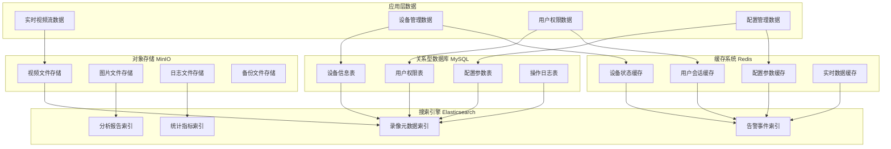

# 智能视频监控系统数据库设计

## 数据库架构概述

IOE-DREAM智慧园区智能视频监控系统采用多层次数据库架构，结合关系型数据库、缓存系统和搜索引擎，实现数据的高效存储、检索和分析。

### 数据库分层架构



## 核心数据表设计

### 1. 设备管理模块

#### 视频设备表 (t_video_devices)

```sql
CREATE TABLE t_video_devices (
    device_id BIGINT AUTO_INCREMENT PRIMARY KEY COMMENT '设备ID',
    device_code VARCHAR(50) NOT NULL UNIQUE COMMENT '设备编码',
    device_name VARCHAR(100) NOT NULL COMMENT '设备名称',
    device_type TINYINT NOT NULL COMMENT '设备类型：1-枪机，2-球机，3-半球机',
    device_model VARCHAR(50) COMMENT '设备型号',
    manufacturer VARCHAR(50) COMMENT '厂商',
    ip_address VARCHAR(15) NOT NULL COMMENT '设备IP地址',
    port INT DEFAULT 80 COMMENT '设备端口',
    username VARCHAR(50) COMMENT '登录用户名',
    password VARCHAR(100) COMMENT '登录密码（加密）',
    rtsp_url VARCHAR(255) COMMENT 'RTSP视频流地址',
    http_url VARCHAR(255) COMMENT 'HTTP访问地址',
    mac_address VARCHAR(17) COMMENT 'MAC地址',
    serial_number VARCHAR(50) COMMENT '设备序列号',

    -- 地理位置
    area_id BIGINT COMMENT '所属区域ID',
    building VARCHAR(50) COMMENT '楼栋',
    floor VARCHAR(20) COMMENT '楼层',
    location_desc VARCHAR(200) COMMENT '位置描述',
    longitude DECIMAL(10,6) COMMENT '经度',
    latitude DECIMAL(10,6) COMMENT '纬度',

    -- 设备状态
    device_status TINYINT DEFAULT 1 COMMENT '设备状态：0-离线，1-在线，2-故障',
    is_recording TINYINT DEFAULT 1 COMMENT '是否录制：0-否，1-是',
    ptz_support TINYINT DEFAULT 0 COMMENT '是否支持PTZ：0-否，1-是',
    audio_support TINYINT DEFAULT 0 COMMENT '是否支持音频：0-否，1-是',

    -- 配置信息
    resolution VARCHAR(20) DEFAULT '1920*1080' COMMENT '分辨率',
    frame_rate INT DEFAULT 25 COMMENT '帧率',
    bitrate INT DEFAULT 2048 COMMENT '码率（Kbps）',
    recording_duration INT DEFAULT 7 COMMENT '录像保存天数',

    -- 审计字段
    created_time DATETIME DEFAULT CURRENT_TIMESTAMP COMMENT '创建时间',
    updated_time DATETIME DEFAULT CURRENT_TIMESTAMP ON UPDATE CURRENT_TIMESTAMP COMMENT '更新时间',
    create_user_id BIGINT COMMENT '创建人ID',
    update_user_id BIGINT COMMENT '更新人ID',
    deleted_flag TINYINT DEFAULT 0 COMMENT '删除标记：0-正常，1-删除',

    INDEX idx_device_type (device_type),
    INDEX idx_area_id (area_id),
    INDEX idx_device_status (device_status),
    INDEX idx_created_time (created_time)
) COMMENT='视频设备信息表';
```

#### 设备组表 (t_video_device_groups)

```sql
CREATE TABLE t_video_device_groups (
    group_id BIGINT AUTO_INCREMENT PRIMARY KEY COMMENT '设备组ID',
    group_name VARCHAR(100) NOT NULL COMMENT '设备组名称',
    group_code VARCHAR(50) NOT NULL UNIQUE COMMENT '设备组编码',
    group_type TINYINT NOT NULL COMMENT '组类型：1-区域组，2-功能组，3-自定义组',
    parent_group_id BIGINT DEFAULT 0 COMMENT '父组ID，0表示根节点',
    group_level INT DEFAULT 1 COMMENT '组层级',
    sort_order INT DEFAULT 0 COMMENT '排序顺序',
    description TEXT COMMENT '描述',

    -- 统计信息
    device_count INT DEFAULT 0 COMMENT '设备数量',
    online_count INT DEFAULT 0 COMMENT '在线设备数量',

    -- 状态信息
    status TINYINT DEFAULT 1 COMMENT '状态：0-禁用，1-启用',
    created_time DATETIME DEFAULT CURRENT_TIMESTAMP COMMENT '创建时间',
    updated_time DATETIME DEFAULT CURRENT_TIMESTAMP ON UPDATE CURRENT_TIMESTAMP COMMENT '更新时间',
    create_user_id BIGINT COMMENT '创建人ID',

    INDEX idx_parent_group (parent_group_id),
    INDEX idx_group_type (group_type),
    INDEX idx_status (status)
) COMMENT='视频设备组表';
```

#### 设备组关系表 (t_video_device_group_relations)

```sql
CREATE TABLE t_video_device_group_relations (
    relation_id BIGINT AUTO_INCREMENT PRIMARY KEY COMMENT '关系ID',
    device_id BIGINT NOT NULL COMMENT '设备ID',
    group_id BIGINT NOT NULL COMMENT '设备组ID',

    created_time DATETIME DEFAULT CURRENT_TIMESTAMP COMMENT '创建时间',
    created_user_id BIGINT COMMENT '创建人ID',

    UNIQUE KEY uk_device_group (device_id, group_id),
    INDEX idx_device_id (device_id),
    INDEX idx_group_id (group_id),

    FOREIGN KEY fk_relation_device (device_id) REFERENCES t_video_devices(device_id) ON DELETE CASCADE,
    FOREIGN KEY fk_relation_group (group_id) REFERENCES t_video_device_groups(group_id) ON DELETE CASCADE
) COMMENT='设备组关系表';
```

### 2. 录像管理模块

#### 录像计划表 (t_recording_plans)

```sql
CREATE TABLE t_recording_plans (
    plan_id BIGINT AUTO_INCREMENT PRIMARY KEY COMMENT '计划ID',
    plan_name VARCHAR(100) NOT NULL COMMENT '计划名称',
    plan_code VARCHAR(50) NOT NULL UNIQUE COMMENT '计划编码',
    plan_type TINYINT NOT NULL COMMENT '计划类型：1-全局计划，2-设备组计划，3-设备计划',

    -- 录像配置
    recording_mode TINYINT DEFAULT 1 COMMENT '录像模式：1-全天录像，2-定时录像，3-移动侦测录像',
    recording_quality VARCHAR(20) DEFAULT 'HIGH' COMMENT '录像质量：LOW-低，MEDIUM-中，HIGH-高',
    frame_rate INT DEFAULT 25 COMMENT '帧率',
    resolution VARCHAR(20) DEFAULT '1920*1080' COMMENT '分辨率',
    bitrate INT DEFAULT 2048 COMMENT '码率（Kbps）',

    -- 时间配置
    start_time TIME COMMENT '开始时间',
    end_time TIME COMMENT '结束时间',
    weekdays VARCHAR(20) COMMENT '录像星期，逗号分隔1-7',

    -- 存储配置
    retention_days INT DEFAULT 7 COMMENT '保留天数',
    storage_type TINYINT DEFAULT 1 COMMENT '存储类型：1-本地存储，2-云存储，3-混合存储',

    -- 应用范围
    apply_all_devices TINYINT DEFAULT 0 COMMENT '是否应用到所有设备：0-否，1-是',
    device_ids TEXT COMMENT '设备ID列表，JSON数组格式',
    group_ids TEXT COMMENT '设备组ID列表，JSON数组格式',

    -- 状态信息
    status TINYINT DEFAULT 1 COMMENT '状态：0-禁用，1-启用',
    created_time DATETIME DEFAULT CURRENT_TIMESTAMP COMMENT '创建时间',
    updated_time DATETIME DEFAULT CURRENT_TIMESTAMP ON UPDATE CURRENT_TIMESTAMP COMMENT '更新时间',
    create_user_id BIGINT COMMENT '创建人ID',
    update_user_id BIGINT COMMENT '更新人ID',

    INDEX idx_plan_type (plan_type),
    INDEX idx_status (status),
    INDEX idx_apply_all_devices (apply_all_devices)
) COMMENT='录像计划表';
```

#### 录像文件表 (t_video_recordings)

```sql
CREATE TABLE t_video_recordings (
    recording_id BIGINT AUTO_INCREMENT PRIMARY KEY COMMENT '录像ID',
    device_id BIGINT NOT NULL COMMENT '设备ID',
    device_name VARCHAR(100) NOT NULL COMMENT '设备名称',

    -- 录像基本信息
    recording_type TINYINT NOT NULL COMMENT '录像类型：1-手动录像，2-定时录像，3-报警录像，4-移动侦测录像',
    start_time DATETIME NOT NULL COMMENT '录像开始时间',
    end_time DATETIME NOT NULL COMMENT '录像结束时间',
    duration INT NOT NULL COMMENT '录像时长（秒）',
    file_size BIGINT NOT NULL COMMENT '文件大小（字节）',

    -- 文件信息
    file_path VARCHAR(500) NOT NULL COMMENT '文件路径',
    file_name VARCHAR(255) NOT NULL COMMENT '文件名',
    file_format VARCHAR(10) NOT NULL COMMENT '文件格式：MP4,AVI,FLV等',
    thumbnail_path VARCHAR(500) COMMENT '缩略图路径',

    -- 视频质量
    resolution VARCHAR(20) COMMENT '分辨率',
    frame_rate INT COMMENT '帧率',
    bitrate INT COMMENT '码率（Kbps）',

    -- 存储信息
    storage_type TINYINT DEFAULT 1 COMMENT '存储类型：1-本地，2-云存储',
    storage_server VARCHAR(100) COMMENT '存储服务器地址',
    is_downloaded TINYINT DEFAULT 0 COMMENT '是否已下载：0-否，1-是',
    download_time DATETIME COMMENT '下载时间',

    -- 状态信息
    status TINYINT DEFAULT 1 COMMENT '状态：0-删除，1-正常，2-损坏，3-移动中',
    created_time DATETIME DEFAULT CURRENT_TIMESTAMP COMMENT '创建时间',
    updated_time DATETIME DEFAULT CURRENT_TIMESTAMP ON UPDATE CURRENT_TIMESTAMP COMMENT '更新时间',

    INDEX idx_device_id (device_id),
    INDEX idx_start_time (start_time),
    INDEX idx_end_time (end_time),
    INDEX idx_recording_type (recording_type),
    INDEX idx_status (status),
    INDEX idx_created_time (created_time),

    FOREIGN KEY fk_recording_device (device_id) REFERENCES t_video_devices(device_id) ON DELETE CASCADE
) COMMENT='录像文件表';
```

### 3. 智能分析模块

#### AI分析任务表 (t_ai_analysis_tasks)

```sql
CREATE TABLE t_ai_analysis_tasks (
    task_id BIGINT AUTO_INCREMENT PRIMARY KEY COMMENT '任务ID',
    task_name VARCHAR(100) NOT NULL COMMENT '任务名称',
    task_code VARCHAR(50) NOT NULL UNIQUE COMMENT '任务编码',
    task_type TINYINT NOT NULL COMMENT '任务类型：1-人脸检测，2-目标搜索，3-行为分析，4-异常检测',

    -- 分析配置
    analysis_algorithm VARCHAR(50) NOT NULL COMMENT '分析算法',
    confidence_threshold DECIMAL(3,2) DEFAULT 0.80 COMMENT '置信度阈值',
    detection_types VARCHAR(100) COMMENT '检测类型，JSON数组',

    -- 数据源配置
    device_ids TEXT COMMENT '设备ID列表，JSON数组格式',
    time_range_start DATETIME COMMENT '分析开始时间',
    time_range_end DATETIME COMMENT '分析结束时间',

    -- 任务状态
    task_status TINYINT DEFAULT 0 COMMENT '任务状态：0-待执行，1-执行中，2-已完成，3-失败',
    progress INT DEFAULT 0 COMMENT '执行进度（百分比）',
    start_time DATETIME COMMENT '开始执行时间',
    end_time DATETIME COMMENT '完成时间',
    error_message TEXT COMMENT '错误信息',

    -- 结果统计
    total_frames INT DEFAULT 0 COMMENT '总帧数',
    processed_frames INT DEFAULT 0 COMMENT '已处理帧数',
    detection_count INT DEFAULT 0 COMMENT '检测结果数量',

    -- 审计字段
    created_time DATETIME DEFAULT CURRENT_TIMESTAMP COMMENT '创建时间',
    updated_time DATETIME DEFAULT CURRENT_TIMESTAMP ON UPDATE CURRENT_TIMESTAMP COMMENT '更新时间',
    create_user_id BIGINT COMMENT '创建人ID',

    INDEX idx_task_type (task_type),
    INDEX idx_task_status (task_status),
    INDEX idx_created_time (created_time)
) COMMENT='AI分析任务表';
```

#### 检测结果表 (t_detection_results)

```sql
CREATE TABLE t_detection_results (
    result_id BIGINT AUTO_INCREMENT PRIMARY KEY COMMENT '结果ID',
    task_id BIGINT NOT NULL COMMENT '任务ID',
    device_id BIGINT NOT NULL COMMENT '设备ID',
    frame_timestamp DATETIME NOT NULL COMMENT '帧时间戳',

    -- 检测对象信息
    detection_type VARCHAR(20) NOT NULL COMMENT '检测类型：PERSON,VEHICLE,OBJECT,FACE',
    object_id VARCHAR(50) COMMENT '对象ID',
    class_name VARCHAR(50) COMMENT '分类名称',
    confidence DECIMAL(5,4) COMMENT '置信度',

    -- 位置信息
    x_coordinate INT NOT NULL COMMENT 'X坐标',
    y_coordinate INT NOT NULL COMMENT 'Y坐标',
    width INT NOT NULL COMMENT '宽度',
    height INT NOT NULL COMMENT '高度',

    -- 属性信息
    attributes JSON COMMENT '扩展属性，JSON格式',
    feature_vector BLOB COMMENT '特征向量',

    -- 处理状态
    is_processed TINYINT DEFAULT 0 COMMENT '是否已处理：0-否，1-是',
    process_time DATETIME COMMENT '处理时间',

    created_time DATETIME DEFAULT CURRENT_TIMESTAMP COMMENT '创建时间',

    INDEX idx_task_id (task_id),
    INDEX idx_device_id (device_id),
    INDEX idx_frame_timestamp (frame_timestamp),
    INDEX idx_detection_type (detection_type),
    INDEX idx_is_processed (is_processed),

    FOREIGN KEY fk_result_task (task_id) REFERENCES t_ai_analysis_tasks(task_id) ON DELETE CASCADE,
    FOREIGN KEY fk_result_device (device_id) REFERENCES t_video_devices(device_id) ON DELETE CASCADE
) COMMENT='检测结果表';
```

### 4. 人脸识别模块

#### 人脸库表 (t_face_libraries)

```sql
CREATE TABLE t_face_libraries (
    library_id BIGINT AUTO_INCREMENT PRIMARY KEY COMMENT '人脸库ID',
    library_name VARCHAR(100) NOT NULL COMMENT '人脸库名称',
    library_code VARCHAR(50) NOT NULL UNIQUE COMMENT '人脸库编码',
    library_type TINYINT NOT NULL COMMENT '人脸库类型：1-员工库，2-访客库，3-黑名单库，4-VIP库',

    -- 统计信息
    face_count INT DEFAULT 0 COMMENT '人脸数量',

    -- 使用场景
    access_scenarios VARCHAR(100) COMMENT '访问场景，JSON数组',

    -- 状态信息
    status TINYINT DEFAULT 1 COMMENT '状态：0-禁用，1-启用',
    created_time DATETIME DEFAULT CURRENT_TIMESTAMP COMMENT '创建时间',
    updated_time DATETIME DEFAULT CURRENT_TIMESTAMP ON UPDATE CURRENT_TIMESTAMP COMMENT '更新时间',
    create_user_id BIGINT COMMENT '创建人ID',

    INDEX idx_library_type (library_type),
    INDEX idx_status (status)
) COMMENT='人脸库表';
```

#### 人脸特征表 (t_face_features)

```sql
CREATE TABLE t_face_features (
    feature_id BIGINT AUTO_INCREMENT PRIMARY KEY COMMENT '特征ID',
    library_id BIGINT NOT NULL COMMENT '人脸库ID',
    person_id VARCHAR(50) NOT NULL COMMENT '人员ID',
    person_name VARCHAR(100) NOT NULL COMMENT '人员姓名',

    -- 人脸特征
    face_image_url VARCHAR(500) COMMENT '人脸图片URL',
    feature_vector BLOB NOT NULL COMMENT '人脸特征向量',
    feature_version VARCHAR(20) DEFAULT '1.0' COMMENT '特征版本',

    -- 图片质量
    image_quality DECIMAL(3,2) DEFAULT 0.00 COMMENT '图片质量评分',
    sharpness DECIMAL(3,2) DEFAULT 0.00 COMMENT '清晰度',
    brightness DECIMAL(3,2) DEFAULT 0.00 COMMENT '亮度',

    -- 提取信息
    device_id BIGINT COMMENT '提取设备ID',
    algorithm VARCHAR(50) NOT NULL COMMENT '提取算法',
    model_version VARCHAR(20) COMMENT '模型版本',

    -- 状态信息
    status TINYINT DEFAULT 1 COMMENT '状态：0-删除，1-正常，2-更新中',
    created_time DATETIME DEFAULT CURRENT_TIMESTAMP COMMENT '创建时间',
    updated_time DATETIME DEFAULT CURRENT_TIMESTAMP ON UPDATE CURRENT_TIMESTAMP COMMENT '更新时间',

    INDEX idx_library_id (library_id),
    INDEX idx_person_id (person_id),
    INDEX idx_status (status),
    INDEX idx_created_time (created_time),

    UNIQUE KEY uk_person_library (library_id, person_id),
    FOREIGN KEY fk_feature_library (library_id) REFERENCES t_face_libraries(library_id) ON DELETE CASCADE
) COMMENT='人脸特征表';
```

#### 人脸识别记录表 (t_face_recognition_records)

```sql
CREATE TABLE t_face_recognition_records (
    record_id BIGINT AUTO_INCREMENT PRIMARY KEY COMMENT '记录ID',
    device_id BIGINT NOT NULL COMMENT '设备ID',
    library_id BIGINT COMMENT '人脸库ID',
    person_id VARCHAR(50) COMMENT '人员ID',

    -- 识别信息
    recognition_time DATETIME NOT NULL COMMENT '识别时间',
    confidence DECIMAL(5,4) NOT NULL COMMENT '置信度',
    similarity DECIMAL(5,4) COMMENT '相似度',
    match_threshold DECIMAL(3,2) COMMENT '匹配阈值',

    -- 原始图片
    original_image_url VARCHAR(500) COMMENT '原始图片URL',
    cropped_face_url VARCHAR(500) COMMENT '裁剪人脸图片URL',

    -- 处理结果
    recognition_result TINYINT NOT NULL COMMENT '识别结果：1-成功，2-失败，3-未注册',
    failure_reason VARCHAR(100) COMMENT '失败原因',

    -- 性能信息
    processing_time INT COMMENT '处理耗时（毫秒）',

    created_time DATETIME DEFAULT CURRENT_TIMESTAMP COMMENT '创建时间',

    INDEX idx_device_id (device_id),
    INDEX idx_library_id (library_id),
    INDEX idx_person_id (person_id),
    INDEX idx_recognition_time (recognition_time),
    INDEX idx_recognition_result (recognition_result),

    FOREIGN KEY fk_record_device (device_id) REFERENCES t_video_devices(device_id) ON DELETE CASCADE,
    FOREIGN KEY fk_record_library (library_id) REFERENCES t_face_libraries(library_id) ON DELETE SET NULL
) COMMENT='人脸识别记录表';
```

### 5. 告警管理模块

#### 告警规则表 (t_alert_rules)

```sql
CREATE TABLE t_alert_rules (
    rule_id BIGINT AUTO_INCREMENT PRIMARY KEY COMMENT '规则ID',
    rule_name VARCHAR(100) NOT NULL COMMENT '规则名称',
    rule_code VARCHAR(50) NOT NULL UNIQUE COMMENT '规则编码',
    rule_type TINYINT NOT NULL COMMENT '规则类型：1-区域入侵，2-人员聚集，3-物品遗留，4-设备离线',

    -- 触发条件
    trigger_conditions JSON NOT NULL COMMENT '触发条件配置，JSON格式',

    -- 处理动作
    action_config JSON NOT NULL COMMENT '处理动作配置，JSON格式',

    -- 通知配置
    notification_config JSON NOT NULL COMMENT '通知配置，JSON格式',

    -- 执行时间配置
    execution_time_config JSON COMMENT '执行时间配置，JSON格式',

    -- 状态信息
    status TINYINT DEFAULT 1 COMMENT '状态：0-禁用，1-启用',
    priority INT DEFAULT 50 COMMENT '优先级，1-100',
    created_time DATETIME DEFAULT CURRENT_TIMESTAMP COMMENT '创建时间',
    updated_time DATETIME DEFAULT CURRENT_TIMESTAMP ON UPDATE CURRENT_TIMESTAMP COMMENT '更新时间',
    create_user_id BIGINT COMMENT '创建人ID',
    update_user_id BIGINT COMMENT '更新人ID',

    INDEX idx_rule_type (rule_type),
    INDEX idx_status (status),
    INDEX idx_priority (priority)
) COMMENT='告警规则表';
```

#### 告警事件表 (t_alert_events)

```sql
CREATE TABLE t_alert_events (
    event_id BIGINT AUTO_INCREMENT PRIMARY KEY COMMENT '事件ID',
    rule_id BIGINT NOT NULL COMMENT '规则ID',
    device_id BIGINT NOT NULL COMMENT '设备ID',

    -- 事件信息
    event_type VARCHAR(50) NOT NULL COMMENT '事件类型',
    event_level TINYINT NOT NULL COMMENT '事件级别：1-低，2-中，3-高，4-紧急',
    event_title VARCHAR(200) NOT NULL COMMENT '事件标题',
    event_description TEXT COMMENT '事件描述',

    -- 发生信息
    occur_time DATETIME NOT NULL COMMENT '发生时间',
    location VARCHAR(200) COMMENT '发生位置',

    -- 相关资源
    related_images JSON COMMENT '相关图片URL列表，JSON数组',
    related_videos JSON COMMENT '相关视频URL列表，JSON数组',

    -- 处理状态
    process_status TINYINT DEFAULT 0 COMMENT '处理状态：0-待处理，1-处理中，2-已处理，3-已忽略',
    process_result TEXT COMMENT '处理结果',
    process_time DATETIME COMMENT '处理时间',
    process_user_id BIGINT COMMENT '处理人ID',

    -- 通知状态
    notification_status TINYINT DEFAULT 0 COMMENT '通知状态：0-未发送，1-已发送，2-发送失败',

    created_time DATETIME DEFAULT CURRENT_TIMESTAMP COMMENT '创建时间',
    updated_time DATETIME DEFAULT CURRENT_TIMESTAMP ON UPDATE CURRENT_TIMESTAMP COMMENT '更新时间',

    INDEX idx_rule_id (rule_id),
    INDEX idx_device_id (device_id),
    INDEX idx_event_type (event_type),
    idx_event_level (event_level),
    idx_occur_time (occur_time),
    idx_process_status (process_status),
    idx_created_time (created_time),

    FOREIGN KEY fk_event_rule (rule_id) REFERENCES t_alert_rules(rule_id) ON DELETE CASCADE,
    FOREIGN KEY fk_event_device (device_id) REFERENCES t_video_devices(device_id) ON DELETE CASCADE
) COMMENT='告警事件表';
```

### 6. 系统管理模块

#### 操作日志表 (t_operation_logs)

```sql
CREATE TABLE t_operation_logs (
    log_id BIGINT AUTO_INCREMENT PRIMARY KEY COMMENT '日志ID',

    -- 操作信息
    operation_type VARCHAR(50) NOT NULL COMMENT '操作类型',
    operation_module VARCHAR(50) NOT NULL COMMENT '操作模块',
    operation_desc TEXT COMMENT '操作描述',

    -- 用户信息
    user_id BIGINT COMMENT '操作用户ID',
    user_name VARCHAR(50) COMMENT '操作用户名',
    user_ip VARCHAR(15) COMMENT '操作IP地址',

    -- 请求信息
    request_method VARCHAR(10) COMMENT '请求方法',
    request_url VARCHAR(500) COMMENT '请求URL',
    request_params TEXT COMMENT '请求参数',

    -- 响应信息
    response_code INT COMMENT '响应状态码',
    response_message TEXT COMMENT '响应消息',
    response_data TEXT COMMENT '响应数据',

    -- 执行信息
    execution_time INT COMMENT '执行耗时（毫秒）',
    success_flag TINYINT DEFAULT 1 COMMENT '是否成功：0-失败，1-成功',

    created_time DATETIME DEFAULT CURRENT_TIMESTAMP COMMENT '创建时间',

    INDEX idx_operation_type (operation_type),
    INDEX idx_user_id (user_id),
    INDEX idx_success_flag (success_flag),
    idx_created_time (created_time)
) COMMENT='操作日志表';
```

#### 系统配置表 (t_system_configs)

```sql
CREATE TABLE t_system_configs (
    config_id BIGINT AUTO_INCREMENT PRIMARY KEY COMMENT '配置ID',
    config_key VARCHAR(100) NOT NULL UNIQUE COMMENT '配置键',
    config_value TEXT COMMENT '配置值',
    config_desc VARCHAR(200) COMMENT '配置描述',

    -- 配置类型
    config_type VARCHAR(20) NOT NULL COMMENT '配置类型：SYSTEM-系统，VIDEO-视频，AI-智能分析',
    data_type VARCHAR(20) NOT NULL COMMENT '数据类型：STRING-字符串，NUMBER-数字，BOOLEAN-布尔值，JSON-JSON',

    -- 状态信息
    is_encrypted TINYINT DEFAULT 0 COMMENT '是否加密：0-否，1-是',
    status TINYINT DEFAULT 1 COMMENT '状态：0-禁用，1-启用',

    created_time DATETIME DEFAULT CURRENT_TIMESTAMP COMMENT '创建时间',
    updated_time DATETIME DEFAULT CURRENT_TIMESTAMP ON UPDATE CURRENT_TIMESTAMP COMMENT '更新时间',
    update_user_id BIGINT COMMENT '更新人ID',

    INDEX idx_config_key (config_key),
    INDEX idx_config_type (config_type),
    INDEX idx_status (status)
) COMMENT='系统配置表';
```

## 数据库性能优化

### 1. 索引优化策略

```sql
-- 复合索引优化
CREATE INDEX idx_device_status_type ON t_video_devices(device_status, device_type);
CREATE INDEX idx_recording_device_time ON t_video_recordings(device_id, start_time, end_time);
CREATE INDEX idx_alert_device_level ON t_alert_events(device_id, event_level, occur_time);

-- 覆盖索引优化
CREATE INDEX idx_device_covering ON t_video_devices(device_type, area_id) INCLUDE (device_name, ip_address);
CREATE INDEX idx_recording_covering ON t_video_recordings(device_id, start_time) INCLUDE (file_path, file_size, status);

-- 函数索引（MySQL 8.0+）
-- CREATE INDEX idx_detection_features ON t_detection_results ((CAST(attributes AS CHAR(255))));
```

### 2. 分区表设计

```sql
-- 按时间分区的录像表
ALTER TABLE t_video_recordings
PARTITION BY RANGE (TO_DAYS(start_time)) (
    PARTITION p202401 VALUES LESS THAN (TO_DAYS('2024-02-01')),
    PARTITION p202402 VALUES LESS THAN (TO_DAYS('2024-03-01')),
    PARTITION p202403 VALUES LESS THAN (TO_DAYS('2024-04-01')),
    PARTITION p202404 VALUES LESS THAN (TO_DAYS('2024-05-01')),
    PARTITION p202405 VALUES LESS THAN (TO_DAYS('2024-06-01')),
    PARTITION p_max VALUES LESS THAN MAXVALUE
);

-- 按月分区的告警事件表
ALTER TABLE t_alert_events
PARTITION BY RANGE (TO_DAYS(occur_time)) (
    PARTITION p202401 VALUES LESS THAN (TO_DAYS('2024-02-01')),
    PARTITION p202402 VALUES LESS THAN (TO_DAYS('2024-03-01')),
    PARTITION p202403 VALUES LESS THAN (TO_DAYS('2024-04-01')),
    PARTITION p202404 VALUES LESS THAN (TO_DAYS('2024-05-01')),
    PARTITION p202405 VALUES LESS THAN (TO_DAYS('2024-06-01')),
    PARTITION p_max VALUES LESS THAN MAXVALUE
);
```

### 3. 数据归档策略

```sql
-- 创建归档表
CREATE TABLE t_video_recordings_archive LIKE t_video_recordings;

-- 归档历史数据（超过3个月的录像记录）
CREATE EVENT archive_video_recordings
ON SCHEDULE EVERY 1 MONTH
DO
    INSERT INTO t_video_recordings_archive
    SELECT * FROM t_video_recordings
    WHERE created_time < DATE_SUB(NOW(), INTERVAL 3 MONTH);

    DELETE FROM t_video_recordings
    WHERE created_time < DATE_SUB(NOW(), INTERVAL 3 MONTH);
END;
```

### 4. 缓存策略

```java
@Configuration
public class VideoCacheConfig {

    /**
     * 设备状态缓存配置
     */
    @Bean
    @Cacheable(value = "device_status", key = "#deviceId", unless = "#result == null")
    public DeviceStatus getDeviceStatus(Long deviceId) {
        return deviceRepository.getDeviceStatus(deviceId);
    }

    /**
     * 人脸特征缓存配置
     */
    @Bean
    @Cacheable(value = "face_features", key = "#libraryId + '_' + #personId")
    public FaceFeatures getFaceFeatures(Long libraryId, String personId) {
        return faceFeatureRepository.findByLibraryIdAndPersonId(libraryId, personId);
    }

    /**
     * 录像计划缓存配置
     */
    @Bean
    @CacheEvict(value = "recording_plans", key = "#deviceId")
    public void evictRecordingPlanCache(Long deviceId) {
        // 清除设备相关的录像计划缓存
    }
}
```

## 数据同步与备份

### 1. 主从复制配置

```sql
-- 主库配置
-- my.cnf
[mysqld]
server-id = 1
log-bin = mysql-bin
binlog-format = ROW
binlog-do-db = video_monitoring

-- 从库配置
-- my.cnf
[mysqld]
server-id = 2
relay-log = relay-bin
read-only = 1
```

### 2. 数据备份策略

```bash
#!/bin/bash
# 每日备份脚本
BACKUP_DIR="/backup/video_monitoring"
DATE=$(date +%Y%m%d)
BACKUP_FILE="video_monitoring_${DATE}.sql"

# 创建备份目录
mkdir -p $BACKUP_DIR

# 执行备份
mysqldump -h localhost -u root -p --single-transaction \
  --routines --triggers \
  video_monitoring > "$BACKUP_DIR/$BACKUP_FILE"

# 压缩备份文件
gzip "$BACKUP_DIR/$BACKUP_FILE"

# 删除7天前的备份
find $BACKUP_DIR -name "*.sql.gz" -mtime +7 -delete
```

### 3. 实时同步配置

```yaml
# canal.properties配置
canal.instance.mysql.slaveId=1
canal.master.address=127.0.0.1:3306
canal.master.dbUsername=root
canal.master.dbPassword=password
canal.master.defaultDatabaseName=video_monitoring

canal.instance.connectionCharset=UTF-8
canal.mq.topic=video_monitoring_binlog

# 监听的表
canal.instance.filter.regex=video_monitoring\\..*
```

通过以上数据库设计，智能视频监控系统能够高效地处理大规模视频数据存储、检索和分析需求，为园区安防提供可靠的数据支撑。
