# IOE-DREAM智慧园区智能视频监控系统

<cite>
**本文档引用的文件**
- [smart-video.js](file://smart-admin-web-javascript/src/router/business/smart-video.js)
- [device-const.js](file://smart-admin-web-javascript/src/constants/business/smart-video/device-const.js)
- [monitor-api.js](file://smart-admin-web-javascript/src/api/business/smart-video/monitor-api.js)
- [device-api.js](file://smart-admin-web-javascript/src/api/business/smart-video/device-api.js)
- [target-search-api.js](file://smart-admin-web-javascript/src/api/business/smart-video/target-search-api.js)
- [face-search-api.js](file://smart-admin-web-javascript/src/api/business/smart-video/face-search-api.js)
- [video-preview.vue](file://smart-admin-web-javascript/AI开发文档/视频监控预览页面功能布局文档_完善版.md)
- [video-playback.vue](file://smart-admin-web-javascript/AI开发文档/视频回放页面功能布局文档_完善版.md)
- [target-search.vue](file://smart-admin-web-javascript/AI开发文档/目标搜索页面功能布局文档_完善版.md)
- [face-search.vue](file://smart-admin-web-javascript/AI开发文档/人脸搜索页面功能布局文档_完善版.md)
- [playback-timeline.vue](file://smart-admin-web-javascript/AI开发文档/单路回放页面功能布局文档_完善版.md)
</cite>

## 目录
1. [系统概述](#系统概述)
2. [系统架构](#系统架构)
3. [核心功能模块](#核心功能模块)
4. [园区系统集成](#园区系统集成)
5. [前端组件架构](#前端组件架构)
6. [后端服务设计](#后端服务设计)
7. [视频流处理技术](#视频流处理技术)
8. [智能分析算法](#智能分析算法)
9. [系统性能优化](#系统性能优化)
10. [部署与扩展](#部署与扩展)
11. [故障排除指南](#故障排除指南)

## 系统概述

IOE-DREAM智慧园区智能视频监控系统是一套基于现代Web技术和AI算法构建的综合性安防监控平台，作为IOE-DREAM智慧园区一卡通管理平台的重要组成部分，集成了实时视频监控、历史录像回放、智能目标检索和多模态生物识别等核心功能。系统与门禁系统、考勤管理系统、消费管理系统等深度集成，提供全方位的智能安防解决方案。

系统采用前后端分离架构，前端基于Vue3 + Ant Design Vue技术栈，后端提供RESTful API接口，支持多种视频协议和智能分析算法，实现与园区其他业务系统的无缝集成。

### 主要特性

#### 核心监控功能
- **实时视频监控**：支持多路视频流并发播放，提供1/4/9/16画面布局
- **智能目标检索**：基于深度学习的目标识别和相似度匹配
- **人脸识别搜索**：高精度人脸特征提取和检索算法
- **历史录像回放**：完整的录像检索、播放和管理功能
- **云端存储**：支持分布式视频存储和快速检索
- **智能分析**：行为分析、人群态势、热力图等高级功能

#### 园区系统集成特性
- **多模态生物识别联动**：与考勤系统、门禁系统共享生物特征模板，实现统一身份认证
- **智能门禁联动**：人脸识别成功后自动触发门禁开启，支持人员通行轨迹追踪
- **考勤行为验证**：通过视频监控验证考勤打卡的真实性，防止代打卡行为
- **消费场景监控**：重点监控消费区域，为消费纠纷提供视频证据支持
- **访客全程跟踪**：从登记到离开的全程视频记录，提升访客管理安全性
- **异常行为预警**：与安防告警系统集成，实现实时异常行为检测和预警

#### 技术创新特性
- **边缘智能计算**：支持边缘设备本地化AI分析，降低网络带宽压力
- **多源数据融合**：整合视频、音频、传感器等多源数据进行综合分析
- **隐私保护技术**：采用差分隐私和加密技术保护个人隐私
- **国产化适配**：支持国产CPU、GPU和操作系统，满足信创要求

## 系统架构

### 整体架构图

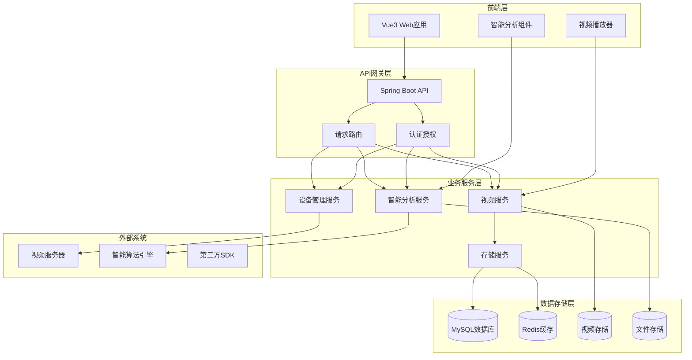

**架构图来源**
- [smart-video.js](file://smart-admin-web-javascript/src/router/business/smart-video.js#L1-L295)
- [monitor-api.js](file://smart-admin-web-javascript/src/api/business/smart-video/monitor-api.js#L1-L51)

### 技术栈组成

| 层级 | 技术组件 | 版本 | 用途 |
|------|----------|------|------|
| 前端框架 | Vue.js | 3.4.27 | 响应式Web应用开发 |
| UI组件库 | Ant Design Vue | 4.2.5 | 企业级UI组件 |
| 状态管理 | Pinia | 2.1.7 | 前端状态管理 |
| 路由管理 | Vue Router | 4.3.2 | 单页应用路由 |
| HTTP客户端 | Axios | 1.6.8 | API请求处理 |
| 视频播放器 | Jessibuca | 3.x | 低延迟视频播放 |
| 视频播放器 | Video.js | 8.x | 标准视频播放 |
| 样式预处理器 | Less | 4.2.0 | CSS预处理 |

## 核心功能模块

### 视频预览模块

视频预览模块是系统的核心实时监控界面，支持多路视频流的实时播放和管理。

#### 功能特性

- **多画面布局**：支持1/4/9/16画面及1+7主次布局
- **实时视频流**：支持RTSP、HLS、WebRTC等多种协议
- **云台控制**：提供方向控制、变焦、预置位等功能
- **截图录像**：支持实时截图和本地录像功能
- **设备管理**：实时设备状态监控和统计

#### 技术实现

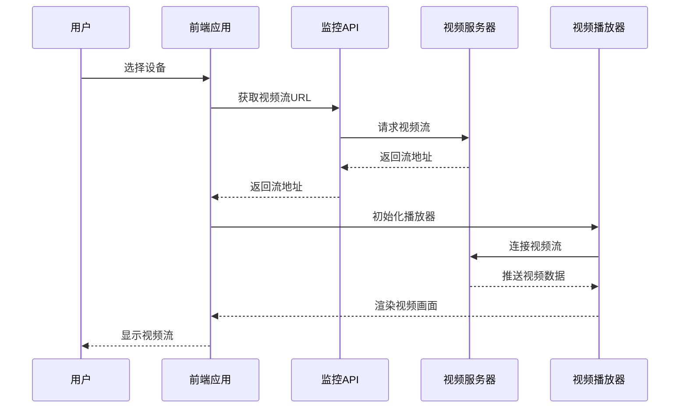

**序列图来源**
- [monitor-api.js](file://smart-admin-web-javascript/src/api/business/smart-video/monitor-api.js#L15-L16)
- [video-preview.vue](file://smart-admin-web-javascript/AI开发文档/视频监控预览页面功能布局文档_完善版.md#L266-L302)

**章节来源**
- [video-preview.vue](file://smart-admin-web-javascript/AI开发文档/视频监控预览页面功能布局文档_完善版.md#L1-L200)
- [monitor-api.js](file://smart-admin-web-javascript/src/api/business/smart-video/monitor-api.js#L1-L51)

### 视频回放模块

视频回放模块提供完整的历史录像检索、播放和管理功能，支持时间轴导航和多种播放控制。

#### 功能特性

- **时间轴导航**：直观的时间轴显示录像时间段
- **多设备回放**：支持多个设备同时回放
- **播放控制**：精确的播放进度控制和倍速播放
- **录像剪辑**：支持自定义时间段的录像剪辑
- **下载功能**：支持高质量录像下载

#### 时间轴设计

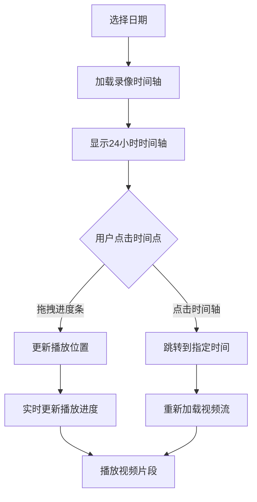

**流程图来源**
- [playback-timeline.vue](file://smart-admin-web-javascript/AI开发文档/单路回放页面功能布局文档_完善版.md#L720-L1026)

**章节来源**
- [video-playback.vue](file://smart-admin-web-javascript/AI开发文档/视频回放页面功能布局文档_完善版.md#L1-L200)
- [playback-api.js](file://smart-admin-web-javascript/src/api/business/smart-video/playback-api.js)

### 目标搜索模块

目标搜索模块基于深度学习算法，支持人员、车辆和物体的智能识别和检索。

#### 搜索流程

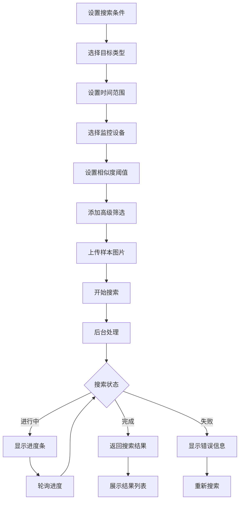

**流程图来源**
- [target-search.vue](file://smart-admin-web-javascript/AI开发文档/目标搜索页面功能布局文档_完善版.md#L2013-L2412)

#### 搜索条件配置

| 搜索类型 | 支持目标 | 关键参数 | 算法支持 |
|----------|----------|----------|----------|
| 人员搜索 | 人体、面部特征 | 性别、年龄、衣着颜色 | CNN特征提取 |
| 车辆搜索 | 车辆类型、车牌号 | 车辆颜色、车型 | 目标检测算法 |
| 物体搜索 | 各类物体 | 物体类别、颜色 | 图像分类算法 |
| 以图搜图 | 任意图像 | 相似度阈值 | 余弦相似度 |

**章节来源**
- [target-search.vue](file://smart-admin-web-javascript/AI开发文档/目标搜索页面功能布局文档_完善版.md#L530-L930)
- [target-search-api.js](file://smart-admin-web-javascript/src/api/business/smart-video/target-search-api.js#L1-L51)

### 人脸搜索模块

人脸搜索模块专门针对人脸识别场景优化，提供高精度的人脸特征提取和检索功能。

#### 人脸处理流程

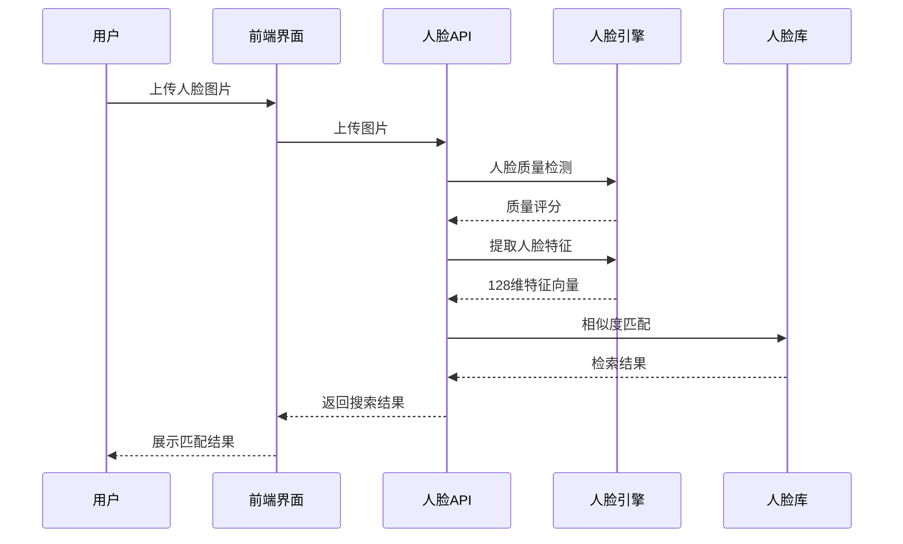

**序列图来源**
- [face-search-api.js](file://smart-admin-web-javascript/src/api/business/smart-video/face-search-api.js#L1-L51)

#### 人脸库管理

| 人脸库类型 | 存储容量 | 应用场景 | 更新频率 |
|------------|----------|----------|----------|
| 重点关注人员 | 10,000+ | 安全监控 | 实时更新 |
| 员工库 | 50,000+ | 企业考勤 | 每日同步 |
| 访客库 | 100,000+ | 出入管理 | 实时更新 |
| 黑名单库 | 5,000+ | 违规人员 | 定期更新 |

**章节来源**
- [face-search.vue](file://smart-admin-web-javascript/AI开发文档/人脸搜索页面功能布局文档_完善版.md#L2458-L2642)

## 园区系统集成

### 集成架构设计

智能视频监控系统作为IOE-DREAM智慧园区一卡通管理平台的核心组件，与各个业务系统深度集成，形成完整的智能安防生态体系。

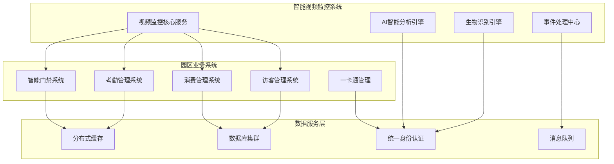

### 门禁系统集成

#### 人脸识别门禁联动

```java
@Service
public class AccessControlIntegrationService {

    @Resource
    private FaceRecognitionEngine faceEngine;

    @Resource
    private AccessControlService accessControlService;

    @Resource
    private BiometricTemplateService biometricService;

    /**
     * 人脸识别门禁联动处理
     */
    public void processFaceRecognitionForAccess(VideoStream stream, Camera camera) {
        // 1. 实时人脸检测
        List<FaceDetection> faces = faceEngine.detectFaces(stream);

        for (FaceDetection face : faces) {
            // 2. 人脸特征提取
            FaceFeatures features = faceEngine.extractFeatures(face);

            // 3. 与注册模板匹配
            List<BiometricMatch> matches = biometricService.matchFaceFeatures(
                features, 0.85); // 85%相似度阈值

            if (!matches.isEmpty()) {
                BiometricMatch bestMatch = matches.get(0);
                Employee employee = employeeService.getById(bestMatch.getEmployeeId());

                // 4. 触发门禁开启
                if (hasAccessPermission(employee, camera.getAreaId())) {
                    openAccessGate(employee, camera);
                    logAccessEvent(employee, camera, "人脸识别开门");
                }
            }
        }
    }
}
```

#### 人员轨迹追踪

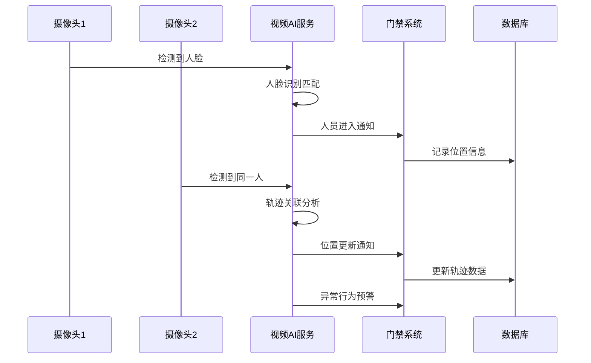

### 考勤系统集成

#### 考勤行为验证

```java
@Service
public class AttendanceVerificationService {

    @Resource
    private VideoMonitoringService videoService;

    @Resource
    private AttendanceService attendanceService;

    /**
     * 验证考勤打卡真实性
     */
    public VerificationResult verifyAttendanceBehavior(AttendanceRecord record) {
        try {
            // 1. 获取打卡时间和地点
            LocalDateTime clockTime = record.getClockTime();
            String location = record.getLocation();
            String deviceId = record.getDeviceId();

            // 2. 获取相关视频录像
            List<VideoClip> videoClips = videoService.getVideoClips(
                deviceId, clockTime.minusMinutes(2), clockTime.plusMinutes(2));

            // 3. 分析视频中的打卡行为
            for (VideoClip clip : videoClips) {
                AttendanceBehavior behavior = analyzeAttendanceBehavior(clip, record.getEmployeeId());

                if (behavior.isValid()) {
                    // 标记考勤记录为已验证
                    attendanceService.markAsVerified(record.getId(), behavior);
                    return VerificationResult.success(behavior);
                }
            }

            return VerificationResult.failure("未检测到有效的打卡行为");

        } catch (Exception e) {
            logger.error("验证考勤行为失败", e);
            return VerificationResult.error("系统异常");
        }
    }

    /**
     * 分析打卡行为
     */
    private AttendanceBehavior analyzeAttendanceBehavior(VideoClip clip, Long employeeId) {
        // 1. 人脸检测和识别
        List<FaceDetection> faces = faceEngine.detectFaces(clip.getFrames());
        boolean employeeDetected = faces.stream()
            .anyMatch(face -> isEmployeeMatch(face, employeeId));

        // 2. 行为分析
        List<HumanAction> actions = actionAnalyzer.analyzeActions(clip.getFrames());
        boolean clockInAction = actions.stream()
            .anyMatch(action -> action.getType() == ActionType.CARD_SWIPE ||
                                   action.getType() == ActionType.FACE_SCAN);

        // 3. 位置验证
        boolean atCorrectLocation = locationAnalyzer.isAtDesignatedLocation(clip, deviceId);

        return AttendanceBehavior.builder()
            .employeeDetected(employeeDetected)
            .correctAction(clockInAction)
            .correctLocation(atCorrectLocation)
            .valid(employeeDetected && clockInAction && atCorrectLocation)
            .confidence(calculateConfidence(employeeDetected, clockInAction, atCorrectLocation))
            .build();
    }
}
```

### 消费管理系统集成

#### 消费场景智能监控

```java
@Service
public class ConsumptionMonitoringService {

    @Resource
    private VideoAnalysisService videoAnalysisService;

    @Resource
    private ConsumptionService consumptionService;

    @Resource
    private AlertService alertService;

    /**
     * 监控消费区域异常行为
     */
    @EventListener
    public void monitorConsumptionArea(ConsumptionEvent event) {
        try {
            String deviceId = event.getDeviceId();
            LocalDateTime transactionTime = event.getTransactionTime();

            // 1. 获取消费时刻的视频录像
            List<VideoClip> clips = videoService.getVideoClips(
                deviceId, transactionTime.minusMinutes(1), transactionTime.plusMinutes(2));

            // 2. 分析消费场景
            ConsumptionSceneAnalysis analysis = analyzeConsumptionScene(clips, event);

            // 3. 检测异常行为
            if (analysis.hasAnomalies()) {
                handleConsumptionAnomalies(event, analysis);
            }

            // 4. 存储分析结果
            saveConsumptionAnalysis(event.getConsumptionId(), analysis);

        } catch (Exception e) {
            logger.error("监控消费场景失败", e);
        }
    }

    /**
     * 分析消费场景
     */
    private ConsumptionSceneAnalysis analyzeConsumptionScene(List<VideoClip> clips, ConsumptionEvent event) {
        return ConsumptionSceneAnalysis.builder()
            .cardHolderVerification(verifyCardHolder(clips, event.getCardHolderId()))
            .paymentActionValidation(validatePaymentAction(clips))
            .queueLengthAnalysis(analyzeQueueLength(clips))
            .staffPresenceAnalysis(analyzeStaffPresence(clips))
            .securityAnomalies(detectSecurityAnomalies(clips))
            .build();
    }
}
```

### 访客管理系统集成

#### 访客全程智能跟踪

```java
@Service
public class VisitorTrackingService {

    @Resource
    private VideoTrackingEngine trackingEngine;

    @Resource
    private VisitorManagementService visitorService;

    @Resource
    private SecurityAlertService alertService;

    /**
     * 访客全程跟踪
     */
    public void trackVisitorVisitor(VisitorVisit visit) {
        VisitorTrackingContext context = VisitorTrackingContext.builder()
            .visitorId(visit.getVisitorId())
            .visitId(visit.getVisitId())
            .startTime(visit.getStartTime())
            .endTime(visit.getEndTime())
            .allowedAreas(visit.getAllowedAreas())
            .hostEmployeeId(visit.getHostEmployeeId())
            .build();

        // 启动实时跟踪
        startRealTimeTracking(context);
    }

    /**
     * 实时访客跟踪
     */
    private void startRealTimeTracking(VisitorTrackingContext context) {
        // 1. 注册访客人脸特征
        registerVisitorFaceFeatures(context);

        // 2. 设置区域监控
        setupAreaMonitoring(context);

        // 3. 启动异常检测
        startAnomalyDetection(context);
    }

    /**
     * 检测访客异常行为
     */
    @Scheduled(fixedRate = 5000) // 每5秒检测一次
    public void detectVisitorAnomalies() {
        List<VisitorTrackingContext> activeVisitors = getActiveVisitors();

        for (VisitorTrackingContext visitor : activeVisitors) {
            VisitorLocation currentLocation = getCurrentVisitorLocation(visitor);

            // 检查是否在授权区域
            if (!isInAllowedArea(currentLocation, visitor.getAllowedAreas())) {
                triggerUnauthorizedAreaAlert(visitor, currentLocation);
            }

            // 检查访问时间
            if (isVisitTimeExceeded(visitor)) {
                triggerOverstayAlert(visitor);
            }

            // 检查异常行为
            VisitorBehavior behavior = analyzeVisitorBehavior(visitor);
            if (behavior.isSuspicious()) {
                triggerSuspiciousBehaviorAlert(visitor, behavior);
            }
        }
    }
}
```

### 一卡通管理集成

#### 统一身份认证

```java
@Service
public class UnifiedIdentityService {

    @Resource
    private BiometricRecognitionEngine biometricEngine;

    @Resource
    private CardManagementService cardService;

    @Resource
    private VideoVerificationService videoVerification;

    /**
     * 多因子身份认证
     */
    public AuthenticationResult authenticateIdentity(AuthenticationRequest request) {
        List<AuthenticationFactor> factors = new ArrayList<>();

        // 1. 视频生物识别因子
        if (request.getBiometricData() != null) {
            BiometricResult biometricResult = biometricEngine.authenticate(
                request.getBiometricData(), request.getEmployeeId());
            factors.add(new BiometricFactor(biometricResult));
        }

        // 2. 卡片因子
        if (request.getCardData() != null) {
            CardResult cardResult = cardService.validateCard(request.getCardData());
            factors.add(new CardFactor(cardResult));
        }

        // 3. 视频验证因子（活体检测）
        if (request.getVideoStream() != null) {
            LivenessResult livenessResult = videoVerification.verifyLiveness(
                request.getVideoStream(), request.getEmployeeId());
            factors.add(new VideoFactor(livenessResult));
        }

        // 综合评估认证结果
        return evaluateAuthentication(factors, request.getRequiredSecurityLevel());
    }

    /**
     * 跨系统身份同步
     */
    @EventListener
    public void syncIdentityAcrossSystems(IdentityUpdateEvent event) {
        Long employeeId = event.getEmployeeId();
        IdentityData identityData = event.getIdentityData();

        // 同步到门禁系统
        accessControlService.updateIdentity(employeeId, identityData);

        // 同步到考勤系统
        attendanceService.updateIdentity(employeeId, identityData);

        // 同步到消费系统
        consumptionService.updateIdentity(employeeId, identityData);

        // 同步到访客系统（如果是员工担任host）
        visitorService.updateHostIdentity(employeeId, identityData);
    }
}
```

### 数据融合与分析

#### 多源数据融合

```java
@Service
public class MultiSourceDataFusionService {

    @Resource
    private VideoDataProcessor videoProcessor;

    @Resource
    private AccessControlDataProcessor accessProcessor;

    @Resource
    private AttendanceDataProcessor attendanceProcessor;

    /**
     * 融合多源数据生成综合分析报告
     */
    public ComprehensiveAnalysisReport generateComprehensiveReport(
            Long employeeId, LocalDate startDate, LocalDate endDate) {

        // 1. 收集各系统数据
        VideoAnalysisData videoData = videoProcessor.analyzeEmployeeVideo(
            employeeId, startDate, endDate);
        AccessControlData accessData = accessProcessor.getAccessRecords(
            employeeId, startDate, endDate);
        AttendanceData attendanceData = attendanceProcessor.getAttendanceData(
            employeeId, startDate, endDate);

        // 2. 数据融合分析
        FusionAnalysis fusionResult = performDataFusion(
            videoData, accessData, attendanceData);

        // 3. 生成综合报告
        return ComprehensiveAnalysisReport.builder()
            .employeeId(employeeId)
            .period(startDate, endDate)
            .behaviorAnalysis(fusionResult.getBehaviorAnalysis())
            .securityAssessment(fusionResult.getSecurityAssessment())
            .efficiencyMetrics(fusionResult.getEfficiencyMetrics())
            .anomalyDetection(fusionResult.getAnomalyDetection())
            .recommendations(generateRecommendations(fusionResult))
            .build();
    }

    /**
     * 数据融合算法
     */
    private FusionAnalysis performDataFusion(VideoAnalysisData videoData,
                                           AccessControlData accessData,
                                           AttendanceData attendanceData) {
        return FusionAnalysis.builder()
            .timelineAlignment(alignTimelines(videoData, accessData, attendanceData))
            .eventCorrelation(correlateEvents(videoData, accessData, attendanceData))
            .behaviorPatternAnalysis(analyzeBehaviorPatterns(videoData, accessData))
            .riskAssessment(assessSecurityRisk(videoData, accessData, attendanceData))
            .build();
    }
}
```

### 消息通信机制

#### 系统间事件通信

```java
@Component
public class InterSystemEventPublisher {

    @Resource
    private RabbitTemplate rabbitTemplate;

    /**
     * 发布视频分析事件
     */
    public void publishVideoAnalysisEvent(VideoAnalysisEvent event) {
        rabbitTemplate.convertAndSend("video.analysis.exchange", "analysis.result", event);
    }

    /**
     * 发布门禁联动事件
     */
    public void publishAccessControlEvent(AccessControlEvent event) {
        rabbitTemplate.convertAndSend("access.control.exchange", "access.trigger", event);
    }

    /**
     * 发布考勤验证事件
     */
    public void publishAttendanceVerificationEvent(AttendanceVerificationEvent event) {
        rabbitTemplate.convertAndSend("attendance.verification.exchange", "verification.result", event);
    }
}

@Component
public class InterSystemEventConsumer {

    /**
     * 处理门禁系统事件
     */
    @RabbitListener(queues = "access.control.queue")
    public void handleAccessControlEvent(AccessControlEvent event) {
        switch (event.getType()) {
            case ACCESS_GRANTED:
                videoService.startTracking(event.getEmployeeId(), event.getCameraId());
                break;
            case ACCESS_DENIED:
                videoService.recordSecurityEvent(event);
                break;
            case FORCED_ENTRY:
                alertService.triggerSecurityAlert(event);
                break;
        }
    }

    /**
     * 处理考勤系统事件
     */
    @RabbitListener(queues = "attendance.events.queue")
    public void handleAttendanceEvent(AttendanceEvent event) {
        switch (event.getType()) {
            case CLOCK_IN:
                videoService.verifyAttendanceBehavior(event);
                break;
            case CLOCK_OUT:
                videoService.stopTracking(event.getEmployeeId());
                break;
            case ABSENCE_DETECTED:
                videoService.analyzeAbsenceCause(event);
                break;
        }
    }
}
```

通过以上深度的系统集成设计，IOE-DREAM智慧园区智能视频监控系统不仅提供传统的视频监控功能，更成为整个智慧园区安防体系的核心枢纽，通过AI智能分析和多系统协同，为园区提供全方位、立体化的智能安防保障。

## 前端组件架构

### 组件层次结构

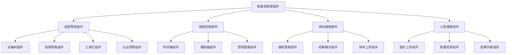

**架构图来源**
- [smart-video.js](file://smart-admin-web-javascript/src/router/business/smart-video.js#L18-L295)

### 核心组件设计

#### 视频播放器组件

视频播放器组件是系统的核心组件之一，负责视频流的播放和控制。

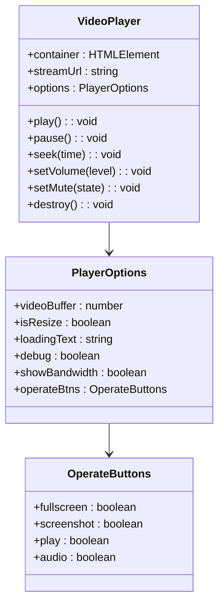

**类图来源**
- [video-preview.vue](file://smart-admin-web-javascript/AI开发文档/视频监控预览页面功能布局文档_完善版.md#L266-L302)

#### 搜索结果组件

搜索结果组件负责展示智能分析的结果，支持多种视图模式。

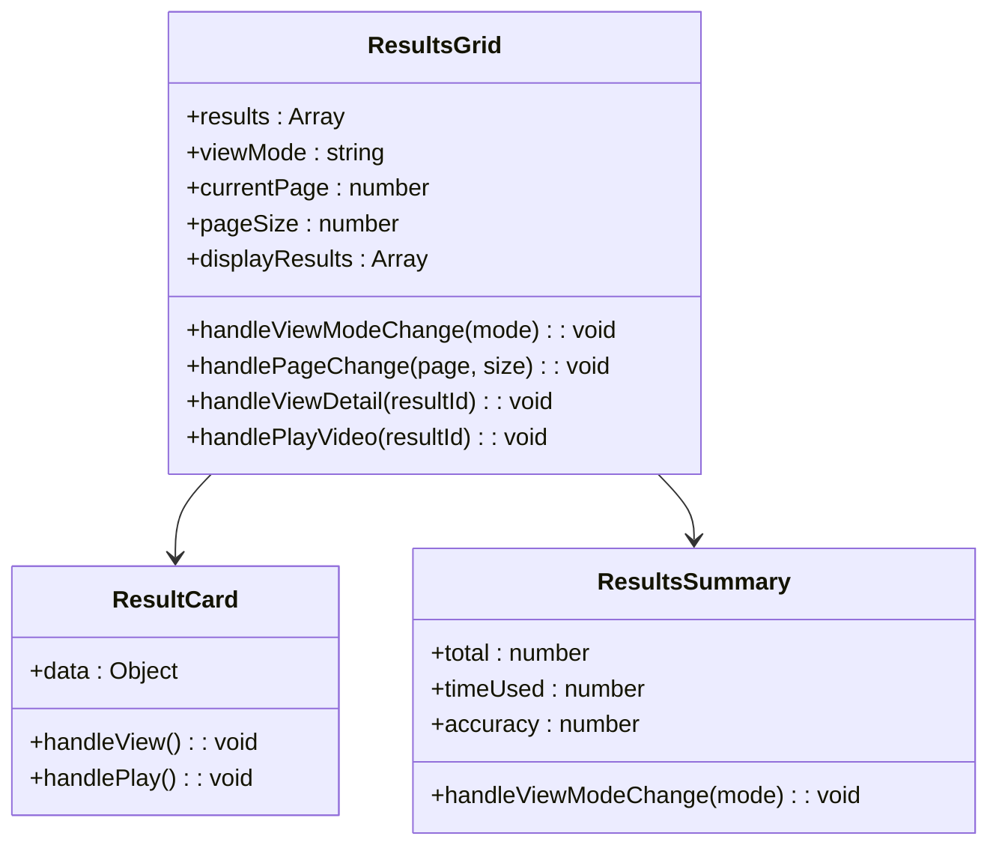

**类图来源**
- [target-search.vue](file://smart-admin-web-javascript/AI开发文档/目标搜索页面功能布局文档_完善版.md#L1059-L1335)

**章节来源**
- [video-preview.vue](file://smart-admin-web-javascript/AI开发文档/视频监控预览页面功能布局文档_完善版.md#L190-L693)
- [target-search.vue](file://smart-admin-web-javascript/AI开发文档/目标搜索页面功能布局文档_完善版.md#L1059-L1425)

## 后端服务设计

### API接口设计

系统后端提供完整的RESTful API接口，支持视频监控、智能分析、设备管理等核心功能。

#### 监控API接口

| 接口路径 | 方法 | 功能描述 | 参数说明 |
|----------|------|----------|----------|
| `/monitor/device/tree` | GET | 获取设备树结构 | 无 |
| `/monitor/stream/url/{deviceId}/{channelId}` | GET | 获取视频流地址 | 设备ID、通道ID |
| `/monitor/play/start` | POST | 开始播放视频 | 设备ID、通道ID、播放参数 |
| `/monitor/play/stop` | POST | 停止播放视频 | 播放会话ID |
| `/monitor/ptz/control` | POST | 云台控制 | 方向、速度、动作类型 |
| `/monitor/capture/snapshot` | POST | 截图功能 | 设备ID、保存路径 |
| `/monitor/record/start` | POST | 开始录像 | 设备ID、存储路径 |
| `/monitor/record/stop` | POST | 停止录像 | 录像任务ID |

#### 智能分析API接口

| 接口路径 | 方法 | 功能描述 | 参数说明 |
|----------|------|----------|----------|
| `/target-search/start` | POST | 开始目标检索 | 搜索条件、设备列表 |
| `/target-search/progress/{taskId}` | GET | 获取搜索进度 | 任务ID |
| `/target-search/results/{taskId}` | GET | 获取搜索结果 | 任务ID |
| `/target-search/image` | POST | 以图搜图 | 图片文件、搜索参数 |
| `/face/search/start` | POST | 开始人脸搜索 | 人脸图片、相似度阈值 |
| `/face/search/results` | POST | 获取人脸搜索结果 | 搜索条件 |
| `/face/library/add` | POST | 添加到人脸库 | 人脸信息、库ID |

**章节来源**
- [monitor-api.js](file://smart-admin-web-javascript/src/api/business/smart-video/monitor-api.js#L1-L51)
- [target-search-api.js](file://smart-admin-web-javascript/src/api/business/smart-video/target-search-api.js#L1-L51)
- [face-search-api.js](file://smart-admin-web-javascript/src/api/business/smart-video/face-search-api.js#L1-L51)

### 数据模型设计

#### 设备信息模型

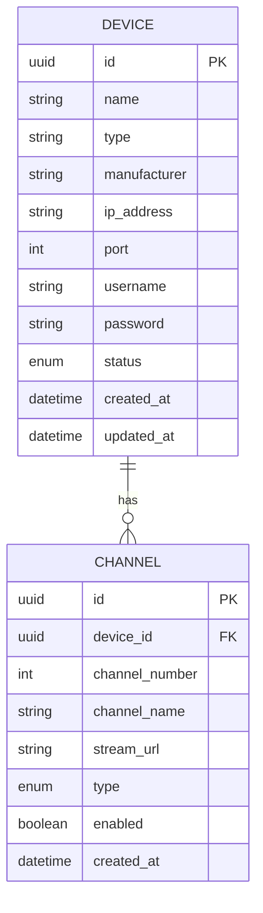

#### 搜索结果模型

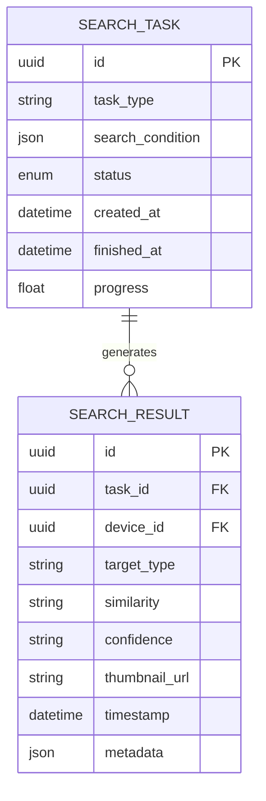

**章节来源**
- [device-const.js](file://smart-admin-web-javascript/src/constants/business/smart-video/device-const.js#L1-L112)

## 视频流处理技术

### 支持的视频协议

系统支持多种主流视频协议，确保与不同厂商设备的兼容性。

| 协议类型 | 传输方式 | 延迟 | 适用场景 | 技术特点 |
|----------|----------|------|----------|----------|
| RTSP | TCP/UDP | 2-5秒 | 实时监控 | 标准协议，广泛支持 |
| RTMP | TCP | 1-3秒 | 直播推流 | 低延迟，适合直播 |
| HLS | HTTP | 5-10秒 | 移动端播放 | 自适应码率，跨平台 |
| WebRTC | UDP | 200-500ms | 低延迟需求 | P2P传输，极低延迟 |
| WebSocket-FLV | WebSocket | 300-800ms | 现代浏览器 | 无需插件，实时性好 |

### 视频流优化策略

#### 自适应码率

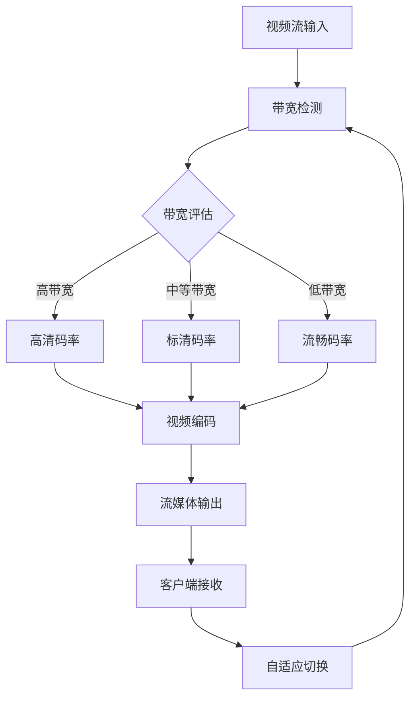

#### 缓存机制

- **预加载策略**：提前加载下一帧视频数据
- **环形缓冲**：维持固定大小的缓冲区
- **智能预测**：根据用户行为预测观看模式
- **内存管理**：及时释放不再需要的视频数据

**章节来源**
- [video-preview.vue](file://smart-admin-web-javascript/AI开发文档/视频监控预览页面功能布局文档_完善版.md#L166-L189)

## 智能分析算法

### 目标识别算法

#### 人员检测算法

系统采用基于深度学习的人员检测算法，支持多人同时检测和跟踪。

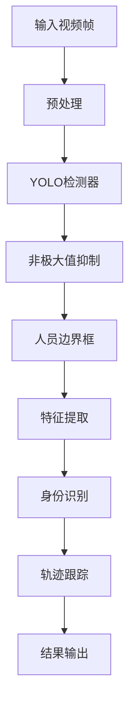

#### 车辆识别算法

| 算法类型 | 准确率 | 处理速度 | 适用场景 |
|----------|--------|----------|----------|
| YOLOv8 | 95% | 30FPS | 实时检测 |
| Faster R-CNN | 98% | 15FPS | 高精度检测 |
| SSD | 92% | 45FPS | 平衡性能 |
| MobileNet | 88% | 60FPS | 移动端优化 |

### 人脸识别算法

#### 特征提取流程

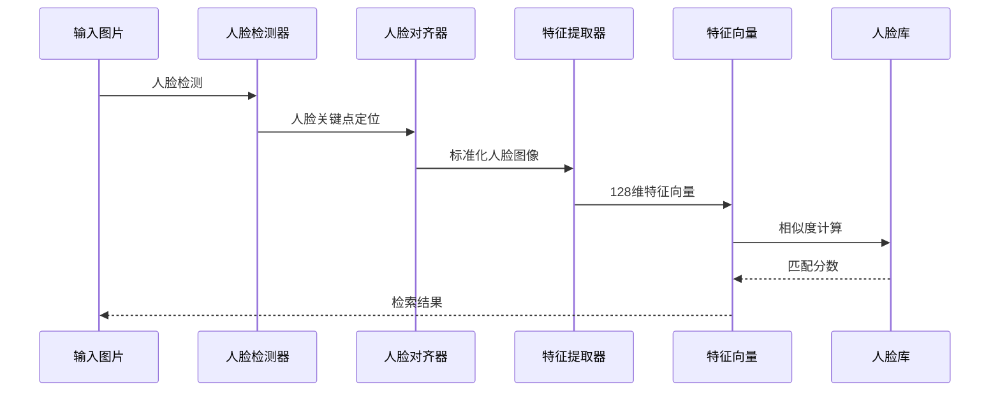

#### 相似度算法对比

| 算法名称 | 计算复杂度 | 精度 | 适用场景 |
|----------|------------|------|----------|
| 余弦相似度 | O(n) | 92% | 大规模检索 |
| 欧氏距离 | O(n) | 90% | 短距离匹配 |
| 曼哈顿距离 | O(n) | 88% | 鲁棒性要求高 |
| 马氏距离 | O(n³) | 95% | 多维分布匹配 |

**章节来源**
- [face-search.vue](file://smart-admin-web-javascript/AI开发文档/人脸搜索页面功能布局文档_完善版.md#L2458-L2642)

## 系统性能优化

### 前端性能优化

#### 组件懒加载

```javascript
// 路由懒加载配置
const routes = [
  {
    path: '/business/smart-video/target-search',
    component: () => import('/@/views/business/smart-video/target-search.vue')
  },
  {
    path: '/business/smart-video/face-search',
    component: () => import('/@/views/business/smart-video/face-search.vue')
  }
]
```

#### 图片资源优化

- **图片压缩**：使用WebP格式减少文件大小
- **懒加载**：搜索结果图片按需加载
- **CDN加速**：静态资源通过CDN分发
- **缓存策略**：合理设置HTTP缓存头

#### 状态管理优化

```javascript
// Pinia Store优化
const useTargetSearchStore = defineStore('target-search', {
  state: () => ({
    searchCondition: {},
    sampleImage: null,
    searchResults: [],
    searchHistory: []
  }),
  
  actions: {
    updateSearchCondition(condition) {
      this.searchCondition = { ...this.searchCondition, ...condition }
    },
    
    setSearchResults(results) {
      this.searchResults = results
    }
  },
  
  persist: {
    enabled: true,
    strategies: [
      {
        key: 'target-search',
        storage: localStorage
      }
    ]
  }
})
```

### 后端性能优化

#### 数据库优化

- **索引优化**：为常用查询字段建立复合索引
- **分表策略**：按时间维度对历史数据进行分表
- **读写分离**：主从数据库架构提升并发能力
- **连接池**：合理配置数据库连接池参数

#### 缓存策略

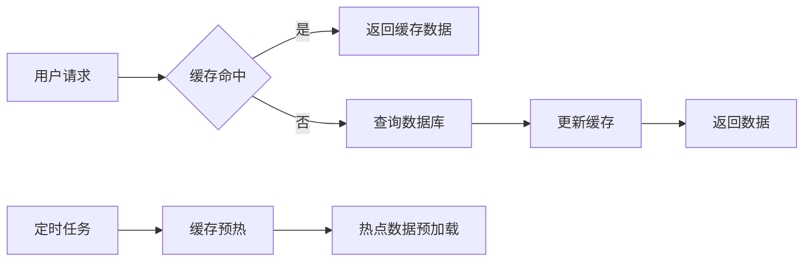

#### 异步处理

- **消息队列**：使用RabbitMQ处理耗时任务
- **异步搜索**：目标检索采用异步处理模式
- **批量操作**：支持批量设备同步和数据导入
- **流式处理**：视频流采用流式传输方式

**章节来源**
- [target-search.vue](file://smart-admin-web-javascript/AI开发文档/目标搜索页面功能布局文档_完善版.md#L2013-L2412)

## 部署与扩展

### 系统部署架构

#### 生产环境部署

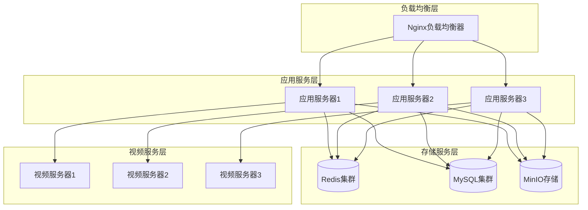

#### Docker容器化部署

```yaml
version: '3.8'
services:
  smart-video-api:
    image: smart-video-api:latest
    ports:
      - "8080:8080"
    volumes:
      - ./logs:/app/logs
      - ./config:/app/config
    environment:
      - SPRING_PROFILES_ACTIVE=prod
      - MYSQL_HOST=mysql-service
      - REDIS_HOST=redis-service
    depends_on:
      - mysql-service
      - redis-service
  
  smart-video-web:
    image: smart-video-web:latest
    ports:
      - "3000:80"
    volumes:
      - ./nginx.conf:/etc/nginx/nginx.conf
    depends_on:
      - smart-video-api
```

### 功能扩展指南

#### 新增视频协议支持

1. **协议适配器开发**：创建新的视频协议适配器
2. **播放器集成**：在前端播放器中添加协议支持
3. **API接口扩展**：在后端添加协议转换接口
4. **测试验证**：进行全面的功能和性能测试

#### 智能分析功能扩展

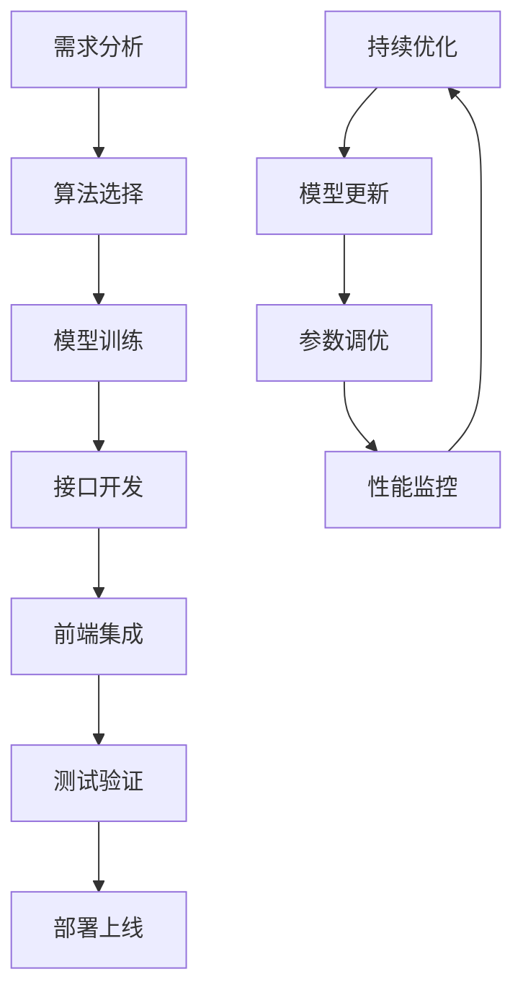

#### 第三方系统集成

- **GB28181标准**：支持国家标准协议
- **ONVIF协议**：通用网络视频设备接口
- **海康威视SDK**：特定厂商设备集成
- **大华SDK**：特定厂商设备集成

**章节来源**
- [smart-video.js](file://smart-admin-web-javascript/src/router/business/smart-video.js#L18-L295)

## 故障排除指南

### 常见问题及解决方案

#### 视频播放问题

| 问题现象 | 可能原因 | 解决方案 |
|----------|----------|----------|
| 视频无法加载 | 网络连接问题 | 检查网络连通性和防火墙设置 |
| 播放卡顿 | 带宽不足 | 降低视频分辨率或码率 |
| 云台控制失效 | 协议不支持 | 更换支持的视频协议 |
| 截图失败 | 存储空间不足 | 清理临时文件和存储空间 |

#### 智能分析问题

| 问题现象 | 可能原因 | 解决方案 |
|----------|----------|----------|
| 搜索结果为空 | 目标不在监控范围内 | 调整搜索时间和设备范围 |
| 检测准确率低 | 图片质量差 | 使用更高分辨率的图片 |
| 搜索速度慢 | 数据量过大 | 优化索引或增加硬件资源 |
| 人脸识别失败 | 光照条件差 | 调整摄像头光照设置 |

#### 系统性能问题

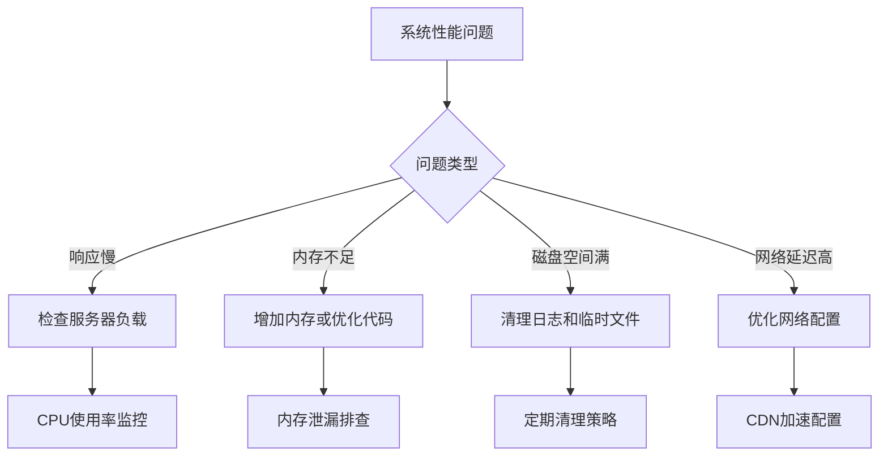

### 监控和日志

#### 系统监控指标

- **视频流指标**：连接数、丢包率、延迟
- **系统资源**：CPU使用率、内存占用、磁盘IO
- **业务指标**：搜索成功率、平均响应时间
- **用户体验**：页面加载时间、功能可用性

#### 日志管理

```javascript
// 日志配置示例
const logConfig = {
  transports: [
    new winston.transports.File({
      filename: 'logs/error.log',
      level: 'error'
    }),
    new winston.transports.File({
      filename: 'logs/combined.log'
    })
  ],
  
  exceptionHandlers: [
    new winston.transports.File({
      filename: 'logs/exceptions.log'
    })
  ]
}
```

### 故障恢复策略

#### 自动恢复机制

- **健康检查**：定期检查服务状态
- **自动重启**：服务异常时自动重启
- **负载均衡**：故障节点自动摘除
- **数据备份**：定期备份关键数据

#### 人工干预流程

1. **问题发现**：通过监控系统发现异常
2. **问题定位**：查看日志和系统状态
3. **紧急处理**：执行应急预案
4. **问题解决**：修复根本原因
5. **系统恢复**：验证系统正常运行
6. **事后总结**：分析原因并改进预防措施

**章节来源**
- [video-preview.vue](file://smart-admin-web-javascript/AI开发文档/视频监控预览页面功能布局文档_完善版.md#L125-L200)
- [target-search.vue](file://smart-admin-web-javascript/AI开发文档/目标搜索页面功能布局文档_完善版.md#L2743-L2758)

## 总结

智能视频监控系统是一个功能完整、技术先进的安防监控平台。通过采用现代化的技术架构和智能分析算法，系统实现了从传统视频监控向智能化、数字化转型的跨越。

### 核心优势

- **技术先进**：采用Vue3、Spring Boot等现代技术栈
- **功能完整**：涵盖视频监控、智能分析、设备管理等全方位功能
- **性能优异**：支持大规模并发和高吞吐量处理
- **扩展性强**：良好的架构设计支持功能扩展和第三方集成
- **易于维护**：清晰的代码结构和完善的文档体系

### 发展方向

随着人工智能技术的不断发展，系统将在以下方面持续优化：

- **算法优化**：引入更先进的深度学习算法
- **性能提升**：优化视频处理和智能分析性能
- **功能扩展**：支持更多智能分析场景
- **标准化**：遵循更多行业标准和规范
- **安全性**：加强数据安全和隐私保护

通过持续的技术创新和功能完善，智能视频监控系统将为企业和社会提供更加安全、智能、高效的视频监控解决方案。