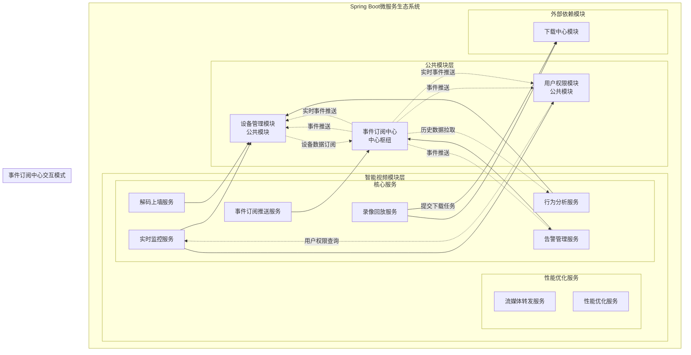
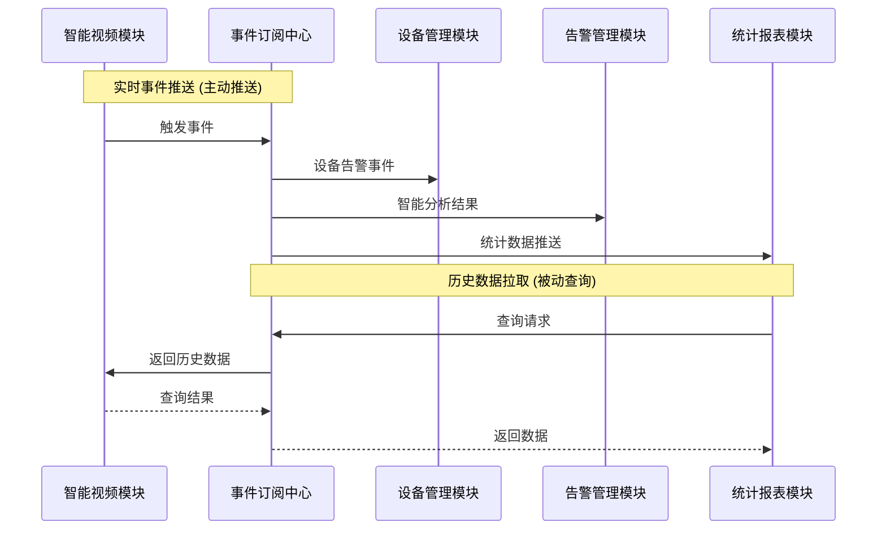
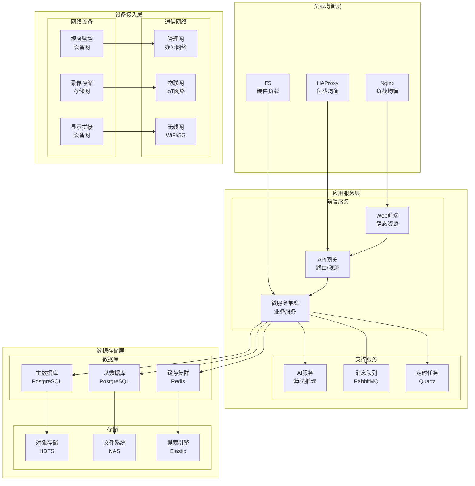

# 智能视频监控系统架构设计

> **版本**: v1.0
> **更新时间**: 2025-11-13
> **分类**: 核心功能模块 > 智能视频监控系统
> **标签**: ["视频监控", "微服务架构", "Spring Boot", "AI分析", "实时监控"]
> **作者**: SmartAdmin规范治理委员会
> **描述**: IOE-DREAM智慧园区一卡通管理平台智能视频监控模块的完整架构设计文档

## 📋 项目概述

### 项目定位

**智能视频监控模块**是安防系统的核心业务模块，专注于提供完整的视频监控解决方案。本模块采用**Spring Boot分布式微服务架构**，作为独立微服务与其他模块协同工作，通过**事件订阅中心**进行数据交互。

### 微服务边界说明

**✅ 包含模块**：
- 实时监控服务
- 录像回放服务
- 行为分析服务
- 告警管理服务
- 解码上墙服务
- 事件订阅服务

**❌ 不包含（依赖外部模块）**：
- 设备管理（依赖公共设备管理模块，通过订阅获取设备数据）
- 用户权限（依赖公共用户权限模块进行认证授权）
- 系统日志（依赖公共系统管理模块）
- 视频下载（依赖下载中心模块，提交任务即可）
- 地图显示（已移除该功能）

### 核心特性

- **🔐 五级安全体系**：绝密、机密、秘密、内部、公开
- **📹 实时监控**：多画面、多协议、多格式视频流、流媒体转发优化
- **🎥 录像回放**：高效查询、快速定位、时间轴预览、多倍速播放
- **🤖 AI智能分析**：人脸识别、行为分析、异常检测、低延时联动抓拍
- **🚨 告警管理**：实时告警、设备离线告警、智能联动、自动处理
- **🔔 事件订阅中心**：混合推送模式、实时事件推送、历史数据拉取
- **💧 水印支持**：可自定义水印配置（由下载中心实现）
- **⚡ 性能优化**：大规模摄像头并发处理、流媒体转发、懒加载

## 🏗️ 微服务架构与跨模块交互图

### 事件订阅中心交互模式（混合模式）

## 🎯 设计原则

### 1. 安全性原则
- **五级安全控制**：基于安全级别的细粒度权限控制
- **数据加密**：敏感数据加密存储和传输
- **操作审计**：完整的操作日志和审计追踪
- **异常检测**：实时监控异常访问行为

### 2. 高性能原则
- **多级缓存**：本地缓存 + 分布式缓存 + 数据库缓存
- **读写分离**：主从架构，提升读写性能
- **分库分表**：水平拆分，支持海量数据
- **异步处理**：消息队列异步处理耗时任务

### 3. 高可用原则
- **集群部署**：支持多节点集群部署
- **故障转移**：自动故障检测和切换
- **服务熔断**：防止雪崩效应
- **监控告警**：全方位监控和自动告警

### 4. 可扩展原则
- **微服务架构**：服务拆分，独立部署
- **插件机制**：支持功能插件扩展
- **协议支持**：多协议设备接入
- **API开放**：提供开放API接口

### 5. 易用性原则
- **直观界面**：符合用户习惯的界面设计
- **操作简化**：简化复杂操作流程
- **智能提示**：提供操作引导和提示
- **多语言支持**：国际化支持

## 📦 模块清单

### 核心业务模块

#### 1. 实时监控模块
- **功能描述**：实时视频预览、云台控制、截图录像
- **主要特性**：
  - 多画面布局（1/4/9/16/25画面）
  - 多种视频流协议支持（RTSP/RTMP/HLS/WebRTC）
  - 云台控制（方向、变焦、巡航）
  - 实时截图和录像
  - 画面控制（缩放、旋转、镜像）

#### 2. 设备管理交互模块（从公共模块获取）
- **功能描述**：设备数据获取、状态监控、联动抓拍
- **主要特性**：
  - 设备数据订阅（从设备管理模块获取设备信息）
  - 设备状态监控（在线状态、性能指标）
  - 设备离线告警（检测设备心跳，超时触发告警）
  - 联动抓拍（低延时控制，目标<200ms）
  - 设备数据缓存（缓存热点设备数据）

#### 3. 录像回放模块
- **功能描述**：录像查询、回放、预览、水印配置
- **主要特性**：
  - 多条件查询（时间、设备、事件）
  - 回放控制（播放、暂停、倍速、跳转）
  - **时间轴预览**（可视化波形，快速定位）
  - **下载前预览**（支持实时流预览和缩略图预览）
  - **水印配置**（自定义水印内容、位置、大小，传递给下载中心）
  - 录像管理（列表、删除、备份）
  - 录像统计

#### 4. 行为分析模块
- **功能描述**：AI算法配置、行为检测、异常识别
- **主要特性**：
  - AI算法管理（人脸识别、行为分析）
  - 检测规则配置（区域、时段、规则）
  - 异常行为识别（徘徊、聚集、摔倒）
  - 分析结果查看（事件列表、统计图表）
  - **联动抓拍延时控制**（目标<200ms）
  - 算法性能监控
  - **分析结果推送**（通过事件订阅中心推送给其他模块）

#### 5. 告警管理模块
- **功能描述**：告警配置、事件处理、联动控制
- **主要特性**：
  - 告警规则配置（条件、联动、通知）
  - **设备离线告警**（检测设备心跳超时）
  - 告警事件查看（实时、历史、统计）
  - 告警处理（确认、处理、反馈）
  - 告警联动（视频联动、门禁联动）
  - 告警统计（数量、趋势、分布）
  - **告警事件发布**（通过事件订阅中心发布）

#### 6. 解码上墙模块
- **功能描述**：解码器管理、大屏控制、多屏联动
- **主要特性**：
  - 解码器管理（注册、配置、状态）
  - 大屏布局配置（窗口、尺寸、位置）
  - 视频上墙显示（实时视频、回放画面）
  - 多屏联动控制（同步、轮询、分组）
  - 显示效果调节（亮度、对比度、色调）

#### 7. 事件订阅交互模块
- **功能描述**：事件订阅、数据推送、跨模块交互
- **主要特性**：
  - **混合推送模式**（实时事件推送 + 历史数据拉取）
  - 事件订阅管理（订阅规则、过滤条件）
  - 数据推送机制（实时推送、批量推送）
  - 推送记录统计（发送量、成功率、延迟）
  - **跨模块数据交互**（与其他微服务数据交换）

#### 8. 性能优化服务
- **功能描述**：流媒体转发、大规模并发优化
- **主要特性**：
  - **流媒体转发服务**（减少摄像头直连压力）
  - **大规模摄像头并发优化**（支持1000+路并发）
  - 懒加载机制（按需加载摄像头画面）
  - 分级联方案（分级显示不同优先级设备）
  - 缓存优化（多级缓存机制）

### 公共支撑模块

#### 1. 用户权限模块
- **用户管理**：用户CRUD、组织架构
- **角色管理**：角色定义、权限分配
- **安全级别**：5级安全控制体系
- **操作审计**：操作日志、行为追踪

#### 2. 区域管理模块
- **区域定义**：树形区域结构
- **设备归属**：设备归属区域管理
- **权限分配**：区域权限控制
- **区域联动**：跨区域联动控制

#### 3. 系统配置模块
- **参数配置**：系统参数配置
- **模板管理**：设备模板、告警模板
- **文件管理**：文件上传、下载、存储
- **日志管理**：日志配置、查询、清理

## 📊 性能指标

### 响应时间指标

| 操作类型 | 目标响应时间 | 可接受响应时间 |
|---------|-------------|---------------|
| 页面加载 | < 2秒 | < 5秒 |
| 实时预览 | < 1秒 | < 3秒 |
| **联动抓拍响应** | **< 200ms** | **< 500ms** |
| 录像查询 | < 3秒 | < 8秒 |
| 录像回放 | < 2秒 | < 5秒 |
| **时间轴预览生成** | **< 1秒** | **< 3秒** |
| 告警响应 | < 0.5秒 | < 2秒 |

### 并发性能指标

| 指标类型 | 目标值 | 最大值 |
|---------|-------|-------|
| 同时在线用户 | 500 | 1000 |
| **同时预览画面** | **2000** | **5000** |
| **大规模摄像头接入** | **1000路** | **5000路** |
| 同时回放路数 | 500 | 1000 |
| 告警并发处理 | 1000 | 2000 |
| API并发请求 | 2000 | 5000 |

### 性能优化策略指标

| 优化策略 | 性能提升目标 | 实施方式 |
|---------|-------------|----------|
| **流媒体转发** | **减少80%直连压力** | 流媒体服务器集群 |
| **懒加载机制** | **提升50%页面加载速度** | 按需加载摄像头 |
| **分级联方案** | **支持5000+路设备** | 优先级分级显示 |
| **多级缓存** | **命中率>90%** | L1/L2/L3缓存架构 |
| **读写分离** | **提升200%读性能** | 主从集群架构 |

### 存储性能指标

| 存储类型 | 容量 | 性能 |
|---------|------|------|
| 数据库存储 | 10TB | 10万QPS |
| 缓存存储 | 100GB | 50万QPS |
| 文件存储 | 100TB | 1万QPS |
| 录像存储 | 1PB | 5千路并发 |

## 🚀 部署架构

### 部署拓扑

### 集群部署方案

#### 1. Web前端集群
- **节点数量**：2-4个节点
- **负载均衡**：Nginx + Keepalived
- **静态资源**：CDN加速
- **会话保持**：Redis会话存储

#### 2. API网关集群
- **节点数量**：2-3个节点
- **路由规则**：基于URL和权重
- **限流熔断**：Sentinel
- **API监控**：SkyWalking

#### 3. 微服务集群
- **节点数量**：3-10个节点（根据业务量）
- **服务发现**：Nacos
- **配置管理**：Nacos Config
- **链路追踪**：Micrometer Tracing + Zipkin

#### 4. 数据库集群
- **主从配置**：1主2从
- **读写分离**：主库写、从库读
- **故障切换**：MHA/PGTools
- **备份策略**：每日全量 + 实时增量

#### 5. 缓存集群
- **集群模式**：Redis Cluster
- **节点数量**：6个节点（3主3从）
- **数据分片**：16384个哈希槽
- **持久化**：RDB + AOF

## 🔗 相关文档

### 技术架构文档
- [数据库设计](./数据库设计.md) - 数据库表结构和ER图设计
- [接口设计规范](./接口设计规范.md) - API接口规范和文档
- [安全级别详细设计](./安全级别详细设计.md) - 五级安全体系设计
- [功能模块详细设计](./功能模块详细设计.md) - 各功能模块详细设计

### 用户界面文档
- [界面原型图设计](./界面原型图设计.md) - 前端界面原型设计
- [用户操作手册](./用户操作手册.md) - 用户操作指南

### 部署运维文档
- [部署指南](../部署指南.md) - 系统部署和配置指南
- [性能优化指南](../技术架构/性能优化.md) - 性能调优和优化策略

---

## 🎯 核心原则总结

1. **微服务架构** - 服务拆分，独立部署，便于扩展和维护
2. **事件驱动** - 通过事件订阅中心实现模块间松耦合通信
3. **性能优先** - 流媒体转发、懒加载、多级缓存等优化策略
4. **安全第一** - 五级安全体系，细粒度权限控制
5. **高可用设计** - 集群部署，故障转移，服务熔断

## 📋 版本信息

- 本文档基于智能视频模块完整设计文档系统
- 架构设计负责人：SmartAdmin规范治理委员会
- 创建日期：2025-11-13
- 下次评审：2026-02-13

---

**🎯 IOE-DREAM智能视频监控系统架构设计 - 微服务、高性能、高可用的企业级视频监控解决方案**