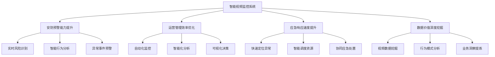
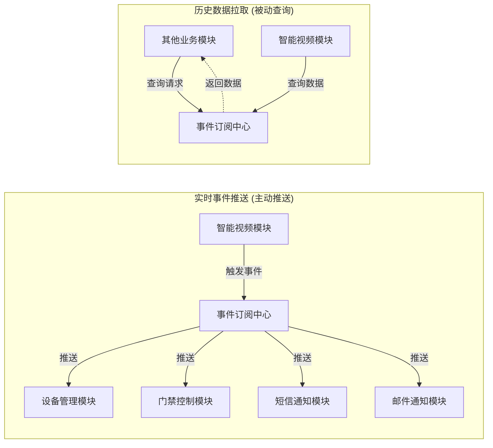
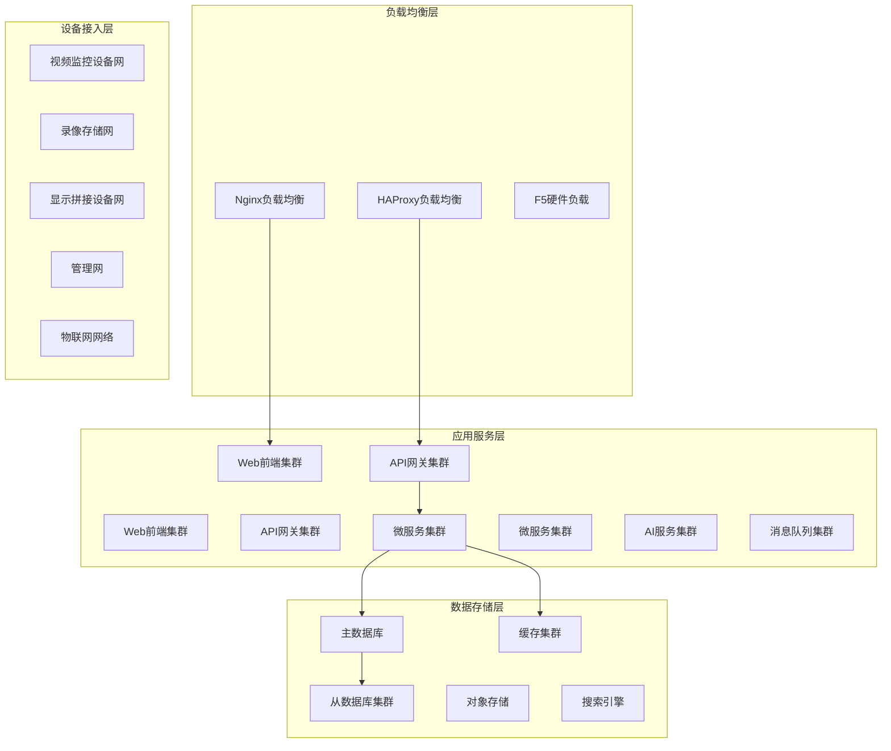

# IOE-DREAM智慧园区一卡通管理平台 - 智能视频监控系统项目概述与系统架构

> **智慧安防 · AI赋能 · 全面监控**
> **更新时间**: 2025-11-13
> **版本**: v4.0
> **文档类型**: 项目概述与系统架构

## 📋 项目概述

### 项目定位与战略价值

**智能视频监控系统**作为IOE-DREAM智慧园区一卡通管理平台的核心安防模块，采用**Spring Boot分布式微服务架构**，专注于提供完整的AI智能视频监控解决方案。本模块通过**事件订阅中心**与其他业务模块协同工作，实现全域安防智能化管理。

#### 核心定位
- **安防体系核心**：承担智慧园区安防监控的中枢角色
- **AI智能中枢**：集成人脸识别、行为分析等智能算法
- **数据融合平台**：多源异构数据的统一接入与处理
- **联动指挥中心**：跨模块协同、应急响应的统一调度

#### 业务价值


### 微服务架构边界

#### ✅ 核心包含模块

| 模块名称 | 功能职责 | 技术特性 |
|---------|---------|---------|
| **实时监控服务** | 视频流处理、多画面展示 | WebRTC、RTMP、HLS多协议支持 |
| **录像回放服务** | 历史视频查询、回放控制 | 时间轴预览、智能检索 |
| **行为分析服务** | AI算法集成、智能识别 | 深度学习、实时分析 |
| **告警管理服务** | 异常检测、事件处理 | 多级告警、智能联动 |
| **解码上墙服务** | 大屏控制、解码管理 | 多屏联动、画面拼接 |
| **事件订阅服务** | 跨模块通信、数据推送 | 混合推送模式、实时通信 |

#### ❌ 外部依赖模块

| 依赖模块 | 获取方式 | 交互内容 |
|---------|---------|---------|
| **设备管理模块** | 事件订阅 | 设备信息、状态数据、配置变更 |
| **用户权限模块** | API调用 | 身份认证、权限控制、安全级别 |
| **系统日志模块** | 事件发布 | 操作日志、审计记录、异常追踪 |
| **下载中心模块** | 任务提交 | 视频下载、水印添加、文件管理 |
| **地图服务模块** | API集成 | 位置标注、地理围栏、路径规划 |

### 核心技术特性

#### 🔐 五级安全体系
```java
/**
 * 安全级别枚举定义
 */
public enum SecurityLevel {
    TOP_SECRET(1, "绝密级", "最高级别安全控制"),
    SECRET(2, "机密级", "高级别安全控制"),
    CONFIDENTIAL(3, "秘密级", "中级别安全控制"),
    INTERNAL(4, "内部级", "基础级别安全控制"),
    PUBLIC(5, "公开级", "最低级别安全控制");

    private final int code;
    private final String name;
    private final String description;
}
```

#### 📹 多协议视频流支持
- **RTSP协议**：传统IP摄像头主流协议
- **RTMP协议**：低延时实时传输
- **HLS协议**：HTTP自适应流媒体
- **WebRTC协议**：浏览器端实时通信
- **ONVIF标准**：设备标准化接入

#### 🤖 AI智能分析能力
```java
/**
 * AI分析算法配置
 */
@Data
public class AIAlgorithmConfig {
    /**
     * 人脸识别配置
     */
    private FaceRecognitionConfig faceRecognition;

    /**
     * 行为分析配置
     */
    private BehaviorAnalysisConfig behaviorAnalysis;

    /**
     * 异常检测配置
     */
    private AnomalyDetectionConfig anomalyDetection;

    /**
     * 目标跟踪配置
     */
    private ObjectTrackingConfig objectTracking;
}
```

## 🏗️ 微服务架构设计

### 整体架构图

```
┌─────────────────────────────────────────────────────────────────────────────┐
│                          IOE-DREAM微服务生态系统                              │
│                                                                              │
│  ┌────────────────┐     ┌────────────────┐     ┌────────────────┐        │
│  │  设备管理模块   │     │  用户权限模块   │     │  事件订阅中心   │        │
│  │   (公共模块)    │     │   (公共模块)    │     │   (中心枢纽)    │        │
│  │                │     │                │     │                │        │
│  │ • 设备注册     │     │ • 用户认证     │     │ • 事件发布     │        │
│  │ • 设备配置     │     │ • 权限控制     │     │ • 事件订阅     │        │
│  │ • 设备状态     │────▶│ • 安全级别     │     │ • 数据推送     │◀──────│
│  └────────────────┘     └────────────────┘     └────────────────┘        │
│         ▲                       ▲                         │               │
│         │                       │                         │               │
│  设备数据订阅                   用户权限查询              事件推送         │
│         │                       │                         │               │
│  ┌──────┴────────────────────────────────────────────────────┐           │
│  │              智能视频监控模块 (本微服务)                     │           │
│  │                                                             │           │
│  │  ┌─────────────┐  ┌─────────────┐  ┌─────────────┐          │           │
│  │  │  实时监控   │  │  录像回放   │  │  行为分析   │          │           │
│  │  │   服务      │  │   服务      │  │   服务      │          │           │
│  │  └─────────────┘  └─────────────┘  └─────────────┘          │           │
│  │                                                             │           │
│  │  ┌─────────────┐  ┌─────────────┐  ┌─────────────┐          │           │
│  │  │  告警管理   │  │  解码上墙   │  │ 事件订阅推送│          │           │
│  │  │   服务      │  │   服务      │  │   服务      │          │           │
│  │  │(含离线告警) │  │             │  │             │          │           │
│  │  └─────────────┘  └─────────────┘  └─────────────┘          │           │
│  │                                                             │           │
│  │  ┌─────────────┐  ┌─────────────┐                          │           │
│  │  │  流媒体转发 │  │ 性能优化服务│                          │           │
│  │  │   服务      │  │             │                          │           │
│  │  └─────────────┘  └─────────────┘                          │           │
│  └────────────────────────────┬───────────────────────────────┘           │
│                                 │                                             │
│                          提交下载任务                                     │
│                                 │                                             │
│  ┌──────────────────────────────┴────────────┐                             │
│  │              下载中心模块                  │                             │
│  │                                       │                             │
│  │  • 视频下载                           │                             │
│  │  • 水印添加 (根据视频模块传递的配置)     │                             │
│  │  • 文件管理                           │                             │
│  └────────────────────────────────────────┘                             │
└─────────────────────────────────────────────────────────────────────────────┘
```

### 事件订阅中心架构

#### 混合推送模式设计



#### 事件发布订阅配置
```java
/**
 * 事件发布配置
 */
@Component
public class VideoEventPublisher {

    @Autowired
    private EventPublisher eventPublisher;

    /**
     * 发布告警事件
     */
    public void publishAlarmEvent(AlarmEvent event) {
        EventMessage message = EventMessage.builder()
            .eventType(EventType.ALARM)
            .sourceModule("video-monitor")
            .data(event)
            .priority(event.getSeverity())
            .timestamp(System.currentTimeMillis())
            .build();

        eventPublisher.publish(message);
    }

    /**
     * 发布设备离线事件
     */
    public void publishDeviceOfflineEvent(DeviceOfflineEvent event) {
        EventMessage message = EventMessage.builder()
            .eventType(EventType.DEVICE_OFFLINE)
            .sourceModule("video-monitor")
            .data(event)
            .priority(EventPriority.HIGH)
            .timestamp(System.currentTimeMillis())
            .build();

        eventPublisher.publish(message);
    }
}
```

### 模块依赖关系矩阵

| 智能视频模块 | 依赖模块 | 交互方式 | 数据方向 | 交互频率 |
|------------|---------|---------|---------|---------|
| 实时监控 | 设备管理模块 | 事件订阅 | 设备数据 ← | 实时 |
| 实时监控 | 用户权限模块 | API调用 | 权限验证 → | 高频 |
| 录像回放 | 下载中心模块 | 任务提交 | 下载任务 → | 中频 |
| 告警管理 | 事件订阅中心 | 事件发布 | 告警事件 → | 实时 |
| 行为分析 | 设备管理模块 | 事件订阅 | 设备数据 ← | 实时 |
| 解码上墙 | 设备管理模块 | 事件订阅 | 设备数据 ← | 中频 |
| 跨模块交互 | 事件订阅中心 | 混合模式 | 双向 | 高频 |

## 🎯 设计原则体系

### 1. 安全性原则

#### 多层安全防护
```java
/**
 * 安全级别控制注解
 */
@Target({ElementType.METHOD, ElementType.TYPE})
@Retention(RetentionPolicy.RUNTIME)
public @interface SecurityLevel {
    /**
     * 安全级别代码
     */
    int value();

    /**
     * 权限要求
     */
    String[] permissions() default {};
}

/**
 * API安全控制示例
 */
@RestController
@RequestMapping("/api/monitor")
public class MonitorController {

    @GetMapping("/stream/{deviceId}")
    @SecurityLevel(value = 2, permissions = {"video:monitor:view"})
    public ResponseDTO<String> getStreamUrl(@PathVariable Long deviceId) {
        // 实时视频流获取
        return ResponseDTO.ok(videoStreamService.getStreamUrl(deviceId));
    }

    @PostMapping("/capture/{deviceId}")
    @SecurityLevel(value = 1, permissions = {"video:monitor:capture"})
    public ResponseDTO<String> captureImage(@PathVariable Long deviceId) {
        // 抓拍功能（更高级别安全控制）
        return ResponseDTO.ok(videoCaptureService.capture(deviceId));
    }
}
```

#### 数据加密策略
- **传输加密**：TLS 1.3、国密SM4
- **存储加密**：AES-256、国密SM4
- **密钥管理**：硬件加密机、密钥轮换
- **敏感数据脱敏**：视频水印、隐私保护

### 2. 高性能原则

#### 多级缓存架构
```java
/**
 * 多级缓存配置
 */
@Configuration
public class CacheConfig {

    /**
     * L1缓存 - 本地缓存
     */
    @Bean
    public CacheManager l1CacheManager() {
        CaffeineCacheManager cacheManager = new CaffeineCacheManager();
        cacheManager.setCaffeine(Caffeine.newBuilder()
            .maximumSize(10000)
            .expireAfterWrite(Duration.ofMinutes(10))
            .recordStats());
        return cacheManager;
    }

    /**
     * L2缓存 - 分布式缓存
     */
    @Bean
    public RedisTemplate<String, Object> l2CacheTemplate() {
        RedisTemplate<String, Object> template = new RedisTemplate<>();
        template.setConnectionFactory(redisConnectionFactory());
        template.setDefaultSerializer(new GenericJackson2JsonRedisSerializer());
        return template;
    }
}
```

#### 性能优化策略矩阵

| 优化策略 | 实现方式 | 性能提升目标 | 技术指标 |
|---------|---------|-------------|---------|
| **流媒体转发** | 流媒体服务器集群 | 减少80%直连压力 | 支持5000+路并发 |
| **懒加载机制** | 按需加载摄像头 | 提升50%页面加载速度 | 首屏<2秒 |
| **分级联方案** | 优先级分级显示 | 支持5000+路设备 | 智能调度算法 |
| **多级缓存** | L1/L2/L3缓存架构 | 命中率>90% | 平均响应<100ms |
| **读写分离** | 主从集群架构 | 提升200%读性能 | 读QPS>10万 |

### 3. 高可用原则

#### 集群部署配置
```yaml
# 微服务集群配置
spring:
  cloud:
    loadbalancer:
      ribbon:
        NFLoadBalancerRuleClassName: com.netflix.loadbalancer.WeightedResponseTimeRule
    discovery:
      client:
        service-url:
          defaultZone: http://eureka-server:8761/eureka/

# 熔断配置
feign:
  hystrix:
    enabled: true
    command:
      default:
        execution:
          isolation:
            thread:
              timeoutInMilliseconds: 10000
        circuitBreaker:
          requestVolumeThreshold: 20
          errorThresholdPercentage: 50
          sleepWindowInMilliseconds: 5000
```

### 4. 可扩展原则

#### 插件机制设计
```java
/**
 * 视频分析插件接口
 */
public interface VideoAnalysisPlugin {

    /**
     * 插件初始化
     */
    void initialize(PluginConfig config);

    /**
     * 视频帧分析
     */
    AnalysisResult analyzeFrame(VideoFrame frame);

    /**
     * 插件销毁
     */
    void destroy();
}

/**
 * 插件管理器
 */
@Component
public class VideoPluginManager {

    private Map<String, VideoAnalysisPlugin> plugins = new ConcurrentHashMap<>();

    public void registerPlugin(String name, VideoAnalysisPlugin plugin) {
        plugins.put(name, plugin);
    }

    public AnalysisResult executeAnalysis(String pluginName, VideoFrame frame) {
        VideoAnalysisPlugin plugin = plugins.get(pluginName);
        return plugin != null ? plugin.analyzeFrame(frame) : null;
    }
}
```

## 📦 核心业务模块详细设计

### 1. 实时监控模块

#### 模块架构
```java
/**
 * 实时监控服务
 */
@Service
@Transactional(rollbackFor = Exception.class)
public class RealTimeMonitorService {

    @Resource
    private VideoStreamManager videoStreamManager;

    @Resource
    private DeviceManager deviceManager;

    @Resource
    private CacheService cacheService;

    /**
     * 获取实时视频流地址
     */
    @Cacheable(value = "video_stream", key = "#deviceId", unless = "#result == null")
    public ResponseDTO<Map<String, String>> getStreamUrl(Long deviceId, String protocol) {
        // 1. 验证设备状态
        DeviceInfo device = deviceManager.getDevice(deviceId);
        if (device == null || !device.isOnline()) {
            throw new BusinessException("设备不存在或已离线");
        }

        // 2. 验证用户权限
        SecurityContext context = SecurityContextHolder.getContext();
        if (!hasViewPermission(context, device)) {
            throw new BusinessException("无权限查看该设备");
        }

        // 3. 获取视频流地址
        Map<String, String> streamUrls = videoStreamManager.getStreamUrls(device, protocol);

        return ResponseDTO.ok(streamUrls);
    }

    /**
     * 云台控制
     */
    @SecurityLevel(value = 2, permissions = {"video:monitor:control"})
    public ResponseDTO<Void> ptzControl(PTZControlCommand command) {
        // 云台控制逻辑
        return videoStreamManager.ptzControl(command);
    }
}
```

#### 核心功能特性

| 功能模块 | 技术实现 | 性能指标 | 备注 |
|---------|---------|---------|------|
| **多画面布局** | CSS Grid + Web Components | 支持1/4/9/16/25画面 | 自适应布局 |
| **视频流协议** | WebRTC/RTMP/HLS/RTSP | 延时<500ms | 自动降级 |
| **云台控制** | ONVIF协议 | 响应<200ms | 支持预置位 |
| **实时截图** | Canvas API | <100ms | 支持批量 |
| **画面控制** | CSS3 Transform | 流畅度60fps | 缩放旋转 |

### 2. 录像回放模块

#### 时间轴预览技术
```java
/**
 * 时间轴预览服务
 */
@Service
public class TimelinePreviewService {

    /**
     * 生成时间轴预览数据
     */
    public ResponseDTO<TimelineData> generateTimelinePreview(TimelineQuery query) {
        // 1. 查询录像段
        List<VideoSegment> segments = videoRecordDao.querySegments(query);

        // 2. 生成关键帧缩略图
        List<Thumbnail> thumbnails = generateThumbnails(segments);

        // 3. 构建时间轴数据
        TimelineData timelineData = TimelineData.builder()
            .segments(segments)
            .thumbnails(thumbnails)
            .duration(calculateDuration(segments))
            .build();

        return ResponseDTO.ok(timelineData);
    }

    /**
     * 批量生成缩略图
     */
    private List<Thumbnail> generateThumbnails(List<VideoSegment> segments) {
        return segments.parallelStream()
            .map(this::extractKeyFrames)
            .flatMap(List::stream)
            .map(this::createThumbnail)
            .collect(Collectors.toList());
    }
}
```

#### 录像管理功能
- **智能检索**：基于时间、设备、事件类型的多维度检索
- **快速定位**：时间轴拖拽、关键帧预览、事件标注
- **水印配置**：自定义水印内容、位置、透明度
- **批量操作**：批量下载、批量删除、批量备份

### 3. 行为分析模块

#### AI算法集成架构
```java
/**
 * AI分析服务
 */
@Service
public class AIAnalysisService {

    @Resource
    private List<AIAlgorithm> algorithms;

    @Resource
    private EventPublisher eventPublisher;

    /**
     * 视频帧分析
     */
    @Async
    public CompletableFuture<AnalysisResult> analyzeFrame(VideoFrame frame) {
        List<CompletableFuture<AlgorithmResult>> futures = algorithms.stream()
            .map(algorithm -> CompletableFuture.supplyAsync(() ->
                algorithm.analyze(frame)))
            .collect(Collectors.toList());

        return CompletableFuture.allOf(futures.toArray(new CompletableFuture[0]))
            .thenApply(v -> {
                List<AlgorithmResult> results = futures.stream()
                    .map(CompletableFuture::join)
                    .collect(Collectors.toList());

                return combineResults(results, frame);
            });
    }

    /**
     * 异常行为检测
     */
    public void detectAnomaly(AnalysisResult result) {
        if (result.hasAnomaly()) {
            AnomalyEvent event = AnomalyEvent.builder()
                .deviceId(result.getDeviceId())
                .timestamp(result.getTimestamp())
                .anomalyType(result.getAnomalyType())
                .confidence(result.getConfidence())
                .snapshot(result.getSnapshot())
                .build();

            // 发布异常事件
            eventPublisher.publish(event);

            // 触发联动抓拍
            triggerLinkedCapture(result);
        }
    }
}
```

#### 支持的AI算法

| 算法类型 | 检测目标 | 准确率 | 响应时间 | 应用场景 |
|---------|---------|-------|---------|---------|
| **人脸识别** | 人脸特征匹配 | >99% | <200ms | 身份认证、黑名单 |
| **行为分析** | 异常行为识别 | >95% | <500ms | 安全防范、行为监控 |
| **目标检测** | 物体识别跟踪 | >98% | <300ms | 物品监控、区域防护 |
| **人流统计** | 人流量计算 | >97% | <100ms | 客流分析、拥挤预警 |
| **车牌识别** | 车牌号码识别 | >99% | <150ms | 停车管理、车辆追踪 |

### 4. 告警管理模块

#### 多级告警处理
```java
/**
 * 告警管理服务
 */
@Service
public class AlarmManagementService {

    @Resource
    private AlarmRuleEngine ruleEngine;

    @Resource
    private NotificationService notificationService;

    @Resource
    private EventPublisher eventPublisher;

    /**
     * 处理告警事件
     */
    @EventListener
    @Async
    public void handleAlarmEvent(AlarmEvent event) {
        try {
            // 1. 告警规则匹配
            List<AlarmRule> matchedRules = ruleEngine.matchRules(event);

            // 2. 告警级别评定
            AlarmLevel level = evaluateAlarmLevel(event, matchedRules);

            // 3. 执行告警动作
            executeAlarmActions(event, matchedRules);

            // 4. 发送通知
            sendNotifications(event, level);

            // 5. 发布告警事件
            eventPublisher.publish(event);

        } catch (Exception e) {
            log.error("告警处理失败", e);
        }
    }

    /**
     * 设备离线检测
     */
    @Scheduled(fixedDelay = 30000) // 每30秒检查一次
    public void checkDeviceOffline() {
        List<DeviceInfo> offlineDevices = deviceManager.getOfflineDevices();
        offlineDevices.forEach(device -> {
            DeviceOfflineEvent event = DeviceOfflineEvent.builder()
                .deviceId(device.getDeviceId())
                .deviceName(device.getDeviceName())
                .offlineTime(System.currentTimeMillis())
                .build();

            handleDeviceOffline(event);
        });
    }
}
```

### 5. 解码上墙模块

#### 大屏控制架构
```java
/**
 * 解码上墙服务
 */
@Service
public class VideoWallService {

    @Resource
    private DecoderManager decoderManager;

    @Resource
    private DisplayLayoutManager layoutManager;

    /**
     * 视频上墙显示
     */
    public ResponseDTO<Void> displayOnWall(VideoWallCommand command) {
        // 1. 验证解码器状态
        DecoderInfo decoder = decoderManager.getDecoder(command.getDecoderId());
        if (decoder == null || !decoder.isOnline()) {
            throw new BusinessException("解码器不可用");
        }

        // 2. 配置显示布局
        DisplayLayout layout = layoutManager.createLayout(command);

        // 3. 视频流解码输出
        VideoStream stream = videoStreamManager.getStream(command.getDeviceId());
        decoder.decodeAndOutput(stream, layout);

        return ResponseDTO.ok();
    }

    /**
     * 多屏联动控制
     */
    public void synchronizedControl(SyncControlCommand command) {
        List<DecoderInfo> decoders = command.getDecoderIds().stream()
            .map(decoderManager::getDecoder)
            .filter(Objects::nonNull)
            .collect(Collectors.toList());

        // 同步控制所有解码器
        decoders.forEach(decoder -> {
            decoder.executeCommand(command.getOperation());
        });
    }
}
```

## 📊 性能指标体系

### 响应时间指标

| 操作类型 | 目标响应时间 | 可接受响应时间 | 优化策略 |
|---------|-------------|---------------|---------|
| 页面加载 | < 2秒 | < 5秒 | 懒加载、CDN加速 |
| 实时预览 | < 1秒 | < 3秒 | WebRTC、流媒体转发 |
| **联动抓拍响应** | **< 200ms** | **< 500ms** | 边缘计算、预连接 |
| 录像查询 | < 3秒 | < 8秒 | 索引优化、分库分表 |
| 录像回放 | < 2秒 | < 5秒 | 预加载、缓存策略 |
| **时间轴预览生成** | **< 1秒** | **< 3秒** | 并行处理、缩略图缓存 |
| 告警响应 | < 0.5秒 | < 2秒 | 事件驱动、优先级队列 |

### 并发性能指标

| 指标类型 | 目标值 | 最大值 | 扩展方案 |
|---------|-------|-------|---------|
| 同时在线用户 | 500 | 1000 | 水平扩展Web服务 |
| **同时预览画面** | **2000** | **5000** | 流媒体集群、负载均衡 |
| **大规模摄像头接入** | **1000路** | **5000路** | 分级接入、边缘计算 |
| 同时回放路数 | 500 | 1000 | 存储优化、并发控制 |
| 告警并发处理 | 1000 | 2000 | 异步处理、队列削峰 |
| API并发请求 | 2000 | 5000 | 服务网格、限流熔断 |

### 存储性能指标

| 存储类型 | 容量规划 | 性能要求 | 技术选型 |
|---------|---------|---------|---------|
| **数据库存储** | 10TB | 10万QPS | PostgreSQL集群 |
| **缓存存储** | 100GB | 50万QPS | Redis Cluster |
| **文件存储** | 100TB | 1万QPS | 分布式文件系统 |
| **录像存储** | 1PB | 5千路并发 | 视频专用存储 |

## 🚀 部署架构方案

### 生产环境部署拓扑



### 容器化部署配置

#### Docker Compose配置
```yaml
version: '3.8'
services:
  # 智能视频监控服务
  video-monitor-service:
    image: ioe-dream/video-monitor:v4.0
    deploy:
      replicas: 3
      resources:
        limits:
          cpus: '2.0'
          memory: 4G
        reservations:
          cpus: '1.0'
          memory: 2G
    environment:
      - SPRING_PROFILES_ACTIVE=prod
      - EUREKA_SERVER=http://eureka:8761/eureka
      - REDIS_HOST=redis-cluster
      - DB_HOST=postgresql-master
    ports:
      - "8080:8080"
    depends_on:
      - eureka
      - redis-cluster
      - postgresql-master
    networks:
      - video-network

  # 流媒体服务
  streaming-server:
    image: ioe-dream/streaming-server:v4.0
    deploy:
      replicas: 2
    environment:
      - MAX_STREAMS=1000
      - RTMP_PORT=1935
      - WEBRTC_PORT=8080
    ports:
      - "1935:1935"
      - "8081:8080"
    networks:
      - video-network

  # AI分析服务
  ai-analysis-service:
    image: ioe-dream/ai-analysis:v4.0
    deploy:
      replicas: 2
    environment:
      - MODEL_PATH=/models
      - GPU_ENABLED=true
    volumes:
      - ./models:/models
    networks:
      - video-network

networks:
  video-network:
    driver: overlay
```

#### Kubernetes部署清单
```yaml
apiVersion: apps/v1
kind: Deployment
metadata:
  name: video-monitor-deployment
  namespace: video-system
spec:
  replicas: 3
  selector:
    matchLabels:
      app: video-monitor
  template:
    metadata:
      labels:
        app: video-monitor
    spec:
      containers:
      - name: video-monitor
        image: ioe-dream/video-monitor:v4.0
        ports:
        - containerPort: 8080
        env:
        - name: SPRING_PROFILES_ACTIVE
          value: "prod"
        - name: EUREKA_SERVER
          value: "http://eureka-service:8761/eureka"
        resources:
          requests:
            memory: "2Gi"
            cpu: "1000m"
          limits:
            memory: "4Gi"
            cpu: "2000m"
        livenessProbe:
          httpGet:
            path: /actuator/health
            port: 8080
          initialDelaySeconds: 60
          periodSeconds: 30
        readinessProbe:
          httpGet:
            path: /actuator/health/readiness
            port: 8080
          initialDelaySeconds: 30
          periodSeconds: 10
---
apiVersion: v1
kind: Service
metadata:
  name: video-monitor-service
  namespace: video-system
spec:
  selector:
    app: video-monitor
  ports:
  - protocol: TCP
    port: 80
    targetPort: 8080
  type: LoadBalancer
```

### 监控与运维

#### Prometheus监控配置
```yaml
global:
  scrape_interval: 15s

scrape_configs:
  - job_name: 'video-monitor'
    static_configs:
      - targets: ['video-monitor:8080']
    metrics_path: '/actuator/prometheus'
    scrape_interval: 10s

  - job_name: 'streaming-server'
    static_configs:
      - targets: ['streaming-server:1935']
    metrics_path: '/metrics'
    scrape_interval: 5s

rule_files:
  - "video-monitor-rules.yml"

alerting:
  alertmanagers:
    - static_configs:
        - targets:
          - alertmanager:9093
```

#### Grafana Dashboard监控指标
```json
{
  "dashboard": {
    "title": "智能视频监控系统",
    "panels": [
      {
        "title": "实时视频流数量",
        "type": "stat",
        "targets": [
          {
            "expr": "sum(video_streams_active)",
            "legendFormat": "活跃视频流"
          }
        ]
      },
      {
        "title": "告警事件趋势",
        "type": "graph",
        "targets": [
          {
            "expr": "rate(alarm_events_total[5m])",
            "legendFormat": "告警速率"
          }
        ]
      },
      {
        "title": "AI分析性能",
        "type": "graph",
        "targets": [
          {
            "expr": "histogram_quantile(0.95, rate(ai_analysis_duration_seconds_bucket[5m]))",
            "legendFormat": "95%分析延时"
          }
        ]
      }
    ]
  }
}
```

## 📝 总结与规划

### 技术架构总结

IOE-DREAM智慧园区一卡通管理平台的智能视频监控系统采用现代化的微服务架构，具备以下核心优势：

#### ✅ 架构优势
1. **微服务化设计**：服务拆分合理，职责清晰，便于独立部署扩展
2. **事件驱动架构**：通过事件订阅中心实现松耦合的模块间通信
3. **多级安全防护**：五级安全体系确保数据和系统安全
4. **高性能优化**：流媒体转发、多级缓存、懒加载等优化策略
5. **AI智能化**：集成多种AI算法，实现智能分析和预警

#### ✅ 技术特色
1. **多协议支持**：RTSP、RTMP、HLS、WebRTC全协议覆盖
2. **实时性能**：联动抓拍<200ms，视频延时<500ms
3. **大规模并发**：支持1000+路摄像头，5000+并发画面
4. **云原生部署**：支持Docker、Kubernetes等容器化部署
5. **可扩展架构**：插件机制支持算法和功能的灵活扩展

### 后续发展规划

#### 短期规划（3-6个月）
- [ ] 完成核心功能模块开发和测试
- [ ] 实现基础的AI算法集成
- [ ] 完成系统部署和运维配置
- [ ] 开展小规模试点应用

#### 中期规划（6-12个月）
- [ ] 扩展AI算法种类和精度
- [ ] 优化系统性能和稳定性
- [ ] 增加大数据分析功能
- [ ] 完善移动端支持

#### 长期规划（1-2年）
- [ ] 集成5G网络优化视频传输
- [ ] 引入边缘计算降低延时
- [ ] 实现跨园区视频监控联动
- [ ] 开发视频数据价值挖掘应用

---

*本文档将随着项目进展持续更新完善，确保技术架构与业务需求保持同步演进。*