# IOE-DREAM智能门禁系统

<cite>
**本文档引用文件**
- [AccessControlController.java](file://smart-admin-api-java17-springboot3/sa-admin/src/main/java/net/lab1024/sa/admin/module/business/security/access/controller/AccessControlController.java)
- [AccessControlService.java](file://smart-admin-api-java17-springboot3/sa-admin/src/main/java/net/lab1024/sa/admin/module/business/security/access/service/AccessControlService.java)
- [DeviceService.java](file://smart-admin-api-java17-springboot3/sa-admin/src/main/java/net/lab1024/sa/admin/module/business/security/access/service/DeviceService.java)
- [AreaService.java](file://smart-admin-api-java17-springboot3/sa-admin/src/main/java/net/lab1024/sa/admin/module/business/security/access/service/AreaService.java)
- [AccessLogEntity.java](file://smart-admin-api-java17-springboot3/sa-admin/src/main/java/net/lab1024/sa/admin/module/business/security/access/domain/entity/AccessLogEntity.java)
- [AccessDeviceEntity.java](file://smart-admin-api-java17-springboot3/sa-admin/src/main/java/net/lab1024/sa/admin/module/business/security/access/domain/entity/AccessDeviceEntity.java)
- [access-control-api.js](file://smart-admin-web-javascript/src/api/business/security/access/access-control-api.js)
- [device-management.vue](file://smart-admin-web-javascript/src/views/business/security/access/device-management.vue)
- [area-management.vue](file://smart-admin-web-javascript/src/views/business/security/access/area-management.vue)
- [real-time-monitor.vue](file://smart-admin-web-javascript/src/views/business/security/access/real-time-monitor.vue)
- [access-const.js](file://smart-admin-web-javascript/src/constants/business/security/access-const.js)
</cite>

## 目录
1. [系统概述](#系统概述)
2. [系统架构](#系统架构)
3. [核心功能模块](#核心功能模块)
4. [设备管理](#设备管理)
5. [区域权限管理](#区域权限管理)
6. [实时监控](#实时监控)
7. [多模态认证](#多模态认证)
8. [访问控制流程](#访问控制流程)
9. [事件记录与审计](#事件记录与审计)
10. [高级功能](#高级功能)
11. [安全机制](#安全机制)
12. [API接口设计](#api接口设计)
13. [性能指标](#性能指标)
14. [应用场景](#应用场景)

## 系统概述

IOE-DREAM智能门禁系统是智慧园区一卡通管理平台的重要组成部分，集成多模态生物识别技术，提供全方位的园区门禁访问控制解决方案。系统支持人脸、指纹、掌纹、虹膜等多种识别方式，与一卡通管理深度融合，实现无感通行、智能管控、安全预警等功能。

### 系统特点
- **多模态生物识别**：集成人脸、指纹、掌纹、虹膜等多种识别技术
- **一卡通深度融合**：支持卡片、人脸、手机NFC等多种通行方式
- **实时监控预警**：24小时实时监控，异常行为智能预警
- **灵活权限管理**：基于角色、时间、区域的精细化权限控制
- **高可靠性**：分布式架构，故障自动切换，99.99%可用性
- **扩展性强**：支持大规模部署，轻松扩展到数万门禁点

## 系统架构

### 整体架构图
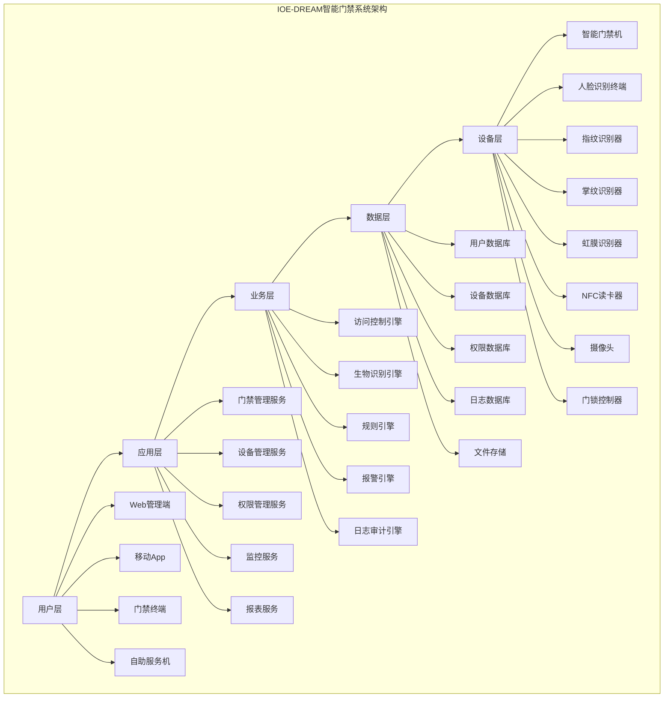

### 业务流程架构
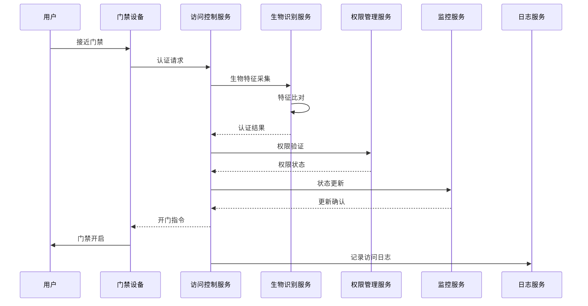

## 核心功能模块

### 功能模块架构
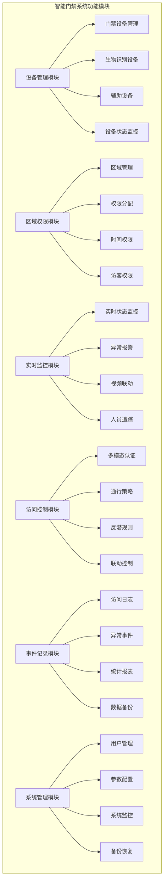

## 设备管理

### 设备类型管理
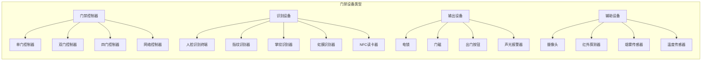

### 设备管理功能
#### 1. 设备注册与配置
```java
public class DeviceManagementService {

    // 设备注册
    public DeviceRegistrationResult registerDevice(DeviceRegistrationRequest request) {
        // 1. 验证设备唯一性
        if (deviceRepository.existsByDeviceId(request.getDeviceId())) {
            throw new DeviceAlreadyExistsException();
        }

        // 2. 创建设备记录
        AccessDeviceEntity device = new AccessDeviceEntity();
        device.setDeviceId(request.getDeviceId());
        device.setDeviceName(request.getDeviceName());
        device.setDeviceType(request.getDeviceType());
        device.setLocation(request.getLocation());
        device.setStatus(DeviceStatus.OFFLINE);

        // 3. 分配网络配置
        NetworkConfig networkConfig = allocateNetworkConfig(request.getDeviceType());
        device.setNetworkConfig(networkConfig);

        // 4. 生成安全密钥
        SecurityKey securityKey = generateSecurityKey();
        device.setSecurityKey(securityKey);

        // 5. 保存设备信息
        deviceRepository.save(device);

        // 6. 下发配置到设备
        deviceConfigService.pushConfigToDevice(device);

        return DeviceRegistrationResult.success(device.getId());
    }

    // 设备状态监控
    public void monitorDeviceStatus() {
        List<AccessDeviceEntity> devices = deviceRepository.findAll();

        for (AccessDeviceEntity device : devices) {
            try {
                // 发送心跳检测
                DeviceHeartbeatResponse heartbeat = deviceCommunicationService.sendHeartbeat(device);

                // 更新设备状态
                updateDeviceStatus(device.getId(), heartbeat.getStatus());

                // 检查设备健康状态
                if (heartbeat.getStatus() == DeviceStatus.OFFLINE &&
                    device.getOfflineDuration() > MAX_OFFLINE_DURATION) {
                    alarmService.sendDeviceOfflineAlarm(device);
                }

            } catch (Exception e) {
                log.error("设备状态监控失败: {}", device.getDeviceId(), e);
                updateDeviceStatus(device.getId(), DeviceStatus.ERROR);
            }
        }
    }
}
```

#### 2. 设备配置管理
```yaml
# 设备配置示例
device_config:
  device_id: "ACCESS_001"
  device_name: "主楼前门"
  device_type: "FACE_RECOGNITION_TERMINAL"
  location: "主楼1层大厅"

  network_config:
    ip_address: "192.168.1.100"
    subnet_mask: "255.255.255.0"
    gateway: "192.168.1.1"
    port: 8080

  security_config:
    encryption_key: "generated_key_here"
    authentication_method: "multi_factor"
    timeout_seconds: 30

  recognition_config:
    face_recognition:
      enabled: true
      threshold: 0.8
      liveness_check: true
    fingerprint_recognition:
      enabled: true
      threshold: 0.85
    card_reading:
      enabled: true
      card_types: ["IC_CARD", "CPU_CARD", "NFC_CARD"]

  access_control:
    default_action: "DENY"
    relay_duration: 5000  # 开门时长(毫秒)
    door_sensor_monitoring: true
    anti_passback: true
```

### 设备运维管理
#### 设备监控指标
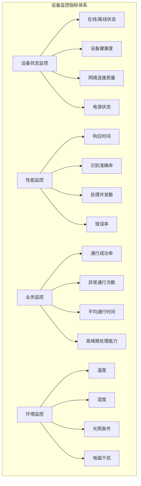

## 区域权限管理

### 区域管理架构
```mermaid
graph TB
subgraph "区域权限管理体系"
A[园区级] --> B[楼栋级]
B --> C[楼层级]
C --> D[区域级]
D --> E[门禁点级]

A --> A1[整体园区]
B --> B1[办公楼A]
B --> B2[办公楼B]
B --> B3[生产车间]
C --> C1[1楼]
C --> C2[2楼]
C --> C3[3楼]
D --> D1[研发区]
D --> D2[办公区]
D --> D3[会议区]
D --> D4[机房]
E --> E1[前门]
E --> E2[侧门]
E --> E3[后门]
E --> E4[消防通道]
```

### 权限管理模型
```java
public class PermissionManagementService {

    // 权限分配
    public void assignUserPermission(AssignPermissionRequest request) {
        // 1. 验证用户和区域有效性
        UserEntity user = userRepository.findById(request.getUserId());
        AreaEntity area = areaRepository.findById(request.getAreaId());

        // 2. 检查权限冲突
        if (hasPermissionConflict(user, area, request.getPermission())) {
            throw new PermissionConflictException();
        }

        // 3. 创建权限记录
        UserPermissionEntity permission = new UserPermissionEntity();
        permission.setUserId(request.getUserId());
        permission.setAreaId(request.getAreaId());
        permission.setPermissionType(request.getPermissionType());
        permission.setStartTime(request.getStartTime());
        permission.setEndTime(request.getEndTime());
        permission.setValidDays(request.getValidDays());
        permission.setTimeSlots(request.getTimeSlots());

        // 4. 应用反潜规则
        if (request.isAntiPassback()) {
            enableAntiPassback(user.getId(), area.getId());
        }

        // 5. 更新缓存
        permissionCache.updateUserPermission(user.getId(), permission);

        // 6. 下发权限到设备
        devicePermissionService.pushPermissionToDevices(area.getDeviceIds(), permission);
    }

    // 权限验证
    public PermissionVerificationResult verifyPermission(String userId, String areaId) {
        // 1. 获取用户权限
        List<UserPermissionEntity> permissions = getValidPermissions(userId, areaId);

        // 2. 检查时间有效性
        LocalDateTime now = LocalDateTime.now();
        for (UserPermissionEntity permission : permissions) {
            if (isTimeValid(permission, now) && isDayValid(permission, now)) {
                return PermissionVerificationResult.granted(permission);
            }
        }

        // 3. 检查特殊权限（临时权限、紧急权限等）
        SpecialPermission specialPermission = checkSpecialPermission(userId, areaId);
        if (specialPermission != null) {
            return PermissionVerificationResult.granted(specialPermission);
        }

        return PermissionVerificationResult.denied("无有效权限");
    }
}
```

### 时间权限配置
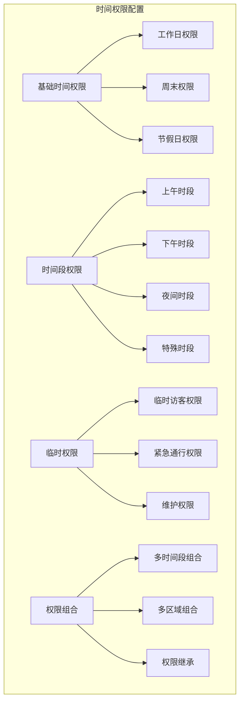

#### 时间权限实现示例
```java
public class TimePermissionService {

    public boolean isTimeValid(UserPermissionEntity permission, LocalDateTime currentTime) {
        // 1. 检查有效期范围
        if (currentTime.isBefore(permission.getStartTime()) ||
            currentTime.isAfter(permission.getEndTime())) {
            return false;
        }

        // 2. 检查星期权限
        DayOfWeek currentDay = currentTime.getDayOfWeek();
        if (!permission.getValidDays().contains(currentDay.getValue())) {
            return false;
        }

        // 3. 检查时间段权限
        LocalTime currentTimeOnly = currentTime.toLocalTime();
        for (TimeSlot timeSlot : permission.getTimeSlots()) {
            if (currentTimeOnly.isAfter(timeSlot.getStartTime()) &&
                currentTimeOnly.isBefore(timeSlot.getEndTime())) {
                return true;
            }
        }

        return false;
    }

    // 动态权限调整
    public void adjustDynamicPermissions() {
        LocalDateTime now = LocalDateTime.now();

        // 高峰期权限调整
        if (isPeakHours(now)) {
            adjustPeakHourPermissions(now);
        }

        // 特殊事件权限调整
        SpecialEvent currentEvent = getCurrentSpecialEvent();
        if (currentEvent != null) {
            applySpecialEventPermissions(currentEvent);
        }

        // 紧急情况权限调整
        EmergencyStatus emergencyStatus = getEmergencyStatus();
        if (emergencyStatus.isActive()) {
            applyEmergencyPermissions(emergencyStatus);
        }
    }
}
```

## 实时监控

### 实时监控架构
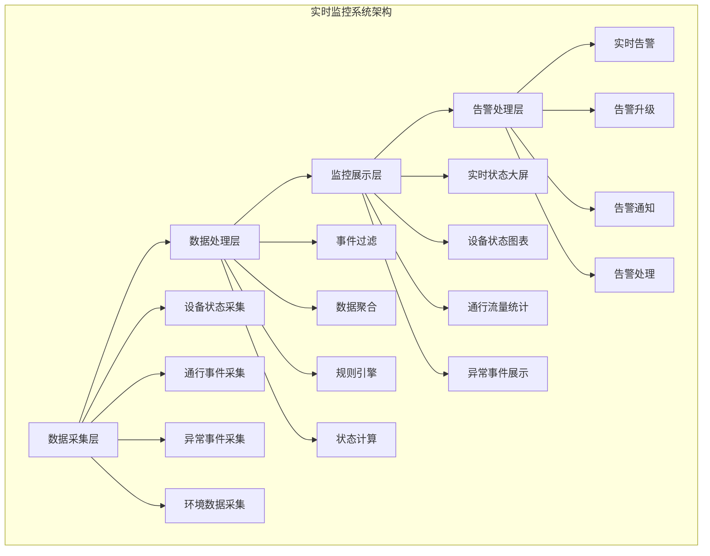

### 监控功能实现
```java
@Service
public class RealTimeMonitoringService {

    @EventListener
    @Async
    public void handleAccessEvent(AccessEvent event) {
        // 1. 实时更新设备状态
        deviceStatusService.updateDeviceStatus(event.getDeviceId(), event.getStatus());

        // 2. 更新区域占用状态
        areaOccupancyService.updateAreaOccupancy(event.getAreaId(), event.getAccessType());

        // 3. 检查异常情况
        checkForAnomalies(event);

        // 4. 推送实时数据到前端
        websocketService.pushAccessEvent(event);

        // 5. 触发联动控制
        triggerLinkedControls(event);
    }

    private void checkForAnomalies(AccessEvent event) {
        // 检查重复通行
        if (isDuplicateAccess(event)) {
            alarmService.sendAlarm(AlarmType.DUPLICATE_ACCESS, event);
        }

        // 检查异常时间段通行
        if (isAbnormalTimeAccess(event)) {
            alarmService.sendAlarm(AlarmType.ABNORMAL_TIME_ACCESS, event);
        }

        // 检查权限异常
        if (isPermissionAnomaly(event)) {
            alarmService.sendAlarm(AlarmType.PERMISSION_ANOMALY, event);
        }

        // 检查设备异常
        if (isDeviceAnomaly(event)) {
            alarmService.sendAlarm(AlarmType.DEVICE_ANOMALY, event);
        }
    }
}
```

### 监控大屏展示
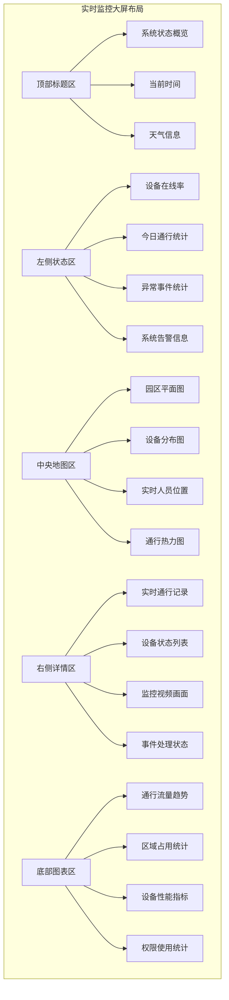

## 多模态认证

### 认证流程设计
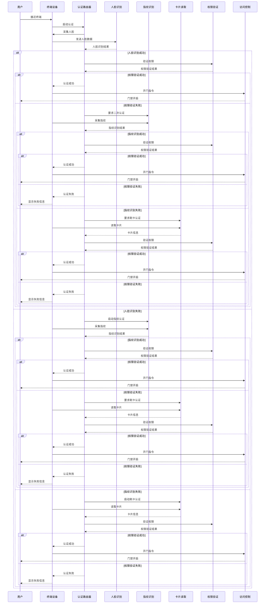

### 认证策略配置
```java
public class AuthenticationStrategyService {

    // 根据区域安全级别确定认证策略
    public AuthenticationStrategy getAuthenticationStrategy(String areaId) {
        AreaSecurityLevel securityLevel = areaService.getSecurityLevel(areaId);

        AuthenticationStrategy strategy = new AuthenticationStrategy();

        switch (securityLevel) {
            case LOW:
                strategy.setRequiredMethods(Arrays.asList(AuthenticationMethod.CARD));
                strategy.setFallbackEnabled(false);
                break;

            case MEDIUM:
                strategy.setRequiredMethods(Arrays.asList(AuthenticationMethod.CARD));
                strategy.setOptionalMethods(Arrays.asList(AuthenticationMethod.FACE));
                strategy.setFallbackEnabled(true);
                break;

            case HIGH:
                strategy.setRequiredMethods(Arrays.asList(AuthenticationMethod.FACE));
                strategy.setOptionalMethods(Arrays.asList(AuthenticationMethod.FINGERPRINT));
                strategy.setFallbackEnabled(true);
                strategy.setLivenessCheckRequired(true);
                break;

            case CRITICAL:
                strategy.setRequiredMethods(Arrays.asList(AuthenticationMethod.FACE, AuthenticationMethod.FINGERPRINT));
                strategy.setOptionalMethods(Arrays.asList(AuthenticationMethod.IRIS));
                strategy.setFallbackEnabled(false);
                strategy.setLivenessCheckRequired(true);
                strategy.setAntiPassbackRequired(true);
                break;
        }

        return strategy;
    }

    // 多模态融合认证
    public AuthenticationResult performMultiModalAuthentication(MultiModalAuthRequest request) {
        List<AuthenticationScore> scores = new ArrayList<>();

        // 1. 执行各种认证方式
        for (AuthenticationMethod method : request.getMethods()) {
            AuthenticationResult result = authenticate(method, request.getData(method));
            if (result.isSuccess()) {
                scores.add(new AuthenticationScore(method, result.getConfidence()));
            } else if (isRequiredMethod(method)) {
                return AuthenticationResult.failure("必需认证失败: " + method);
            }
        }

        // 2. 融合认证结果
        double fusedScore = fusionEngine.fuseScores(scores);
        if (fusedScore >= getAuthenticationThreshold()) {
            return AuthenticationResult.success(fusedScore);
        } else {
            return AuthenticationResult.failure("融合认证分数不足: " + fusedScore);
        }
    }
}
```

## 访问控制流程

### 标准访问流程
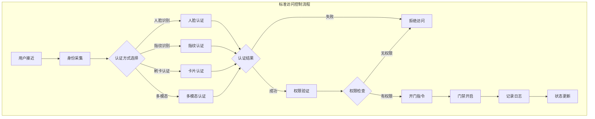

### 访问控制算法实现
```java
@Service
public class AccessControlService {

    public AccessControlResult processAccess(AccessRequest request) {
        try {
            // 1. 身份认证
            AuthenticationResult authResult = authenticationService.authenticate(request);
            if (!authResult.isSuccess()) {
                return AccessControlResult.denied("认证失败: " + authResult.getReason());
            }

            // 2. 权限验证
            PermissionVerificationResult permissionResult = permissionService.verifyPermission(
                authResult.getUserId(),
                request.getAreaId()
            );

            if (!permissionResult.isGranted()) {
                return AccessControlResult.denied("权限不足: " + permissionResult.getReason());
            }

            // 3. 反潜检查
            if (isAntiPassbackEnabled(request.getAreaId())) {
                if (antiPassbackService.checkViolation(authResult.getUserId(), request.getAreaId())) {
                    return AccessControlResult.denied("反潜规则违反");
                }
            }

            // 4. 容量控制
            if (isCapacityControlEnabled(request.getAreaId())) {
                if (!capacityControlService.checkCapacity(request.getAreaId())) {
                    return AccessControlResult.denied("区域人员已满");
                }
            }

            // 5. 执行开门操作
            boolean doorOpened = doorControllerService.openDoor(request.getDeviceId());
            if (!doorOpened) {
                return AccessControlResult.denied("开门失败");
            }

            // 6. 记录成功访问
            accessLogService.logSuccessfulAccess(request, authResult);

            return AccessControlResult.granted();

        } catch (Exception e) {
            log.error("访问控制处理异常", e);
            accessLogService.logFailedAccess(request, e.getMessage());
            return AccessControlResult.denied("系统异常");
        }
    }
}
```

### 异常处理机制
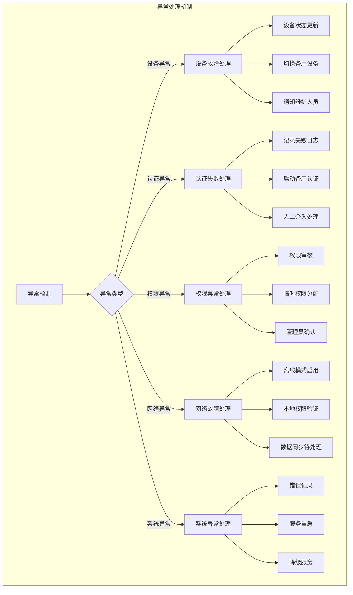

## 事件记录与审计

### 事件记录体系
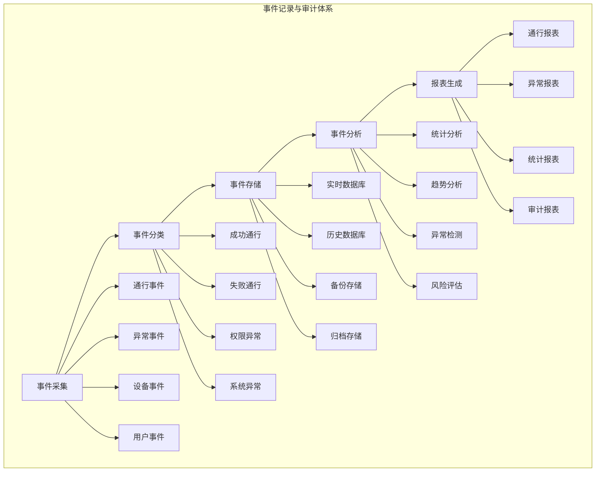

### 审计日志实现
```java
@Entity
@Table(name = "t_access_audit_log")
public class AccessAuditLogEntity {

    @Id
    @GeneratedValue(strategy = GenerationType.IDENTITY)
    private Long id;

    @Column(name = "log_id", length = 64, unique = true, nullable = false)
    private String logId;

    @Column(name = "event_type", nullable = false)
    private String eventType;

    @Column(name = "user_id")
    private Long userId;

    @Column(name = "device_id", nullable = false)
    private String deviceId;

    @Column(name = "area_id")
    private String areaId;

    @Column(name = "authentication_method")
    private String authenticationMethod;

    @Column(name = "access_result", nullable = false)
    private String accessResult;

    @Column(name = "failure_reason", length = 500)
    private String failureReason;

    @Column(name = "biometric_confidence", precision = 5, scale = 4)
    private BigDecimal biometricConfidence;

    @Column(name = "processing_time", nullable = false)
    private LocalDateTime processingTime;

    @Column(name = "response_time_ms")
    private Integer responseTimeMs;

    @Column(name = "client_ip", length = 45)
    private String clientIp;

    @Column(name = "user_agent", length = 500)
    private String userAgent;

    @Column(name = "additional_data", columnDefinition = "TEXT")
    private String additionalData;

    @Column(name = "create_time", nullable = false)
    private LocalDateTime createTime;
}

@Service
public class AccessAuditService {

    public void logAccessEvent(AccessEvent event) {
        AccessAuditLogEntity auditLog = new AccessAuditLogEntity();
        auditLog.setLogId(generateLogId());
        auditLog.setEventType(event.getEventType());
        auditLog.setUserId(event.getUserId());
        auditLog.setDeviceId(event.getDeviceId());
        auditLog.setAreaId(event.getAreaId());
        auditLog.setAuthenticationMethod(event.getAuthenticationMethod());
        auditLog.setAccessResult(event.getAccessResult());
        auditLog.setFailureReason(event.getFailureReason());
        auditLog.setBiometricConfidence(event.getBiometricConfidence());
        auditLog.setProcessingTime(LocalDateTime.now());
        auditLog.setResponseTimeMs(event.getResponseTimeMs());
        auditLog.setClientIp(event.getClientIp());
        auditLog.setAdditionalData(event.getAdditionalData());

        auditLogRepository.save(auditLog);

        // 异步处理审计分析
        asyncAuditAnalysis(auditLog);
    }

    @Async
    private void asyncAuditAnalysis(AccessAuditLogEntity auditLog) {
        // 1. 更新统计信息
        updateStatistics(auditLog);

        // 2. 检查异常模式
        checkAnomalyPatterns(auditLog);

        // 3. 风险评估
        performRiskAssessment(auditLog);

        // 4. 生成实时报告
        generateRealTimeReport(auditLog);
    }
}
```

## 高级功能

### 反潜回控制
```java
@Service
public class AntiPassbackService {

    public boolean checkAntiPassbackViolation(String userId, String areaId) {
        // 获取用户最近的通行记录
        List<AccessRecord> recentRecords = accessRecordRepository.findRecentRecords(userId, 24);

        // 检查是否违反反潜回规则
        for (AccessRecord record : recentRecords) {
            if (isAntiPassbackViolation(userId, areaId, record)) {
                return true;
            }
        }

        return false;
    }

    private boolean isAntiPassbackViolation(String userId, String areaId, AccessRecord lastRecord) {
        AntiPassbackRule rule = antiPassbackRuleRepository.getRuleByArea(areaId);

        switch (rule.getType()) {
            case SOFT:
                return checkSoftAntiPassback(userId, areaId, lastRecord, rule);
            case HARD:
                return checkHardAntiPassback(userId, areaId, lastRecord, rule);
            case TIMED:
                return checkTimedAntiPassback(userId, areaId, lastRecord, rule);
            default:
                return false;
        }
    }
}
```

### 区域容量控制
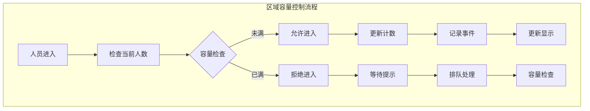

### 全局联动控制
```java
@Service
public class GlobalLinkageService {

    @EventListener
    public void handleAlarmEvent(AlarmEvent event) {
        // 获取联动规则
        List<LinkageRule> rules = linkageRuleRepository.findByAlarmType(event.getAlarmType());

        for (LinkageRule rule : rules) {
            executeLinkageActions(rule, event);
        }
    }

    private void executeLinkageActions(LinkageRule rule, AlarmEvent event) {
        for (LinkageAction action : rule.getActions()) {
            switch (action.getType()) {
                case LOCK_ALL_DOORS:
                    lockAllDoorsInArea(action.getTargetAreaId());
                    break;
                case TRIGGER_ALARM:
                    triggerAlarm(action.getAlarmConfigId());
                    break;
                case START_VIDEO_RECORDING:
                    startVideoRecording(action.getCameraIds());
                    break;
                case SEND_NOTIFICATION:
                    sendNotification(action.getNotificationConfigId());
                    break;
                case TRIGGER_EMERGENCY_MODE:
                    triggerEmergencyMode(action.getEmergencyModeId());
                    break;
            }
        }
    }
}
```

## 安全机制

### 多层安全防护
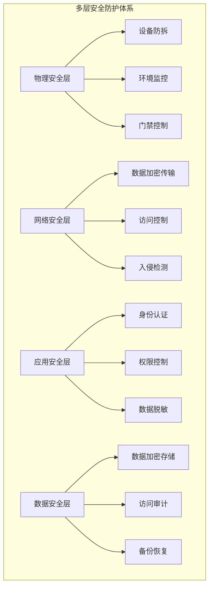

### 安全策略配置
```yaml
security_config:
  authentication:
    multi_factor_required: true
    liveness_check_enabled: true
    biometric_threshold: 0.85
    session_timeout: 300  # 秒

  encryption:
    data_transmission: "TLS_1_3"
    data_storage: "AES_256_GCM"
    key_management: "HSM"

  access_control:
    max_failed_attempts: 3
    lockout_duration: 900  # 秒
    emergency_access_enabled: true

  audit:
    log_all_events: true
    log_retention_days: 2555  # 7年
    real_time_monitoring: true

  network_security:
    firewall_enabled: true
    intrusion_detection: true
    ddos_protection: true
```

## API接口设计

### 门禁控制接口
```http
# 访问认证
POST /api/access/authenticate
Content-Type: application/json

{
    "deviceId": "ACCESS_001",
    "authenticationMethods": ["FACE"],
    "biometricData": {
        "FACE": "base64人脸数据"
    },
    "cardData": null
}

Response:
{
    "code": 200,
    "message": "认证成功",
    "data": {
        "authenticated": true,
        "userId": "U001",
        "confidence": 0.95,
        "authenticationTime": 150
    }
}

# 权限验证
POST /api/access/verify-permission
Content-Type: application/json

{
    "userId": "U001",
    "areaId": "AREA_001",
    "deviceId": "ACCESS_001"
}

Response:
{
    "code": 200,
    "message": "验证成功",
    "data": {
        "permitted": true,
        "permissionType": "FULL_ACCESS",
        "validUntil": "2024-01-01T18:00:00Z"
    }
}

# 开门控制
POST /api/access/open-door
Content-Type: application/json

{
    "deviceId": "ACCESS_001",
    "userId": "U001",
    "areaId": "AREA_001",
    "duration": 5000
}

Response:
{
    "code": 200,
    "message": "开门成功",
    "data": {
        "doorOpened": true,
        "duration": 5000,
        "operationTime": "2024-01-01T10:00:00Z"
    }
}
```

### 设备管理接口
```http
# 设备状态查询
GET /api/device/{deviceId}/status

Response:
{
    "code": 200,
    "message": "查询成功",
    "data": {
        "deviceId": "ACCESS_001",
        "deviceName": "主楼前门",
        "status": "ONLINE",
        "lastHeartbeat": "2024-01-01T09:59:30Z",
        "cpuUsage": 15.2,
        "memoryUsage": 32.5,
        "storageUsage": 45.8
    }
}

# 设备远程控制
POST /api/device/{deviceId}/control
Content-Type: application/json

{
    "action": "RESTART",
    "parameters": {}
}

Response:
{
    "code": 200,
    "message": "控制命令已发送",
    "data": {
        "commandId": "CMD_001",
        "expectedCompletionTime": "2024-01-01T10:01:00Z"
    }
}
```

## 性能指标

### 系统性能要求
| 指标项 | 要求值 | 测试条件 |
|--------|--------|----------|
| 认证响应时间 | ≤500ms | 正常负载 |
| 并发认证能力 | ≥10000 TPS | 混合认证 |
| 系统可用性 | ≥99.99% | 7×24小时 |
| 设备连接成功率 | ≥99.5% | 正常网络 |
| 事件处理延迟 | ≤100ms | 实时处理 |

### 不同认证方式性能
| 认证方式 | 平均响应时间 | 准确率 | 支持并发 | 适用场景 |
|----------|--------------|--------|----------|----------|
| 人脸识别 | <300ms | 99.99% | 5000 TPS | 主要出入口 |
| 指纹识别 | <200ms | 99.9% | 8000 TPS | 高安全区域 |
| 掌纹识别 | <400ms | 99.95% | 3000 TPS | 特殊区域 |
| 虹膜识别 | <800ms | 99.999% | 1000 TPS | 核心区域 |
| 卡片识别 | <100ms | 100% | 10000 TPS | 通用认证 |
| 多模态认证 | <600ms | 99.999% | 2000 TPS | 最高安全区域 |

## 应用场景

### 园区应用场景
- **主出入口**：人脸识别 + 卡片认证
- **办公区域**：指纹 + 门禁卡
- **研发中心**：人脸 + 指纹 + 虹膜三重认证
- **生产车间**：工牌 + 人脸识别
- **数据中心**：多模态生物识别
- **访客区域**：临时卡片 + 人脸登记

### 特殊场景应用
- **紧急疏散**：一键开启所有门禁
- **消防联动**：火灾自动解锁
- **安全威胁**：自动锁定相关区域
- **高峰时段**：快速通道模式
- **夜间模式**：增强安全检查

**Section sources**
- [AccessControlController.java](file://smart-admin-api-java17-springboot3/sa-admin/src/main/java/net/lab1024/sa/admin/module/business/security/access/controller/AccessControlController.java#L1-120)
- [access-control-api.js](file://smart-admin-web-javascript/src/api/business/security/access/access-control-api.js#L1-60)
- [device-management.vue](file://smart-admin-web-javascript/src/views/business/security/access/device-management.vue#L1-200)
- [real-time-monitor.vue](file://smart-admin-web-javascript/src/views/business/security/access/real-time-monitor.vue#L1-150)