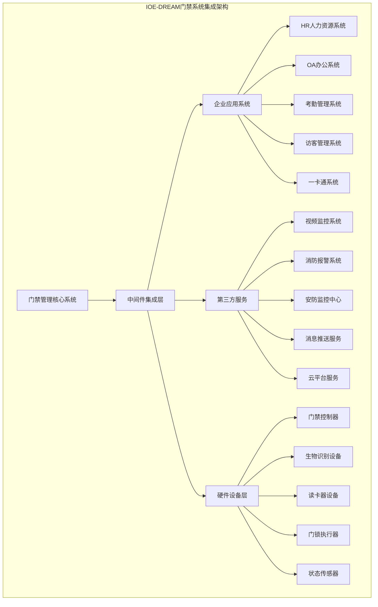
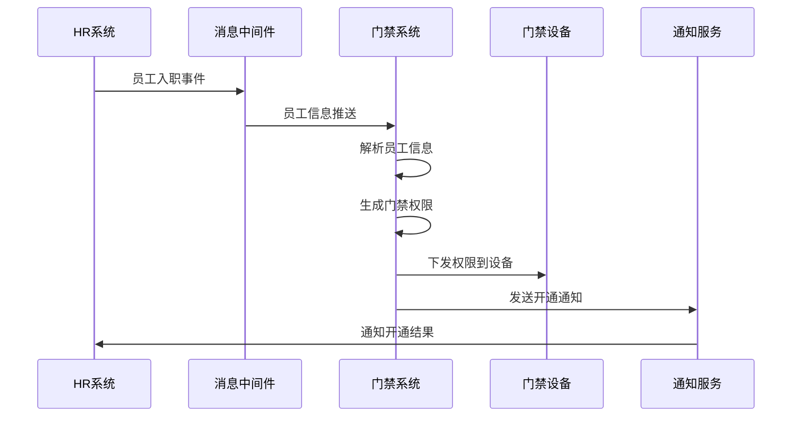
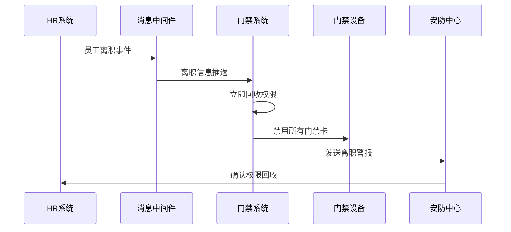
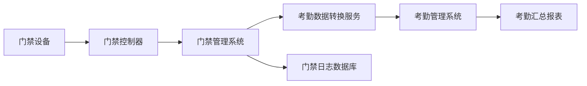
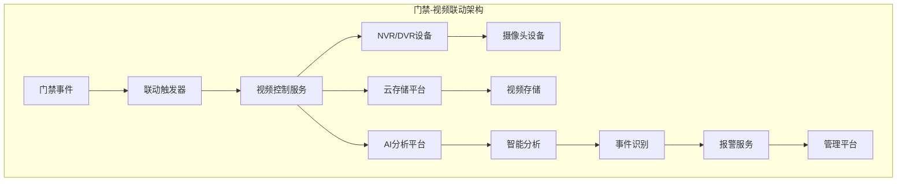
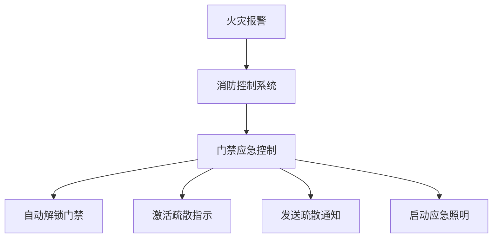
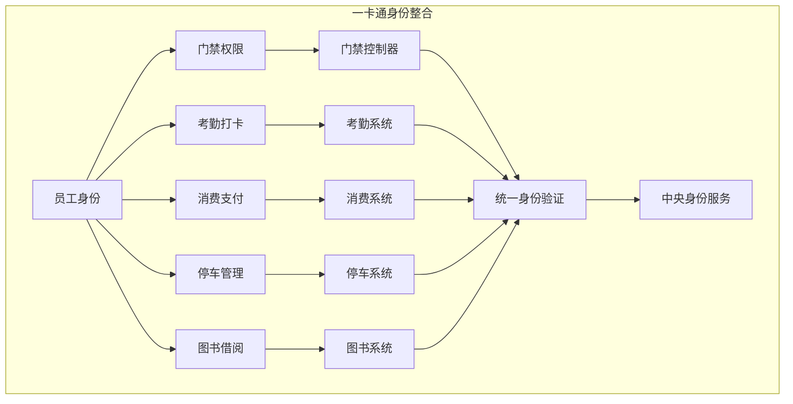
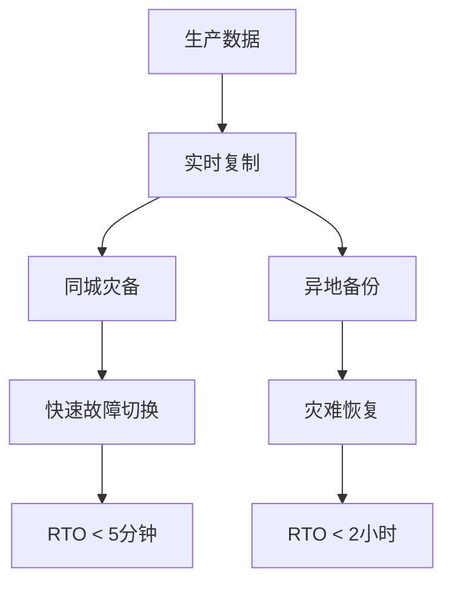
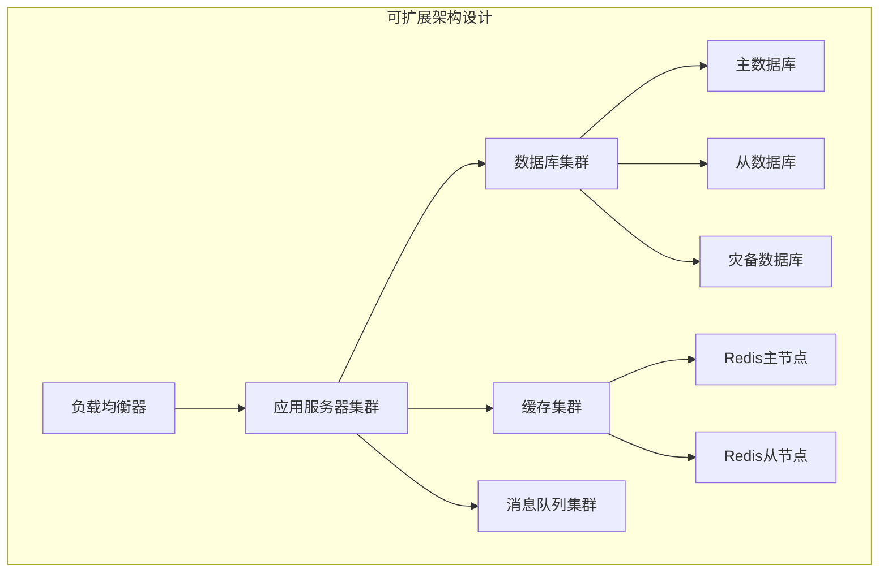

# IOE-DREAM智能门禁系统集成方案

> **版本**: v1.0
> **更新时间**: 2025-11-13
> **适用场景**: 智慧园区、企业办公楼、生产厂区、学校、医院等

## 1. 集成概述

### 1.1 集成目标

IOE-DREAM智能门禁系统集成方案旨在将门禁系统与现有IT基础设施、第三方系统、硬件设备进行全面集成，打造统一、高效、安全的智能门禁管理平台。

**核心集成目标**:
- 与HR系统深度集成，实现员工入职离职自动化门禁权限管理
- 与考勤系统无缝对接，提供准确的考勤打卡数据
- 与视频监控系统联动，实现门禁事件的视频记录和回溯
- 与消防报警系统集成，支持紧急情况下的自动门禁控制
- 与访客管理系统协同，提供完整的访客进出管理流程
- 与一卡通系统融合，支持多种身份验证和支付功能

### 1.2 集成架构



## 2. HR系统集成

### 2.1 集成架构

**HR系统对接模式**:
- **实时同步模式**: 员工信息变更实时同步到门禁系统
- **批量同步模式**: 定时批量同步员工组织架构和权限信息
- **事件驱动模式**: 基于HR业务事件触发门禁权限操作

### 2.2 数据接口设计

**HR系统提供的数据接口**:
```json
// 员工基本信息接口
{
  "employeeId": "EMP10001",
  "employeeName": "张三",
  "employeeNo": "10001",
  "departmentId": "DEPT001",
  "departmentName": "技术研发部",
  "positionName": "高级工程师",
  "employeeStatus": "ACTIVE", // ACTIVE, INACTIVE, TERMINATED
  "employmentType": "FULL_TIME", // FULL_TIME, PART_TIME, CONTRACTOR
  "employmentDate": "2023-01-15",
  "terminationDate": null,
  "workLocation": "总部大楼",
  "accessLevel": "STANDARD" // BASIC, STANDARD, ADVANCED, ADMIN
}
```

**门禁权限规则映射**:
```json
{
  "accessLevelMapping": {
    "BASIC": {
      "areas": ["公共区域", "食堂"],
      "timeRestrictions": "08:00-18:00",
      "weekendAccess": false
    },
    "STANDARD": {
      "areas": ["办公区域", "会议室", "公共区域"],
      "timeRestrictions": "07:00-21:00",
      "weekendAccess": true
    },
    "ADVANCED": {
      "areas": ["所有区域", "机房", "实验室"],
      "timeRestrictions": "24小时",
      "weekendAccess": true
    },
    "ADMIN": {
      "areas": ["所有区域"],
      "timeRestrictions": "无限制",
      "weekendAccess": true,
      "emergencyAccess": true
    }
  }
}
```

### 2.3 业务流程集成

**员工入职门禁权限开通流程**:


**员工离职门禁权限回收流程**:


### 2.4 技术实现方案

**集成方式选择**:
1. **API接口集成**: 通过RESTful API进行实时数据交互
2. **数据库集成**: 通过数据库视图或存储过程进行数据同步
3. **消息队列集成**: 使用RabbitMQ/Kafka进行异步消息传递
4. **文件传输集成**: 通过CSV/XML文件进行批量数据交换

**推荐技术栈**:
```yaml
integration_stack:
  api_gateway: "Spring Cloud Gateway"
  message_queue: "RabbitMQ"
  data_sync: "Apache Kafka"
  authentication: "OAuth 2.0 + JWT"
  encryption: "SM2/SM4国密算法"
  monitoring: "Prometheus + Grafana"
```

## 3. 考勤系统集成

### 3.1 集成模式

**门禁考勤一体化模式**:
- 门禁设备作为考勤打卡点
- 门禁验证通过自动生成考勤记录
- 支持多种验证方式的考勤数据采集
- 实时考勤数据同步到考勤系统

### 3.2 数据流向设计



### 3.3 考勤数据格式

**门禁考勤记录数据结构**:
```json
{
  "recordId": "AC_REC_001",
  "employeeId": "EMP10001",
  "employeeName": "张三",
  "deviceId": "DEV_001",
  "deviceName": "一楼东门",
  "deviceType": "FACE_RECOGNITION",
  "accessType": "IN", // IN-进入, OUT-外出
  "accessTime": "2025-11-13T09:00:00Z",
  "verificationMethod": "FACE", // FACE, FINGERPRINT, CARD, PASSWORD
  "verificationResult": "SUCCESS",
  "confidence": 0.95,
  "location": {
    "building": "总部大楼",
    "floor": "1F",
    "area": "东侧"
  },
  "workShift": "标准班次",
  "isLate": false,
  "abnormalFlag": false,
  "syncStatus": "SYNCED",
  "createTime": "2025-11-13T09:00:01Z"
}
```

### 3.4 考勤规则集成

**考勤规则配置集成**:
```json
{
  "attendanceRules": {
    "workLocations": [
      {
        "locationId": "HQ_BUILDING",
        "locationName": "总部大楼",
        "accessPoints": ["MAIN_ENTRANCE", "SIDE_ENTRANCE"],
        "validTimeRange": "07:00-22:00",
        "gracePeriod": 15
      }
    ],
    "clockInRules": {
      "firstAccess": "clock_in",
      "lastAccess": "clock_out",
      "multipleAccess": "ignore",
      "weekendHandling": "overtime"
    },
    "deviceMapping": {
      "DEV_001": "HQ_MAIN_ENTRANCE",
      "DEV_002": "HQ_SIDE_ENTRANCE",
      "DEV_003": "CAFETERIA_ENTRANCE"
    }
  }
}
```

## 4. 视频监控系统联动

### 4.1 联动架构



### 4.2 联动场景

**场景1: 门禁异常行为视频录制**
```json
{
  "triggerConditions": [
    {
      "event": "ACCESS_DENIED",
      "count": 3, // 连续3次失败
      "timeWindow": 300 // 5分钟内
    },
    {
      "event": "TAILGATING_DETECTED",
      "confidence": 0.8
    },
    {
      "event": "FORCED_ENTRY",
      "sensorTrigger": true
    }
  ],
  "videoActions": [
    {
      "action": "START_RECORDING",
      "duration": 300, // 录制5分钟
      "cameras": ["CAM_001", "CAM_002"] // 关联摄像头
    },
    {
      "action": "SEND_ALERT",
      "recipients": ["security_center", "admin"],
      "attachVideo": true
    }
  ]
}
```

**场景2: 重要区域通行视频抓拍**
```json
{
  "areaSettings": {
    "highSecurityAreas": ["数据中心", "财务室", "研发实验室"],
    "videoCapture": {
      "preCapture": 5, // 事件前5秒
      "postCapture": 10, // 事件后10秒
      "highQuality": true,
      "faceDetection": true
    }
  },
  "storagePolicy": {
    "retentionPeriod": 90, // 保存90天
    "encryptionEnabled": true,
    "backupEnabled": true
  }
}
```

### 4.3 视频数据管理

**视频元数据管理**:
```json
{
  "videoMetadata": {
    "recordId": "VID_20251113_001",
    "eventId": "AC_EVENT_001",
    "cameraId": "CAM_001",
    "cameraName": "一楼大厅摄像头",
    "startTime": "2025-11-13T09:00:00Z",
    "endTime": "2025-11-13T09:00:30Z",
    "duration": 30,
    "resolution": "1080P",
    "fileSize": 5242880,
    "format": "MP4",
    "compression": "H.264",
    "filePath": "/videos/2025/11/13/CAM_001_001.mp4",
    "thumbnailPath": "/thumbnails/2025/11/13/CAM_001_001.jpg",
    "relatedEvents": [
      {
        "eventId": "AC_EVENT_001",
        "eventType": "ACCESS_GRANTED",
        "employeeId": "EMP10001",
        "timestamp": "2025-11-13T09:00:15Z"
      }
    ],
    "tags": ["access_granted", "employee_entry", "normal_operation"]
  }
}
```

## 5. 消防报警系统集成

### 5.1 紧急疏散联动

**消防报警触发门禁控制**:


**紧急控制策略**:
```json
{
  "emergencyStrategies": {
    "fire_alarm": {
      "actions": [
        {
          "deviceType": "ALL_DOORS",
          "action": "UNLOCK",
          "priority": "EMERGENCY",
          "delay": 0
        },
        {
          "deviceType": "ELEVATORS",
          "action": "GROUND_FLOOR",
          "priority": "EMERGENCY",
          "delay": 5
        }
      ],
      "notifications": [
        {
          "type": "SMS",
          "recipients": ["emergency_team", "security_personnel"],
          "message": "火警警报：所有门禁已自动解锁，请立即疏散！"
        },
        {
          "type": "BROADCAST",
          "message": "紧急疏散通知，请通过最近的安全出口撤离"
        }
      ]
    },
    "earthquake": {
      "actions": [
        {
          "deviceType": "AUTOMATIC_DOORS",
          "action": "UNLOCK",
          "priority": "EMERGENCY"
        },
        {
          "deviceType": "SECURITY_DOORS",
          "action": "MAINTAIN_LOCK", // 保持安全门锁闭
          "priority": "HIGH"
        }
      ]
    }
  }
}
```

### 5.2 安全区域控制

**危险区域隔离方案**:
```json
{
  "dangerousAreas": [
    {
      "areaId": "POWER_ROOM",
      "areaName": "配电室",
      "accessLevel": "AUTHORIZED_ONLY",
      "safetyMeasures": {
        "dualVerification": true,
        "safetyTrainingRequired": true,
        "equipmentCheckRequired": true,
        "buddySystemRequired": true
      },
      "emergencyProcedures": {
        "powerOutage": "AUTO_UNLOCK_DELAYED",
        "gasLeak": "IMMEDIATE_LOCKDOWN",
        "fire": "IMMEDIATE_UNLOCK"
      }
    }
  ]
}
```

## 6. 一卡通系统集成

### 6.1 卡片身份整合

**多卡合一架构**:


### 6.2 卡片生命周期管理

**卡片状态流转**:
```json
{
  "cardLifecycle": {
    "ISSUED": {
      "status": "新卡发放",
      "permissions": ["门禁基础权限"],
      "validity": "3年"
    },
    "ACTIVE": {
      "status": "正常使用",
      "permissions": ["门禁全权限", "消费权限", "考勤权限"],
      "autoRenew": true
    },
    "SUSPENDED": {
      "status": "临时挂失",
      "permissions": [],
      "reason": "挂失/冻结",
      "reactivationRequired": true
    },
    "EXPIRED": {
      "status": "卡片过期",
      "permissions": [],
      "replacementRequired": true
    },
    "REVOKED": {
      "status": "卡片撤销",
      "permissions": [],
      "reason": "离职/收回",
      "permanentRevoke": true
    }
  }
}
```

### 6.3 支付集成方案

**门禁消费一体化**:
```json
{
  "paymentIntegration": {
    "supportedMethods": [
      {
        "type": "CARD_PAYMENT",
        "description": "一卡通支付",
        "requirePin": false,
        "dailyLimit": 500,
        "transactionLimit": 100
      },
      {
        "type": "FACE_PAYMENT",
        "description": "人脸支付",
        "requireLiveness": true,
        "confidenceThreshold": 0.9
      },
      {
        "type": "FINGERPRINT_PAYMENT",
        "description": "指纹支付",
        "requireEnrollment": true
      }
    ],
    "transactionFlow": [
      "身份验证 -> 余额检查 -> 扣款操作 -> 记录日志 -> 发送通知"
    ],
    "settlement": {
      "daily": true,
      "realTime": false,
      "batchSize": 1000
    }
  }
}
```

## 7. 第三方设备集成

### 7.1 硬件设备兼容性

**支持的品牌和型号**:
```yaml
supported_devices:
  access_controllers:
    - brand: "海康威视"
      models: ["DS-K2801", "DS-K2802", "DS-K2804"]
      protocols: ["HTTP", "TCP", "UDP"]
      features: ["多门控制", "网络通信", "事件报警"]
    - brand: "大华"
      models: ["DH-ASC1204C", "DH-ASC2402C"]
      protocols: ["HTTP", "TCP"]
      features: ["双门控制", "韦根接口", "消防联动"]
    - brand: "博世"
      models: ["Bosch G2", "Bosch G3"]
      protocols: ["OSDP", "Wiegand"]
      features: ["高级安全", "防拆检测", "电池备份"]

  biometric_devices:
    - brand: "商汤科技"
      models: ["SensePass Pro", "SensePass Lite"]
      capabilities: ["人脸识别", "活体检测", "体温检测"]
      accuracy: "99.5%"
    - brand: "旷视科技"
      models: ["MegFace C1", "MegFace C3"]
      capabilities: ["3D人脸识别", "红外成像", "深度学习"]
      accuracy: "99.8%"

  card_readers:
    - brand: "HID Global"
      models: ["iCLASS SE", "ProxPro"]
      card_types: ["125kHz", "13.56MHz", "NFC"]
    - brand: "Legic"
      models: ["Prime", "Advant"]
      card_types: ["Legic", "Mifare", "NFC"]
```

### 7.2 通信协议适配

**协议适配层设计**:
```java
@Component
public class DeviceProtocolAdapter {

    @Resource
    private Map<String, DeviceProtocol> protocolMap;

    /**
     * 设备协议工厂
     */
    public DeviceProtocol getProtocol(Device device) {
        String protocolKey = device.getBrand() + "_" + device.getModel();
        return protocolMap.get(protocolKey);
    }

    /**
     * 统一设备操作接口
     */
    public DeviceResponse sendCommand(Device device, DeviceCommand command) {
        DeviceProtocol protocol = getProtocol(device);
        return protocol.execute(command);
    }
}

public interface DeviceProtocol {
    DeviceResponse execute(DeviceCommand command);
    boolean isConnected();
    String getDeviceStatus();
    void subscribeEvent(EventListener listener);
}
```

## 8. 消息通知集成

### 8.1 多渠道通知

**通知渠道配置**:
```json
{
  "notificationChannels": {
    "sms": {
      "provider": "阿里云短信",
      "templates": {
        "access_granted": "您的门禁通行已授权，时间：{time}，地点：{location}",
        "access_denied": "门禁验证失败，请联系管理员",
        "emergency": "紧急通知：{message}"
      }
    },
    "email": {
      "smtp_server": "smtp.company.com",
      "templates": {
        "daily_report": "今日门禁通行报告",
        "anomaly_alert": "异常通行行为警报"
      }
    },
    "push_notification": {
      "platforms": ["iOS", "Android"],
      "app_bundle_id": "com.company.accesscontrol"
    },
    "wechat": {
      "corp_id": "corp_id",
      "app_secret": "app_secret"
    }
  }
}
```

### 8.2 事件触发规则

**智能事件通知**:
```json
{
  "eventRules": [
    {
      "ruleName": "夜间通行告警",
      "condition": {
        "timeRange": "22:00-06:00",
        "eventType": "ACCESS_GRANTED",
        "employeeLevel": "NORMAL"
      },
      "actions": [
        {
          "type": "SMS",
          "recipients": ["security_manager"],
          "template": "night_access_alert"
        },
        {
          "type": "WECHAT",
          "recipients": ["security_group"],
          "template": "security_notification"
        }
      ]
    },
    {
      "ruleName": "多次失败告警",
      "condition": {
        "eventType": "ACCESS_DENIED",
        "failureCount": 5,
        "timeWindow": 300
      },
      "actions": [
        {
          "type": "PUSH_NOTIFICATION",
          "recipients": ["security_team"],
          "priority": "HIGH"
        }
      ]
    }
  ]
}
```

## 9. 数据同步与备份

### 9.1 数据同步策略

**实时同步与批量同步结合**:
```yaml
sync_strategy:
  real_time:
    - events: ["access_granted", "access_denied", "device_status_change"]
    - data: ["employee_status_change", "permission_update"]
    - frequency: "immediate"
    - method: "message_queue"

  batch_sync:
    - data: ["employee_master_data", "device_config", "permission_matrix"]
    - frequency: "every_hour"
    - method: "database_replication"

  full_sync:
    - data: ["all_tables"]
    - frequency: "daily_02:00"
    - method: "full_export_import"
```

### 9.2 灾备方案

**多级备份策略**:


## 10. 安全与合规

### 10.1 数据安全

**国密算法应用**:
```java
@Service
public class DataSecurityService {

    /**
     * 敏感数据SM4加密
     */
    public String encryptSensitiveData(String data) {
        return SM4Util.encrypt(data, getSystemKey());
    }

    /**
     * 数据完整性SM3校验
     */
    public String calculateDataHash(String data) {
        return SM3Util.hash(data);
    }

    /**
     * 数字签名SM2验证
     */
    public boolean verifySignature(String data, String signature, String publicKey) {
        return SM2Util.verify(data, signature, publicKey);
    }
}
```

### 10.2 隐私保护

**个人数据保护措施**:
- **数据最小化**: 只收集必要的身份和权限信息
- **匿名化处理**: 统计分析时使用匿名化数据
- **访问控制**: 严格的身份认证和权限管理
- **审计日志**: 完整的数据访问和使用记录
- **数据加密**: 传输和存储全程加密
- **定期清理**: 及时清理过期的个人数据

## 11. 性能与扩展性

### 11.1 性能指标

**系统性能要求**:
```yaml
performance_targets:
  response_time:
    authentication: "< 500ms"
    permission_check: "< 100ms"
    event_logging: "< 50ms"

  throughput:
    concurrent_users: "> 10000"
    events_per_second: "> 1000"
    api_requests: "> 5000/second"

  availability:
    uptime: "99.99%"
    failover_time: "< 30s"
    data_loss: "0%"
```

### 11.2 扩展性设计

**横向扩展架构**:


## 12. 实施计划

### 12.1 分阶段实施

**第一阶段：基础集成 (1-2个月)**
- HR系统员工信息同步
- 基础门禁权限管理
- 核心设备接入

**第二阶段：业务集成 (2-3个月)**
- 考勤系统集成
- 一卡通支付集成
- 视频监控联动

**第三阶段：高级功能 (3-4个月)**
- 消防报警联动
- AI智能分析
- 移动端应用

**第四阶段：优化完善 (1-2个月)**
- 性能优化
- 安全加固
- 用户培训

### 12.2 风险控制

**主要风险及应对措施**:
```json
{
  "risks": [
    {
      "risk": "系统兼容性问题",
      "probability": "Medium",
      "impact": "High",
      "mitigation": "充分的兼容性测试，建立协议适配层"
    },
    {
      "risk": "数据迁移风险",
      "probability": "Low",
      "impact": "Critical",
      "mitigation": "详细的数据迁移计划，分批次验证"
    },
    {
      "risk": "安全漏洞",
      "probability": "Low",
      "impact": "Critical",
      "mitigation": "安全审计，渗透测试，及时补丁更新"
    }
  ]
}
```

通过以上全面的集成方案，IOE-DREAM智能门禁系统能够与现有IT基础设施和第三方系统无缝集成，构建统一、高效、安全的智慧园区门禁管理体系。