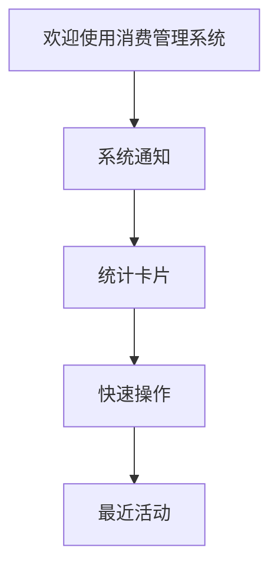
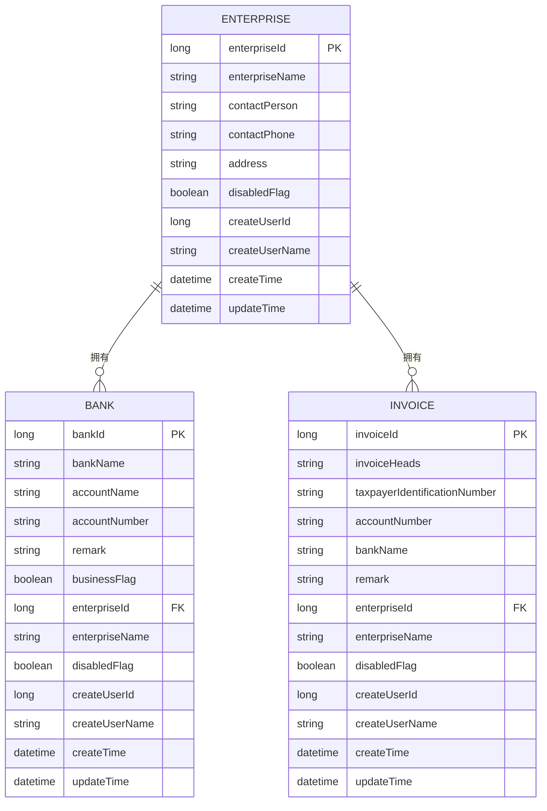
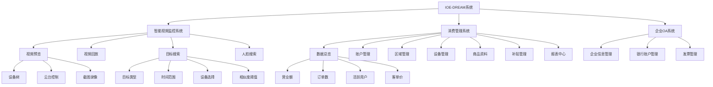

# 核心功能模块

<cite>
**本文档引用文件**   
- [smart-video.js](file://smart-admin-web-javascript\src\router\business\smart-video.js)
- [consumption.js](file://smart-admin-web-javascript\src\router\business\consumption.js)
- [enterprise-api.js](file://smart-admin-web-javascript\src\api\business\oa\enterprise-api.js)
- [bank-api.js](file://smart-admin-web-javascript\src\api\business\oa\bank-api.js)
- [invoice-api.js](file://smart-admin-web-javascript\src\api\business\oa\invoice-api.js)
- [monitor-api.js](file://smart-admin-web-javascript\src\api\business\smart-video\monitor-api.js)
- [device-api.js](file://smart-admin-web-javascript\src\api\business\smart-video\device-api.js)
- [target-search-api.js](file://smart-admin-web-javascript\src\api\business\smart-video\target-search-api.js)
- [dashboard/index.vue](file://smart-admin-web-javascript\src\views\business\consumption\dashboard\index.vue)
- [consumption-const.js](file://smart-admin-web-javascript\src\constants\business\consumption\consumption-const.js)
- [InvoiceVO.java](file://smart-admin-api-java17-springboot3\sa-admin\src\main\java\net\lab1024\sa\admin\module\business\oa\invoice\domain\InvoiceVO.java)
- [BankVO.java](file://smart-admin-api-java17-springboot3\sa-admin\src\main\java\net\lab1024\sa\admin\module\business\oa\bank\domain\BankVO.java)
</cite>

## 目录
1. [智能视频监控系统](#智能视频监控系统)
2. [消费管理系统](#消费管理系统)
3. [企业OA系统](#企业oa系统)
4. [功能架构图](#功能架构图)
5. [使用案例与最佳实践](#使用案例与最佳实践)
6. [扩展性与定制化](#扩展性与定制化)

## 智能视频监控系统

IOE-DREAM项目中的智能视频监控系统提供全面的视频管理功能，包括视频预览、视频回放、目标搜索和人脸搜索等核心功能。系统采用模块化设计，通过Vue 3和Ant Design Vue 4构建用户界面，实现了现代化的交互体验。

### 视频预览

视频预览功能允许用户实时查看监控摄像头的画面。系统提供了设备树形结构，方便用户快速定位和选择监控设备。用户可以通过云台控制功能对摄像头进行方向调整，并支持截图和录像等操作。

**API接口：**
- `getDeviceTree`: 获取设备树结构
- `getVideoStreamUrl`: 获取视频流地址
- `startPlay`: 开始播放视频
- `stopPlay`: 停止播放视频
- `ptzControl`: 云台控制
- `captureSnapshot`: 截图
- `startRecord`: 开始录像
- `gotoPreset`: 调用预置位

### 视频回放

视频回放功能支持用户查看历史录像。系统提供时间轴选择器，用户可以精确选择需要查看的时间段。支持多路视频同步回放，便于进行事件追溯和分析。

### 目标搜索

目标搜索功能是智能视频监控系统的核心功能之一，允许用户通过多种条件检索特定目标。系统支持按目标类型（人员、车辆、物体）、时间范围、监控设备、相似度阈值等条件进行搜索。

搜索界面分为三个主要区域：左侧为搜索条件面板，中间为主内容区域，右侧为样本面板。用户可以上传样本图片进行以图搜图，也可以通过高级筛选条件精确查找目标。

**API接口：**
- `startSearch`: 开始目标检索
- `searchByImage`: 以图搜图
- `getSearchProgress`: 获取搜索进度
- `getSearchResults`: 获取搜索结果
- `cancelSearch`: 取消搜索
- `exportResults`: 导出搜索结果
- `batchSearch`: 批量检索
- `getTrajectory`: 获取轨迹数据

### 人脸搜索

人脸搜索功能基于人脸识别技术，允许用户通过上传人脸图片来搜索特定人员的历史出现记录。系统会自动提取人脸特征，并在指定时间范围内进行比对搜索。

**API接口：**
- `uploadSample`: 上传目标样本图片
- `getDeviceList`: 获取设备列表
- `getAreaList`: 获取区域列表

**Section sources**
- [smart-video.js](file://smart-admin-web-javascript\src\router\business\smart-video.js#L68-L83)
- [target-search-api.js](file://smart-admin-web-javascript\src\api\business\smart-video\target-search-api.js#L1-L45)
- [monitor-api.js](file://smart-admin-web-javascript\src\api\business\smart-video\monitor-api.js#L1-L51)

## 消费管理系统

消费管理系统为企业提供全面的消费管理解决方案，包括账户管理、区域管理、设备管理、商品资料管理、补贴管理等功能模块。系统以数据驱动，提供实时的经营数据分析和决策支持。

### 业务流程

消费管理系统的业务流程从账户创建开始，经过消费记录、补贴发放、报表生成等环节，最终形成完整的消费数据闭环。系统支持在线消费和离线消费两种模式，确保在各种网络环境下都能正常运行。

### 数据模型

消费管理系统的核心数据模型包括账户、消费记录、补贴记录、设备、商品等实体。各实体之间通过外键关联，形成完整的数据关系网络。

**核心数据实体：**
- 账户：存储用户账户信息，包括账户余额、账户状态等
- 消费记录：记录每次消费的详细信息，包括消费时间、金额、设备等
- 补贴记录：记录补贴发放的详细信息，包括补贴金额、发放时间等
- 设备：存储消费终端设备信息，包括设备状态、位置等
- 商品：存储商品信息，包括商品名称、价格等

### 功能模块

#### 数据总览

数据总览页面提供关键经营指标的可视化展示，包括今日营业额、订单数、活跃用户、平均客单价等。通过统计卡片的形式，用户可以快速了解当前经营状况。

**Diagram sources**
- [dashboard/index.vue](file://smart-admin-web-javascript\src\views\business\consumption\dashboard\index.vue#L8-L492)

#### 快速操作

快速操作区域提供常用功能的快捷入口，包括账户类别管理、账户管理、区域管理、餐别资料、参数设置、设备管理、商品资料、补贴管理、报表中心等。

**Section sources**
- [consumption.js](file://smart-admin-web-javascript\src\router\business\consumption.js#L14-L62)
- [dashboard/index.vue](file://smart-admin-web-javascript\src\views\business\consumption\dashboard\index.vue#L8-L492)
- [consumption-const.js](file://smart-admin-web-javascript\src\constants\business\consumption\consumption-const.js#L59-L116)

## 企业OA系统

企业OA系统提供企业信息管理、银行账户管理和发票管理等功能模块，帮助企业实现信息化管理。

### 企业信息管理

企业信息管理模块允许用户创建、编辑和删除企业信息。系统支持分页查询企业列表，并提供数据导出功能。

**API接口：**
- `create`: 新建企业
- `delete`: 删除企业
- `detail`: 查询企业详情
- `pageQuery`: 分页查询企业
- `exportExcel`: 导出企业数据Excel
- `queryList`: 查询企业列表

### 银行账户管理

银行账户管理模块用于管理企业的银行账户信息，包括开户银行、账户名称、账号等。系统支持根据企业ID查询银行列表。

**API接口：**
- `create`: 新建银行信息
- `delete`: 删除银行信息
- `detail`: 查询银行信息详情
- `pageQuery`: 分页查询银行信息
- `update`: 编辑银行信息
- `queryList`: 根据企业ID查询银行列表

### 发票管理

发票管理模块用于管理企业的发票信息，包括开票抬头、纳税人识别号、银行账户等。系统支持分页查询发票信息和查询发票列表。

**API接口：**
- `create`: 新建发票信息
- `delete`: 删除发票信息
- `detail`: 查询发票信息详情
- `pageQuery`: 分页查询发票信息
- `update`: 编辑发票信息
- `queryList`: 查询发票列表

**Diagram sources**
- [enterprise-api.js](file://smart-admin-web-javascript\src\api\business\oa\enterprise-api.js#L1-L70)
- [bank-api.js](file://smart-admin-web-javascript\src\api\business\oa\bank-api.js#L1-L43)
- [invoice-api.js](file://smart-admin-web-javascript\src\api\business\oa\invoice-api.js#L1-L45)
- [BankVO.java](file://smart-admin-api-java17-springboot3\sa-admin\src\main\java\net\lab1024\sa\admin\module\business\oa\bank\domain\BankVO.java#L1-L58)
- [InvoiceVO.java](file://smart-admin-api-java17-springboot3\sa-admin\src\main\java\net\lab1024\sa\admin\module\business\oa\invoice\domain\InvoiceVO.java#L1-L58)

**Section sources**
- [enterprise-api.js](file://smart-admin-web-javascript\src\api\business\oa\enterprise-api.js#L1-L70)
- [bank-api.js](file://smart-admin-web-javascript\src\api\business\oa\bank-api.js#L1-L43)
- [invoice-api.js](file://smart-admin-web-javascript\src\api\business\oa\invoice-api.js#L1-L45)

## 功能架构图

**Diagram sources**
- [smart-video.js](file://smart-admin-web-javascript\src\router\business\smart-video.js#L18-L295)
- [consumption.js](file://smart-admin-web-javascript\src\router\business\consumption.js#L14-L62)

## 使用案例与最佳实践

### 智能视频监控系统使用案例

1. **安全监控**：通过视频预览功能实时监控关键区域，及时发现异常情况。
2. **事件追溯**：当发生安全事件时，使用视频回放功能查看历史录像，追溯事件经过。
3. **目标追踪**：使用目标搜索功能查找特定人员或车辆的历史活动轨迹。
4. **人脸识别**：通过人脸搜索功能识别重点人员，提高安全管理效率。

### 消费管理系统使用案例

1. **经营分析**：通过数据总览页面实时了解经营状况，及时调整经营策略。
2. **账户管理**：统一管理所有用户账户，确保账户安全。
3. **补贴发放**：批量发放员工补贴，提高管理效率。
4. **报表生成**：定期生成经营报表，为决策提供数据支持。

### 企业OA系统使用案例

1. **企业信息维护**：集中管理所有企业信息，确保信息准确性和一致性。
2. **银行账户管理**：统一管理企业银行账户，方便财务操作。
3. **发票管理**：规范发票管理流程，提高财务工作效率。

## 扩展性与定制化

IOE-DREAM项目采用模块化设计，具有良好的扩展性和定制化能力。系统提供了丰富的API接口，支持第三方系统集成。同时，系统支持自定义配置，可以根据企业需求进行个性化定制。

### 扩展性

1. **API接口**：系统提供RESTful API接口，支持与其他系统进行数据交互。
2. **插件机制**：支持通过插件方式扩展系统功能。
3. **微服务架构**：采用微服务架构，各功能模块独立部署，便于扩展和维护。

### 定制化

1. **界面定制**：支持自定义界面主题和布局。
2. **流程定制**：支持自定义业务流程和审批流程。
3. **报表定制**：支持自定义报表模板和数据展示方式。

### 添加新功能

添加新功能的步骤如下：

1. **需求分析**：明确新功能的需求和目标。
2. **设计实现**：设计功能模块的架构和接口。
3. **开发测试**：开发功能模块并进行测试。
4. **部署上线**：将新功能部署到生产环境。
5. **用户培训**：对用户进行培训，确保顺利使用新功能。