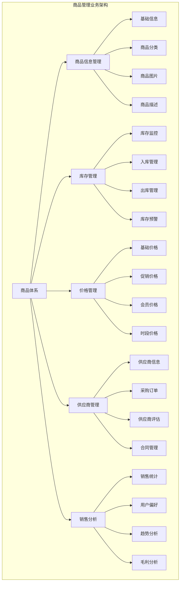
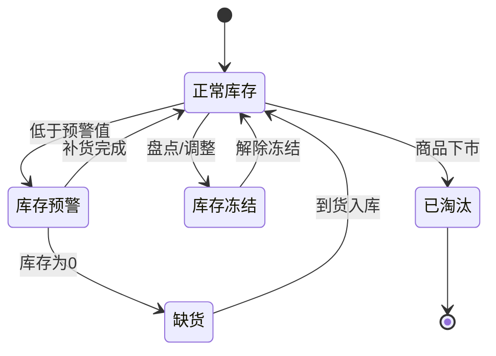
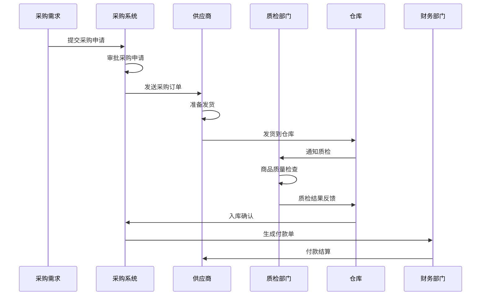

# 消费管理系统 - 商品管理

> **版本**: v1.0
> **更新时间**: 2025-11-13
> **功能模块**: 消费管理系统核心功能

## 1. 商品管理概述

### 1.1 功能简介

商品管理是消费管理系统的重要业务模块，负责管理园区内所有消费商品的信息、库存、价格、分类等核心数据。系统支持多品类商品管理、智能库存预警、价格策略配置、供应商管理等完整功能，为园区消费提供丰富的商品选择和便捷的管理服务。

### 1.2 核心特性

- **全品类商品支持**: 餐饮、零售、服务、虚拟商品等多种品类
- **多维度分类体系**: 品类分类、品牌分类、使用场景分类
- **智能库存管理**: 实时库存监控、自动补货提醒、库存预警
- **灵活价格策略**: 时段价格、会员价格、促销价格、批量价格
- **供应商管理**: 供应商信息、采购管理、质量评估
- **商品分析报表**: 销售分析、库存分析、毛利分析

### 1.3 业务架构



## 2. 商品分类体系

### 2.1 主分类架构

**一级分类**
- **餐饮类**: 食堂菜品、饮料、零食、生鲜食品
- **零售类**: 日用品、文具、电子产品、服装鞋帽
- **服务类**: 洗衣服务、维修服务、健身服务、培训服务
- **虚拟类**: 充值卡、优惠券、积分兑换、会员权益

**二级分类详细设计**

```json
{
  "categoryTree": {
    "餐饮类": {
      "食堂菜品": {
        "早餐": ["包子", "豆浆", "油条", "粥品"],
        "午餐": ["米饭套餐", "面条", "盖浇饭", "自选餐"],
        "晚餐": ["炒菜", "汤品", "主食", "小吃"],
        "夜宵": ["烧烤", "小炒", "粥品", "点心"]
      },
      "饮料": {
        "热饮": ["咖啡", "茶饮", "豆浆", "牛奶"],
        "冷饮": ["果汁", "汽水", "冰茶", "奶茶"],
        "健康饮品": ["养生茶", "鲜榨果汁", "蛋白饮品"]
      },
      "零食": {
        "坚果类": ["花生", "瓜子", "杏仁", "核桃"],
        "糕点类": ["蛋糕", "面包", "饼干", "月饼"],
        "休闲零食": ["薯片", "糖果", "巧克力", "牛肉干"]
      }
    },
    "零售类": {
      "日用品": {
        "洗护用品": ["洗发水", "沐浴露", "牙膏", "香皂"],
        "家居用品": ["纸巾", "洗涤用品", "清洁用品", "整理收纳"],
        "个人护理": ["护肤品", "化妆品", "个人护理工具"]
      },
      "文具": {
        "办公文具": ["笔类", "本册", "文件夹", "计算器"],
        "学生文具": ["铅笔盒", "书包", "美术用品", "学习用品"],
        "数码配件": ["U盘", "鼠标", "键盘", "数据线"]
      }
    }
  }
}
```

### 2.2 标签体系

**商品标签分类**

| 标签类型 | 标签示例 | 用途 |
|----------|----------|------|
| 功能标签 | 早餐、午餐、晚餐、夜宵 | 时段推荐 |
| 健康标签 | 低脂、低糖、高蛋白、有机 | 健康饮食指导 |
| 口味标签 | 辣、清淡、酸甜、咸鲜 | 口味偏好 |
| 价格标签 | 经济、实惠、高档、奢华 | 价格层次 |
| 时效标签 | 新品、热销、限量、季节性 | 营销推广 |
| 人群标签 | 儿童专用、成人、老年、孕妇 | 人群定位 |

### 2.3 商品数据结构

**核心数据表设计**

```sql
-- 商品分类表
CREATE TABLE t_product_category (
    category_id BIGINT PRIMARY KEY AUTO_INCREMENT COMMENT '分类ID',
    category_name VARCHAR(100) NOT NULL COMMENT '分类名称',
    category_code VARCHAR(50) UNIQUE NOT NULL COMMENT '分类编码',
    parent_id BIGINT DEFAULT 0 COMMENT '父分类ID',
    category_level TINYINT DEFAULT 1 COMMENT '分类层级',
    sort_order INT DEFAULT 0 COMMENT '排序顺序',
    category_icon VARCHAR(200) COMMENT '分类图标',
    category_description TEXT COMMENT '分类描述',
    status TINYINT DEFAULT 1 COMMENT '状态：0-禁用，1-启用',
    create_time DATETIME DEFAULT CURRENT_TIMESTAMP COMMENT '创建时间',
    update_time DATETIME DEFAULT CURRENT_TIMESTAMP ON UPDATE CURRENT_TIMESTAMP COMMENT '更新时间',
    deleted_flag TINYINT DEFAULT 0 COMMENT '删除标志：0-正常，1-删除'
) COMMENT='商品分类表';

-- 商品基础信息表
CREATE TABLE t_product (
    product_id BIGINT PRIMARY KEY AUTO_INCREMENT COMMENT '商品ID',
    product_code VARCHAR(50) UNIQUE NOT NULL COMMENT '商品编码',
    product_name VARCHAR(200) NOT NULL COMMENT '商品名称',
    category_id BIGINT NOT NULL COMMENT '分类ID',
    brand_id BIGINT COMMENT '品牌ID',
    supplier_id BIGINT COMMENT '供应商ID',
    product_type TINYINT DEFAULT 1 COMMENT '商品类型：1-实物，2-服务，3-虚拟',
    unit VARCHAR(20) DEFAULT '个' COMMENT '计量单位',
    specification VARCHAR(100) COMMENT '规格说明',
    weight DECIMAL(10,2) COMMENT '重量(kg)',
    volume DECIMAL(10,2) COMMENT '体积(m³)',
    shelf_life INT COMMENT '保质期(天)',
    storage_condition VARCHAR(200) COMMENT '存储条件',
    product_description TEXT COMMENT '商品描述',
    product_images JSON COMMENT '商品图片',
    product_tags JSON COMMENT '商品标签',
    status TINYINT DEFAULT 1 COMMENT '状态：0-下架，1-上架，2-草稿',
    sort_order INT DEFAULT 0 COMMENT '排序顺序',
    create_time DATETIME DEFAULT CURRENT_TIMESTAMP COMMENT '创建时间',
    update_time DATETIME DEFAULT CURRENT_TIMESTAMP ON UPDATE CURRENT_TIMESTAMP COMMENT '更新时间',
    deleted_flag TINYINT DEFAULT 0 COMMENT '删除标志：0-正常，1-删除',
    INDEX idx_category_id (category_id),
    INDEX idx_supplier_id (supplier_id),
    INDEX idx_status (status)
) COMMENT='商品基础信息表';

-- 商品价格表
CREATE TABLE t_product_price (
    price_id BIGINT PRIMARY KEY AUTO_INCREMENT COMMENT '价格ID',
    product_id BIGINT NOT NULL COMMENT '商品ID',
    price_type TINYINT DEFAULT 1 COMMENT '价格类型：1-标准价，2-会员价，3-促销价，4-时段价',
    price DECIMAL(10,2) NOT NULL COMMENT '价格',
    original_price DECIMAL(10,2) COMMENT '原价',
    cost_price DECIMAL(10,2) COMMENT '成本价',
    min_quantity INT DEFAULT 1 COMMENT '最小数量',
    max_quantity INT COMMENT '最大数量',
    effective_time DATETIME COMMENT '生效时间',
    expire_time DATETIME COMMENT '失效时间',
    member_level_id BIGINT COMMENT '会员等级ID',
    time_period_id BIGINT COMMENT '时段ID',
    status TINYINT DEFAULT 1 COMMENT '状态：0-禁用，1-启用',
    create_time DATETIME DEFAULT CURRENT_TIMESTAMP COMMENT '创建时间',
    update_time DATETIME DEFAULT CURRENT_TIMESTAMP ON UPDATE CURRENT_TIMESTAMP COMMENT '更新时间',
    INDEX idx_product_id (product_id),
    INDEX idx_price_type (price_type),
    INDEX idx_effective_time (effective_time, expire_time)
) COMMENT='商品价格表';
```

## 3. 库存管理

### 3.1 库存体系设计

**多级库存架构**
- **仓库级库存**: 总仓库存、区域仓库库存
- **门店级库存**: 食堂库存、便利店库存、自动售货机库存
- **虚拟库存**: 在途库存、预订库存、退货在途

**库存状态管理**


### 3.2 库存管理功能

**入库管理**
- **采购入库**: 供应商采购商品入库
- **生产入库**: 自产商品生产完成入库
- **调拨入库**: 其他仓库调拨入库
- **退货入库**: 客户退货商品入库
- **盘盈入库**: 库存盘点发现多余商品

**出库管理**
- **销售出库**: 正常销售商品出库
- **调拨出库**: 调拨到其他仓库
- **报损出库**: 商品损坏报废出库
- **赠品出库**: 赠送活动商品出库
- **盘亏出库**: 库存盘点发现缺失

### 3.3 库存数据结构

**库存数据表**

```sql
-- 库存主表
CREATE TABLE t_inventory (
    inventory_id BIGINT PRIMARY KEY AUTO_INCREMENT COMMENT '库存ID',
    product_id BIGINT NOT NULL COMMENT '商品ID',
    warehouse_id BIGINT DEFAULT 1 COMMENT '仓库ID',
    current_stock INT DEFAULT 0 COMMENT '当前库存',
    available_stock INT DEFAULT 0 COMMENT '可用库存',
    frozen_stock INT DEFAULT 0 COMMENT '冻结库存',
    safety_stock INT DEFAULT 0 COMMENT '安全库存',
    max_stock INT DEFAULT 0 COMMENT '最大库存',
    avg_cost DECIMAL(10,2) DEFAULT 0.00 COMMENT '平均成本',
    total_value DECIMAL(15,2) DEFAULT 0.00 COMMENT '库存总值',
    last_stock_check DATE COMMENT '最后盘点日期',
    create_time DATETIME DEFAULT CURRENT_TIMESTAMP COMMENT '创建时间',
    update_time DATETIME DEFAULT CURRENT_TIMESTAMP ON UPDATE CURRENT_TIMESTAMP COMMENT '更新时间',
    INDEX idx_product_id (product_id),
    INDEX idx_warehouse_id (warehouse_id),
    INDEX idx_current_stock (current_stock)
) COMMENT='库存主表';

-- 库存变动记录表
CREATE TABLE t_inventory_transaction (
    transaction_id BIGINT PRIMARY KEY AUTO_INCREMENT COMMENT '交易ID',
    product_id BIGINT NOT NULL COMMENT '商品ID',
    warehouse_id BIGINT DEFAULT 1 COMMENT '仓库ID',
    transaction_type TINYINT NOT NULL COMMENT '交易类型：1-入库，2-出库，3-调拨，4-盘点',
    quantity_change INT NOT NULL COMMENT '数量变化(正数入库，负数出库)',
    before_stock INT NOT NULL COMMENT '变动前库存',
    after_stock INT NOT NULL COMMENT '变动后库存',
    unit_cost DECIMAL(10,2) COMMENT '单价成本',
    total_cost DECIMAL(15,2) COMMENT '总成本',
    reference_no VARCHAR(50) COMMENT '关联单号',
    remark VARCHAR(500) COMMENT '备注',
    operator_id BIGINT COMMENT '操作人ID',
    create_time DATETIME DEFAULT CURRENT_TIMESTAMP COMMENT '创建时间',
    INDEX idx_product_id (product_id),
    INDEX idx_transaction_type (transaction_type),
    INDEX idx_create_time (create_time)
) COMMENT='库存变动记录表';

-- 库存预警表
CREATE TABLE t_inventory_alert (
    alert_id BIGINT PRIMARY KEY AUTO_INCREMENT COMMENT '预警ID',
    product_id BIGINT NOT NULL COMMENT '商品ID',
    warehouse_id BIGINT DEFAULT 1 COMMENT '仓库ID',
    alert_type TINYINT NOT NULL COMMENT '预警类型：1-低库存，2-高库存，3-过期预警',
    current_stock INT NOT NULL COMMENT '当前库存',
    alert_threshold INT NOT NULL COMMENT '预警阈值',
    alert_level TINYINT DEFAULT 1 COMMENT '预警级别：1-一般，2-重要，3-紧急',
    alert_message VARCHAR(500) COMMENT '预警信息',
    status TINYINT DEFAULT 0 COMMENT '处理状态：0-未处理，1-已处理，2-已忽略',
    create_time DATETIME DEFAULT CURRENT_TIMESTAMP COMMENT '创建时间',
    handle_time DATETIME COMMENT '处理时间',
    handler_id BIGINT COMMENT '处理人ID',
    INDEX idx_product_id (product_id),
    INDEX idx_alert_type (alert_type),
    INDEX idx_status (status)
) COMMENT='库存预警表';
```

### 3.4 智能补货策略

**补货策略配置**
```json
{
  "replenishmentStrategy": {
    "safetyStockCalculation": {
      "method": "STATISTICAL", // FIXED, STATISTICAL, ML_PREDICTION
      "parameters": {
        "serviceLevel": 0.95,
        "leadTime": 3,
        "demandVariability": 0.2
      }
    },
    "reorderPoint": {
      "formula": "safety_stock + (avg_daily_demand * lead_time)",
      "minReorderQuantity": 10,
      "maxReorderQuantity": 1000
    },
    "autoReplenishment": {
      "enabled": true,
      "checkFrequency": "DAILY",
      "approvalRequired": true,
      "approvalThreshold": 5000.00
    }
  }
}
```

## 4. 价格管理

### 4.1 价格策略体系

**多维度价格结构**

| 价格类型 | 适用场景 | 计算方式 | 备注 |
|----------|----------|----------|------|
| 标准价格 | 常规销售 | 成本 + 毛利率 | 基础定价 |
| 会员价格 | 会员专享 | 标准价 × 折扣率 | 根据会员等级 |
| 促销价格 | 活动促销 | 标准价 × 促销折扣 | 限时限量 |
| 时段价格 | 分时定价 | 根据时段调整 | 高峰期加价 |
| 批量价格 | 批量采购 | 阶梯式定价 | 数量越多越便宜 |
| 区域价格 | 区域差异 | 根据区域成本调整 | 考虑物流成本 |

### 4.2 动态定价

**时段定价策略**
```json
{
  "timeBasedPricing": {
    "mealPricing": {
      "breakfast": {
        "timeRange": "06:00-09:00",
        "discountRate": 0.9,
        "applicableCategories": ["餐饮类", "饮料"]
      },
      "lunch": {
        "timeRange": "11:00-13:30",
        "discountRate": 0.95,
        "applicableCategories": ["食堂菜品"]
      },
      "dinner": {
        "timeRange": "17:00-19:30",
        "discountRate": 0.95,
        "applicableCategories": ["食堂菜品"]
      }
    },
    "peakPricing": {
      "peakHours": "12:00-13:00",
      "surchargeRate": 1.1,
      "applicableCategories": ["热门菜品"]
    }
  }
}
```

**智能定价算法**
```java
@Service
public class DynamicPricingService {

    /**
     * 基于需求预测的动态定价
     */
    public BigDecimal calculateDynamicPrice(Long productId, LocalDateTime time) {
        // 1. 获取历史销售数据
        List<SalesData> historicalData = salesService.getHistoricalData(productId, time);

        // 2. 预测当前时段需求
        DemandForecast forecast = demandForecastingService.forecast(productId, time);

        // 3. 获取库存水平
        InventoryLevel inventory = inventoryService.getCurrentStock(productId);

        // 4. 获取竞品价格
        List<CompetitorPrice> competitorPrices = priceService.getCompetitorPrices(productId);

        // 5. 计算最优价格
        BigDecimal optimalPrice = priceOptimizationAlgorithm.optimize(
            historicalData,
            forecast,
            inventory,
            competitorPrices
        );

        return optimalPrice;
    }
}
```

### 4.3 促销管理

**促销活动类型**
- **折扣促销**: 百分比折扣、固定金额减免
- **买赠促销**: 买一送一、买二送一、满赠活动
- **套装促销**: 商品组合优惠、套餐优惠
- **时段促销**: 限时抢购、秒杀活动
- **会员促销**: 会员专享价、积分翻倍
- **节日促销**: 节日主题活动、节日特价

**促销活动配置**
```json
{
  "promotionConfig": {
    "discountPromotion": {
      "name": "午餐特惠",
      "type": "PERCENTAGE_DISCOUNT",
      "discountRate": 0.8,
      "applicableProducts": ["午餐套餐A", "午餐套餐B"],
      "timeRange": "11:30-13:30",
      "weekdays": ["MONDAY", "TUESDAY", "WEDNESDAY", "THURSDAY", "FRIDAY"],
      "maxDiscountAmount": 20.00,
      "maxUsagePerUser": 3
    },
    "bundlePromotion": {
      "name": "营养早餐套餐",
      "type": "BUNDLE_DISCOUNT",
      "bundleProducts": [
        {"productId": "P001", "quantity": 1},
        {"productId": "P002", "quantity": 1},
        {"productId": "P003", "quantity": 1}
      ],
      "bundlePrice": 15.00,
      "originalPrice": 22.00,
      "description": "包子+豆浆+鸡蛋营养套餐"
    }
  }
}
```

## 5. 供应商管理

### 5.1 供应商信息管理

**供应商分类体系**
- **战略供应商**: 长期合作、稳定供应、战略合作
- **核心供应商: 主要供应、质量可靠、价格合理
- **一般供应商**: 偶尔合作、补充供应、价格敏感
- **临时供应商**: 临时需求、短期合作、应急供应

**供应商评估指标**
```json
{
  "supplierEvaluation": {
    "qualityMetrics": {
      "productQuality": {
        "weight": 0.3,
        "criteria": ["质量合格率", "包装完好率", "保质期合规率"]
      },
      "deliveryPerformance": {
        "weight": 0.25,
        "criteria": ["准时交付率", "订单完成率", "交付准确性"]
      },
      "priceCompetitiveness": {
        "weight": 0.2,
        "criteria": ["价格水平", "价格稳定性", "付款条件"]
      },
      "serviceQuality": {
        "weight": 0.15,
        "criteria": ["响应速度", "问题解决", "沟通效率"]
      },
      "compliance": {
        "weight": 0.1,
        "criteria": ["资质认证", "合规检查", "社会责任"]
      }
    },
    "scoringLevels": {
      "excellent": "90-100",
      "good": "80-89",
      "average": "70-79",
      "poor": "60-69",
      "unacceptable": "<60"
    }
  }
}
```

### 5.2 采购管理

**采购流程**


### 5.3 供应商数据结构

**供应商数据表**

```sql
-- 供应商基础信息表
CREATE TABLE t_supplier (
    supplier_id BIGINT PRIMARY KEY AUTO_INCREMENT COMMENT '供应商ID',
    supplier_code VARCHAR(50) UNIQUE NOT NULL COMMENT '供应商编码',
    supplier_name VARCHAR(200) NOT NULL COMMENT '供应商名称',
    supplier_type TINYINT DEFAULT 1 COMMENT '供应商类型：1-战略，2-核心，3-一般，4-临时',
    contact_person VARCHAR(100) COMMENT '联系人',
    contact_phone VARCHAR(50) COMMENT '联系电话',
    contact_email VARCHAR(100) COMMENT '联系邮箱',
    address VARCHAR(500) COMMENT '供应商地址',
    business_license VARCHAR(100) COMMENT '营业执照号',
    tax_id VARCHAR(50) COMMENT '税务登记号',
    bank_account VARCHAR(100) COMMENT '银行账户',
    payment_terms VARCHAR(100) COMMENT '付款条件',
    delivery_terms VARCHAR(100) COMMENT '交货条件',
    quality_level VARCHAR(20) COMMENT '质量等级',
    cooperation_years INT COMMENT '合作年限',
    last_evaluation_score DECIMAL(5,2) COMMENT '最新评分',
    status TINYINT DEFAULT 1 COMMENT '状态：0-禁用，1-启用',
    create_time DATETIME DEFAULT CURRENT_TIMESTAMP COMMENT '创建时间',
    update_time DATETIME DEFAULT CURRENT_TIMESTAMP ON UPDATE CURRENT_TIMESTAMP COMMENT '更新时间',
    INDEX idx_supplier_type (supplier_type),
    INDEX idx_status (status)
) COMMENT='供应商基础信息表';

-- 供应商商品关联表
CREATE TABLE t_supplier_product (
    relation_id BIGINT PRIMARY KEY AUTO_INCREMENT COMMENT '关联ID',
    supplier_id BIGINT NOT NULL COMMENT '供应商ID',
    product_id BIGINT NOT NULL COMMENT '商品ID',
    supply_price DECIMAL(10,2) NOT NULL COMMENT '供应价格',
    min_order_quantity INT DEFAULT 1 COMMENT '最小订购量',
    lead_time INT DEFAULT 7 COMMENT '交货期(天)',
    quality_standard VARCHAR(200) COMMENT '质量标准',
    packaging_spec VARCHAR(100) COMMENT '包装规格',
    supply_capacity INT COMMENT '供应能力',
    contract_period_start DATE COMMENT '合同期开始',
    contract_period_end DATE COMMENT '合同期结束',
    status TINYINT DEFAULT 1 COMMENT '状态：0-停用，1-启用',
    create_time DATETIME DEFAULT CURRENT_TIMESTAMP COMMENT '创建时间',
    update_time DATETIME DEFAULT CURRENT_TIMESTAMP ON UPDATE CURRENT_TIMESTAMP COMMENT '更新时间',
    INDEX idx_supplier_id (supplier_id),
    INDEX idx_product_id (product_id),
    UNIQUE KEY uk_supplier_product (supplier_id, product_id)
) COMMENT='供应商商品关联表';
```

## 6. 销售分析

### 6.1 销售统计

**关键销售指标**
- **销售量指标**: 总销量、日销量、周销量、月销量
- **销售额指标**: 总销售额、客单价、复购率、毛利率
- **商品指标**: 热销商品、滞销商品、新品表现
- **用户指标**: 用户偏好、消费频次、用户分层

**销售数据分析**
```json
{
  "salesAnalytics": {
    "dailySales": {
      "totalSales": 15680.50,
      "totalOrders": 892,
      "averageOrderValue": 17.58,
      "topCategories": [
        {"category": "餐饮类", "sales": 8920.30, "orders": 520},
        {"category": "零售类", "sales": 4560.20, "orders": 280},
        {"category": "服务类", "sales": 2200.00, "orders": 92}
      ]
    },
    "productPerformance": {
      "bestSellers": [
        {"productId": "P001", "productName": "营养套餐A", "sales": 320, "revenue": 6400.00},
        {"productId": "P002", "productName": "鲜榨果汁", "sales": 280, "revenue": 2240.00}
      ],
      "slowMovers": [
        {"productId": "P015", "productName": "高档笔记本", "sales": 2, "revenue": 198.00}
      ]
    },
    "customerBehavior": {
      "peakHours": ["12:00-13:00", "18:00-19:00"],
      "averageFrequency": 2.3,
      "retentionRate": 0.78,
      "preferredCategories": ["餐饮类", "饮料"]
    }
  }
}
```

### 6.2 用户偏好分析

**用户画像分析**
```java
@Service
public class UserPreferenceAnalysisService {

    /**
     * 分析用户购买偏好
     */
    public UserPreferenceVO analyzeUserPreference(Long userId) {
        // 1. 获取用户历史购买记录
        List<PurchaseRecord> purchaseHistory = purchaseService.getUserPurchaseHistory(userId);

        // 2. 分析品类偏好
        Map<String, Double> categoryPreferences = analyzeCategoryPreferences(purchaseHistory);

        // 3. 分析价格偏好
        PriceRangePreference pricePreference = analyzePricePreference(purchaseHistory);

        // 4. 分析时段偏好
        Map<String, Double> timePreferences = analyzeTimePreferences(purchaseHistory);

        // 5. 分析品牌偏好
        Map<String, Double> brandPreferences = analyzeBrandPreferences(purchaseHistory);

        return UserPreferenceVO.builder()
            .userId(userId)
            .categoryPreferences(categoryPreferences)
            .pricePreference(pricePreference)
            .timePreferences(timePreferences)
            .brandPreferences(brandPreferences)
            .build();
    }
}
```

### 6.3 智能推荐

**商品推荐算法**
```json
{
  "recommendationEngine": {
    "collaborativeFiltering": {
      "algorithm": "USER_BASED",
      "similarityMetric": "COSINE",
      "neighborCount": 50,
      "recommendationCount": 10
    },
    "contentBased": {
      "features": ["category", "price_range", "brand", "tags"],
      "similarityThreshold": 0.7
    },
    "hybridApproach": {
      "weights": {
        "collaborative": 0.6,
        "contentBased": 0.3,
        "popularity": 0.1
      }
    },
    "contextualFactors": [
      "time_of_day",
      "day_of_week",
      "weather",
      "special_events"
    ]
  }
}
```

## 7. 系统集成

### 7.1 POS系统集成

**POS商品同步**
- **实时同步**: 商品信息、价格、库存实时同步到POS
- **批量同步**: 定时批量同步商品数据到POS终端
- **增量更新**: 只同步变更的商品信息，提高效率

**POS交易数据回流**
```java
@Service
public class POSIntegrationService {

    /**
     * 同步POS交易数据
     */
    public void syncPOSTransactions() {
        // 1. 从POS系统获取交易数据
        List<POSTransaction> posTransactions = posService.getPendingTransactions();

        // 2. 转换为系统标准格式
        List<TransactionRecord> transactions = posTransactions.stream()
            .map(this::convertToTransactionRecord)
            .collect(Collectors.toList());

        // 3. 验证交易数据
        List<TransactionRecord> validTransactions = validateTransactions(transactions);

        // 4. 更新库存
        updateInventory(validTransactions);

        // 5. 记录销售数据
        recordSalesData(validTransactions);

        // 6. 标记POS数据已同步
        posService.markAsSynced(posTransactions);
    }
}
```

### 7.2 外部系统集成

**电商平台集成**
```json
{
  "ecommerceIntegration": {
    "platforms": [
      {
        "name": "京东企业购",
        "apiType": "REST",
        "authentication": "OAuth2",
        "endpoints": {
          "products": "/api/products",
          "orders": "/api/orders",
          "inventory": "/api/inventory"
        }
      },
      {
        "name": "天猫企业采购",
        "apiType": "REST",
        "authentication": "API_KEY",
        "endpoints": {
          "products": "/gateway/router",
          "orders": "/gateway/router"
        }
      }
    ],
    "syncFrequency": "HOURLY",
    "dataMapping": {
      "productFields": {
        "name": "title",
        "price": "salePrice",
        "stock": "quantity"
      }
    }
  }
}
```

## 8. API接口设计

### 8.1 商品管理接口

**商品查询接口**
```java
@RestController
@RequestMapping("/api/v1/products")
public class ProductController {

    /**
     * 分页查询商品列表
     */
    @GetMapping
    public ResponseDTO<PageResult<ProductVO>> getProducts(
            @RequestParam(required = false) String categoryCode,
            @RequestParam(required = false) String keyword,
            @RequestParam(required = false) Integer status,
            @RequestParam(defaultValue = "1") Integer pageNum,
            @RequestParam(defaultValue = "20") Integer pageSize) {

        ProductQueryRequest request = ProductQueryRequest.builder()
            .categoryCode(categoryCode)
            .keyword(keyword)
            .status(status)
            .pageNum(pageNum)
            .pageSize(pageSize)
            .build();

        PageResult<ProductVO> result = productService.queryProducts(request);
        return ResponseDTO.ok(result);
    }

    /**
     * 获取商品详情
     */
    @GetMapping("/{productId}")
    public ResponseDTO<ProductDetailVO> getProductDetail(@PathVariable Long productId) {
        ProductDetailVO detail = productService.getProductDetail(productId);
        return ResponseDTO.ok(detail);
    }

    /**
     * 获取商品价格
     */
    @GetMapping("/{productId}/price")
    public ResponseDTO<ProductPriceVO> getProductPrice(
            @PathVariable Long productId,
            @RequestParam(required = false) Long memberId,
            @RequestParam(required = false) String timePeriod) {

        ProductPriceVO price = productService.getProductPrice(productId, memberId, timePeriod);
        return ResponseDTO.ok(price);
    }
}
```

### 8.2 库存管理接口

**库存查询接口**
```java
@RestController
@RequestMapping("/api/v1/inventory")
public class InventoryController {

    /**
     * 查询商品库存
     */
    @GetMapping("/product/{productId}")
    public ResponseDTO<InventoryVO> getProductInventory(@PathVariable Long productId) {
        InventoryVO inventory = inventoryService.getProductInventory(productId);
        return ResponseDTO.ok(inventory);
    }

    /**
     * 库存预警查询
     */
    @GetMapping("/alerts")
    public ResponseDTO<List<InventoryAlertVO>> getInventoryAlerts(
            @RequestParam(required = false) Integer alertType,
            @RequestParam(required = false) Integer status) {

        List<InventoryAlertVO> alerts = inventoryService.getInventoryAlerts(alertType, status);
        return ResponseDTO.ok(alerts);
    }
}
```

## 9. 系统配置

### 9.1 商品配置

**商品基础配置**
```yaml
product_config:
  default_settings:
    status: 1
    sort_order: 0
    auto_generate_code: true
    code_prefix: "PRD"
    code_length: 8

  image_settings:
    max_size: 5242880  # 5MB
    allowed_formats: ["jpg", "jpeg", "png", "webp"]
    max_count: 10
    default_image: "/images/default-product.png"

  inventory_settings:
    default_safety_stock: 10
    low_stock_threshold: 20
    out_of_stock_threshold: 0
    auto_reorder: false
```

### 9.2 业务配置

**业务规则配置**
```json
{
  "businessRules": {
    "productManagement": {
      "requireApproval": true,
      "approvalLevels": 2,
      "mandatoryFields": ["name", "category", "price"],
      "categoryRequired": true
    },
    "priceManagement": {
      "maxPriceChange": 0.5,  // 最大调价幅度50%
      "priceHistoryRetention": 365,  // 价格历史保留365天
      "memberDiscountMax": 0.3,  // 会员最大折扣30%
      "promotionMaxDuration": 30  // 促销最长30天
    },
    "inventoryManagement": {
      "negativeStockAllowed": false,
      "autoGeneratePO": false,
      "stockCheckFrequency": "WEEKLY",
      "expiredProductHandling": "AUTO_REMOVE"
    }
  }
}
```

通过完善的商品管理功能，IOE-DREAM消费管理系统能够为园区提供丰富的商品选择和便捷的购物体验，同时为商户提供高效的管理工具和数据分析支持。