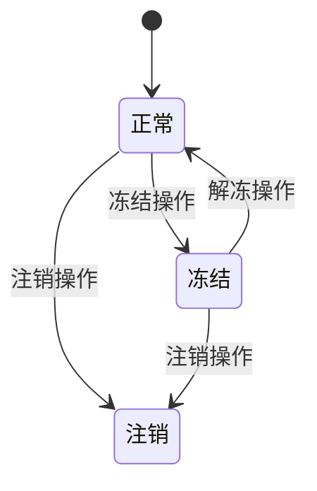
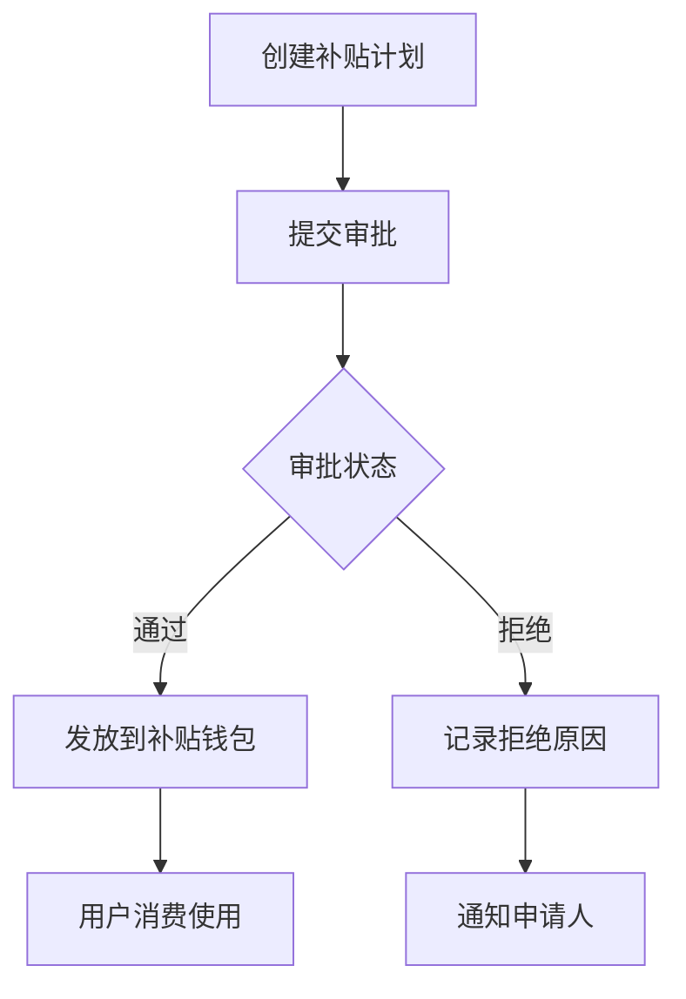

# 账户管理

<cite>
**本文档引用的文件**  
- [account-management.html](file://smart-admin-web-javascript/consumption-system-refactored copy/pages/account-management.html)
- [accounts.html](file://smart-admin-web-javascript/consumption-system-refactored copy/pages/accounts.html)
- [manual-consumption.html](file://smart-admin-web-javascript/consumption-system-refactored copy/pages/manual-consumption.html)
- [subsidy.html](file://smart-admin-web-javascript/consumption-system-refactored copy/pages/subsidy.html)
- [menu.js](file://smart-admin-web-javascript/consumption-system-refactored copy/js/menu.js)
- [README.md](file://smart-admin-web-javascript/src/views/business/consumption/README.md)
</cite>

## 目录
1. [简介](#简介)
2. [账户管理功能](#账户管理功能)
3. [账户类别管理](#账户类别管理)
4. [账户状态管理](#账户状态管理)
5. [三钱包机制](#三钱包机制)
6. [账户安全与权限](#账户安全与权限)
7. [补贴与营销集成](#补贴与营销集成)
8. [手工补消费功能](#手工补消费功能)
9. [数据一致性与并发处理](#数据一致性与并发处理)
10. [异常场景处理](#异常场景处理)

## 简介
账户管理模块是消费系统的核心组成部分，负责用户账户的全生命周期管理。该模块支持账户的创建、充值、扣款、余额查询等基本功能，同时提供账户状态管理、安全策略、与补贴优惠等营销功能的集成。系统采用三钱包架构（现金钱包、补贴钱包、优惠钱包），实现资金的分类管理和精细化控制。本模块通过前端页面与后端接口的配合，为管理员提供全面的账户管理能力。

## 账户管理功能
账户管理功能提供对系统内所有用户账户的集中管理。管理员可以通过账户管理页面查看账户列表，进行搜索、筛选和批量操作。系统提供账户总数、正常账户、冻结账户和注销账户的统计信息，帮助管理员快速了解账户状态分布。支持通过账户编号、持卡人姓名、账户类型、账户状态和余额范围等条件进行高级搜索。批量操作功能包括批量冻结、批量解冻和批量充值，提高管理效率。账户详情通过侧边栏面板展示，包含基本信息、钱包设置和权限配置三个标签页。

**Section sources**
- [account-management.html](file://smart-admin-web-javascript/consumption-system-refactored copy/pages/account-management.html#L1-L800)

## 账户类别管理
账户类别管理用于定义和维护系统中的账户类型。每个账户类别具有唯一的类别编号、名称、图标和颜色，便于区分和识别。系统预设了员工账户、临时账户、管理员账户、访客账户和学生账户等类别。管理员可以为每个账户类别设置消费限额，包括日消费限额和月消费限额，以及单笔最小和最大金额限制。权限配置允许为账户类别分配特定的消费区域和餐别权限，实现精细化的访问控制。账户类别还支持区域餐别权限的配置，确保账户只能在授权的区域和时间段内进行消费。

**Section sources**
- [accounts.html](file://smart-admin-web-javascript/consumption-system-refactored copy/pages/accounts.html#L1-L800)

## 账户状态管理
账户状态管理机制定义了账户的生命周期和状态转换逻辑。系统支持三种主要账户状态：正常、冻结和注销。正常状态表示账户可以正常使用，进行消费和充值操作。冻结状态用于暂时禁用账户，通常在账户异常或安全风险时使用，冻结的账户无法进行消费但可以解冻恢复。注销状态表示账户已永久停用，通常在用户离职或退学时使用。状态转换通过管理员操作完成，如冻结账户、解冻账户和注销账户。系统在账户列表中以不同颜色的状态标签显示账户状态，便于快速识别。

**Diagram sources**
- [account-management.html](file://smart-admin-web-javascript/consumption-system-refactored copy/pages/account-management.html#L524-L609)

## 三钱包机制
系统采用三钱包机制管理用户资金，包括现金钱包、补贴钱包和优惠钱包。现金钱包用于存储用户充值的现金资金，是主要的消费资金来源。补贴钱包用于存储企业或机构发放的各类补贴，如餐补、交通补贴等，通常有特定的使用规则和有效期。优惠钱包用于存储优惠券、折扣等营销活动发放的资金，用于抵扣消费金额。三钱包在账户详情中以不同颜色的标签显示，便于区分。充值功能支持为三个钱包分别充值，消费时可以选择使用哪个钱包的资金。这种设计实现了资金的分类管理，满足了不同资金来源和使用规则的需求。

**Section sources**
- [account-management.html](file://smart-admin-web-javascript/consumption-system-refactored copy/pages/account-management.html#L706-L734)

## 账户安全与权限
账户安全策略包括余额校验、交易密码验证和操作日志记录。系统在每次消费前进行余额校验，确保账户余额充足，防止透支。交易密码验证用于高风险操作，如大额消费或账户信息修改，增加安全性。操作日志记录所有关键操作，包括账户创建、修改、冻结、解冻和注销，便于审计和追踪。权限配置允许为账户设置消费限额、允许消费区域和允许餐别，实现基于角色的访问控制。消费限额包括单次消费限额和每日消费限额，防止异常消费。允许消费区域和餐别配置确保账户只能在授权的地点和时间段内进行消费，提高安全性。

**Section sources**
- [account-management.html](file://smart-admin-web-javascript/consumption-system-refactored copy/pages/account-management.html#L733-L759)

## 补贴与营销集成
账户系统与补贴、优惠券等营销功能深度集成。补贴管理模块允许管理员创建和审批补贴发放计划，将补贴金额发放到用户的补贴钱包。补贴可以按批次发放，支持餐补、交通补贴、生活补贴等多种类型。系统提供待审批、已审批和全部记录三个标签页，便于管理补贴申请。批量操作功能支持批量通过和批量拒绝补贴申请，提高审批效率。优惠券功能与优惠钱包集成，用户获得的优惠券金额会自动存入优惠钱包，消费时可选择使用。这种集成方式实现了营销活动与账户系统的无缝衔接，提升了用户体验和管理效率。

**Diagram sources**
- [subsidy.html](file://smart-admin-web-javascript/consumption-system-refactored copy/pages/subsidy.html#L224-L506)

## 手工补消费功能
手工补消费功能用于处理设备故障、网络异常等特殊情况下的消费记录补录。该功能采用三步操作流程：选择账户、填写消费信息和确认提交。第一步通过账户编号查询账户信息，包括持卡人姓名、账户类型和当前余额。第二步填写消费详情，包括消费时间、地点、金额、商品名称、支付方式和餐别，并要求填写补消费原因。第三步显示所有信息供管理员确认，确保操作的准确性和合规性。系统在页面顶部显示警告提示，强调该操作的特殊性和重要性。提交后生成唯一的补消费记录编号，便于追踪和审计。

**Section sources**
- [manual-consumption.html](file://smart-admin-web-javascript/consumption-system-refactored copy/pages/manual-consumption.html#L1-L532)

## 数据一致性与并发处理
系统通过前端验证和后端接口的配合保障数据一致性。前端在提交前进行表单验证，确保必填项完整和数据格式正确。后端接口采用幂等性设计，防止重复提交导致的数据不一致。对于并发交易处理，系统采用乐观锁机制，在更新账户余额时检查版本号，确保数据的一致性。三钱包的余额更新采用事务处理，保证资金转移的原子性。操作日志记录所有关键操作，包括操作人、操作时间和操作详情，便于问题追踪和审计。系统还支持数据导出功能，便于进行离线分析和备份。

**Section sources**
- [README.md](file://smart-admin-web-javascript/src/views/business/consumption/README.md#L131-L255)

## 异常场景处理
系统针对多种异常场景提供了处理方法。对于账户余额不足的情况，系统在消费时进行实时校验并提示错误，防止透支。对于网络异常导致的交易中断，系统记录交易日志，管理员可通过手工补消费功能补录交易。对于设备故障，系统支持离线消费模式，待网络恢复后自动同步数据。对于重复提交，系统通过前端禁用提交按钮和后端幂等性校验双重保障，防止重复交易。对于非法操作，系统通过权限验证和操作日志记录，及时发现和处理安全风险。所有异常情况都有相应的提示信息和处理流程，确保系统的稳定运行。

**Section sources**
- [manual-consumption.html](file://smart-admin-web-javascript/consumption-system-refactored copy/pages/manual-consumption.html#L154-L159)