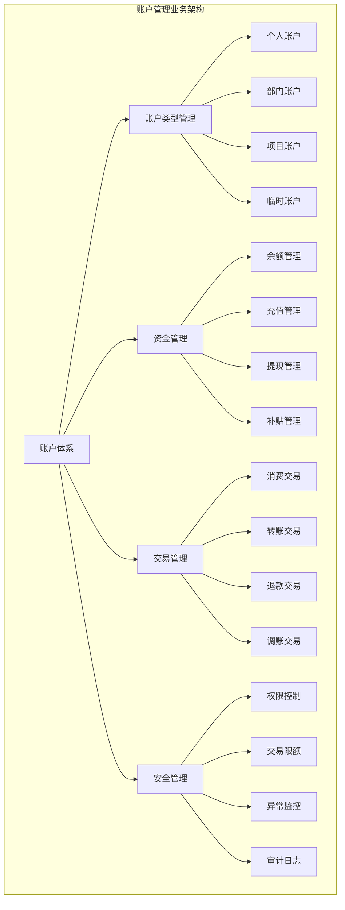
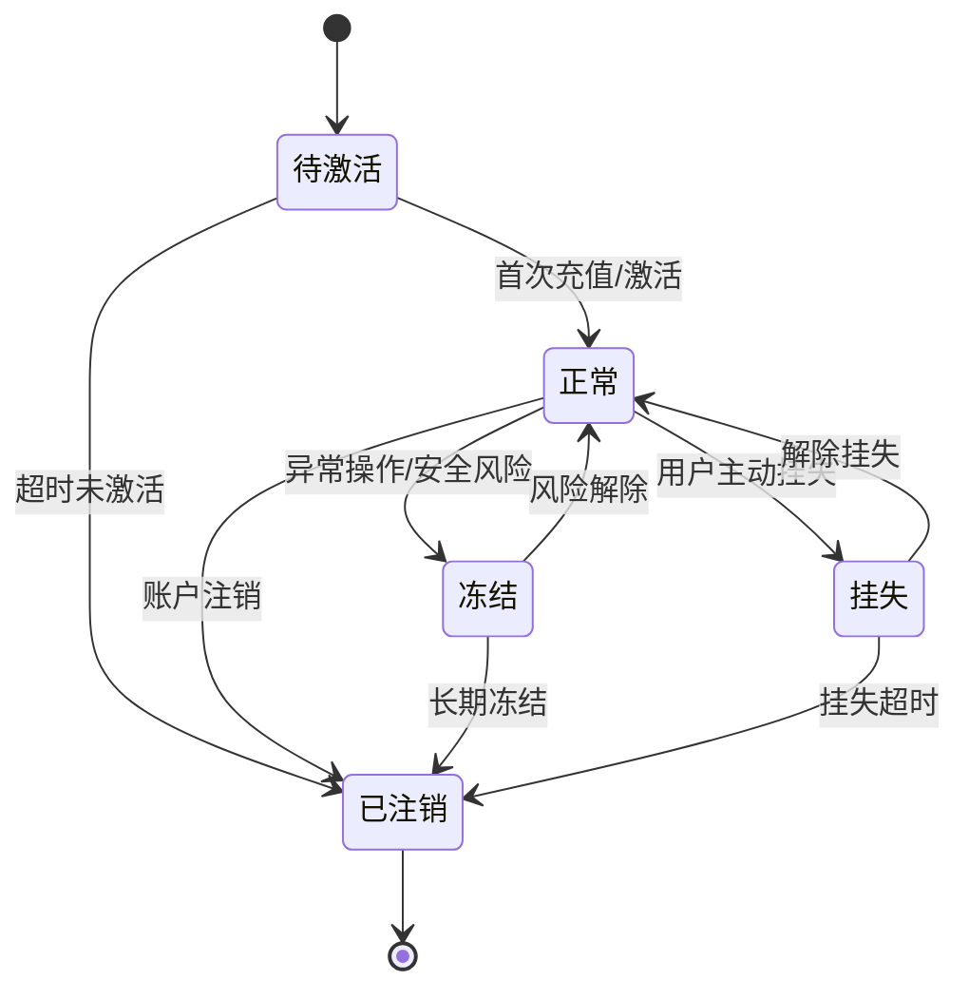
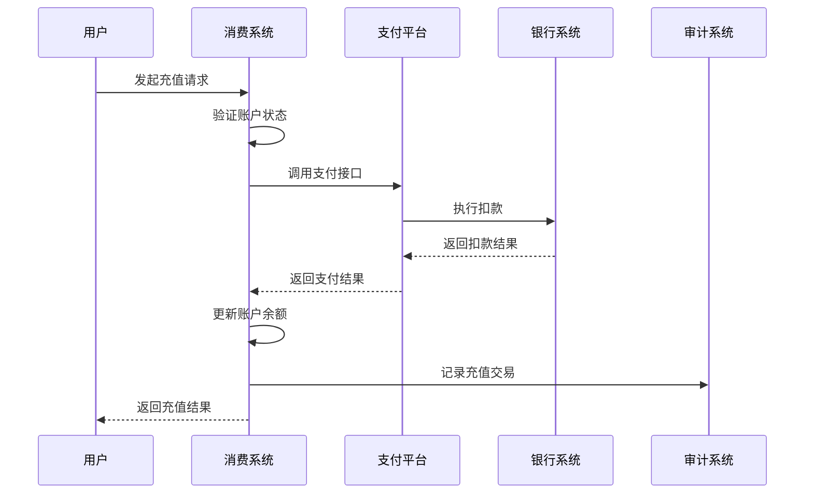
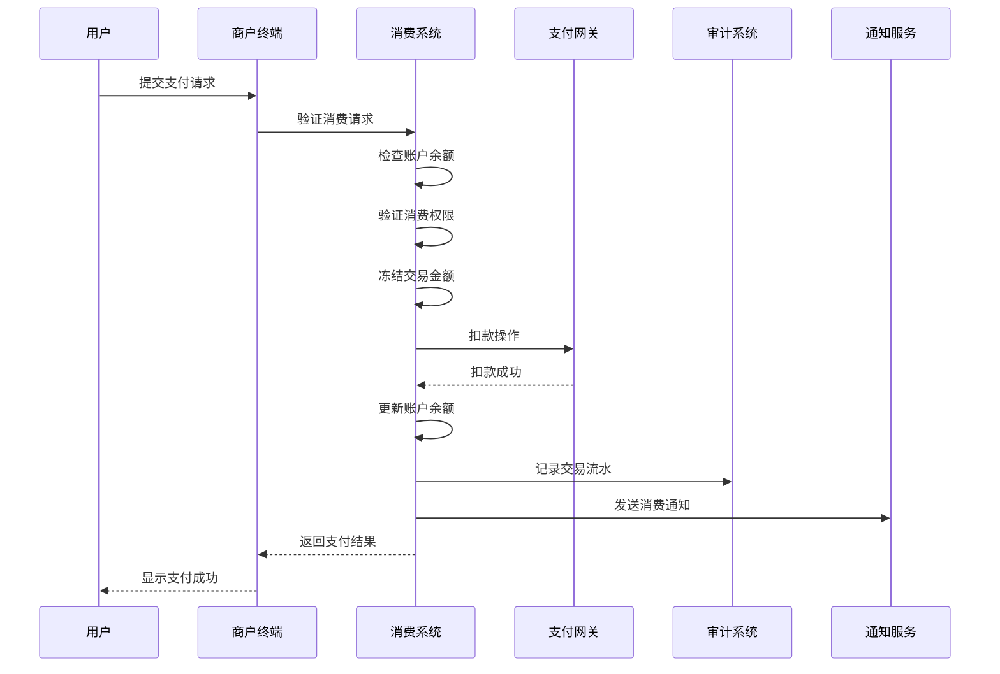

# 消费管理系统 - 账户管理

> **版本**: v1.0
> **更新时间**: 2025-11-13
> **功能模块**: 消费管理系统核心功能

## 1. 账户管理概述

### 1.1 功能简介

账户管理是消费管理系统的核心基础模块，负责管理用户账户的全生命周期，包括账户创建、资金充值、余额查询、交易记录、账户状态管理等功能。系统支持多种账户类型，提供灵活的资金管理和安全保障机制。

### 1.2 核心特性

- **多账户类型支持**: 个人账户、部门账户、项目账户、临时账户
- **多支付方式**: 一卡通、微信、支付宝、银行卡、现金
- **实时余额管理**: 支持实时余额查询和冻结/解冻操作
- **资金安全保障**: 多级审批、交易限额、异常监控
- **自动补贴发放**: 定期补贴、活动补贴、临时补贴
- **完整的审计追踪**: 所有资金操作都有详细的审计记录

### 1.3 业务架构



## 2. 账户体系设计

### 2.1 账户类型定义

**个人账户**
- **适用对象**: 公司员工、临时工、实习生
- **账户权限**: 消费、转账、查询、补贴领取
- **资金来源**: 个人充值、公司补贴、转账收入
- **特殊功能**: 支持家庭成员绑定、设置消费限额

**部门账户**
- **适用对象**: 各部门、分支机构
- **账户权限**: 部门费用支出、活动经费管理
- **资金来源**: 公司拨款、部门创收、费用结余
- **审批流程**: 大额支出需要多级审批

**项目账户**
- **适用对象**: 专项项目、研发项目
- **账户权限**: 项目相关费用支出
- **资金来源**: 项目预算、专项拨款
- **生命周期**: 项目创建时建立，项目结束时注销

**临时账户**
- **适用对象**: 访客、短期工作人员、培训学员
- **账户权限**: 有限消费权限
- **资金来源**: 预充值、主账户转账
- **时效性**: 自动过期、余额返还主账户

### 2.2 账户状态管理

**账户状态流转图**


### 2.3 账户数据结构

**核心数据表设计**

```sql
-- 账户基础信息表
CREATE TABLE t_account (
    account_id BIGINT PRIMARY KEY AUTO_INCREMENT COMMENT '账户ID',
    account_no VARCHAR(32) UNIQUE NOT NULL COMMENT '账户编号',
    account_type TINYINT NOT NULL COMMENT '账户类型：1-个人，2-部门，3-项目，4-临时',
    account_status TINYINT DEFAULT 1 COMMENT '账户状态：0-注销，1-正常，2-冻结，3-挂失',
    owner_id BIGINT NOT NULL COMMENT '账户所有者ID',
    owner_name VARCHAR(100) NOT NULL COMMENT '账户所有者姓名',
    owner_type TINYINT NOT NULL COMMENT '所有者类型：1-员工，2-部门，3-项目',
    account_name VARCHAR(200) COMMENT '账户名称',
    balance DECIMAL(15,2) DEFAULT 0.00 COMMENT '账户余额',
    frozen_balance DECIMAL(15,2) DEFAULT 0.00 COMMENT '冻结余额',
    credit_limit DECIMAL(15,2) DEFAULT 0.00 COMMENT '信用额度',
    total_recharge DECIMAL(15,2) DEFAULT 0.00 COMMENT '累计充值金额',
    total_consume DECIMAL(15,2) DEFAULT 0.00 COMMENT '累计消费金额',
    last_transaction_time DATETIME COMMENT '最后交易时间',
    last_recharge_time DATETIME COMMENT '最后充值时间',
    create_time DATETIME DEFAULT CURRENT_TIMESTAMP COMMENT '创建时间',
    update_time DATETIME DEFAULT CURRENT_TIMESTAMP ON UPDATE CURRENT_TIMESTAMP COMMENT '更新时间',
    deleted_flag TINYINT DEFAULT 0 COMMENT '删除标志：0-正常，1-删除'
) COMMENT='账户基础信息表';

-- 账户权限配置表
CREATE TABLE t_account_permission (
    permission_id BIGINT PRIMARY KEY AUTO_INCREMENT COMMENT '权限ID',
    account_id BIGINT NOT NULL COMMENT '账户ID',
    permission_type TINYINT NOT NULL COMMENT '权限类型：1-消费，2-转账，3-提现，4-查询',
    permission_scope VARCHAR(500) COMMENT '权限范围描述',
    daily_limit DECIMAL(15,2) DEFAULT 0.00 COMMENT '日限额',
    monthly_limit DECIMAL(15,2) DEFAULT 0.00 COMMENT '月限额',
    single_limit DECIMAL(15,2) DEFAULT 0.00 COMMENT '单笔限额',
    effective_time DATETIME COMMENT '生效时间',
    expire_time DATETIME COMMENT '失效时间',
    status TINYINT DEFAULT 1 COMMENT '状态：0-禁用，1-启用',
    create_time DATETIME DEFAULT CURRENT_TIMESTAMP COMMENT '创建时间',
    update_time DATETIME DEFAULT CURRENT_TIMESTAMP ON UPDATE CURRENT_TIMESTAMP COMMENT '更新时间',
    INDEX idx_account_id (account_id)
) COMMENT='账户权限配置表';

-- 账户关系表（支持主副账户、家庭账户等）
CREATE TABLE t_account_relation (
    relation_id BIGINT PRIMARY KEY AUTO_INCREMENT COMMENT '关系ID',
    main_account_id BIGINT NOT NULL COMMENT '主账户ID',
    sub_account_id BIGINT NOT NULL COMMENT '副账户ID',
    relation_type TINYINT NOT NULL COMMENT '关系类型：1-主副，2-家庭，3-部门归属',
    relation_level TINYINT DEFAULT 1 COMMENT '关系级别',
    permission_config JSON COMMENT '权限配置',
    status TINYINT DEFAULT 1 COMMENT '状态：0-禁用，1-启用',
    create_time DATETIME DEFAULT CURRENT_TIMESTAMP COMMENT '创建时间',
    update_time DATETIME DEFAULT CURRENT_TIMESTAMP ON UPDATE CURRENT_TIMESTAMP COMMENT '更新时间',
    INDEX idx_main_account (main_account_id),
    INDEX idx_sub_account (sub_account_id)
) COMMENT='账户关系表';
```

## 3. 资金管理

### 3.1 充值管理

**充值方式支持**

| 充值方式 | 说明 | 手续费 | 到账时间 | 适用场景 |
|----------|------|--------|----------|----------|
| 现金充值 | 现场现金充值 | 免费 | 即时 | 员工日常充值 |
| 银行转账 | 银行账户转账 | 0.1% | 1-2工作日 | 大额充值 |
| 在线支付 | 微信/支付宝支付 | 0.6% | 即时 | 移动端充值 |
| 一卡通充值 | 从银行卡充值 | 免费 | 即时 | 自助充值机 |
| 工资代扣 | 从工资中扣除 | 免费 | 月度 | 公司补贴 |
| 补贴发放 | 公司直接补贴 | 免费 | 即时 | 各类补贴 |

**充值业务流程**


### 3.2 余额管理

**余额操作类型**
- **余额查询**: 实时余额、历史余额、可用余额
- **余额冻结**: 交易冻结、行政冻结、安全冻结
- **余额解冻**: 自动解冻、手动解冻、条件解冻
- **余额调整**: 正调增、负调减、冲正操作

**余额变动记录**
```json
{
  "balanceChange": {
    "changeId": "BAL_20251113_001",
    "accountId": 10001,
    "changeType": "RECHARGE", // RECHARGE, CONSUME, FREEZE, UNFREEZE, ADJUST
    "changeAmount": 100.00,
    "beforeBalance": 500.00,
    "afterBalance": 600.00,
    "changeReason": "微信充值",
    "operatorId": 10001,
    "operatorName": "张三",
    "timestamp": "2025-11-13T10:30:00Z",
    "transactionId": "TXN_20251113_001",
    "remark": "微信支付充值"
  }
}
```

### 3.3 补贴管理

**补贴类型定义**

| 补贴类型 | 发放周期 | 发放对象 | 计算方式 | 备注 |
|----------|----------|----------|----------|------|
| 餐费补贴 | 每日/每月 | 全体员工 | 固定金额 | 根据考勤情况 |
| 交通补贴 | 每月 | 有车员工 | 固定金额 | 根据打卡记录 |
| 通讯补贴 | 每月 | 相关岗位 | 固定金额 | 根据岗位级别 |
| 加班补贴 | 按次 | 加班员工 | 时长计算 | 根据加班记录 |
| 节日补贴 | 不定期 | 全体员工 | 固定金额 | 节假日发放 |
| 项目补贴 | 按项目 | 项目成员 | 项目预算 | 项目专项补贴 |

**补贴发放配置**
```json
{
  "subsidyPolicy": {
    "mealSubsidy": {
      "name": "餐费补贴",
      "type": "DAILY",
      "amount": 25.00,
      "condition": {
        "attendanceRequired": true,
        "minWorkHours": 4,
        "weekendMultiplier": 1.5,
        "holidayMultiplier": 2.0
      }
    },
    "transportSubsidy": {
      "name": "交通补贴",
      "type": "MONTHLY",
      "amount": 200.00,
      "condition": {
        "positionLevel": ["P5", "P6", "M2", "M3"],
        "attendanceRate": "> 0.9"
      }
    }
  }
}
```

## 4. 交易管理

### 4.1 交易类型

**消费交易**
- **POS消费**: 商户POS机消费
- **扫码消费**: 二维码扫码消费
- **NFC消费**: 一卡通NFC支付
- **在线消费**: 线上商城消费
- **预约消费**: 预订商品/服务

**转账交易**
- **个人转账**: 账户间资金转账
- **群组转账**: 一对多转账
- **批量转账**: 批量发放资金
- **退款转账**: 交易退款

**特殊交易**
- **调账操作**: 系统调账
- **冲正操作**: 错误冲正
- **冻结操作**: 资金冻结
- **解冻操作**: 资金解冻

### 4.2 交易流程

**标准消费交易流程**


### 4.3 交易安全

**交易风控策略**
```json
{
  "riskControl": {
    "transactionLimits": {
      "singleTransaction": 1000.00,
      "dailyLimit": 5000.00,
      "monthlyLimit": 20000.00
    },
    "frequencyLimits": {
      "maxPerHour": 10,
      "maxPerDay": 50
    },
    "locationLimits": [
      "公司内部区域",
      "指定商户",
      "在线商城"
    ],
    "timeRestrictions": {
      "workingHours": "08:00-22:00",
      "weekendLimit": 200.00,
      "holidayLimit": 100.00
    },
    "anomalyDetection": {
      "suddenLargeAmount": true,
      "unusualLocation": true,
      "highFrequency": true,
      "multipleFailures": true
    }
  }
}
```

## 5. 账户安全

### 5.1 安全机制

**多重身份验证**
- **密码验证**: 交易密码、登录密码
- **生物识别**: 指纹、人脸、虹膜验证
- **设备绑定**: 信任设备、设备指纹
- **短信验证**: 手机短信验证码
- **动态令牌**: 时间同步令牌

**账户保护措施**
```yaml
protection_measures:
  password_policy:
    min_length: 8
    complexity_required: true
    expiry_period: 90
    wrong_attempts_limit: 5
    lockout_duration: 1800

  biometric_policy:
    liveness_detection: true
    confidence_threshold: 0.9
    fallback_methods: ["password", "sms"]

  device_policy:
    max_trusted_devices: 3
    device_binding_required: true
    location_verification: true

  transaction_protection:
    two_factor_required: true
    large_amount_approval: true
    real_time_monitoring: true
```

### 5.2 异常监控

**异常行为检测**
- **登录异常**: 异地登录、频繁失败、设备变更
- **交易异常**: 大额交易、高频交易、异常地点
- **账户异常**: 余额异常变动、权限异常操作
- **设备异常**: 设备丢失、设备破解、设备异常

**监控告警配置**
```json
{
  "monitoringRules": [
    {
      "ruleName": "大额交易告警",
      "condition": {
        "amount": "> 1000",
        "type": "consumption"
      },
      "actions": [
        "发送短信通知",
        "触发人工审核",
        "临时限制交易"
      ]
    },
    {
      "ruleName": "异地登录告警",
      "condition": {
        "locationChanged": true,
        "ipDifferent": true
      },
      "actions": [
        "发送安全验证",
        "记录安全事件",
        "要求二次验证"
      ]
    }
  ]
}
```

## 6. 账户报表

### 6.1 统计报表

**账户汇总报表**
- **账户数量统计**: 各类型账户数量、新增/注销趋势
- **资金统计**: 总余额、充值总额、消费总额
- **交易统计**: 交易笔数、交易金额、平均交易额
- **活跃度分析**: 活跃账户数、使用频率分析

**个人账户报表**
- **账户余额报表**: 余额分布、余额变化趋势
- **交易明细报表**: 消费记录、充值记录、转账记录
- **补贴发放报表**: 各类补贴发放统计
- **消费分析报表**: 消费习惯、消费偏好分析

### 6.2 报表配置

**报表模板配置**
```json
{
  "reportTemplates": {
    "accountSummary": {
      "name": "账户汇总报表",
      "period": "MONTHLY",
      "dimensions": ["accountType", "department", "timeRange"],
      "metrics": [
        "accountCount",
        "totalBalance",
        "totalRecharge",
        "totalConsume",
        "activeAccounts"
      ]
    },
    "transactionAnalysis": {
      "name": "交易分析报表",
      "period": "DAILY",
      "dimensions": ["transactionType", "merchant", "timeSlot"],
      "metrics": [
        "transactionCount",
        "transactionAmount",
        "averageAmount",
        "successRate"
      ]
    }
  }
}
```

## 7. API接口设计

### 7.1 账户管理接口

**账户查询接口**
```java
@RestController
@RequestMapping("/api/v1/accounts")
public class AccountController {

    /**
     * 查询账户详情
     */
    @GetMapping("/{accountId}")
    public ResponseDTO<AccountDetailVO> getAccountDetail(@PathVariable Long accountId) {
        AccountDetailVO detail = accountService.getAccountDetail(accountId);
        return ResponseDTO.ok(detail);
    }

    /**
     * 查询账户余额
     */
    @GetMapping("/{accountId}/balance")
    public ResponseDTO<AccountBalanceVO> getAccountBalance(@PathVariable Long accountId) {
        AccountBalanceVO balance = accountService.getAccountBalance(accountId);
        return ResponseDTO.ok(balance);
    }

    /**
     * 账户充值
     */
    @PostMapping("/{accountId}/recharge")
    public ResponseDTO<RechargeResultVO> recharge(
            @PathVariable Long accountId,
            @Valid @RequestBody RechargeRequest request) {
        RechargeResultVO result = accountService.recharge(accountId, request);
        return ResponseDTO.ok(result);
    }

    /**
     * 账户转账
     */
    @PostMapping("/{accountId}/transfer")
    public ResponseDTO<TransferResultVO> transfer(
            @PathVariable Long accountId,
            @Valid @RequestBody TransferRequest request) {
        TransferResultVO result = accountService.transfer(accountId, request);
        return ResponseDTO.ok(result);
    }
}
```

### 7.2 数据对象

**账户详情VO**
```java
@Data
public class AccountDetailVO {
    private Long accountId;
    private String accountNo;
    private Integer accountType;
    private String accountTypeName;
    private Integer accountStatus;
    private String accountStatusName;
    private String ownerName;
    private String accountName;
    private BigDecimal balance;
    private BigDecimal frozenBalance;
    private BigDecimal creditLimit;
    private BigDecimal totalRecharge;
    private BigDecimal totalConsume;
    private LocalDateTime lastTransactionTime;
    private List<AccountPermissionVO> permissions;
    private List<AccountRelationVO> relations;
}
```

## 8. 系统配置

### 8.1 账户配置

**账户基础配置**
```yaml
account_config:
  default_settings:
    initial_balance: 0.00
    credit_limit: 0.00
    status: 1
    auto_activate: true

  limits:
    max_accounts_per_user: 3
    max_daily_recharge: 10000.00
    max_daily_consume: 5000.00
    max_transfer_amount: 2000.00

  security:
    password_min_length: 6
    wrong_attempts_limit: 5
    lockout_duration: 1800
    session_timeout: 3600
```

### 8.2 业务配置

**业务规则配置**
```json
{
  "businessRules": {
    "accountCreation": {
      "requireApproval": false,
      "autoGenerateNo": true,
      "noPrefix": "ACCT",
      "noLength": 10
    },
    "rechargeValidation": {
      "minAmount": 1.00,
      "maxAmount": 10000.00,
      "dailyLimit": 50000.00,
      "frequencyLimit": 10
    },
    "consumptionValidation": {
      "minBalance": 0.00,
      "maxSingleAmount": 1000.00,
      "requirePassword": false,
      "passwordThreshold": 500.00
    }
  }
}
```

## 9. 运维管理

### 9.1 账户监控

**关键指标监控**
- **账户总数**: 实时账户数量统计
- **活跃账户**: 每日活跃账户数量
- **资金总量**: 系统总资金余额
- **交易量**: 每日交易笔数和金额
- **异常交易**: 异常交易数量和比例

**监控告警**
```yaml
alerts:
  account_balance:
    - metric: total_balance
      threshold: "> 100000000"  # 1亿
      level: WARNING
      action: "通知财务部门"

  transaction_volume:
    - metric: daily_transactions
      threshold: "> 100000"
      level: CRITICAL
      action: "系统负载检查"

  error_rate:
    - metric: transaction_error_rate
      threshold: "> 0.01"
      level: WARNING
      action: "系统健康检查"
```

### 9.2 数据备份

**备份策略**
- **实时备份**: 交易数据实时备份
- **每日备份**: 账户数据每日全量备份
- **增量备份**: 每小时增量备份
- **异地备份**: 定期异地容灾备份

通过完善的账户管理功能，IOE-DREAM消费管理系统能够为企业提供安全、便捷、高效的资金管理服务，支持多种业务场景和用户需求。