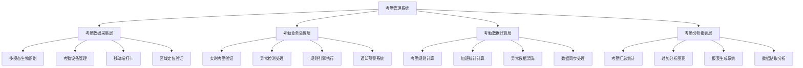
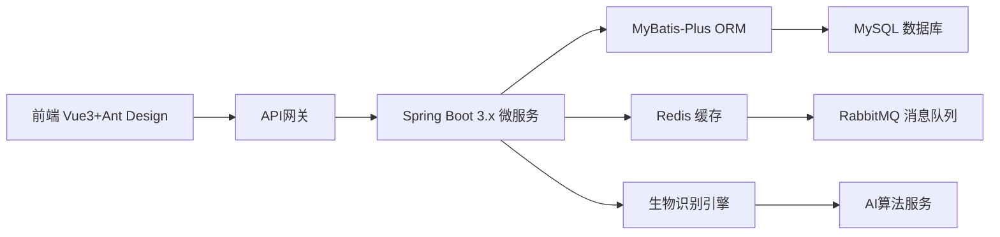
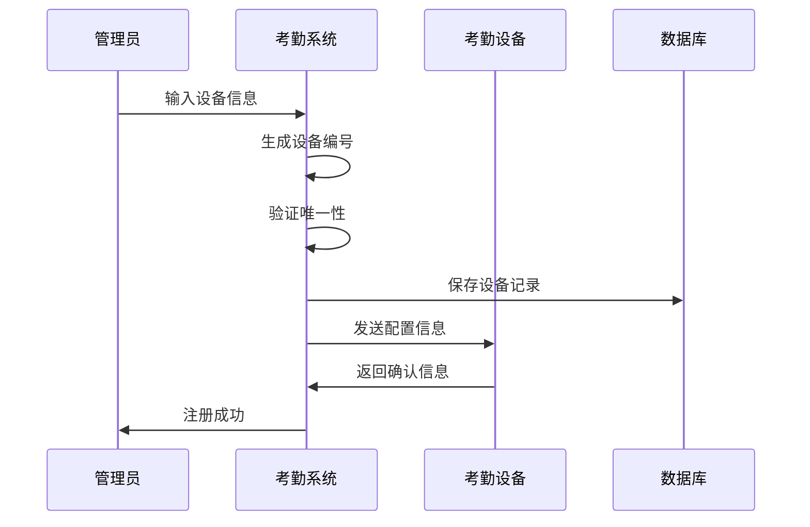
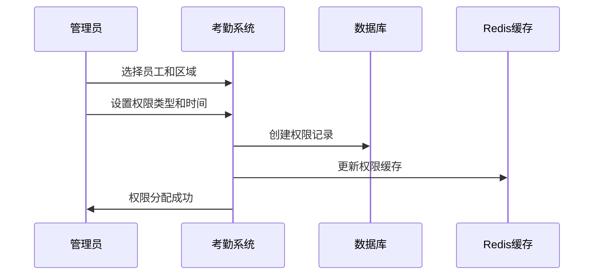
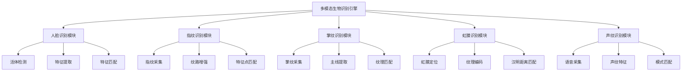

# IOE-DREAM智慧园区考勤管理系统

## 系统概述

IOE-DREAM智慧园区考勤管理系统是一套基于多模态生物识别技术的智能化考勤解决方案，集成了人脸识别、指纹识别、掌纹识别、虹膜识别等多种生物识别技术，结合IC卡、NFC、移动端等多元验证方式，为企业提供全方位、高精度的考勤管理服务。

系统采用分布式架构设计，支持离线考勤、实时监控、异常预警、数据分析等核心功能，满足智慧园区对人员管理的高标准要求。

## 系统架构

### 总体架构图



### 技术架构



## 核心功能模块

### 1. 考勤设备区域管理

负责管理考勤设备、考勤区域以及设备与区域的关联关系，支持多种设备类型和基于位置的考勤管理。

#### 核心数据表

**设备表 (devices)**
```sql
CREATE TABLE t_attendance_devices (
    bigint device_id PK "主键ID，自增长"
    varchar device_no UK "设备编号，唯一标识"
    varchar device_name "设备名称，如：一楼门禁机"
    varchar device_type "设备类型：考勤机/门禁/摄像头/移动端"
    varchar ip_address "设备IP地址，用于网络通信"
    varchar mac_address "设备MAC地址，用于设备识别"
    tinyint device_status "状态：0-离线，1-在线"
    varchar install_location "安装位置，如：一楼大厅"
    json biometric_config "生物识别配置JSON"
    varchar region_code "所属区域编码"
    tinyint deleted_flag "删除标记：0-正常，1-删除"
    bigint create_user_id "创建人ID"
    datetime create_time "创建时间"
    datetime update_time "更新时间"
) COMMENT='考勤设备表';
```

**区域表 (areas)**
```sql
CREATE TABLE t_attendance_areas (
    bigint area_id PK "主键ID，自增长"
    varchar area_name "区域名称，如：办公区A、生产车间"
    varchar area_code UK "区域编码，唯一标识"
    text area_description "区域描述，详细说明区域用途"
    decimal longitude "经度坐标，用于GPS定位"
    decimal latitude "纬度坐标，用于GPS定位"
    int effective_radius "有效半径(米)，打卡有效范围"
    tinyint area_status "状态：0-禁用，1-启用"
    json access_rules "访问规则JSON"
    tinyint deleted_flag "删除标记：0-正常，1-删除"
    bigint create_user_id "创建人ID"
    datetime create_time "创建时间"
    datetime update_time "更新时间"
) COMMENT='考勤区域表';
```

**设备区域关联表 (device_area_relations)**
```sql
CREATE TABLE t_device_area_relations (
    bigint relation_id PK "主键ID，自增长"
    bigint device_id FK "设备ID，关联t_attendance_devices表"
    bigint area_id FK "区域ID，关联t_attendance_areas表"
    varchar relation_type "关联类型：主要设备/备用设备/监控设备"
    tinyint relation_status "状态：0-禁用，1-启用"
    json linkage_config "联动配置JSON"
    tinyint deleted_flag "删除标记：0-正常，1-删除"
    bigint create_user_id "创建人ID"
    datetime create_time "创建时间"
    datetime update_time "更新时间"
) COMMENT='设备区域关联表';
```

**区域员工权限表 (area_employees)**
```sql
CREATE TABLE t_area_employee_permissions (
    bigint permission_id PK "主键ID，自增长"
    bigint area_id FK "区域ID，关联t_attendance_areas表"
    bigint employee_id FK "员工ID，关联employees表"
    varchar permission_type "权限类型：正常打卡/临时访问/禁止进入"
    date effective_date "生效日期，权限开始时间"
    date expire_date "失效日期，权限结束时间"
    json permission_config "权限配置JSON"
    tinyint permission_status "状态：0-禁用，1-启用"
    tinyint deleted_flag "删除标记：0-正常，1-删除"
    bigint create_user_id "创建人ID"
    datetime create_time "创建时间"
    datetime update_time "更新时间"
) COMMENT='区域员工权限表';
```

#### 业务流程

**设备注册流程**


**区域权限分配流程**


#### 关键功能特性

**1. 多类型设备支持**
- 考勤机：支持指纹、人脸、IC卡等多种识别方式
- 门禁设备：集成门禁控制和考勤记录
- 监控摄像头：辅助身份验证和异常检测
- 移动端：支持手机APP打卡和GPS定位

**2. 地理围栏技术**
- 基于GPS坐标的虚拟考勤区域
- 可配置的有效打卡半径
- 支持多边形区域定义
- 实时位置验证和偏移检测

**3. 设备状态监控**
- 实时心跳检测设备在线状态
- 设备故障自动告警机制
- 设备性能指标监控
- 自动切换备用设备

### 2. 考勤规则配置

管理考勤系统的各种规则配置，包括考勤基础规则、预警规则、通知规则、移动端规则等，为考勤计算、异常检测和通知提醒提供规则支撑。

#### 核心数据表

**考勤规则表 (attendance_rules)**
```sql
CREATE TABLE t_attendance_rules (
    bigint rule_id PK "主键ID，自增长"
    varchar rule_name "规则名称，如：标准考勤规则"
    varchar rule_code UK "规则编码，唯一标识"
    varchar rule_type "规则类型：考勤规则/预警规则/通知规则"
    text rule_description "规则描述，详细说明规则用途"
    json rule_config_json "规则配置JSON，包含具体规则参数"
    json warning_config "预警配置JSON，包含预警阈值和级别"
    json notification_config "通知配置JSON，包含通知方式和频率"
    json applicable_scope "适用范围JSON，指定适用部门/岗位/员工"
    tinyint is_enabled "是否启用：0-禁用，1-启用"
    tinyint deleted_flag "删除标记：0-正常，1-删除"
    bigint create_user_id "创建人ID"
    datetime create_time "创建时间"
    datetime update_time "更新时间"
) COMMENT='考勤规则表';
```

**考勤点表 (attendance_points)**
```sql
CREATE TABLE t_attendance_points (
    bigint point_id PK "主键ID，自增长"
    varchar point_name "考勤点名称，如：一楼大厅考勤点"
    varchar point_code UK "考勤点编码，唯一标识"
    decimal longitude "经度坐标，用于GPS定位"
    decimal latitude "纬度坐标，用于GPS定位"
    int effective_radius "有效半径(米)，打卡有效范围"
    bigint device_id FK "关联设备ID，关联t_attendance_devices表"
    json point_config "考勤点配置JSON"
    tinyint point_status "状态：0-禁用，1-启用"
    tinyint deleted_flag "删除标记：0-正常，1-删除"
    bigint create_user_id "创建人ID"
    datetime create_time "创建时间"
    datetime update_time "更新时间"
) COMMENT='考勤点表';
```

**移动端配置表 (mobile_configs)**
```sql
CREATE TABLE t_mobile_configs (
    bigint config_id PK "主键ID，自增长"
    varchar config_name "配置名称，如：移动端考勤配置"
    json location_rules "位置规则JSON，包含GPS精度要求"
    json accuracy_requirements "精度要求JSON，包含定位精度阈值"
    json time_limits "时间限制JSON，包含打卡时间窗口"
    json device_binding_rules "设备绑定规则JSON，包含设备绑定策略"
    tinyint config_status "状态：0-禁用，1-启用"
    tinyint deleted_flag "删除标记：0-正常，1-删除"
    bigint create_user_id "创建人ID"
    datetime create_time "创建时间"
    datetime update_time "更新时间"
) COMMENT='移动端配置表';
```

**预警规则表 (warning_rules)**
```sql
CREATE TABLE t_warning_rules (
    bigint warning_rule_id PK "主键ID，自增长"
    varchar rule_name "规则名称，如：设备联动预警规则"
    varchar rule_code UK "规则编码，唯一标识"
    varchar rule_type "规则类型：设备联动/双重验证/异常检测"
    text rule_description "规则描述，详细说明预警规则用途"
    json device_linkage_config "设备联动配置JSON，包含联动设备信息"
    json verification_rules "验证规则JSON，包含验证方法和阈值"
    json trigger_conditions "触发条件JSON，包含触发条件和阈值"
    json handling_rules "处理规则JSON，包含处理流程和动作"
    json applicable_scope "适用范围JSON，指定适用部门/岗位/员工"
    tinyint is_enabled "是否启用：0-禁用，1-启用"
    tinyint deleted_flag "删除标记：0-正常，1-删除"
    bigint create_user_id "创建人ID"
    datetime create_time "创建时间"
    datetime update_time "更新时间"
) COMMENT='预警规则表';
```

**通知规则表 (notification_rules)**
```sql
CREATE TABLE t_notification_rules (
    bigint notification_rule_id PK "主键ID，自增长"
    varchar rule_name "规则名称，如：打卡提醒通知规则"
    varchar rule_code UK "规则编码，唯一标识"
    varchar rule_type "规则类型：打卡提醒/未打卡通知/考勤异常通知/通用通知"
    text rule_description "规则描述，详细说明通知规则用途"
    json trigger_conditions "触发条件配置JSON，包含触发条件和时间窗口"
    json notification_methods "通知方式配置JSON，包含短信/邮件/微信等"
    json recipient_config "接收人配置JSON，包含接收人类型和范围"
    json frequency_control "频率控制配置JSON，包含通知频率和间隔"
    json escalation_rules "升级规则配置JSON，包含升级条件和动作"
    json reminder_config "提醒配置JSON，包含提醒时间和内容"
    json applicable_scope "适用范围JSON，指定适用部门/岗位/员工"
    tinyint is_enabled "是否启用：0-禁用，1-启用"
    tinyint deleted_flag "删除标记：0-正常，1-删除"
    bigint create_user_id "创建人ID"
    datetime create_time "创建时间"
    datetime update_time "更新时间"
) COMMENT='通知规则表';
```

#### JSON配置结构详解

**考勤规则配置JSON**
```json
{
  "rule_name": "标准考勤规则",
  "attendance_settings": {
    "late_tolerance_minutes": 10,           // 迟到容忍时间
    "early_tolerance_minutes": 10,          // 早退容忍时间
    "absent_threshold_hours": 4,            // 旷工阈值小时数
    "min_work_hours": 8.0,                  // 最小工作时长
    "break_inclusion": false,               // 是否包含休息时间
    "overtime_calculation_method": "daily", // 加班计算方式
    "weekend_overtime_multiplier": 2.0,     // 周末加班倍数
    "holiday_overtime_multiplier": 3.0      // 节假日加班倍数
  },
  "work_time_rules": {
    "flexible_start_time": "08:00",         // 弹性开始时间
    "flexible_end_time": "20:00",           // 弹性结束时间
    "core_start_time": "10:00",             // 核心开始时间
    "core_end_time": "16:00",               // 核心结束时间
    "break_settings": {
      "auto_deduct": true,                  // 自动扣除休息
      "break_duration": 60,                 // 休息时长（分钟）
      "break_start_time": "12:00",          // 休息开始时间
      "break_end_time": "13:00"             // 休息结束时间
    }
  },
  "biometric_verification": {
    "required_methods": ["face", "fingerprint"],  // 必需的生物识别方法
    "confidence_threshold": 0.85,                 // 识别置信度阈值
    "liveness_detection": true,                   // 活体检测
    "multi_factor_enabled": true                  // 多因子验证
  },
  "special_rules": {
    "holiday_handling": "double_pay",       // 节假日处理方式
    "weekend_handling": "normal_overtime",  // 周末处理方式
    "night_shift_settings": {
      "night_start": "22:00",               // 夜班开始时间
      "night_end": "06:00",                 // 夜班结束时间
      "night_shift_bonus": 0.2              // 夜班补贴比例
    }
  }
}
```

**预警配置JSON**
```json
{
  "warning_types": [
    {
      "type": "no_clock_in",               // 预警类型：未打卡
      "threshold": 3,                      // 阈值：连续3次未打卡
      "level": "high",                     // 预警级别：high/medium/low
      "description": "连续3次未打卡预警",
      "auto_actions": ["notify_manager", "notify_hr"]
    },
    {
      "type": "attendance_abnormal",       // 预警类型：考勤异常
      "threshold": 5,                      // 阈值：连续5天考勤异常
      "level": "high",
      "description": "连续5天考勤异常预警",
      "auto_actions": ["notify_manager", "notify_hr", "escalate"]
    },
    {
      "type": "late_frequent",             // 预警类型：频繁迟到
      "threshold": 3,                      // 阈值：7天内迟到3次
      "time_range_days": 7,
      "level": "medium",
      "description": "频繁迟到预警",
      "auto_actions": ["notify_employee", "notify_manager"]
    }
  ],
  "escalation_rules": [
    {
      "condition": "consecutive_days >= 3",
      "action": "notify_manager",
      "description": "连续3天异常通知直属领导"
    },
    {
      "condition": "consecutive_days >= 7",
      "action": "notify_hr",
      "description": "连续7天异常通知HR"
    }
  ]
}
```

**移动端配置JSON**
```json
{
  "location_rules": {
    "gps_accuracy_threshold": 50,          // GPS精度阈值（米）
    "location_tolerance": 100,              // 位置容差（米）
    "wifi_verification": true,              // WiFi验证
    "bluetooth_verification": false,        // 蓝牙验证
    "anti_spoofing_enabled": true          // 防作弊功能
  },
  "accuracy_requirements": {
    "min_location_accuracy": 30,           // 最小定位精度
    "max_location_age": 60,                // 最大定位年龄（秒）
    "required_fix_count": 3,               // 需要的定位点数量
    "location_stability_check": true       // 位置稳定性检查
  },
  "time_limits": {
    "clock_in_window_start": "-120",       // 上班打卡窗口开始（分钟）
    "clock_in_window_end": "60",           // 上班打卡窗口结束（分钟）
    "clock_out_window_start": "-60",       // 下班打卡窗口开始（分钟）
    "clock_out_window_end": "120"          // 下班打卡窗口结束（分钟）
  },
  "device_binding_rules": {
    "device_binding_required": true,        // 设备绑定必需
    "max_devices_per_user": 3,             // 每用户最大设备数
    "device_change_cooldown": 7200,        // 设备更换冷却时间（秒）
    "root_device_detection": true          // Root设备检测
  }
}
```

#### 规则引擎设计

**规则匹配算法**
```java
@Service
public class AttendanceRuleEngine {

    @Resource
    private RuleCacheService ruleCacheService;

    @Resource
    private BiometricVerificationService biometricService;

    /**
     * 执行考勤规则验证
     */
    public RuleExecutionResult executeRules(AttendanceContext context) {
        // 1. 获取适用的规则
        List<AttendanceRule> applicableRules = getApplicableRules(context);

        // 2. 按优先级排序规则
        applicableRules.sort(Comparator.comparing(AttendanceRule::getPriority));

        // 3. 依次执行规则
        for (AttendanceRule rule : applicableRules) {
            RuleResult result = executeRule(rule, context);
            if (!result.isSuccess()) {
                return RuleExecutionResult.failure(result.getErrorMessage());
            }
        }

        return RuleExecutionResult.success();
    }

    /**
     * 执行单个规则
     */
    private RuleResult executeRule(AttendanceRule rule, AttendanceContext context) {
        switch (rule.getRuleType()) {
            case ATTENDANCE_TIME:
                return validateTimeRule(rule, context);
            case BIOMETRIC_VERIFICATION:
                return validateBiometricRule(rule, context);
            case LOCATION_VERIFICATION:
                return validateLocationRule(rule, context);
            case DEVICE_VERIFICATION:
                return validateDeviceRule(rule, context);
            default:
                return RuleResult.success();
        }
    }
}
```

### 3. 考勤汇总报表

负责考勤数据的统计、汇总和报表生成，提供多维度的考勤分析功能，包括个人考勤汇总、部门考勤统计、异常考勤分析等，为管理决策提供数据支撑。

#### 核心数据表

**考勤汇总表 (attendance_summaries)**
```sql
CREATE TABLE t_attendance_summaries (
    bigint summary_id PK "主键ID，自增长"
    bigint employee_id FK "员工ID，关联employees表"
    varchar summary_month "汇总月份，如：2024-01"
    int work_days "应工作天数，如：22天"
    int actual_days "实际出勤天数，如：20天"
    int absent_days "旷工天数，如：2天"
    int late_count "迟到次数，如：3次"
    int early_count "早退次数，如：1次"
    decimal overtime_hours "加班时长(小时)，如：16.0小时"
    decimal weekend_overtime_hours "周末加班时长(小时)，如：8.0小时"
    decimal leave_days "请假天数，如：1.5天"
    decimal attendance_rate "出勤率，如：0.95表示95%"
    json summary_details "汇总详情JSON"
    tinyint deleted_flag "删除标记：0-正常，1-删除"
    bigint create_user_id "创建人ID"
    datetime create_time "创建时间"
    datetime update_time "更新时间"
) COMMENT='考勤汇总表';
```

**部门统计表 (department_statistics)**
```sql
CREATE TABLE t_department_statistics (
    bigint statistics_id PK "主键ID，自增长"
    bigint department_id FK "部门ID，关联departments表"
    varchar statistics_month "统计月份，如：2024-01"
    int total_employees "部门总人数"
    int present_employees "出勤人数"
    int absent_employees "缺勤人数"
    int late_employees "迟到人数"
    decimal attendance_rate "部门出勤率"
    decimal avg_work_hours "平均工作时长"
    decimal total_overtime_hours "总加班时长"
    int exception_count "异常次数"
    json statistics_details "统计详情JSON，包含各类详细统计"
    tinyint deleted_flag "删除标记：0-正常，1-删除"
    bigint create_user_id "创建人ID"
    datetime create_time "创建时间"
    datetime update_time "更新时间"
) COMMENT='部门统计表';
```

**报表模板表 (report_templates)**
```sql
CREATE TABLE t_report_templates (
    bigint template_id PK "主键ID，自增长"
    varchar template_name "模板名称，如：月度考勤报表模板"
    varchar template_type "模板类型：个人报表/部门报表/公司报表"
    varchar template_format "模板格式：PDF/Excel/HTML"
    json template_config "模板配置JSON，包含报表结构和样式"
    json data_source_config "数据源配置JSON，包含数据查询规则"
    tinyint is_default "是否默认模板：0-否，1-是"
    tinyint template_status "状态：0-禁用，1-启用"
    tinyint deleted_flag "删除标记：0-正常，1-删除"
    bigint create_user_id "创建人ID"
    datetime create_time "创建时间"
    datetime update_time "更新时间"
) COMMENT='报表模板表';
```

**报表生成日志表 (report_generation_logs)**
```sql
CREATE TABLE t_report_generation_logs (
    bigint log_id PK "主键ID，自增长"
    varchar report_name "报表名称"
    varchar report_type "报表类型：个人汇总/部门统计/异常分析"
    varchar generation_type "生成类型：手动/定时/批量"
    json generation_parameters "生成参数JSON，包含筛选条件和时间范围"
    varchar file_path "生成文件路径"
    varchar file_format "文件格式：PDF/Excel/CSV"
    bigint generation_time "生成耗时(毫秒)"
    varchar generation_status "生成状态：成功/失败/进行中"
    text error_message "错误信息，生成失败时的错误描述"
    bigint operator_id FK "操作人ID，关联employees表"
    datetime create_time "创建时间，记录生成开始时间"
    datetime complete_time "完成时间，记录生成完成时间"
) COMMENT='报表生成日志表';
```

#### 报表模板配置

**报表模板配置JSON**
```json
{
  "template_name": "月度个人考勤报表",
  "layout": {
    "page_size": "A4",
    "orientation": "portrait",
    "margins": {
      "top": 20,
      "bottom": 20,
      "left": 15,
      "right": 15
    }
  },
  "sections": [
    {
      "section_id": "header",
      "type": "header",
      "content": {
        "title": "员工月度考勤汇总报表",
        "subtitle": "{{month}} {{year}}",
        "company_logo": "logo.png",
        "report_date": "{{generation_date}}"
      }
    },
    {
      "section_id": "employee_info",
      "type": "employee_info",
      "fields": ["employee_name", "employee_no", "department", "position", "employment_date"]
    },
    {
      "section_id": "attendance_summary",
      "type": "summary_table",
      "title": "考勤汇总",
      "metrics": [
        {"key": "work_days", "label": "应出勤天数", "format": "number"},
        {"key": "actual_days", "label": "实际出勤天数", "format": "number"},
        {"key": "attendance_rate", "label": "出勤率", "format": "percentage"},
        {"key": "overtime_hours", "label": "加班时长", "format": "decimal(1)"},
        {"key": "late_count", "label": "迟到次数", "format": "number"}
      ]
    },
    {
      "section_id": "biometric_stats",
      "type": "biometric_summary",
      "title": "生物识别统计",
      "metrics": [
        {"key": "face_recognition_count", "label": "人脸识别次数"},
        {"key": "fingerprint_count", "label": "指纹识别次数"},
        {"key": "palm_print_count", "label": "掌纹识别次数"},
        {"key": "verification_success_rate", "label": "验证成功率", "format": "percentage"}
      ]
    },
    {
      "section_id": "detail_table",
      "type": "detail_table",
      "title": "详细考勤记录",
      "columns": [
        {"key": "date", "label": "日期", "width": 80},
        {"key": "shift_name", "label": "班次", "width": 100},
        {"key": "clock_in_time", "label": "上班打卡", "width": 100},
        {"key": "clock_out_time", "label": "下班打卡", "width": 100},
        {"key": "work_hours", "label": "工作时长", "width": 80},
        {"key": "verification_method", "label": "验证方式", "width": 100},
        {"key": "attendance_status", "label": "状态", "width": 80}
      ]
    },
    {
      "section_id": "charts",
      "type": "chart_section",
      "charts": [
        {
          "chart_id": "attendance_trend",
          "chart_type": "line",
          "title": "月度考勤趋势",
          "data_source": "daily_attendance"
        },
        {
          "chart_id": "method_distribution",
          "chart_type": "pie",
          "title": "验证方式分布",
          "data_source": "verification_methods"
        }
      ]
    }
  ],
  "styles": {
    "font_family": "Arial",
    "font_size": 10,
    "header_color": "#333333",
    "table_border": true,
    "alternating_row_colors": ["#FFFFFF", "#F8F8F8"],
    "company_colors": {
      "primary": "#1890ff",
      "secondary": "#52c41a",
      "accent": "#fa8c16"
    }
  }
}
```

#### 数据统计分析

**统计数据详情JSON**
```json
{
  "attendance_breakdown": {
    "normal_days": 18,
    "late_days": 2,
    "early_days": 1,
    "absent_days": 1,
    "leave_days": 2
  },
  "biometric_analysis": {
    "face_recognition": {
      "total_attempts": 44,
      "successful_attempts": 43,
      "success_rate": 0.977,
      "avg_confidence": 0.92,
      "failed_reasons": ["low_light", "face_occlusion"]
    },
    "fingerprint_recognition": {
      "total_attempts": 22,
      "successful_attempts": 22,
      "success_rate": 1.0,
      "avg_quality": 0.89
    },
    "palm_print_recognition": {
      "total_attempts": 8,
      "successful_attempts": 7,
      "success_rate": 0.875,
      "avg_quality": 0.85
    }
  },
  "time_analysis": {
    "avg_work_hours": 8.2,
    "total_work_hours": 184.5,
    "avg_overtime_hours": 1.5,
    "total_overtime_hours": 33.0,
    "efficiency_score": 87.5
  },
  "exception_analysis": {
    "late_patterns": [
      {
        "frequency": "monday_morning",
        "count": 3,
        "avg_delay": 15,
        "primary_reason": "traffic_congestion"
      }
    ],
    "absence_patterns": [
      {
        "reason": "sick_leave",
        "count": 1,
        "duration": 1
      }
    ],
    "device_exceptions": [
      {
        "device_name": "一楼门禁机",
        "exception_count": 2,
        "exception_types": ["network_timeout", "sensor_error"]
      }
    ]
  },
  "trend_analysis": {
    "attendance_trend": "stable",
    "overtime_trend": "increasing",
    "biometric_adoption": "improving",
    "performance_score": 85.5
  }
}
```

## 多模态生物识别集成

### 生物识别技术架构



### 生物识别数据管理

**生物特征模板表 (biometric_templates)**
```sql
CREATE TABLE t_biometric_templates (
    bigint template_id PK "主键ID，自增长"
    bigint employee_id FK "员工ID，关联employees表"
    varchar biometric_type "生物识别类型：face/fingerprint/palm_print/iris/voice"
    varchar template_version "模板版本号"
    json template_data "模板数据JSON，加密存储"
    json quality_metrics "质量指标JSON"
    date enroll_date "注册日期"
    date last_update_date "最后更新日期"
    tinyint template_status "状态：0-禁用，1-启用，2-过期"
    json security_metadata "安全元数据JSON"
    tinyint deleted_flag "删除标记：0-正常，1-删除"
    bigint create_user_id "创建人ID"
    datetime create_time "创建时间"
    datetime update_time "更新时间"
) COMMENT='生物特征模板表';
```

**生物识别记录表 (biometric_records)**
```sql
CREATE TABLE t_biometric_records (
    bigint record_id PK "主键ID，自增长"
    bigint employee_id FK "员工ID，关联employees表"
    bigint device_id FK "设备ID，关联t_attendance_devices表"
    varchar biometric_type "生物识别类型"
    varchar verification_result "验证结果：success/failure/timeout"
    decimal confidence_score "置信度分数"
    int processing_time "处理时间(毫秒)"
    json feature_vectors "特征向量JSON"
    json verification_metadata "验证元数据JSON"
    varchar failure_reason "失败原因"
    datetime record_time "记录时间"
    tinyint deleted_flag "删除标记：0-正常，1-删除"
) COMMENT='生物识别记录表';
```

### 活体检测与防作弊

**活体检测策略**
```java
@Component
public class LivenessDetectionService {

    /**
     * 多模态活体检测
     */
    public LivenessResult detectLiveness(BiometricInput input) {
        List<LivenessCheck> checks = Arrays.asList(
            new FaceLivenessCheck(),
            new EyeBlinkCheck(),
            new HeadMovementCheck(),
            new LightReflectionCheck(),
            new TextureAnalysisCheck()
        );

        List<LivenessResult> results = checks.parallelStream()
            .map(check -> check.performLivenessCheck(input))
            .collect(Collectors.toList());

        return aggregateResults(results);
    }

    /**
     * 防作弊检测
     */
    public AntiSpoofingResult detectSpoofing(BiometricInput input, Employee employee) {
        return AntiSpoofingResult.builder()
            .deviceBindingCheck(checkDeviceBinding(input, employee))
            .locationConsistencyCheck(checkLocationConsistency(input, employee))
            .timeConsistencyCheck(checkTimeConsistency(input))
            .behaviorPatternCheck(checkBehaviorPattern(employee))
            .build();
    }
}
```

## 系统安全机制

### 国密算法支持

```java
@Service
public class CryptographicService {

    /**
     * SM4加密生物特征数据
     */
    public String encryptBiometricData(byte[] rawData) {
        try {
            SM4Engine sm4Engine = new SM4Engine();
            byte[] key = KeyGenerator.generateSM4Key();
            byte[] encryptedData = sm4Engine.encrypt(rawData, key);
            return Base64.getEncoder().encodeToString(encryptedData);
        } catch (Exception e) {
            throw new CryptographicException("生物特征数据加密失败", e);
        }
    }

    /**
     * SM3数据完整性校验
     */
    public String calculateDataHash(String data) {
        SM3Digest sm3 = new SM3Digest();
        byte[] dataBytes = data.getBytes(StandardCharsets.UTF_8);
        sm3.update(dataBytes, 0, dataBytes.length);
        byte[] hash = new byte[sm3.getDigestSize()];
        sm3.doFinal(hash, 0);
        return Hex.toHexString(hash);
    }
}
```

### 数据隐私保护

**差分隐私机制**
```java
@Component
public class DifferentialPrivacyService {

    /**
     * 为统计数据添加拉普拉斯噪声
     */
    public double addLaplaceNoise(double trueValue, double epsilon) {
        // 拉普拉斯分布采样
        double scale = 1.0 / epsilon;
        double noise = generateLaplaceNoise(0, scale);
        return trueValue + noise;
    }

    /**
     * K-匿名化处理
     */
    public List<AttendanceRecord> kAnonymize(List<AttendanceRecord> records, int k) {
        Map<String, List<AttendanceRecord>> groups = records.stream()
            .collect(Collectors.groupingBy(record ->
                record.getDepartment() + "_" + record.getAgeGroup()));

        return groups.entrySet().stream()
            .filter(entry -> entry.getValue().size() >= k)
            .flatMap(entry -> entry.getValue().stream())
            .collect(Collectors.toList());
    }
}
```

## 性能优化策略

### 分布式架构

```java
@Service
public class DistributedAttendanceService {

    @Resource
    private RedisTemplate<String, Object> redisTemplate;

    @Resource
    private RabbitTemplate rabbitTemplate;

    /**
     * 异步处理考勤记录
     */
    @Async("attendanceExecutor")
    public CompletableFuture<Void> processAttendanceAsync(AttendanceRecord record) {
        try {
            // 发送到消息队列
            rabbitTemplate.convertAndSend("attendance.queue", record);
            return CompletableFuture.completedFuture(null);
        } catch (Exception e) {
            throw new AttendanceProcessingException("异步处理考勤记录失败", e);
        }
    }

    /**
     * 批量聚合统计数据
     */
    @Scheduled(fixedRate = 300000) // 每5分钟执行一次
    public void aggregateStatistics() {
        List<AttendanceRecord> records = getPendingRecords();

        Map<String, List<AttendanceRecord>> groupedRecords = records.stream()
            .collect(Collectors.groupingBy(record ->
                record.getEmployeeId() + "_" + record.getDate()));

        groupedRecords.values().parallelStream()
            .forEach(this::processGroupedRecords);
    }
}
```

### 缓存策略

```java
@Service
public class AttendanceCacheService {

    @Cacheable(value = "attendance_rules", key = "#employeeId + '_' + #ruleType")
    public List<AttendanceRule> getEmployeeRules(Long employeeId, String ruleType) {
        return ruleRepository.findByEmployeeIdAndRuleType(employeeId, ruleType);
    }

    @CacheEvict(value = "attendance_summaries", key = "#employeeId + '_' + #month")
    public void invalidateAttendanceSummary(Long employeeId, String month) {
        // 清除缓存
    }

    @Cacheable(value = "biometric_templates", key = "#employeeId + '_' + #biometricType")
    public BiometricTemplate getBiometricTemplate(Long employeeId, String biometricType) {
        return biometricTemplateRepository.findByEmployeeIdAndBiometricType(employeeId, biometricType);
    }
}
```

## 系统监控与运维

### 性能监控指标

```java
@Component
public class AttendanceMetrics {

    private final MeterRegistry meterRegistry;
    private final Counter attendanceRequestCounter;
    private final Timer attendanceProcessingTimer;
    private final Gauge biometricAccuracyGauge;

    public AttendanceMetrics(MeterRegistry meterRegistry) {
        this.meterRegistry = meterRegistry;
        this.attendanceRequestCounter = Counter.builder("attendance.requests.total")
            .description("总考勤请求数")
            .register(meterRegistry);
        this.attendanceProcessingTimer = Timer.builder("attendance.processing.time")
            .description("考勤处理时间")
            .register(meterRegistry);
        this.biometricAccuracyGauge = Gauge.builder("biometric.accuracy")
            .description("生物识别准确率")
            .register(meterRegistry, this, AttendanceMetrics::calculateBiometricAccuracy);
    }

    /**
     * 记录考勤请求
     */
    public void recordAttendanceRequest(String result) {
        attendanceRequestCounter.increment(Tags.of("result", result));
    }

    /**
     * 记录处理时间
     */
    public void recordProcessingTime(Duration duration, String operation) {
        attendanceProcessingTimer.record(duration, Tags.of("operation", operation));
    }

    /**
     * 计算生物识别准确率
     */
    private double calculateBiometricAccuracy() {
        // 实现准确率计算逻辑
        return 0.95; // 示例值
    }
}
```

### 健康检查机制

```java
@Component
public class AttendanceHealthIndicator implements HealthIndicator {

    @Resource
    private BiometricEngineHealthChecker biometricHealthChecker;

    @Resource
    private DatabaseHealthChecker databaseHealthChecker;

    @Override
    public Health health() {
        Health.Builder builder = Health.up();

        // 检查生物识别引擎健康状态
        Health biometricHealth = biometricHealthChecker.check();
        if (biometricHealth.getStatus() != Status.UP) {
            return Health.down()
                .withDetail("biometric_engine", "不可用")
                .build();
        }

        // 检查数据库连接
        Health databaseHealth = databaseHealthChecker.check();
        if (databaseHealth.getStatus() != Status.UP) {
            return Health.down()
                .withDetail("database", "连接异常")
                .build();
        }

        return builder
            .withDetail("biometric_engine", "正常")
            .withDetail("database", "连接正常")
            .withDetail("active_connections", getActiveConnectionCount())
            .build();
    }
}
```

## API接口设计

### RESTful API 规范

```java
@RestController
@RequestMapping("/api/v1/attendance")
@Api(tags = "考勤管理API")
public class AttendanceController {

    /**
     * 考勤打卡
     */
    @PostMapping("/clock")
    @ApiOperation(value = "考勤打卡", notes = "支持多模态生物识别验证")
    public ResponseDTO<ClockResult> clockAttendance(
            @Valid @RequestBody ClockRequest request) {

        ClockResult result = attendanceService.processClockIn(request);
        return ResponseDTO.ok(result);
    }

    /**
     * 获取考勤记录
     */
    @GetMapping("/records")
    @ApiOperation(value = "获取考勤记录", notes = "分页查询个人考勤记录")
    public ResponseDTO<PageResult<AttendanceRecordVO>> getAttendanceRecords(
            @RequestParam Long employeeId,
            @RequestParam String startDate,
            @RequestParam String endDate,
            @RequestParam(defaultValue = "1") Integer pageNum,
            @RequestParam(defaultValue = "20") Integer pageSize) {

        PageResult<AttendanceRecordVO> result = attendanceService.getAttendanceRecords(
            employeeId, startDate, endDate, pageNum, pageSize);
        return ResponseDTO.ok(result);
    }

    /**
     * 获取考勤汇总
     */
    @GetMapping("/summary")
    @ApiOperation(value = "获取考勤汇总", notes = "获取个人月度考勤汇总")
    public ResponseDTO<AttendanceSummaryVO> getAttendanceSummary(
            @RequestParam Long employeeId,
            @RequestParam String month) {

        AttendanceSummaryVO summary = attendanceService.getAttendanceSummary(employeeId, month);
        return ResponseDTO.ok(summary);
    }

    /**
     * 生物识别注册
     */
    @PostMapping("/biometric/register")
    @ApiOperation(value = "生物识别注册", notes = "注册新的生物特征模板")
    public ResponseDTO<Void> registerBiometric(
            @Valid @RequestBody BiometricRegistrationRequest request) {

        biometricService.registerTemplate(request);
        return ResponseDTO.ok();
    }

    /**
     * 验证生物识别
     */
    @PostMapping("/biometric/verify")
    @ApiOperation(value = "验证生物识别", notes = "验证生物识别身份")
    public ResponseDTO<BiometricVerificationResult> verifyBiometric(
            @Valid @RequestBody BiometricVerificationRequest request) {

        BiometricVerificationResult result = biometricService.verifyIdentity(request);
        return ResponseDTO.ok(result);
    }
}
```

### WebSocket 实时通信

```java
@Component
@EnableWebSocket
public class AttendanceWebSocketHandler implements WebSocketHandler {

    @Override
    public void afterConnectionEstablished(WebSocketSession session) {
        // 连接建立后的处理逻辑
        SessionManager.addSession(session);
    }

    @Override
    public void handleMessage(WebSocketSession session, WebSocketMessage<?> message) {
        try {
            String payload = message.getPayload().toString();
            AttendanceMessage attendanceMessage = JsonUtils.fromJson(payload, AttendanceMessage.class);

            // 处理实时考勤消息
            processRealTimeAttendance(session, attendanceMessage);

        } catch (Exception e) {
            logger.error("处理WebSocket消息失败", e);
        }
    }

    @Override
    public void afterConnectionClosed(WebSocketSession session, CloseStatus status) {
        // 连接关闭后的处理逻辑
        SessionManager.removeSession(session);
    }

    /**
     * 广播考勤状态更新
     */
    public void broadcastAttendanceUpdate(AttendanceStatusUpdate update) {
        String message = JsonUtils.toJson(update);
        SessionManager.getAllSessions().parallelStream()
            .filter(session -> session.isOpen())
            .forEach(session -> {
                try {
                    session.sendMessage(new TextMessage(message));
                } catch (IOException e) {
                    logger.error("发送WebSocket消息失败", e);
                }
            });
    }
}
```

## 部署架构

### 容器化部署

```yaml
# docker-compose.yml
version: '3.8'
services:
  attendance-service:
    image: ioe-dream/attendance-service:latest
    ports:
      - "8080:8080"
    environment:
      - SPRING_PROFILES_ACTIVE=prod
      - DB_HOST=mysql
      - REDIS_HOST=redis
      - RABBITMQ_HOST=rabbitmq
    depends_on:
      - mysql
      - redis
      - rabbitmq
    volumes:
      - /opt/logs:/app/logs
      - /opt/upload:/app/upload
    deploy:
      resources:
        limits:
          cpus: '2.0'
          memory: 4G
        reservations:
          cpus: '1.0'
          memory: 2G

  biometric-engine:
    image: ioe-dream/biometric-engine:latest
    ports:
      - "9090:9090"
    environment:
      - ENGINE_TYPE=multi_modal
      - MAX_CONCURRENT_REQUESTS=100
    volumes:
      - /opt/models:/app/models
    deploy:
      resources:
        limits:
          cpus: '4.0'
          memory: 8G
        reservations:
          cpus: '2.0'
          memory: 4G

  mysql:
    image: mysql:8.0
    environment:
      - MYSQL_ROOT_PASSWORD=secure_password
      - MYSQL_DATABASE=attendance_db
    volumes:
      - mysql_data:/var/lib/mysql
    deploy:
      resources:
        limits:
          cpus: '2.0'
          memory: 4G

  redis:
    image: redis:7-alpine
    command: redis-server --requirepass secure_redis_password
    volumes:
      - redis_data:/data
    deploy:
      resources:
        limits:
          cpus: '1.0'
          memory: 2G

  rabbitmq:
    image: rabbitmq:3.11-management
    environment:
      - RABBITMQ_DEFAULT_USER=admin
      - RABBITMQ_DEFAULT_PASS=secure_password
    volumes:
      - rabbitmq_data:/var/lib/rabbitmq
    deploy:
      resources:
        limits:
          cpus: '1.0'
          memory: 2G

volumes:
  mysql_data:
  redis_data:
  rabbitmq_data:
```

### Kubernetes 部署

```yaml
# k8s-deployment.yaml
apiVersion: apps/v1
kind: Deployment
metadata:
  name: attendance-service
  labels:
    app: attendance-service
spec:
  replicas: 3
  selector:
    matchLabels:
      app: attendance-service
  template:
    metadata:
      labels:
        app: attendance-service
    spec:
      containers:
      - name: attendance-service
        image: ioe-dream/attendance-service:latest
        ports:
        - containerPort: 8080
        env:
        - name: SPRING_PROFILES_ACTIVE
          value: "prod"
        - name: DB_HOST
          value: "mysql-service"
        - name: REDIS_HOST
          value: "redis-service"
        - name: RABBITMQ_HOST
          value: "rabbitmq-service"
        resources:
          requests:
            memory: "2Gi"
            cpu: "1000m"
          limits:
            memory: "4Gi"
            cpu: "2000m"
        livenessProbe:
          httpGet:
            path: /actuator/health
            port: 8080
          initialDelaySeconds: 60
          periodSeconds: 30
        readinessProbe:
          httpGet:
            path: /actuator/health/readiness
            port: 8080
          initialDelaySeconds: 30
          periodSeconds: 10

---
apiVersion: v1
kind: Service
metadata:
  name: attendance-service
spec:
  selector:
    app: attendance-service
  ports:
    - protocol: TCP
      port: 80
      targetPort: 8080
  type: LoadBalancer
```

## 系统集成与扩展

### 第三方系统集成

**门禁系统集成**
```java
@Service
public class AccessControlIntegrationService {

    @Resource
    private AccessControlClient accessControlClient;

    /**
     * 考勤通过后联动门禁
     */
    public void triggerAccessControl(AttendanceRecord record) {
        AccessControlRequest request = AccessControlRequest.builder()
            .employeeId(record.getEmployeeId())
            .deviceId(record.getDeviceId())
            .accessType(ACCESS_TYPE.ENTRY)
            .timestamp(record.getClockTime())
            .verificationMethod(record.getVerificationMethod())
            .build();

        try {
            AccessControlResponse response = accessControlClient.processAccess(request);
            if (!response.isSuccess()) {
                logger.warn("门禁联动失败: {}", response.getErrorMessage());
            }
        } catch (Exception e) {
            logger.error("门禁系统集成异常", e);
        }
    }
}
```

**HR系统集成**
```java
@Service
public class HRIntegrationService {

    @Resource
    private HRSystemClient hrSystemClient;

    /**
     * 同步员工信息到HR系统
     */
    public void syncEmployeeToHR(Employee employee) {
        try {
            HREmployeeDTO hrEmployee = HREmployeeDTO.builder()
                .employeeId(employee.getEmployeeId())
                .employeeNo(employee.getEmployeeNo())
                .name(employee.getEmployeeName())
                .department(employee.getDepartmentName())
                .position(employee.getPositionName())
                .employmentDate(employee.getEmploymentDate())
                .attendanceRequired(employee.isAttendanceRequired())
                .build();

            hrSystemClient.syncEmployee(hrEmployee);
        } catch (Exception e) {
            logger.error("同步员工信息到HR系统失败", e);
        }
    }

    /**
     * 推送考勤数据到HR系统
     */
    @Scheduled(fixedRate = 3600000) // 每小时同步一次
    public void pushAttendanceDataToHR() {
        List<AttendanceSummary> summaries = attendanceService.getUnsyncedSummaries();

        for (AttendanceSummary summary : summaries) {
            try {
                HRAttendanceDTO hrData = convertToHRAttendance(summary);
                hrSystemClient.receiveAttendanceData(hrData);

                // 标记为已同步
                attendanceService.markAsSynced(summary.getSummaryId());
            } catch (Exception e) {
                logger.error("推送考勤数据到HR系统失败, summaryId: {}", summary.getSummaryId(), e);
            }
        }
    }
}
```

通过以上全面的系统设计，IOE-DREAM智慧园区考勤管理系统能够提供高度集成、安全可靠、性能优异的考勤管理服务，满足现代智慧园区对人员管理的各种需求。系统采用先进的多模态生物识别技术，结合完善的安全机制和优化策略，为企业提供全方位的考勤管理解决方案。