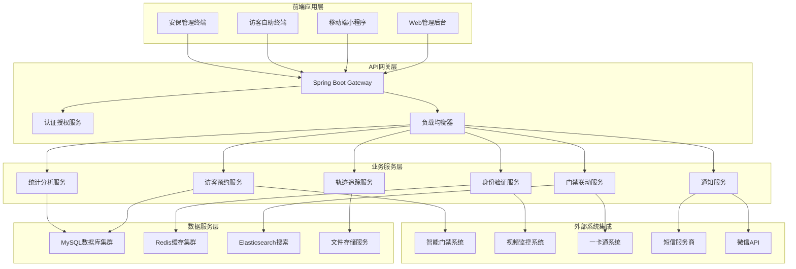
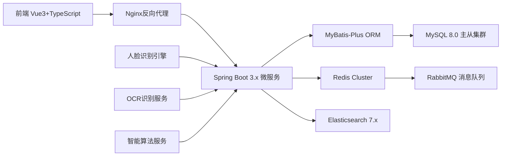
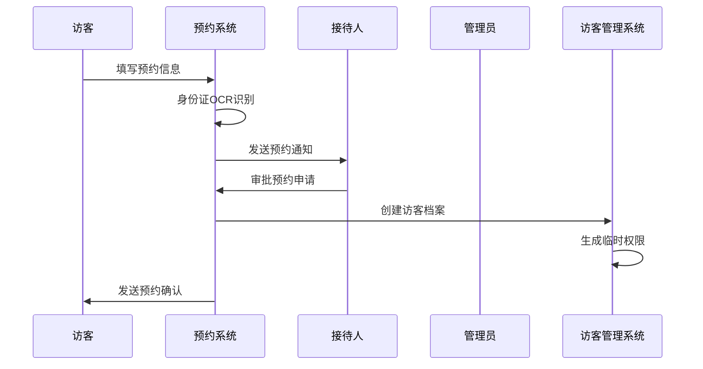
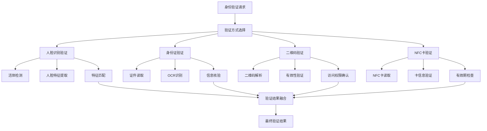

# IOE-DREAM智慧园区访客管理系统

## 系统概述

IOE-DREAM智慧园区访客管理系统是一套基于现代Web技术和多模态生物识别技术构建的智能化访客管理解决方案，作为IOE-DREAM智慧园区一卡通管理平台的重要组成部分，为园区提供全方位、高效率、高安全性的访客管理服务。

系统采用前后端分离架构，整合预约登记、身份验证、门禁联动、轨迹追踪、访客评价等功能，通过与智能门禁系统、考勤管理系统、智能视频监控系统、一卡通管理系统的深度集成，实现访客从预约到离开的全流程数字化管理。

### 核心特性

#### 访客预约与登记
- **在线预约系统**：支持微信小程序、网页、APP多渠道预约
- **智能表单填写**：自动化表单生成，支持OCR身份证识别
- **预约审批流程**：多级审批机制，支持自动和人工审批
- **预约时间管理**：灵活的预约时间段配置，避免冲突

#### 多模态身份验证
- **人脸识别验证**：高精度人脸匹配，支持活体检测
- **身份证件验证**：集成身份证、护照等证件读取设备
- **二维码/条形码验证**：生成动态二维码，支持扫码入场
- **NFC卡片验证**：支持访客卡发放和读取
- **生物特征融合**：多因子认证，提高验证准确性

#### 智能门禁联动
- **自动门禁授权**：预约成功后自动生成临时门禁权限
- **访问区域控制**：精确控制访客可访问的区域范围
- **通行时间限制**：灵活设置访问时间段和时长限制
- **多人同行管理**：支持团体访客的统一管理

#### 全程轨迹追踪
- **实时位置监控**：通过与视频监控系统集成，实时追踪访客位置
- **访问行为记录**：详细记录访客在各区域的访问时间和行为
- **异常行为预警**：自动检测访客异常行为并触发预警
- **离场自动提醒**：超时未离场自动提醒相关责任人

#### 访客服务体验
- **智能导航引导**：提供园区导航服务，引导访客到达目的地
- **访客评价系统**：收集访客服务体验反馈
- **消息通知服务**：通过短信、微信等多渠道发送通知
- **访客数据统计**：提供访客流量、访问时长等统计分析

## 系统架构

### 总体架构图



### 技术架构



## 核心功能模块

### 1. 访客预约管理模块

负责访客预约的创建、审批、管理等功能，支持多种预约方式和审批流程。

#### 核心数据表

**访客预约表 (visitor_appointments)**
```sql
CREATE TABLE t_visitor_appointments (
    bigint appointment_id PK "主键ID，自增长"
    varchar appointment_no UK "预约编号，唯一标识"
    varchar appointment_title "预约主题"
    text appointment_description "预约描述"
    bigint visitor_id FK "访客ID，关联t_visitors表"
    bigint host_employee_id FK "接待员工ID，关联employees表"
    bigint host_department_id FK "接待部门ID，关联departments表"
    datetime planned_arrival_time "计划到达时间"
    datetime planned_departure_time "计划离开时间"
    int expected_visitor_count "预期访客人数"
    varchar visit_purpose "访问目的：商务/技术/面试/其他"
    varchar appointment_status "预约状态：待审批/已批准/已拒绝/已完成/已取消"
    varchar approval_level "审批级别：一级/二级/三级"
    bigint approver_id FK "审批人ID，关联employees表"
    datetime approval_time "审批时间"
    text approval_remarks "审批备注"
    json access_permission "访问权限JSON，包含区域和时间权限"
    json special_requirements "特殊要求JSON"
    varchar emergency_contact "紧急联系人"
    varchar emergency_phone "紧急联系电话"
    tinyint deleted_flag "删除标记：0-正常，1-删除"
    bigint create_user_id "创建人ID"
    datetime create_time "创建时间"
    datetime update_time "更新时间"
) COMMENT='访客预约表';
```

**访客信息表 (visitors)**
```sql
CREATE TABLE t_visitors (
    bigint visitor_id PK "主键ID，自增长"
    varchar visitor_name "访客姓名"
    varchar gender "性别：男/女"
    varchar id_card_type "证件类型：身份证/护照/港澳台通行证"
    varchar id_card_no UK "证件号码，唯一标识"
    varchar phone_number "手机号码"
    varchar email "电子邮箱"
    varchar company_name "公司/单位名称"
    varchar position "职位"
    varchar nationality "国籍"
    date birth_date "出生日期"
    text address "地址"
    varchar photo_url "照片URL"
    json biometric_data "生物特征数据JSON，加密存储"
    varchar id_card_front_url "身份证正面照片URL"
    varchar id_card_back_url "身份证背面照片URL"
    json face_features "人脸特征JSON"
    date last_visit_date "最后访问日期"
    int total_visit_count "累计访问次数"
    varchar visitor_category "访客类别：VIP/普通/黑名单"
    tinyint verification_status "验证状态：未验证/已验证/验证失败"
    tinyint deleted_flag "删除标记：0-正常，1-删除"
    bigint create_user_id "创建人ID"
    datetime create_time "创建时间"
    datetime update_time "更新时间"
) COMMENT='访客信息表';
```

**访客访问记录表 (visitor_visits)**
```sql
CREATE TABLE t_visitor_visits (
    bigint visit_id PK "主键ID，自增长"
    bigint appointment_id FK "预约ID，关联t_visitor_appointments表"
    bigint visitor_id FK "访客ID，关联t_visitors表"
    varchar visit_no UK "访问编号，唯一标识"
    datetime actual_arrival_time "实际到达时间"
    datetime actual_departure_time "实际离开时间"
    varchar visit_status "访问状态：进行中/已完成/提前离开"
    varchar verification_method "验证方式：人脸识别/身份证/二维码/访客卡"
    json access_granted_areas "授权访问区域JSON"
    int duration_minutes "访问时长（分钟）"
    varchar access_card_no "访客卡号"
    datetime access_card_issue_time "访客卡发放时间"
    datetime access_card_return_time "访客卡回收时间"
    json visit_trajectory "访问轨迹JSON，包含各区域访问记录"
    text visit_notes "访问备注"
    varchar host_evaluation "接待人评价：优秀/良好/一般/差"
    text host_evaluation_comment "接待人评价备注"
    varchar visitor_evaluation "访客评价：优秀/良好/一般/差"
    text visitor_evaluation_comment "访客评价备注"
    tinyint deleted_flag "删除标记：0-正常，1-删除"
    bigint create_user_id "创建人ID"
    datetime create_time "创建时间"
    datetime update_time "更新时间"
) COMMENT='访客访问记录表';
```

#### 业务流程设计

**访客预约流程**


**预约审批引擎**
```java
@Service
public class AppointmentApprovalEngine {

    @Resource
    private ApprovalRuleService ruleService;

    @Resource
    private EmployeeService employeeService;

    @Resource
    private NotificationService notificationService;

    /**
     * 处理预约审批
     */
    public ApprovalResult processApproval(AppointmentRequest request) {
        // 1. 获取审批规则
        ApprovalRules rules = ruleService.getApprovalRules(request);

        // 2. 确定审批级别
        ApprovalLevel level = determineApprovalLevel(request, rules);

        // 3. 执行审批逻辑
        switch (level) {
            case AUTO_APPROVAL:
                return autoApprove(request);
            case SINGLE_APPROVAL:
                return singleApproval(request, rules.getSingleApprover());
            case MULTI_APPROVAL:
                return multiLevelApproval(request, rules.getApprovalChain());
            case SPECIAL_APPROVAL:
                return specialApproval(request, rules);
            default:
                return ApprovalResult.failure("未知的审批级别");
        }
    }

    /**
     * 自动审批
     */
    private ApprovalResult autoApprove(AppointmentRequest request) {
        // 检查基础条件
        if (validateBasicConditions(request)) {
            // 生成访客权限
            generateAccessPermissions(request);
            // 发送确认通知
            notificationService.sendConfirmation(request);
            return ApprovalResult.success("自动审批通过");
        }
        return ApprovalResult.failure("自动审批条件不满足");
    }

    /**
     * 多级审批
     */
    private ApprovalResult multiLevelApproval(AppointmentRequest request,
                                           List<ApprovalStep> approvalChain) {
        for (ApprovalStep step : approvalChain) {
            ApprovalResult result = processApprovalStep(request, step);
            if (!result.isSuccess()) {
                return result;
            }
            // 记录审批步骤
            recordApprovalStep(request, step, result);
        }
        return ApprovalResult.success("多级审批全部通过");
    }
}
```

### 2. 身份验证模块

负责访客身份的多模态验证，包括人脸识别、身份证验证、二维码验证等多种方式。

#### 多模态验证架构



#### 人脸识别验证

```java
@Service
public class FaceVerificationService {

    @Resource
    private FaceRecognitionEngine faceEngine;

    @Resource
    private LivenessDetectionService livenessService;

    @Resource
    private VisitorRepository visitorRepository;

    /**
     * 人脸识别验证
     */
    public FaceVerificationResult verifyFace(FaceVerificationRequest request) {
        try {
            // 1. 活体检测
            LivenessResult livenessResult = livenessService.detectLiveness(request.getFaceImage());
            if (!livenessResult.isLive()) {
                return FaceVerificationResult.failure("活体检测失败");
            }

            // 2. 人脸特征提取
            FaceFeatures extractedFeatures = faceEngine.extractFeatures(request.getFaceImage());

            // 3. 特征匹配
            if (request.getVisitorId() != null) {
                // 特定访客验证
                return verifySpecificVisitor(extractedFeatures, request.getVisitorId());
            } else {
                // 通用访客搜索
                return searchVisitorByFace(extractedFeatures);
            }

        } catch (Exception e) {
            logger.error("人脸识别验证失败", e);
            return FaceVerificationResult.error("系统异常");
        }
    }

    /**
     * 验证特定访客
     */
    private FaceVerificationResult verifySpecificVisitor(FaceFeatures features, Long visitorId) {
        Visitor visitor = visitorRepository.findById(visitorId);
        if (visitor == null || visitor.getFaceFeatures() == null) {
            return FaceVerificationResult.failure("访客信息不存在或未注册人脸特征");
        }

        FaceFeatures storedFeatures = FaceFeatures.fromJson(visitor.getFaceFeatures());
        double similarity = faceEngine.calculateSimilarity(features, storedFeatures);

        if (similarity >= 0.8) { // 80%相似度阈值
            return FaceVerificationResult.success(visitor, similarity);
        } else {
            return FaceVerificationResult.failure("人脸相似度不足");
        }
    }

    /**
     * 通过人脸搜索访客
     */
    private FaceVerificationResult searchVisitorByFace(FaceFeatures features) {
        List<Visitor> allVisitors = visitorRepository.findAllWithFaceFeatures();

        Visitor bestMatch = null;
        double bestSimilarity = 0.0;

        for (Visitor visitor : allVisitors) {
            FaceFeatures storedFeatures = FaceFeatures.fromJson(visitor.getFaceFeatures());
            double similarity = faceEngine.calculateSimilarity(features, storedFeatures);

            if (similarity > bestSimilarity) {
                bestSimilarity = similarity;
                bestMatch = visitor;
            }
        }

        if (bestSimilarity >= 0.8) {
            return FaceVerificationResult.success(bestMatch, bestSimilarity);
        } else {
            return FaceVerificationResult.failure("未找到匹配的访客");
        }
    }
}
```

#### 身份证验证

```java
@Service
public class IdCardVerificationService {

    @Resource
    private IDCardReaderService cardReaderService;

    @Resource
    private OCRService ocrService;

    @Resource
    private VisitorRepository visitorRepository;

    /**
     * 身份证验证
     */
    public IdCardVerificationResult verifyIdCard(IdCardVerificationRequest request) {
        try {
            // 1. 读取身份证信息
            IDCardInfo cardInfo;
            if (request.getCardImage() != null) {
                // OCR识别
                cardInfo = ocrService.recognizeIDCard(request.getCardImage());
            } else if (request.getCardReaderData() != null) {
                // 读卡器数据
                cardInfo = cardReaderService.parseCardData(request.getCardReaderData());
            } else {
                return IdCardVerificationResult.failure("缺少身份证信息");
            }

            // 2. 验证身份证格式和有效性
            if (!validateIdCard(cardInfo)) {
                return IdCardVerificationResult.failure("身份证信息无效");
            }

            // 3. 查找访客记录
            Visitor visitor = visitorRepository.findByIdCardNo(cardInfo.getIdCardNo());
            if (visitor != null) {
                // 已有访客记录
                return IdCardVerificationResult.success(visitor, cardInfo, false);
            } else {
                // 新访客，需要创建记录
                return IdCardVerificationResult.success(null, cardInfo, true);
            }

        } catch (Exception e) {
            logger.error("身份证验证失败", e);
            return IdCardVerificationResult.error("系统异常");
        }
    }

    /**
     * 验证身份证信息
     */
    private boolean validateIdCard(IDCardInfo cardInfo) {
        // 1. 基本信息完整性检查
        if (StringUtils.isEmpty(cardInfo.getName()) ||
            StringUtils.isEmpty(cardInfo.getIdCardNo()) ||
            cardInfo.getBirthDate() == null) {
            return false;
        }

        // 2. 身份证号码格式验证
        if (!isValidIdCardFormat(cardInfo.getIdCardNo())) {
            return false;
        }

        // 3. 出生日期合理性验证
        LocalDate birthDate = cardInfo.getBirthDate();
        if (birthDate.isAfter(LocalDate.now().minusYears(16)) ||
            birthDate.isBefore(LocalDate.now().minusYears(120))) {
            return false;
        }

        return true;
    }
}
```

### 3. 门禁联动模块

负责访客门禁权限的生成、管理、撤销等功能，与智能门禁系统深度集成。

#### 门禁权限管理

```java
@Service
public class VisitorAccessControlService {

    @Resource
    private AccessControlSystemClient accessControlClient;

    @Resource
    private VisitorVisitRepository visitRepository;

    @Resource
    private AreaService areaService;

    /**
     * 生成访客门禁权限
     */
    public AccessPermissionResult generateAccessPermission(VisitorVisit visit) {
        try {
            // 1. 确定访问区域
            List<Area> allowedAreas = determineAllowedAreas(visit);

            // 2. 生成访问权限
            AccessPermission permission = AccessPermission.builder()
                .userId(visit.getVisitorId())
                .userType(UserType.VISITOR)
                .allowedAreas(allowedAreas.stream()
                    .map(Area::getAreaId)
                    .collect(Collectors.toList()))
                .startTime(visit.getActualArrivalTime())
                .endTime(visit.getPlannedDepartureTime())
                .accessType(AccessType.TEMPORARY)
                .build();

            // 3. 下发权限到门禁系统
            AccessControlResult result = accessControlClient.grantAccessPermission(permission);

            if (result.isSuccess()) {
                // 4. 记录权限信息
                visit.setAccessCardNo(result.getCardNumber());
                visit.setAccessCardIssueTime(LocalDateTime.now());
                visitRepository.save(visit);

                return AccessPermissionResult.success(result.getCardNumber(), allowedAreas);
            } else {
                return AccessPermissionResult.failure(result.getErrorMessage());
            }

        } catch (Exception e) {
            logger.error("生成访客门禁权限失败", e);
            return AccessPermissionResult.error("系统异常");
        }
    }

    /**
     * 撤销访客门禁权限
     */
    public void revokeAccessPermission(VisitorVisit visit) {
        try {
            if (StringUtils.isNotEmpty(visit.getAccessCardNo())) {
                accessControlClient.revokeAccessPermission(
                    visit.getVisitorId(), visit.getAccessCardNo());

                // 更新访客记录
                visit.setAccessCardReturnTime(LocalDateTime.now());
                visitRepository.save(visit);
            }
        } catch (Exception e) {
            logger.error("撤销访客门禁权限失败", e);
        }
    }

    /**
     * 确定允许访问的区域
     */
    private List<Area> determineAllowedAreas(VisitorVisit visit) {
        Appointment appointment = visit.getAppointment();

        // 获取默认访问区域
        List<Area> defaultAreas = areaService.getDefaultVisitorAreas();

        // 获取预约指定区域
        List<Area> appointmentAreas = extractAppointmentAreas(appointment);

        // 合并并去重
        return Stream.concat(defaultAreas.stream(), appointmentAreas.stream())
            .distinct()
            .collect(Collectors.toList());
    }
}
```

#### 实时门禁事件处理

```java
@Component
public class AccessControlEventHandler {

    @Resource
    private VisitorTrackingService trackingService;

    @Resource
    private AlertService alertService;

    @Resource
    private NotificationService notificationService;

    /**
     * 处理门禁事件
     */
    @EventListener
    public void handleAccessControlEvent(AccessControlEvent event) {
        if (event.getUserType() == UserType.VISITOR) {
            switch (event.getEventType()) {
                case ACCESS_GRANTED:
                    handleVisitorAccessGranted(event);
                    break;
                case ACCESS_DENIED:
                    handleVisitorAccessDenied(event);
                    break;
                case AREA_ENTERED:
                    handleVisitorAreaEntered(event);
                    break;
                case AREA_EXITED:
                    handleVisitorAreaExited(event);
                    break;
            }
        }
    }

    /**
     * 处理访客进入事件
     */
    private void handleVisitorAccessGranted(AccessControlEvent event) {
        // 1. 开始轨迹追踪
        trackingService.startTracking(event.getUserId(), event.getAreaId());

        // 2. 通知接待人
        notificationService.notifyHostVisitorArrival(
            event.getUserId(), event.getAreaId());

        // 3. 记录进入日志
        logVisitorEntry(event);
    }

    /**
     * 处理访客拒绝事件
     */
    private void handleVisitorAccessDenied(AccessControlEvent event) {
        // 1. 检查是否为异常情况
        if (isAnomalousDenial(event)) {
            // 2. 触发安全预警
            alertService.triggerSecurityAlert(
                AlertType.UNAUTHORIZED_ACCESS_ATTEMPT, event);
        }

        // 3. 通知安保人员
        notificationService.notifySecurityStaff(event);
    }
}
```

### 4. 轨迹追踪模块

负责访客在园区内的实时位置追踪和行为分析。

```java
@Service
public class VisitorTrackingService {

    @Resource
    private VideoTrackingEngine trackingEngine;

    @Resource
    private AccessControlService accessControlService;

    @Resource
    private VisitorVisitRepository visitRepository;

    /**
     * 开始访客追踪
     */
    public void startTracking(Long visitorId, Long areaId) {
        VisitorVisit visit = visitRepository.findByVisitorIdAndStatus(
            visitorId, VisitStatus.IN_PROGRESS);

        if (visit != null) {
            // 1. 注册访客人脸特征到追踪系统
            registerVisitorForTracking(visitorId);

            // 2. 开始轨迹记录
            VisitorTrackingContext context = VisitorTrackingContext.builder()
                .visitorId(visitorId)
                .visitId(visit.getVisitId())
                .currentAreaId(areaId)
                .startTime(LocalDateTime.now())
                .allowedAreas(extractAllowedAreas(visit))
                .build();

            trackingEngine.startTracking(context);
        }
    }

    /**
     * 更新访客位置
     */
    @Scheduled(fixedRate = 5000) // 每5秒更新一次
    public void updateVisitorLocations() {
        List<VisitorTrackingContext> activeTrackings =
            trackingEngine.getActiveTrackings();

        for (VisitorTrackingContext context : activeTrackings) {
            try {
                // 1. 获取当前位置
                VisitorLocation currentLocation =
                    trackingEngine.getCurrentLocation(context.getVisitorId());

                if (currentLocation != null) {
                    // 2. 验证位置合法性
                    validateVisitorLocation(context, currentLocation);

                    // 3. 更新轨迹记录
                    updateVisitorTrajectory(context, currentLocation);
                }

            } catch (Exception e) {
                logger.error("更新访客位置失败: " + context.getVisitorId(), e);
            }
        }
    }

    /**
     * 验证访客位置合法性
     */
    private void validateVisitorLocation(VisitorTrackingContext context,
                                       VisitorLocation location) {
        // 1. 检查是否在授权区域
        if (!isInAllowedArea(location.getAreaId(), context.getAllowedAreas())) {
            handleUnauthorizedAreaAccess(context, location);
        }

        // 2. 检查访问时间
        if (isVisitTimeExpired(context)) {
            handleVisitTimeExceeded(context);
        }

        // 3. 检查异常行为
        VisitorBehavior behavior = analyzeVisitorBehavior(context, location);
        if (behavior.isSuspicious()) {
            handleSuspiciousBehavior(context, behavior);
        }
    }
}
```

### 5. 统计分析模块

提供访客数据的统计分析和报表功能。

#### 访客统计分析

```java
@Service
public class VisitorStatisticsService {

    @Resource
    private VisitorVisitRepository visitRepository;

    @Resource
    private AppointmentRepository appointmentRepository;

    /**
     * 生成访客统计报告
     */
    public VisitorStatisticsReport generateStatisticsReport(
            LocalDate startDate, LocalDate endDate, StatisticsType type) {

        switch (type) {
            case DAILY:
                return generateDailyStatistics(startDate, endDate);
            case WEEKLY:
                return generateWeeklyStatistics(startDate, endDate);
            case MONTHLY:
                return generateMonthlyStatistics(startDate, endDate);
            case CUSTOM:
                return generateCustomStatistics(startDate, endDate);
            default:
                throw new IllegalArgumentException("不支持的统计类型");
        }
    }

    /**
     * 生成月度统计
     */
    private VisitorStatisticsReport generateMonthlyStatistics(LocalDate startDate,
                                                             LocalDate endDate) {
        // 1. 基础统计数据
        VisitorBasicStats basicStats = calculateBasicStats(startDate, endDate);

        // 2. 访客流量分析
        VisitorFlowAnalysis flowAnalysis = analyzeVisitorFlow(startDate, endDate);

        // 3. 访问时长分析
        VisitDurationAnalysis durationAnalysis = analyzeVisitDuration(startDate, endDate);

        // 4. 访客来源分析
        VisitorSourceAnalysis sourceAnalysis = analyzeVisitorSource(startDate, endDate);

        // 5. 满意度分析
        SatisfactionAnalysis satisfactionAnalysis = analyzeSatisfaction(startDate, endDate);

        return VisitorStatisticsReport.builder()
            .period(startDate, endDate)
            .basicStats(basicStats)
            .flowAnalysis(flowAnalysis)
            .durationAnalysis(durationAnalysis)
            .sourceAnalysis(sourceAnalysis)
            .satisfactionAnalysis(satisfactionAnalysis)
            .generationTime(LocalDateTime.now())
            .build();
    }

    /**
     * 计算基础统计数据
     */
    private VisitorBasicStats calculateBasicStats(LocalDate startDate, LocalDate endDate) {
        List<VisitorVisit> visits = visitRepository.findByVisitDateBetween(startDate, endDate);

        int totalVisitors = (int) visits.stream()
            .map(VisitorVisit::getVisitorId)
            .distinct()
            .count();

        int totalAppointments = appointmentRepository.countByDateBetween(startDate, endDate);

        int completedVisits = (int) visits.stream()
            .filter(v -> v.getVisitStatus() == VisitStatus.COMPLETED)
            .count();

        double completionRate = totalAppointments > 0 ?
            (double) completedVisits / totalAppointments : 0.0;

        return VisitorBasicStats.builder()
            .totalVisitors(totalVisitors)
            .totalAppointments(totalAppointments)
            .completedVisits(completedVisits)
            .completionRate(completionRate)
            .build();
    }
}
```

### 6. 通知服务模块

负责向访客、接待人、安保人员等发送各类通知消息。

#### 多渠道通知服务

```java
@Service
public class NotificationService {

    @Resource
    private SMSService smsService;

    @Resource
    private WeChatService weChatService;

    @Resource
    private EmailService emailService;

    @Resource
    private PushNotificationService pushService;

    /**
     * 发送预约确认通知
     */
    public void sendAppointmentConfirmation(Appointment appointment) {
        Visitor visitor = appointment.getVisitor();
        Employee host = appointment.getHostEmployee();

        // 1. 发送给访客
        sendToVisitor(visitor, createVisitorConfirmationMessage(appointment));

        // 2. 发送给接待人
        sendToHost(host, createHostNotificationMessage(appointment));
    }

    /**
     * 发送访客到达通知
     */
    public void notifyHostVisitorArrival(Long visitorId, Long areaId) {
        VisitorVisit visit = visitRepository.findByVisitorIdAndStatus(
            visitorId, VisitStatus.IN_PROGRESS);

        if (visit != null) {
            Employee host = visit.getAppointment().getHostEmployee();

            // 多渠道通知
            VisitorArrivalMessage message = createVisitorArrivalMessage(visit, areaId);
            sendToHost(host, message);

            // 紧急情况下可以电话通知
            if (isUrgentVisit(visit)) {
                notifyHostByPhone(host, message);
            }
        }
    }

    /**
     * 发送多渠道消息
     */
    private void sendToVisitor(Visitor visitor, NotificationMessage message) {
        List<CompletableFuture<Void>> futures = new ArrayList<>();

        // 1. 短信通知
        if (StringUtils.isNotEmpty(visitor.getPhoneNumber())) {
            futures.add(CompletableFuture.runAsync(() ->
                smsService.sendSMS(visitor.getPhoneNumber(), message.getSMSContent())));
        }

        // 2. 微信通知
        if (StringUtils.isNotEmpty(visitor.getOpenId())) {
            futures.add(CompletableFuture.runAsync(() ->
                weChatService.sendTemplateMessage(visitor.getOpenId(), message.getWeChatTemplate())));
        }

        // 3. 邮件通知
        if (StringUtils.isNotEmpty(visitor.getEmail())) {
            futures.add(CompletableFuture.runAsync(() ->
                emailService.sendEmail(visitor.getEmail(), message.getEmailSubject(),
                                   message.getEmailContent())));
        }

        // 等待所有通知完成
        CompletableFuture.allOf(futures.toArray(new CompletableFuture[0]))
            .exceptionally(throwable -> {
                logger.error("发送访客通知失败", throwable);
                return null;
            });
    }
}
```

## 系统安全机制

### 数据隐私保护

```java
@Service
public class VisitorDataPrivacyService {

    @Resource
    private EncryptionService encryptionService;

    /**
     * 加密访客敏感信息
     */
    public Visitor encryptSensitiveData(Visitor visitor) {
        try {
            // 1. 加密身份证号码
            if (StringUtils.isNotEmpty(visitor.getIdCardNo())) {
                visitor.setIdCardNo(encryptionService.encrypt(visitor.getIdCardNo()));
            }

            // 2. 加密手机号码
            if (StringUtils.isNotEmpty(visitor.getPhoneNumber())) {
                visitor.setPhoneNumber(encryptionService.encrypt(visitor.getPhoneNumber()));
            }

            // 3. 加密生物特征数据
            if (StringUtils.isNotEmpty(visitor.getBiometricData())) {
                visitor.setBiometricData(encryptionService.encrypt(visitor.getBiometricData()));
            }

            // 4. 加密人脸特征
            if (StringUtils.isNotEmpty(visitor.getFaceFeatures())) {
                visitor.setFaceFeatures(encryptionService.encrypt(visitor.getFaceFeatures()));
            }

            return visitor;

        } catch (Exception e) {
            logger.error("加密访客敏感数据失败", e);
            throw new DataEncryptionException("数据加密失败", e);
        }
    }

    /**
     * 数据脱敏展示
     */
    public Visitor maskSensitiveData(Visitor visitor) {
        Visitor maskedVisitor = new Visitor();
        BeanUtils.copyProperties(visitor, maskedVisitor);

        // 身份证脱敏
        if (StringUtils.isNotEmpty(visitor.getIdCardNo())) {
            maskedVisitor.setIdCardNo(maskIdCard(visitor.getIdCardNo()));
        }

        // 手机号脱敏
        if (StringUtils.isNotEmpty(visitor.getPhoneNumber())) {
            maskedVisitor.setPhoneNumber(maskPhoneNumber(visitor.getPhoneNumber()));
        }

        return maskedVisitor;
    }

    /**
     * 身份证脱敏
     */
    private String maskIdCard(String idCard) {
        if (idCard.length() <= 8) {
            return idCard;
        }
        return idCard.substring(0, 4) + "********" + idCard.substring(idCard.length() - 4);
    }

    /**
     * 手机号脱敏
     */
    private String maskPhoneNumber(String phoneNumber) {
        if (phoneNumber.length() <= 7) {
            return phoneNumber;
        }
        return phoneNumber.substring(0, 3) + "****" + phoneNumber.substring(phoneNumber.length() - 4);
    }
}
```

### 访客黑名单管理

```java
@Service
public class VisitorBlacklistService {

    @Resource
    private VisitorRepository visitorRepository;

    @Resource
    private AccessControlClient accessControlClient;

    /**
     * 检查访客是否在黑名单
     */
    public BlacklistCheckResult checkBlacklist(Visitor visitor) {
        // 1. 检查访客ID
        if (isBlacklistedVisitor(visitor.getVisitorId())) {
            return BlacklistCheckResult.blacklisted("访客ID在黑名单中");
        }

        // 2. 检查身份证号码
        if (StringUtils.isNotEmpty(visitor.getIdCardNo()) &&
            isBlacklistedIdCard(visitor.getIdCardNo())) {
            return BlacklistCheckResult.blacklisted("身份证号码在黑名单中");
        }

        // 3. 检查手机号码
        if (StringUtils.isNotEmpty(visitor.getPhoneNumber()) &&
            isBlacklistedPhone(visitor.getPhoneNumber())) {
            return BlacklistCheckResult.blacklisted("手机号码在黑名单中");
        }

        // 4. 人脸特征匹配
        if (StringUtils.isNotEmpty(visitor.getFaceFeatures()) &&
            matchesBlacklistedFace(visitor.getFaceFeatures())) {
            return BlacklistCheckResult.blacklisted("人脸特征匹配黑名单");
        }

        return BlacklistCheckResult.passed();
    }

    /**
     * 添加访客到黑名单
     */
    @Transactional
    public void addToBlacklist(Long visitorId, String reason, String operator) {
        Visitor visitor = visitorRepository.findById(visitorId);
        if (visitor != null) {
            // 1. 更新访客状态
            visitor.setVisitorCategory("黑名单");
            visitorRepository.save(visitor);

            // 2. 撤销所有有效权限
            revokeAllPermissions(visitorId);

            // 3. 通知相关系统
            notifyBlacklistChange(visitorId, reason, operator);

            // 4. 记录操作日志
            logBlacklistOperation(visitorId, reason, operator);
        }
    }
}
```

## 性能优化策略

### 缓存策略

```java
@Service
public class VisitorCacheService {

    @Resource
    private RedisTemplate<String, Object> redisTemplate;

    @Resource
    private VisitorRepository visitorRepository;

    /**
     * 缓存访客信息
     */
    @Cacheable(value = "visitor_info", key = "#visitorId", unless = "#result == null")
    public Visitor getVisitorInfo(Long visitorId) {
        return visitorRepository.findById(visitorId);
    }

    /**
     * 缓存访客预约
     */
    @Cacheable(value = "visitor_appointments", key = "#visitorId + '_' + #date")
    public List<Appointment> getVisitorAppointments(Long visitorId, LocalDate date) {
        return appointmentRepository.findByVisitorIdAndDate(visitorId, date);
    }

    /**
     * 缓存访问权限
     */
    @Cacheable(value = "access_permissions", key = "#visitorId")
    public AccessPermission getAccessPermission(Long visitorId) {
        return accessControlService.getVisitorPermission(visitorId);
    }

    /**
     * 批量预热缓存
     */
    @Scheduled(fixedRate = 300000) // 每5分钟执行一次
    public void warmupCache() {
        // 预热当日访客信息
        LocalDate today = LocalDate.now();
        List<Long> todayVisitorIds = appointmentRepository.findVisitorIdsByDate(today);

        todayVisitorIds.parallelStream().forEach(visitorId -> {
            try {
                getVisitorInfo(visitorId);
                getVisitorAppointments(visitorId, today);
            } catch (Exception e) {
                logger.error("预热缓存失败: " + visitorId, e);
            }
        });
    }
}
```

### 异步处理

```java
@Service
public class AsyncVisitorService {

    @Resource
    private NotificationService notificationService;

    @Resource
    private TrackingService trackingService;

    @Resource
    private StatisticsService statisticsService;

    /**
     * 异步处理访客到访事件
     */
    @Async("visitorTaskExecutor")
    public CompletableFuture<Void> processVisitorArrivalAsync(VisitorArrivalEvent event) {
        try {
            // 1. 发送通知
            notificationService.notifyHostVisitorArrival(
                event.getVisitorId(), event.getAreaId());

            // 2. 开始追踪
            trackingService.startTracking(event.getVisitorId(), event.getAreaId());

            // 3. 更新统计数据
            statisticsService.updateDailyStatistics(event.getVisitDate());

            return CompletableFuture.completedFuture(null);

        } catch (Exception e) {
            logger.error("异步处理访客到访事件失败", e);
            return CompletableFuture.failedFuture(e);
        }
    }

    /**
     * 异步处理访客离开事件
     */
    @Async("visitorTaskExecutor")
    public CompletableFuture<Void> processVisitorDepartureAsync(VisitorDepartureEvent event) {
        try {
            // 1. 停止追踪
            trackingService.stopTracking(event.getVisitorId());

            // 2. 撤销权限
            accessControlService.revokeAccessPermission(event.getVisitorId());

            // 3. 发送评价邀请
            notificationService.sendEvaluationInvitation(event.getVisitorId());

            // 4. 更新统计数据
            statisticsService.updateVisitStatistics(event.getVisitId());

            return CompletableFuture.completedFuture(null);

        } catch (Exception e) {
            logger.error("异步处理访客离开事件失败", e);
            return CompletableFuture.failedFuture(e);
        }
    }
}
```

## 部署架构

### 微服务部署

```yaml
# docker-compose.yml for visitor management system
version: '3.8'
services:
  visitor-gateway:
    image: ioe-dream/visitor-gateway:latest
    ports:
      - "8080:8080"
    environment:
      - SPRING_PROFILES_ACTIVE=prod
    depends_on:
      - visitor-appointment
      - visitor-verification
      - visitor-tracking
    networks:
      - visitor-network

  visitor-appointment:
    image: ioe-dream/visitor-appointment:latest
    environment:
      - DB_HOST=mysql
      - REDIS_HOST=redis
      - RABBITMQ_HOST=rabbitmq
    depends_on:
      - mysql
      - redis
      - rabbitmq
    networks:
      - visitor-network

  visitor-verification:
    image: ioe-dream/visitor-verification:latest
    environment:
      - DB_HOST=mysql
      - REDIS_HOST=redis
      - FACE_RECOGNITION_ENGINE_URL=http://face-recognition-engine:9090
    depends_on:
      - mysql
      - redis
      - face-recognition-engine
    networks:
      - visitor-network

  visitor-tracking:
    image: ioe-dream/visitor-tracking:latest
    environment:
      - DB_HOST=mysql
      - REDIS_HOST=redis
      - VIDEO_SYSTEM_URL=http://video-system:8081
    depends_on:
      - mysql
      - redis
      - video-system
    networks:
      - visitor-network

  face-recognition-engine:
    image: ioe-dream/face-recognition-engine:latest
    ports:
      - "9090:9090"
    volumes:
      - /opt/face-models:/app/models
    networks:
      - visitor-network

networks:
  visitor-network:
    driver: bridge
```

### Kubernetes部署配置

```yaml
# k8s-deployment.yaml
apiVersion: apps/v1
kind: Deployment
metadata:
  name: visitor-management
  labels:
    app: visitor-management
spec:
  replicas: 3
  selector:
    matchLabels:
      app: visitor-management
  template:
    metadata:
      labels:
        app: visitor-management
    spec:
      containers:
      - name: visitor-management
        image: ioe-dream/visitor-management:latest
        ports:
        - containerPort: 8080
        env:
        - name: SPRING_PROFILES_ACTIVE
          value: "k8s"
        - name: DB_HOST
          value: "mysql-service"
        - name: REDIS_HOST
          value: "redis-service"
        resources:
          requests:
            memory: "1Gi"
            cpu: "500m"
          limits:
            memory: "2Gi"
            cpu: "1000m"
        livenessProbe:
          httpGet:
            path: /actuator/health
            port: 8080
          initialDelaySeconds: 60
          periodSeconds: 30
        readinessProbe:
          httpGet:
            path: /actuator/health/readiness
            port: 8080
          initialDelaySeconds: 30
          periodSeconds: 10

---
apiVersion: v1
kind: Service
metadata:
  name: visitor-management-service
spec:
  selector:
    app: visitor-management
  ports:
    - protocol: TCP
      port: 80
      targetPort: 8080
  type: LoadBalancer
```

## API接口设计

### RESTful API

```java
@RestController
@RequestMapping("/api/v1/visitor")
@Api(tags = "访客管理API")
public class VisitorManagementController {

    @Resource
    private VisitorAppointmentService appointmentService;

    @Resource
    private VisitorVerificationService verificationService;

    @Resource
    private VisitorTrackingService trackingService;

    /**
     * 创建访客预约
     */
    @PostMapping("/appointments")
    @ApiOperation(value = "创建访客预约", notes = "支持在线预约和批量预约")
    public ResponseDTO<AppointmentResult> createAppointment(
            @Valid @RequestBody AppointmentRequest request) {

        AppointmentResult result = appointmentService.createAppointment(request);
        return ResponseDTO.ok(result);
    }

    /**
     * 审批预约
     */
    @PostMapping("/appointments/{appointmentId}/approve")
    @ApiOperation(value = "审批预约", notes = "支持批准和拒绝操作")
    public ResponseDTO<Void> approveAppointment(
            @PathVariable Long appointmentId,
            @Valid @RequestBody ApprovalRequest request) {

        appointmentService.approveAppointment(appointmentId, request);
        return ResponseDTO.ok();
    }

    /**
     * 访客身份验证
     */
    @PostMapping("/verification")
    @ApiOperation(value = "访客身份验证", notes = "支持多种验证方式")
    public ResponseDTO<VerificationResult> verifyVisitor(
            @Valid @RequestBody VerificationRequest request) {

        VerificationResult result = verificationService.verifyVisitor(request);
        return ResponseDTO.ok(result);
    }

    /**
     * 获取访客轨迹
     */
    @GetMapping("/tracking/{visitorId}")
    @ApiOperation(value = "获取访客轨迹", notes = "实时轨迹查询")
    public ResponseDTO<VisitorTrajectory> getVisitorTrajectory(
            @PathVariable Long visitorId) {

        VisitorTrajectory trajectory = trackingService.getVisitorTrajectory(visitorId);
        return ResponseDTO.ok(trajectory);
    }

    /**
     * 访客签到
     */
    @PostMapping("/checkin")
    @ApiOperation(value = "访客签到", notes = "访客到达签到")
    public ResponseDTO<CheckinResult> visitorCheckin(
            @Valid @RequestBody CheckinRequest request) {

        CheckinResult result = visitorService.visitorCheckin(request);
        return ResponseDTO.ok(result);
    }

    /**
     * 访客签退
     */
    @PostMapping("/checkout")
    @ApiOperation(value = "访客签退", notes = "访客离开签退")
    public ResponseDTO<CheckoutResult> visitorCheckout(
            @Valid @RequestBody CheckoutRequest request) {

        CheckoutResult result = visitorService.visitorCheckout(request);
        return ResponseDTO.ok(result);
    }
}
```

### WebSocket实时通信

```java
@Component
@EnableWebSocket
public class VisitorWebSocketHandler implements WebSocketHandler {

    @Resource
    private VisitorTrackingService trackingService;

    @Override
    public void afterConnectionEstablished(WebSocketSession session) {
        // 连接建立，根据权限类型订阅相应的消息
        String userType = session.getAttributes().get("userType").toString();

        switch (userType) {
            case "HOST":
                SessionManager.addHostSession(session);
                break;
            case "SECURITY":
                SessionManager.addSecuritySession(session);
                break;
            case "ADMIN":
                SessionManager.addAdminSession(session);
                break;
        }
    }

    @Override
    public void handleMessage(WebSocketSession session, WebSocketMessage<?> message) {
        try {
            String payload = message.getPayload().toString();
            VisitorMessage visitorMessage = JsonUtils.fromJson(payload, VisitorMessage.class);

            // 处理不同类型的访客相关消息
            switch (visitorMessage.getType()) {
                case TRACKING_REQUEST:
                    handleTrackingRequest(session, visitorMessage);
                    break;
                case EMERGENCY_ALERT:
                    handleEmergencyAlert(session, visitorMessage);
                    break;
                case STATUS_UPDATE:
                    handleStatusUpdate(session, visitorMessage);
                    break;
            }

        } catch (Exception e) {
            logger.error("处理WebSocket消息失败", e);
        }
    }

    /**
     * 广播访客事件
     */
    public void broadcastVisitorEvent(VisitorEvent event) {
        String message = JsonUtils.toJson(event);

        // 根据事件类型向不同用户组广播
        switch (event.getType()) {
            case VISITOR_ARRIVAL:
                broadcastToHosts(message);
                break;
            case UNAUTHORIZED_ACCESS:
                broadcastToSecurity(message);
                break;
            case EMERGENCY_SITUATION:
                broadcastToAll(message);
                break;
            default:
                broadcastToAdmins(message);
        }
    }
}
```

通过以上全面的系统设计，IOE-DREAM智慧园区访客管理系统能够提供现代化、智能化、安全高效的访客管理服务，通过与园区其他系统的深度集成，实现访客管理的全流程数字化和智能化，为智慧园区建设提供重要的支撑。